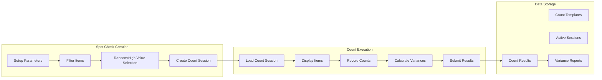
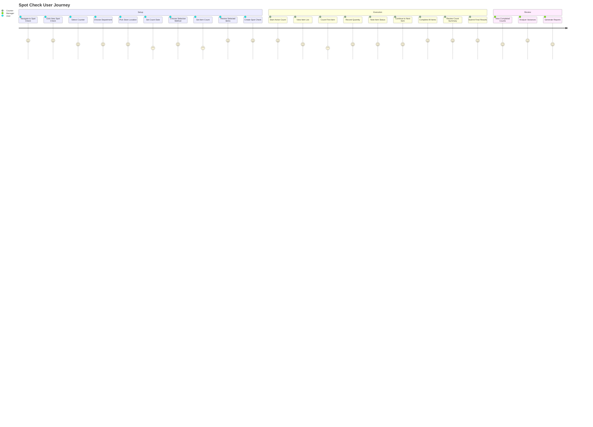
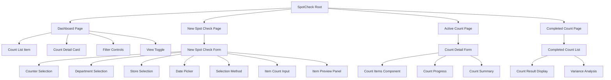
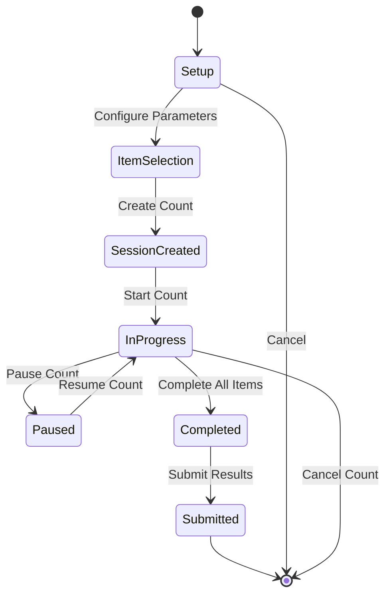

# Spot Check Module - Complete Site Map

## Module Navigation Structure

```mermaid
graph TD
    %% Main Module Entry
    A[Spot Check Module<br/>/inventory-management/spot-check] --> B[Main Spot Check Page<br/>/spot-check]
    A --> C[Dashboard<br/>/spot-check/dashboard]
    A --> D[New Spot Check<br/>/spot-check/new]
    A --> E[Active Counts<br/>/spot-check/active]
    A --> F[Completed Counts<br/>/spot-check/completed]

    %% Main Page Components
    B --> G[Count Detail Modal<br/>CountDetailForm]
    B --> H[List View<br/>CountListItem]
    B --> I[Grid View<br/>CountDetailCard]
    B --> J[Filter Controls<br/>Search + Dropdowns]
    B --> K[Location Filter Panel<br/>Conditional Display]

    %% Dashboard Components
    C --> L[Statistics Cards<br/>Active Counters, Items, Reviews]
    C --> M[Active Counts Panel<br/>Real-time Monitoring]
    C --> N[Pending Reviews Panel<br/>Approval Queue]
    C --> O[Latest Activities Panel<br/>Activity Feed]

    %% New Spot Check Components
    D --> P[Creation Form<br/>NewSpotCheckForm]
    D --> Q[Item Preview Panel<br/>Selected Items Display]
    D --> R[Form Validation<br/>Zod Schema]

    %% Active Counts Components
    E --> S[Active Count Detail<br/>/spot-check/active/[id]]
    E --> T[Status Filters<br/>Filter Controls]
    E --> U[Count Session Cards<br/>Progress Display]

    %% Active Count Detail Components
    S --> V[Count Interface<br/>CountDetailForm]
    S --> W[Session Controls<br/>Pause/Complete]
    S --> X[Progress Tracking<br/>Real-time Updates]

    %% Completed Counts Components
    F --> Y[Completed Count Detail<br/>/spot-check/completed/[id]]
    F --> Z[Search & Filters<br/>Search Bar + Date Filter]
    F --> AA[Export Options<br/>Download Buttons]

    %% Data Flow Connections
    P -.->|Creates| S
    S -.->|Completes| Y
    V -.->|Submits| F

    %% Modal/Overlay Connections
    G -.->|Modal over| B
    V -.->|Full screen| S
```

## Data Flow Diagram



## User Flow Paths



## Component Hierarchy



## Workflow States



## Page Structure Summary

| Page | Route | Components | Key Features |
|------|-------|------------|--------------|
| Dashboard | `/spot-check` | CountListItem, CountDetailCard, Filters | List/Grid view, Status filtering |
| New Count | `/spot-check/new` | NewSpotCheckForm, ItemPreview | Form validation, Real-time preview |
| Active Count | `/spot-check/active/[id]` | CountDetailForm, CountItems | Item counting, Progress tracking |
| Completed | `/spot-check/completed` | CompletedCountList | Results viewing, Variance analysis |

*Generated: September 25, 2025*
*Source: Complete codebase analysis of Spot Check module*