# Inventory Management - Pages and Components Specification

> **Screenshots Status**: This specification includes references to screenshots. **40 screenshots** are now available in the `screenshots/` folder:
>
> **Inventory Management Core (18 screenshots)**:
> - ✅ inventory-management-dashboard.png
> - ✅ stock-overview-main.png
> - ✅ inventory-balance-report.png
> - ✅ stock-cards-list.png
> - ✅ stock-card-detail.png
> - ✅ slow-moving-report.png
> - ✅ inventory-aging-report.png
> - ✅ stock-in-list.png
> - ✅ inventory-adjustments-list.png
> - ✅ inventory-adjustment-detail.png
> - ✅ physical-count-setup.png
> - ✅ physical-count-dashboard.png
> - ✅ spot-check-main.png
> - ✅ spot-check-new.png
> - ✅ spot-check-active.png
> - ✅ spot-check-dashboard.png
> - ✅ fractional-inventory.png
> - ✅ period-end.png
>
> **Plus 22 additional screenshots** for procurement, store operations, and workflow components
>
> Only 2 screenshots pending (dynamic routes requiring specific IDs): stock-in-detail.png, physical-count-active.png

## Table of Contents

1. [Pages Overview](#pages-overview)
2. [Modals and Dialogs](#modals-and-dialogs)
3. [Dropdown Fields Reference](#dropdown-fields-reference)
4. [Actions and Buttons Reference](#actions-and-buttons-reference)
5. [Form Components](#form-components)
6. [Data Display Components](#data-display-components)
7. [Glossary](#glossary)

---

## Pages Overview

### Landing Page
**Path**: `/inventory-management`
**File**: `app/(main)/inventory-management/page.tsx`

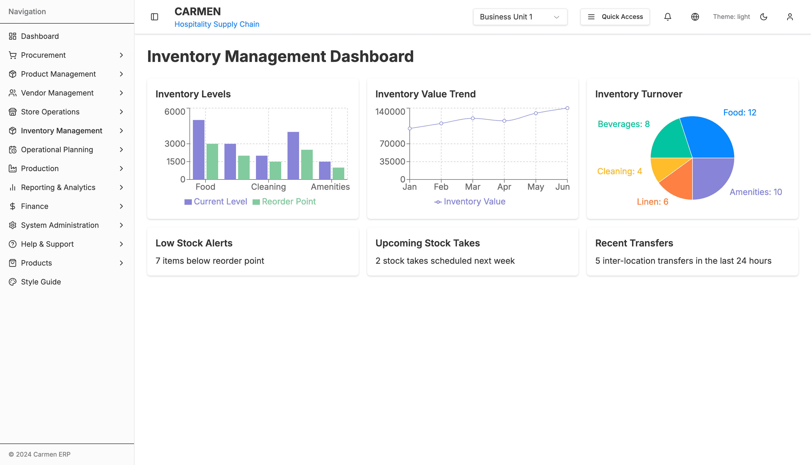
*Inventory Management Dashboard - Draggable widget system with real-time analytics*

**Status**: ✅ Production

**Purpose**: Main entry point for Inventory Management module with customizable dashboard

**Components**:
- 6 Draggable widgets using React Beautiful DnD
- Inventory Levels Bar Chart
- Inventory Value Trend Line Chart
- Inventory Turnover Pie Chart
- Low Stock Alerts Card
- Upcoming Stock Takes Card
- Recent Transfers Card

**Actions**:
- Drag and reorder widgets
- Navigate to Stock Overview
- Navigate to Stock In
- Navigate to Inventory Adjustments
- Navigate to Physical Count
- Navigate to Spot Check

#### Action Flows

**Navigate to Stock Overview**:
```mermaid
flowchart LR
    Click["Click Stock Overview"] --> Navigate["Navigate to /stock-overview"]
    Navigate --> Display["Display Stock Overview Page"]
```

**Drag Widget**:
```mermaid
flowchart LR
    Drag["Drag Widget"] --> Drop["Drop in New Position"]
    Drop --> Save["Save Layout Preference"]
```

---

### Stock Overview Landing
**Path**: `/inventory-management/stock-overview`
**File**: `app/(main)/inventory-management/stock-overview/page.tsx`

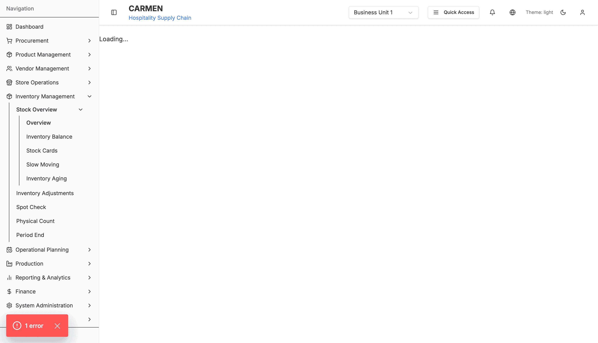
*Stock Overview - Multi-location inventory visibility with analytics*

**Status**: ✅ Production

**Components**:
- Location selector dropdown
- 4 Summary metric cards
- Tabbed interface (Overview, Performance, Transfers)
- Stock Distribution Bar Chart
- Value Distribution Pie Chart
- Quick actions navigation grid
- Location Performance Comparison Chart
- Transfer Suggestions List

**Summary Cards**:
- Total Items (with location count)
- Total Value (currency formatted)
- Low Stock (red alert)
- Expiring Soon (orange warning)

**Tabs**:
- Overview
- Performance
- Transfers

**Quick Actions**:
- Inventory Balance
- Stock Cards
- Slow Moving
- Inventory Aging

**Filters**:
- Location dropdown (All Locations + individual locations)

**Actions**:
- Change location filter
- Navigate to sub-reports
- Create transfer from suggestion

#### Action Flows

**Change Location Filter**:
```mermaid
flowchart LR
    Select["Select Location"] --> Filter["Filter All Data"]
    Filter --> Refresh["Refresh Charts and Metrics"]
```

**Navigate to Inventory Balance**:
```mermaid
flowchart LR
    Click["Click Inventory Balance"] --> Navigate["Navigate to /inventory-balance"]
    Navigate --> Display["Display Balance Report"]
```

**Create Transfer**:
```mermaid
flowchart LR
    Click["Click Create Transfer"] --> Modal["Open Transfer Creation Modal"]
    Modal --> Create["Create Transfer Request"]
```

---

### Inventory Balance Report
**Path**: `/inventory-management/stock-overview/inventory-balance`
**File**: `app/(main)/inventory-management/stock-overview/inventory-balance/page.tsx`

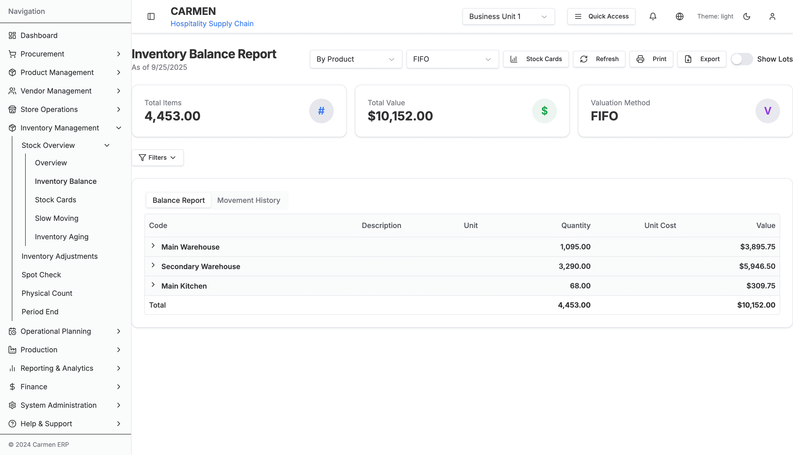
*Inventory Balance Report - Detailed balance with lot tracking*

**Status**: ✅ Production

**Components**:
- Collapsible filter panel
- Hierarchical grouped table
- Movement history side panel
- Export buttons (Excel, PDF)

**Filter Fields**:
- As of Date (date picker)
- Location Range (from/to dropdowns)
- Category Range (from/to dropdowns)
- Product Range (from/to dropdowns)
- View Type (radio buttons: Category / Product / Lot)
- Show Lots (checkbox)

**Table Columns**:
- Code
- Description
- Unit
- Quantity
- Average Cost
- Total Value
- Min/Max Thresholds (product level)
- Expiry Date (lot level)

**Actions**:
- Apply filters
- Toggle filter panel
- Change view type
- Toggle lot visibility
- Click product to view movement history
- Export to Excel
- Export to PDF
- Print report

#### Action Flows

**Apply Filters**:
```mermaid
flowchart LR
    Select["Select Filter Criteria"] --> Apply["Click Apply"]
    Apply --> Refresh["Reload Balance Data"]
```

**Toggle View Type**:
```mermaid
flowchart LR
    Click["Click View Type"] --> Rebuild["Rebuild Table Structure"]
    Rebuild --> Display["Display New View"]
```

**View Movement History**:
```mermaid
flowchart LR
    Click["Click Product Row"] --> Open["Open Side Panel"]
    Open --> Load["Load Movement History"]
```

**Export to Excel**:
```mermaid
flowchart LR
    Click["Click Export Excel"] --> Generate["Generate Excel File"]
    Generate --> Download["Download File"]
```

---

### Stock Cards List
**Path**: `/inventory-management/stock-overview/stock-cards`
**File**: `app/(main)/inventory-management/stock-overview/stock-cards/page.tsx`

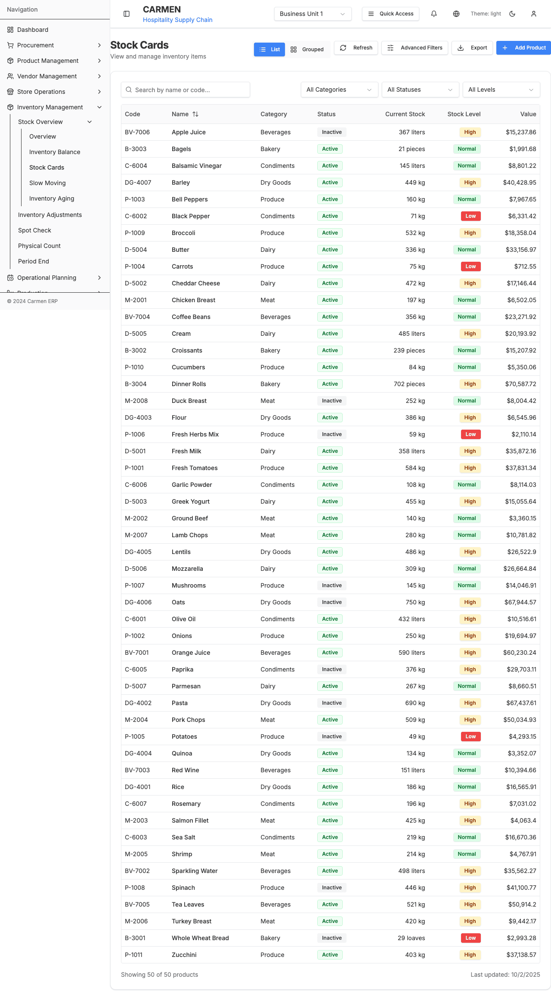
*Stock Cards - Browse all product stock cards*

**Status**: 🚧 Prototype

**Components**:
- Search bar
- Filter panel
- Cards grid (3 cols desktop, 2 tablet, 1 mobile)

**Card Content**:
- Product image/icon
- Product code
- Product name
- Current quantity + unit
- Status badge
- View Details button

**Filters**:
- Location dropdown
- Category dropdown
- Stock status (In Stock / Low Stock / Out of Stock)

**Actions**:
- Search products
- Filter by criteria
- Click card to view details

#### Action Flows

**Search Products**:
```mermaid
flowchart LR
    Type["Type Search Query"] --> Search["Filter Cards"]
    Search --> Display["Display Matching Cards"]
```

**View Stock Card Detail**:
```mermaid
flowchart LR
    Click["Click Card"] --> Navigate["Navigate to Stock Card Detail"]
    Navigate --> Display["Display Full Stock Card"]
```

---

### Stock Card Detail
**Path**: `/inventory-management/stock-overview/stock-card`
**File**: `app/(main)/inventory-management/stock-overview/stock-card/page.tsx`

*Stock Card Detail - Complete item history with lots*

**Status**: ✅ Production

**Tabs**:
- General Information
- Lot Information
- Movement History
- Valuation

**General Information**:
- Product Code
- Product Name
- Category
- Unit of Measure
- Current Stock Level
- Reorder Level
- Maximum Level
- Lead Time (days)
- Last Purchase Date
- Last Purchase Price
- Average Cost

**Lot Information Table Columns**:
- Lot Number
- Receipt Date
- Expiry Date
- Quantity
- Unit Cost
- Total Value
- Status (Good/Damaged/Expired)

**Movement History Table Columns**:
- Date/Time
- Transaction Type
- Reference Number
- Lot Number
- Quantity In
- Quantity Out
- Balance
- Unit Cost
- Value
- Location
- User
- Notes

**Valuation Panel**:
- Valuation Method (FIFO/LIFO/Average)
- Current Total Value
- Average Unit Cost
- Last Purchase Cost
- Cost Variance

**Quick Filters**:
- All Transactions
- Receipts Only
- Issues Only
- Adjustments Only
- Transfers Only
- Date Range

**Actions**:
- Filter movements by type
- Filter by date range
- Export to Excel
- Print stock card
- Create adjustment

#### Action Flows

**Filter Movements**:
```mermaid
flowchart LR
    Click["Click Filter Button"] --> Apply["Apply Filter"]
    Apply --> Reload["Reload Movement History"]
```

**Export Stock Card**:
```mermaid
flowchart LR
    Click["Click Export"] --> Generate["Generate Excel File"]
    Generate --> Download["Download Stock Card"]
```

**Create Adjustment**:
```mermaid
flowchart LR
    Click["Click Create Adjustment"] --> Navigate["Navigate to New Adjustment"]
    Navigate --> Prefill["Prefill Product Data"]
```

---

### Slow Moving Report
**Path**: `/inventory-management/stock-overview/slow-moving`
**File**: `app/(main)/inventory-management/stock-overview/slow-moving/page.tsx`

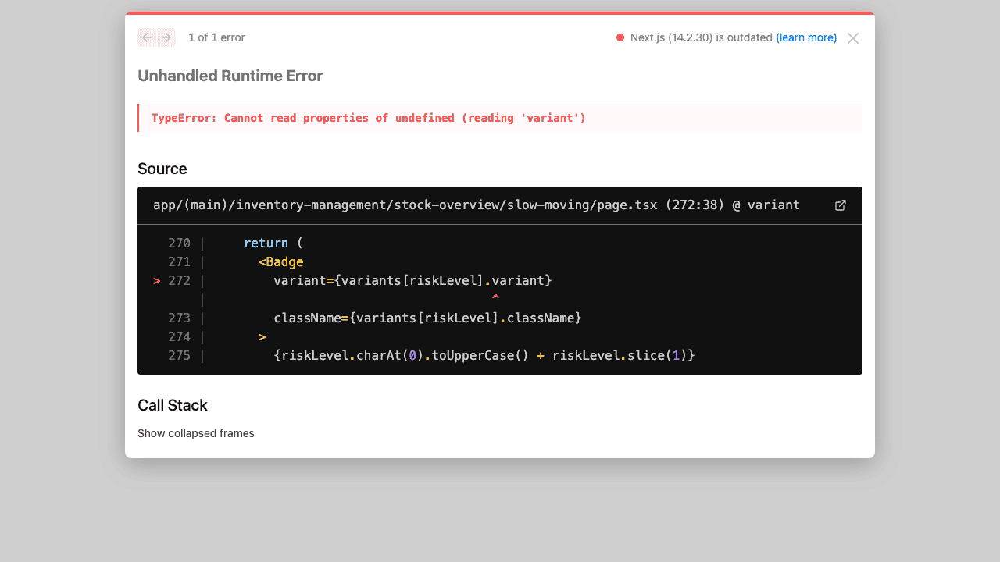
*Slow Moving Items - Identify low turnover inventory*

**Status**: ❌ Not Implemented

**Filters**:
- Time period (30/60/90/180 days)
- Category filter
- Location filter
- Minimum value filter

**Table Columns**:
- Product Code
- Product Name
- Category
- Location
- Current Quantity
- Last Movement Date
- Days Since Movement
- Current Value
- Turnover Rate
- Recommended Action

**Actions**:
- Mark for clearance
- Create transfer
- Adjust reorder level
- Export report

#### Action Flows

**Mark for Clearance**:
```mermaid
flowchart LR
    Select["Select Items"] --> Click["Click Mark for Clearance"]
    Click --> Update["Update Item Status"]
```

---

### Inventory Aging Report
**Path**: `/inventory-management/stock-overview/inventory-aging`
**File**: `app/(main)/inventory-management/stock-overview/inventory-aging/page.tsx`

*Inventory Aging - Track inventory age and expiry*

**Status**: ❌ Not Implemented

**Summary Cards**:
- Total Expiring in 7 days (red)
- Total Expiring in 30 days (orange)
- Average Age (days)
- Total Aged Stock Value

**Table Columns**:
- Product Code/Name
- Location
- Total Quantity
- 0-30 days qty
- 31-60 days qty
- 61-90 days qty
- 90+ days qty
- Expiring Soon (<7 days)
- Total Value

**Actions**:
- Filter by location
- Filter by aging bucket
- Export report
- Create disposal request

#### Action Flows

**Create Disposal Request**:
```mermaid
flowchart LR
    Select["Select Expired Items"] --> Click["Click Create Disposal"]
    Click --> Navigate["Navigate to Disposal Form"]
```

---

### Stock In List
**Path**: `/inventory-management/stock-in`
**File**: `app/(main)/inventory-management/stock-in/page.tsx`

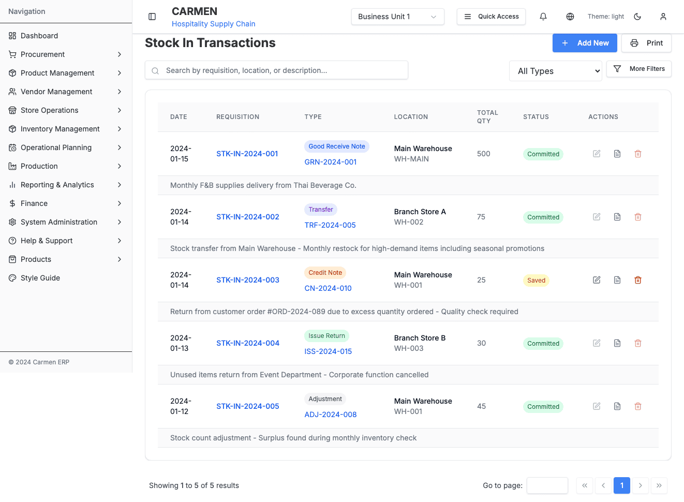
*Stock In - Goods receipt listing*

**Status**: ✅ Production

**Table Columns**:
- Receipt Number
- Receipt Date
- Source (PO/Transfer/Production)
- Source Reference
- Location
- Total Items
- Total Quantity
- Total Value
- Status
- Actions

**Filters**:
- Date range picker
- Status (All/Pending/Completed)
- Location filter
- Search by reference

**Sorting**:
- Sort by Date
- Sort by Receipt Number
- Sort by Status
- Sort by Location

**Actions**:
- Create new receipt
- View receipt detail
- Edit draft receipt
- Post receipt
- Print receipt

#### Action Flows

**Create New Receipt**:
```mermaid
flowchart LR
    Click["Click New Receipt"] --> Navigate["Navigate to Receipt Form"]
    Navigate --> Display["Display Entry Form"]
```

**Post Receipt**:
```mermaid
flowchart LR
    Click["Click Post"] --> Validate["Validate Receipt Data"]
    Validate --> Post["Post to Inventory"]
    Post --> Generate["Generate Journal Entry"]
```

---

### Stock In Detail
**Path**: `/inventory-management/stock-in/[id]`
**File**: `app/(main)/inventory-management/stock-in/components/stock-in-detail.tsx`

*Stock In Detail - Receipt entry and posting*

**Status**: ⚠️ Partial Implementation

**Header Information**:
- Receipt Number (auto-generated)
- Receipt Date
- Location dropdown
- Source type (PO/Transfer/Production/Other)
- Source reference
- Supplier (if from PO)
- Notes textarea

**Items Table Columns**:
- Item Code/Name
- Description
- Ordered Qty (from source)
- Received Qty (editable)
- Unit
- Unit Cost
- Total Cost
- Lot Number (if batch tracked)
- Expiry Date (if applicable)
- Actions (Remove)

**Tabs**:
- Items
- Journal Entry Preview

**Actions**:
- Add item
- Remove item
- Edit quantities
- Enter lot details
- Save draft
- Post receipt
- Cancel
- Print

#### Action Flows

**Add Item**:
```mermaid
flowchart LR
    Click["Click Add Item"] --> Modal["Open Item Lookup Modal"]
    Modal --> Select["Select Item"]
    Select --> Add["Add to Items Table"]
```

**Post Receipt**:
```mermaid
flowchart LR
    Click["Click Post"] --> Validate["Validate All Items"]
    Validate --> Update["Update Inventory"]
    Update --> Journal["Generate Journal Entry"]
```

---

### Inventory Adjustments List
**Path**: `/inventory-management/inventory-adjustments`
**File**: `app/(main)/inventory-management/inventory-adjustments/page.tsx`

*Inventory Adjustments - Track all adjustments with workflow*

**Status**: ✅ Production

**Table Columns**:
- Adjustment ID
- Date
- Type (In/Out badge)
- Status
- Location
- Department
- Reason
- Items count
- Total value
- Actions

**Filters**:
- Date range picker
- Status (Draft/Posted)
- Adjustment type (Positive/Negative/Transfer)
- Location filter
- Department filter

**Sorting**:
- Sort by Date
- Sort by ID
- Sort by Status
- Sort by Type

**Actions**:
- Create new adjustment
- View adjustment detail
- Edit draft adjustment
- Post adjustment
- Delete draft
- Export list

#### Action Flows

**Create New Adjustment**:
```mermaid
flowchart LR
    Click["Click New Adjustment"] --> Navigate["Navigate to Adjustment Form"]
    Navigate --> Display["Display Entry Form"]
```

**Post Adjustment**:
```mermaid
flowchart LR
    Click["Click Post"] --> Validate["Validate Adjustment"]
    Validate --> Update["Update Inventory"]
    Update --> Journal["Generate Journal Entry"]
```

---

### Inventory Adjustment Detail
**Path**: `/inventory-management/inventory-adjustments/[id]`
**File**: `app/(main)/inventory-management/inventory-adjustments/[id]/page.tsx`

*Adjustment Detail - Multi-tab interface with journal entries*

**Status**: ✅ Production

**Header**:
- Adjustment ID
- Status badge
- Action buttons (Edit/Post/Delete)

**Information Panel**:
- Date picker
- Adjustment type dropdown
- Location dropdown
- Department dropdown
- Reason dropdown
- Description textarea
- Reference field

**Adjustment Types**:
- Positive Adjustment (Stock In)
- Negative Adjustment (Stock Out)
- Transfer
- Write-off
- Found Stock
- Damage
- Theft
- Expiry

**Stock Movement Table Columns**:
- Product Code/Name
- SKU
- Location
- Lot Numbers (expandable)
- Quantity
- UOM
- Unit Cost
- Total Cost
- Actions (Remove)

**Summary Panel**:
- Total In Quantity
- Total Out Quantity
- Total Cost

**Tabs**:
- Stock Movement
- Journal Entries

**Journal Entry Tab**:
- Journal Header (Status, Number, Dates, Created/Posted by)
- Journal Lines Table (Account, Debit, Credit, Department)

**Actions**:
- Add items
- Remove items
- Edit quantities
- Enter lot details
- Save draft
- Post adjustment
- Delete draft
- Print voucher

#### Action Flows

**Add Item to Adjustment**:
```mermaid
flowchart LR
    Click["Click Add Item"] --> Modal["Open Item Selection Modal"]
    Modal --> Add["Add to Movement Table"]
```

**Post Adjustment**:
```mermaid
flowchart LR
    Click["Click Post"] --> Validate["Validate Data"]
    Validate --> Update["Update Stock Levels"]
    Update --> Generate["Generate Journal Entry"]
```

---

### Physical Count Wizard
**Path**: `/inventory-management/physical-count`
**File**: `app/(main)/inventory-management/physical-count/page.tsx`

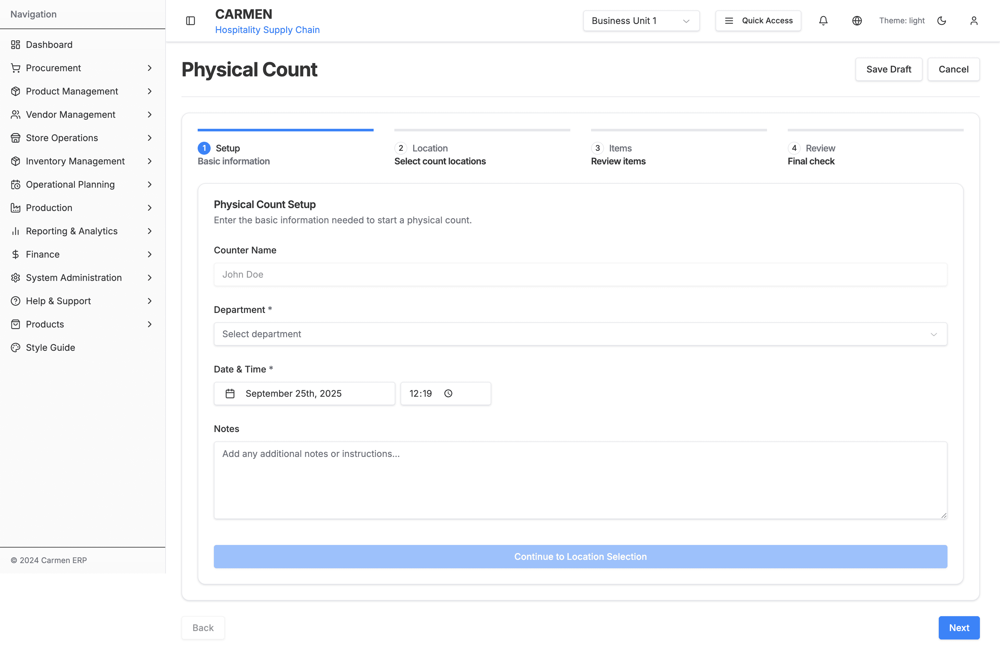
*Physical Count - Multi-step setup wizard*

**Status**: ✅ Production

**Step 1: Setup**:
- Counter Name (auto-filled)
- Department dropdown
- Date & Time picker
- Count Type (Full/Partial)
- Notes textarea

**Step 2: Location Selection**:
- Checkbox tree of locations
- Location hierarchy (Building → Floor → Room)
- Select all/none buttons
- Search locations
- Item count per location

**Step 3: Item Review**:
- Items table (auto-populated)
- Columns: Code, Name, Category, Location, Expected Qty, Unit
- Exclude items checkbox
- Filter by category
- Sort options

**Step 4: Final Review**:
- Summary of selections
- Counter, Department, Date
- Locations count
- Items count
- Estimated duration
- Edit buttons for each step

**Step Indicator**:
- Shows current step (1-4)
- Step titles and descriptions
- Progress visualization

**Actions**:
- Next step
- Previous step
- Save draft
- Start count
- Cancel

#### Action Flows

**Navigate Steps**:
```mermaid
flowchart LR
    Click["Click Next"] --> Validate["Validate Current Step"]
    Validate --> Advance["Advance to Next Step"]
```

**Start Count**:
```mermaid
flowchart LR
    Click["Click Start Count"] --> Validate["Validate All Steps"]
    Validate --> Create["Create Count Record"]
    Create --> Navigate["Navigate to Active Count"]
```

---

### Physical Count Active
**Path**: `/inventory-management/physical-count/active/[id]`
**File**: `app/(main)/inventory-management/physical-count/active/[id]/page.tsx`

*Active Count - Item counting interface*

**Status**: ⚠️ Partial Implementation

**Components**:
- Count reference header
- Progress indicator (X/Y items)
- Location filter
- Search items

**Item Entry Table Columns**:
- Item Code/Name
- Expected Quantity
- Actual Count (input)
- Variance (auto-calculated)
- Variance %
- Status (good/variance)
- Notes
- Counted checkbox

**Actions**:
- Enter actual count
- Mark as counted
- Flag discrepancy
- Add notes
- Save progress
- Submit count
- Cancel count

#### Action Flows

**Enter Count**:
```mermaid
flowchart LR
    Type["Enter Actual Count"] --> Calculate["Calculate Variance"]
    Calculate --> Update["Update Progress"]
```

**Submit Count**:
```mermaid
flowchart LR
    Click["Click Submit"] --> Validate["Check All Items Counted"]
    Validate --> Submit["Submit Count"]
    Submit --> Review["Navigate to Variance Review"]
```

---

### Physical Count Dashboard
**Path**: `/inventory-management/physical-count/dashboard`
**File**: `app/(main)/inventory-management/physical-count/dashboard/page.tsx`

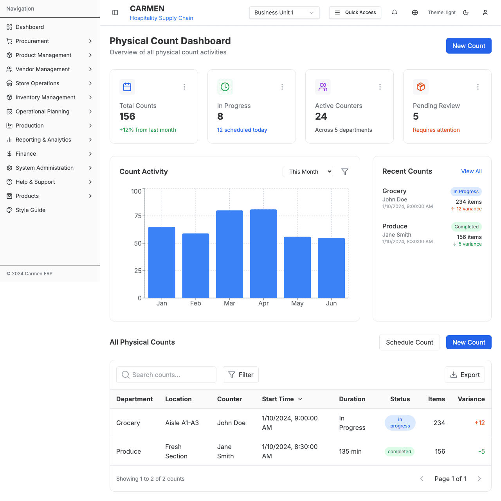
*Count Dashboard - Management and tracking interface*

**Status**: ⚠️ Partial Implementation

**Summary Cards**:
- Active Counts
- Completed Today
- Pending Review
- Average Variance %

**Counts Table Columns**:
- Count ID
- Date
- Location(s)
- Items Count
- Completed Items
- Progress %
- Status
- Variance %
- Actions

**Charts**:
- Count completion trend (line)
- Variance by location (bar)
- Variance by category (pie)

**Actions**:
- Resume count
- Review count
- Export results
- Create new count

#### Action Flows

**Resume Count**:
```mermaid
flowchart LR
    Click["Click Resume"] --> Navigate["Navigate to Active Count"]
    Navigate --> Load["Load Progress"]
```

---

### Spot Check Main
**Path**: `/inventory-management/spot-check`
**File**: `app/(main)/inventory-management/spot-check/page.tsx`

*Spot Check - Quick verification with list/grid view*

**Status**: ✅ Production

**View Toggle**:
- List view
- Grid view

**Filter Bar**:
- Search box
- Status dropdown (All/Pending/In Progress/Completed)
- Department dropdown
- Location filter (toggle panel)

**List View Displays**:
- Store Name
- Department badge
- Counter name
- Date
- Status badge
- Item count
- Last count date
- Variance %
- Progress
- Notes preview
- Actions (Start/Delete)

**Grid View Card**:
- Count ID
- Counter
- Department
- Store
- Date
- Items count
- Actions (Start/Delete)

**Actions**:
- New spot check
- Start count
- Delete count
- Toggle view
- Apply filters

#### Action Flows

**New Spot Check**:
```mermaid
flowchart LR
    Click["Click New Spot Check"] --> Navigate["Navigate to Setup Form"]
    Navigate --> Display["Display Setup Page"]
```

**Start Spot Check**:
```mermaid
flowchart LR
    Click["Click Start"] --> Navigate["Navigate to Active Check"]
    Navigate --> Load["Load Items"]
```

---

### New Spot Check
**Path**: `/inventory-management/spot-check/new`
**File**: `app/(main)/inventory-management/spot-check/new/page.tsx`

*New Spot Check - Quick setup wizard*

**Status**: ✅ Production

**Step 1: Setup**:
- Department dropdown
- Store/Location dropdown
- Date/Time picker
- Notes

**Step 2: Item Selection**:
- Random item picker (auto-select N items)
- Manual search and add
- Selected items list
- Remove items

**Selected Items Table**:
- Item Code
- Item Name
- Expected Qty
- Unit
- Remove button

**Step 3: Review**:
- Summary of setup
- List of selected items
- Total items count

**Actions**:
- Next/Previous
- Select random items
- Manual add
- Remove item
- Save draft
- Start check
- Cancel

#### Action Flows

**Random Item Selection**:
```mermaid
flowchart LR
    Click["Click Random Select"] --> Generate["Generate Random List"]
    Generate --> Add["Add to Selected Items"]
```

**Start Spot Check**:
```mermaid
flowchart LR
    Click["Click Start"] --> Validate["Validate Selection"]
    Validate --> Create["Create Spot Check"]
    Create --> Navigate["Navigate to Active Check"]
```

---

### Active Spot Check
**Path**: `/inventory-management/spot-check/active/[id]`
**File**: `app/(main)/inventory-management/spot-check/active/[id]/page.tsx`

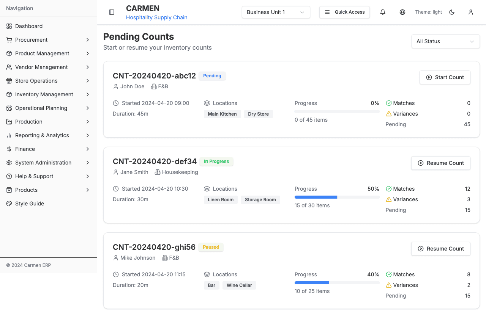
*Active Spot Check - Item counting*

**Status**: ✅ Production

**Components**:
- Reference header
- Progress indicator
- Item entry form

**Item Form Fields**:
- Item name/code
- Expected quantity
- Actual count (input)
- Variance (calculated)
- Status dropdown (Good/Damaged/Missing/Expired)
- Notes
- Submit item checkbox

**Actions**:
- Submit item count
- Flag issue
- Add photo (future)
- Complete check
- Cancel

#### Action Flows

**Submit Item Count**:
```mermaid
flowchart LR
    Enter["Enter Count"] --> Validate["Validate Entry"]
    Validate --> Save["Save Item Count"]
```

**Complete Check**:
```mermaid
flowchart LR
    Click["Click Complete"] --> Check["Check All Items Submitted"]
    Check --> Finalize["Finalize Spot Check"]
```

---

### Spot Check Dashboard
**Path**: `/inventory-management/spot-check/dashboard`
**File**: `app/(main)/inventory-management/spot-check/dashboard/page.tsx`

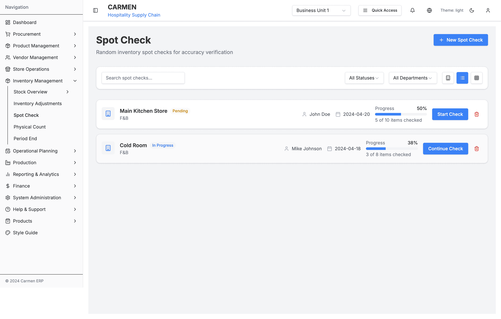
*Spot Check Dashboard - Analytics and tracking*

**Status**: ✅ Production

**Summary Cards**:
- Total Checks This Week
- Average Accuracy %
- Items Flagged
- Pending Actions

**Charts**:
- Accuracy trend (line)
- Variance by location (bar)
- Issue types distribution (pie)

**Recent Checks Table**:
- Date
- Location
- Items
- Accuracy %
- Issues found
- Status

**Actions**:
- View check detail
- Export analytics
- Filter date range

#### Action Flows

**View Check Detail**:
```mermaid
flowchart LR
    Click["Click Check Row"] --> Navigate["Navigate to Check Detail"]
    Navigate --> Display["Display Check Results"]
```

---

### Fractional Inventory
**Path**: `/inventory-management/fractional-inventory`
**File**: `app/(main)/inventory-management/fractional-inventory/page.tsx`

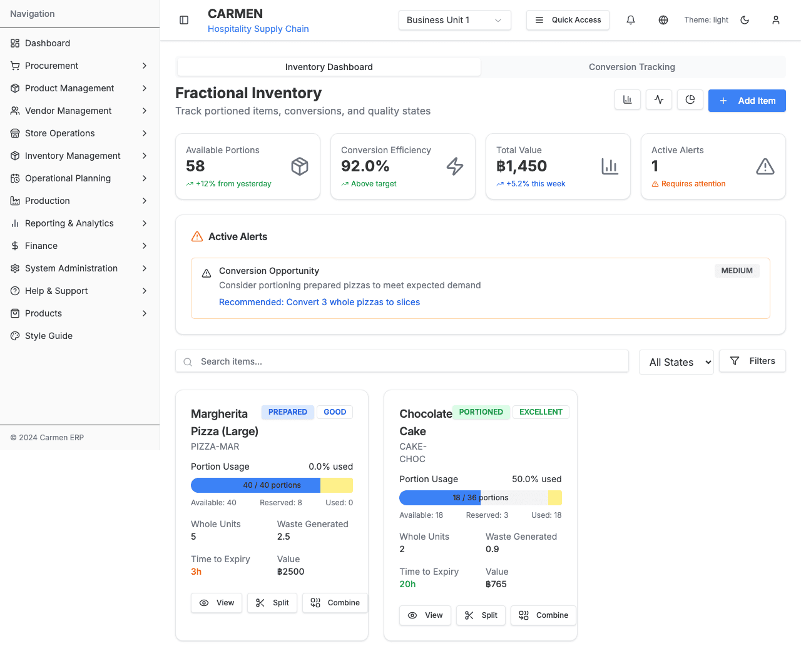
*Fractional Inventory - Portion tracking and conversion*

**Status**: ✅ Production

**Tabs**:
- Inventory Dashboard
- Conversion Tracking

**Inventory Dashboard Tab**:

**Summary Cards**:
- Total Fractional Items
- Active Portions
- Pending Conversions
- Waste Generated Today

**Stock Table Columns**:
- Item Code/Name
- Current State (WHOLE/PARTIAL/PREPARED)
- Whole Units Available
- Partial Quantity Available
- Total Portions Available
- Reserved Portions
- Quality Grade (EXCELLENT/GOOD/FAIR/POOR)
- Expires At (countdown)
- Actions (Split/Combine/Details)

**Filters**:
- Location
- State (Whole/Partial/Prepared)
- Quality Grade
- Expiring Soon (<4 hours)

**Conversion Tracking Tab**:

**Recent Conversions Table**:
- Date/Time
- Item Name
- Operation Type (Split/Combine)
- From State → To State
- Quantity Converted
- Resulting Units/Portions
- Waste Generated
- Performed By
- Reason
- Notes

**Charts**:
- Conversions over time (line)
- Waste by item (bar)
- Operation type distribution (pie)

**Actions**:
- Split item
- Combine portions
- View stock details
- Filter conversions
- Export report

#### Action Flows

**Split Operation**:
```mermaid
flowchart LR
    Click["Click Split"] --> Modal["Open Split Modal"]
    Modal --> Confirm["Confirm Operation"]
    Confirm --> Update["Update Stock State"]
```

**Combine Operation**:
```mermaid
flowchart LR
    Click["Click Combine"] --> Modal["Open Combine Modal"]
    Modal --> Confirm["Confirm Operation"]
    Confirm --> Update["Update Stock State"]
```

---

### Period End
**Path**: `/inventory-management/period-end`
**File**: `app/(main)/inventory-management/period-end/page.tsx`

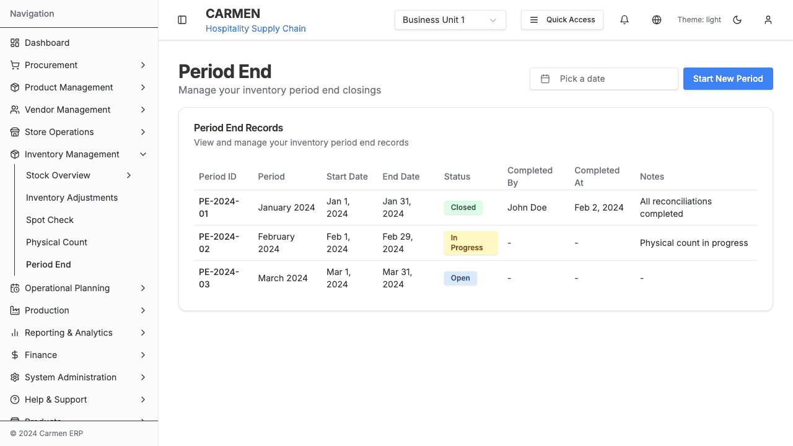
*Period End - Month-end closing procedures*

**Status**: ✅ Production

**Header**:
- Title
- Date picker (period selection)
- Start New Period button

**Period Records Table Columns**:
- Period ID
- Period (e.g., "January 2024")
- Start Date
- End Date
- Status (Open/In Progress/Closed)
- Completed By
- Completed At
- Notes

**Status Badges**:
- Open (Blue)
- In Progress (Yellow)
- Closed (Green)

**Actions**:
- Start new period
- Click row to view detail
- Close period

#### Action Flows

**Start New Period**:
```mermaid
flowchart LR
    Click["Click Start New Period"] --> Modal["Open Period Setup"]
    Modal --> Create["Create Period Record"]
```

**View Period Detail**:
```mermaid
flowchart LR
    Click["Click Period Row"] --> Navigate["Navigate to Period Detail"]
    Navigate --> Display["Display Checklist and Reports"]
```

---

### Period End Detail
**Path**: `/inventory-management/period-end/[id]`
**File**: `app/(main)/inventory-management/period-end/[id]/page.tsx`

*Period End Detail - Closing checklist and reports*

**Status**: ⚠️ Partial Implementation

**Header**:
- Period ID
- Status badge
- Close Period button

**Summary Panel**:
- Period range
- Opening stock value
- Closing stock value
- Variance
- Physical count status
- Adjustment count
- Status

**Checklist**:
- [ ] All stock receipts posted
- [ ] All stock issues posted
- [ ] Physical count completed
- [ ] Variances reconciled
- [ ] Adjustments posted
- [ ] Reports generated
- [ ] Finance reviewed

**Reports Section**:
- Inventory valuation report
- Movement summary
- Variance analysis
- Period-end snapshot

**Actions**:
- Run checklist item
- Generate report
- Close period
- Cancel closing

#### Action Flows

**Close Period**:
```mermaid
flowchart LR
    Click["Click Close Period"] --> Validate["Validate Checklist"]
    Validate --> Lock["Lock Transactions"]
    Lock --> Archive["Archive Reports"]
```

---

### Physical Count Management
**Path**: `/inventory-management/physical-count-management`
**File**: `app/(main)/inventory-management/physical-count-management/page.tsx`

*Physical Count Management - Scheduling and oversight*

**Status**: ✅ Production

**Header**:
- Title
- New Count button

**Filter Bar**:
- Status filter
- Location filter
- Date range

**Counts List (Cards)**:
- Store Name
- Department
- Counter assigned
- Scheduled Date
- Status (Scheduled/In Progress/Completed)
- Item count
- Completed count (progress)
- Variance %
- Actions (Start/Edit/Delete)

**Actions**:
- Create new count
- Start count
- Edit scheduled count
- Delete count

#### Action Flows

**Create New Count**:
```mermaid
flowchart LR
    Click["Click New Count"] --> Modal["Open Count Detail Form"]
    Modal --> Save["Save Count Schedule"]
```

**Start Count**:
```mermaid
flowchart LR
    Click["Click Start"] --> Navigate["Navigate to Active Count"]
    Navigate --> Begin["Begin Counting Process"]
```

---

## Modals and Dialogs

### 1. Item Selection Modal
**Trigger**: Click "Add Item" in Stock In, Adjustments
**Component**: `item-lookup-modal.tsx`

**Filter Fields**:
- Search by name/code
- Category filter (dropdown)
- In stock only (checkbox)

**Display**:
- Items table with checkboxes
- Columns: Code, Name, Category, Current Stock, Unit
- Selected items preview

**Actions**:
- Search items
- Filter by category
- Select/deselect items
- Add selected items
- Cancel

#### Action Flows

**Search Items**:
```mermaid
flowchart LR
    Type["Type Search Query"] --> Search["Filter Items"]
    Search --> Display["Display Matching Items"]
```

**Add Selected Items**:
```mermaid
flowchart LR
    Select["Select Items"] --> Click["Click Add"]
    Click --> Add["Add to Parent Form"]
```

---

### 2. Lot Entry Modal
**Trigger**: Enter lot details for batch-tracked items
**Component**: `lot-entry-modal.tsx`

**Fields**:
- Lot Number (text input)
- Expiry Date (date picker)
- Quantity (number input)
- Notes (textarea)

**Multiple Lots**:
- Add another lot button
- List of entered lots
- Remove lot button

**Actions**:
- Add lot
- Remove lot
- Save lots
- Cancel

#### Action Flows

**Add Lot**:
```mermaid
flowchart LR
    Enter["Enter Lot Details"] --> Click["Click Add Lot"]
    Click --> Validate["Validate Lot Data"]
```

**Save Lots**:
```mermaid
flowchart LR
    Click["Click Save"] --> Validate["Validate All Lots"]
    Validate --> Assign["Assign to Item"]
```

---

### 3. Conversion Operations Modal
**Trigger**: Click Split or Combine in Fractional Inventory
**Component**: `conversion-operations-modal.tsx`

**Split Operation Fields**:
- Stock ID (read-only)
- Item Name (read-only)
- Available Whole Units (read-only)
- Split Quantity (input)
- Target Portion Size (dropdown)
- Resulting Portions (calculated)
- Conversion Cost (calculated)
- Reason (dropdown)
- Notes

**Combine Operation Fields**:
- Stock ID (read-only)
- Item Name (read-only)
- Available Portions (read-only)
- Combine Quantity (input)
- Target: Whole Unit
- Waste % (calculated)
- Reason (dropdown)
- Notes

**Actions**:
- Confirm conversion
- Cancel

#### Action Flows

**Split Item**:
```mermaid
flowchart LR
    Enter["Enter Split Quantity"] --> Calculate["Calculate Portions"]
    Calculate --> Confirm["Confirm Operation"]
```

**Combine Portions**:
```mermaid
flowchart LR
    Enter["Enter Combine Quantity"] --> Calculate["Calculate Waste"]
    Calculate --> Confirm["Confirm Operation"]
```

---

### 4. Transfer Creation Modal
**Trigger**: Create transfer from suggestions
**Component**: `transfer-creation-modal.tsx`

**Fields**:
- From Location (dropdown)
- To Location (dropdown)
- Item (pre-filled)
- Quantity (input)
- Transfer Date (date picker)
- Priority (dropdown)
- Reason (dropdown)
- Notes

**Actions**:
- Create transfer
- Cancel

#### Action Flows

**Create Transfer**:
```mermaid
flowchart LR
    Enter["Fill Transfer Details"] --> Validate["Validate Data"]
    Validate --> Create["Create Transfer Request"]
```

---

### 5. Delete Confirmation Dialog
**Trigger**: Delete adjustment, count, or other record
**Component**: `delete-confirmation-dialog.tsx`

**Displays**:
- Warning message
- Record details
- Dependency check (if applicable)
- Cannot undo warning

**Actions**:
- Confirm Delete
- Cancel

#### Action Flows

**Confirm Delete**:
```mermaid
flowchart LR
    Click["Click Confirm"] --> Check["Check Dependencies"]
    Check --> Delete["Delete Record"]
```

---

### 6. Count Detail Form Modal
**Trigger**: View/edit count in Count Management
**Component**: `count-detail-form.tsx`

**Fields**:
- Location (dropdown)
- Counter assignment (dropdown)
- Scheduled date/time
- Count type (Full/Partial/Spot)
- Items selection (if partial)
- Notes
- Recurrence (One-time/Weekly/Monthly)

**Actions**:
- Save
- Schedule
- Cancel

#### Action Flows

**Save Count**:
```mermaid
flowchart LR
    Enter["Fill Details"] --> Validate["Validate Fields"]
    Validate --> Save["Save Count Record"]
```

---

### 7. Movement History Panel
**Trigger**: Click product in Inventory Balance
**Component**: `movement-history-panel.tsx`

**Display**:
- Side panel (right)
- Product name header
- Movement history table

**Table Columns**:
- Date
- Transaction Type
- Reference
- Quantity In
- Quantity Out
- Balance
- Notes

**Actions**:
- Close panel
- Filter by type
- Export history

#### Action Flows

**View History**:
```mermaid
flowchart LR
    Click["Click Product"] --> Load["Load Movement Data"]
    Load --> Display["Display in Panel"]
```

---

## Dropdown Fields Reference

### Status Dropdown
**Values**:
- Draft
- Pending
- In Progress
- Completed
- Posted
- Cancelled
- Voided

**Used in**: Adjustments, Receipts, Counts

### Adjustment Type Dropdown
**Values**:
- Positive Adjustment (Stock In)
- Negative Adjustment (Stock Out)
- Transfer
- Write-off
- Found Stock
- Damage
- Theft
- Expiry
- Quality Control
- System Correction
- Other

**Used in**: Inventory Adjustments

### Location Dropdown
**Hierarchy**:
- Main Kitchen
  - Dry Store
  - Cold Room
  - Freezer
- Restaurant
  - Bar Stock
  - Service Station
- Central Warehouse
  - Receiving
  - Storage

**Used in**: All inventory transactions

### Department Dropdown
**Values**:
- F&B (Food & Beverage)
- Housekeeping
- Maintenance
- Front Office
- Kitchen
- Engineering

**Used in**: Adjustments, Counts, Reports

### Count Type Dropdown
**Values**:
- Full Count
- Partial Count
- Spot Check
- Cycle Count

**Used in**: Physical Count, Count Management

### Source Type Dropdown
**Values**:
- Purchase Order
- Transfer In
- Production
- Found Stock
- Other

**Used in**: Stock In

### Adjustment Reason Dropdown
**Values**:
- Physical count variance
- Damage
- Theft
- Expiry
- Found stock
- Transfer
- Production
- Quality control
- System correction
- Other (with notes)

**Used in**: Inventory Adjustments

### Valuation Method Dropdown
**Values**:
- FIFO (First In First Out)
- LIFO (Last In First Out)
- Weighted Average Cost

**Used in**: Stock Card, Reports

### Portion Size Dropdown (Fractional)
**Values**: (Dynamic based on item)
- Slice (8 per whole)
- Half (2 per whole)
- Quarter (4 per whole)
- Custom

**Used in**: Fractional Inventory

### Quality Grade Dropdown (Fractional)
**Values**:
- EXCELLENT
- GOOD
- FAIR
- POOR

**Used in**: Fractional Inventory

### Stock State Dropdown (Fractional)
**Values**:
- WHOLE
- PARTIAL
- PREPARED

**Used in**: Fractional Inventory

### View Type Radio Buttons
**Values**:
- Category View
- Product View
- Lot View

**Used in**: Inventory Balance Report

### Date Range Picker
**Presets**:
- Today
- Last 7 Days
- Last 30 Days
- Last Quarter
- Last Year
- Custom Range

**Used in**: Filters, Reports

---

## Actions and Buttons Reference

### Global Actions (appearing across multiple pages):
- **Search** - Real-time search with debounce
- **Filter** - Open filter dialog/panel
- **Export** - Export to Excel/PDF
- **Add New** - Create new record
- **Refresh** - Reload data
- **Print** - Print current view

### List View Actions:
- **View Details** - Navigate to detail page
- **Edit** - Navigate to edit page
- **Delete** - Delete with confirmation
- **Post** - Finalize transaction
- **Void** - Cancel posted transaction
- **Export Single** - Export record
- **Duplicate** - Clone record

### Detail View Actions:
- **Back** - Return to list
- **Edit** - Navigate to edit page
- **Save** - Save changes
- **Cancel** - Discard changes
- **Delete** - Delete record
- **Post** - Finalize transaction
- **Print** - Print view
- **Download PDF** - Export to PDF

### Form Actions:
- **Save** - Save and return to list
- **Save and New** - Save and create another
- **Save Draft** - Save without posting
- **Post** - Finalize transaction
- **Cancel** - Return without saving
- **Reset** - Clear form fields

### Table Actions:
- **Sort** - Sort by column
- **Filter** - Filter column
- **Expand** - Expand grouped row
- **Collapse** - Collapse grouped row
- **Select** - Select row checkbox
- **Select All** - Select all rows

### Inventory-Specific Actions:
- **Add Item** - Add item to document
- **Remove Item** - Remove item from document
- **Enter Lot** - Enter lot/batch details
- **View Movement** - View item movement history
- **Create Adjustment** - Quick adjustment
- **Split Item** - Split whole to portions
- **Combine Portions** - Combine to whole
- **Start Count** - Begin counting
- **Submit Count** - Complete count
- **Create Transfer** - Create transfer request

---

## Form Components

### Input Fields
- Text input (standard)
- Number input (with min/max)
- Currency input (formatted)
- Percentage input (0-100%)
- Textarea (multi-line)
- Search input (with icon)

### Selection Components
- Dropdown select (single)
- Multi-select dropdown
- Radio button group
- Checkbox group
- Toggle switch
- Date picker (calendar)
- Date range picker
- Time picker

### File Components
- File upload (single file)
- File upload (multiple files)
- Image upload with preview
- Document upload with type

### Specialized Components
- Location selector (hierarchical tree)
- Item lookup (searchable modal)
- Lot entry (batch tracking)
- Quantity input (with unit)
- Currency input (with symbol)
- Autocomplete (with suggestions)

### Validation Components
- Required field indicator (*)
- Inline error message
- Field-level validation
- Form-level validation summary
- Async validation (e.g., duplicate check)

---

## Data Display Components

### Tables
- **Sortable columns** - Click header to sort
- **Pagination** - Page size options (10/25/50/100)
- **Row selection** - Checkbox select
- **Inline actions** - Action buttons per row
- **Expandable rows** - Show additional details
- **Column visibility** - Show/hide columns
- **Column reordering** - Drag to reorder
- **Export functionality** - Export visible data
- **Grouped table** - Hierarchical grouping
- **Summary rows** - Totals and subtotals

### Cards
- Metric card (with icon and value)
- Summary card (with multiple metrics)
- Statistics card (with trend)
- Action card (with quick actions)
- Progress card (with completion %)
- Alert card (with warning/error)

### Lists
- Simple list (item name + icon)
- Detailed list (multiple fields)
- Grouped list (by category)
- Hierarchical list (tree structure)
- Timeline list (chronological)

### Statistics/Metrics
- KPI cards (large value + label)
- Summary widgets (multiple metrics)
- Progress indicators (bar/circle)
- Status badges (colored labels)
- Charts (bar/line/pie from Recharts)
- Trend indicators (up/down arrows)
- Gauge charts (percentage display)

### Timeline/History
- Activity feed (recent actions)
- Audit trail (who/what/when)
- Change log (before/after)
- Movement history (transactions)

### Inventory-Specific Components
- Stock level indicator (with colors)
- Expiry countdown (days remaining)
- Variance display (expected vs actual)
- Lot information table
- Quality grade badge
- State indicator (fractional)
- Draggable widgets (dashboard)

---

## Glossary

### A

**Adjustment**: An inventory transaction that corrects stock levels due to damage, theft, expiry, or counting discrepancies without a corresponding physical receipt or issue.

**Aging**: The process of tracking how long inventory items have been in stock to identify slow-moving items and potential obsolescence.

**As Of Date**: The specific date for which a report reflects inventory status, useful for historical reporting and period comparisons.

**Average Cost**: The weighted average unit cost of inventory, calculated as total value divided by total quantity.

### B

**Balance Report**: A comprehensive report showing current inventory quantities and values across locations, categories, and products.

**Batch Tracking**: The practice of tracking inventory by production batch or lot number, essential for quality control, expiry management, and recall capabilities.

**Base Unit**: The primary unit of measure for an item (e.g., Each, Case, Kilogram, Liter).

### C

**Category**: A classification grouping for inventory items (e.g., Food, Beverages, Cleaning Supplies, Linen).

**Conversion**: In fractional inventory, the process of splitting whole units into portions or combining portions back into whole units.

**Count**: See Physical Count or Spot Check.

**Count Variance**: The difference between expected (system) quantity and actual (counted) quantity, expressed as a number or percentage.

**Cycle Count**: A scheduled counting procedure where different portions of inventory are counted at different times throughout the year.

### D

**Department**: An organizational unit responsible for inventory usage and management (e.g., F&B, Housekeeping, Maintenance).

**Draft**: A saved but not finalized transaction that does not affect inventory levels or create journal entries, allowing for later editing.

### E

**Expiry Date**: The date after which an item should not be used or sold, critical for perishable goods and food safety.

**Expiring Soon**: Items approaching their expiry date, typically flagged when within 7 days of expiry.

### F

**FIFO (First In, First Out)**: An inventory valuation method where the oldest stock is assumed to be sold or used first.

**Fractional Inventory**: An inventory management system for items that can be divided into portions (e.g., pizzas into slices) with state tracking, quality monitoring, and conversion capabilities.

**Fill Rate**: The percentage of demand that can be satisfied from current stock levels without backorders.

### G

**GRN (Goods Received Note)**: A document recording the receipt of goods into inventory, typically linked to a purchase order.

**Grade** (Quality): A classification of item condition or freshness (EXCELLENT, GOOD, FAIR, POOR), used primarily in fractional inventory management.

### I

**Inventory Adjustment**: See Adjustment.

**Inventory Balance**: The current quantity and value of stock on hand at a specific point in time.

**Inventory Turnover**: A ratio showing how many times inventory is sold, used, and replaced over a given period.

**Issue**: The release of inventory from storage for use, production, or sale.

### J

**Journal Entry**: An accounting entry recording the financial impact of inventory transactions through debits and credits to general ledger accounts.

### L

**Location**: A physical storage area where inventory is kept (e.g., Main Kitchen, Cold Room, Dry Store, Central Warehouse).

**Lot Number**: A unique identifier for a batch of items, used in batch tracking for quality control and traceability.

**Low Stock**: Items with quantities at or below their defined reorder point, requiring replenishment.

### M

**Movement**: Any transaction that changes inventory quantity, including receipts, issues, transfers, and adjustments.

**Movement History**: A chronological log of all transactions affecting an item's stock level and location.

### P

**Period End**: The month-end or period-end process of closing inventory transactions, reconciling physical counts, and generating financial reports.

**Physical Count**: A comprehensive counting process where all items in selected locations are physically counted and compared to system records.

**Portion**: A fractional unit of a whole item (e.g., one slice of pizza where the whole pizza contains 8 slices).

**Posting**: The act of finalizing a transaction, which updates inventory levels, creates journal entries, and locks the transaction from further editing.

**Purchase Order (PO)**: A document sent to a supplier to purchase goods, which generates expected stock receipts when goods are delivered.

### Q

**Quality Grade**: See Grade.

### R

**Receipt**: The process of receiving goods into inventory, typically from a purchase order, transfer, or production.

**Reorder Point**: The inventory level that triggers a replenishment order to avoid stockouts.

**Reserved**: Inventory that is allocated for a specific purpose but not yet issued (e.g., reserved for a production order or customer order).

### S

**SKU (Stock Keeping Unit)**: A unique identifier for each distinct product in inventory, used for tracking and identification.

**Slow Moving**: Items with low turnover rates, identified by long periods without movement or low transaction frequency.

**Spot Check**: A quick, random count of selected items to verify inventory accuracy without performing a full physical count.

**State** (Fractional): The current form of fractional inventory items (WHOLE = intact unit, PARTIAL = partially used, PREPARED = ready for service).

**Stock Card**: A detailed record showing all movements, current balance, and historical transactions for a specific item.

**Stock In**: See Receipt.

**Stock Efficiency**: A metric measuring how well inventory levels match demand patterns and minimize waste.

### T

**Transfer**: Movement of inventory between locations within the organization.

**Turnover Rate**: See Inventory Turnover.

### U

**Unit Cost**: The cost per single unit of an item, used for valuation calculations.

**Unit of Measure (UOM)**: The unit in which inventory quantities are tracked (e.g., Each, Box, Liter, Kilogram, Dozen).

### V

**Valuation**: The process of calculating the total value of inventory using methods such as FIFO, LIFO, or weighted average cost.

**Variance**: The difference between expected and actual quantities or values, typically expressed in both absolute numbers and percentages.

### W

**Waste**: Inventory lost due to spoilage, damage, or portion conversion inefficiencies, tracked particularly in fractional inventory.

**Warehouse**: See Location.

**Whole Unit**: The complete, undivided form of a fractional item (e.g., a whole pizza before being cut into slices).

---

## Abbreviations

| Abbreviation | Full Term | Context |
|--------------|-----------|---------|
| Adj | Adjustment | Inventory adjustment transaction |
| COGS | Cost of Goods Sold | Expense account for issued inventory |
| Exp | Expiry / Expired | Expiration date or expired items |
| FIFO | First In, First Out | Inventory valuation method |
| F&B | Food & Beverage | Department type |
| GRN | Goods Received Note | Stock receipt document |
| ID | Identifier | Unique reference number |
| JE | Journal Entry | Accounting entry |
| LIFO | Last In, First Out | Inventory valuation method |
| Loc | Location | Storage location |
| PA | Positive Adjustment | Stock in adjustment |
| PC | Physical Count | Full inventory count |
| PE | Period End | Month-end closing |
| PO | Purchase Order | Purchase document |
| Qty | Quantity | Amount/count |
| SC | Spot Check | Random item count |
| SKU | Stock Keeping Unit | Product identifier |
| UOM | Unit of Measure | Quantity unit |
| WAC | Weighted Average Cost | Valuation method |

---

## Feature Gap Analysis

### Fully Implemented Features ✅ (24 features - 41%)

1. **Dashboard** - Draggable widget system
2. **Stock Overview** - Multi-location visibility
3. **Summary Metrics** - Real-time calculations
4. **Stock Distribution Charts** - Bar and pie charts
5. **Performance Comparison** - Location analytics
6. **Transfer Suggestions** - Optimization recommendations
7. **Inventory Balance Report** - Hierarchical grouping
8. **Stock Card Detail** - Complete history
9. **Movement History** - Transaction log
10. **Valuation Display** - FIFO/Average methods
11. **Stock In List** - Receipt management
12. **Inventory Adjustments List** - Complete listing
13. **Adjustment Detail** - Multi-tab interface
14. **Journal Entry Display** - Auto-generated entries
15. **Physical Count Wizard** - 4-step process
16. **Location Selection** - Hierarchical tree
17. **Active Count Tracking** - Progress monitoring
18. **Spot Check Main** - List/grid views
19. **New Spot Check** - Quick setup
20. **Active Spot Check** - Item counting
21. **Spot Check Dashboard** - Analytics
22. **Fractional Inventory Dashboard** - Portion tracking
23. **Conversion Operations** - Split/combine
24. **Period End List** - Period records

### Partially Implemented Features ⚠️ (16 features - 28%)

1. **Stock In Posting** - UI exists, backend incomplete
2. **Source Selection** - Cannot link to PO/Transfer
3. **Lot Entry** - Modal placeholder, no integration
4. **Inventory Balance Export** - Button exists, not functional
5. **Movement History Integration** - Hardcoded data
6. **Physical Count Posting** - No automatic adjustment
7. **Barcode Support** - Placeholder only
8. **Photo Upload (Spot Check)** - UI placeholder
9. **Period End Checklist** - Static, no automation
10. **Period Locking** - Status change not enforced
11. **Count Scheduling** - List view only
12. **Progress Dashboard** - Minimal real-time data
13. **Auto-conversion Rules** - Field exists, no logic
14. **Waste Reporting** - Tracked but no reports
15. **Error Handling** - Basic, not comprehensive
16. **Accessibility** - Partial WCAG compliance

### Not Implemented Features ❌ (18 features - 31%)

1. **Slow Moving Report** - Route exists, no implementation
2. **Inventory Aging Report** - Route exists, no implementation
3. **Stock Card List Page** - Minimal implementation
4. **New Adjustment Form** - Button exists, no form
5. **Adjustment Posting** - View-only mode
6. **Multi-source Receipt** - No PO/Transfer integration
7. **Inventory Valuation Report** - Not implemented
8. **Movement Summary Report** - Not implemented
9. **Variance Analysis Report** - Not implemented
10. **Barcode Scanning** - Complete feature missing
11. **Mobile App** - Web responsive only
12. **Data Persistence** - All mock data
13. **API Layer** - No backend
14. **GL Integration** - Journal entries not posted
15. **Audit Trail** - No comprehensive logging
16. **Automated Testing** - No test coverage
17. **Server Validation** - Client-side only
18. **Performance Optimization** - Not optimized for scale

### Development Priority Matrix

**Priority 1 (MVP - 46-63 days):**
- Data Persistence Layer (15-20 days)
- Stock In Posting (3-4 days)
- Adjustment Creation (4-5 days)
- Adjustment Posting (3-4 days)
- Physical Count Posting (3-4 days)
- Period End Locking (2-3 days)
- Finance Integration (7-10 days)
- Permissions Enforcement (4-5 days)

**Priority 2 (Production - 28-43 days):**
- PO Integration (5-7 days)
- Lot/Batch Entry (3-4 days)
- Inventory Valuation Report (4-5 days)
- Audit Trail (5-7 days)
- Error Handling (3-5 days)
- Data Validation (3-4 days)
- Count Scheduling (3-4 days)
- Movement History Integration (2-3 days)

**Priority 3 (Enhancement - 20-36 days):**
- Slow Moving Report (3-5 days)
- Inventory Aging Report (3-5 days)
- Stock Card List (2-3 days)
- Waste Reporting (2-3 days)
- Export Functionality (1-2 days)
- Photo Upload (2-3 days)
- Auto-conversion Rules (4-5 days)
- Performance Optimization (3-5 days)

**Priority 4 (Future - 40-59 days):**
- Barcode Scanning (5-7 days)
- Mobile App (20-30 days)
- Automated Testing (10-15 days)
- Accessibility Improvements (5-7 days)

---

**Last Updated**: October 2, 2025
**Status**: Complete
**Module**: Inventory Management
**Version**: 1.0
