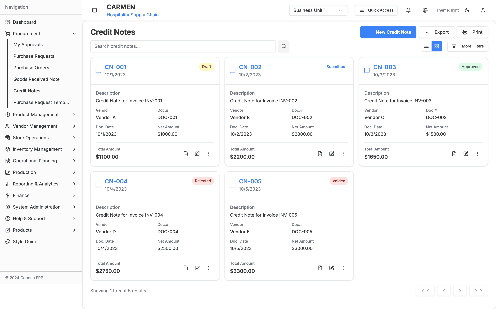
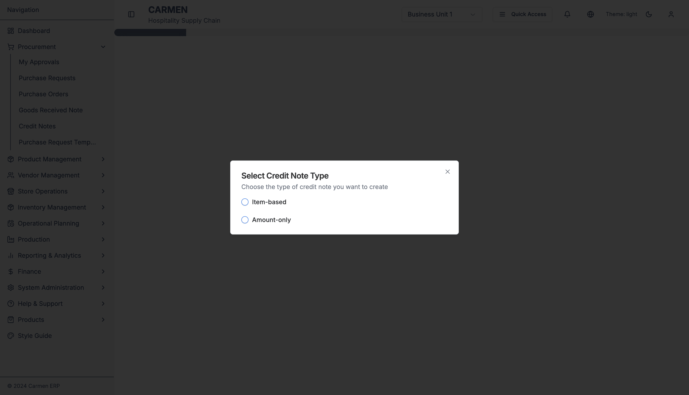
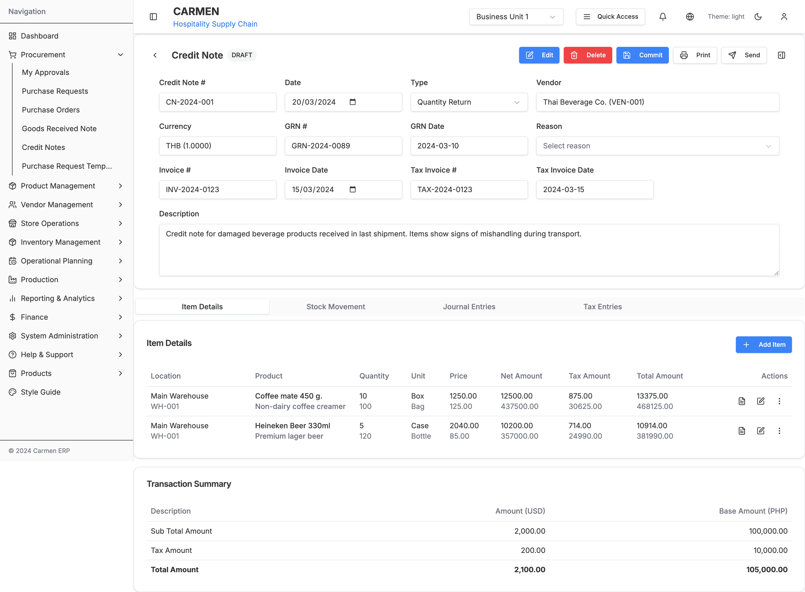
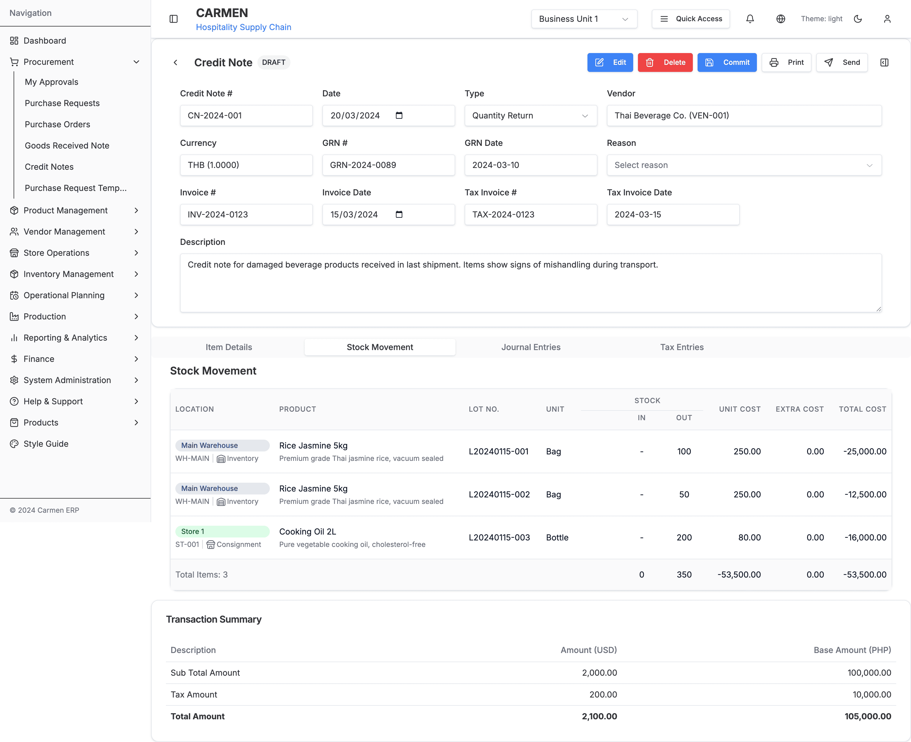

# Credit Note Module - User Interaction Guide

## Table of Contents
1. [Navigation & Entry Points](#navigation--entry-points)
2. [Primary User Workflows](#primary-user-workflows)
3. [Dialog Interactions](#dialog-interactions)
4. [Form Interactions](#form-interactions)
5. [Data Management](#data-management)
6. [Advanced Features](#advanced-features)

## Navigation & Entry Points

### Main Navigation
- **Primary Access:** Procurement → Credit Note (sidebar menu)
- **Breadcrumb:** Dashboard → Procurement → Credit Note
- **URL Pattern:** `/procurement/credit-note`

### Direct Links
- **Specific Credit Note:** `/procurement/credit-note/[CN-ID]`
- **Create from GRN:** `/procurement/credit-note/new/vendor-selection`
- **Create Manual:** `/procurement/credit-note/new-[UUID]?mode=confirm`
- **Edit Mode:** `/procurement/credit-note/[CN-ID]?mode=edit`

## Primary User Workflows

### 1. Create Credit Note from GRN

**Step-by-Step Process:**

1. **Navigate to Credit Note List**
   - Click "Procurement" in sidebar
   - Select "Credit Note"

2. **Initiate GRN-based Creation**
   - Click "New Credit Note" dropdown button
   - Select "Create from GRN"

3. **Select Vendor**
   - Use search to find vendor by name or registration number
   - Click "Select" button for desired vendor
   - System stores vendor selection and navigates to GRN selection

4. **Choose GRNs**
   - Review GRNs from selected vendor
   - Select single or multiple GRNs for credit note creation
   - Preview total amounts and item counts
   - Click "Continue" to proceed

5. **Select Items and Quantities**
   - Choose specific items to credit from selected GRNs
   - Enter credit quantities for each item
   - Select appropriate reason codes (return, damage, quality issue)
   - Add lot numbers if applicable
   - Review real-time amount calculations
   - Click "Next: Confirm Credit Note" to proceed

6. **Review Auto-populated Data**
   - Verify vendor information is correct
   - Check auto-populated items from selected GRNs
   - Review calculated totals and currency information
   - Modify quantities if partial credit

7. **Complete Header Information**
   - Set credit note date (defaults to today)
   - Enter credit note reference number (auto-generated)
   - Select credit note type (Quantity Return or Amount Discount)
   - Add reason for credit note
   - Choose appropriate cash book
   - Add description and remarks

8. **Configure Credit Note Type**
   - Select "Quantity Return" for returned goods
   - Select "Amount Discount" for price adjustments
   - Configure approval requirements if applicable

9. **Confirm and Save**
   - Review all details in confirm mode
   - Use "Edit Further" if changes needed
   - Click "Confirm & Save" to finalize credit note
   - System generates final credit note number and saves

**Screenshot References:**
- Credit Note List Page (Card and Table Views)
- New Credit Note Type Selection Dialog
- Credit Note Detail Page (Items and Stock Movement Tabs)

### 2. Create Credit Note Manually

**Step-by-Step Process:**

1. **Access Manual Creation**
   - From Credit Note List page
   - Click "New Credit Note" → "Create Manually"

2. **Auto-navigation to Confirm Mode**
   - System creates temporary credit note with placeholder data
   - Navigates directly to credit note detail in confirm mode
   - All fields empty for manual entry

3. **Enter Header Information**
   - Set credit note date
   - Select vendor from dropdown
   - Choose credit note type
   - Enter reference details manually
   - Choose cash book
   - Add description and reason

4. **Add Items Manually**
   - Navigate to Items tab
   - Click "Add Item" button
   - Search and select products
   - Enter quantities and pricing
   - Configure reason codes
   - Add lot numbers if applicable

5. **Review Financial Summary**
   - Check calculated totals
   - Verify currency amounts
   - Confirm calculations

6. **Finalize Credit Note**
   - Return to confirm mode view
   - Review all entered data
   - Click "Confirm & Save" to create credit note

### 3. Edit Existing Credit Note

**Edit Workflow:**

1. **Access Credit Note for Editing**
   - Open specific credit note from list
   - Click "Edit" button in form footer
   - System switches to edit mode

2. **Modify Credit Note Data**
   - Update header information as needed
   - Modify item quantities and pricing
   - Add or remove items
   - Update reason codes

3. **Review Changes**
   - Monitor "unsaved changes" indicator
   - Preview impact on financial totals
   - Validate all modifications

4. **Save or Cancel**
   - Click "Save" to commit changes
   - Or "Cancel" to discard modifications
   - System returns to view mode after save

### 4. Process Credit Note Approval

**Approval Workflow:**

1. **Access Credit Note for Review**
   - Open credit note in pending approval status
   - Review all credit note details
   - Check supporting documentation

2. **Review Credit Note Details**
   - Verify vendor information
   - Check item details and quantities
   - Review reason codes and justifications
   - Validate financial calculations

3. **Make Approval Decision**
   - Click "Approve" to approve credit note
   - Click "Reject" to reject with comments
   - Add approval comments if required

4. **Process Approved Credit Note**
   - System updates status to "Approved"
   - Generates necessary accounting entries
   - Updates vendor balance
   - Sends notifications to relevant parties

### 5. Manage Credit Note Items

**Item Management Workflow:**

1. **Access Items Tab**
   - Open credit note detail page
   - Click on "Items" tab

2. **Review Item Details**
   - Check credited quantities
   - Monitor reason codes
   - Identify item-specific issues

3. **Update Item Information**
   - Click edit icon for item
   - Modify credited quantity
   - Update reason codes
   - Add item-specific notes

4. **Handle Item Variations**
   - Use "Split Line" function for partial credits
   - Create separate line items for tracking
   - Track multiple reason codes per item

5. **Bulk Operations**
   - Select multiple items using checkboxes
   - Choose bulk action from dropdown
   - Apply changes to selected items

6. **Finalize Items**
   - Mark items as "Processed"
   - Close line items when complete
   - Update credit note status when all items complete

## Dialog Interactions

### 1. New Credit Note Creation Dialog

**Interface Elements:**
- **Process Type Selection**: Cards for GRN-based vs Manual creation
- **Visual Indicators**: Icons and descriptions for each option
- **Action Buttons**: Clear selection and navigation

**User Actions:**
- **Select Process Type**: Click on preferred creation method
- **Automatic Navigation**: System routes to appropriate next step
- **No Confirmation**: Selection immediately proceeds to workflow

### 2. Vendor Selection Dialog

**Interface Elements:**
- **Search Bar**: Filter vendors by name or registration
- **Vendor Table**: Business registration number, company name, action button
- **Loading States**: Progress indicators during data fetch

**User Actions:**
- **Search**: Type vendor name or registration number
- **Filter**: Real-time filtering as user types
- **Select**: Click "Select" button for desired vendor
- **Validation**: Only active vendors selectable

### 3. Item Add/Edit Dialogs

**Add Item Dialog:**
- **Product Search**: Searchable product catalog
- **Quantity Fields**: Available and credit quantities
- **Reason Code Selection**: Dropdown with predefined codes
- **Lot Number Entry**: Optional lot tracking
- **Validation**: Required fields and business rules

**Edit Item Dialog:**
- **Pre-populated Fields**: Current item values
- **Change Tracking**: Visual indicators for modifications
- **Impact Preview**: Updated totals before saving
- **Validation**: Quantity and reason code constraints

**User Actions:**
- **Product Selection**: Search and choose from catalog
- **Quantity Entry**: Enter credit amounts with validation
- **Reason Code Setup**: Select appropriate reason codes
- **Save/Cancel**: Commit changes or discard modifications

### 4. Approval Confirmation Dialog

**Dialog Triggers:**
- **Approval Action**: Credit note submitted for approval
- **Rejection Action**: Credit note rejected with comments

**Interface Elements:**
- **Action Summary**: Description of approval decision
- **Impact Information**: Financial and inventory impacts
- **Comment Field**: Required for rejections, optional for approvals
- **Confirmation Buttons**: Proceed or Cancel options

**User Actions:**
- **Review Details**: Verify credit note information
- **Add Comments**: Provide approval/rejection reasoning
- **Confirm Decision**: Proceed with approval action
- **Cancel**: Abort operation and return to credit note

### 5. Bulk Actions Confirmation

**Dialog Triggers:**
- **Item Selection**: Multiple credit notes selected in list
- **Bulk Action**: Action chosen from bulk actions menu

**Interface Elements:**
- **Action Summary**: Description of operation to be performed
- **Item Count**: Number of credit notes affected
- **Confirmation Buttons**: Proceed or Cancel options
- **Warning Messages**: For irreversible operations

**User Actions:**
- **Review Selection**: Verify credit notes and action
- **Confirm Operation**: Proceed with bulk action
- **Cancel**: Abort operation and return to list

## Form Interactions

### 1. Header Information Form

**Field Types and Validation:**

**Date Fields:**
- **Credit Note Date**: HTML5 date picker, defaults to today
- **GRN Date**: Read-only, populated from selected GRN
- **Due Date**: Optional, for payment terms

**Selection Fields:**
- **Vendor**: Dropdown with search capability
- **Credit Note Type**: Radio buttons (Quantity Return, Amount Discount)
- **Currency**: Multi-currency support with exchange rates
- **Cash Book**: Account selection for financial posting

**Text Fields:**
- **Reference Number**: Auto-generated or manual entry
- **Description**: Multi-line text area for details
- **Reason**: Required explanation for credit note
- **Remarks**: Additional comments and notes

**Validation Rules:**
- **Required Fields**: Date, vendor, type, reason marked with indicators
- **Date Logic**: Credit note date ≤ current date
- **Currency Consistency**: Must match GRN currency if from GRN
- **Character Limits**: Text fields have maximum length validation

### 2. Items Tab Interactions

**Item Selection:**
- **Individual Selection**: Checkbox per item row
- **Bulk Selection**: Master checkbox for all items
- **Range Selection**: Shift+click for contiguous ranges
- **Visual Feedback**: Selected items highlighted

**Quantity Management:**
- **Available Quantity**: Read-only (from GRN or manual entry)
- **Credit Quantity**: Editable field with validation
- **Unit Display**: Order unit and base unit with conversion

**Reason Code Management:**
- **Reason Code**: Dropdown with predefined codes
- **Custom Reason**: Text field for specific explanations
- **Category Grouping**: Codes grouped by category (quality, damage, return)

**Lot Management:**
- **Lot Number**: Text field for lot tracking
- **Expiry Date**: Date picker for perishable items
- **Batch Information**: Additional batch details

**Item Actions:**
- **Add New**: Button opens item creation dialog
- **Edit**: Pencil icon for item modification
- **Delete**: Trash icon with confirmation
- **Split**: Divide quantities for partial credits

### 3. Documents Tab Interactions

**Document Management:**
- **Upload**: Drag-and-drop or click to upload
- **Preview**: Click to view document content
- **Download**: Download original document
- **Delete**: Remove document with confirmation

**Document Types:**
- **Supporting Documents**: Invoices, delivery notes
- **Quality Reports**: Inspection reports, quality issues
- **Photos**: Product condition, damage evidence
- **Correspondence**: Email chains, vendor communication

**Document Validation:**
- **File Size**: Maximum file size limits
- **File Type**: Allowed formats (PDF, images, documents)
- **Virus Scanning**: Automatic security scanning
- **Access Control**: Permission-based access

## Data Management

### 1. Search and Filtering

**Quick Filters:**
- **Status-based Filtering**: Draft, Pending Approval, Approved, Processed
- **Date Range Selection**: From/To date pickers
- **Vendor Filtering**: Multi-select vendor dropdown
- **Amount Range**: Min/Max amount filters
- **Type Filtering**: Quantity Return vs Amount Discount

**Advanced Search:**
- **Credit Note Reference**: Exact or partial match
- **GRN Reference**: Cross-reference search
- **Item Description**: Search within credit note items
- **Reason Codes**: Search by reason categories
- **Multi-criteria**: Combine multiple search terms

**Search Features:**
- **Auto-complete**: Suggestions based on existing data
- **Search History**: Recently used search terms
- **Saved Searches**: Store frequently used filters
- **Clear Filters**: Reset all search criteria

### 2. Bulk Operations

**Selection Methods:**
- **Individual Selection**: Click checkboxes for specific credit notes
- **Page Selection**: Select all credit notes on current page
- **Filter-based Selection**: Select all matching filter criteria
- **Manual Range**: Shift+click for range selection

**Bulk Actions:**
- **Status Updates**: Change status for multiple credit notes
- **Export Operations**: Generate reports for selected credit notes
- **Print Batches**: Print multiple credit note documents
- **Delete Operations**: Remove multiple credit notes (with confirmation)
- **Approval Processing**: Bulk approve/reject operations

**Progress Tracking:**
- **Operation Progress**: Progress bars for bulk operations
- **Success/Failure Count**: Results summary with details
- **Error Reporting**: Detailed error information for failures
- **Rollback**: Undo operations if supported

### 3. Data Export and Import

**Export Options:**
- **PDF Reports**: Formatted credit note documents
- **Excel Spreadsheets**: Detailed data for analysis
- **CSV Files**: Data export for other systems
- **Financial Reports**: Accounting-focused exports

**Export Configuration:**
- **Date Range**: Specify export period
- **Field Selection**: Choose columns to include
- **Format Options**: Layout and styling preferences
- **Delivery Method**: Download or email delivery

**Import Capabilities:**
- **Bulk Credit Note Creation**: CSV import for multiple credit notes
- **Item Data**: Import item information from spreadsheets
- **Vendor Updates**: Bulk vendor information updates
- **Validation**: Data validation before import

## Advanced Features

### 1. Multi-Currency Handling

**Currency Operations:**
- **Real-time Exchange Rates**: Automatic rate retrieval
- **Historical Rates**: Date-specific exchange rates
- **Manual Rate Override**: Custom exchange rate entry
- **Currency Conversion**: Auto-conversion to base currency

**Multi-Currency Display:**
- **Primary Currency**: Credit note transaction currency
- **Base Currency**: Company reporting currency
- **Dual Display**: Side-by-side currency amounts
- **Conversion Calculations**: Transparent rate application

### 2. Workflow Integration

**GRN Integration:**
- **Seamless GRN to Credit Note**: Direct creation from GRNs
- **Three-way Matching**: GRN-Credit Note-Payment matching
- **Status Synchronization**: Update GRN status on credit note creation
- **Quantity Tracking**: Monitor credited vs received

**Inventory Integration:**
- **Stock Updates**: Automatic inventory adjustments
- **Location Tracking**: Multi-location stock management
- **Cost Updates**: Weighted average cost calculations
- **Availability Check**: Stock level validation

**Financial Integration:**
- **Journal Entries**: Automatic accounting entries
- **Vendor Balance Updates**: Real-time balance adjustments
- **Budget Integration**: Budget vs actual tracking
- **Payment Processing**: Integration with accounts payable

### 3. Approval Workflows

**Approval Routing:**
- **Amount-based Approval**: Different limits for different roles
- **Department Approval**: Route based on requesting department
- **Vendor Approval**: Special handling for new vendors
- **Exception Handling**: Escalation for unusual transactions

**Notification System:**
- **Email Notifications**: Automatic notifications to approvers
- **In-app Notifications**: Dashboard notification center
- **Mobile Notifications**: Push notifications for mobile users
- **Reminder System**: Automated follow-up reminders

### 4. Integration Features

**Vendor Portal Integration:**
- **Vendor Access**: Portal for vendors to view credit notes
- **Status Updates**: Real-time status communication
- **Document Sharing**: Secure document exchange
- **Payment Status**: Automated payment-credit note matching

**Quality Management:**
- **Quality Issues**: Integration with quality control
- **Inspection Results**: Link QC results to credit notes
- **Compliance Tracking**: Regulatory compliance monitoring
- **Certificate Management**: Track vendor certifications

**Reporting Integration:**
- **Financial Reporting**: Integration with financial reports
- **Operational Reports**: Credit note performance metrics
- **Compliance Reports**: Regulatory reporting support
- **Analytics**: Business intelligence integration

### 5. Document Management

**Document Lifecycle:**
- **Creation**: Automatic document generation
- **Review**: Multi-level document review process
- **Approval**: Electronic signature support
- **Archive**: Long-term document storage

**Document Security:**
- **Access Control**: Role-based document access
- **Audit Trail**: Complete document access logging
- **Version Control**: Document version management
- **Encryption**: Document encryption at rest and in transit

**Document Automation:**
- **Template Management**: Customizable document templates
- **Auto-generation**: Automatic document creation
- **Email Integration**: Automatic document distribution
- **Print Queue**: Batch printing capabilities

---

*Generated on: 2025-09-23*
*User Interaction Guide Version: 1.0*