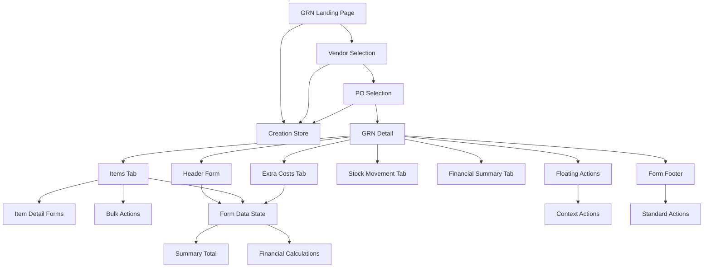

# Goods Received Note Module - Detailed Component Documentation

## Table of Contents
1. [Page Components](#page-components)
2. [Form Components](#form-components)
3. [Dialog Components](#dialog-components)
4. [Tab Components](#tab-components)
5. [Utility Components](#utility-components)
6. [Data Components](#data-components)
7. [Component Interactions](#component-interactions)

## Page Components

### 1. GoodsReceivedNotePage
**File:** `app/(main)/procurement/goods-received-note/page.tsx`

**Purpose:** Main landing page for GRN module with list management and creation workflows

**Key Features:**
- **View Mode Toggle**: Switch between table and card layouts
- **New GRN Dropdown**: Dual creation paths (PO-based and manual)
- **Process Type Management**: Handles creation workflow routing
- **Zustand Integration**: Manages global GRN creation state

**State Management:**
```typescript
const [processType, setProcessType] = useState<'po' | 'manual' | null>(null)
const [viewMode, setViewMode] = useState<'table' | 'card'>('table')
const { setNewlyCreatedGRNData } = useGRNCreationStore()
```

**Creation Flow Logic:**
```typescript
const handleProcessSelection = (type: 'po' | 'manual') => {
  setProcessType(type);
  if (type === 'po') {
    router.push('/procurement/goods-received-note/new/vendor-selection');
  } else { // Manual creation
    const tempId = `new-${uuidv4()}`;
    const placeholderData: GoodsReceiveNote = {
      id: tempId,
      ref: 'NEW GRN',
      // ... comprehensive placeholder structure
    };
    setNewlyCreatedGRNData(placeholderData);
    router.push(`/procurement/goods-received-note/${tempId}?mode=confirm`);
  }
}
```

**Dropdown Menu Options:**
- **Create from Purchase Order**: Initiates vendor selection workflow
- **Create Manually**: Direct creation with placeholder data

### 2. VendorSelectionPage
**File:** `app/(main)/procurement/goods-received-note/new/vendor-selection/page.tsx`

**Purpose:** Vendor selection interface for PO-based GRN creation

**Key Features:**
- **Vendor Search**: Real-time filtering by company name or registration number
- **Table Display**: Business registration details and selection actions
- **Store Integration**: Updates global creation state

**State Management:**
```typescript
const [vendors, setVendors] = useState<Vendor[]>([])
const [filteredVendors, setFilteredVendors] = useState<Vendor[]>([])
const [searchTerm, setSearchTerm] = useState('')
const [isLoading, setIsLoading] = useState(true)
```

**Search Implementation:**
```typescript
useEffect(() => {
  const lowerCaseSearch = searchTerm.toLowerCase();
  const results = vendors.filter(vendor =>
    (vendor.companyName?.toLowerCase() || '').includes(lowerCaseSearch) ||
    (vendor.businessRegistrationNumber?.toLowerCase() || '').includes(lowerCaseSearch)
  );
  setFilteredVendors(results);
}, [searchTerm, vendors]);
```

### 3. POSelectionPage
**File:** `app/(main)/procurement/goods-received-note/new/po-selection/page.tsx`

**Purpose:** Purchase Order selection for GRN item population

**Key Features:**
- **Filtered PO Display**: Shows only POs from selected vendor
- **Multi-selection Support**: Choose multiple POs for consolidated GRN
- **Status Validation**: Only available/partially received POs shown
- **Auto-calculation**: Preview GRN totals from selected POs

### 4. GRNDetailPage
**File:** `app/(main)/procurement/goods-received-note/[id]/page.tsx`

**Purpose:** Dynamic route handler for GRN detail operations

**Responsibilities:**
- URL parameter parsing (`id` and `mode`)
- Data fetching based on GRN ID
- Mode determination and routing
- Error handling for invalid IDs

**Route Patterns:**
- `/goods-received-note/[id]` - View existing GRN
- `/goods-received-note/[id]?mode=edit` - Edit mode
- `/goods-received-note/new-[uuid]?mode=confirm` - Confirm new GRN
- `/goods-received-note/[id]?mode=add` - Add mode

## Form Components

### 1. GoodsReceiveNoteDetail (Main Form Container)
**File:** `components/GoodsReceiveNoteDetail.tsx`

**Purpose:** Comprehensive GRN management interface with multi-mode support

**Mode System:**
```typescript
export type GRNDetailMode = GoodsReceiveNoteMode | 'confirm';
// Supports: 'view' | 'edit' | 'add' | 'confirm'
```

**Key State Management:**
```typescript
const [formData, setFormData] = useState<GoodsReceiveNote>(initialData)
const [currentMode, setCurrentMode] = useState<GRNDetailMode>(mode)
const [extraCosts, setExtraCosts] = useState<ExtraCost[]>([])
const [selectedItems, setSelectedItems] = useState<string[]>([])
const [expandedItems, setExpandedItems] = useState<string[]>([])
const [hasUnsavedChanges, setHasUnsavedChanges] = useState(false)
const [isLoading, setIsLoading] = useState(false)
```

**Mode-Aware Behavior:**
```typescript
const isReadOnly = currentMode === 'view' || currentMode === 'confirm';

const handleModeChange = (newMode: GRNDetailMode) => {
  setCurrentMode(newMode);
  if (onModeChange) {
    onModeChange(newMode);
  }
}
```

### 2. Header Information Form
**Location:** Within GoodsReceiveNoteDetail component

**Field Structure:**
```typescript
// Grid Layout: 6 columns responsive
<div className="grid grid-cols-6 gap-6">
  {/* Row 1: Reference, Dates, Invoice Details */}
  <div className="space-y-2 col-span-1">
    <Label htmlFor="ref">Requisition</Label>
    <Input id="ref" readOnly value={formData.ref} />
  </div>

  <div className="space-y-2 col-span-1">
    <Label htmlFor="date">Date</Label>
    <Input id="date" type="date" readOnly={isReadOnly}
           value={formData.date ? format(new Date(formData.date), 'yyyy-MM-dd') : ''}
           onChange={e => setFormData({...formData, date: new Date(e.target.value)})} />
  </div>

  // ... additional fields
</div>
```

**Field Categories:**
- **Reference Fields**: Requisition number (read-only)
- **Date Fields**: GRN date, invoice date, tax invoice date
- **Invoice Fields**: Invoice number, tax invoice number
- **Description**: Multi-line text area
- **Selection Fields**: Receiver, vendor, currency, cash book
- **Status Field**: Current GRN status (read-only)
- **Flag Fields**: Consignment, cash transaction checkboxes

**Validation Rules:**
- Date fields use HTML5 date input with format validation
- Required fields: Date, vendor, receiver
- Conditional field enabling based on mode (isReadOnly)
- Real-time change tracking for unsaved changes indicator

### 3. Item Detail Forms
**File:** `components/tabs/itemDetailForm.tsx`

**Purpose:** Individual GRN item management

**Field Structure:**
- **Product Information**: Name, description, specifications
- **Quantity Management**: Ordered, received, remaining quantities
- **Unit Handling**: Order unit, base unit, conversion factors
- **Pricing**: Unit price, subtotal, discounts, taxes
- **Status Tracking**: Item status and PO reference

**Calculation Logic:**
```typescript
// Auto-calculation of item totals
const subTotalPrice = orderedQuantity * unitPrice;
const discountAmount = subTotalPrice * (discountRate / 100);
const netAmount = subTotalPrice - discountAmount;
const taxAmount = netAmount * (taxRate / 100);
const totalAmount = netAmount + taxAmount;
```

## Dialog Components

### 1. New GRN Process Selection Dialog
**Purpose:** Choose between PO-based and manual GRN creation

**Interface Elements:**
- **Option Cards**: Visual selection between creation methods
- **Process Type State**: Tracks selected creation path
- **Routing Logic**: Navigation to appropriate next step

**User Flow:**
1. Click "New GRN" button
2. Dialog presents two options
3. Selection triggers appropriate workflow
4. Dialog closes and navigates to next step

### 2. Item Add/Edit Dialogs
**Purpose:** Manage individual GRN items

**Add Item Dialog:**
- **Product Search**: Searchable product catalog
- **Quantity Input**: Ordered and received quantities
- **Pricing Setup**: Unit price, discount, tax configuration
- **Validation**: Required fields and business rules

**Edit Item Dialog:**
- **Pre-populated Fields**: Current item values
- **Change Tracking**: Monitor modifications
- **Impact Calculation**: Update totals on changes

### 3. Bulk Actions Confirmation
**Purpose:** Confirm bulk operations on selected items

**Actions Supported:**
- **Delete Items**: Remove multiple items with confirmation
- **Mark as Received**: Update quantities for multiple items
- **Update Pricing**: Bulk price adjustments
- **Status Changes**: Mass status updates

## Tab Components

### 1. GoodsReceiveNoteItems
**File:** `components/tabs/GoodsReceiveNoteItems.tsx`

**Purpose:** Comprehensive item management interface

**Key Features:**
- **Item Listing**: Table view with sortable columns
- **Selection Management**: Individual and bulk selection
- **Inline Editing**: Direct item modification
- **Add Item Functionality**: New item creation
- **Bulk Actions**: Multi-item operations

**State Integration:**
```typescript
interface GoodsReceiveNoteItemsProps {
  mode: GRNDetailMode
  items: GoodsReceiveNoteItem[]
  onItemsChange: (items: GoodsReceiveNoteItem[]) => void
  selectedItems: string[]
  onItemSelect: (itemId: string, isSelected: boolean) => void
  exchangeRate: number
  baseCurrency: string
  currency: string
}
```

**Item Actions:**
- **Edit**: Inline or popup editing
- **Delete**: Individual item removal
- **Split**: Divide quantities for partial receipts
- **Status Update**: Change item status

### 2. ExtraCostsTab
**File:** `components/tabs/ExtraCostsTab.tsx`

**Purpose:** Additional cost management and allocation

**Features:**
- **Cost Entry**: Description, amount, currency
- **Allocation Methods**: Even, weighted, manual distribution
- **Cost Preview**: Impact on item costs
- **Real-time Updates**: Automatic total recalculation

**Allocation Types:**
```typescript
type AllocationType = 'even' | 'weighted' | 'manual'

interface ExtraCost {
  id: string
  description: string
  amount: number
  currency: string
  allocationType: AllocationType
  allocation: ExtraCostAllocation[]
}
```

### 3. StockMovementTab
**File:** `components/tabs/StockMovementTab.tsx`

**Purpose:** Inventory impact visualization and management

**Components:**
- **Movement Summary**: Overview of stock changes
- **Item Impact**: Per-item inventory effects
- **Location Tracking**: Stock movement between locations
- **Status Updates**: Movement processing status

**Stock Movement Display:**
```typescript
interface StockMovement {
  id: string
  itemId: string
  productId: string
  movementType: 'IN' | 'OUT' | 'TRANSFER'
  quantity: number
  fromLocation?: string
  toLocation: string
  unitCost: number
  totalCost: number
  movementDate: Date
  status: 'Pending' | 'Processed' | 'Cancelled'
}
```

### 4. FinancialSummaryTab
**File:** `components/tabs/FinancialSummaryTab.tsx`

**Purpose:** Financial calculations and journal entry preview

**Financial Display:**
- **Subtotals**: Pre-tax amounts
- **Discounts**: Total discount amounts
- **Tax Calculations**: Tax breakdown by rate
- **Currency Conversion**: Base currency equivalents
- **Journal Preview**: Expected accounting entries

**Calculation Engine:**
```typescript
const calculateFinancialSummary = (): FinancialSummary => {
  const netAmount = formData.items.reduce((sum, item) => sum + item.netAmount, 0);
  const taxAmount = formData.items.reduce((sum, item) => sum + item.taxAmount, 0);
  const totalAmount = netAmount + taxAmount;
  const exchangeRate = formData.exchangeRate || 1.2;

  return {
    id: formData.financialSummary?.id || 'temp-summary-1',
    netAmount,
    taxAmount,
    totalAmount,
    currency: formData.currency,
    baseNetAmount: netAmount * exchangeRate,
    baseTaxAmount: taxAmount * exchangeRate,
    baseTotalAmount: totalAmount * exchangeRate,
    baseCurrency: formData.baseCurrency || 'USD',
    // ... journal entry details
  };
};
```

## Utility Components

### 1. GoodsReceiveNoteItemsBulkActions
**File:** `components/tabs/GoodsReceiveNoteItemsBulkActions.tsx`

**Purpose:** Bulk operations interface for selected items

**Action Types:**
- **Delete Selected**: Remove multiple items with confirmation
- **Mark as Received**: Update received quantities
- **Apply Discount**: Bulk discount application
- **Update Status**: Mass status changes

**Interface:**
```typescript
interface BulkActionsProps {
  selectedItems: string[]
  onBulkAction: (action: string) => void
}
```

### 2. SummaryTotal
**File:** `components/SummaryTotal.tsx`

**Purpose:** Financial summary display with real-time calculations

**Features:**
- **Total Calculation**: Sum of all items and extra costs
- **Currency Display**: Primary and base currency amounts
- **Tax Breakdown**: Detailed tax calculations
- **Exchange Rate Impact**: Currency conversion effects

**Display Format:**
```typescript
interface SummaryTotalProps {
  poData: GoodsReceiveNote
}

// Displays:
// - Subtotal (pre-discount)
// - Discount Amount
// - Net Amount
// - Tax Amount
// - Total Amount
// - Base Currency Equivalents
```

### 3. FormFooter
**File:** `@/components/ui/form-footer`

**Purpose:** Consistent form action interface

**Mode-Aware Actions:**
- **View Mode**: Edit button
- **Edit Mode**: Save, Cancel buttons
- **Confirm Mode**: Custom action buttons
- **Loading States**: Disabled buttons with spinners

**Change Tracking:**
```typescript
<FormFooter
  mode={currentMode}
  onSave={handleSave}
  onCancel={handleCancelEdit}
  onEdit={handleEditClick}
  isLoading={isLoading}
  hasChanges={hasUnsavedChanges}
>
  {hasUnsavedChanges ? 'You have unsaved changes' : 'No changes made'}
</FormFooter>
```

### 4. FloatingActionMenu
**File:** `@/components/ui/form-footer`

**Purpose:** Context-specific floating action buttons

**Visibility Rules:**
```typescript
<FloatingActionMenu
  visible={currentMode === 'confirm' || (currentMode === 'view' && formData.status === 'Received')}
  position="bottom-right"
  summary={{
    title: currentMode === 'confirm' ? 'Confirmation Required' : 'GRN Status',
    description: currentMode === 'confirm'
      ? 'Review all details before saving'
      : `Status: ${formData.status}`,
    metadata: `${formData.items?.length || 0} items to process`
  }}
  actions={getFloatingActions()}
/>
```

**Context Actions:**
- **Confirm Mode**: Edit Further, Confirm & Save
- **View Mode**: Delete, Send, Print, Export

## Data Components

### 1. GRN Creation Store (Zustand)
**File:** `lib/store/grn-creation.store.ts`

**Purpose:** Global state management for GRN creation workflow

**Store Structure:**
```typescript
interface GRNCreationStore {
  // State
  selectedVendor: Vendor | null
  selectedPOs: PurchaseOrder[]
  currentStep: 'vendor-selection' | 'po-selection' | 'grn-creation'
  newlyCreatedGRNData: GoodsReceiveNote | null

  // Actions
  setSelectedVendor: (vendor: Vendor) => void
  setSelectedPOs: (pos: PurchaseOrder[]) => void
  setStep: (step: string) => void
  setNewlyCreatedGRNData: (data: GoodsReceiveNote) => void
  clearCreationData: () => void
}
```

**Usage Pattern:**
```typescript
const {
  selectedVendor,
  setSelectedVendor,
  setStep,
  newlyCreatedGRNData,
  setNewlyCreatedGRNData
} = useGRNCreationStore()
```

### 2. Data Tables and Lists
**Purpose:** Display GRN and related data in structured formats

**Table Components:**
- **GRN List Table**: Main GRN listing with sorting and filtering
- **Vendor Selection Table**: Vendor display with search
- **PO Selection Table**: Purchase order selection interface
- **Item Management Table**: GRN item listing and editing

**Common Features:**
- **Sorting**: Column-based sorting
- **Filtering**: Search and filter capabilities
- **Pagination**: Large dataset handling
- **Selection**: Single and multi-select support

### 3. Mock Data Integration
**File:** Various mock data files

**Data Sources:**
- **Mock GRNs**: Sample GRN data for development
- **Mock Vendors**: Vendor information for selection
- **Mock Products**: Product catalog for item creation
- **Mock Users**: User data for receiver selection

## Component Interactions

### Data Flow Between Components



### Event Handling

**Parent-Child Communication:**
- **Props Drilling**: Data and event handlers passed down
- **Callback Functions**: Child components notify parents of changes
- **State Lifting**: Shared state managed at appropriate levels

**State Synchronization:**
- **Form Data Updates**: Changes propagate through component tree
- **Financial Recalculation**: Automatic totals update on item changes
- **Mode Changes**: UI adaptation based on current mode

**Navigation Events:**
- **Router Push**: Programmatic navigation between pages
- **URL Parameters**: Mode and state information in URL
- **Store Updates**: Global state changes for cross-page data

### Error Handling

**Component-Level Errors:**
- **Form Validation**: Field-level validation with error display
- **API Errors**: Graceful handling of network failures
- **State Errors**: Recovery from invalid state conditions

**User Feedback:**
- **Loading States**: Visual feedback during async operations
- **Success Messages**: Confirmation of successful actions
- **Error Messages**: Clear error communication and recovery options

---

*Generated on: Latest*
*Component Documentation Version: 1.0*