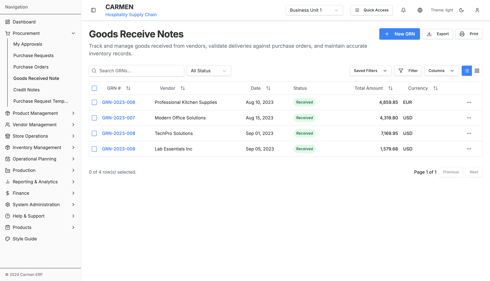
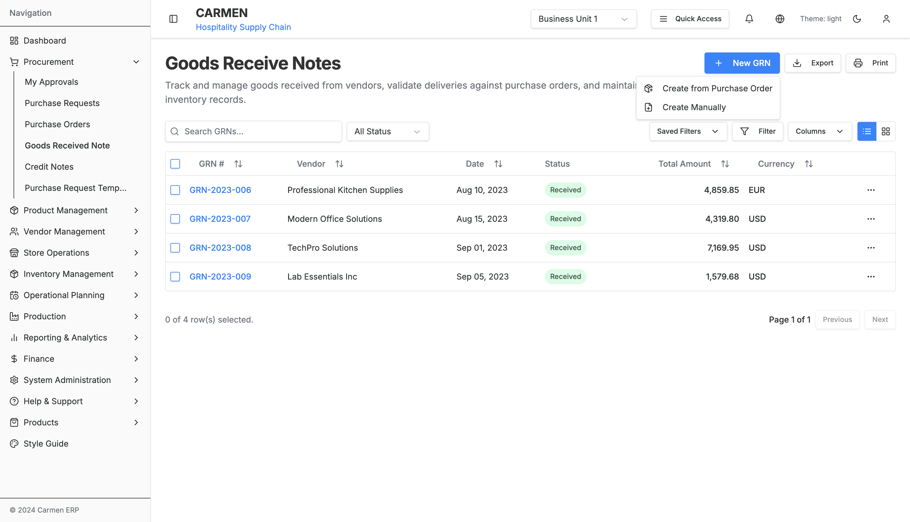
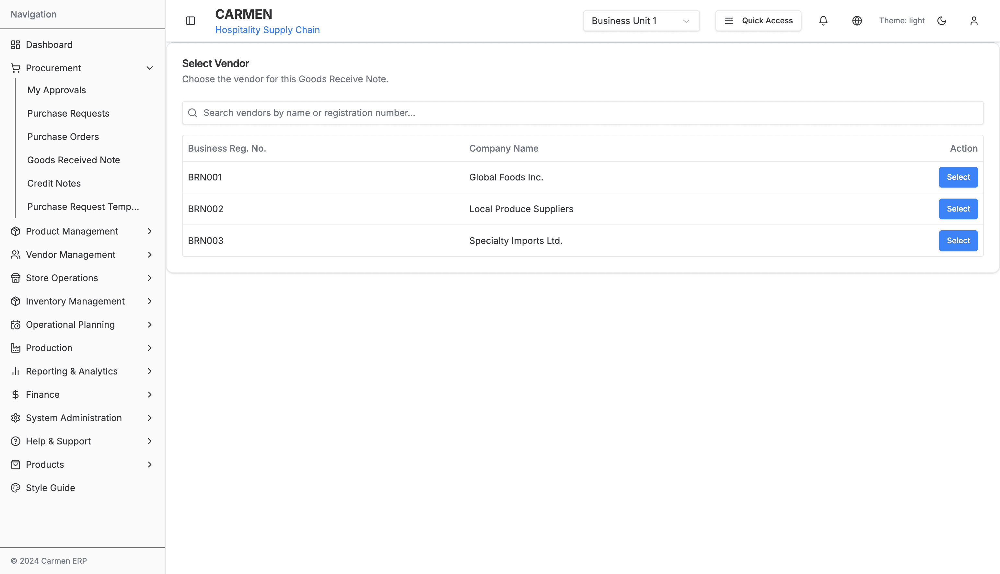
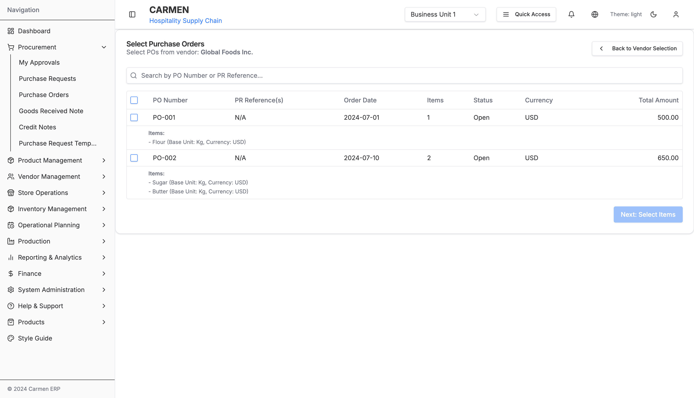
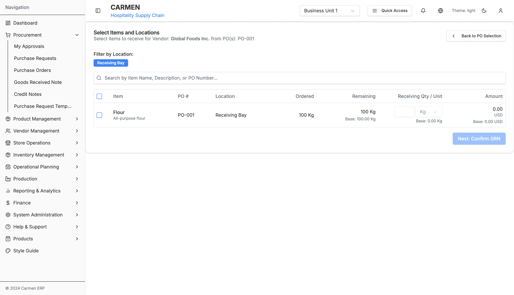
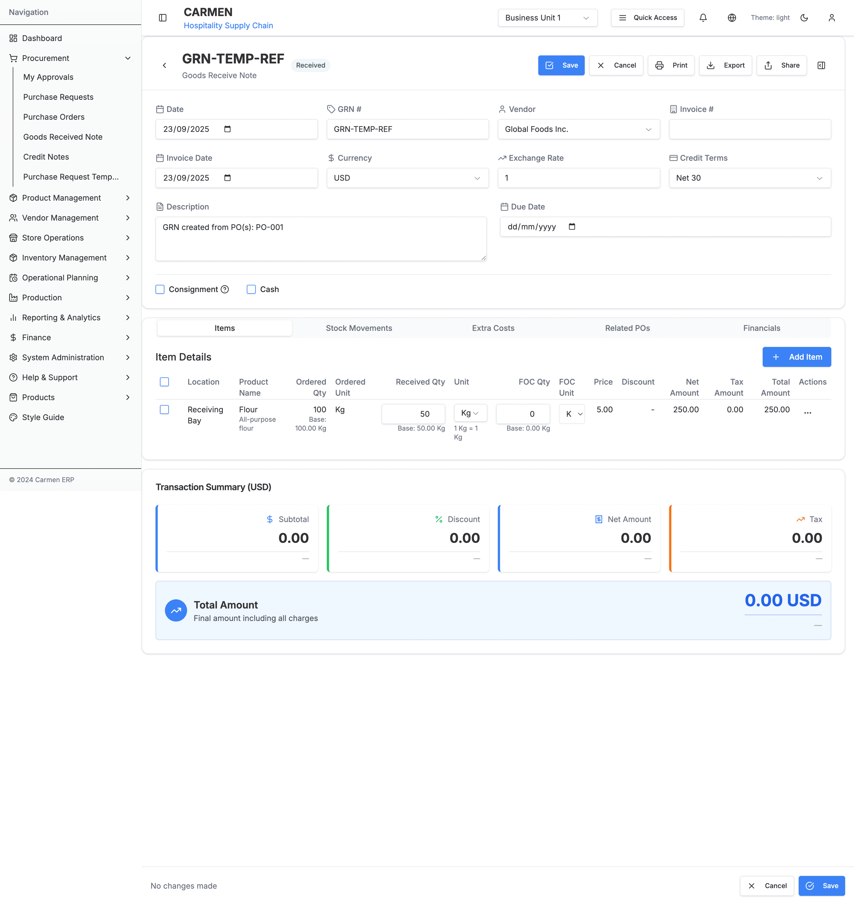
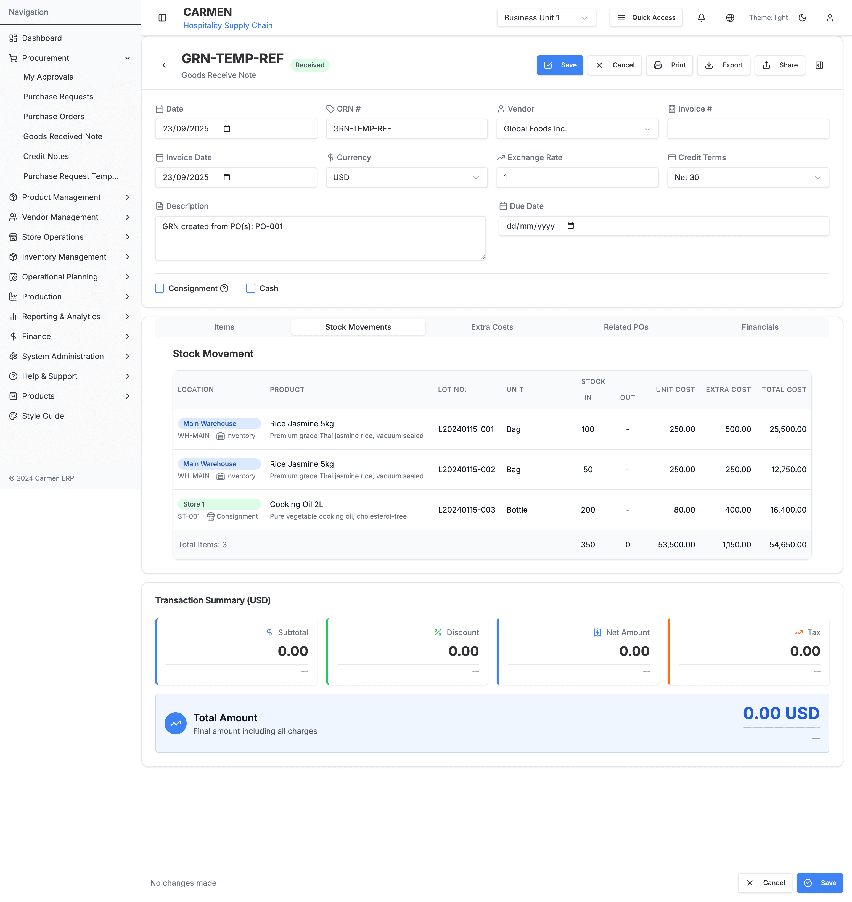

# Goods Received Note Module - User Interaction Guide

## Table of Contents
1. [Navigation & Entry Points](#navigation--entry-points)
2. [Primary User Workflows](#primary-user-workflows)
3. [Dialog Interactions](#dialog-interactions)
4. [Form Interactions](#form-interactions)
5. [Data Management](#data-management)
6. [Advanced Features](#advanced-features)

## Navigation & Entry Points

### Main Navigation
- **Primary Access:** Procurement → Goods Received Note (sidebar menu)
- **Breadcrumb:** Dashboard → Procurement → Goods Received Note
- **URL Pattern:** `/procurement/goods-received-note`

### Direct Links
- **Specific GRN:** `/procurement/goods-received-note/[GRN-ID]`
- **Create from PO:** `/procurement/goods-received-note/new/vendor-selection`
- **Create Manual:** `/procurement/goods-received-note/new-[UUID]?mode=confirm`
- **Edit Mode:** `/procurement/goods-received-note/[GRN-ID]?mode=edit`

## Primary User Workflows

### 1. Create GRN from Purchase Order

**Step-by-Step Process:**

1. **Navigate to GRN List**
   - Click "Procurement" in sidebar
   - Select "Goods Received Note"

2. **Initiate PO-based Creation**
   - Click "New GRN" dropdown button
   - Select "Create from Purchase Order"

3. **Select Vendor**
   - Use search to find vendor by name or registration number
   - Click "Select" button for desired vendor
   - System stores vendor selection and navigates to PO selection

4. **Choose Purchase Orders**
   - Review POs from selected vendor
   - Select single or multiple POs for consolidation
   - Preview total amounts and item counts
   - Click "Create GRN" to proceed

5. **Select Items and Quantities**
   - Choose specific items to receive from selected POs
   - Enter receiving quantities for each item
   - Select appropriate locations (e.g., Receiving Bay)
   - Review real-time amount calculations
   - Click "Next: Confirm GRN" to proceed

6. **Review Auto-populated Data**
   - Verify vendor information is correct
   - Check auto-populated items from selected POs
   - Review calculated totals and currency information
   - Modify quantities if partial receipt

7. **Complete Header Information**
   - Set GRN date (defaults to today)
   - Enter invoice number and date
   - Add tax invoice details if applicable
   - Select receiver from dropdown
   - Choose appropriate cash book
   - Add description and remarks

8. **Configure Special Flags**
   - Check "Consignment" if applicable
   - Check "Cash" for cash transactions

9. **Confirm and Save**
   - Review all details in confirm mode
   - Use "Edit Further" if changes needed
   - Click "Confirm & Save" to finalize GRN
   - System generates real GRN number and saves

**Screenshot References:**
- GRN List with New GRN dropdown
- Vendor selection interface
- PO selection with totals preview
- GRN detail in confirm mode

### 2. Create GRN Manually

**Step-by-Step Process:**

1. **Access Manual Creation**
   - From GRN List page
   - Click "New GRN" → "Create Manually"

2. **Auto-navigation to Confirm Mode**
   - System creates temporary GRN with placeholder data
   - Navigates directly to GRN detail in confirm mode
   - All fields empty for manual entry

3. **Enter Header Information**
   - Set GRN date
   - Select vendor from dropdown
   - Enter invoice details manually
   - Choose receiver and cash book
   - Add description

4. **Add Items Manually**
   - Navigate to Items tab
   - Click "Add Item" button
   - Search and select products
   - Enter quantities and pricing
   - Configure discounts and taxes

5. **Add Extra Costs (Optional)**
   - Navigate to Extra Costs tab
   - Add freight, insurance, handling charges
   - Choose allocation method (even, weighted, manual)

6. **Review Financial Summary**
   - Check calculated totals
   - Verify currency amounts
   - Confirm tax calculations

7. **Finalize GRN**
   - Return to confirm mode view
   - Review all entered data
   - Click "Confirm & Save" to create GRN

### 3. Edit Existing GRN

**Edit Workflow:**

1. **Access GRN for Editing**
   - Open specific GRN from list
   - Click "Edit" button in form footer
   - System switches to edit mode

2. **Modify GRN Data**
   - Update header information as needed
   - Modify item quantities and pricing
   - Add or remove items
   - Adjust extra costs

3. **Review Changes**
   - Monitor "unsaved changes" indicator
   - Preview impact on financial totals
   - Validate all modifications

4. **Save or Cancel**
   - Click "Save" to commit changes
   - Or "Cancel" to discard modifications
   - System returns to view mode after save

### 4. Process Item Receipts

**Item Management Workflow:**

1. **Access Items Tab**
   - Open GRN detail page
   - Click on "Items" tab

2. **Review Item Status**
   - Check ordered vs received quantities
   - Monitor remaining quantities
   - Identify pending items

3. **Update Received Quantities**
   - Click edit icon for item
   - Modify received quantity
   - System auto-calculates remaining
   - Update item status accordingly

4. **Handle Partial Receipts**
   - Use "Split Line" function for partial delivery
   - Create separate line items for tracking
   - Track multiple delivery dates

5. **Bulk Operations**
   - Select multiple items using checkboxes
   - Choose bulk action from dropdown
   - Apply changes to selected items

6. **Finalize Items**
   - Mark items as "Fully Received"
   - Close line items when complete
   - Update GRN status when all items complete

7. **Review Stock Movements**
   - Click on "Stock Movements" tab
   - Monitor inventory impacts by location
   - Review unit costs and total costs
   - Verify stock level updates

## Dialog Interactions

### 1. New GRN Creation Dialog

**Interface Elements:**
- **Process Type Selection**: Cards for PO-based vs Manual creation
- **Visual Indicators**: Icons and descriptions for each option
- **Action Buttons**: Clear selection and navigation

**User Actions:**
- **Select Process Type**: Click on preferred creation method
- **Automatic Navigation**: System routes to appropriate next step
- **No Confirmation**: Selection immediately proceeds to workflow

### 2. Vendor Selection Dialog

**Interface Elements:**
- **Search Bar**: Filter vendors by name or registration
- **Vendor Table**: Business registration number, company name, action button
- **Loading States**: Progress indicators during data fetch

**User Actions:**
- **Search**: Type vendor name or registration number
- **Filter**: Real-time filtering as user types
- **Select**: Click "Select" button for desired vendor
- **Validation**: Only active vendors selectable

### 3. Item Add/Edit Dialogs

**Add Item Dialog:**
- **Product Search**: Searchable product catalog
- **Quantity Fields**: Ordered and received quantities
- **Pricing Configuration**: Unit price, discounts, taxes
- **Validation**: Required fields and business rules

**Edit Item Dialog:**
- **Pre-populated Fields**: Current item values
- **Change Tracking**: Visual indicators for modifications
- **Impact Preview**: Updated totals before saving
- **Validation**: Quantity and pricing constraints

**User Actions:**
- **Product Selection**: Search and choose from catalog
- **Quantity Entry**: Enter ordered and received amounts
- **Pricing Setup**: Configure unit price and adjustments
- **Save/Cancel**: Commit changes or discard modifications

### 4. Bulk Actions Confirmation

**Dialog Triggers:**
- **Item Selection**: Multiple items selected in Items tab
- **Bulk Action**: Action chosen from bulk actions menu

**Interface Elements:**
- **Action Summary**: Description of operation to be performed
- **Item Count**: Number of items affected
- **Confirmation Buttons**: Proceed or Cancel options
- **Warning Messages**: For destructive operations

**User Actions:**
- **Review Selection**: Verify items and action
- **Confirm Operation**: Proceed with bulk action
- **Cancel**: Abort operation and return to item list

## Form Interactions

### 1. Header Information Form

**Field Types and Validation:**

**Date Fields:**
- **GRN Date**: HTML5 date picker, defaults to today
- **Invoice Date**: Must be ≤ GRN date
- **Tax Invoice Date**: Optional, validation if provided

**Selection Fields:**
- **Vendor**: Dropdown with search capability
- **Receiver**: Staff member selection
- **Currency**: Multi-currency support with exchange rates
- **Cash Book**: Account selection for financial posting

**Text Fields:**
- **Invoice Numbers**: Alphanumeric input with validation
- **Description**: Multi-line text area for details
- **Remarks**: Additional comments and notes

**Validation Rules:**
- **Required Fields**: Date, vendor, receiver marked with indicators
- **Date Logic**: Invoice date ≤ GRN date ≤ current date
- **Currency Consistency**: Must match PO currency if from PO
- **Character Limits**: Text fields have maximum length validation

### 2. Items Tab Interactions

**Item Selection:**
- **Individual Selection**: Checkbox per item row
- **Bulk Selection**: Master checkbox for all items
- **Range Selection**: Shift+click for contiguous ranges
- **Visual Feedback**: Selected items highlighted

**Quantity Management:**
- **Ordered Quantity**: Read-only (from PO or manual entry)
- **Received Quantity**: Editable field with validation
- **Remaining Quantity**: Auto-calculated (Ordered - Received)
- **Unit Display**: Order unit and base unit with conversion

**Pricing Configuration:**
- **Unit Price**: Editable with currency formatting
- **Discount Rate**: Percentage input with validation
- **Tax Rate**: Configurable tax percentage
- **Total Calculation**: Auto-calculated display

**Item Actions:**
- **Add New**: Button opens item creation dialog
- **Edit**: Pencil icon for item modification
- **Delete**: Trash icon with confirmation
- **Split**: Divide quantities for partial receipts

### 3. Extra Costs Tab Interactions

**Cost Entry:**
- **Description**: Text field for cost description
- **Amount**: Currency input with validation
- **Currency**: Dropdown selection
- **Allocation Type**: Radio buttons for distribution method

**Allocation Methods:**
- **Even**: Equal distribution across all items
- **Weighted**: Distribution based on item values
- **Manual**: Custom allocation per item

**Real-time Updates:**
- **Total Impact**: Immediate calculation of cost effect
- **Item Allocation**: Show distribution across items
- **Financial Summary**: Auto-update of GRN totals

## Data Management

### 1. Search and Filtering

**Quick Filters:**
- **Status-based Filtering**: Draft, Received, Verified, Posted
- **Date Range Selection**: From/To date pickers
- **Vendor Filtering**: Multi-select vendor dropdown
- **Amount Range**: Min/Max amount filters

**Advanced Search:**
- **GRN Reference**: Exact or partial match
- **Invoice Number**: Cross-reference search
- **Item Description**: Search within GRN items
- **Multi-criteria**: Combine multiple search terms

**Search Features:**
- **Auto-complete**: Suggestions based on existing data
- **Search History**: Recently used search terms
- **Saved Searches**: Store frequently used filters
- **Clear Filters**: Reset all search criteria

### 2. Bulk Operations

**Selection Methods:**
- **Individual Selection**: Click checkboxes for specific GRNs
- **Page Selection**: Select all GRNs on current page
- **Filter-based Selection**: Select all matching filter criteria
- **Manual Range**: Shift+click for range selection

**Bulk Actions:**
- **Status Updates**: Change status for multiple GRNs
- **Export Operations**: Generate reports for selected GRNs
- **Print Batches**: Print multiple GRN documents
- **Delete Operations**: Remove multiple GRNs (with confirmation)

**Progress Tracking:**
- **Operation Progress**: Progress bars for bulk operations
- **Success/Failure Count**: Results summary with details
- **Error Reporting**: Detailed error information for failures
- **Rollback**: Undo operations if supported

### 3. Data Export and Import

**Export Options:**
- **PDF Reports**: Formatted GRN documents
- **Excel Spreadsheets**: Detailed data for analysis
- **CSV Files**: Data export for other systems
- **Financial Reports**: Accounting-focused exports

**Export Configuration:**
- **Date Range**: Specify export period
- **Field Selection**: Choose columns to include
- **Format Options**: Layout and styling preferences
- **Delivery Method**: Download or email delivery

**Import Capabilities:**
- **Bulk GRN Creation**: CSV import for multiple GRNs
- **Item Data**: Import item information from spreadsheets
- **Vendor Updates**: Bulk vendor information updates
- **Validation**: Data validation before import

## Advanced Features

### 1. Multi-Currency Handling

**Currency Operations:**
- **Real-time Exchange Rates**: Automatic rate retrieval
- **Historical Rates**: Date-specific exchange rates
- **Manual Rate Override**: Custom exchange rate entry
- **Currency Conversion**: Auto-conversion to base currency

**Multi-Currency Display:**
- **Primary Currency**: GRN transaction currency
- **Base Currency**: Company reporting currency
- **Dual Display**: Side-by-side currency amounts
- **Conversion Calculations**: Transparent rate application

### 2. Workflow Integration

**Purchase Order Integration:**
- **Seamless PO to GRN**: Direct creation from POs
- **Three-way Matching**: PO-GRN-Invoice matching
- **Status Synchronization**: Update PO status on GRN creation
- **Quantity Tracking**: Monitor ordered vs received

**Inventory Integration:**
- **Stock Updates**: Automatic inventory adjustments
- **Location Tracking**: Multi-location stock management
- **Cost Updates**: Weighted average cost calculations
- **Availability Check**: Stock level validation

**Financial Integration:**
- **Journal Entries**: Automatic accounting entries
- **Cost Center Allocation**: Departmental cost assignment
- **Budget Integration**: Budget vs actual tracking
- **Payment Processing**: Integration with accounts payable

### 3. Approval Workflows

**Approval Routing:**
- **Amount-based Approval**: Different limits for different roles
- **Department Approval**: Route based on requesting department
- **Vendor Approval**: Special handling for new vendors
- **Exception Handling**: Escalation for unusual transactions

**Notification System:**
- **Email Notifications**: Automatic notifications to approvers
- **In-app Notifications**: Dashboard notification center
- **Mobile Notifications**: Push notifications for mobile users
- **Reminder System**: Automated follow-up reminders

### 4. Integration Features

**Vendor Portal Integration:**
- **Vendor Access**: Portal for vendors to view GRNs
- **Status Updates**: Real-time status communication
- **Document Sharing**: Secure document exchange
- **Invoice Matching**: Automated invoice-GRN matching

**Quality Management:**
- **Quality Checks**: Integration with quality control
- **Inspection Results**: Link QC results to GRNs
- **Compliance Tracking**: Regulatory compliance monitoring
- **Certificate Management**: Track vendor certifications

**Reporting Integration:**
- **Financial Reporting**: Integration with financial reports
- **Operational Reports**: GRN performance metrics
- **Compliance Reports**: Regulatory reporting support
- **Analytics**: Business intelligence integration

---

*Generated on: Latest*
*User Interaction Guide Version: 1.0*