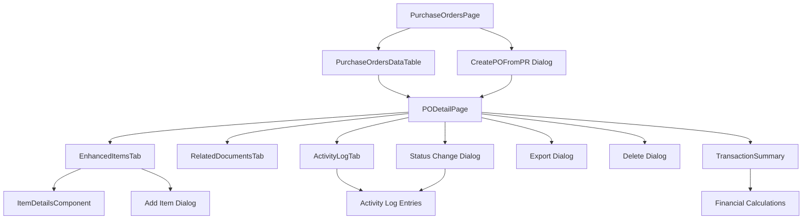

# Purchase Order Module - Detailed Component Documentation

## Table of Contents
1. [Page Components](#page-components)
2. [Form Components](#form-components)
3. [Dialog Components](#dialog-components)
4. [Tab Components](#tab-components)
5. [Utility Components](#utility-components)
6. [Data Components](#data-components)

## Page Components

### 1. PurchaseOrdersPage
**File:** `app/(main)/procurement/purchase-orders/page.tsx`

**Purpose:** Main landing page for Purchase Orders module

**Key Features:**
- Responsive header with action buttons
- Toggle between table and card views
- New PO dropdown menu with multiple creation options
- Integration with CreatePOFromPR dialog
- Export and print functionality

**State Management:**
```typescript
const [viewMode, setViewMode] = useState<"table" | "card">("table")
const [selectedPOs, setSelectedPOs] = useState<string[]>([])
const [showCreateFromPRDialog, setShowCreateFromPRDialog] = useState(false)
```

**Dropdown Menu Options:**
- Create Blank PO
- Create from Purchase Requests (opens dialog)
- Create from Template
- Create Recurring PO

**Navigation Logic:**
- Groups selected PRs by vendor and currency
- Stores grouped data in localStorage
- Redirects to appropriate creation page with query parameters

### 2. PODetailPage
**File:** `app/(main)/procurement/purchase-orders/components/PODetailPage.tsx`

**Purpose:** Comprehensive view and edit interface for individual Purchase Orders

**Key Features:**
- Dynamic title with back navigation
- Status badge with color coding
- Editable header information
- Two-tab interface (Items and Documents)
- Collapsible activity log sidebar
- Multiple action buttons
- Status change workflow with validation

**State Management:**
```typescript
const [poData, setPOData] = useState<PurchaseOrder | null>(null)
const [isEditing, setIsEditing] = useState(params.id === 'new')
const [showDeleteDialog, setShowDeleteDialog] = useState(false)
const [statusHistory, setStatusHistory] = useState<ActivityLogEntry[]>([])
const [showStatusDialog, setShowStatusDialog] = useState(false)
const [pendingStatus, setPendingStatus] = useState<PurchaseOrderStatus | null>(null)
const [statusReason, setStatusReason] = useState("")
const [isSidebarCollapsed, setIsSidebarCollapsed] = useState(true)
const [showExportDialog, setShowExportDialog] = useState(false)
```

**Action Buttons:**
- Edit/Save/Cancel
- Delete (with confirmation)
- Print
- Email
- Export (with dialog)
- Panel toggle (show/hide sidebar)

### 3. CreatePurchaseOrderPage
**File:** `app/(main)/procurement/purchase-orders/create/page.tsx`

**Purpose:** Simple wrapper that redirects to PODetailPage with new PO parameters

**Implementation:**
```typescript
export default function CreatePurchaseOrderPage() {
  return <PODetailPage params={{ id: 'new' }} />
}
```

## Form Components

### 1. PO Header Information
**Location:** Within PODetailPage component

**Fields:**
- Date (Calendar input)
- PO Type (Display only - "General Purchase")
- Requestor (Text input)
- Department (Text input)
- Delivery Date (Date input)
- Currency (Text input)
- Exchange Rate (Number input)
- Credit Terms (Text input)
- Description (Textarea)
- Remarks (Textarea)

**Validation:**
- Date fields use HTML5 date input
- Exchange rate accepts decimal values with 4 decimal places
- Required fields validation (varies by PO status)

### 2. Item Form Components
**Location:** `components/tabs/item-details.tsx`

**Purpose:** Add/Edit individual PO items

**Fields:**
- Product Name and Description
- Quantity (Ordered, Received, Remaining)
- Units (Order unit, Base unit)
- Pricing (Unit price, Sub total)
- Discounts and Taxes
- Status tracking

## Dialog Components

### 1. Status Change Dialog
**Purpose:** Confirm status changes with optional reason

**Triggers:**
- Status dropdown selection in edit mode
- Bulk status update operations

**Validation Rules:**
- Cancellation/Void requires reason
- Status progression validation
- Cannot reverse certain status changes

**UI Elements:**
- Warning icon for destructive actions
- Required reason textarea for void/cancel
- Confirm/Cancel buttons
- Dynamic message based on status change

### 2. Export Dialog
**Purpose:** Configure export options for PO documents

**Format Options:**
- PDF Document
- Excel Spreadsheet
- CSV File

**Section Selection:**
- Header Information (checkbox)
- Items Detail (checkbox)
- Financial Summary (checkbox)
- Vendor Information (checkbox)
- Comments (checkbox)

**Validation:**
- At least one section must be selected
- Format selection required

### 3. Delete Confirmation Dialog
**Purpose:** Prevent accidental PO deletion

**Features:**
- Warning message
- Irreversible action notice
- Confirm/Cancel buttons

### 4. Create from PR Dialog
**File:** `components/createpofrompr.tsx`

**Purpose:** Select and group Purchase Requests for PO creation

**Features:**
- Searchable PR list
- Multi-selection capability
- Automatic grouping by vendor and currency
- Preview of POs to be created
- Validation of PR status (approved only)

## Tab Components

### 1. EnhancedItemsTab
**File:** `components/tabs/EnhancedItemsTab.tsx`

**Purpose:** Comprehensive item management interface

**Features:**
- Search and filter items
- Bulk selection and actions
- Individual item editing
- Add new items functionality
- Advanced item details display

**Sub-components:**
- `ItemDetailsComponent` - Detailed item view/edit
- `EnhancedPOItemRow` - Individual item row display
- Add Item dialog

**Item Actions:**
- Edit item details
- Delete item
- Mark as received (links to GRN)
- Split line (for partial deliveries)
- Cancel item

### 2. RelatedDocumentsTab
**File:** `components/tabs/RelatedDocumentsTab.tsx`

**Purpose:** Display and manage related documents

**Document Types:**
- Goods Received Notes (GRN)
- Credit Notes
- Invoices
- Purchase Requests (source documents)

**Features:**
- Document status tracking
- Amount reconciliation
- Direct navigation to related documents
- Comments and attachments count
- Action buttons for each document

### 3. ActivityLogTab
**File:** `components/tabs/ActivityLogTab.tsx`

**Purpose:** Complete audit trail of PO changes

**Log Entry Types:**
- Status changes
- Item modifications
- User actions
- System events
- Comments and notes

**Display Features:**
- Chronological ordering
- User identification
- Action categorization
- Detailed descriptions
- Timestamp information

## Utility Components

### 1. StatusBadge
**File:** `components/ui/custom-status-badge.tsx`

**Purpose:** Visual status indicator with color coding

**Status Colors:**
- Draft: Gray
- Sent: Blue
- Partially Received: Yellow
- Fully Received: Green
- Closed: Purple
- Cancelled: Red
- Voided: Dark Red

### 2. TransactionSummary
**File:** `components/TransactionSummary.tsx`

**Purpose:** Financial calculations and summary display

**Calculations:**
- Subtotal (before discounts/taxes)
- Discount Amount
- Net Amount (after discounts)
- Tax Amount
- Total Amount
- Multi-currency display

**Features:**
- Real-time calculation updates
- Currency conversion display
- Breakdown of charges
- Visual hierarchy for totals

### 3. DetailPageTemplate
**File:** `components/templates/DetailPageTemplate.tsx`

**Purpose:** Consistent layout template for detail pages

**Layout Sections:**
- Header with title and status
- Action buttons area
- Main content area
- Sidebar (collapsible)

## Data Components

### 1. PurchaseOrdersDataTable
**File:** `components/purchase-orders-data-table.tsx`

**Purpose:** Advanced data table with filtering and sorting

**Features:**
- Column sorting
- Advanced filtering
- Pagination
- Row selection
- View mode toggle
- Export functionality

### 2. PurchaseOrdersColumns
**File:** `components/purchase-orders-columns.tsx`

**Purpose:** Column definitions for data table

**Columns:**
- Selection checkbox
- PO Number (clickable link)
- Vendor
- Order Date
- Delivery Date
- Status (with badge)
- Amount (formatted)
- Currency
- Actions menu

### 3. PurchaseOrderCardView
**File:** `components/purchase-orders-card-view.tsx`

**Purpose:** Card-based alternative to table view

**Card Elements:**
- PO header information
- Status badge
- Key financial data
- Quick action buttons
- Responsive grid layout

## Component Interactions

### Data Flow Between Components



### Event Handling

**Parent-Child Communication:**
- Props drilling for data and event handlers
- Callback functions for state updates
- Event propagation for user actions

**State Synchronization:**
- Local state updates trigger re-renders
- Financial calculations auto-update on item changes
- Activity log updates on status changes

**Navigation Events:**
- Router push for page transitions
- URL parameter passing for context
- LocalStorage for temporary data persistence

---

*Generated on: Latest*
*Component Documentation Version: 1.0*