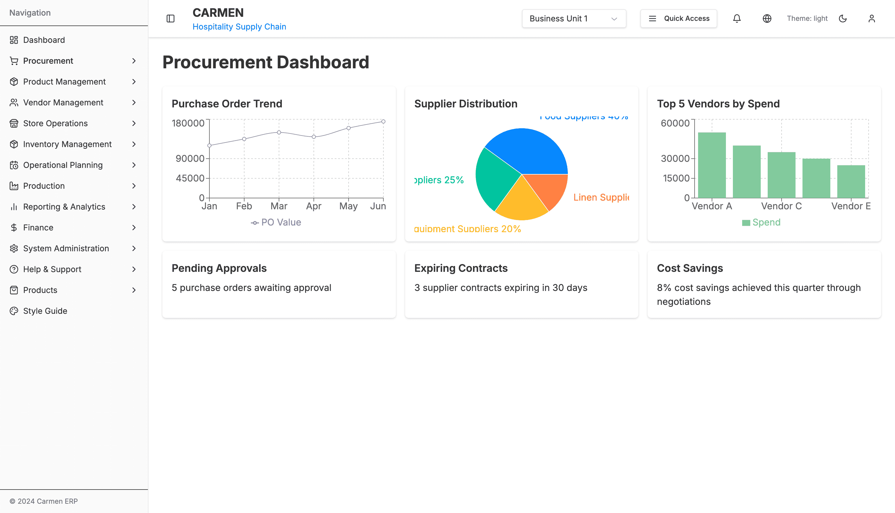
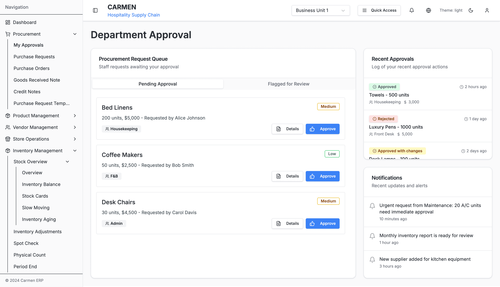
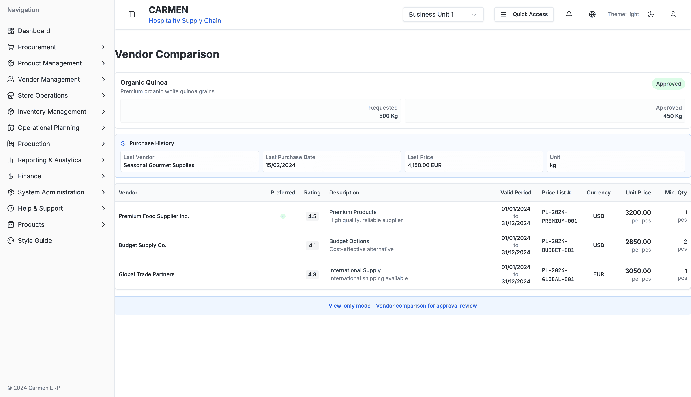

# Purchase Request System Documentation

This directory contains comprehensive documentation for the Carmen ERP Purchase Request system, analyzing the complete system architecture, component relationships, user flows, and technical implementation.

## 📚 Documentation Structure

### 1. **[System Analysis](./purchase-request-system-analysis.md)**
Complete technical analysis of the Purchase Request system including:
- **System Overview**: High-level architecture and component relationships
- **Component Architecture**: Detailed component hierarchy and file structure
- **User Journey Flows**: Role-based user workflows and interactions
- **Modal and Dialog System**: Popup components and overlay management
- **Data Flow and State Management**: State handling and data persistence
- **Workflow Engine**: Approval processes and business logic
- **RBAC and Permissions**: Role-based access control implementation
- **API Integration**: Service layer and data communication

### 2. **[Component Map](./purchase-request-component-map.md)**
Detailed technical mapping of all system components:
- **File Structure Map**: Complete directory structure and file organization
- **Component Hierarchy**: Parent-child relationships and dependencies
- **Modal System Architecture**: Popup and overlay component system
- **Form System Architecture**: Form handling and validation patterns
- **State Management Flow**: Data flow and state update patterns
- **Navigation Flow**: Routing and page transition logic
- **API Integration Map**: Service layer architecture and endpoint mapping

### 3. **[User Flows](./purchase-request-user-flows.md)**
Comprehensive user interaction documentation:
- **User Role Definitions**: Role-based responsibilities and permissions
- **Main User Journey**: End-to-end user experience mapping
- **Create Purchase Request Flow**: Step-by-step creation process
- **Detail View Flow**: PR viewing and editing interactions
- **Approval Workflow**: Decision trees and approval processes
- **Bulk Operations**: Multi-item operations and batch processing
- **Modal Interactions**: Popup component user flows
- **Error Handling**: Error recovery and validation flows
- **Search and Filter**: Data discovery and filtering capabilities
- **Mobile Responsive**: Mobile-first interaction patterns

### 4. **[Module Specification](./purchase-request-module-spec.md)**
Detailed module requirements and specifications:
- **Functional Requirements**: Complete feature specifications with acceptance criteria
- **Technical Requirements**: Performance, security, and integration requirements
- **API Specifications**: RESTful endpoints and data contracts
- **User Interface Requirements**: Responsive design and accessibility standards
- **Testing Requirements**: Unit, integration, and E2E testing strategies
- **Deployment Requirements**: Environment configuration and monitoring
- **Maintenance and Support**: Documentation and support procedures

### 5. **[Implementation Specification](./purchase-request-implementation-spec.md)**
Technical implementation guidance for developers:
- **Architecture Implementation**: Technology stack and file structure
- **Component Patterns**: React component implementation standards
- **State Management**: React Query and Zustand integration patterns
- **Service Layer**: API service and business logic implementation
- **Validation Implementation**: Zod schema definitions and validation rules
- **Testing Implementation**: Component, hook, and E2E testing patterns
- **Performance Implementation**: Code splitting, memoization, and optimization

## 📸 System Screenshots

### **Procurement Dashboard**

*The main procurement dashboard provides a comprehensive overview with 6 key metrics and 3 analytical charts. Features include Purchase Order Trend (line chart showing Jan-Jun data), Supplier Distribution (pie chart showing Food Suppliers 40.7%, Beverage Suppliers 25%, Equipment Suppliers 20%, Linen Suppliers 14.3%), and Top 5 Vendors by Spend (bar chart). The dashboard displays 5 pending approvals, 3 expiring contracts, and highlights an 8% cost savings achievement for the current quarter.*

### **My Approvals Interface**

*The Department Approval interface shows 3 pending purchase requests (Bed Linens, Coffee Makers, Desk Chairs) awaiting action. The Recent Approvals log displays historical decisions including approved items (Towels, Desk Lamps with changes) and rejected items (Luxury Pens). A dedicated notifications section keeps approvers informed of new requests and workflow updates requiring attention.*

### **Vendor Comparison Screen**

*The vendor comparison interface for "Organic Quinoa" purchase request displays item details (Premium organic white quinoa grains, Approved status, 500 Kg requested, 450 Kg approved) alongside purchase history showing the last vendor (Seasonal Gourmet Supplies, purchased 15/02/2024 at 4,150.00 EUR). Three vendors are compared with detailed metrics: Premium Food Supplier Inc. (Rating 4.5, USD 3200.00, Min 1 pcs), Budget Supply Co. (Rating 4.1, USD 2850.00, Min 2 pcs), and Global Trade Partners (Rating 4.3, EUR 3050.00, Min 1 pcs). The interface operates in view-only mode for approval review workflows.*

## 🎯 Key System Features

### **Core Functionality**
- ✅ Purchase Request Creation with Templates
- ✅ Multi-stage Approval Workflows
- ✅ Role-based Access Control (RBAC)
- ✅ Vendor Comparison and Selection
- ✅ Price History and Analytics
- ✅ Bulk Operations Support
- ✅ Mobile-responsive Design
- ✅ Real-time Notifications
- ✅ Advanced Search and Filtering
- ✅ Document Attachment Management

### **Technical Architecture**
- 🏗️ **Next.js 14** with App Router
- ⚛️ **React 18** with TypeScript
- 🎨 **Tailwind CSS** + **shadcn/ui**
- 📋 **React Hook Form** + **Zod Validation**
- 🔄 **React Query** for State Management
- 📊 **Mock Data** for Prototype Mode
- 🔐 **Role-based Permissions**
- 📱 **Responsive Design**

## 🚀 Quick Navigation

### **For Developers**
- [Implementation Guide →](./purchase-request-implementation-spec.md#architecture-implementation)
- [Component Patterns →](./purchase-request-implementation-spec.md#component-implementation-patterns)
- [API Integration →](./purchase-request-component-map.md#api-integration-map)
- [Testing Patterns →](./purchase-request-implementation-spec.md#testing-implementation)
- [Performance Guide →](./purchase-request-implementation-spec.md#performance-implementation)

### **For Designers**
- [User Journey Map →](./purchase-request-user-flows.md#main-user-journey-map)
- [UI Requirements →](./purchase-request-module-spec.md#user-interface-requirements)
- [Modal System →](./purchase-request-system-analysis.md#modal-and-dialog-system)
- [Mobile Flows →](./purchase-request-user-flows.md#mobile-responsive-flows)
- [Accessibility →](./purchase-request-module-spec.md#accessibility-requirements)

### **For Business Analysts**
- [Functional Requirements →](./purchase-request-module-spec.md#functional-requirements)
- [Workflow Engine →](./purchase-request-system-analysis.md#workflow-engine)
- [Approval Process →](./purchase-request-user-flows.md#approval-workflow-decision-tree)
- [User Roles →](./purchase-request-user-flows.md#user-role-definitions)
- [Business Rules →](./purchase-request-system-analysis.md#workflow-rules-engine)

### **For Project Managers**
- [Module Overview →](./purchase-request-module-spec.md#module-overview)
- [Technical Requirements →](./purchase-request-module-spec.md#technical-requirements)
- [Testing Strategy →](./purchase-request-module-spec.md#testing-requirements)
- [Deployment Plan →](./purchase-request-module-spec.md#deployment-requirements)
- [Feature List →](./README.md#key-system-features)

### **Visual References**
- [System Screenshots →](./purchase-request-module-spec.md#system-screenshots)
- [Implementation Examples →](./purchase-request-implementation-spec.md#visual-system-reference)
- [Dashboard Context →](../assets/screenshots/dashboard-overview.png)
- [List View Interface →](../assets/screenshots/purchase-requests-list-view.png)
- [Detail View Interface →](../assets/screenshots/purchase-request-detail-working.png)
- [Budget Management →](../assets/screenshots/purchase-request-budgets-tab.png)

## 📖 How to Use This Documentation

### **Reading Order for New Team Members**
1. Start with [System Analysis](./purchase-request-system-analysis.md) for overall understanding
2. Review [User Flows](./purchase-request-user-flows.md) to understand user experience
3. Deep dive into [Component Map](./purchase-request-component-map.md) for technical implementation

### **Reference Usage**
- **Component Development**: Use Component Map for file locations and relationships
- **User Experience Design**: Reference User Flows for interaction patterns
- **System Integration**: Check API Integration maps and data flow diagrams
- **Troubleshooting**: Use Error Handling flows and state management diagrams

## 🔄 Mermaid Diagram Types Used

This documentation uses various Mermaid diagram types to visualize different aspects:

- **📊 Flowcharts**: Process flows and decision trees
- **🏗️ Graph Diagrams**: Component relationships and architecture
- **📈 Journey Maps**: User experience flows
- **🔄 Sequence Diagrams**: API interactions and component communication
- **📋 State Diagrams**: Workflow states and transitions
- **🎯 Pie Charts**: Data distribution and analytics

## 🛠️ File Locations Reference

### **Main Pages**
```
app/(main)/procurement/purchase-requests/
├── page.tsx                     # Main list page
├── [id]/page.tsx               # Detail view page
├── new-pr/page.tsx             # Create new PR page
└── enhanced-demo/page.tsx      # Enhanced demo features
```

### **Core Components**
```
components/
├── ModernPurchaseRequestList.tsx    # Main list component
├── PRDetailPage.tsx                 # Detail view component
├── PRForm.tsx                       # Creation/edit form
├── VendorComparisonModal.tsx        # Vendor selection modal
├── PriceHistoryModal.tsx            # Price analytics modal
└── tabs/                            # Tab system components
    ├── ItemsTab.tsx
    ├── BudgetsTab.tsx
    ├── WorkflowTab.tsx
    ├── AttachmentsTab.tsx
    └── ActivityTab.tsx
```

### **Services and Logic**
```
services/
├── rbac-service.ts                  # Role-based access control
└── workflow-decision-engine.ts      # Workflow business logic
```

## 📞 Support and Maintenance

### **Documentation Updates**
This documentation should be updated when:
- New components are added to the system
- User workflows change or new roles are introduced
- API endpoints are modified or added
- Business rules or approval processes change

### **Diagram Maintenance**
- Mermaid diagrams are version-controlled and should be updated alongside code changes
- Use [Mermaid Live Editor](https://mermaid.live/) for testing diagram syntax
- Follow existing diagram conventions for consistency

---

**Last Updated**: Generated automatically from system analysis
**Version**: Carmen ERP v1.0
**Maintained by**: Carmen Development Team