# Purchase Request Component Map

This document provides detailed component mapping for the Purchase Request system, including file locations, component relationships, and interaction patterns.

## File Structure Map

```mermaid
graph TD
    subgraph "File System Architecture"
        A["app/(main)/procurement/purchase-requests/"] --> B["📄 page.tsx<br/>(Main List Page)"]
        A --> C["📁 [id]/"]
        A --> D["📁 new-pr/"]
        A --> E["📁 enhanced-demo/"]
        A --> F["📁 components/"]
        A --> G["📁 services/"]

        C --> H["📄 page.tsx<br/>(Detail Page)"]
        D --> I["📄 page.tsx<br/>(Create Page)"]
        E --> J["📄 page.tsx<br/>(Demo Page)"]

        F --> K["📄 ModernPurchaseRequestList.tsx"]
        F --> L["📄 PRDetailPage.tsx"]
        F --> M["📄 PRForm.tsx"]
        F --> N["📄 purchase-requests-data-table.tsx"]
        F --> O["📄 purchase-requests-card-view.tsx"]
        F --> P["📄 VendorComparisonModal.tsx"]
        F --> Q["📄 PriceHistoryModal.tsx"]
        F --> R["📁 tabs/"]

        R --> S["📄 ItemsTab.tsx"]
        R --> T["📄 BudgetsTab.tsx"]
        R --> U["📄 WorkflowTab.tsx"]
        R --> V["📄 AttachmentsTab.tsx"]
        R --> W["📄 ActivityTab.tsx"]
        R --> X["📄 PRCommentsAttachmentsTab.tsx"]

        G --> Y["📄 rbac-service.ts"]
        G --> Z["📄 workflow-decision-engine.ts"]
    end
```

## Component Hierarchy Detailed Map

```mermaid
graph TD
    subgraph "Main List Page Flow"
        A1["page.tsx<br/>/procurement/purchase-requests"] --> B1["ModernPurchaseRequestList"]

        B1 --> C1["🎯 View Toggle<br/>(Table/Card)"]
        B1 --> C2["🔧 Filter Controls"]
        B1 --> C3["➕ Create Button"]
        B1 --> C4["📊 Data Display"]

        C1 --> D1["PurchaseRequestsDataTable"]
        C1 --> D2["PurchaseRequestsCardView"]

        C4 --> D1
        C4 --> D2

        D1 --> E1["📋 Row Actions"]
        D1 --> E2["☑️ Bulk Selection"]
        D1 --> E3["🔄 Sorting"]
        D1 --> E4["📄 Pagination"]

        D2 --> F1["🃏 PR Cards"]
        D2 --> F2["📱 Responsive Grid"]

        E1 --> G1["👁️ View"]
        E1 --> G2["✏️ Edit"]
        E1 --> G3["🗑️ Delete"]
    end

    subgraph "Detail Page Flow"
        H1["page.tsx<br/>/procurement/purchase-requests/[id]"] --> I1["PRDetailPage"]

        I1 --> J1["📋 PRHeader"]
        I1 --> J2["📊 CompactWorkflowIndicator"]
        I1 --> J3["📑 Tab System"]
        I1 --> J4["💰 SummaryTotal"]
        I1 --> J5["🎯 FloatingActionMenu"]
        I1 --> J6["📱 Sidebar"]

        J3 --> K1["ItemsTab"]
        J3 --> K2["BudgetsTab"]
        J3 --> K3["WorkflowTab"]

        J6 --> L1["PRCommentsAttachmentsTab"]
        J6 --> L2["ActivityTab"]

        K1 --> M1["📦 Item Management"]
        K1 --> M2["🏪 Vendor Selection"]
        K1 --> M3["💲 Price History"]
        K1 --> M4["📊 Bulk Operations"]
    end

    subgraph "Modal System"
        N1["VendorComparisonModal"] --> O1["🏪 Vendor Grid"]
        N1 --> O2["💰 Price Comparison"]
        N1 --> O3["⭐ Rating System"]

        N2["PriceHistoryModal"] --> P1["📈 Price Chart"]
        N2 --> P2["📊 Historical Data"]
        N2 --> P3["📝 Vendor Notes"]

        N3["ReturnStepSelector"] --> Q1["🔄 Workflow Stages"]
        N3 --> Q2["💬 Comment Input"]
        N3 --> Q3["✅ Confirmation"]
    end
```

## Component Interaction Flow

## Data Flow Architecture

```mermaid
graph LR
    subgraph "Data Layer Structure"
        A["📁 lib/types/"] --> B["🔧 procurement.ts"]
        A --> C["🔧 user.ts"]
        A --> D["🔧 workflow.ts"]

        E["📁 lib/mock-data/"] --> F["📋 purchase-requests.ts"]
        E --> G["👥 users.ts"]
        E --> H["🏪 vendors.ts"]

        I["📁 lib/api/"] --> J["🌐 procurement.ts"]
        I --> K["🔐 auth.ts"]

        L["📁 lib/hooks/"] --> M["📡 use-procurement.ts"]
        L --> N["👤 use-user.ts"]

        B --> O["Component Props"]
        F --> O
        J --> P["React Query"]
        P --> O
    end
```

## Modal System Architecture

```mermaid
graph TD
    subgraph "Modal Management System"
        A["Component Trigger"] --> B["Modal State Hook"]
        B --> C["Modal Provider"]
        C --> D["Modal Component"]

        D --> E{Modal Type}
        E -->|"Vendor"| F["VendorComparisonModal"]
        E -->|"Price"| G["PriceHistoryModal"]
        E -->|"Return"| H["ReturnStepSelector"]
        E -->|"Item"| I["ItemDetailsModal"]
        E -->|"Bulk"| J["BulkOperationModal"]

        F --> K["📊 Vendor Data Grid"]
        F --> L["💰 Price Comparison"]
        F --> M["⭐ Rating Display"]
        F --> N["✅ Selection Actions"]

        G --> O["📈 Price Trend Chart"]
        G --> P["📋 Historical Records"]
        G --> Q["📊 Analytics View"]

        H --> R["🔄 Stage Selection"]
        H --> S["💬 Comment Field"]
        H --> T["📤 Submit Action"]

        I --> U["📦 Inventory Status"]
        I --> V["📍 Location Info"]
        I --> W["🔗 Related Items"]

        J --> X["☑️ Item Selection"]
        J --> Y["🎯 Bulk Actions"]
        J --> Z["✅ Confirmation"]
    end
```

## Form System Architecture

```mermaid
graph TD
    subgraph "Form Management"
        A["PRForm Component"] --> B["React Hook Form"]
        B --> C["Zod Validation"]
        C --> D["Form Fields"]

        D --> E["📝 Basic Info Fields"]
        D --> F["📦 Items Array"]
        D --> G["💰 Budget Fields"]
        D --> H["📋 Workflow Fields"]

        E --> I["🏷️ Reference Number"]
        E --> J["📅 Date Picker"]
        E --> K["👤 Requestor Info"]
        E --> L["🏢 Department"]

        F --> M["🔄 Dynamic Item List"]
        M --> N["➕ Add Item Button"]
        M --> O["❌ Remove Item"]
        M --> P["✏️ Edit Item"]

        G --> Q["💳 Budget Code"]
        G --> R["💰 Amount Limits"]
        G --> S["📊 Allocation"]

        H --> T["📋 Approval Route"]
        H --> U["⏰ Priority Level"]
        H --> V["📝 Comments"]
    end
```

## State Management Flow

## Navigation Flow

```mermaid
graph TD
    subgraph "Navigation Architecture"
        A["Navigation Trigger"] --> B{Route Type}

        B -->|"List View"| C["/procurement/purchase-requests"]
        B -->|"Detail View"| D["/procurement/purchase-requests/[id]"]
        B -->|"Create"| E["/procurement/purchase-requests/new-pr"]
        B -->|"Edit"| F["/procurement/purchase-requests/[id]?mode=edit"]

        C --> G["ModernPurchaseRequestList"]
        G --> H["📊 Data Table"]
        G --> I["🃏 Card View"]
        G --> J["🔍 Filters"]

        D --> K["PRDetailPage"]
        K --> L["📋 Header Info"]
        K --> M["📑 Tab System"]
        K --> N["💰 Summary"]

        E --> O["PRForm"]
        O --> P["📝 Form Fields"]
        O --> Q["📦 Item Management"]
        O --> R["💾 Save Actions"]

        F --> S["PRDetailPage (Edit Mode)"]
        S --> T["✏️ Editable Fields"]
        S --> U["💾 Save Changes"]
        S --> V["❌ Cancel Edit"]
    end
```

## API Integration Map

## Error Handling Flow

## Component Lifecycle Management

---

This component map provides a comprehensive technical reference for understanding the Purchase Request system architecture, including detailed file locations, component relationships, data flow patterns, and interaction mechanisms.