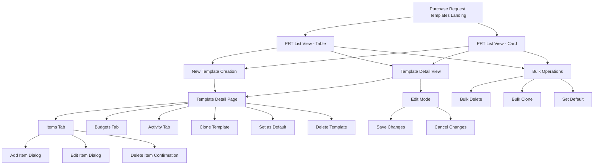
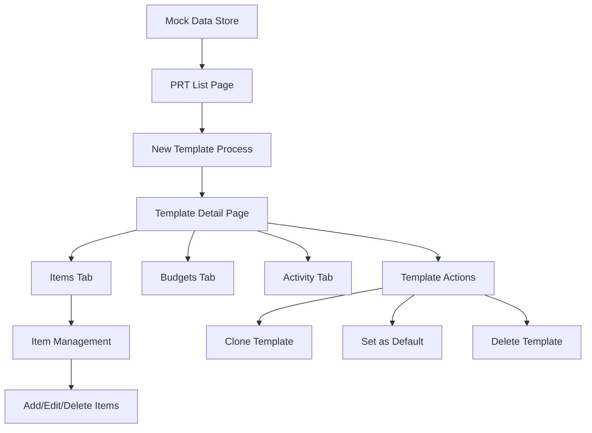
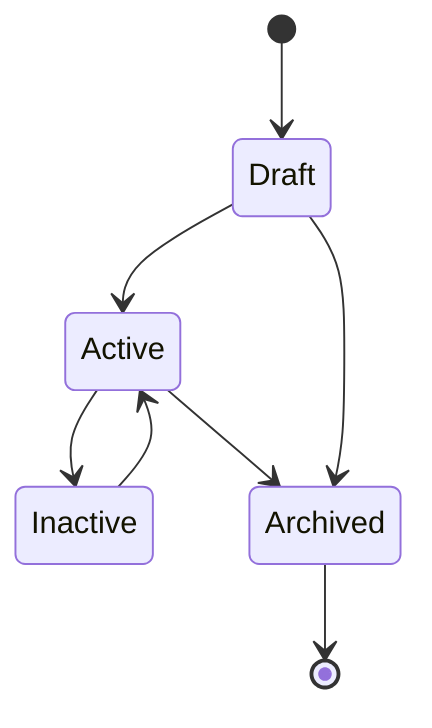

# Purchase Request Template Module Documentation

Welcome to the comprehensive documentation for the Carmen ERP Purchase Request Template module. This documentation provides complete technical specifications, user guides, and implementation details.

## 📚 Documentation Structure

### 1. [Complete Technical Specification](./purchase-request-template-complete-specification.md)
**Comprehensive overview of the entire PRT module**
- Module overview and key features
- Complete site map with Mermaid diagrams
- Page and component documentation
- Data flow and user interactions
- Technical architecture details
- API endpoints and database schema

### 2. [Detailed Component Documentation](./components-detailed-documentation.md)
**In-depth analysis of all components and their interactions**
- Page components (List, Detail, Create)
- Form components and validation
- Dialog components and workflows
- Tab components and functionality
- Utility and data components
- Component interaction patterns

### 3. [User Interaction Guide](./user-interaction-guide.md)
**Complete guide for user workflows and interactions**
- Navigation and entry points
- Primary user workflows
- Dialog and form interactions
- Data management features
- Advanced functionality

### 4. [API Specification](./api-specification.md)
**Technical API documentation for developers**
- Authentication and authorization
- Core endpoints and operations
- Data models and schemas
- Error handling and responses
- Rate limiting and webhooks

## 🖼️ Screenshots & Visual Documentation

All screenshots are stored in the [`screenshots/`](./screenshots/) directory:

- **prt-list-page-table-view.png** - Main PRT listing interface (Table View)
- **prt-list-page-card-view.png** - Main PRT listing interface (Card View)
- **prt-detail-page-items-tab.png** - PRT detail page showing Items tab
- **prt-detail-page-edit-mode.png** - PRT detail page in edit mode
- **prt-add-item-dialog.png** - Add/Edit item dialog interface

## 🗺️ Module Site Map



## 🚀 Key Features

### Template Management
- Complete template lifecycle management (Draft → Active → Archived)
- Multi-type support (General Purchase, Asset Purchase, Service, Recurring)
- Clone functionality for creating template variations
- Department-specific default templates

### User Interface
- Responsive design with table and card views
- Advanced filtering and search capabilities
- Multi-mode interface (view/edit/add)
- Export and print functionality
- Real-time status updates

### Item Management
- Comprehensive item configuration with pricing
- Unit of measure (UOM) support
- Budget and account code integration
- Real-time calculations for totals and taxes
- Multi-currency support with exchange rates

### Technical Architecture
- Next.js 14 with App Router
- TypeScript with strict mode
- Tailwind CSS + Shadcn/ui components
- React Hook Form + Zod validation
- Reusable component architecture

## 📁 File Structure

```
docs/documents/prt/
├── README.md                                           # This file
├── purchase-request-template-complete-specification.md # Complete technical spec
├── components-detailed-documentation.md               # Component documentation
├── user-interaction-guide.md                         # User workflows
├── api-specification.md                              # API documentation
└── screenshots/                                      # Visual documentation
    ├── prt-list-page-table-view.png
    ├── prt-list-page-card-view.png
    ├── prt-detail-page-items-tab.png
    ├── prt-detail-page-edit-mode.png
    └── prt-add-item-dialog.png
```

## 🔗 Source Code Structure

```
app/(main)/procurement/purchase-request-templates/
├── page.tsx                                          # Main listing page
├── [id]/page.tsx                                    # Detail page route
├── components/                                      # Component library
│   ├── ItemsTab.tsx                                # Items management tab
│   ├── template-items-table.tsx                    # Items table component
│   └── item-form-dialog.tsx                        # Item add/edit dialog
└── types/
    └── template-items.ts                           # Type definitions and mock data
```

## 🎯 Primary User Workflows

### 1. Create New Template
1. Navigate to PRT List → Click "New Template"
2. Fill template header information (name, type, department)
3. Add template items via Items tab with pricing and specifications
4. Configure budget and account codes
5. Save template for future use

### 2. Use Template for Purchase Request
1. Navigate to Purchase Requests → "Create from Template"
2. Select desired template from list
3. Customize items and quantities as needed
4. Submit for approval following standard workflow

### 3. Template Management
1. Browse templates in table/card format
2. Filter and search for specific templates
3. Edit existing templates as requirements change
4. Clone templates for creating variations
5. Set department defaults for streamlined workflows

## 🛠️ Technical Implementation

### Component Architecture
- **PRListTemplate**: Shared list component with dual-view support
- **PRDetailTemplate**: Shared detail component with multi-mode operation
- **ItemsTab**: Comprehensive item management interface
- **ItemFormDialog**: Rich form dialog with validation and calculations

### State Management
- React useState for local state management
- URL parameters for routing context
- Mock data integration with future API readiness
- Real-time calculations and validation

### Data Flow


## 📊 Database Schema Overview

### Main Tables
- **purchase_request_templates** - Core template information
- **template_items** - Template line items with specifications
- **template_usage_log** - Template usage tracking
- **template_versions** - Version history management

### Key Relationships
- Template → Items (One-to-Many)
- Template → Usage Log (One-to-Many)
- Template → Versions (One-to-Many)
- Department → Default Templates (One-to-Many)

## 🔄 Template Lifecycle



## 📧 Support & Contributions

For questions, issues, or contributions to this documentation:

1. **Technical Issues**: Review the component documentation and API specification
2. **User Workflow Questions**: Consult the user interaction guide
3. **Feature Requests**: Reference the complete technical specification
4. **Bug Reports**: Include relevant screenshots and component details

---

*Documentation generated on: 2025-09-23*
*Module Version: 1.0*
*Carmen ERP - Hospitality Supply Chain Management*