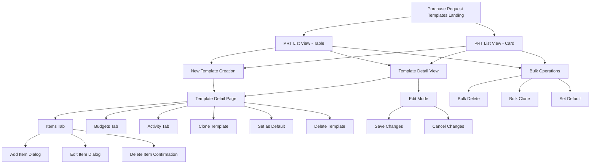
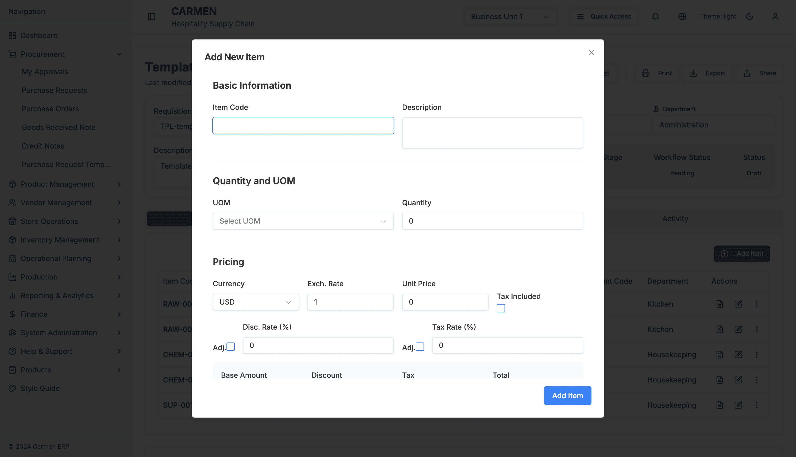
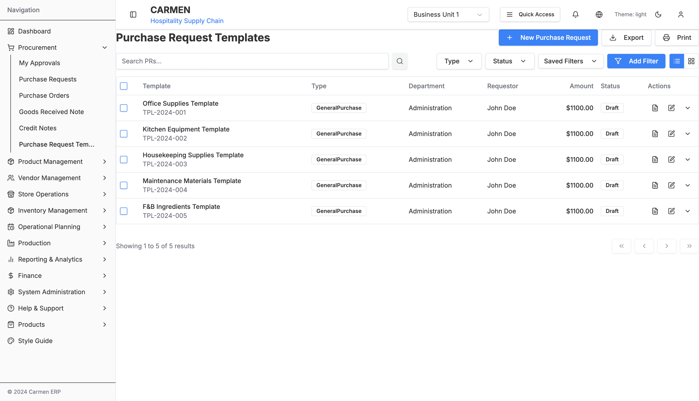
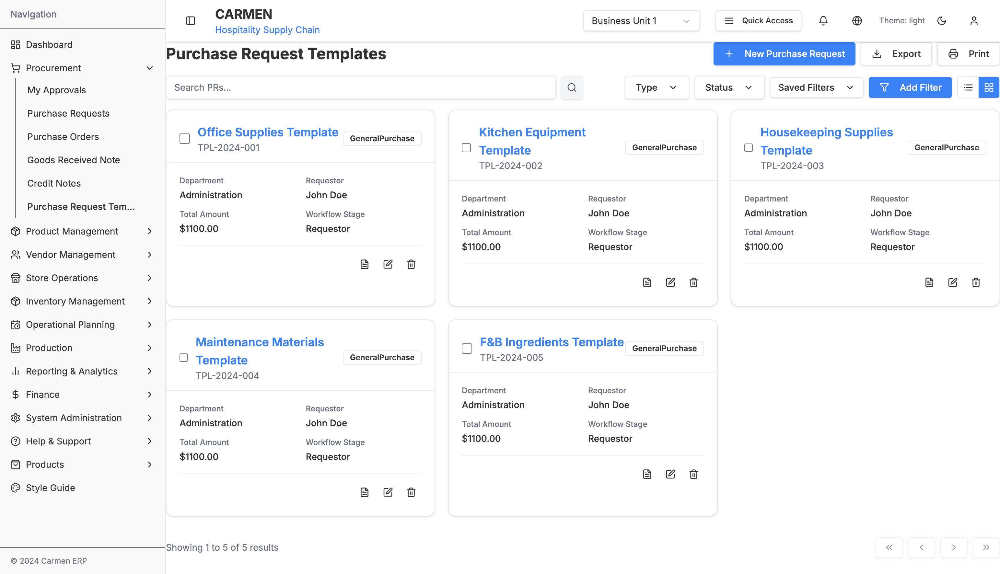
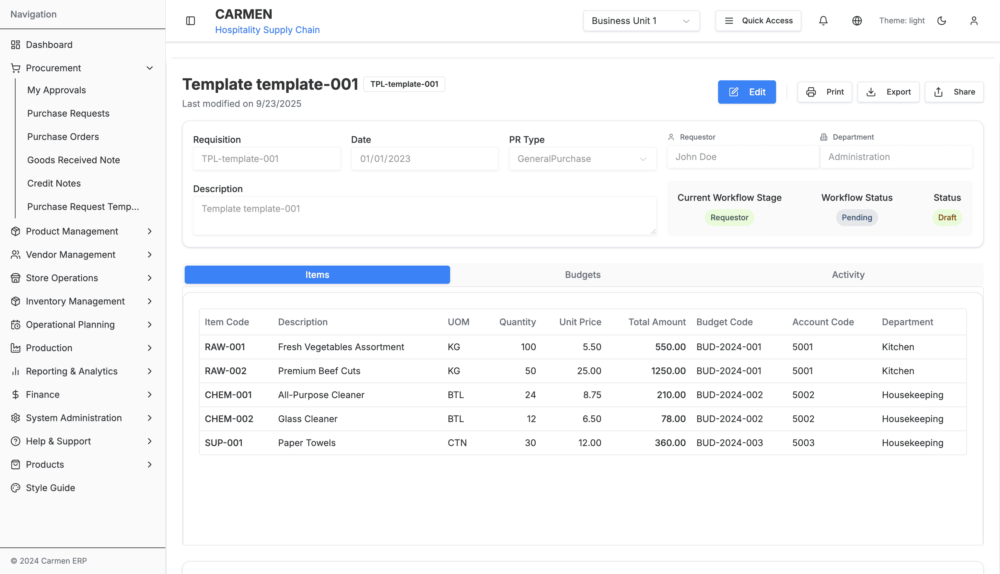
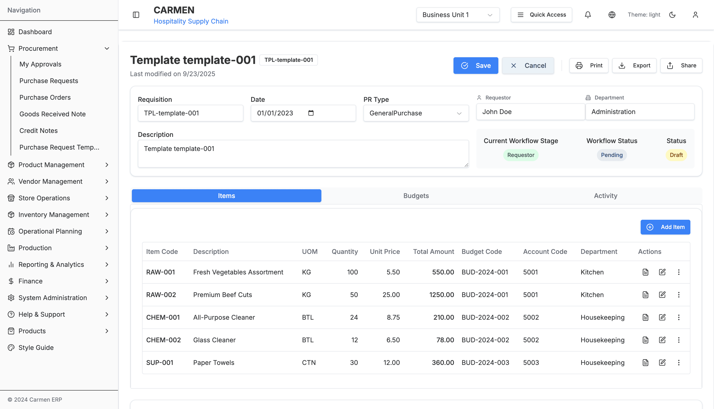

# Purchase Request Template - Complete Technical Specification

## Table of Contents
1. [Module Overview](#module-overview)
2. [System Architecture](#system-architecture)
3. [Site Map & Navigation](#site-map--navigation)
4. [Component Documentation](#component-documentation)
5. [Page Specifications](#page-specifications)
6. [Data Models & Types](#data-models--types)
7. [Business Logic](#business-logic)
8. [Integration Points](#integration-points)
9. [User Workflows](#user-workflows)

## Module Overview

### Purpose
The Purchase Request Template (PRT) module provides a streamlined way to create, manage, and utilize reusable templates for purchase requests. This module enhances operational efficiency by allowing users to pre-configure standard purchase requests with predefined items, quantities, pricing, and approval workflows.

### Key Features
- **Template Management**: Create, edit, clone, and delete purchase request templates
- **Item Management**: Add, modify, and organize template items with detailed specifications
- **Multi-view Interface**: Switch between table and card views for optimal workflow
- **Advanced Filtering**: Search and filter templates by various criteria
- **Bulk Operations**: Clone, delete, and set default templates in batch
- **Pricing Calculations**: Automatic calculation of taxes, discounts, and totals
- **Department-specific Templates**: Organize templates by department and budget codes
- **Workflow Integration**: Templates inherit approval workflows and department settings

### Technology Stack
- **Framework**: Next.js 14 with App Router
- **Language**: TypeScript with strict mode
- **Styling**: Tailwind CSS + Shadcn/ui components
- **State Management**: React useState for local state
- **Form Handling**: React Hook Form + Zod validation
- **Data Structure**: Mock data with future API readiness

## System Architecture

### Route Structure
```
/procurement/purchase-request-templates/
├── page.tsx                    # Main template list page
├── [id]/page.tsx              # Template detail/edit page
├── components/
│   ├── ItemsTab.tsx           # Items management tab
│   ├── template-items-table.tsx   # Items table component
│   └── item-form-dialog.tsx   # Item add/edit dialog
└── types/
    └── template-items.ts      # Type definitions and mock data
```

### Component Hierarchy
```
PurchaseRequestTemplatesPage
├── PRListTemplate (shared component)
│   ├── Search & Filter Controls
│   ├── Action Buttons
│   ├── View Toggle (Table/Card)
│   ├── Table View
│   │   └── TemplateItemsTable
│   └── Card View
│       └── Template Cards
└── AlertDialog (Delete Confirmation)

PurchaseRequestTemplateDetailPage
├── PRDetailTemplate (shared component)
│   ├── Header with Actions
│   ├── Form Fields
│   └── Tab Container
│       ├── ItemsTab
│       │   ├── TemplateItemsTable
│       │   └── ItemFormDialog
│       ├── BudgetsTab (placeholder)
│       └── ActivityTab (placeholder)
```

## Site Map & Navigation



## Component Documentation

### Main Pages

#### 1. PurchaseRequestTemplatesPage (`page.tsx`)
**Purpose**: Main landing page for template management
**Features**:
- Dual view modes (table/card)
- Search and filtering
- Bulk operations
- Template CRUD operations

**Key State Variables**:
```typescript
const [viewMode, setViewMode] = useState<'table' | 'card'>('table')
const [selectedItems, setSelectedItems] = useState<string[]>([])
const [templates, setTemplates] = useState<PurchaseRequest[]>(templateData)
const [deleteDialogOpen, setDeleteDialogOpen] = useState(false)
```

**Core Functions**:
- `handleView(id)`: Navigate to template detail view
- `handleEdit(id)`: Navigate to template edit mode
- `handleDelete(id)`: Trigger delete confirmation
- `handleCreateNew()`: Navigate to new template creation
- `handleSelectItem(id)`: Toggle item selection
- `handleSelectAll(checked)`: Select/deselect all items

#### 2. PurchaseRequestTemplateDetailPage (`[id]/page.tsx`)
**Purpose**: Template detail view and editing interface
**Features**:
- Multi-mode operation (view/edit/add)
- Tab-based interface
- Template cloning and default setting
- Breadcrumb navigation

**URL Patterns**:
- View: `/purchase-request-templates/{id}?mode=view`
- Edit: `/purchase-request-templates/{id}?mode=edit`
- New: `/purchase-request-templates/new?mode=add`

**Tab Structure**:
```typescript
const tabs = [
  { value: "items", label: "Items", content: <ItemsTab /> },
  { value: "budgets", label: "Budgets", content: <BudgetsTab /> },
  { value: "activity", label: "Activity", content: <ActivityTab /> }
]
```

### Component Library

#### 3. ItemsTab (`components/ItemsTab.tsx`)
**Purpose**: Manages template items within the detail page
**Features**:
- Item CRUD operations
- Mode-aware display (view/edit)
- Delete confirmations
- Integration with item table and dialog

**State Management**:
```typescript
const [items, setItems] = useState<TemplateItem[]>(initialItems)
const [formOpen, setFormOpen] = useState(false)
const [selectedItem, setSelectedItem] = useState<TemplateItem | null>(null)
```

#### 4. TemplateItemsTable (`components/template-items-table.tsx`)
**Purpose**: Displays template items in tabular format
**Features**:
- Responsive table layout
- Action buttons per row
- Mode-aware display
- Sorting and data presentation

**Column Structure**:
- Item Code
- Description
- UOM (Unit of Measure)
- Quantity
- Unit Price
- Total Amount
- Budget Code
- Account Code
- Department
- Actions (Edit/Delete)

#### 5. ItemFormDialog (`components/item-form-dialog.tsx`)
**Purpose**: Add/edit individual template items



**Features**:
- Comprehensive form validation
- Real-time calculations
- Multi-section layout
- Currency and tax handling

**Form Sections**:
1. **Basic Information**: Item code, description
2. **Quantity and UOM**: Measurements and units
3. **Pricing**: Currency, rates, calculations
4. **Additional Information**: Budget codes, departments

**Validation Schema**:
```typescript
const formSchema = z.object({
  itemCode: z.string().min(1, "Item code is required"),
  description: z.string().min(1, "Description is required"),
  uom: z.string().min(1, "UOM is required"),
  quantity: z.number().min(0, "Quantity must be positive"),
  unitPrice: z.number().min(0, "Unit price must be positive"),
  // ... additional fields
})
```

## Page Specifications

### Template List Page





#### Layout Structure
```
Header Section
├── Page Title: "Purchase Request Templates"
├── Action Buttons: [New Template] [Export] [Print]
└── View Toggle: [Table] [Card]

Filter Section
├── Search Bar: "Search templates..."
├── Type Filter: Dropdown
├── Status Filter: Dropdown
└── Advanced Filter: Modal

Content Section
├── Selection Controls: [Select All] [Bulk Actions]
├── Table View
│   ├── Headers: Checkbox, Template, Type, Department, Requestor, Amount, Status, Actions
│   └── Rows: Template data with action buttons
└── Card View
    ├── Template Cards (3-column grid)
    └── Card Actions: View, Edit, Delete

Pagination Section
├── Page Info: "Showing X of Y"
├── Navigation: [First] [Previous] [Next] [Last]
└── Items per page selector
```

#### Filter Options
- **Type Filter**: All Types, General Purchase, Asset Purchase
- **Status Filter**: All Statuses, Draft, In Progress, Completed
- **Advanced Filters**: Custom field-based filtering

#### Bulk Operations
- Delete Selected
- Clone Selected
- Set as Default

### Template Detail Page





#### Header Section
```
Navigation: [Back to Templates]
Title: Template Name + Badge (Template Number)
Metadata: Last modified date
Actions: [Set as Default] [Clone Template]
Mode Toggle: [View] [Edit]
```

#### Form Fields (Header)
- Template Name/Description
- Reference Number (auto-generated)
- Type (General Purchase/Asset Purchase)
- Department
- Requestor
- Date Created/Modified

#### Tab Interface

**Items Tab**:
- Template Items Table
- Add Item Button (edit mode)
- Item Actions: View, Edit, Delete

**Budgets Tab**: (Placeholder)
- Budget allocation display
- Budget code management

**Activity Tab**: (Placeholder)
- Template usage history
- Modification log

## Data Models & Types

### TemplateItem Interface
```typescript
export interface TemplateItem {
  id: string
  itemCode: string
  description: string
  uom: string // Unit of Measure
  quantity: number
  unitPrice: number
  totalAmount: number
  budgetCode: string
  accountCode: string
  department: string
  taxCode: string
  currency: CurrencyCode
}
```

### Extended Item Properties (Form)
```typescript
interface ItemFormData {
  // Basic fields from TemplateItem
  ...TemplateItem

  // Additional form fields
  currencyRate: number
  taxIncluded: boolean
  discountRate: number
  taxRate: number
  adjustments: {
    discount: boolean
    tax: boolean
  }
}
```

### Template Structure
Templates inherit from the base `PurchaseRequest` type:
```typescript
interface Template extends PurchaseRequest {
  // Inherited fields:
  // id, refNumber, description, type, status
  // requestor, department, date, totalAmount

  // Template-specific behavior:
  // - Used as basis for new purchase requests
  // - Can be set as default for departments
  // - Contains predefined items and approval workflows
}
```

## Business Logic

### Template Operations

#### Create Template
1. Navigate to new template page
2. Fill template header information
3. Add template items via Items tab
4. Configure budget and account codes
5. Save template (generates reference number)

#### Clone Template
1. Select existing template
2. Click "Clone Template" action
3. System creates copy with new ID
4. User can modify cloned template
5. Save with new reference number

#### Set as Default
1. Select template for department
2. Mark as default template
3. New purchase requests in department auto-populate from default template

### Item Calculations

#### Price Calculations
```typescript
const baseAmount = quantity * unitPrice
const discountAmount = baseAmount * (discountRate / 100)
const netAmount = baseAmount - discountAmount
const taxAmount = netAmount * (taxRate / 100)
const totalAmount = netAmount + taxAmount
```

#### Multi-Currency Support
- Templates support multiple currencies
- Exchange rates applied at item level
- Base currency conversion for reporting

### Validation Rules

#### Template Validation
- Template name required and unique
- Must have at least one item
- Department and requestor required
- Valid budget codes for all items

#### Item Validation
- Item code required and unique within template
- Positive quantities and prices
- Valid UOM from predefined list
- Budget code must exist in system

## Integration Points

### Shared Components
- **PRListTemplate**: Reusable list component for PR-related modules
- **PRDetailTemplate**: Reusable detail component for PR-related modules
- **StatusBadge**: Consistent status display across modules
- **AdvancedFilter**: Common filtering interface

### Navigation Integration
- Sidebar: Procurement → Purchase Request Templates
- Breadcrumb: Dashboard → Procurement → Purchase Request Templates
- Cross-module: Templates can generate Purchase Requests

### Data Integration
- **Mock Data**: Currently uses sample data
- **Types**: Shares type definitions with Purchase Request module
- **Validation**: Common validation patterns with other procurement modules

### Future API Integration
Templates are designed for future API integration:
- CRUD operations prepared for REST endpoints
- State management ready for server synchronization
- Error handling patterns established

## User Workflows

### Primary Workflows

#### 1. Create New Template
1. **Entry**: Click "New Template" from list page
2. **Template Setup**: Fill basic template information
3. **Add Items**: Use Items tab to configure template items
4. **Configure Items**: Set quantities, prices, budget codes
5. **Save Template**: Template becomes available for use

#### 2. Use Template for Purchase Request
1. **Template Selection**: Choose template from list
2. **Generate PR**: Convert template to purchase request
3. **Customize**: Modify quantities or items as needed
4. **Submit**: Submit purchase request for approval

#### 3. Template Management
1. **Browse Templates**: View available templates in table/card format
2. **Filter Templates**: Use search and filters to find specific templates
3. **Edit Templates**: Modify existing templates as needed
4. **Clone Templates**: Create variations of existing templates

#### 4. Department Template Setup
1. **Default Template**: Set department-specific default templates
2. **Budget Integration**: Link templates to budget codes
3. **Approval Workflow**: Configure approval paths for template-based PRs

### Advanced Features

#### Bulk Operations
- Select multiple templates
- Delete, clone, or modify in batch
- Set multiple templates as defaults for different departments

#### Template Analytics
- Track template usage frequency
- Monitor budget utilization
- Identify optimization opportunities

#### Template Sharing
- Share templates across departments
- Export/import template configurations
- Template version management

---

*Documentation generated on: 2025-09-23*
*Module Version: 1.0*
*Carmen ERP - Hospitality Supply Chain Management*