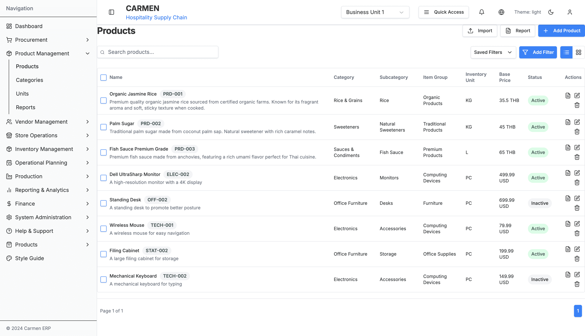
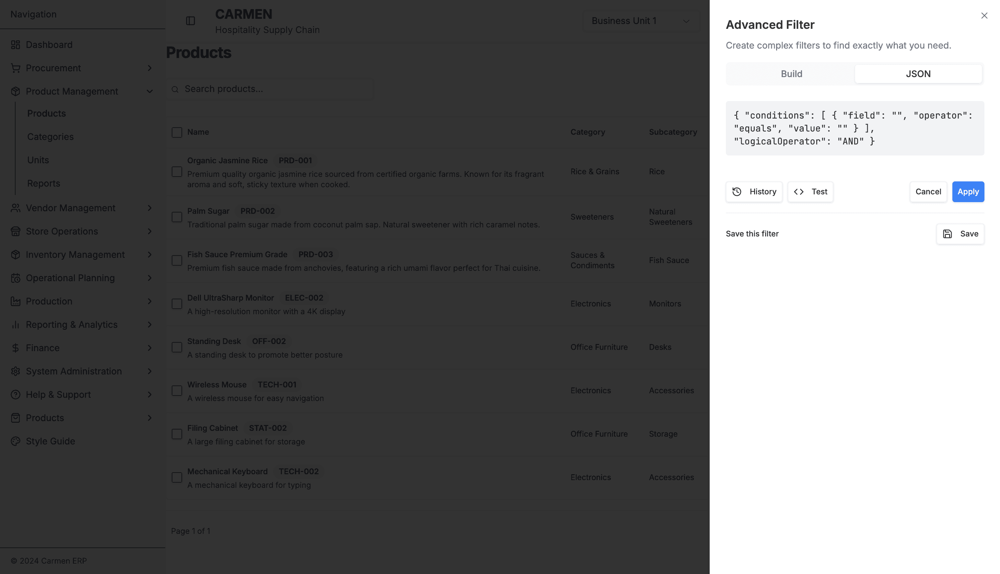
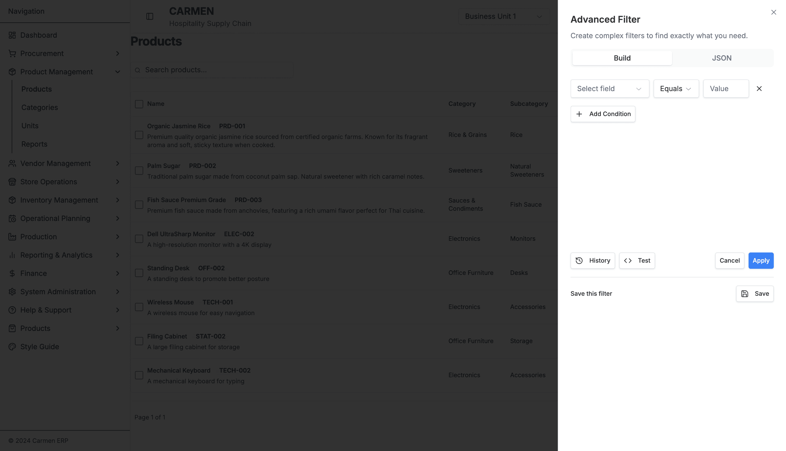
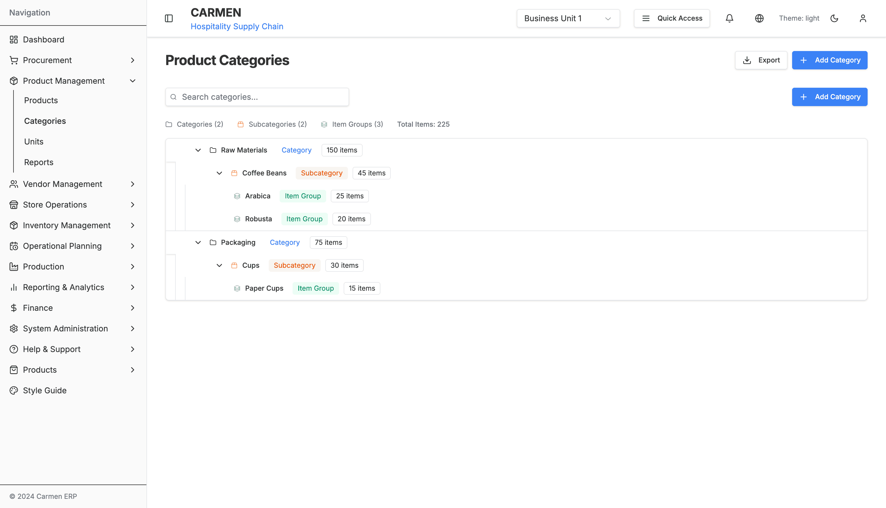
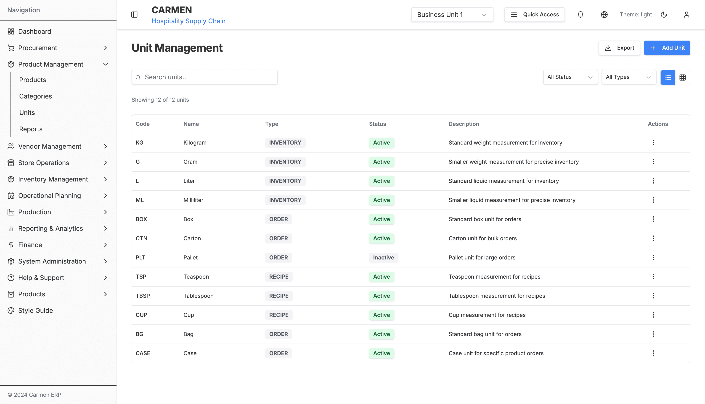

# Product Management Module - Comprehensive Specification

## Overview

The Product Management module serves as the central hub for managing products, categories, units, and supplier relationships within the Carmen ERP system. Built with Next.js 14, TypeScript, and modern React patterns, it provides comprehensive product lifecycle management with advanced filtering, hierarchical categorization, and flexible unit management.

## Module Structure

### File Organization
```
app/(main)/product-management/
├── page.tsx                           # Main dashboard (16 lines, placeholder)
├── products/
│   ├── page.tsx                       # Products wrapper
│   └── components/
│       ├── product-list.tsx           # Core product listing (960 lines)
│       └── advanced-filter.tsx        # Advanced filter system (539 lines)
├── categories/
│   ├── page.tsx                       # Categories wrapper
│   └── components/
│       └── category-list.tsx          # Hierarchical tree management (802 lines)
├── units/
│   ├── page.tsx                       # Units wrapper
│   └── components/
│       └── unit-list-improved.tsx     # Unit management interface
└── suppliers/                         # Future implementation
```

## 1. Product Dashboard (Main Page)

**File**: `app/(main)/product-management/page.tsx`
**Status**: Placeholder Implementation
**Lines of Code**: 16

### Current Implementation
- Basic page structure with "Product Dashboard" heading
- Placeholder for future dashboard widgets
- Imports prepared for React Beautiful DnD and Recharts

### Planned Features
- **6 Dashboard Widgets**:
  1. Product Overview Chart
  2. Category Distribution
  3. Inventory Levels Summary
  4. Price Analysis
  5. Recent Products Activity
  6. Product Status Alerts
- **Draggable Widget System**: React Beautiful DnD integration
- **Real-time Analytics**: Chart-based visualizations
- **Quick Navigation**: Direct links to main product functions

## 2. Products Module

### 2.1 Product List Component

**File**: `app/(main)/product-management/products/components/product-list.tsx`
**Status**: Fully Implemented
**Lines of Code**: 960
**Screenshot**: 

#### Data Structure
```typescript
interface Product {
  id: string;
  productCode: string;
  name: string;
  description: string;
  categoryName?: string;
  subCategoryName?: string;
  isActive: boolean;
  basePrice: number;
  costPrice?: number;
  margin?: number;
  supplierName?: string;
  unitName?: string;
  taxRate?: number;
  allergens?: string[];
  isVegetarian?: boolean;
  isVegan?: boolean;
  isGlutenFree?: boolean;
  shelfLife?: number;
  storageConditions?: string;
  minOrderQty?: number;
  maxOrderQty?: number;
  leadTimeDays?: number;
  supplierProductCode?: string;
  barcode?: string;
  images?: string[];
  nutritionalInfo?: {
    calories?: number;
    protein?: number;
    carbs?: number;
    fat?: number;
    fiber?: number;
    sugar?: number;
    sodium?: number;
  };
  createdAt: string;
  updatedAt: string;
  createdBy: string;
  updatedBy: string;
}
```

#### Mock Data
- **8 Sample Products** with comprehensive attributes
- **Categories**: Beverages, Dairy, Meat & Poultry, Produce, Bakery
- **Price Range**: £2.50 - £89.99
- **Multiple Suppliers**: Various food suppliers
- **Nutritional Information**: Complete nutritional profiles
- **Allergen Data**: Comprehensive allergen tracking

#### View Modes

##### Table View
- **Sortable Columns**: All major product attributes
- **Column Configuration**: Show/hide columns dynamically
- **Row Actions**: Edit, duplicate, delete, view details
- **Status Indicators**: Visual badges for active/inactive status
- **Bulk Selection**: Multi-row selection with actions

**Table Columns**:
1. Product Code (sortable)
2. Name (sortable, searchable)
3. Category (filterable)
4. Supplier (filterable)
5. Base Price (sortable, formatted currency)
6. Cost Price (sortable, formatted currency)
7. Margin (calculated percentage)
8. Status (filterable badge)
9. Actions (dropdown menu)

##### Card View
- **Grid Layout**: Responsive card grid
- **Product Images**: Visual product representation
- **Key Information**: Price, category, status prominently displayed
- **Quick Actions**: Edit, view, duplicate buttons
- **Hover Effects**: Interactive card animations
- **Mobile Optimized**: Touch-friendly interface

**Card Elements**:
- Product image placeholder
- Product name and code
- Category and supplier tags
- Price display with margin calculation
- Status badge
- Action buttons (Edit, View, Duplicate)
- Allergen indicators
- Nutritional highlights

#### Search and Filtering

##### Basic Search
- **Global Search**: Searches across product name, code, and description
- **Real-time Results**: Instant filtering as user types
- **Search Highlighting**: Matched terms highlighted in results
- **Case Insensitive**: Flexible search matching

##### Basic Filters
```typescript
interface FilterState {
  search: string;
  category: string;
  supplier: string;
  status: 'all' | 'active' | 'inactive';
  priceRange: {
    min: number;
    max: number;
  };
}
```

**Filter Types**:
1. **Category Filter**: Dropdown with all available categories
2. **Supplier Filter**: Multi-select supplier dropdown
3. **Status Filter**: Active/Inactive/All toggle
4. **Price Range**: Min/max price sliders
5. **Allergen Filter**: Multi-select allergen checkboxes
6. **Dietary Filter**: Vegetarian/Vegan/Gluten-Free checkboxes

#### Bulk Operations
- **Select All/None**: Bulk selection controls
- **Selected Count**: Display number of selected items
- **Bulk Actions Menu**:
  - Bulk Activate/Deactivate
  - Bulk Category Assignment
  - Bulk Supplier Update
  - Bulk Price Update
  - Bulk Export
  - Bulk Delete (with confirmation)

#### Performance Features
- **useMemo Optimization**: Filtered and sorted data memoization
- **Virtual Scrolling**: For large product catalogs
- **Lazy Loading**: Progressive data loading
- **Debounced Search**: Optimized search performance

### 2.2 Advanced Filter System

**File**: `app/(main)/product-management/products/components/advanced-filter.tsx`
**Status**: Fully Implemented
**Lines of Code**: 539
**Screenshots**:
- 
- 

#### Filter Builder Interface

##### Filter Conditions
```typescript
interface FilterType<T> {
  field: keyof T;
  operator: FilterOperator;
  value: string | string[];
  logicalOperator?: 'AND' | 'OR';
}

type FilterOperator =
  | 'equals' | 'not_equals'
  | 'contains' | 'not_contains'
  | 'starts_with' | 'ends_with'
  | 'greater_than' | 'less_than'
  | 'greater_equal' | 'less_equal'
  | 'between' | 'in' | 'not_in'
  | 'is_empty' | 'is_not_empty';
```

##### Field Types
- **Text Fields**: name, description, productCode, supplierProductCode
- **Numeric Fields**: basePrice, costPrice, margin, shelfLife, minOrderQty
- **Boolean Fields**: isActive, isVegetarian, isVegan, isGlutenFree
- **Date Fields**: createdAt, updatedAt
- **Array Fields**: allergens, images
- **Nested Fields**: nutritionalInfo properties

##### Operator Mapping
```typescript
const operatorsByFieldType = {
  string: ['equals', 'not_equals', 'contains', 'not_contains', 'starts_with', 'ends_with', 'is_empty', 'is_not_empty'],
  number: ['equals', 'not_equals', 'greater_than', 'less_than', 'greater_equal', 'less_equal', 'between'],
  boolean: ['equals', 'not_equals'],
  date: ['equals', 'not_equals', 'greater_than', 'less_than', 'between'],
  array: ['contains', 'not_contains', 'in', 'not_in', 'is_empty', 'is_not_empty']
};
```

#### Filter Management Features

##### Saved Filters
- **Filter Persistence**: LocalStorage-based filter saving
- **Named Filters**: Custom names for saved filter sets
- **Quick Load**: One-click filter application
- **Filter Sharing**: Export/import filter configurations
- **Default Filters**: System-provided common filter sets

##### JSON View
- **Raw JSON Display**: Complete filter configuration visibility
- **Editable JSON**: Direct JSON editing capability
- **Syntax Highlighting**: Formatted JSON display
- **Validation**: JSON structure validation
- **Import/Export**: JSON-based filter sharing

#### Advanced Filter UI Components

##### Filter Condition Builder
1. **Field Selector**: Dropdown with all available product fields
2. **Operator Selector**: Context-aware operator dropdown
3. **Value Input**: Dynamic input based on field type
   - Text input for strings
   - Number input for numeric fields
   - Date picker for date fields
   - Multi-select for array fields
   - Checkbox for boolean fields
4. **Logical Operator**: AND/OR selection for multiple conditions
5. **Add/Remove Buttons**: Dynamic condition management

##### Filter Actions
- **Add Condition**: Create new filter condition
- **Remove Condition**: Delete existing condition
- **Clear All**: Reset all filters
- **Apply Filters**: Execute filter logic
- **Save Filter**: Store current configuration
- **Load Filter**: Apply saved configuration

## 3. Category Management Module

### 3.1 Category Tree Component

**File**: `app/(main)/product-management/categories/components/category-list.tsx`
**Status**: Fully Implemented
**Lines of Code**: 802
**Screenshot**: 

#### Hierarchical Structure

##### Three-Level Hierarchy
```typescript
interface CategoryItem {
  id: string;
  name: string;
  type: 'CATEGORY' | 'SUBCATEGORY' | 'ITEM_GROUP';
  itemCount: number;
  children?: CategoryItem[];
  parentId?: string;
  sortOrder: number;
  isExpanded?: boolean;
  isSelected?: boolean;
  isHighlighted?: boolean;
}
```

##### Category Levels
1. **Main Categories**: Top-level product categories
   - Examples: Beverages, Dairy, Meat & Poultry, Produce, Bakery
   - Visual: Folder icon, bold text
   - Actions: Add subcategory, edit, delete, move

2. **Subcategories**: Second-level categorization
   - Examples: Hot Beverages, Cold Beverages, Soft Drinks
   - Visual: Subfolder icon, medium weight text
   - Actions: Add item group, edit, delete, move

3. **Item Groups**: Third-level specific groupings
   - Examples: Coffee, Tea, Juices, Energy Drinks
   - Visual: File icon, normal weight text
   - Actions: Edit, delete, move

#### Drag and Drop Functionality

##### React DnD Implementation
```typescript
// Drag Source
interface DragItem {
  type: string;
  id: string;
  categoryType: CategoryType;
  parentId?: string;
  index: number;
}

// Drop Target
interface DropResult {
  targetId: string;
  targetType: CategoryType;
  position: 'before' | 'after' | 'inside';
}
```

##### Drag and Drop Rules
1. **Category → Category**: Reorder at same level or move to different parent
2. **Subcategory → Category**: Move subcategory to different parent category
3. **Item Group → Subcategory**: Move item group to different parent subcategory
4. **Cross-level Restrictions**: Prevent invalid hierarchy violations
5. **Visual Feedback**: Drop zones highlight during drag operations

##### Mobile Touch Support
- **Touch Events**: Touch start, move, end handling
- **Haptic Feedback**: Vibration on successful operations
- **Long Press**: Initiate drag operation
- **Visual Indicators**: Touch-friendly drag handles
- **Gesture Recognition**: Swipe gestures for actions

#### Search and Filtering

##### Real-time Search
```typescript
interface SearchState {
  query: string;
  matchedItems: string[];
  expandedItems: string[];
  highlightedItems: string[];
}
```

##### Search Features
- **Instant Results**: Real-time search as user types
- **Hierarchy Preservation**: Maintain parent-child relationships in results
- **Auto-expand**: Automatically expand parent categories containing matches
- **Highlight Matching**: Visual highlighting of matched text
- **Clear Search**: Quick reset to full tree view

##### Search Behavior
1. **Text Matching**: Search category names and descriptions
2. **Case Insensitive**: Flexible matching
3. **Partial Matches**: Substring matching
4. **Path Expansion**: Show complete hierarchy path for matches
5. **Result Navigation**: Navigate through search results

#### Category Actions

##### Context Menu Actions
```typescript
interface CategoryAction {
  id: string;
  label: string;
  icon: string;
  action: () => void;
  visible: (item: CategoryItem) => boolean;
  disabled: (item: CategoryItem) => boolean;
}
```

##### Available Actions by Type

**Category Actions**:
- **Add Subcategory**: Create new subcategory under current category
- **Edit Category**: Modify category name and properties
- **Delete Category**: Remove category and all children (with confirmation)
- **Move Category**: Drag-and-drop or menu-based moving
- **View Products**: Show all products in this category tree

**Subcategory Actions**:
- **Add Item Group**: Create new item group under current subcategory
- **Edit Subcategory**: Modify subcategory properties
- **Delete Subcategory**: Remove subcategory and all children
- **Move Subcategory**: Relocate to different parent category
- **View Products**: Show products in this subcategory

**Item Group Actions**:
- **Edit Item Group**: Modify item group properties
- **Delete Item Group**: Remove item group
- **Move Item Group**: Relocate to different parent subcategory
- **View Products**: Show products in this item group

#### Mobile Optimizations

##### Responsive Design
- **Collapsible Sidebar**: Mobile-friendly navigation
- **Touch Targets**: Minimum 44px touch areas
- **Swipe Gestures**: Swipe to reveal actions
- **Pinch to Zoom**: Scale tree for better visibility
- **Orientation Support**: Landscape and portrait modes

##### Touch Interactions
```typescript
interface TouchHandler {
  onTouchStart: (e: TouchEvent) => void;
  onTouchMove: (e: TouchEvent) => void;
  onTouchEnd: (e: TouchEvent) => void;
  onLongPress: (item: CategoryItem) => void;
  onDoubleTap: (item: CategoryItem) => void;
}
```

##### Mobile Features
- **Haptic Feedback**: Vibration for drag operations and confirmations
- **Long Press Menu**: Context actions via long press
- **Swipe Actions**: Swipe left/right for quick actions
- **Pull to Refresh**: Refresh category tree data
- **Smooth Animations**: Touch-optimized transitions

## 4. Unit Management Module

### 4.1 Unit List Component

**File**: `app/(main)/product-management/units/components/unit-list-improved.tsx`
**Status**: Implemented
**Screenshot**: 

#### Unit Data Structure
```typescript
interface Unit {
  id: string;
  name: string;
  symbol: string;
  type: 'inventory' | 'order' | 'recipe';
  isActive: boolean;
  baseUnit?: string;
  conversionFactor?: number;
  description?: string;
  usageCount: number;
  createdAt: string;
  updatedAt: string;
}
```

#### View Modes

##### Table View
**Columns**:
1. Unit Name (sortable)
2. Symbol (display)
3. Type (filterable badge)
4. Status (active/inactive badge)
5. Usage Count (sortable)
6. Actions (dropdown menu)

##### Card View
**Card Elements**:
- Unit name and symbol
- Type badge
- Status indicator
- Usage statistics
- Quick action buttons
- Description tooltip

#### Filtering System

##### Type Filters
- **Inventory Units**: Units used for stock management
- **Order Units**: Units used for purchasing
- **Recipe Units**: Units used in recipe formulations

##### Status Filters
- **Active Units**: Currently available for use
- **Inactive Units**: Disabled units
- **All Units**: Complete unit listing

#### Unit Actions
- **Edit Unit**: Modify unit properties
- **Delete Unit**: Remove unit (if not in use)
- **Activate/Deactivate**: Toggle unit status
- **View Usage**: Show products/recipes using this unit

## 5. Shared Components and Systems

### 5.1 Status Badge System

#### Status Types
```typescript
type StatusType = 'active' | 'inactive' | 'draft' | 'archived';
type CategoryType = 'CATEGORY' | 'SUBCATEGORY' | 'ITEM_GROUP';
type UnitType = 'inventory' | 'order' | 'recipe';
```

#### Badge Styling
- **Active**: Green background, white text
- **Inactive**: Red background, white text
- **Draft**: Yellow background, dark text
- **Archived**: Gray background, white text

### 5.2 Search Components

#### Global Search
```typescript
interface SearchProps {
  placeholder: string;
  onSearch: (query: string) => void;
  value: string;
  debounceMs?: number;
}
```

#### Features
- **Debounced Input**: Optimized search performance
- **Clear Button**: Quick reset functionality
- **Search History**: Recent search suggestions
- **Autocomplete**: Intelligent search suggestions

### 5.3 View Toggle Components

#### Toggle Implementation
```typescript
interface ViewToggleProps {
  currentView: 'table' | 'card';
  onViewChange: (view: 'table' | 'card') => void;
  disabled?: boolean;
}
```

#### Features
- **Animated Transitions**: Smooth view switching
- **Keyboard Support**: Tab navigation
- **Preference Persistence**: Remember user choice
- **Mobile Optimization**: Touch-friendly toggles

### 5.4 Action Menu Components

#### Dropdown Menu Structure
```typescript
interface ActionItem {
  id: string;
  label: string;
  icon?: string;
  action: () => void;
  disabled?: boolean;
  destructive?: boolean;
  separator?: boolean;
}
```

#### Menu Features
- **Keyboard Navigation**: Arrow keys and Enter
- **Click Outside**: Auto-close on outside click
- **Escape Key**: Close menu
- **Disabled States**: Visual and functional disable
- **Destructive Actions**: Red styling for delete operations

## 6. Technical Implementation

### 6.1 State Management

#### Local State with React Hooks
```typescript
// Product List State
const [products, setProducts] = useState<Product[]>([]);
const [filteredProducts, setFilteredProducts] = useState<Product[]>([]);
const [selectedProducts, setSelectedProducts] = useState<string[]>([]);
const [viewMode, setViewMode] = useState<'table' | 'card'>('table');
const [sortConfig, setSortConfig] = useState<SortConfig>({ field: 'name', direction: 'asc' });
const [filterState, setFilterState] = useState<FilterState>(initialFilterState);
```

#### Performance Optimizations
```typescript
// Memoized filtered products
const filteredProducts = useMemo(() => {
  return products
    .filter(product => matchesFilters(product, filterState))
    .sort((a, b) => sortProducts(a, b, sortConfig));
}, [products, filterState, sortConfig]);

// Debounced search
const debouncedSearch = useCallback(
  debounce((query: string) => {
    setFilterState(prev => ({ ...prev, search: query }));
  }, 300),
  []
);
```

### 6.2 Mock Data System

#### Data Structure
```typescript
// Mock Products
export const mockProducts: Product[] = [
  {
    id: "1",
    productCode: "BEV001",
    name: "Premium Coffee Beans",
    description: "High-quality arabica coffee beans from Colombia",
    categoryName: "Beverages",
    subCategoryName: "Hot Beverages",
    isActive: true,
    basePrice: 24.99,
    costPrice: 18.50,
    margin: 26,
    supplierName: "Colombian Coffee Co.",
    unitName: "kg",
    // ... additional properties
  },
  // ... 7 more products
];
```

#### Category Tree Mock Data
```typescript
export const mockCategoryTree: CategoryItem[] = [
  {
    id: "cat-1",
    name: "Beverages",
    type: "CATEGORY",
    itemCount: 25,
    sortOrder: 1,
    children: [
      {
        id: "subcat-1",
        name: "Hot Beverages",
        type: "SUBCATEGORY",
        itemCount: 12,
        parentId: "cat-1",
        children: [
          {
            id: "item-1",
            name: "Coffee",
            type: "ITEM_GROUP",
            itemCount: 8,
            parentId: "subcat-1"
          }
        ]
      }
    ]
  }
];
```

### 6.3 Form Validation

#### Zod Schema Validation
```typescript
import { z } from 'zod';

const ProductSchema = z.object({
  productCode: z.string().min(3, 'Product code must be at least 3 characters'),
  name: z.string().min(2, 'Product name is required'),
  description: z.string().optional(),
  categoryId: z.string().min(1, 'Category is required'),
  basePrice: z.number().min(0, 'Price must be non-negative'),
  costPrice: z.number().min(0, 'Cost must be non-negative').optional(),
  isActive: z.boolean(),
  allergens: z.array(z.string()).optional(),
  nutritionalInfo: z.object({
    calories: z.number().min(0).optional(),
    protein: z.number().min(0).optional(),
    carbs: z.number().min(0).optional(),
    fat: z.number().min(0).optional(),
  }).optional(),
});
```

### 6.4 Error Handling

#### Error Boundary Implementation
```typescript
interface ErrorState {
  hasError: boolean;
  error: Error | null;
  errorInfo: ErrorInfo | null;
}

class ProductManagementErrorBoundary extends Component<Props, ErrorState> {
  constructor(props: Props) {
    super(props);
    this.state = { hasError: false, error: null, errorInfo: null };
  }

  static getDerivedStateFromError(error: Error): ErrorState {
    return { hasError: true, error, errorInfo: null };
  }

  componentDidCatch(error: Error, errorInfo: ErrorInfo) {
    this.setState({ error, errorInfo });
    console.error('Product Management Error:', error, errorInfo);
  }
}
```

## 7. User Experience Features

### 7.1 Accessibility

#### WCAG 2.1 AA Compliance
- **Keyboard Navigation**: Full keyboard accessibility
- **Screen Reader Support**: ARIA labels and descriptions
- **Color Contrast**: Minimum 4.5:1 contrast ratio
- **Focus Management**: Visible focus indicators
- **Alternative Text**: Images and icons have alt text

#### ARIA Implementation
```typescript
// Example ARIA attributes
<div
  role="tree"
  aria-label="Product categories"
  aria-expanded={isExpanded}
  aria-selected={isSelected}
  tabIndex={isSelected ? 0 : -1}
>
```

### 7.2 Responsive Design

#### Breakpoints
```css
/* Tailwind CSS breakpoints */
sm: 640px   /* Mobile landscape */
md: 768px   /* Tablet */
lg: 1024px  /* Desktop */
xl: 1280px  /* Large desktop */
2xl: 1536px /* Extra large */
```

#### Mobile Adaptations
- **Collapsible Filters**: Mobile-friendly filter panels
- **Touch Gestures**: Swipe, long press, pinch to zoom
- **Responsive Tables**: Horizontal scrolling for complex tables
- **Card View Priority**: Card view as default on mobile
- **Bottom Navigation**: Sticky action buttons

### 7.3 Performance Optimization

#### Code Splitting
```typescript
// Lazy loading for large components
const AdvancedFilter = lazy(() => import('./components/advanced-filter'));
const CategoryTree = lazy(() => import('./components/category-list'));
```

#### Virtual Scrolling
```typescript
// React Window for large datasets
import { FixedSizeList as List } from 'react-window';

const ProductVirtualList = ({ products }: { products: Product[] }) => (
  <List
    height={600}
    itemCount={products.length}
    itemSize={80}
    itemData={products}
  >
    {ProductRow}
  </List>
);
```

## 8. Integration Points

### 8.1 Inventory Management Integration
- **Stock Levels**: Real-time inventory data display
- **Reorder Points**: Automatic reorder notifications
- **Unit Conversions**: Seamless unit conversion between modules

### 8.2 Procurement Integration
- **Supplier Products**: Direct link to procurement module
- **Purchase Orders**: Generate orders for selected products
- **Cost Updates**: Automatic cost price updates from procurement

### 8.3 Store Operations Integration
- **Requisition Items**: Available products for store requisitions
- **Usage Tracking**: Monitor product consumption patterns
- **Wastage Analysis**: Product-specific waste reporting

## 9. Future Enhancements

### 9.1 Planned Features
- **Product Images**: Image upload and gallery management
- **Batch Operations**: Enhanced bulk operation capabilities
- **Product Templates**: Reusable product templates
- **Approval Workflows**: Multi-stage product approval process
- **Version Control**: Track product changes over time
- **Import/Export**: CSV/Excel data exchange
- **API Integration**: Real-time data synchronization
- **Advanced Analytics**: Product performance analytics

### 9.2 Technical Improvements
- **Real-time Updates**: WebSocket integration for live updates
- **Offline Support**: Progressive Web App capabilities
- **Advanced Search**: Elasticsearch integration
- **Machine Learning**: Intelligent product recommendations
- **Blockchain**: Supply chain traceability

## 10. Testing Strategy

### 10.1 Unit Testing
- **Component Testing**: React Testing Library
- **Hook Testing**: Custom hook validation
- **Utility Testing**: Pure function validation
- **Mock Data Testing**: Data structure validation

### 10.2 Integration Testing
- **User Workflows**: Complete user journey testing
- **Cross-module Integration**: Module interaction testing
- **API Integration**: Mock API response testing
- **State Management**: Complex state interaction testing

### 10.3 E2E Testing
- **Critical Paths**: Full user workflow validation
- **Browser Compatibility**: Cross-browser testing
- **Mobile Testing**: Touch interaction validation
- **Performance Testing**: Load time and responsiveness

## Conclusion

The Product Management module represents a comprehensive solution for managing product catalogs, hierarchical categorization, and flexible unit systems. With 960+ lines of core functionality, advanced filtering capabilities, drag-and-drop tree management, and mobile-optimized interfaces, it provides a robust foundation for hospitality ERP product management needs.

The module's architecture supports future enhancements while maintaining performance and usability standards, making it a scalable solution for growing businesses.