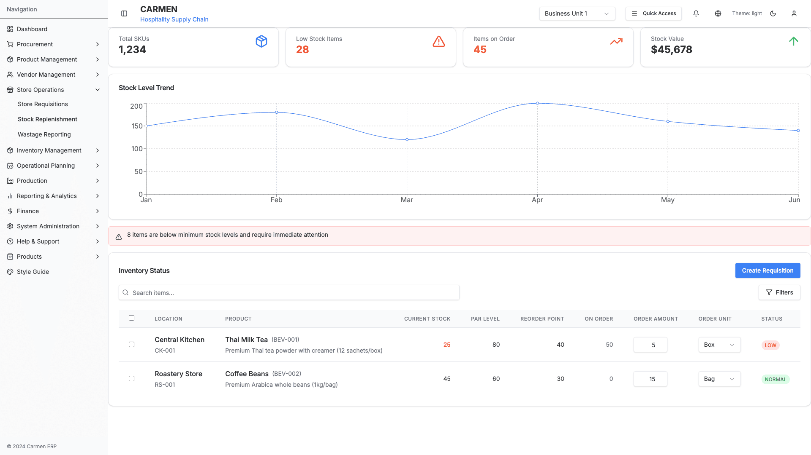
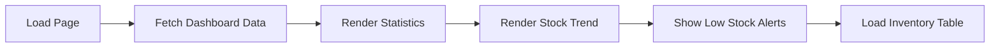
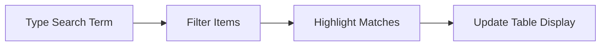
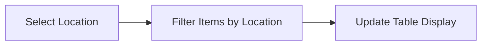
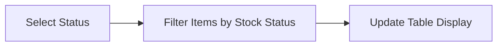
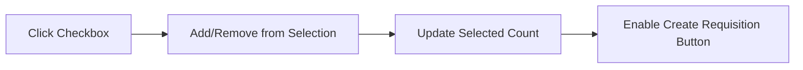
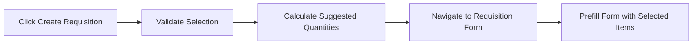
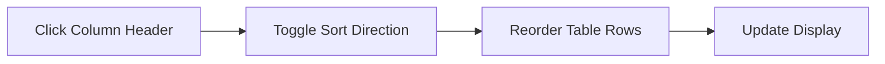
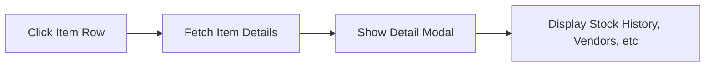

# Stock Replenishment Submodule

**Submodule**: Stock Replenishment
**Route**: `/store-operations/stock-replenishment`
**Status**: 🚧 Prototype/Demo Only
**Last Updated**: 2025-10-02

## Table of Contents

1. [Overview](#overview)
2. [Pages](#pages)
3. [Components](#components)
4. [Action Flows](#action-flows)
5. [Future Features](#future-features)

---

## Overview

The Stock Replenishment module provides real-time monitoring of stock levels across all store locations, alerts for low stock items, and tools for creating replenishment requisitions. This is currently a **prototype/demo** with mock data.

**Key Capabilities**:
- Monitor stock levels across locations
- Track items below minimum/reorder points
- View items currently on order
- Analyze stock value
- Create requisitions from alerts
- View stock level trends

**Screenshot**: 

---

## Pages

### Stock Replenishment Dashboard

**Path**: `/store-operations/stock-replenishment`
**Component**: `StockReplenishmentDashboard`

#### Page Structure

```
┌─────────────────────────────────────────────────────────────┐
│ ┌─── Dashboard Stats ───────────────────────────────────┐  │
│ │ Total SKUs  Low Stock Items  Items on Order  Value    │  │
│ │   1,234          28              45          $45,678  │  │
│ └───────────────────────────────────────────────────────┘  │
├─────────────────────────────────────────────────────────────┤
│ ┌─── Stock Level Trend Chart ──────────────────────────┐  │
│ │ Line chart showing 6-month trend                      │  │
│ └───────────────────────────────────────────────────────┘  │
├─────────────────────────────────────────────────────────────┤
│ ⚠ 8 items are below minimum stock levels and require        │
│   immediate attention                                        │
├─────────────────────────────────────────────────────────────┤
│ Inventory Status                         [Create Requisition]│
│ [Search...] [Location Filter] [Status Filter]               │
├─────────────────────────────────────────────────────────────┤
│  Item   Location  Current  Min  Par  Status  Actions...     │
│  ─────────────────────────────────────────────────────...   │
│  Thai Milk Tea  CK-001   25    30   80   Low    [Select]   │
│  Coffee Beans   RS-001   45    20   60   Normal [Select]   │
│                                                              │
└─────────────────────────────────────────────────────────────┘
```

#### Dashboard Statistics

**Total SKUs Card**:
- Shows total number of unique items tracked
- Icon: Package
- Current Value: 1,234

**Low Stock Items Card**:
- Shows count of items below minimum level
- Icon: AlertTriangle (red)
- Current Value: 28
- Requires immediate attention

**Items on Order Card**:
- Shows count of items currently being replenished
- Icon: TrendingUp (orange)
- Current Value: 45

**Stock Value Card**:
- Shows total value of current stock
- Icon: ArrowUp (green)
- Current Value: $45,678

#### Stock Level Trend Chart

**Type**: Line Chart
**Data**: 6-month stock level trend
**Features**:
- X-axis: Months (Jan-Jun)
- Y-axis: Stock level
- Responsive container
- Interactive tooltips

**Months Shown**:
- January: 150
- February: 180
- March: 120
- April: 200
- May: 160
- June: 140

#### Low Stock Alert

**Component**: Alert banner
**Styling**: Red background with border
**Icon**: AlertTriangle
**Message**: "8 items are below minimum stock levels and require immediate attention"

#### Inventory Status Table

**Features**:
- Searchable item list
- Location filtering
- Status filtering
- Bulk selection for requisition creation
- Sortable columns

**Table Columns**:
1. **Select** - Checkbox for bulk actions
2. **Item Name** - Product name with SKU
3. **Description** - Detailed item description
4. **Location** - Storage location name
5. **Location Code** - Location identifier
6. **Current Stock** - Current quantity
7. **Min Level** - Minimum stock threshold
8. **Max Level** - Maximum stock capacity
9. **Par Level** - Target optimal stock
10. **On Order** - Quantity currently being ordered
11. **Reorder Point** - Trigger point for reorder
12. **Unit** - Unit of measure
13. **Last Price** - Last purchase price
14. **Last Vendor** - Last supplier
15. **Status** - Stock status indicator
16. **Usage** - Usage pattern (High/Medium/Low)

**Sample Items**:

**Item 1: Thai Milk Tea**
- SKU: BEV-001
- Description: Premium Thai tea powder with creamer (12 sachets/box)
- Location: Central Kitchen (CK-001)
- Current Stock: 25
- Min Level: 30
- Max Level: 100
- Par Level: 80
- On Order: 50
- Reorder Point: 40
- Unit: Box
- Last Price: $45.99
- Last Vendor: Thai Beverage Co.
- Status: Low (Red indicator)
- Usage: High

**Item 2: Coffee Beans**
- SKU: BEV-002
- Description: Premium Arabica whole beans (1kg/bag)
- Location: Roastery Store (RS-001)
- Current Stock: 45
- Min Level: 20
- Max Level: 80
- Par Level: 60
- On Order: 0
- Reorder Point: 30
- Unit: Bag
- Last Price: $28.50
- Last Vendor: Global Coffee Suppliers
- Status: Normal (Green indicator)
- Usage: Medium

---

## Components

### Dashboard Stat Card

**Component**: `Card` with statistics
**Props**:
- Title (e.g., "Total SKUs")
- Value (numeric)
- Icon
- Color theme

**Styling**:
- Clean white background
- Large bold number
- Icon in corresponding color
- Subtle shadow

### Stock Level Chart

**Component**: ResponsiveContainer with LineChart
**Library**: Recharts
**Features**:
- Responsive sizing
- Grid lines
- X and Y axes
- Tooltip on hover
- Smooth line animation

### Alert Banner

**Component**: `Alert`
**Props**:
- Variant: Destructive/Warning
- Icon: AlertTriangle
- Description text

**Features**:
- Red background
- Border styling
- Icon on left
- Dismissible (optional)

### Inventory Table

**Component**: Custom table with sorting/filtering
**Features**:
- Sticky header
- Sortable columns
- Row selection checkboxes
- Status indicators
- Responsive design

### Status Indicator

**Component**: Badge or colored dot
**Variants**:
- **Low** - Red (below min level)
- **Critical** - Dark red (below reorder point)
- **Normal** - Green (within range)
- **High** - Blue (above par level)
- **Overstock** - Orange (above max level)

---

## Action Flows

### View Dashboard

**Trigger**: Navigate to `/store-operations/stock-replenishment`



### Search Items

**Trigger**: Type in search box



### Filter by Location

**Trigger**: Select location from dropdown



### Filter by Status

**Trigger**: Select status filter



### Select Items for Requisition

**Trigger**: Click item checkboxes



### Create Requisition from Selection

**Trigger**: Click "Create Requisition" button



### Sort Table

**Trigger**: Click column header



### View Item Details

**Trigger**: Click item row (future feature)



---

## Future Features

### Planned Enhancements

**Automated Replenishment**:
- Auto-generate requisitions when items hit reorder point
- Suggested order quantities based on par levels and usage
- Vendor selection based on pricing and lead time
- Scheduled automatic ordering

**Advanced Analytics**:
- Stock turnover rate analysis
- Slow-moving item identification
- Stockout prediction using ML
- Seasonal demand patterns
- Cost analysis and optimization

**Multi-Location Management**:
- Transfer suggestions between locations
- Centralized vs decentralized stocking strategies
- Location-specific par levels
- Cross-location visibility

**Integration Features**:
- Direct PO creation from stock alerts
- Vendor portal integration
- Real-time inventory updates
- Barcode scanning for stock counts

**Alerting System**:
- Configurable alert thresholds
- Email/SMS notifications
- Escalation workflows
- Custom alert rules per item/category

**Reporting**:
- Stock valuation reports
- Replenishment history
- Vendor performance
- Stock accuracy metrics
- Wastage correlation

---

## Data Models

### Stock Item

```typescript
interface StockItem {
  id: number
  name: string
  sku: string
  description: string
  location: string
  locationCode: string
  currentStock: number
  minLevel: number
  maxLevel: number
  parLevel: number
  onOrder: number
  reorderPoint: number
  lastPrice: number
  lastVendor: string
  status: 'low' | 'critical' | 'normal' | 'high' | 'overstock'
  usage: 'high' | 'medium' | 'low'
  unit: string
  orderAmount: number
  selected?: boolean
}
```

### Stock Level Trend

```typescript
interface StockTrendData {
  month: string
  level: number
}
```

---

## Technical Notes

**Mock Data**: This module currently uses mock data for demonstration purposes. Real implementation would require:
- API integration for real-time stock data
- Database queries for inventory levels
- Integration with inventory management system
- User permission checks
- Actual requisition creation workflow

**Performance Considerations**:
- Pagination for large datasets (currently showing all items)
- Debounced search for better UX
- Memoization of chart data
- Lazy loading of item details

**Accessibility**:
- ARIA labels on interactive elements
- Keyboard navigation support
- Screen reader compatible
- High contrast status indicators

---

**Last Updated**: 2025-10-02
**Module**: Store Operations > Stock Replenishment
**Status**: 🚧 Prototype/Demo Only
