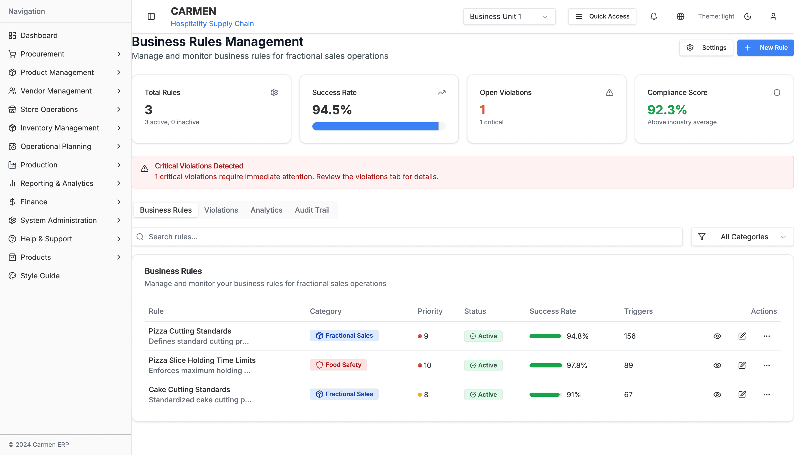
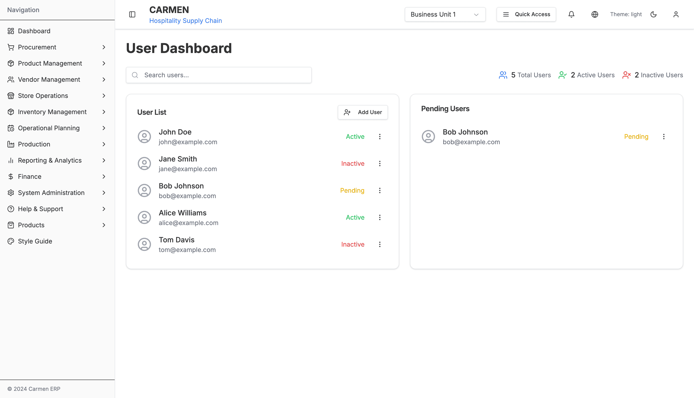
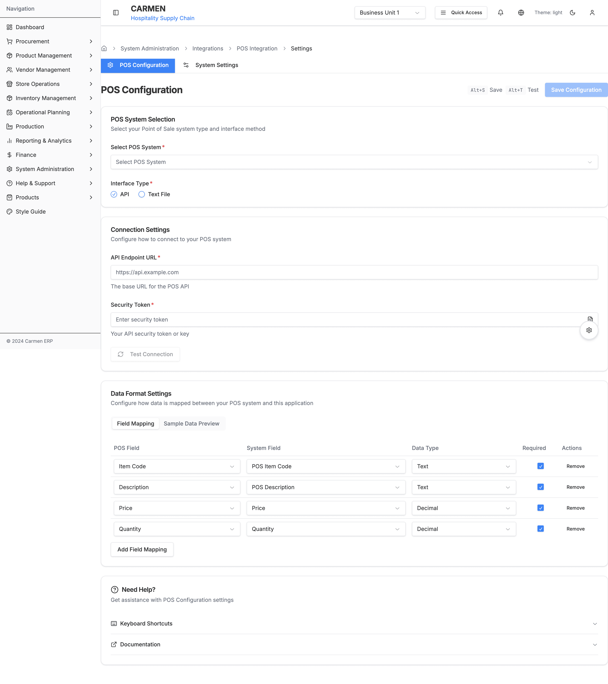
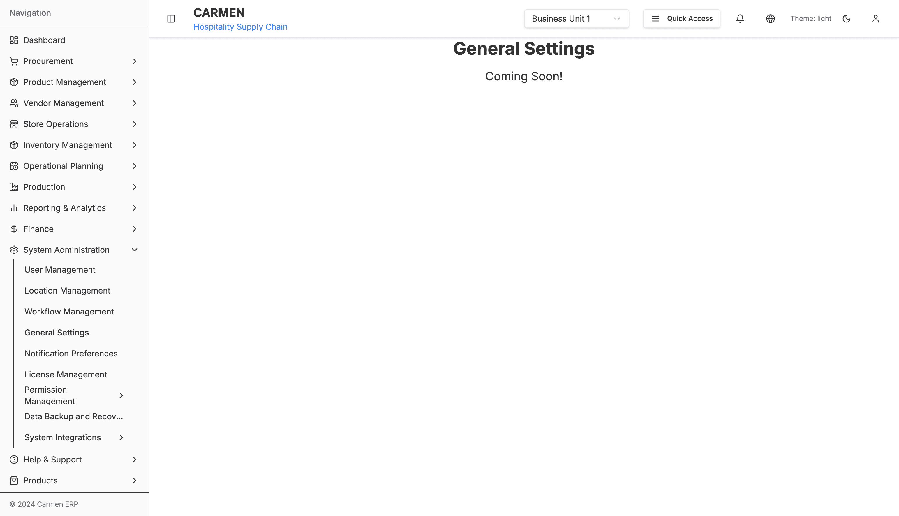

# System Administration Module

> **Module Status:** ✅ Production Ready (Core Features) | 🚧 Partial (Advanced Features)
> **Last Updated:** 2025-10-21
> **Total Pages:** 57+ implemented pages (Settings Hub + 10 settings tabs)
> **Documentation Coverage:** ✅ Comprehensive (All Core Features Documented)

---

## 📚 Quick Navigation

- [Module Overview](#module-overview)
- [Sub-Modules](#sub-modules)
- [Features Summary](#features-summary)
- [Documentation Index](#documentation-index)
- [Getting Started](#getting-started)

---

## Module Overview

The System Administration module provides comprehensive tools for managing system-wide configurations, user access, workflows, integrations, and security policies. This is the central hub for all administrative functions in the Carmen ERP system.

### Purpose

- **User & Access Management**: Manage users, roles, and permissions
- **Workflow Configuration**: Configure approval workflows and business processes
- **System Integration**: Connect with external systems (POS, ERP, etc.)
- **Security & Compliance**: Enforce business rules and monitor compliance
- **Location & Certification Management**: Manage organizational locations and certifications
- **Monitoring**: Track system health and performance

### Key Capabilities

✅ **Permission Management** - Advanced RBAC and ABAC policy management
✅ **Workflow Engine** - Configurable approval workflows
✅ **POS Integration** - Complete Point of Sale system integration
✅ **Location Management** - Multi-location support with hierarchy
✅ **Business Rules** - Enforce organizational policies
✅ **Certifications** - Track vendor and staff certifications
✅ **User Management** - Complete user lifecycle management
✅ **Account Code Mapping** - Financial system integration

---

## 📸 System Screenshots

### Permission Management

#### Role Management

*The Role Management interface displays a comprehensive hierarchy of 10 organizational roles including System Administrator, General Manager, Finance Director, Procurement Manager, Kitchen Manager, Line Cook, Store Manager, Inventory Clerk, Vendor Manager, and Accountant. Each role shows permission counts, user assignments, hierarchy levels (1-5), and status indicators (Active/Inactive) for effective role-based access control management.*

#### Policy Management

*The Policy Management screen shows 6 RBAC policies including Finance Manager Access, General Staff Access, Inventory Management Access, Procurement Management Access, Store Manager Access, and Vendor Management Access. Each policy displays its category, resource types, effects (PERMIT), priority level (100), and enabled status for comprehensive attribute-based access control configuration.*

### User & Location Management

#### User Management

*The User Management interface displays 5 system users with complete profile information: John Doe (General Manager), Sarah Johnson (Purchasing Agent), Michael Chen (Executive Chef), Emily Rodriguez (Finance Director), and David Park (Store Manager). Each entry shows role assignments, department affiliations, permissions, approval limits, and status for comprehensive user lifecycle management.*

#### Location Management

*The Location Management screen shows 5 business locations including Chicago Processing Plant, LA Distribution, Miami Seafood Center, NYC Restaurant Central Kitchen, and Phoenix Dry Storage. Each location displays location codes, types, EOP status, delivery points, and active/inactive status for multi-location organizational structure management.*

### Workflow & Business Rules

#### Workflow Configuration

*The Workflow Configuration interface displays 2 workflow configurations: General Purchase Workflow (6 stages) and Market List Workflow (4 stages). Each workflow shows workflow type (Purchase Request), number of stages, active users, status, and last modified dates for managing approval processes and business logic.*

#### Business Rules Dashboard

*The Business Rules Dashboard provides comprehensive oversight with 3 active rules showing a 94.5% success rate, 92.3% compliance score, and 1 critical violation alert. Detailed rules include Pizza Cutting Standards, Pizza Slice Holding Time Limits, and Cake Cutting Standards, each displaying category (fractional sales, food safety), priority levels (8-10), success rates (91-97.8%), and trigger conditions.*

### Financial Configuration

#### Account Code Mapping

*The Account Code Mapping interface displays a mapping table with 6 entries showing the relationship between Store/Location, Category, Sub-Category, Item Group, Department, and Account Code. The "Posting to AP" view provides search, scan, import/export, edit, and print functions for financial system integration.*

### User Dashboard

#### Administrator Dashboard

*The User Dashboard provides an overview with 5 total users (2 active, 2 inactive, 1 pending). The interface shows user listings including John Doe, Jane Smith, Bob Johnson (pending), Alice Williams, and Tom Davis, with search functionality and an add user button for quick user administration.*

### POS System Integration

#### POS Configuration Settings

*The POS Configuration settings page features three main sections: POS System Selection (with dropdown and interface type selection), Connection Settings (API endpoint URL, security token, test connection), and Data Format Settings (field mapping table showing 4 mappings for Item Code, Description, Price, and Quantity). The interface includes breadcrumb navigation, keyboard shortcuts (Alt+S Save, Alt+T Test), and comprehensive help documentation for Point of Sale system integration.*

#### POS Location Mapping

*The POS Location Mapping interface displays 8 location mappings (LOC001-LOC008) showing integration between various POS system types including Comanche, HotelTime, Infrasys, and Soraso. Each mapping shows status tracking with last sync dates for maintaining synchronized location data across systems.*

#### POS Recipe Mapping (Fractional Sales)

*The POS Recipe Mapping interface demonstrates the fractional sales system with 10 recipe entries. Key feature: Chocolate Pound Cake shows 4 fractional variants (POS005 Slice with 0.0625 conversion for 1/16th portions, POS005Q Quarter at 0.25, POS005H Half at 0.5, and POS005W Whole at 1.0). Standard recipes include Chicken Curry, Vegetable Pasta, Caesar Salad, and Margarita. The interface displays search functionality, filters, location/units/recipes tabs, and status tracking (Mapped/Unmapped/Error) for comprehensive menu item integration.*

### Recently Implemented Features

The following features have been recently implemented and documented:

#### General Settings

*✅ **IMPLEMENTED**: The General Settings interface serves as the central hub for all system-wide configurations across Company Settings (organization information, branding, operational parameters with 3 tabs), Security Settings (password policies, 2FA, session management, access control, audit logging with 4 tabs), and Application Settings (email configuration, backup & recovery, integrations, performance with 4 tabs). This comprehensive feature enables administrators to configure organizational identity, security policies, application infrastructure, and performance optimization all from a single unified interface.*

#### Notification Settings

*✅ **IMPLEMENTED**: The Notification Settings interface provides comprehensive organization-wide notification management with 6 main tabs: Global Defaults (configuring default notification preferences for new users across all event types), Email Templates (customizable notification templates), Delivery Settings (rate limiting, retry policies, and channel configuration), Routing Rules (intelligent notification routing and escalation), Notification History (audit trail and analytics), and Testing (test notification delivery across channels). This feature enables administrators to configure notification channels (Email, In-App, SMS, Push, Webhooks), set frequency preferences (Instant, Hourly, Daily, Weekly), and manage delivery infrastructure for the entire organization.*

---

### Planned Features (Coming Soon)

The following features are planned for future releases:

#### License Management

*Planned feature: Software licensing and subscription management interface for tracking feature access and user limits. Coming in Q1 2026.*

#### Data Backup and Recovery

*Planned feature: Automated backup configuration and recovery tools for ensuring data protection and business continuity. Coming in Q1 2026.*

---

## Sub-Modules

### 1. Permission Management
**Status:** ✅ Production Ready
**Pages:** 12
**Path:** `/system-administration/permission-management`

Advanced permission management with:
- **Roles Management**: Create, edit, and assign roles
- **Policy Management**: ABAC policies with visual policy builder
- **Subscriptions**: License and feature subscription management
- **Policy Builder**: Visual interface for creating complex policies

**Key Features:**
- Role-based access control (RBAC)
- Attribute-based access control (ABAC)
- Policy versioning and testing
- Subscription tier management

📄 **Documentation:** [Permission Management Specification](./permission-management-specification.md)

---

### 2. Business Rules & Compliance
**Status:** ✅ Production Ready
**Pages:** 2
**Path:** `/system-administration/business-rules`

Configure and monitor business rules:
- **Business Rules**: Define organizational policies and rules
- **Compliance Monitoring**: Track compliance with regulatory requirements

**Key Features:**
- Rule definition and validation
- Compliance dashboards
- Violation tracking and alerts

📄 **Documentation:** [Business Rules Specification](./business-rules-specification.md)

---

### 3. Certifications Management
**Status:** ✅ Production Ready
**Pages:** 3
**Path:** `/system-administration/certifications`

Manage organizational certifications:
- Certificate CRUD operations
- Expiration tracking
- Compliance documentation
- Renewal workflows

**Key Features:**
- Vendor certifications
- Staff certifications
- Expiration alerts
- Document management

📄 **Documentation:** [Certifications Specification](./certifications-specification.md)

---

### 4. Location Management
**Status:** ✅ Production Ready
**Pages:** 4
**Path:** `/system-administration/location-management`

Multi-location organizational structure:
- **Location CRUD**: Create, view, edit locations
- **Location Hierarchy**: Parent-child relationships
- **Location Settings**: Configure location-specific settings

**Key Features:**
- Hierarchical location structure
- Location-specific configurations
- Address and contact management
- Location status tracking

📄 **Documentation:** [Location Management Specification](./location-management-specification.md)

---

### 5. User Management
**Status:** ✅ Production Ready
**Pages:** 2
**Path:** `/system-administration/user-management`

Complete user lifecycle management:
- User account creation
- Profile management
- Role assignment
- Access control

**Key Features:**
- User CRUD operations
- Role and permission assignment
- Department and location assignment
- User status management

📄 **Documentation:** [User Management Specification](./user-management-specification.md)

---

### 6. Workflow Management
**Status:** ✅ Production Ready
**Pages:** 4
**Path:** `/system-administration/workflow`

Configurable approval workflows:
- **Workflow Configuration**: Define approval chains
- **Role Assignment**: Assign roles to workflow steps
- **Workflow Templates**: Reusable workflow patterns

**Key Features:**
- Visual workflow designer
- Multi-step approval chains
- Conditional routing
- Escalation rules

📄 **Documentation:** [Workflow Management Specification](./workflow-management-specification.md)

---

### 7. POS System Integration
**Status:** ✅ Production Ready
**Pages:** 15
**Path:** `/system-administration/system-integrations/pos`

Comprehensive Point of Sale integration:

#### Settings
- **Configuration**: API endpoints, credentials
- **System Settings**: Sync frequency, data mapping

#### Mapping
- **Locations**: Map POS locations to Carmen locations
- **Units**: Map measurement units
- **Recipes**: Map menu items to recipes
- **Fractional Variants**: Handle portion sizes

#### Reports
- **Consumption**: Ingredient consumption from sales
- **Gross Profit**: Profitability analysis

#### Transactions
- Real-time transaction sync
- Historical data import

**Key Features:**
- Real-time data synchronization
- Bi-directional data flow
- Comprehensive mapping tools
- Transaction reconciliation

📄 **Documentation:** [POS Integration Specification](./pos-integration-specification.md)

---

### 8. Account Code Mapping
**Status:** ✅ Production Ready
**Pages:** 1
**Path:** `/system-administration/account-code-mapping`

Financial system integration:
- Map internal categories to GL accounts
- Support for multiple accounting systems
- Bulk import/export

📄 **Documentation:** [Account Code Mapping Specification](./account-code-mapping-specification.md)

---

### 9. User Dashboard
**Status:** ✅ Production Ready
**Pages:** 1
**Path:** `/system-administration/user-dashboard`

Administrator overview dashboard:
- System health metrics
- User activity summary
- Recent changes log
- Quick actions

---

### 10. Monitoring
**Status:** ✅ Production Ready
**Pages:** 1
**Path:** `/system-administration/monitoring`

System monitoring and health:
- Performance metrics
- Error tracking
- Usage statistics
- System alerts

📄 **Documentation:** [Monitoring Specification](./monitoring-specification.md)

---

### 11. Notification Settings
**Status:** ✅ Implemented & Documented
**Pages:** 6 tabs
**Path:** `/system-administration/settings/notifications`

Comprehensive notification management system:

#### Global Defaults
- Event category organization (Procurement, Inventory, Finance, Vendor, System)
- Channel selection per event (Email, In-App, SMS, Push)
- Frequency configuration (Instant, Hourly, Daily, Weekly)
- Bulk enable/disable operations

#### Email Templates
- Customizable notification templates
- HTML and plain text versions
- Variable placeholders for dynamic content
- Template preview functionality

#### Delivery Settings
- Rate limiting configuration (per-user and organization-wide)
- Retry policy management with exponential backoff
- Notification batching to reduce noise
- Channel infrastructure setup (Email, SMS, Push, Webhooks)

#### Routing Rules
- Intelligent notification routing
- Escalation policies with time-based triggers
- Role-based and user-specific routing
- Conditional delivery rules

#### Notification History
- Complete audit trail of all sent notifications
- Advanced filtering and search
- Delivery analytics and metrics
- Export capabilities

#### Testing & Validation
- Test notification delivery across all channels
- Template preview with sample data
- Delivery status verification

**Key Features:**
- Multi-channel delivery (Email, In-App, SMS, Push, Webhooks)
- Configurable rate limiting and quotas
- Automatic retry with exponential backoff
- Template variable substitution
- User preference override support
- Comprehensive audit logging

📄 **Documentation:**
- [Notification Settings Overview](./features/notification-settings/README.md)
- [Implementation Guide](./features/notification-settings/guides/implementation-guide.md)
- [Business Rules](./features/notification-settings/guides/business-rules.md)

---

### 12. General Settings
**Status:** ✅ Implemented & Documented
**Pages:** Settings Hub + 3 settings pages (Company, Security, Application)
**Path:** `/system-administration/settings`

Central hub for all system-wide configurations:

#### Settings Hub
- Quick navigation to all settings categories
- Card-based layout with status indicators
- Planned vs. implemented feature badges
- Responsive grid design

#### Company Settings (3 Tabs)
**General Information:**
- Company identity (name, legal name, tax ID, registration)
- Contact information (phones, emails)
- Business address (street, city, state, postal code, country)

**Branding:**
- Logo management (light mode, dark mode, favicon)
- Brand colors (primary, secondary, accent)
- Visual identity guidelines

**Operational Settings:**
- Localization (currency, timezone, language)
- Fiscal configuration (fiscal year dates)
- Operating hours and schedules
- Organizational structure

#### Security Settings (4 Tabs)
**Password Policy:**
- Password complexity requirements (length, character types)
- Password expiry and history management
- Password strength indicator

**Authentication:**
- Two-factor authentication (2FA) configuration
- Session management (timeout, concurrent sessions)
- Login security (failed attempts, lockout duration)

**Access Control:**
- IP whitelisting and access restrictions
- Security questions for password recovery
- Role-based access control

**Audit & Logging:**
- Comprehensive audit logging (login, data access, modifications)
- Log retention policies
- Data encryption settings (at rest, in transit)
- Encryption algorithm selection

#### Application Settings (4 Tabs)
**Email Configuration:**
- Email provider selection (SMTP, SendGrid, AWS SES)
- SMTP settings (host, port, credentials, encryption)
- Email templates and testing

**Backup & Recovery:**
- Automated backup scheduling (hourly, daily, weekly, monthly)
- Backup retention and storage location
- Point-in-time recovery options

**Integrations:**
- POS system integration
- ERP system connection
- Accounting system sync
- Third-party API management

**Features & Performance:**
- Feature toggles (advanced search, real-time notifications, mobile access)
- Performance optimization (caching, CDN, image optimization)
- API configuration (rate limiting, versioning)

**Key Features:**
- Centralized configuration management
- Tab-based navigation for organized settings
- Real-time validation and feedback
- Security warnings for critical changes
- Comprehensive business rules enforcement
- Audit trail for all configuration changes

📄 **Documentation:**
- [General Settings Overview](./features/general-settings/README.md)
- [Implementation Guide](./features/general-settings/guides/implementation-guide.md)
- [Business Rules](./features/general-settings/guides/business-rules.md)

---

## Features Summary

### Implemented Features

| Feature | Status | Pages | Description |
|---------|--------|-------|-------------|
| **Permission Management** | ✅ Complete | 12 | RBAC/ABAC with policy builder |
| **Business Rules** | ✅ Complete | 2 | Rule definition and compliance |
| **Certifications** | ✅ Complete | 3 | Certification tracking |
| **Location Management** | ✅ Complete | 4 | Multi-location support |
| **User Management** | ✅ Complete | 2 | User lifecycle |
| **Workflow** | ✅ Complete | 4 | Approval workflows |
| **POS Integration** | ✅ Complete | 15 | Complete POS sync |
| **Account Mapping** | ✅ Complete | 1 | Financial integration |
| **User Dashboard** | ✅ Complete | 1 | Admin dashboard |
| **Monitoring** | ✅ Complete | 1 | System health |
| **General Settings** | ✅ Complete | 4 | System-wide configurations |
| **Notification Settings** | ✅ Complete | 6 | Organization-wide notifications |

### Future Enhancements

| Feature | Priority | Status | Target |
|---------|----------|--------|--------|
| License Management | Medium | 🚧 Planned | Q1 2026 |
| Backup & Recovery | High | 🚧 Planned | Q1 2026 |
| Audit Logs | Medium | 🚧 Planned | Q2 2026 |
| Settings Import/Export | Medium | 🚧 Planned | Q2 2026 |
| Advanced Analytics Dashboard | Low | 🚧 Planned | Q3 2026 |

---

## Documentation Index

### Specifications
- [Complete System Administration Specification](./system-administration-complete-specification.md)
- [Permission Management Specification](./permission-management-specification.md)
- [Business Rules Specification](./business-rules-specification.md)
- [Certifications Specification](./certifications-specification.md)
- [Location Management Specification](./location-management-specification.md)
- [User Management Specification](./user-management-specification.md)
- [Workflow Management Specification](./workflow-management-specification.md)
- [POS Integration Specification](./pos-integration-specification.md)
- [Monitoring Specification](./monitoring-specification.md)
- [General Settings Specification](./features/general-settings/README.md)
- [Notification Settings Specification](./features/notification-settings/README.md)

### Technical Documentation
- [System Administration Sitemap](./system-administration-sitemap.md)
- [API Documentation](./api/README.md)
- [Component Documentation](./components/README.md)

### User Guides
- [Administrator Guide](./guides/administrator-guide.md)
- [Permission Management Guide](./guides/permission-management-guide.md)
- [Workflow Configuration Guide](./guides/workflow-guide.md)
- [POS Integration Setup Guide](./guides/pos-integration-guide.md)
- [General Settings Implementation Guide](./features/general-settings/guides/implementation-guide.md)
- [General Settings Business Rules](./features/general-settings/guides/business-rules.md)
- [Notification Settings Implementation Guide](./features/notification-settings/guides/implementation-guide.md)
- [Notification Settings Business Rules](./features/notification-settings/guides/business-rules.md)

---

## Getting Started

### For Administrators

1. **User Management**
   - Navigate to System Administration > User Management
   - Create user accounts and assign roles
   - Configure permissions and access levels

2. **Workflow Setup**
   - Go to Workflow Management
   - Create approval workflows
   - Assign approvers to workflow steps

3. **POS Integration**
   - Configure POS connection in System Integrations
   - Map locations, units, and recipes
   - Test synchronization

### For Developers

```typescript
// Example: Check user permissions
import { userHasPermission } from '@/lib/types/guards';

const canApprove = userHasPermission(user, 'approve_purchase_request');
```

---

## File Structure

```
app/(main)/system-administration/
├── page.tsx                           # Main dashboard
├── account-code-mapping/              # Financial mapping
├── business-rules/                    # Business rules
│   ├── page.tsx
│   └── compliance-monitoring/
├── certifications/                    # Certification mgmt
│   ├── page.tsx
│   ├── [id]/edit/
│   └── create/
├── location-management/               # Location mgmt
│   ├── page.tsx
│   ├── [id]/view/
│   ├── [id]/edit/
│   └── new/
├── permission-management/             # RBAC/ABAC
│   ├── page.tsx
│   ├── roles/
│   ├── policies/
│   └── subscriptions/
├── system-integrations/               # External integrations
│   └── pos/                          # POS integration
│       ├── settings/
│       ├── mapping/
│       ├── reports/
│       └── transactions/
├── user-management/                   # User mgmt
│   ├── page.tsx
│   └── [id]/
├── workflow/                          # Workflow engine
│   ├── page.tsx
│   ├── role-assignment/
│   └── workflow-configuration/
├── user-dashboard/                    # Admin dashboard
├── monitoring/                        # System monitoring
└── [subItem]/                         # Dynamic routing
```

---

## Related Modules

- **Security Module** - ABAC policy implementation
- **Finance Module** - Account code mapping integration
- **Procurement Module** - Workflow usage
- **User Profile** - User management integration

---

## Change Log

| Version | Date | Changes |
|---------|------|---------|
| 1.2.1 | 2025-10-21 | Updated status to reflect implemented General Settings and Notification Settings (57+ total pages) |
| 1.2.0 | 2025-10-21 | Added comprehensive General Settings documentation (Company, Security, Application Settings) |
| 1.1.0 | 2025-10-21 | Added comprehensive Notification Settings documentation |
| 1.0.0 | 2025-01-17 | Initial documentation created |

---

## Support & Contacts

**Module Owner:** System Administration Team
**Documentation:** documentation@carmen-erp.com
**Technical Support:** support@carmen-erp.com

---

**Next:** [Permission Management Specification](./permission-management-specification.md)
