# Campaigns Submodule

## Table of Contents

1. [Overview](#overview)
2. [Campaigns List Page](#campaigns-list-page)
3. [New/Detail Campaign Pages](#newdetail-campaign-pages)

---

## Overview

**Submodule Name**: Campaigns
**Route**: `/vendor-management/campaigns`
**Status**: 🚧 Prototype
**Purpose**: RFP/RFQ campaign management for collecting vendor pricing through coordinated invitations

**Key Features**:
- Campaign creation and editing
- Multi-vendor invitation management
- Email template customization
- Response tracking
- Campaign scheduling
- Result export and comparison

---

## Campaigns List Page

**Path**: `/vendor-management/campaigns`
**File**: `app/(main)/vendor-management/campaigns/page.tsx`

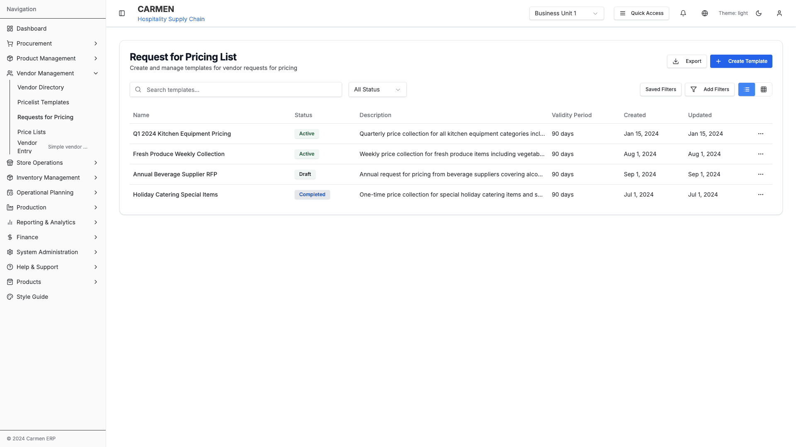
*RFP Campaigns List - Campaign management and tracking*

**Status**: 🚧 Prototype

### Table Columns
- Campaign Name
- Template Used
- Start Date
- End Date
- Vendors Invited
- Responses Received
- Status
- Actions

### Campaign Status Options
- Draft
- Active
- Completed
- Cancelled

### Actions
- Create Campaign
- Edit Campaign
- View Responses
- Send Reminders
- Close Campaign
- Export Results

### Action Flows

**Create Campaign**:
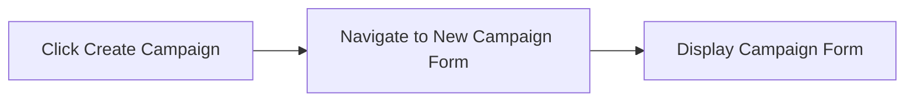

**Edit Campaign**:
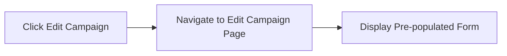

**View Responses**:
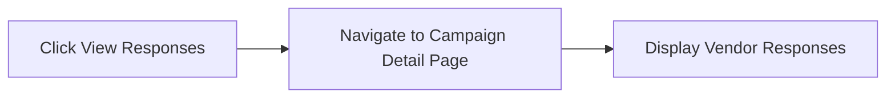

**Send Reminders**:

**Close Campaign**:
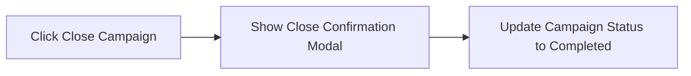

**Export Results**:
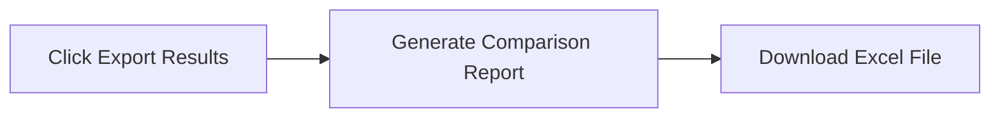

---

## New/Detail Campaign Pages

**Path**: `/vendor-management/campaigns/new` or `/vendor-management/campaigns/:id`
**Files**:
- `app/(main)/vendor-management/campaigns/new/page.tsx`
- `app/(main)/vendor-management/campaigns/[id]/page.tsx`

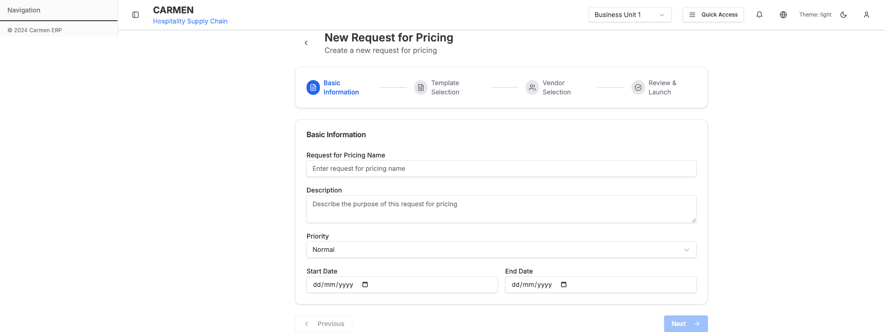
*New Campaign Creation - Vendor selection and invitation management*

### Form Sections

**1. Campaign Information**
- Campaign Name
- Description
- Template Selection
- Start Date
- End Date

**2. Vendor Selection**
- Multi-select vendor list
- Filter by category
- Bulk select options

**3. Invitation Settings**
- Email template
- Send immediately or schedule
- Reminder schedule

**4. Response Tracking** (Detail view only)
- Vendors invited
- Responses received
- Pending responses
- Response deadline

### Actions
- Save Campaign
- Send Invitations
- Schedule Campaign
- Cancel Campaign
- View Vendor Responses
- Send Reminder

### Modals
- Vendor Selection Dialog
- Email Preview
- Schedule Confirmation
- Response Detail View

### Action Flows

**Save Campaign**:
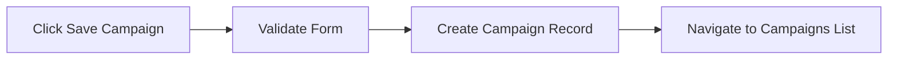

**Send Invitations**:
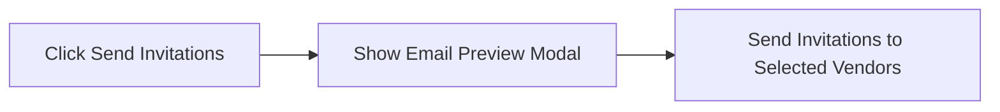

**Schedule Campaign**:
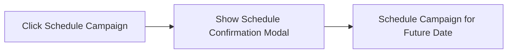

**Select Vendors**:
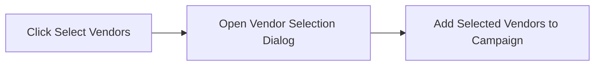

**Preview Email**:
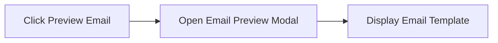

**View Vendor Responses**:
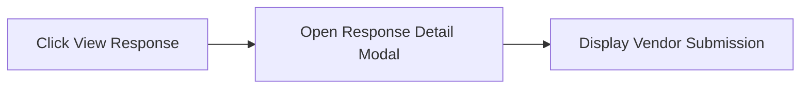

**Send Reminder**:
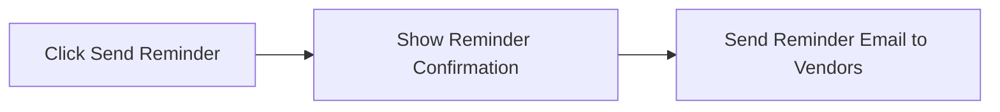

**Template Selection**:
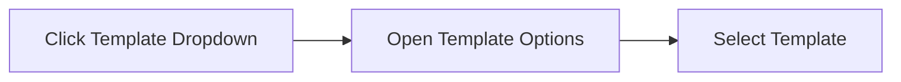

---

**Last Updated**: 2025-10-02
**Status**: Complete
**Module**: Vendor Management
**Submodule**: Campaigns
