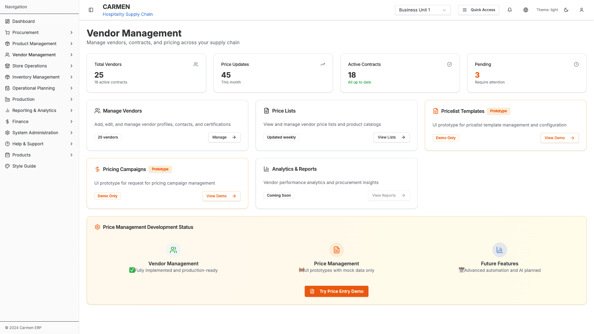
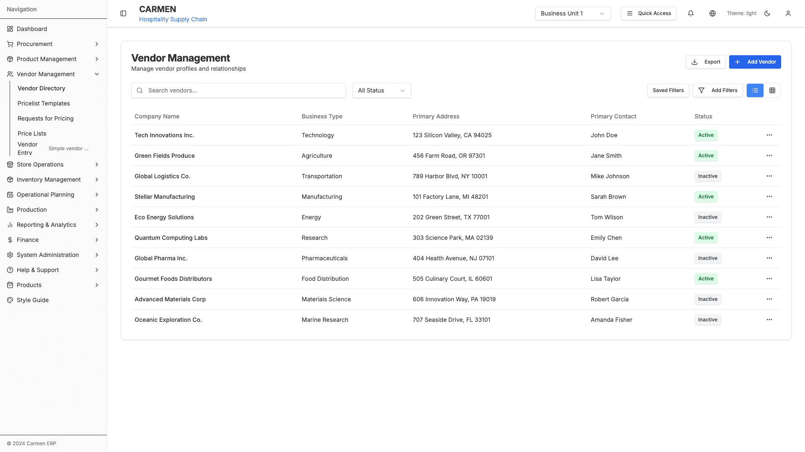
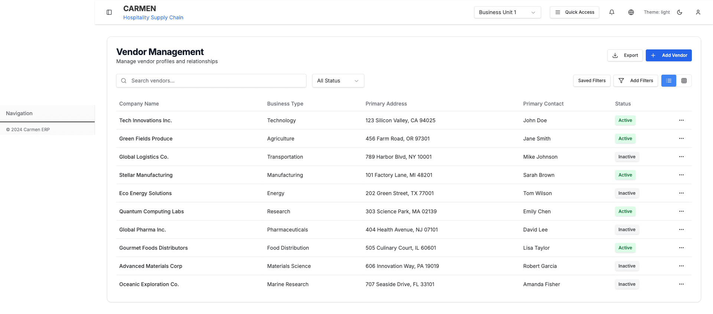
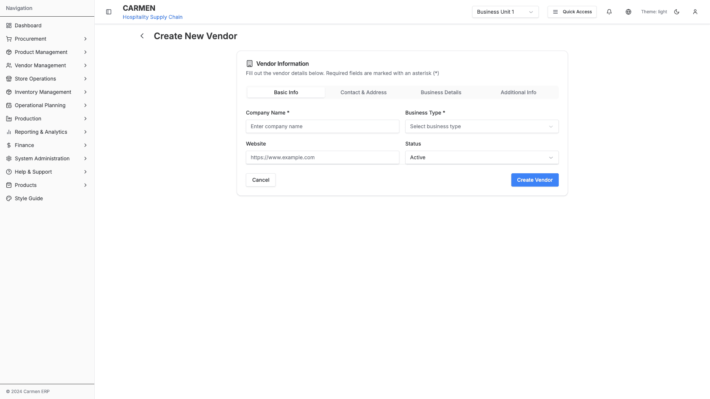
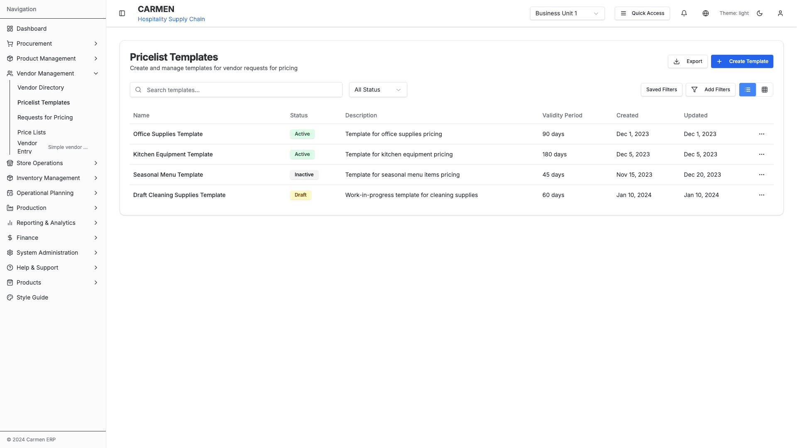
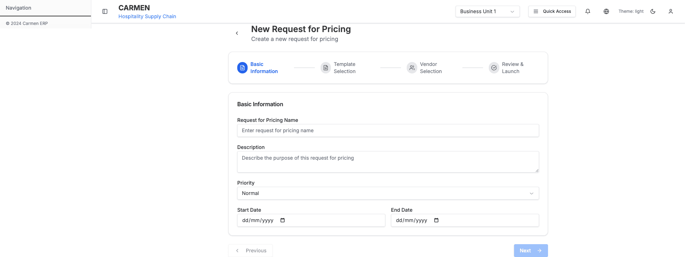
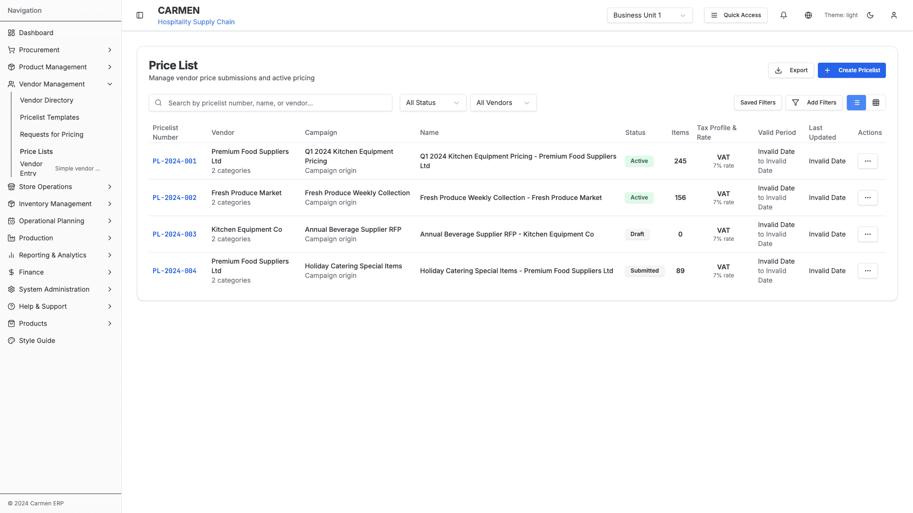
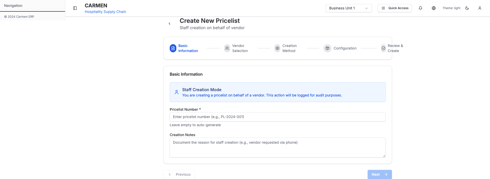
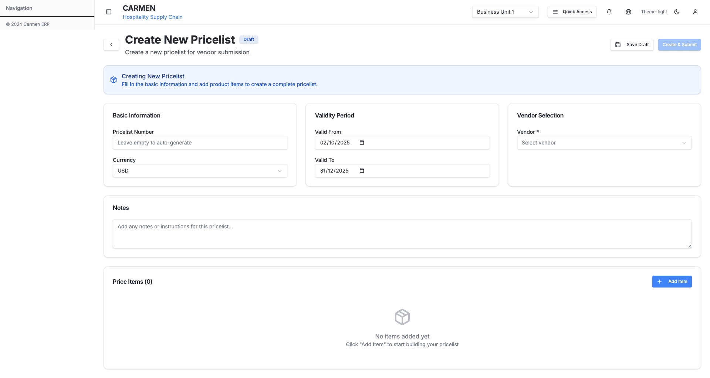

# Vendor Management - Pages and Components Specification

## Table of Contents

1. [Pages Overview](#pages-overview)
2. [Modals and Dialogs](#modals-and-dialogs)
3. [Dropdown Fields Reference](#dropdown-fields-reference)
4. [Actions and Buttons Reference](#actions-and-buttons-reference)
5. [Form Components](#form-components)
6. [Data Display Components](#data-display-components)
7. [Glossary](#glossary)

---

## Pages Overview

### Landing Page
**Path**: `/vendor-management`
**File**: `app/(main)/vendor-management/page.tsx`

*Vendor Management Landing Page - Main dashboard with module navigation*

**Purpose**: Main entry point for vendor management module

**Components**:
- Module dashboard cards
- Quick navigation tiles
- Statistics overview
- Recent activity feed

**Actions**:
- Navigate to Manage Vendors
- Navigate to Templates
- Navigate to Campaigns
- Navigate to Pricelists
- Try Vendor Portal Demo

#### Action Flows

**Navigate to Manage Vendors**
```mermaid
flowchart LR
    Click["Click Manage Vendors Card"] --> Navigate["Navigate to /manage-vendors"]
    Navigate --> Display["Display Vendor List Page"]
```

**Navigate to Templates**
```mermaid
flowchart LR
    Click["Click Templates Card"] --> Navigate["Navigate to /templates"]
    Navigate --> Display["Display Templates List"]
```

**Navigate to Campaigns**
```mermaid
flowchart LR
    Click["Click Campaigns Card"] --> Navigate["Navigate to /campaigns"]
    Navigate --> Display["Display Campaigns List"]
```

**Navigate to Pricelists**
```mermaid
flowchart LR
    Click["Click Pricelists Card"] --> Navigate["Navigate to /pricelists"]
    Navigate --> Display["Display Pricelists List"]
```

**Try Vendor Portal Demo**
```mermaid
flowchart LR
    Click["Click Try Demo Button"] --> Navigate["Navigate to /vendor-portal/sample"]
    Navigate --> Display["Display Vendor Portal Interface"]
```

---

### Manage Vendors - List Page
**Path**: `/vendor-management/manage-vendors`
**File**: `app/(main)/vendor-management/manage-vendors/page.tsx`

*Vendor List Page - Table view with filtering and search*

*Vendor List with Active Search - Real-time filtering*

*Status Filter Dropdown - Active/Inactive selection*

**Components Used**:
- `VendorSearchBar` - Global search functionality
- `VendorFilters` - Status and advanced filtering
- `modern-vendor-list` - Table/card view component
- `VendorCard` - Card view display
- `advanced-filter` - Advanced filter dialog

**Dropdown Fields**:
1. **Status Filter**
   - Options: All, Active, Inactive
   - Location: Top toolbar
   - Component: `VendorFilters`

2. **View Toggle**
   - Options: Table View, Card View
   - Location: Top toolbar
   - Default: Table View

3. **Items Per Page**
   - Options: 10, 25, 50, 100
   - Location: Bottom pagination
   - Default: 25

4. **Sort By**
   - Options: Name (A-Z), Name (Z-A), Date Added (Newest), Date Added (Oldest)
   - Location: Top toolbar

**Actions**:
- **Add Vendor** - Opens new vendor form
- **Search** - Real-time search across vendor fields
- **Filter** - Open advanced filter dialog
- **Export** - Export filtered results to Excel
- **View Details** - Navigate to vendor detail page
- **Edit** - Open edit mode for vendor
- **Duplicate** - Duplicate vendor record
- **Delete** - Delete vendor (with dependency check)

**Modals**:
- Advanced Filter Dialog
- Delete Confirmation Dialog
- Duplicate Vendor Dialog

#### Action Flows

**Add Vendor**
```mermaid
flowchart LR
    Click["Click Add Vendor Button"] --> Navigate["Navigate to /manage-vendors/new"]
    Navigate --> Display["Display New Vendor Form"]
```

**Search Vendors**
```mermaid
flowchart LR
    Type["Type in Search Box"] --> Debounce["Debounce 300ms"]
    Debounce --> Filter["Filter Vendor List"]
    Filter --> Update["Update Display in Real-time"]
```

**Filter by Status**
```mermaid
flowchart LR
    Click["Click Status Dropdown"] --> Open["Open Dropdown Menu"]
    Open --> Select["Select Status: All/Active/Inactive"]
    Select --> Filter["Filter Vendor List"]
    Filter --> Update["Update Display"]
```

**Open Advanced Filter**
```mermaid
flowchart LR
    Click["Click Advanced Filter Button"] --> Open["Open Advanced Filter Dialog"]
    Open --> Configure["Configure Filter Criteria"]
    Configure --> Apply["Click Apply"]
    Apply --> Filter["Filter Vendor List"]
    Filter --> Close["Close Dialog"]
    Close --> Update["Update Display"]
```

**Export Vendors**
```mermaid
flowchart LR
    Click["Click Export Button"] --> Gather["Gather Filtered Data"]
    Gather --> Generate["Generate Excel File"]
    Generate --> Download["Trigger Browser Download"]
```

**View Vendor Details**
```mermaid
flowchart LR
    Click["Click Vendor Row or View Button"] --> Navigate["Navigate to /manage-vendors/:id"]
    Navigate --> Load["Load Vendor Data"]
    Load --> Display["Display Detail Page with Tabs"]
```

**Edit Vendor**
```mermaid
flowchart LR
    Click["Click Edit Button in Actions Menu"] --> Check["Check Permissions"]
    Check --> Navigate["Navigate to Edit Mode"]
    Navigate --> Display["Display Editable Form"]
```

**Duplicate Vendor**
```mermaid
flowchart LR
    Click["Click Duplicate in Actions Menu"] --> Open["Open Duplicate Dialog"]
    Open --> Confirm["Confirm Duplication"]
    Confirm --> Clone["Clone Vendor Data"]
    Clone --> Navigate["Navigate to New Vendor Form"]
    Navigate --> Populate["Populate with Cloned Data"]
```

**Delete Vendor**
```mermaid
flowchart LR
    Click["Click Delete in Actions Menu"] --> Check["Check Dependencies"]
    Check --> Warn{Has Dependencies?}
    Warn -->|Yes| ShowWarning["Show Warning Dialog with List"]
    Warn -->|No| ShowConfirm["Show Simple Confirmation"]
    ShowWarning --> ChoiceWarn{User Choice}
    ShowConfirm --> ChoiceSimple{User Choice}
    ChoiceWarn -->|Force Delete| Delete["Delete Vendor and Relations"]
    ChoiceWarn -->|Cancel| Close["Close Dialog"]
    ChoiceSimple -->|Confirm| Delete
    ChoiceSimple -->|Cancel| Close
    Delete --> Refresh["Refresh List"]
    Close --> Stay["Stay on Page"]
```

**Toggle View Mode**
```mermaid
flowchart LR
    Click["Click View Toggle Button"] --> Switch{Current View}
    Switch -->|Table| ShowCards["Switch to Card View"]
    Switch -->|Card| ShowTable["Switch to Table View"]
    ShowCards --> Update["Update Display"]
    ShowTable --> Update
```

---

### Manage Vendors - Detail Page
**Path**: `/vendor-management/manage-vendors/:id`
**File**: `app/(main)/vendor-management/manage-vendors/[id]/page.tsx`

*Vendor Detail Page - Overview Tab with all vendor information*

**Tab Navigation**:
1. **Overview Tab** (default)
2. **Pricelists Tab**
3. **Contacts Tab**
4. **Certifications Tab**

**Components by Tab**:

#### Overview Tab Components:
- `basic-info-section` - Company information display
- `addresses-section` - Primary address card
- `contacts-section` - Primary contact card
- `certifications-section` - Certifications summary
- `environmental-section` - Environmental profile

**Fields Displayed** (Overview):
- Company Name
- Business Type (dropdown values from mock data)
- Registration Number
- Tax ID
- Primary Address
- Primary Contact
- Payment Terms
- Credit Limit
- Status (Active/Inactive toggle)

#### Pricelists Tab Components:
- `vendor-pricelists-section` - Pricelist management
- Pricelist table with columns:
  - Pricelist Number
  - Effective Date
  - Expiry Date
  - Status
  - Item Count
  - Actions

**Pricelists Tab Actions**:
- View Pricelist Details
- Add New Pricelist
- Edit Pricelist
- Delete Pricelist
- Download Pricelist

#### Contacts Tab Components:
- `contacts-tab` - Multi-contact management
- `addresses-tab` - Multi-address management

**Contact Fields**:
- Contact Name
- Role/Title
- Email
- Phone
- Mobile
- Is Primary (toggle)

**Address Fields**:
- Address Type (dropdown: Billing, Shipping, Office)
- Street Address
- City
- State/Province
- Postal Code
- Country
- Is Primary (toggle)

**Contacts Tab Actions**:
- Add Contact
- Edit Contact
- Delete Contact
- Set as Primary Contact
- Add Address
- Edit Address
- Delete Address
- Set as Primary Address

#### Certifications Tab:
**Fields**:
- Certification Name
- Certification Number
- Issuing Authority
- Issue Date
- Expiry Date
- Status (Valid/Expired/Expiring Soon)
- Document Upload

**Actions**:
- Add Certification
- Edit Certification
- Delete Certification
- View Document
- Upload Document
- Download Document

**Page-Level Actions** (all tabs):
- Back to List
- Edit Vendor
- Delete Vendor
- Print
- Export to PDF

**Modals**:
- Add Contact Dialog
- Edit Contact Dialog
- Add Address Dialog
- Edit Address Dialog
- Add Certification Dialog
- Edit Certification Dialog
- Delete Confirmation Dialog

#### Action Flows

**Switch Tab**
```mermaid
flowchart LR
    Click["Click Tab Button"] --> Load["Load Tab Content"]
    Load --> Display["Display Tab Data"]
```

**Back to List**
```mermaid
flowchart LR
    Click["Click Back Button"] --> Navigate["Navigate to /manage-vendors"]
    Navigate --> Display["Display Vendor List"]
```

**Edit Vendor**
```mermaid
flowchart LR
    Click["Click Edit Button"] --> Check["Check Permissions"]
    Check --> Navigate["Enter Edit Mode"]
    Navigate --> Enable["Enable Form Fields"]
```

**Delete Vendor**
```mermaid
flowchart LR
    Click["Click Delete Button"] --> Check["Check Dependencies"]
    Check --> Dialog["Show Deletion Dialog"]
    Dialog --> Choice{User Confirms?}
    Choice -->|Yes| Delete["Delete Vendor"]
    Choice -->|No| Cancel["Cancel"]
    Delete --> Navigate["Navigate to List"]
    Cancel --> Stay["Stay on Page"]
```

**Print Page**
```mermaid
flowchart LR
    Click["Click Print Button"] --> Format["Format for Print"]
    Format --> Open["Open Print Dialog"]
```

**Export to PDF**
```mermaid
flowchart LR
    Click["Click Export PDF Button"] --> Generate["Generate PDF Document"]
    Generate --> Download["Trigger Download"]
```

**Add Contact (Contacts Tab)**
```mermaid
flowchart LR
    Click["Click Add Contact Button"] --> Open["Open Add Contact Dialog"]
    Open --> Fill["Fill Contact Form"]
    Fill --> Validate["Validate Fields"]
    Validate --> Save["Click Save"]
    Save --> Create["Create Contact Record"]
    Create --> Close["Close Dialog"]
    Close --> Refresh["Refresh Contacts List"]
```

**Edit Contact (Contacts Tab)**
```mermaid
flowchart LR
    Click["Click Edit on Contact"] --> Open["Open Edit Contact Dialog"]
    Open --> Populate["Populate with Existing Data"]
    Populate --> Modify["Modify Fields"]
    Modify --> Validate["Validate Changes"]
    Validate --> Save["Click Save"]
    Save --> Update["Update Contact Record"]
    Update --> Close["Close Dialog"]
    Close --> Refresh["Refresh Contacts List"]
```

**Delete Contact (Contacts Tab)**
```mermaid
flowchart LR
    Click["Click Delete on Contact"] --> Check{Is Primary?}
    Check -->|Yes| Warn["Show Warning: Cannot Delete Primary"]
    Check -->|No| Confirm["Show Confirmation Dialog"]
    Confirm --> Choice{User Confirms?}
    Choice -->|Yes| Delete["Delete Contact"]
    Choice -->|No| Cancel["Cancel"]
    Delete --> Refresh["Refresh Contacts List"]
    Warn --> Close["Close"]
    Cancel --> Close
```

**Set as Primary Contact**
```mermaid
flowchart LR
    Click["Click Set as Primary"] --> Update["Update Primary Status"]
    Update --> Demote["Demote Current Primary"]
    Demote --> Promote["Promote Selected Contact"]
    Promote --> Refresh["Refresh Display"]
```

**Add Address (Contacts Tab)**
```mermaid
flowchart LR
    Click["Click Add Address Button"] --> Open["Open Add Address Dialog"]
    Open --> Fill["Fill Address Form"]
    Fill --> Select["Select Address Type"]
    Select --> Validate["Validate Fields"]
    Validate --> Save["Click Save"]
    Save --> Create["Create Address Record"]
    Create --> Close["Close Dialog"]
    Close --> Refresh["Refresh Addresses List"]
```

**Add New Pricelist (Pricelists Tab)**
```mermaid
flowchart LR
    Click["Click Add Pricelist Button"] --> Navigate["Navigate to Pricelist Creation"]
    Navigate --> Preselect["Pre-select Current Vendor"]
    Preselect --> Display["Display Pricelist Form"]
```

**View Pricelist Details (Pricelists Tab)**
```mermaid
flowchart LR
    Click["Click View on Pricelist Row"] --> Navigate["Navigate to Pricelist Detail"]
    Navigate --> Load["Load Pricelist Data"]
    Load --> Display["Display Pricelist Items"]
```

**Download Pricelist (Pricelists Tab)**
```mermaid
flowchart LR
    Click["Click Download on Pricelist"] --> Gather["Gather Pricelist Data"]
    Gather --> Generate["Generate Excel File"]
    Generate --> Download["Trigger Browser Download"]
```

**Add Certification (Certifications Tab)**
```mermaid
flowchart LR
    Click["Click Add Certification"] --> Open["Open Certification Dialog"]
    Open --> Fill["Fill Certification Form"]
    Fill --> Upload["Upload Document (Optional)"]
    Upload --> Validate["Validate Fields and Dates"]
    Validate --> Save["Click Save"]
    Save --> Create["Create Certification Record"]
    Create --> Close["Close Dialog"]
    Close --> Refresh["Refresh Certifications List"]
```

**View Document (Certifications Tab)**
```mermaid
flowchart LR
    Click["Click View Document"] --> Fetch["Fetch Document URL"]
    Fetch --> Open["Open in New Tab or Modal"]
```

**Upload Document (Certifications Tab)**
```mermaid
flowchart LR
    Click["Click Upload Button"] --> Browse["Open File Browser"]
    Browse --> Select["Select File"]
    Select --> Validate["Validate File Type and Size"]
    Validate --> Upload["Upload to Server"]
    Upload --> Link["Link to Certification"]
    Link --> Refresh["Refresh Display"]
```

---

### New Vendor Form
**Path**: `/vendor-management/manage-vendors/new`
**File**: `app/(main)/vendor-management/manage-vendors/new/page.tsx`

*New Vendor Creation Form - Multi-section form with validation*

*New Vendor Form (Alternative Path) - Alternative routing interface*

**Component**: `VendorForm`

**Form Sections**:

1. **Basic Information**
   - Company Name (required)
   - Business Type (dropdown)
   - Registration Number
   - Tax ID
   - Website URL
   - Description (textarea)

2. **Primary Contact**
   - Contact Name (required)
   - Email (required, validated)
   - Phone (required, validated)
   - Mobile
   - Role/Title

3. **Primary Address**
   - Address Type (dropdown: Billing, Shipping, Office)
   - Street Address (required)
   - City (required)
   - State/Province
   - Postal Code (required)
   - Country (dropdown, required)

4. **Payment Terms**
   - Payment Terms (dropdown: Net 30, Net 60, Net 90, Custom)
   - Credit Limit (currency input)
   - Currency (dropdown)

5. **Tax Configuration**
   - Tax ID
   - Tax Registration Number
   - Tax Rate (percentage)
   - Tax Exempt (checkbox)

**Dropdown Options**:

**Business Type**:
- Manufacturer
- Distributor
- Wholesaler
- Retailer
- Service Provider
- Contractor
- Supplier

**Address Type**:
- Billing Address
- Shipping Address
- Office Address
- Warehouse Address

**Payment Terms**:
- Net 30 Days
- Net 60 Days
- Net 90 Days
- Due on Receipt
- Custom Terms

**Country**: (Standard country list)

**Currency**:
- USD - US Dollar
- EUR - Euro
- GBP - British Pound
- JPY - Japanese Yen
- (etc.)

**Validation Rules**:
- Company Name: Required, min 2 characters
- Email: Valid email format
- Phone: Valid phone format
- Postal Code: Required
- Tax ID: Optional but validated format if provided
- Credit Limit: Positive number

**Actions**:
- Save Vendor
- Save and Add Another
- Cancel
- Reset Form

**Modal Dialogs**:
- Unsaved Changes Warning (on cancel)
- Validation Error Summary

#### Action Flows

**Save Vendor**:
```mermaid
flowchart LR
    Click["Click Save Vendor"] --> Validate["Validate Form"]
    Validate --> Create["Create Vendor Record"]
    Create --> Navigate["Navigate to Vendor Detail Page"]
```

**Save and Add Another**:
```mermaid
flowchart LR
    Click["Click Save and Add Another"] --> Validate["Validate Form"]
    Validate --> Create["Create Vendor Record"]
    Create --> Clear["Clear Form Fields"]
```

**Cancel**:
```mermaid
flowchart LR
    Click["Click Cancel"] --> Check["Check for Unsaved Changes"]
    Check --> Modal["Show Unsaved Changes Warning"]
    Modal --> Navigate["Navigate Back to Vendor List"]
```

**Reset Form**:
```mermaid
flowchart LR
    Click["Click Reset Form"] --> Clear["Clear All Form Fields"]
    Clear --> Reset["Reset to Default Values"]
```

**Field Validation**:
```mermaid
flowchart LR
    Blur["Field Blur Event"] --> Validate["Validate Field Value"]
    Validate --> Show["Show Validation Error/Success"]
```

**Business Type Selection**:
```mermaid
flowchart LR
    Click["Click Business Type Dropdown"] --> Open["Open Dropdown Options"]
    Open --> Select["Select Business Type"]
```

**Address Type Selection**:
```mermaid
flowchart LR
    Click["Click Address Type Dropdown"] --> Open["Open Dropdown Options"]
    Open --> Select["Select Address Type"]
```

**Payment Terms Selection**:
```mermaid
flowchart LR
    Click["Click Payment Terms Dropdown"] --> Open["Open Dropdown Options"]
    Open --> Select["Select Payment Terms"]
```

**Country Selection**:
```mermaid
flowchart LR
    Click["Click Country Dropdown"] --> Open["Open Searchable Country List"]
    Open --> Select["Select Country"]
```

**Currency Selection**:
```mermaid
flowchart LR
    Click["Click Currency Dropdown"] --> Open["Open Currency Options"]
    Open --> Select["Select Currency"]
```

---

### Vendor Edit Page (Alternative)
**Path**: `/vendor-management/vendors/:id/edit`
**File**: `app/(main)/vendor-management/vendors/[id]/edit/page.tsx`

Same form structure as New Vendor but pre-populated with existing data.

**Additional Actions**:
- Save Changes
- Cancel (revert to detail view)
- Delete Vendor

#### Action Flows

**Save Changes**:
```mermaid
flowchart LR
    Click["Click Save Changes"] --> Validate["Validate Form"]
    Validate --> Update["Update Vendor Record"]
    Update --> Navigate["Navigate to Vendor Detail Page"]
```

**Cancel Edit**:
```mermaid
flowchart LR
    Click["Click Cancel"] --> Check["Check for Unsaved Changes"]
    Check --> Navigate["Navigate to Vendor Detail Page"]
```

**Delete Vendor**:
```mermaid
flowchart LR
    Click["Click Delete Vendor"] --> Modal["Show Delete Confirmation Modal"]
    Modal --> Delete["Delete Vendor Record"]
    Delete --> Navigate["Navigate to Vendor List"]
```

---

### Pricelist Settings
**Path**: `/vendor-management/vendors/:id/pricelist-settings`
**File**: `app/(main)/vendor-management/vendors/[id]/pricelist-settings/page.tsx`

**Purpose**: Configure pricelist-specific settings for a vendor

**Settings Available**:
- Default Currency
- Default Payment Terms
- Auto-approve Pricelists (toggle)
- Price Update Notifications (toggle)
- Minimum Order Quantity Settings
- Volume Discount Configuration

#### Action Flows

**Update Default Currency**:
```mermaid
flowchart LR
    Select["Select Default Currency"] --> Update["Update Vendor Pricelist Settings"]
    Update --> Save["Save Settings"]
```

**Update Payment Terms**:
```mermaid
flowchart LR
    Select["Select Payment Terms"] --> Update["Update Vendor Pricelist Settings"]
    Update --> Save["Save Settings"]
```

**Toggle Auto-approve Pricelists**:
```mermaid
flowchart LR
    Toggle["Toggle Auto-approve Switch"] --> Update["Update Setting Value"]
    Update --> Save["Save Settings"]
```

**Configure MOQ Settings**:
```mermaid
flowchart LR
    Click["Click Configure MOQ"] --> Open["Open MOQ Settings Modal"]
    Open --> Save["Save MOQ Configuration"]
```

**Configure Volume Discounts**:
```mermaid
flowchart LR
    Click["Click Configure Discounts"] --> Open["Open Volume Discount Modal"]
    Open --> Save["Save Discount Configuration"]
```

---

### Templates - List Page
**Path**: `/vendor-management/templates`
**File**: `app/(main)/vendor-management/templates/page.tsx`

*Pricelist Templates List - Template management interface*

**Status**: 🚧 Prototype

**Components**:
- Template list table
- Template cards

**Table Columns**:
- Template Name
- Created Date
- Last Modified
- Product Count
- Status (Active/Draft)
- Actions

**Actions**:
- Create New Template
- Edit Template
- Duplicate Template
- Preview Template
- Delete Template
- Download Excel Template

#### Action Flows

**Create New Template**:
```mermaid
flowchart LR
    Click["Click Create New Template"] --> Navigate["Navigate to New Template Form"]
    Navigate --> Display["Display Template Form"]
```

**Edit Template**:
```mermaid
flowchart LR
    Click["Click Edit Template"] --> Navigate["Navigate to Edit Template Page"]
    Navigate --> Display["Display Pre-populated Form"]
```

**Duplicate Template**:
```mermaid
flowchart LR
    Click["Click Duplicate Template"] --> Copy["Copy Template Data"]
    Copy --> Navigate["Navigate to New Template Form with Copied Data"]
```

**Preview Template**:
```mermaid
flowchart LR
    Click["Click Preview Template"] --> Open["Open Template Preview Modal"]
    Open --> Display["Display Template Structure"]
```

**Delete Template**:
```mermaid
flowchart LR
    Click["Click Delete Template"] --> Modal["Show Delete Confirmation Modal"]
    Modal --> Delete["Delete Template Record"]
```

**Download Excel Template**:
```mermaid
flowchart LR
    Click["Click Download Excel"] --> Generate["Generate Excel File"]
    Generate --> Download["Download Template File"]
```

---

### Templates - New/Edit
**Path**: `/vendor-management/templates/new` or `/vendor-management/templates/:id/edit`
**Files**:
- `app/(main)/vendor-management/templates/new/page.tsx`
- `app/(main)/vendor-management/templates/[id]/edit/page.tsx`

*New Template Creation - Product selection and custom fields configuration*

**Components Used**:
- `ProductSelectionComponent` - Product picker with search
- `CustomFieldsComponent` - Custom field configuration
- `MOQPricingComponent` - MOQ pricing structure
- `ExcelTemplateCustomizer` - Excel template layout
- `TemplatePreview` - Preview before saving

**Form Sections**:

1. **Template Information**
   - Template Name (required)
   - Description
   - Template Type (dropdown)

2. **Product Selection**
   - Search and select products
   - Multi-select with categories
   - Product tree view
   - Selected products list

3. **Custom Fields Configuration**
   - Add custom column
   - Field name
   - Field type (dropdown: Text, Number, Date, Dropdown)
   - Required toggle
   - Default value

4. **MOQ Pricing Structure**
   - Define quantity tiers
   - Pricing per tier
   - Unit selection
   - Volume discounts

5. **Excel Template Layout**
   - Column order
   - Header customization
   - Branding options

**Dropdowns**:

**Template Type**:
- Standard Pricelist
- RFQ Template
- Contract Template
- Catalog Template

**Field Type**:
- Text
- Number
- Currency
- Date
- Dropdown
- Yes/No

**Actions**:
- Save Template
- Save as Draft
- Preview
- Generate Excel
- Cancel

**Modals**:
- Product Selection Dialog
- Custom Field Editor
- MOQ Tier Configuration
- Preview Dialog

#### Action Flows

**Save Template**:
```mermaid
flowchart LR
    Click["Click Save Template"] --> Validate["Validate Form"]
    Validate --> Create["Create Template Record"]
    Create --> Navigate["Navigate to Templates List"]
```

**Save as Draft**:
```mermaid
flowchart LR
    Click["Click Save as Draft"] --> Save["Save Template as Draft"]
    Save --> Stay["Stay on Current Page"]
```

**Preview Template**:
```mermaid
flowchart LR
    Click["Click Preview"] --> Open["Open Preview Dialog"]
    Open --> Display["Display Template Structure"]
```

**Generate Excel**:
```mermaid
flowchart LR
    Click["Click Generate Excel"] --> Create["Create Excel File"]
    Create --> Download["Download Excel Template"]
```

**Add Product**:
```mermaid
flowchart LR
    Click["Click Add Product"] --> Open["Open Product Selection Dialog"]
    Open --> Add["Add Selected Products"]
```

**Add Custom Field**:
```mermaid
flowchart LR
    Click["Click Add Custom Field"] --> Open["Open Custom Field Editor"]
    Open --> Add["Add Field to Template"]
```

**Configure MOQ Tier**:
```mermaid
flowchart LR
    Click["Click Configure MOQ"] --> Open["Open MOQ Tier Configuration"]
    Open --> Save["Save Tier Settings"]
```

**Template Type Selection**:
```mermaid
flowchart LR
    Click["Click Template Type Dropdown"] --> Open["Open Template Type Options"]
    Open --> Select["Select Template Type"]
```

---

### Campaigns - List Page
**Path**: `/vendor-management/campaigns`
**File**: `app/(main)/vendor-management/campaigns/page.tsx`

*RFP Campaigns List - Campaign management and tracking*

**Status**: 🚧 Prototype

**Table Columns**:
- Campaign Name
- Template Used
- Start Date
- End Date
- Vendors Invited
- Responses Received
- Status
- Actions

**Campaign Status Options**:
- Draft
- Active
- Completed
- Cancelled

**Actions**:
- Create Campaign
- Edit Campaign
- View Responses
- Send Reminders
- Close Campaign
- Export Results

#### Action Flows

**Create Campaign**:
```mermaid
flowchart LR
    Click["Click Create Campaign"] --> Navigate["Navigate to New Campaign Form"]
    Navigate --> Display["Display Campaign Form"]
```

**Edit Campaign**:
```mermaid
flowchart LR
    Click["Click Edit Campaign"] --> Navigate["Navigate to Edit Campaign Page"]
    Navigate --> Display["Display Pre-populated Form"]
```

**View Responses**:
```mermaid
flowchart LR
    Click["Click View Responses"] --> Navigate["Navigate to Campaign Detail Page"]
    Navigate --> Display["Display Vendor Responses"]
```

**Send Reminders**:
```mermaid
flowchart LR
    Click["Click Send Reminders"] --> Modal["Show Reminder Confirmation"]
    Modal --> Send["Send Email Reminders to Vendors"]
```

**Close Campaign**:
```mermaid
flowchart LR
    Click["Click Close Campaign"] --> Modal["Show Close Confirmation Modal"]
    Modal --> Update["Update Campaign Status to Completed"]
```

**Export Results**:
```mermaid
flowchart LR
    Click["Click Export Results"] --> Generate["Generate Comparison Report"]
    Generate --> Download["Download Excel File"]
```

---

### Campaigns - New/Detail
**Path**: `/vendor-management/campaigns/new` or `/vendor-management/campaigns/:id`
**Files**:
- `app/(main)/vendor-management/campaigns/new/page.tsx`
- `app/(main)/vendor-management/campaigns/[id]/page.tsx`

*New Campaign Creation - Vendor selection and invitation management*

**Form Sections**:

1. **Campaign Information**
   - Campaign Name
   - Description
   - Template Selection
   - Start Date
   - End Date

2. **Vendor Selection**
   - Multi-select vendor list
   - Filter by category
   - Bulk select options

3. **Invitation Settings**
   - Email template
   - Send immediately or schedule
   - Reminder schedule

4. **Response Tracking** (Detail view only)
   - Vendors invited
   - Responses received
   - Pending responses
   - Response deadline

**Actions**:
- Save Campaign
- Send Invitations
- Schedule Campaign
- Cancel Campaign
- View Vendor Responses
- Send Reminder

**Modals**:
- Vendor Selection Dialog
- Email Preview
- Schedule Confirmation
- Response Detail View

#### Action Flows

**Save Campaign**:
```mermaid
flowchart LR
    Click["Click Save Campaign"] --> Validate["Validate Form"]
    Validate --> Create["Create Campaign Record"]
    Create --> Navigate["Navigate to Campaigns List"]
```

**Send Invitations**:
```mermaid
flowchart LR
    Click["Click Send Invitations"] --> Modal["Show Email Preview Modal"]
    Modal --> Send["Send Invitations to Selected Vendors"]
```

**Schedule Campaign**:
```mermaid
flowchart LR
    Click["Click Schedule Campaign"] --> Modal["Show Schedule Confirmation Modal"]
    Modal --> Schedule["Schedule Campaign for Future Date"]
```

**Select Vendors**:
```mermaid
flowchart LR
    Click["Click Select Vendors"] --> Open["Open Vendor Selection Dialog"]
    Open --> Add["Add Selected Vendors to Campaign"]
```

**Preview Email**:
```mermaid
flowchart LR
    Click["Click Preview Email"] --> Open["Open Email Preview Modal"]
    Open --> Display["Display Email Template"]
```

**View Vendor Responses**:
```mermaid
flowchart LR
    Click["Click View Response"] --> Open["Open Response Detail Modal"]
    Open --> Display["Display Vendor Submission"]
```

**Send Reminder**:
```mermaid
flowchart LR
    Click["Click Send Reminder"] --> Modal["Show Reminder Confirmation"]
    Modal --> Send["Send Reminder Email to Vendors"]
```

**Template Selection**:
```mermaid
flowchart LR
    Click["Click Template Dropdown"] --> Open["Open Template Options"]
    Open --> Select["Select Template"]
```

---

### Pricelists - List Page
**Path**: `/vendor-management/pricelists`
**File**: `app/(main)/vendor-management/pricelists/page.tsx`

*Pricelists Management - Price list viewing and editing*

**Status**: 🚧 Prototype

**Table Columns**:
- Pricelist Number
- Vendor Name
- Effective Date
- Expiry Date
- Currency
- Item Count
- Status
- Actions

**Status Options**:
- Draft
- Pending Review
- Active
- Expired
- Rejected

**Filters**:
- Status dropdown
- Vendor filter
- Date range picker
- Currency filter

**Actions**:
- Create Pricelist
- Edit Pricelist
- Review Pricelist
- Approve/Reject
- Download
- Delete

#### Action Flows

**Create Pricelist**:
```mermaid
flowchart LR
    Click["Click Create Pricelist"] --> Navigate["Navigate to New Pricelist Form"]
    Navigate --> Display["Display Pricelist Form"]
```

**Edit Pricelist**:
```mermaid
flowchart LR
    Click["Click Edit Pricelist"] --> Navigate["Navigate to Edit Pricelist Page"]
    Navigate --> Display["Display Pre-populated Form"]
```

**Review Pricelist**:
```mermaid
flowchart LR
    Click["Click Review Pricelist"] --> Open["Open Review Modal"]
    Open --> Display["Display Pricelist Details"]
```

**Approve Pricelist**:
```mermaid
flowchart LR
    Click["Click Approve"] --> Modal["Show Approval Confirmation"]
    Modal --> Update["Update Status to Active"]
```

**Reject Pricelist**:
```mermaid
flowchart LR
    Click["Click Reject"] --> Modal["Show Rejection Reason Modal"]
    Modal --> Update["Update Status to Rejected"]
```

**Download Pricelist**:
```mermaid
flowchart LR
    Click["Click Download"] --> Generate["Generate Excel File"]
    Generate --> Download["Download Pricelist File"]
```

**Delete Pricelist**:
```mermaid
flowchart LR
    Click["Click Delete"] --> Modal["Show Delete Confirmation Modal"]
    Modal --> Delete["Delete Pricelist Record"]
```

**Filter by Status**:
```mermaid
flowchart LR
    Click["Click Status Filter"] --> Open["Open Status Options"]
    Open --> Filter["Apply Status Filter"]
```

**Filter by Vendor**:
```mermaid
flowchart LR
    Click["Click Vendor Filter"] --> Open["Open Vendor Selection"]
    Open --> Filter["Apply Vendor Filter"]
```

---

### Pricelists - Edit
**Path**: `/vendor-management/pricelists/:id/edit` or `/vendor-management/pricelists/:id/edit-new`
**Files**:
- `app/(main)/vendor-management/pricelists/[id]/edit/page.tsx`
- `app/(main)/vendor-management/pricelists/[id]/edit-new/page.tsx`

*New Pricelist Creation - Product pricing configuration*

*Add Pricelist Form - Alternative creation interface*

**Components**:
- `StaffPricelistForm` - Staff editing interface
- `PricelistProductEditingComponent` - Product-level editing

**Pricelist Header**:
- Vendor (readonly)
- Effective Date
- Expiry Date
- Currency
- Payment Terms
- Notes

**Product Line Items**:
Each item has:
- Product Name/Code
- Description
- Unit of Measure
- MOQ (Minimum Order Quantity)
- Base Price
- Tier Pricing (multiple tiers)
- Discount Percentage
- Final Price (calculated)
- Status (Active/Inactive)

**Bulk Actions**:
- Apply percentage increase/decrease
- Copy pricing from another pricelist
- Delete selected items
- Set MOQ for selected

**Validation**:
- Price > 0
- Effective date < Expiry date
- All required fields filled
- No duplicate products

**Actions**:
- Save Draft
- Submit for Review
- Save and Publish
- Cancel
- Export to Excel
- Import from Excel

#### Action Flows

**Save Draft**:
```mermaid
flowchart LR
    Click["Click Save Draft"] --> Validate["Validate Basic Fields"]
    Validate --> Save["Save Pricelist as Draft"]
```

**Submit for Review**:
```mermaid
flowchart LR
    Click["Click Submit for Review"] --> Validate["Validate All Fields"]
    Validate --> Update["Update Status to Pending Review"]
```

**Save and Publish**:
```mermaid
flowchart LR
    Click["Click Save and Publish"] --> Validate["Validate All Fields"]
    Validate --> Publish["Update Status to Active"]
```

**Add Product Line**:
```mermaid
flowchart LR
    Click["Click Add Product"] --> Open["Open Product Selection"]
    Open --> Add["Add Product to Pricelist"]
```

**Delete Product Line**:
```mermaid
flowchart LR
    Click["Click Delete Product"] --> Modal["Show Delete Confirmation"]
    Modal --> Remove["Remove Product from Pricelist"]
```

**Apply Percentage Change**:
```mermaid
flowchart LR
    Click["Click Apply Percentage"] --> Modal["Show Percentage Input Modal"]
    Modal --> Update["Update All Selected Product Prices"]
```

**Copy Pricing**:
```mermaid
flowchart LR
    Click["Click Copy Pricing"] --> Modal["Show Pricelist Selection Modal"]
    Modal --> Copy["Copy Prices from Selected Pricelist"]
```

**Export to Excel**:
```mermaid
flowchart LR
    Click["Click Export"] --> Generate["Generate Excel File"]
    Generate --> Download["Download Pricelist Excel"]
```

**Import from Excel**:
```mermaid
flowchart LR
    Click["Click Import"] --> Upload["Open File Upload Dialog"]
    Upload --> Validate["Validate Excel Data"]
    Validate --> Import["Import Products and Prices"]
```

---

### Vendor Portal (Demo)
**Path**: `/vendor-management/vendor-portal/sample`
**File**: `app/(main)/vendor-management/vendor-portal/sample/page.tsx`

*Vendor Self-Service Portal - External vendor price entry interface*

**Status**: 🚧 Prototype/Demo

**Purpose**: External vendor self-service portal for price entry

**Features**:
- Token-based authentication (simulated)
- Campaign/template view
- Price entry form
- Auto-save functionality
- Validation feedback
- Submit confirmation

**Form Fields** (per product):
- Product Name (readonly)
- Product Code (readonly)
- Description (readonly)
- Your Price (editable)
- MOQ (editable)
- Lead Time Days (editable)
- Notes (textarea)

**Actions**:
- Save Draft (auto-save every 30s)
- Submit Pricelist
- Download Template
- Cancel

**Validation**:
- All prices must be positive
- MOQ must be positive integer
- Lead time reasonable (1-365 days)

#### Action Flows

**Auto-Save Draft**:
```mermaid
flowchart LR
    Timer["30 Second Timer"] --> Save["Save Current Form State"]
    Save --> Show["Show Auto-save Indicator"]
```

**Submit Pricelist**:
```mermaid
flowchart LR
    Click["Click Submit Pricelist"] --> Validate["Validate All Entries"]
    Validate --> Modal["Show Submission Confirmation"]
    Modal --> Submit["Submit Pricelist to System"]
```

**Download Template**:
```mermaid
flowchart LR
    Click["Click Download Template"] --> Generate["Generate Excel Template"]
    Generate --> Download["Download Template File"]
```

**Edit Product Price**:
```mermaid
flowchart LR
    Edit["Edit Price Field"] --> Validate["Validate Price Value"]
    Validate --> Update["Update Product Price"]
```

**Edit MOQ**:
```mermaid
flowchart LR
    Edit["Edit MOQ Field"] --> Validate["Validate MOQ Value"]
    Validate --> Update["Update Product MOQ"]
```

---

## Modals and Dialogs

### 1. Advanced Filter Dialog
**Trigger**: Click "Advanced Filter" button
**Component**: `advanced-filter.tsx`

**Filter Fields**:
- Company Name (text contains)
- Business Type (multi-select)
- Status (dropdown)
- Registration Date (date range)
- Credit Limit (range)
- Has Active Pricelists (yes/no)
- Payment Terms (multi-select)

**Actions**:
- Apply Filters
- Clear All
- Save Filter Preset
- Cancel

#### Action Flows

**Apply Filters**:
```mermaid
flowchart LR
    Click["Click Apply Filters"] --> Build["Build Filter Query"]
    Build --> Filter["Apply Filters to List"]
```

**Clear All Filters**:
```mermaid
flowchart LR
    Click["Click Clear All"] --> Reset["Reset All Filter Fields"]
    Reset --> Refresh["Refresh List View"]
```

**Save Filter Preset**:
```mermaid
flowchart LR
    Click["Click Save Preset"] --> Modal["Show Save Preset Dialog"]
    Modal --> Save["Save Filter Configuration"]
```

### 2. Vendor Deletion Dialog
**Trigger**: Click delete on vendor
**Component**: `VendorDeletionDialog.tsx`

**Displays**:
- Warning message
- Dependency check results
- Impact summary (POs, PRs affected)
- Force delete option (if has dependencies)

**Actions**:
- Confirm Delete
- Cancel
- View Dependencies

#### Action Flows

**Confirm Delete**:
```mermaid
flowchart LR
    Click["Click Confirm Delete"] --> Check["Check for Dependencies"]
    Check --> Delete["Delete Vendor Record"]
```

**View Dependencies**:
```mermaid
flowchart LR
    Click["Click View Dependencies"] --> Display["Display Dependency List"]
    Display --> Navigate["Navigate to Related Records"]
```

### 3. Add/Edit Contact Dialog
**Trigger**: Add/Edit contact buttons

**Fields**:
- Contact Name
- Role/Title
- Email
- Phone
- Mobile
- Is Primary Contact (toggle)

**Actions**:
- Save
- Cancel

#### Action Flows

**Save Contact**:
```mermaid
flowchart LR
    Click["Click Save"] --> Validate["Validate Contact Fields"]
    Validate --> Save["Save Contact to Vendor"]
```

**Set Primary Contact**:
```mermaid
flowchart LR
    Toggle["Toggle Primary Contact"] --> Update["Update Primary Contact Flag"]
    Update --> Unset["Unset Other Primary Contacts"]
```

### 4. Add/Edit Address Dialog
**Trigger**: Add/Edit address buttons

**Fields**:
- Address Type
- Street Address
- City
- State/Province
- Postal Code
- Country
- Is Primary Address (toggle)

**Actions**:
- Save
- Cancel

#### Action Flows

**Save Address**:
```mermaid
flowchart LR
    Click["Click Save"] --> Validate["Validate Address Fields"]
    Validate --> Save["Save Address to Vendor"]
```

**Set Primary Address**:
```mermaid
flowchart LR
    Toggle["Toggle Primary Address"] --> Update["Update Primary Address Flag"]
    Update --> Unset["Unset Other Primary Addresses"]
```

### 5. Add/Edit Certification Dialog
**Trigger**: Add/Edit certification buttons

**Fields**:
- Certification Name
- Certification Number
- Issuing Authority
- Issue Date
- Expiry Date
- Document Upload
- Notes

**Actions**:
- Save
- Upload Document
- Cancel

#### Action Flows

**Save Certification**:
```mermaid
flowchart LR
    Click["Click Save"] --> Validate["Validate Certification Fields"]
    Validate --> Save["Save Certification to Vendor"]
```

**Upload Document**:
```mermaid
flowchart LR
    Click["Click Upload"] --> Open["Open File Upload Dialog"]
    Open --> Upload["Upload Certification Document"]
```

### 6. Product Selection Dialog
**Trigger**: Add products in templates

**Features**:
- Search bar
- Category tree navigation
- Product list with checkboxes
- Selected products preview
- Bulk select/deselect

**Actions**:
- Add Selected
- Clear Selection
- Cancel

#### Action Flows

**Search Products**:
```mermaid
flowchart LR
    Type["Type Search Query"] --> Search["Search Product Catalog"]
    Search --> Display["Display Matching Products"]
```

**Select Products**:
```mermaid
flowchart LR
    Check["Check Product Checkbox"] --> Add["Add to Selected Products"]
    Add --> Update["Update Selection Preview"]
```

**Add Selected Products**:
```mermaid
flowchart LR
    Click["Click Add Selected"] --> Validate["Validate Selection"]
    Validate --> Add["Add Products to Template"]
```

**Browse Categories**:
```mermaid
flowchart LR
    Click["Click Category Node"] --> Expand["Expand Category Tree"]
    Expand --> Display["Display Category Products"]
```

### 7. Email Preview Dialog
**Trigger**: Preview campaign invitation

**Displays**:
- Email subject
- Email body
- Vendor portal link
- Campaign details

**Actions**:
- Send Now
- Edit Template
- Cancel

#### Action Flows

**Send Now**:
```mermaid
flowchart LR
    Click["Click Send Now"] --> Confirm["Show Send Confirmation"]
    Confirm --> Send["Send Email to Vendors"]
```

**Edit Template**:
```mermaid
flowchart LR
    Click["Click Edit Template"] --> Close["Close Preview"]
    Close --> Open["Open Email Template Editor"]
```

---

## Dropdown Fields Reference

### Status Dropdown
**Values**: Active, Inactive
**Used in**: Vendor filters, vendor form

### Business Type Dropdown
**Values**:
- Manufacturer
- Distributor
- Wholesaler
- Retailer
- Service Provider
- Contractor
- Supplier

**Used in**: Vendor form, advanced filters

### Payment Terms Dropdown
**Values**:
- Net 30 Days
- Net 60 Days
- Net 90 Days
- Due on Receipt
- Custom Terms

**Used in**: Vendor form, pricelist settings

### Address Type Dropdown
**Values**:
- Billing Address
- Shipping Address
- Office Address
- Warehouse Address

**Used in**: Address forms

### Currency Dropdown
**Values**: USD, EUR, GBP, JPY, CAD, AUD, etc.
**Used in**: Vendor form, pricelist forms

### Template Type Dropdown
**Values**:
- Standard Pricelist
- RFQ Template
- Contract Template
- Catalog Template

**Used in**: Template forms

### Campaign Status Dropdown
**Values**: Draft, Active, Completed, Cancelled
**Used in**: Campaign filters

### Pricelist Status Dropdown
**Values**: Draft, Pending Review, Active, Expired, Rejected
**Used in**: Pricelist filters

---

## Actions and Buttons Reference

### Global Actions (appearing across multiple pages):
- **Search** - Real-time search
- **Filter** - Open filter dialog
- **Export** - Export to Excel
- **Add New** - Create new record
- **Refresh** - Reload data
- **Settings** - Module settings

### List View Actions:
- **View Details** - Navigate to detail page
- **Edit** - Edit mode or edit page
- **Duplicate** - Clone record
- **Delete** - Delete with confirmation
- **Export Single** - Export single record

### Detail View Actions:
- **Back** - Return to list
- **Edit** - Enter edit mode
- **Save** - Save changes
- **Cancel** - Discard changes
- **Delete** - Delete record
- **Print** - Print view
- **Download PDF** - Export to PDF

### Form Actions:
- **Save** - Save record
- **Save and Add Another** - Save and reset form
- **Save Draft** - Save as draft
- **Submit** - Submit for review/approval
- **Cancel** - Discard and return
- **Reset** - Clear form

### Bulk Actions (multi-select):
- **Delete Selected** - Bulk delete
- **Export Selected** - Bulk export
- **Update Status** - Bulk status change
- **Apply Action** - Custom bulk operations

---

## Form Components

### Text Input Fields
- Standard text input
- Email input (validated)
- Phone input (formatted)
- URL input (validated)
- Number input (numeric keyboard)
- Currency input (formatted with symbol)

### Select/Dropdown Fields
- Single select dropdown
- Multi-select dropdown
- Searchable dropdown
- Country selector
- Currency selector

### Date/Time Fields
- Date picker
- Date range picker
- Time picker
- DateTime picker

### Rich Input Fields
- Textarea (multiline)
- Rich text editor
- File upload (with preview)
- Image upload (with cropping)
- Document upload (with validation)

### Toggle/Checkbox Fields
- Checkbox
- Toggle switch
- Radio button group
- Checkbox group

### Specialized Components
- Product selector
- Vendor selector
- Category tree selector
- MOQ tier builder
- Custom field builder

---

## Data Display Components

### Tables
- Sortable columns
- Pagination
- Row selection
- Inline actions
- Expandable rows
- Column visibility toggle

### Cards
- Vendor card
- Template card
- Campaign card
- Pricelist card

### Lists
- Contact list
- Address list
- Certification list
- Product list

### Statistics/Metrics
- KPI cards
- Summary widgets
- Progress indicators
- Status badges

### Timeline/History
- Activity feed
- Audit trail
- Change log

---

## Glossary

### A

**Active Status**: A vendor or pricelist that is currently operational and available for use in procurement processes.

**Address Type**: Classification of vendor addresses (Billing, Shipping, Office, Warehouse) to organize contact information.

**Advanced Filter**: Enhanced filtering capability allowing multiple criteria to be combined for precise vendor searches.

**Approval Workflow**: Process by which pricelists or vendor changes are reviewed and approved before becoming active.

**Audit Trail**: Historical record of all changes made to vendor records, pricelists, and related data.

### B

**Bulk Actions**: Operations that can be applied to multiple records simultaneously (e.g., price updates, status changes).

**Business Type**: Classification of vendors by their primary business model (Manufacturer, Distributor, Wholesaler, Retailer, Service Provider, Contractor, Supplier).

### C

**Campaign**: An organized request for pricing (RFP/RFQ) sent to multiple vendors simultaneously using a template.

**Campaign Status**: Current state of a pricing campaign (Draft, Active, Completed, Cancelled).

**Catalog Template**: Pricelist template designed for vendor product catalogs.

**Certification**: Official documents proving vendor compliance with industry standards, regulations, or quality requirements.

**Contact**: Individual person associated with a vendor, including their role, email, phone, and primary contact designation.

**Contract Template**: Pricelist template designed for long-term vendor contracts.

**Credit Limit**: Maximum amount of credit extended to a vendor for purchases.

**Currency**: Monetary unit used for pricing (USD, EUR, GBP, JPY, etc.).

**Custom Fields**: User-defined data fields that can be added to pricelist templates for specific information requirements.

### D

**Dependency Check**: Process that identifies related records (POs, PRs) before allowing vendor deletion.

**Draft Status**: Initial state of pricelists or campaigns that are being created but not yet active.

### E

**Effective Date**: Date when a pricelist becomes active and pricing becomes valid.

**Email Template**: Pre-formatted email message used for campaign invitations to vendors.

**Expiry Date**: Date when a pricelist expires and pricing is no longer valid.

**Export**: Function to download data in Excel or PDF format for external use.

### F

**Field Type**: Data type for custom fields (Text, Number, Currency, Date, Dropdown, Yes/No).

**Filter Preset**: Saved filter configuration that can be reused for common search scenarios.

**Force Delete**: Option to delete a vendor record even when dependencies exist.

### G

**GRN (Goods Received Note)**: Document recording receipt of goods from a vendor (referenced in dependency checks).

### I

**Import**: Function to upload data from Excel files into the system.

**Inactive Status**: A vendor or pricelist that is not currently available for use in procurement.

**Invitation Settings**: Configuration for how and when campaign invitations are sent to vendors.

**Issuing Authority**: Organization that grants certifications to vendors.

### L

**Lead Time**: Number of days required for a vendor to deliver products after order placement.

### M

**MOQ (Minimum Order Quantity)**: Smallest quantity of a product that a vendor is willing to sell in a single order.

**MOQ Pricing**: Tiered pricing structure where unit prices change based on order quantity thresholds.

**MOQ Tier**: Specific quantity level in a tiered pricing structure (e.g., 1-99 units, 100-499 units).

### P

**Payment Terms**: Agreement specifying when payment is due (Net 30, Net 60, Net 90, Due on Receipt, Custom Terms).

**Pending Review**: Status indicating a pricelist has been submitted and awaits approval.

**Primary Address**: Main address designated for a vendor, typically used as default for transactions.

**Primary Contact**: Main point of contact designated for a vendor, used as default for communications.

**Pricelist**: Document containing product pricing information from a vendor, including MOQs, tier pricing, and terms.

**Pricelist Number**: Unique identifier assigned to each pricelist for tracking purposes.

**Pricelist Status**: Current state of a pricelist (Draft, Pending Review, Active, Expired, Rejected).

**Product Code**: Unique identifier for a product in the catalog.

**Product Selection**: Interface for choosing products to include in templates or pricelists.

### R

**Registration Number**: Official business registration identifier for a vendor.

**Response Tracking**: System for monitoring vendor responses to campaign invitations.

**RFP (Request for Proposal)**: Formal request sent to vendors asking for detailed proposals.

**RFQ (Request for Quotation)**: Formal request sent to vendors asking for pricing information.

**RFQ Template**: Pricelist template designed specifically for RFQ campaigns.

### S

**Standard Pricelist**: Basic pricelist template for general vendor pricing.

**Status Badge**: Visual indicator showing the current status of records (Active, Inactive, Draft, etc.).

**Submit for Review**: Action to send a draft pricelist to reviewers for approval.

### T

**Tax Exempt**: Designation indicating a vendor is exempt from certain tax requirements.

**Tax ID**: Tax identification number assigned to a vendor by tax authorities.

**Tax Rate**: Percentage of tax applied to transactions with a vendor.

**Tax Registration Number**: Official registration number for tax purposes.

**Template**: Pre-configured structure for collecting vendor pricing information, defining which products and fields are included.

**Template Type**: Classification of templates (Standard Pricelist, RFQ Template, Contract Template, Catalog Template).

**Tier Pricing**: Pricing structure where unit price varies based on quantity purchased (see MOQ Pricing).

### U

**Unit of Measure**: Measurement unit for products (each, box, kg, liter, etc.).

**Unsaved Changes Warning**: Dialog that alerts users when attempting to leave a form with uncommitted changes.

### V

**Validation**: Process of checking data for correctness, completeness, and compliance with business rules.

**Vendor**: External supplier or service provider from whom goods or services are purchased.

**Vendor Comparison**: Analysis tool for comparing pricing and terms across multiple vendors.

**Vendor Portal**: Self-service web interface where vendors can view requests and submit pricing information.

**Volume Discount**: Price reduction applied when purchasing larger quantities (see MOQ Pricing, Tier Pricing).

### W

**Workflow**: Automated process for routing pricelists or vendor changes through approval steps.

---

**Last Updated**: 2025-10-02
**Status**: Complete specification for all pages, modals, dropdowns, actions, and glossary
