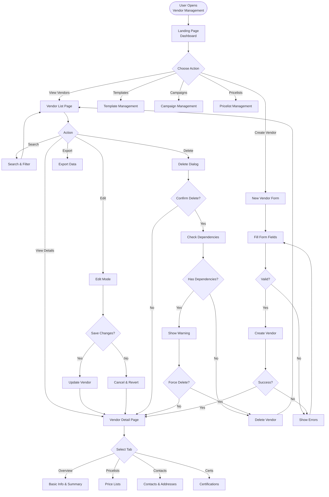
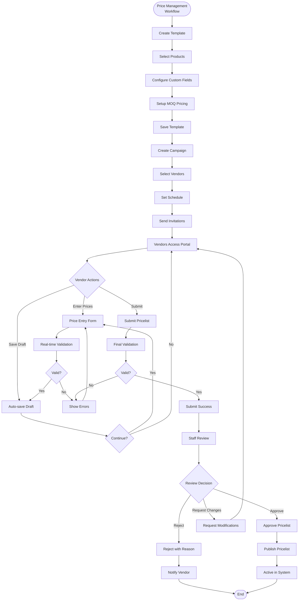
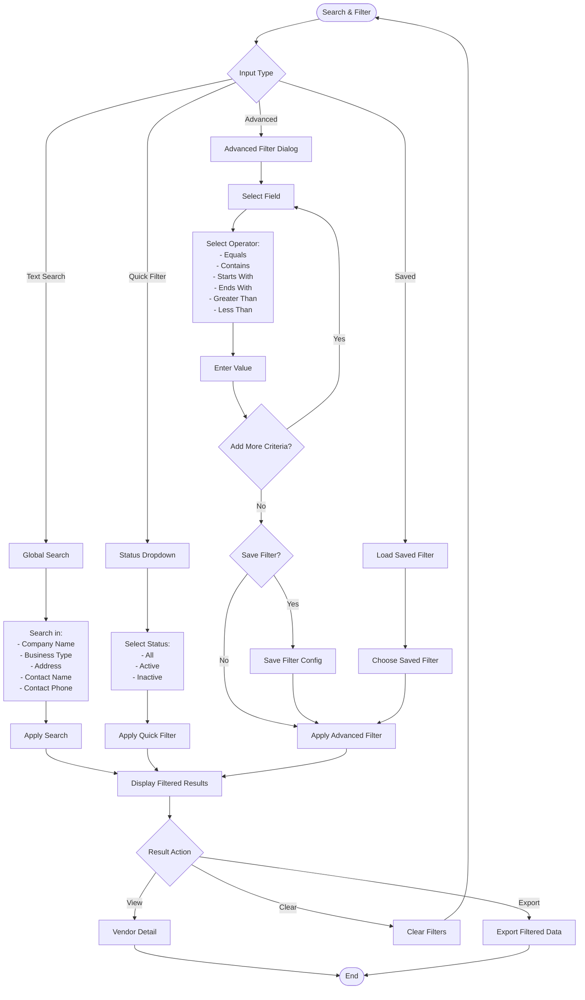
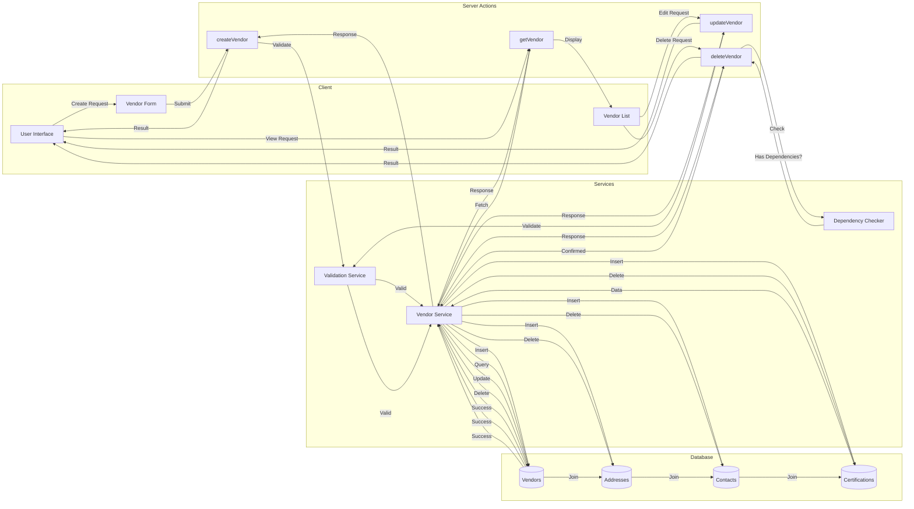
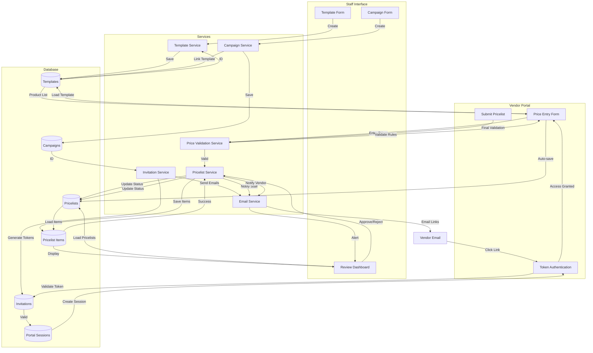
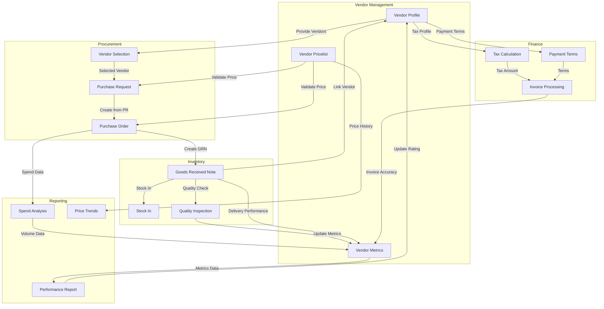
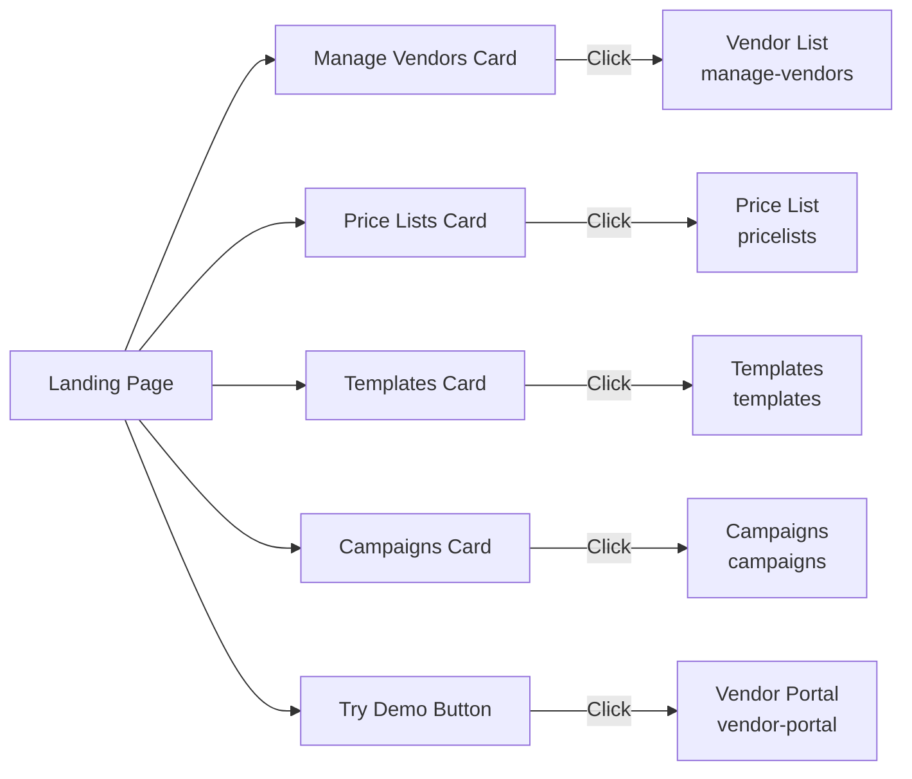
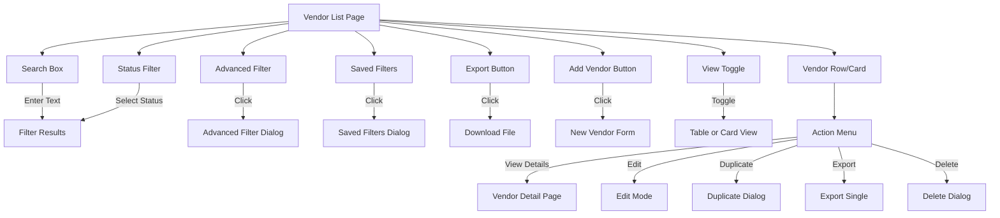
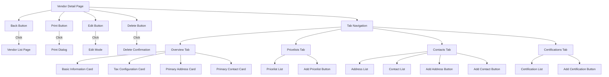

# Vendor Management Module - Sitemap & Navigation

## Navigation Structure

### Module Hierarchy

```mermaid
graph TD
    A[Vendor Management<br>/vendor-management] --> B[Manage Vendors<br>/manage-vendors]
    A --> C[Vendors Alt<br>/vendors]
    A --> D[Templates<br>/templates<br>🚧 Prototype]
    A --> E[Campaigns<br>/campaigns<br>🚧 Prototype]
    A --> F[Pricelists<br>/pricelists<br>🚧 Prototype]
    A --> G[Vendor Portal<br>/vendor-portal/sample<br>🚧 Prototype]

    B --> B1[Vendor List<br>/manage-vendors]
    B --> B2[New Vendor<br>/manage-vendors/new]
    B --> B3["Vendor Detail<br>/manage-vendors/:id"]

    C --> C1[Vendor List<br>/vendors]
    C --> C2[New Vendor<br>/vendors/new]
    C --> C3["Vendor Detail<br>/vendors/:id"]
    C --> C4["Edit Vendor<br>/vendors/:id/edit"]
    C --> C5["Pricelist Settings<br>/vendors/:id/pricelist-settings"]

    D --> D1[Template List<br>/templates]
    D --> D2[New Template<br>/templates/new]
    D --> D3["Template Detail<br>/templates/:id"]
    D --> D4["Edit Template<br>/templates/:id/edit"]

    E --> E1[Campaign List<br>/campaigns]
    E --> E2[New Campaign<br>/campaigns/new]
    E --> E3["Campaign Detail<br>/campaigns/:id"]

    F --> F1[Pricelist List<br>/pricelists]
    F --> F2[New Pricelist<br>/pricelists/new]
    F --> F3[Add Pricelist<br>/pricelists/add]
    F --> F4["Pricelist Detail<br>/pricelists/:id"]
    F --> F5["Edit Pricelist<br>/pricelists/:id/edit"]
    F --> F6["Edit Pricelist New<br>/pricelists/:id/edit-new"]
```



## User Workflows

### 1. Vendor Management Workflow



### 2. Price Management Workflow (Prototype)



### 3. Vendor Search & Filter Workflow



## Data Flow Diagrams

### 1. Vendor CRUD Data Flow



### 2. Price Management Data Flow (Prototype)



### 3. Integration Data Flow



## Page Navigation Map

### Landing Page Actions



### Vendor List Page Actions



### Vendor Detail Page Navigation



## URL Structure

### Main Routes

| Route Pattern | Description | Page File |
|--------------|-------------|-----------|
| `/vendor-management` | Landing page | `page.tsx` |
| `/vendor-management/manage-vendors` | Vendor list | `manage-vendors/page.tsx` |
| `/vendor-management/manage-vendors/new` | New vendor form | `manage-vendors/new/page.tsx` |
| `/vendor-management/manage-vendors/:id` | Vendor detail | `manage-vendors/[id]/page.tsx` |
| `/vendor-management/vendors` | Alt vendor list | `vendors/page.tsx` |
| `/vendor-management/vendors/new` | Alt new vendor | `vendors/new/page.tsx` |
| `/vendor-management/vendors/:id` | Alt vendor detail | `vendors/[id]/page.tsx` |
| `/vendor-management/vendors/:id/edit` | Edit vendor | `vendors/[id]/edit/page.tsx` |
| `/vendor-management/vendors/:id/pricelist-settings` | Pricelist settings | `vendors/[id]/pricelist-settings/page.tsx` |

### Price Management Routes (Prototype)

| Route Pattern | Description | Page File |
|--------------|-------------|-----------|
| `/vendor-management/templates` | Template list | `templates/page.tsx` |
| `/vendor-management/templates/new` | New template | `templates/new/page.tsx` |
| `/vendor-management/templates/:id` | Template detail | `templates/[id]/page.tsx` |
| `/vendor-management/templates/:id/edit` | Edit template | `templates/[id]/edit/page.tsx` |
| `/vendor-management/campaigns` | Campaign list | `campaigns/page.tsx` |
| `/vendor-management/campaigns/new` | New campaign | `campaigns/new/page.tsx` |
| `/vendor-management/campaigns/:id` | Campaign detail | `campaigns/[id]/page.tsx` |
| `/vendor-management/pricelists` | Pricelist list | `pricelists/page.tsx` |
| `/vendor-management/pricelists/new` | New pricelist | `pricelists/new/page.tsx` |
| `/vendor-management/pricelists/add` | Add pricelist | `pricelists/add/page.tsx` |
| `/vendor-management/pricelists/:id` | Pricelist detail | `pricelists/[id]/page.tsx` |
| `/vendor-management/pricelists/:id/edit` | Edit pricelist | `pricelists/[id]/edit/page.tsx` |
| `/vendor-management/pricelists/:id/edit-new` | New edit UI | `pricelists/[id]/edit-new/page.tsx` |
| `/vendor-management/vendor-portal/sample` | Vendor portal demo | `vendor-portal/sample/page.tsx` |

## Query Parameters

### List Page Parameters

| Parameter | Type | Description | Example |
|-----------|------|-------------|---------|
| `search` | string | Global search query | `?search=acme` |
| `status` | string | Filter by status | `?status=active` |
| `view` | string | View mode | `?view=card` |
| `page` | number | Pagination page | `?page=2` |
| `limit` | number | Items per page | `?limit=50` |

### Detail Page Parameters

| Parameter | Type | Description | Example |
|-----------|------|-------------|---------|
| `edit` | boolean | Enable edit mode | `?edit=1` |
| `tab` | string | Active tab | `?tab=pricelists` |

### Filter Parameters

Advanced filters are encoded as URL parameters:

```
?filter[0][field]=companyName
&filter[0][operator]=contains
&filter[0][value]=tech
&filter[1][field]=status
&filter[1][operator]=equals
&filter[1][value]=active
```

## Breadcrumb Navigation

### Vendor Management Pages

```
Home > Vendor Management
Home > Vendor Management > Manage Vendors
Home > Vendor Management > Manage Vendors > New Vendor
Home > Vendor Management > Manage Vendors > {Vendor Name}
Home > Vendor Management > Manage Vendors > {Vendor Name} > Edit
Home > Vendor Management > Templates
Home > Vendor Management > Templates > New Template
Home > Vendor Management > Templates > {Template Name}
Home > Vendor Management > Campaigns
Home > Vendor Management > Campaigns > New Campaign
Home > Vendor Management > Campaigns > {Campaign Name}
Home > Vendor Management > Pricelists
Home > Vendor Management > Pricelists > {Pricelist Number}
```

---

**Last Updated**: 2025-10-02
**Version**: 1.0.0
