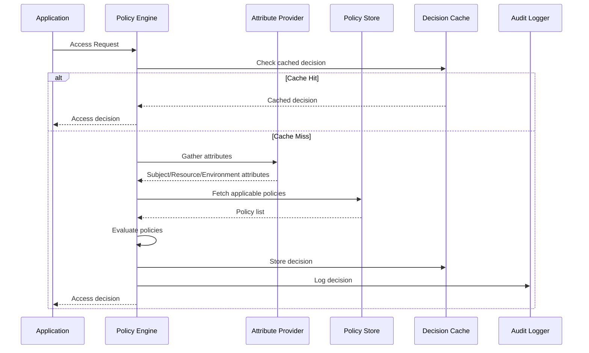

# Policy Engine Implementation Guide

## Table of Contents

1. [Overview](#overview)
2. [Architecture](#architecture)
3. [Core Components](#core-components)
4. [Implementation Guide](#implementation-guide)
5. [Usage Examples](#usage-examples)
6. [Testing Strategies](#testing-strategies)
7. [Performance Optimization](#performance-optimization)
8. [Debugging and Troubleshooting](#debugging-and-troubleshooting)
9. [Best Practices](#best-practices)
10. [API Reference](#api-reference)

---

## Overview

The Carmen ERP Policy Engine implements Attribute-Based Access Control (ABAC) to provide fine-grained, context-aware permission management. This guide covers everything developers need to know to implement, extend, and maintain the policy engine.

### Key Features

- **Attribute-Based Decisions**: Permissions based on Subject, Resource, Environment, and Action attributes
- **Priority-Based Evaluation**: Policies evaluated in priority order (0-1000, higher first)
- **Combining Algorithms**: Multiple strategies for resolving policy conflicts
- **Expression Language**: Flexible rule definitions using 13 operators
- **Caching Support**: Configurable caching for performance optimization
- **Audit Logging**: Comprehensive decision tracking and compliance support

### System Requirements

- Node.js 20.14.0+
- TypeScript 5.8.2+
- Next.js 14+ (for web integration)
- Zod for validation
- Date-fns for temporal operations

---

## Architecture

### High-Level Architecture

```
┌─────────────────────────────────────────────────────────────┐
│                    Carmen ERP Application                   │
├─────────────────────────────────────────────────────────────┤
│  Access Request  │  Policy Management  │  User Interface   │
├──────────────────┼─────────────────────┼───────────────────┤
│                    Policy Engine Core                      │
│  ┌─────────────┐  ┌──────────────────┐  ┌─────────────────┐ │
│  │ Attribute   │  │ Policy Evaluator │  │ Decision Cache  │ │
│  │ Provider    │  │                  │  │                 │ │
│  └─────────────┘  └──────────────────┘  └─────────────────┘ │
├─────────────────────────────────────────────────────────────┤
│                    Data Layer                               │
│  ┌─────────────┐  ┌──────────────────┐  ┌─────────────────┐ │
│  │ Policies    │  │ Roles & Users    │  │ Audit Logs     │ │
│  │ Store       │  │ Store            │  │ Store          │ │
│  └─────────────┘  └──────────────────┘  └─────────────────┘ │
└─────────────────────────────────────────────────────────────┘
```

### Data Flow



---

## Core Components

### 1. Policy Engine (`/lib/services/permissions/policy-engine.ts`)

The main orchestrator that coordinates policy evaluation.

```typescript
export class PolicyEngine {
  private config: PermissionSystemConfig;
  private attributeProvider: AttributeProvider;
  private policyStore: PolicyStore;
  private decisionCache: DecisionCache;
  private auditLogger: AuditLogger;

  async evaluateAccess(request: AccessRequest): Promise<AccessDecision> {
    // Implementation details below
  }
}
```

### 2. Attribute Provider

Responsible for gathering contextual attributes for policy evaluation.

```typescript
interface AttributeProvider {
  getSubjectAttributes(userId: string): Promise<SubjectAttributes>;
  getResourceAttributes(resourceId: string): Promise<ResourceAttributes>;
  getEnvironmentAttributes(context: RequestContext): Promise<EnvironmentAttributes>;
}
```

### 3. Policy Store

Manages policy persistence and retrieval.

```typescript
interface PolicyStore {
  findApplicablePolicies(
    subject: SubjectAttributes,
    resource: ResourceAttributes,
    action: string
  ): Promise<Policy[]>;
  
  getPolicy(policyId: string): Promise<Policy | null>;
  createPolicy(policy: Policy): Promise<Policy>;
  updatePolicy(policyId: string, updates: Partial<Policy>): Promise<Policy>;
  deletePolicy(policyId: string): Promise<boolean>;
}
```

---

## Implementation Guide

### Step 1: Initialize the Policy Engine

```typescript
import { PolicyEngine } from '@/lib/services/permissions/policy-engine';
import { AttributeProvider } from '@/lib/services/permissions/attribute-provider';
import { PolicyStore } from '@/lib/services/permissions/policy-store';

// Initialize dependencies
const attributeProvider = new AttributeProvider();
const policyStore = new PolicyStore();

// Configure the engine
const config: PermissionSystemConfig = {
  defaultCombiningAlgorithm: CombiningAlgorithm.DENY_OVERRIDES,
  cacheEnabled: true,
  cacheTTL: 300, // 5 minutes
  auditEnabled: true,
  auditLevel: 'decisions',
  evaluationTimeout: 5000,
  maxPolicyEvaluation: 100,
  requireSecureConnection: true,
  allowAnonymousAccess: false,
  subscriptionRequired: true,
  defaultSubscriptionLevel: 'basic'
};

// Create engine instance
const policyEngine = new PolicyEngine(config, attributeProvider, policyStore);
```

### Step 2: Create Policy Definitions

```typescript
import { Policy, Rule, Expression, EffectType } from '@/lib/types/permissions';

// Example: Department Manager can approve purchase requests under $5000
const departmentManagerPurchasePolicy: Policy = {
  id: 'dept-mgr-purchase-approval',
  name: 'Department Manager Purchase Approval',
  description: 'Department managers can approve purchase requests under $5000',
  priority: 700,
  enabled: true,
  effect: EffectType.PERMIT,
  
  target: {
    subjects: [
      {
        attribute: 'role.name',
        operator: Operator.EQUALS,
        value: 'department-manager'
      }
    ],
    resources: [
      {
        attribute: 'resourceType',
        operator: Operator.EQUALS,
        value: 'purchase_request'
      }
    ],
    actions: ['approve'],
    environment: [
      {
        attribute: 'isBusinessHours',
        operator: Operator.EQUALS,
        value: true
      }
    ]
  },
  
  rules: [
    {
      id: 'amount-limit-rule',
      description: 'Limit approval to requests under $5000',
      condition: {
        type: 'composite',
        logicalOperator: LogicalOperator.AND,
        expressions: [
          {
            type: 'simple',
            attribute: 'totalValue.amount',
            operator: Operator.LESS_THAN,
            value: 5000
          },
          {
            type: 'simple',
            attribute: 'totalValue.currency',
            operator: Operator.EQUALS,
            value: 'USD'
          },
          {
            type: 'simple',
            attribute: 'documentStatus.stage',
            operator: Operator.EQUALS,
            value: 'pending_approval'
          }
        ]
      }
    }
  ],
  
  obligations: [
    {
      id: 'audit-approval',
      type: 'audit',
      attributes: {
        action: 'purchase_request_approved',
        level: 'financial'
      },
      description: 'Log all purchase request approvals for financial audit'
    }
  ],
  
  version: '1.0.0',
  createdBy: 'system',
  createdAt: new Date(),
  category: 'procurement',
  tags: ['approval', 'purchase', 'financial']
};
```

### Step 3: Implement Access Control in Your Application

```typescript
// In a Next.js API route or server action
import { PolicyEngine } from '@/lib/services/permissions/policy-engine';
import { getCurrentUser } from '@/lib/auth';

export async function approvePurchaseRequest(
  purchaseRequestId: string
): Promise<{ success: boolean; message: string }> {
  try {
    // Get current user context
    const currentUser = await getCurrentUser();
    if (!currentUser) {
      return { success: false, message: 'Authentication required' };
    }

    // Create access request
    const accessRequest: AccessRequest = {
      userId: currentUser.id,
      resourceId: purchaseRequestId,
      action: 'approve',
      resourceType: 'purchase_request',
      source: 'web_app',
      requestId: generateRequestId(),
      timestamp: new Date()
    };

    // Evaluate access
    const decision = await policyEngine.evaluateAccess(accessRequest);

    if (decision.effect === EffectType.PERMIT) {
      // Process the approval
      await processPurchaseRequestApproval(purchaseRequestId);
      
      // Handle obligations
      for (const obligation of decision.obligations) {
        await processObligation(obligation, accessRequest);
      }

      return { success: true, message: 'Purchase request approved successfully' };
    } else {
      return { 
        success: false, 
        message: `Access denied: ${decision.reason}` 
      };
    }

  } catch (error) {
    console.error('Error in purchase request approval:', error);
    return { success: false, message: 'An error occurred during approval' };
  }
}
```

### Step 4: Create Custom Attribute Providers

```typescript
export class CarmenAttributeProvider implements AttributeProvider {
  
  async getSubjectAttributes(userId: string): Promise<SubjectAttributes> {
    // Fetch user data from your database
    const user = await getUserById(userId);
    const userRoles = await getUserRoles(userId);
    const userDepartments = await getUserDepartments(userId);
    
    return {
      // Identity
      userId: user.id,
      username: user.username,
      email: user.email,
      
      // Organizational Structure
      role: userRoles[0], // Primary role
      roles: userRoles,
      department: userDepartments[0], // Primary department
      departments: userDepartments,
      location: await getUserLocation(userId),
      locations: await getUserLocations(userId),
      
      // Employment Details
      employeeType: user.employeeType,
      seniority: calculateSeniority(user.hireDate),
      clearanceLevel: user.clearanceLevel,
      
      // Permissions & Capabilities
      assignedWorkflowStages: await getAssignedWorkflowStages(userId),
      delegatedAuthorities: await getDelegatedAuthorities(userId),
      specialPermissions: await getSpecialPermissions(userId),
      
      // Status & Availability
      accountStatus: user.status,
      onDuty: await isUserOnDuty(userId),
      shiftTiming: await getCurrentShiftTiming(userId),
      
      // Financial & Approval Limits
      approvalLimit: user.approvalLimit,
      budgetAccess: await getUserBudgetAccess(userId),
      
      // Session Context
      currentSession: await getCurrentSession(userId)
    };
  }

  async getResourceAttributes(resourceId: string): Promise<ResourceAttributes> {
    // Implement resource attribute gathering
    // This will vary based on your resource types
    const resource = await getResourceById(resourceId);
    
    return {
      resourceId: resource.id,
      resourceType: resource.type,
      resourceName: resource.name,
      
      // Ownership & Classification
      owner: resource.ownerId,
      ownerDepartment: resource.department,
      ownerLocation: resource.location,
      dataClassification: resource.classification,
      
      // Business Context
      documentStatus: resource.status,
      workflowStage: resource.currentStage,
      approvalLevel: resource.approvalLevel,
      priority: resource.priority,
      
      // Financial Context
      totalValue: resource.totalValue,
      budgetCategory: resource.budgetCategory,
      costCenter: resource.costCenter,
      
      // Temporal Context
      createdAt: resource.createdAt,
      updatedAt: resource.updatedAt,
      expiresAt: resource.expiresAt,
      effectiveDate: resource.effectiveDate,
      
      // Compliance & Audit
      requiresAudit: resource.requiresAudit,
      regulatoryFlags: resource.regulatoryFlags,
      retentionPeriod: resource.retentionPeriod,
      complianceRequirements: resource.complianceRequirements,
      
      // Relationships
      parentResource: resource.parentId,
      relatedResources: resource.relatedIds,
      dependencies: resource.dependencyIds,
      
      // Location Context
      physicalLocation: resource.physicalLocation,
      accessLocation: resource.accessLocation,
      
      // Custom attributes specific to your domain
      customAttributes: resource.customData
    };
  }

  async getEnvironmentAttributes(context: RequestContext): Promise<EnvironmentAttributes> {
    const now = new Date();
    
    return {
      // Temporal Context
      currentTime: now,
      dayOfWeek: now.toLocaleDateString('en-US', { weekday: 'long' }),
      isBusinessHours: await isBusinessHours(now),
      isHoliday: await isHoliday(now),
      timeZone: Intl.DateTimeFormat().resolvedOptions().timeZone,
      
      // Location Context
      requestIP: context.ip,
      requestLocation: await getLocationFromIP(context.ip),
      isInternalNetwork: await isInternalIP(context.ip),
      facility: await getFacilityFromIP(context.ip),
      country: await getCountryFromIP(context.ip),
      region: await getRegionFromIP(context.ip),
      
      // Device & Session Context
      deviceType: detectDeviceType(context.userAgent),
      deviceId: context.deviceId,
      userAgent: context.userAgent,
      sessionId: context.sessionId,
      authenticationMethod: context.authMethod,
      sessionAge: calculateSessionAge(context.sessionStart),
      
      // System State
      systemLoad: await getSystemLoad(),
      maintenanceMode: await isMaintenanceMode(),
      emergencyMode: await isEmergencyMode(),
      systemVersion: process.env.APP_VERSION || '1.0.0',
      
      // Risk & Compliance Context
      threatLevel: await getCurrentThreatLevel(),
      complianceMode: await getActiveComplianceModes(),
      auditMode: await isAuditMode(),
      
      // Request Context
      requestMethod: context.method,
      requestSource: detectRequestSource(context),
      batchOperation: context.isBatch || false,
      
      // Custom environment attributes
      customEnvironment: context.customAttributes || {}
    };
  }
}
```

---

## Usage Examples

### Example 1: Simple Permission Check

```typescript
// Check if a user can view a purchase request
async function canViewPurchaseRequest(userId: string, purchaseRequestId: string): Promise<boolean> {
  const request: AccessRequest = {
    userId,
    resourceId: purchaseRequestId,
    action: 'read',
    resourceType: 'purchase_request'
  };

  const decision = await policyEngine.evaluateAccess(request);
  return decision.effect === EffectType.PERMIT;
}
```

### Example 2: Batch Permission Checking

```typescript
// Check permissions for multiple resources at once
async function checkBulkPermissions(
  userId: string,
  resourceIds: string[],
  action: string
): Promise<Record<string, boolean>> {
  const results: Record<string, boolean> = {};

  // Create batch request
  const batchRequest: AccessRequest = {
    userId,
    resourceId: 'batch',
    action,
    batchRequest: true,
    batchItems: resourceIds.map(resourceId => ({
      userId,
      resourceId,
      action,
      resourceType: 'purchase_request'
    }))
  };

  try {
    const decision = await policyEngine.evaluateAccess(batchRequest);
    
    // Process batch results
    if (decision.evaluatedPolicies) {
      resourceIds.forEach((resourceId, index) => {
        // Implementation depends on how batch results are structured
        results[resourceId] = decision.effect === EffectType.PERMIT;
      });
    }

    return results;
  } catch (error) {
    console.error('Batch permission check failed:', error);
    // Return safe defaults
    return resourceIds.reduce((acc, resourceId) => {
      acc[resourceId] = false;
      return acc;
    }, {} as Record<string, boolean>);
  }
}
```

### Example 3: Context-Aware Permissions

```typescript
// Permission that considers time and location
async function canApproveOutsideHours(
  userId: string,
  purchaseRequestId: string,
  emergencyReason?: string
): Promise<{ allowed: boolean; obligations: Obligation[] }> {
  const request: AccessRequest = {
    userId,
    resourceId: purchaseRequestId,
    action: 'approve',
    resourceType: 'purchase_request',
    additionalAttributes: {
      emergencyApproval: !!emergencyReason,
      emergencyReason: emergencyReason
    }
  };

  const decision = await policyEngine.evaluateAccess(request);
  
  return {
    allowed: decision.effect === EffectType.PERMIT,
    obligations: decision.obligations
  };
}
```

### Example 4: Dynamic Policy Creation

```typescript
// Create a temporary policy for special circumstances
async function createTemporaryApprovalPolicy(
  userId: string,
  resourceType: string,
  expiresAt: Date,
  reason: string
): Promise<Policy> {
  const tempPolicy: Policy = {
    id: `temp-${userId}-${Date.now()}`,
    name: `Temporary Approval - ${reason}`,
    description: `Temporary approval policy for ${userId}`,
    priority: 900, // High priority
    enabled: true,
    effect: EffectType.PERMIT,
    
    target: {
      subjects: [
        {
          attribute: 'userId',
          operator: Operator.EQUALS,
          value: userId
        }
      ],
      resources: [
        {
          attribute: 'resourceType',
          operator: Operator.EQUALS,
          value: resourceType
        }
      ],
      actions: ['approve'],
      environment: [
        {
          attribute: 'currentTime',
          operator: Operator.LESS_THAN,
          value: expiresAt.toISOString()
        }
      ]
    },
    
    rules: [],
    obligations: [
      {
        id: 'temp-policy-audit',
        type: 'audit',
        attributes: {
          temporaryPolicy: true,
          reason: reason,
          grantedBy: 'system-admin'
        }
      }
    ],
    
    version: '1.0.0',
    createdBy: 'system',
    createdAt: new Date(),
    effectiveTo: expiresAt,
    category: 'temporary',
    tags: ['temporary', 'emergency']
  };

  // Store the policy
  await policyStore.createPolicy(tempPolicy);
  
  return tempPolicy;
}
```

---

## Testing Strategies

### Unit Testing

```typescript
import { describe, it, expect, beforeEach } from 'vitest';
import { PolicyEngine } from '@/lib/services/permissions/policy-engine';

describe('PolicyEngine', () => {
  let policyEngine: PolicyEngine;
  let mockAttributeProvider: jest.Mocked<AttributeProvider>;
  let mockPolicyStore: jest.Mocked<PolicyStore>;

  beforeEach(() => {
    mockAttributeProvider = createMockAttributeProvider();
    mockPolicyStore = createMockPolicyStore();
    
    const config: PermissionSystemConfig = {
      defaultCombiningAlgorithm: CombiningAlgorithm.DENY_OVERRIDES,
      cacheEnabled: false, // Disable cache for testing
      auditEnabled: false,
      evaluationTimeout: 1000,
      maxPolicyEvaluation: 10
    };

    policyEngine = new PolicyEngine(config, mockAttributeProvider, mockPolicyStore);
  });

  describe('evaluateAccess', () => {
    it('should permit access when policy allows', async () => {
      // Arrange
      const request: AccessRequest = {
        userId: 'user-1',
        resourceId: 'resource-1',
        action: 'read'
      };

      mockAttributeProvider.getSubjectAttributes.mockResolvedValue({
        userId: 'user-1',
        role: { name: 'staff' },
        // ... other attributes
      });

      mockPolicyStore.findApplicablePolicies.mockResolvedValue([
        createPermitPolicy()
      ]);

      // Act
      const decision = await policyEngine.evaluateAccess(request);

      // Assert
      expect(decision.effect).toBe(EffectType.PERMIT);
      expect(decision.reason).toContain('Policy allows access');
    });

    it('should deny access when no applicable policies', async () => {
      // Test implementation
    });

    it('should handle policy conflicts correctly', async () => {
      // Test combining algorithms
    });
  });
});
```

### Integration Testing

```typescript
describe('Policy Engine Integration', () => {
  it('should enforce purchase request approval limits', async () => {
    // Create test user with department manager role
    const testUser = await createTestUser({
      role: 'department-manager',
      approvalLimit: { amount: 5000, currency: 'USD' }
    });

    // Create test purchase request
    const purchaseRequest = await createTestPurchaseRequest({
      totalValue: { amount: 3000, currency: 'USD' },
      status: 'pending_approval'
    });

    // Test approval
    const decision = await policyEngine.evaluateAccess({
      userId: testUser.id,
      resourceId: purchaseRequest.id,
      action: 'approve'
    });

    expect(decision.effect).toBe(EffectType.PERMIT);

    // Test with amount over limit
    const expensiveRequest = await createTestPurchaseRequest({
      totalValue: { amount: 8000, currency: 'USD' }
    });

    const deniedDecision = await policyEngine.evaluateAccess({
      userId: testUser.id,
      resourceId: expensiveRequest.id,
      action: 'approve'
    });

    expect(deniedDecision.effect).toBe(EffectType.DENY);
  });
});
```

### Policy Testing Framework

```typescript
export class PolicyTestFramework {
  constructor(private policyEngine: PolicyEngine) {}

  async testPolicy(
    policy: Policy,
    scenarios: PolicyTestScenario[]
  ): Promise<PolicyTestResult[]> {
    const results: PolicyTestResult[] = [];

    for (const scenario of scenarios) {
      try {
        // Create evaluation context from scenario
        const context: EvaluationContext = {
          subject: scenario.subjectAttributes,
          resource: scenario.resourceAttributes,
          environment: scenario.environmentAttributes,
          action: scenario.action,
          requestId: generateTestRequestId(),
          timestamp: new Date(),
          source: 'test'
        };

        // Evaluate policy
        const decision = await this.policyEngine.evaluatePolicyAgainstContext(
          policy,
          context
        );

        // Check if result matches expectation
        const passed = decision.effect === scenario.expectedResult;

        results.push({
          scenarioId: scenario.id,
          scenarioName: scenario.name,
          passed,
          actualResult: decision.effect,
          expectedResult: scenario.expectedResult,
          reason: decision.reason,
          executionTime: decision.evaluationTime
        });

      } catch (error) {
        results.push({
          scenarioId: scenario.id,
          scenarioName: scenario.name,
          passed: false,
          actualResult: 'ERROR',
          expectedResult: scenario.expectedResult,
          reason: error.message,
          error: error
        });
      }
    }

    return results;
  }
}

// Usage
const testFramework = new PolicyTestFramework(policyEngine);
const results = await testFramework.testPolicy(departmentManagerPolicy, [
  {
    id: 'scenario-1',
    name: 'Department manager approves small purchase',
    subjectAttributes: { role: 'department-manager', /* ... */ },
    resourceAttributes: { totalValue: { amount: 1000, currency: 'USD' } },
    environmentAttributes: { isBusinessHours: true },
    action: 'approve',
    expectedResult: EffectType.PERMIT
  },
  {
    id: 'scenario-2',
    name: 'Department manager approves large purchase',
    subjectAttributes: { role: 'department-manager' },
    resourceAttributes: { totalValue: { amount: 10000, currency: 'USD' } },
    environmentAttributes: { isBusinessHours: true },
    action: 'approve',
    expectedResult: EffectType.DENY
  }
]);
```

---

## Performance Optimization

### Caching Strategy

```typescript
export class PolicyDecisionCache {
  private cache: Map<string, CachedDecision> = new Map();
  private ttl: number;

  constructor(ttlSeconds: number = 300) {
    this.ttl = ttlSeconds * 1000;
  }

  private generateCacheKey(request: AccessRequest): string {
    // Create deterministic cache key
    const keyParts = [
      request.userId,
      request.resourceId,
      request.action,
      request.resourceType || '',
      // Include relevant environment factors
      Math.floor(Date.now() / (this.ttl / 4)) // Quarter TTL buckets for time-sensitive decisions
    ];

    return keyParts.join(':');
  }

  async get(request: AccessRequest): Promise<AccessDecision | null> {
    const key = this.generateCacheKey(request);
    const cached = this.cache.get(key);

    if (!cached) {
      return null;
    }

    // Check expiration
    if (Date.now() > cached.expiresAt) {
      this.cache.delete(key);
      return null;
    }

    // Update access time for LRU tracking
    cached.lastAccessed = Date.now();
    return cached.decision;
  }

  async set(request: AccessRequest, decision: AccessDecision): Promise<void> {
    const key = this.generateCacheKey(request);
    const cached: CachedDecision = {
      decision,
      createdAt: Date.now(),
      expiresAt: Date.now() + this.ttl,
      lastAccessed: Date.now(),
      accessCount: 1
    };

    this.cache.set(key, cached);

    // Periodic cleanup
    if (this.cache.size > 10000) {
      await this.cleanup();
    }
  }

  private async cleanup(): Promise<void> {
    const now = Date.now();
    const entries = Array.from(this.cache.entries());

    // Remove expired entries
    const validEntries = entries.filter(([_, cached]) => cached.expiresAt > now);

    // If still too many, remove least recently used
    if (validEntries.length > 8000) {
      validEntries.sort(([_, a], [__, b]) => b.lastAccessed - a.lastAccessed);
      validEntries.splice(8000);
    }

    // Rebuild cache
    this.cache.clear();
    validEntries.forEach(([key, cached]) => {
      this.cache.set(key, cached);
    });
  }
}
```

### Policy Optimization

```typescript
export class PolicyOptimizer {
  
  // Pre-compile policies for faster evaluation
  static compilePolicies(policies: Policy[]): CompiledPolicy[] {
    return policies.map(policy => ({
      ...policy,
      compiledRules: policy.rules.map(rule => this.compileRule(rule)),
      fastTargetCheck: this.compileTargetCheck(policy.target)
    }));
  }

  private static compileRule(rule: Rule): CompiledRule {
    return {
      ...rule,
      evaluator: this.compileExpression(rule.condition)
    };
  }

  private static compileExpression(expression: Expression): ExpressionEvaluator {
    // Create optimized evaluation function
    if (expression.type === 'simple') {
      return this.compileSimpleExpression(expression);
    } else {
      return this.compileCompositeExpression(expression);
    }
  }

  // Index policies by common attributes for faster lookup
  static createPolicyIndex(policies: Policy[]): PolicyIndex {
    const index: PolicyIndex = {
      byResourceType: new Map(),
      byAction: new Map(),
      bySubjectRole: new Map(),
      byPriority: policies.sort((a, b) => (b.priority || 500) - (a.priority || 500))
    };

    policies.forEach(policy => {
      // Index by resource types mentioned in target
      policy.target.resources?.forEach(condition => {
        if (condition.attribute === 'resourceType') {
          const resourceType = String(condition.value);
          if (!index.byResourceType.has(resourceType)) {
            index.byResourceType.set(resourceType, []);
          }
          index.byResourceType.get(resourceType)!.push(policy);
        }
      });

      // Index by actions
      policy.target.actions?.forEach(action => {
        if (!index.byAction.has(action)) {
          index.byAction.set(action, []);
        }
        index.byAction.get(action)!.push(policy);
      });

      // Index by subject roles
      policy.target.subjects?.forEach(condition => {
        if (condition.attribute === 'role.name' || condition.attribute === 'role') {
          const role = String(condition.value);
          if (!index.bySubjectRole.has(role)) {
            index.bySubjectRole.set(role, []);
          }
          index.bySubjectRole.get(role)!.push(policy);
        }
      });
    });

    return index;
  }
}
```

---

## Debugging and Troubleshooting

### Debug Mode

```typescript
export class PolicyEngineDebugger {
  private debug: boolean = false;
  private traceLog: DebugEntry[] = [];

  enableDebug(): void {
    this.debug = true;
    this.traceLog = [];
  }

  disableDebug(): void {
    this.debug = false;
  }

  trace(phase: string, data: any): void {
    if (!this.debug) return;

    this.traceLog.push({
      timestamp: Date.now(),
      phase,
      data: JSON.parse(JSON.stringify(data)), // Deep clone
      memory: process.memoryUsage(),
      duration: performance.now()
    });
  }

  getDebugReport(): DebugReport {
    if (!this.debug) {
      throw new Error('Debug mode not enabled');
    }

    return {
      totalEntries: this.traceLog.length,
      totalDuration: this.traceLog[this.traceLog.length - 1]?.duration || 0,
      phases: this.groupByPhase(),
      entries: this.traceLog
    };
  }

  async debugEvaluateAccess(request: AccessRequest): Promise<{
    decision: AccessDecision;
    debug: DebugReport;
  }> {
    this.enableDebug();
    
    try {
      this.trace('request_received', { request });
      
      const decision = await this.policyEngine.evaluateAccess(request);
      
      this.trace('decision_made', { decision });
      
      return {
        decision,
        debug: this.getDebugReport()
      };
    } finally {
      this.disableDebug();
    }
  }
}

// Usage
const debugger = new PolicyEngineDebugger(policyEngine);
const { decision, debug } = await debugger.debugEvaluateAccess(request);

console.log('Decision:', decision);
console.log('Debug info:');
debug.phases.forEach(phase => {
  console.log(`  ${phase.name}: ${phase.duration}ms (${phase.entries} entries)`);
});
```

### Common Issues and Solutions

#### Issue 1: Policies Not Applying

**Symptoms:**
- Expected PERMIT but got DENY
- Policy seems correct but doesn't match

**Debugging Steps:**
```typescript
// Check if policy target matches
const context = await gatherEvaluationContext(request);
const targetMatches = await evaluatePolicyTarget(policy, context);
console.log('Target matches:', targetMatches);

// Check individual target conditions
policy.target.subjects?.forEach((condition, index) => {
  const result = evaluateCondition(condition, context.subject);
  console.log(`Subject condition ${index}:`, condition, 'Result:', result);
});
```

**Common Causes:**
- Attribute names don't match exactly (case sensitivity)
- Wrong operator usage (e.g., `EQUALS` vs `CONTAINS`)
- Missing or incorrect attribute values
- Policy disabled or expired

#### Issue 2: Performance Problems

**Symptoms:**
- Slow response times
- High memory usage
- Timeout errors

**Solutions:**
```typescript
// Add performance monitoring
const startTime = performance.now();
const decision = await policyEngine.evaluateAccess(request);
const endTime = performance.now();

if (endTime - startTime > 1000) {
  console.warn('Slow policy evaluation:', {
    duration: endTime - startTime,
    request,
    policiesEvaluated: decision.evaluatedPolicies?.length
  });
}

// Optimize with indexing
const policyIndex = PolicyOptimizer.createPolicyIndex(allPolicies);
const applicablePolicies = policyIndex.findApplicable(request);
```

#### Issue 3: Cache Issues

**Symptoms:**
- Stale decisions
- Permissions not updating immediately
- Inconsistent behavior

**Debugging:**
```typescript
// Check cache status
const cacheKey = cache.generateCacheKey(request);
const cached = await cache.get(request);

console.log('Cache status:', {
  key: cacheKey,
  hit: !!cached,
  age: cached ? Date.now() - cached.createdAt : null
});

// Force cache refresh
await cache.invalidate(request);
const freshDecision = await policyEngine.evaluateAccess(request);
```

---

## Best Practices

### 1. Policy Design Principles

**Keep Policies Simple and Focused**
```typescript
// ❌ Bad: Complex policy doing multiple things
const complexPolicy = {
  // Multiple unrelated conditions and effects
};

// ✅ Good: Simple, focused policy
const simplePolicy = {
  name: 'Department Manager Purchase Approval Under 5K',
  // Single, clear purpose with well-defined conditions
};
```

**Use Descriptive Names and Documentation**
```typescript
const policy: Policy = {
  name: 'Department Manager Purchase Approval - Standard Limit',
  description: 'Allows department managers to approve purchase requests under $5000 during business hours. Requires audit logging for financial compliance.',
  // Clear explanation of what, who, when, and why
};
```

**Implement Proper Priority Management**
```typescript
// Priority ranges by policy type
const PRIORITY_RANGES = {
  EMERGENCY_OVERRIDE: 950-999,   // Emergency policies
  DENY_POLICIES: 800-949,        // Security denials
  SPECIFIC_PERMITS: 600-799,     // Specific role permissions  
  GENERAL_PERMITS: 400-599,      // General permissions
  DEFAULT_POLICIES: 200-399,     // Default behaviors
  FALLBACK: 0-199               // Fallback policies
};
```

### 2. Performance Best Practices

**Optimize Attribute Gathering**
```typescript
// ❌ Bad: Gather all attributes always
async getSubjectAttributes(userId: string): Promise<SubjectAttributes> {
  // Expensive operations even when not needed
  const everything = await gatherAllPossibleAttributes(userId);
  return everything;
}

// ✅ Good: Lazy loading based on policy requirements
async getSubjectAttributes(
  userId: string, 
  requiredAttributes?: string[]
): Promise<SubjectAttributes> {
  const base = await getBaseAttributes(userId);
  
  if (requiredAttributes?.includes('approvalLimit')) {
    base.approvalLimit = await getApprovalLimit(userId);
  }
  
  if (requiredAttributes?.includes('shiftTiming')) {
    base.shiftTiming = await getCurrentShiftTiming(userId);
  }
  
  return base;
}
```

**Use Efficient Policy Storage**
```typescript
// Store frequently used policies in memory
class OptimizedPolicyStore {
  private hotPolicies = new Map<string, Policy>();
  private policyIndex = new Map<string, string[]>();

  async findApplicablePolicies(
    subject: SubjectAttributes,
    resource: ResourceAttributes,
    action: string
  ): Promise<Policy[]> {
    // Fast path: check indexed policies first
    const candidateIds = this.findCandidatePolicies(resource.resourceType, action);
    const candidates = candidateIds.map(id => this.hotPolicies.get(id)).filter(Boolean);
    
    if (candidates.length > 0) {
      return this.filterApplicable(candidates, subject, resource, action);
    }
    
    // Slow path: database query
    return await this.queryDatabase(subject, resource, action);
  }
}
```

### 3. Security Best Practices

**Implement Secure Defaults**
```typescript
const secureConfig: PermissionSystemConfig = {
  defaultCombiningAlgorithm: CombiningAlgorithm.DENY_OVERRIDES, // Secure default
  requireSecureConnection: true,
  allowAnonymousAccess: false,
  auditEnabled: true,
  auditLevel: 'all',
  evaluationTimeout: 5000, // Prevent DoS
  maxPolicyEvaluation: 100  // Limit complexity
};
```

**Validate All Inputs**
```typescript
import { z } from 'zod';

const accessRequestSchema = z.object({
  userId: z.string().min(1).max(100),
  resourceId: z.string().min(1).max(100),
  action: z.string().min(1).max(50),
  resourceType: z.string().optional(),
  source: z.string().optional(),
  additionalAttributes: z.record(z.any()).optional()
});

export async function evaluateAccess(
  request: unknown
): Promise<AccessDecision> {
  // Validate input
  const validRequest = accessRequestSchema.parse(request);
  
  // Sanitize strings
  const sanitizedRequest = sanitizeAccessRequest(validRequest);
  
  return await policyEngine.evaluateAccess(sanitizedRequest);
}
```

**Log Security Events**
```typescript
class SecurityAuditLogger {
  async logAccessDecision(
    request: AccessRequest,
    decision: AccessDecision,
    context: EvaluationContext
  ): Promise<void> {
    const auditEvent = {
      timestamp: new Date(),
      eventType: 'ACCESS_DECISION',
      userId: request.userId,
      resourceId: request.resourceId,
      action: request.action,
      decision: decision.effect,
      reason: decision.reason,
      sourceIP: context.environment.requestIP,
      userAgent: context.environment.userAgent,
      sessionId: context.environment.sessionId,
      policies: decision.evaluatedPolicies.map(p => p.policyId),
      riskScore: this.calculateRiskScore(request, decision, context)
    };

    await this.writeAuditLog(auditEvent);
    
    // Alert on high-risk events
    if (auditEvent.riskScore > 0.8) {
      await this.sendSecurityAlert(auditEvent);
    }
  }
}
```

### 4. Testing Best Practices

**Use Test Data Builders**
```typescript
export class PolicyTestBuilder {
  private policy: Partial<Policy> = {
    priority: 500,
    enabled: true,
    effect: EffectType.PERMIT
  };

  static create(): PolicyTestBuilder {
    return new PolicyTestBuilder();
  }

  withName(name: string): PolicyTestBuilder {
    this.policy.name = name;
    return this;
  }

  withPriority(priority: number): PolicyTestBuilder {
    this.policy.priority = priority;
    return this;
  }

  forResource(resourceType: string): PolicyTestBuilder {
    this.policy.target = {
      ...this.policy.target,
      resources: [
        {
          attribute: 'resourceType',
          operator: Operator.EQUALS,
          value: resourceType
        }
      ]
    };
    return this;
  }

  forRole(role: string): PolicyTestBuilder {
    this.policy.target = {
      ...this.policy.target,
      subjects: [
        {
          attribute: 'role.name',
          operator: Operator.EQUALS,
          value: role
        }
      ]
    };
    return this;
  }

  build(): Policy {
    return {
      id: `test-${Date.now()}`,
      version: '1.0.0',
      createdBy: 'test',
      createdAt: new Date(),
      ...this.policy
    } as Policy;
  }
}

// Usage
const testPolicy = PolicyTestBuilder
  .create()
  .withName('Test Department Manager Policy')
  .withPriority(700)
  .forRole('department-manager')
  .forResource('purchase_request')
  .build();
```

---

## API Reference

### PolicyEngine Class

```typescript
class PolicyEngine {
  constructor(
    config: PermissionSystemConfig,
    attributeProvider: AttributeProvider,
    policyStore: PolicyStore,
    cache?: DecisionCache,
    auditLogger?: AuditLogger
  )

  // Main evaluation method
  async evaluateAccess(request: AccessRequest): Promise<AccessDecision>
  
  // Batch evaluation
  async evaluateBatch(requests: AccessRequest[]): Promise<AccessDecision[]>
  
  // Policy testing
  async testPolicy(policy: Policy, scenarios: PolicyTestScenario[]): Promise<PolicyTestResult[]>
  
  // Cache management
  async clearCache(pattern?: string): Promise<void>
  async getCacheStats(): Promise<CacheStats>
  
  // Configuration
  updateConfig(updates: Partial<PermissionSystemConfig>): void
  getConfig(): PermissionSystemConfig
}
```

### Key Types

```typescript
// Core request type
interface AccessRequest {
  userId: string;
  resourceId: string;
  action: string;
  resourceType?: string;
  additionalAttributes?: Record<string, any>;
  source?: string;
  requestId?: string;
  timestamp?: Date;
  batchRequest?: boolean;
  batchItems?: AccessRequest[];
}

// Decision response
interface AccessDecision {
  effect: EffectType;
  reason: string;
  obligations: Obligation[];
  advice: Advice[];
  requestId: string;
  evaluatedPolicies: PolicyResult[];
  evaluationTime: number;
  cacheHit: boolean;
  timestamp: Date;
  evaluatedBy: string;
  auditRequired: boolean;
  confidenceLevel?: number;
}

// Policy definition
interface Policy {
  id: string;
  name: string;
  description: string;
  priority: number;
  enabled: boolean;
  target: PolicyTarget;
  rules: Rule[];
  effect: EffectType;
  obligations?: Obligation[];
  advice?: Advice[];
  version: string;
  createdBy: string;
  createdAt: Date;
  updatedBy?: string;
  updatedAt?: Date;
  tags?: string[];
  category?: string;
  effectiveFrom?: Date;
  effectiveTo?: Date;
  testScenarios?: PolicyTestScenario[];
  validationRules?: string[];
}
```

---

## Conclusion

This implementation guide provides a comprehensive foundation for working with the Carmen ERP Policy Engine. The ABAC system offers powerful, flexible permission management that can adapt to complex business requirements while maintaining security and performance.

### Next Steps

1. **Start with Simple Policies**: Begin with basic RBAC-style policies and gradually add attribute-based conditions
2. **Implement Comprehensive Testing**: Use the testing framework to validate all policies
3. **Monitor Performance**: Use the debugging and performance monitoring tools in production
4. **Iterate and Improve**: Regularly review policy effectiveness and optimize based on usage patterns

### Additional Resources

- [ABAC Architecture Decision Record](/docs/architecture/adr-003-abac-permission-system.md)
- [Permission Management Todos](/docs/permission-management-todos.md)
- [Type Definitions](/lib/types/permissions.ts)
- [Policy Engine Source](/lib/services/permissions/policy-engine.ts)

For questions or issues, please refer to the project documentation or create an issue in the repository.