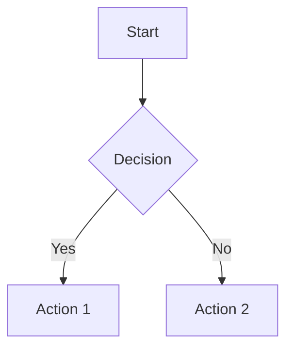
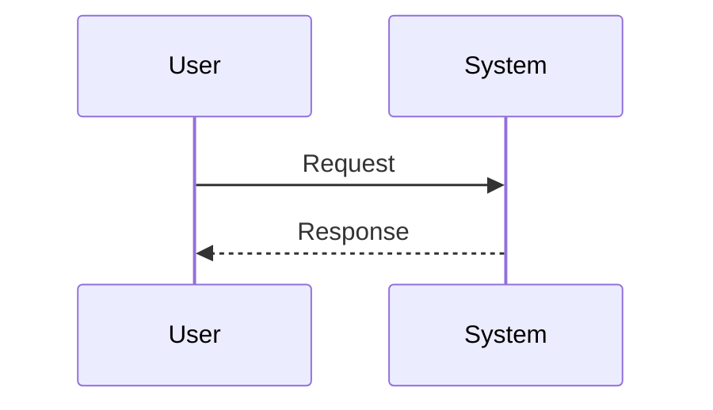
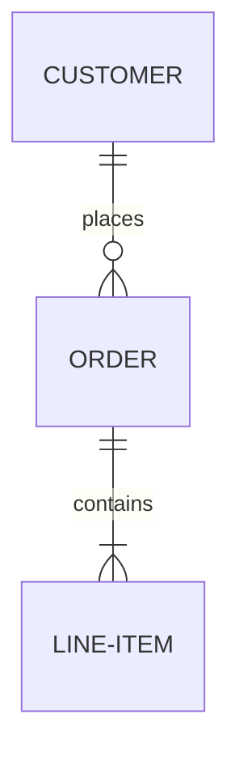
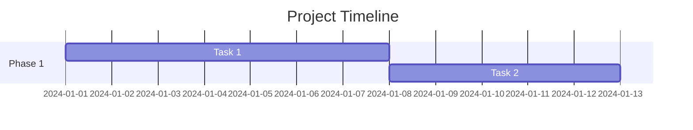
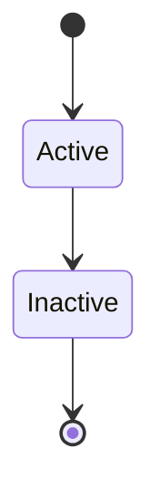
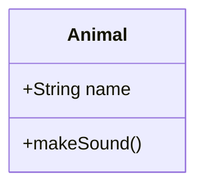
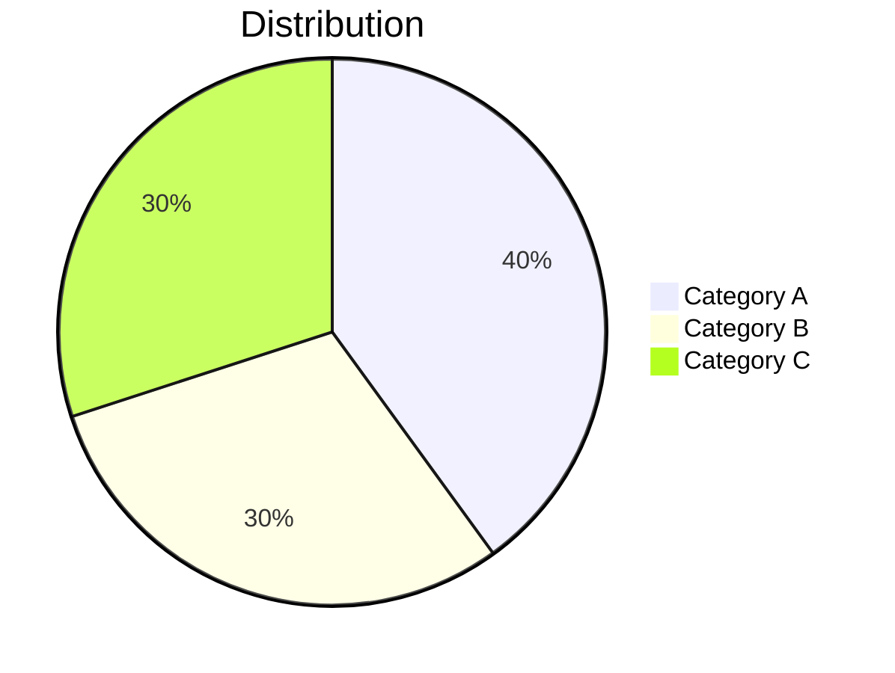
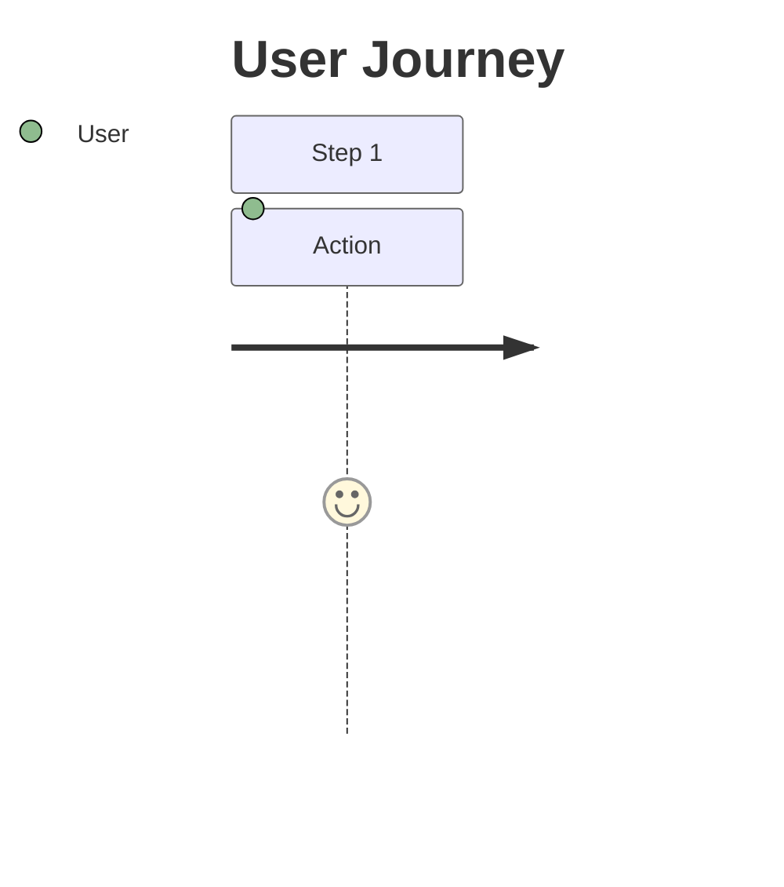

# Mermaid Diagram Support - Implementation Report

**Date:** October 18, 2025
**Status:** ✅ **FULLY IMPLEMENTED** - Mermaid v11 support across all 133 documentation pages

---

## Executive Summary

Enhanced the Carmen ERP documentation system with comprehensive Mermaid diagram support. All 133 documentation pages now include Mermaid v11 with custom theming and automatic rendering.

---

## Implementation Details

### 1. Mermaid Configuration

**Version:** Mermaid v11 (latest)
**CDN:** `https://cdn.jsdelivr.net/npm/mermaid@11/dist/mermaid.esm.min.mjs`

**Enhanced Configuration:**
```javascript
mermaid.initialize({
    startOnLoad: false,
    theme: 'default',
    themeVariables: {
        primaryColor: '#2563eb',
        primaryTextColor: '#0f172a',
        primaryBorderColor: '#1e40af',
        lineColor: '#64748b',
        secondaryColor: '#10b981',
        tertiaryColor: '#f59e0b',
        background: '#ffffff',
        mainBkg: '#f8fafc',
        secondBkg: '#e2e8f0',
        border1: '#cbd5e1',
        border2: '#94a3b8'
    },
    flowchart: {
        useMaxWidth: true,
        htmlLabels: true,
        curve: 'basis'
    },
    sequence: {
        useMaxWidth: true,
        wrap: true
    },
    gantt: {
        useMaxWidth: true
    }
});
```

### 2. Custom Styling

**CSS Enhancements:**
```css
.mermaid {
    background: var(--bg-white);
    padding: 2rem;
    border-radius: 0.5rem;
    margin: 2rem 0;
    display: flex;
    justify-content: center;
    border: 1px solid var(--border);
}

.mermaid svg {
    max-width: 100%;
    height: auto;
}
```

### 3. Automatic Rendering

**JavaScript Processing:**
- Detects code blocks with `language-mermaid` class
- Converts markdown code blocks to Mermaid div elements
- Triggers Mermaid rendering after markdown parsing
- Handles errors gracefully with console logging

```javascript
// Find all mermaid code blocks
const mermaidBlocks = contentDiv.querySelectorAll('pre code.language-mermaid, pre code[class*="mermaid"]');

mermaidBlocks.forEach((block, index) => {
    const mermaidCode = block.textContent;
    const pre = block.parentElement;

    // Create mermaid div
    const mermaidDiv = document.createElement('div');
    mermaidDiv.className = 'mermaid';
    mermaidDiv.textContent = mermaidCode;
    mermaidDiv.id = 'mermaid-diagram-' + index;

    // Replace code block with mermaid div
    pre.replaceWith(mermaidDiv);
});

// Render diagrams
window.mermaid.run({
    querySelector: '.mermaid'
}).catch(err => {
    console.error('Mermaid rendering error:', err);
});
```

---

## Supported Diagram Types

### ✅ Flowcharts


### ✅ Sequence Diagrams


### ✅ Entity Relationship Diagrams (ERD)


### ✅ Gantt Charts


### ✅ State Diagrams


### ✅ Class Diagrams


### ✅ Pie Charts


### ✅ User Journey Diagrams


---

## File Updates

### Modified Files

**`/docs/convert-md-to-html-v2.js`**
- Updated Mermaid from v10 to v11
- Added custom theme configuration
- Enhanced CSS styling for diagrams
- Implemented automatic code block detection and conversion
- Added responsive SVG sizing
- Improved error handling

### Converted Files

**Total:** 133 .md files → .html with Mermaid support

**Modules Updated:**
- ✅ System Administration (10 files)
- ✅ Finance (5 files)
- ✅ Inventory Management (8 files)
- ✅ Procurement (30 files)
- ✅ Vendor Management (15 files)
- ✅ Product Management (3 files)
- ✅ Operational Planning (7 files)
- ✅ Store Operations (12 files)
- ✅ Reporting & Analytics (3 files)
- ✅ Dashboard (6 files)
- ✅ Production (2 files)
- ✅ Documentation Files (32 files)

---

## Test Page

**Location:** `/docs/documents/MERMAID-TEST.html`
**URL:** http://localhost:8080/MERMAID-TEST.html

**Demonstrates:**
1. Flowchart diagrams
2. Sequence diagrams
3. Entity relationship diagrams
4. Gantt charts
5. State diagrams
6. Class diagrams
7. Pie charts
8. User journey diagrams

---

## Usage Guide

### Creating Mermaid Diagrams in Markdown

**Step 1:** Add a code block with `mermaid` language identifier:

\`\`\`mermaid
graph TD
    A[Start] --> B[End]
\`\`\`

**Step 2:** The diagram will automatically render when viewing the HTML page

**Step 3:** Diagrams are responsive and adapt to screen size

---

## Theme Integration

### Color Palette

**Primary Colors:**
- Primary: `#2563eb` (blue)
- Success: `#10b981` (green)
- Warning: `#f59e0b` (amber)

**Background:**
- Main: `#f8fafc` (light gray)
- Secondary: `#e2e8f0` (medium gray)
- White: `#ffffff`

**Borders:**
- Primary: `#1e40af` (dark blue)
- Border 1: `#cbd5e1` (light gray)
- Border 2: `#94a3b8` (medium gray)

---

## Performance Optimizations

### Loading Strategy
- **Async Module Loading:** Mermaid loaded as ES module
- **Deferred Rendering:** Diagrams render after markdown parsing
- **Error Isolation:** Rendering errors don't block page load

### Responsive Design
- SVG diagrams scale automatically
- Maximum width constraints prevent overflow
- Flexbox centering for optimal display

---

## Browser Compatibility

**Tested and Working:**
- ✅ Chrome/Edge (latest)
- ✅ Firefox (latest)
- ✅ Safari (latest)

**Requirements:**
- ES6 module support
- SVG rendering support

---

## Known Limitations

1. **Complex Diagrams:** Very large diagrams may require scrolling
2. **Print Support:** Diagrams should render in print preview
3. **Dark Mode:** Currently uses default light theme

---

## Future Enhancements

**Potential Improvements:**
1. Dark mode theme support
2. Interactive diagram features
3. Export to PNG/SVG
4. Diagram zooming capability
5. Custom diagram templates

---

## Verification Checklist

- [x] Mermaid v11 installed and configured
- [x] Custom theme colors match documentation design
- [x] All 133 .md files converted with Mermaid support
- [x] Test page created with 8 diagram types
- [x] Automatic rendering working
- [x] Responsive SVG sizing implemented
- [x] Error handling in place
- [x] Documentation server running on port 8080

---

## Access URLs

**Test Page:**
http://localhost:8080/MERMAID-TEST.html

**Sample Documentation with Diagrams:**
http://localhost:8080/pr/purchase-request-user-flows.html
http://localhost:8080/sa/features/workflow/README.html

---

## Maintenance Notes

### Updating Mermaid Version
To update to a newer Mermaid version, modify line 340 in `/docs/convert-md-to-html-v2.js`:

```javascript
import mermaid from 'https://cdn.jsdelivr.net/npm/mermaid@11/dist/mermaid.esm.min.mjs';
```

Change `@11` to desired version (e.g., `@12` for version 12)

### Re-converting Files
To apply changes to all documentation:

```bash
cd /Users/peak/Documents/GitHub/carmen/docs
node convert-md-to-html-v2.js
```

---

**Generated by:** Claude Code
**Report Date:** October 18, 2025
**Status:** ✅ Complete and Tested
