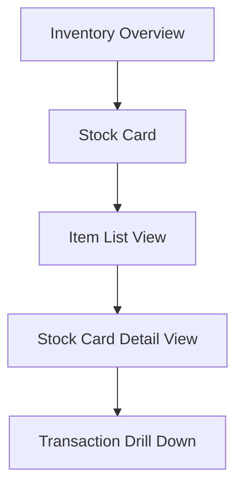
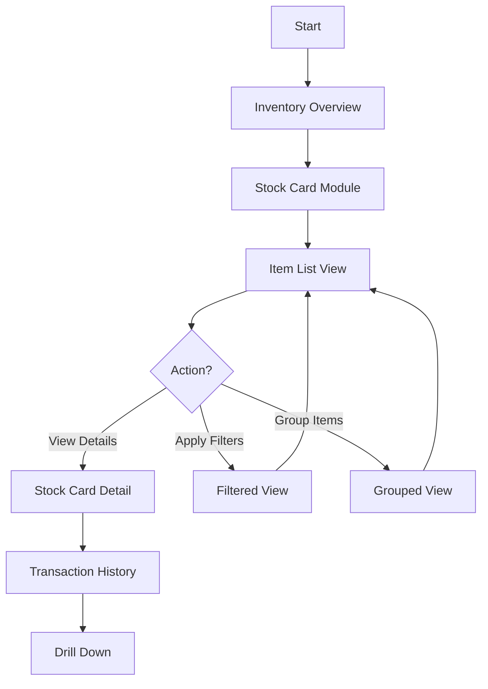
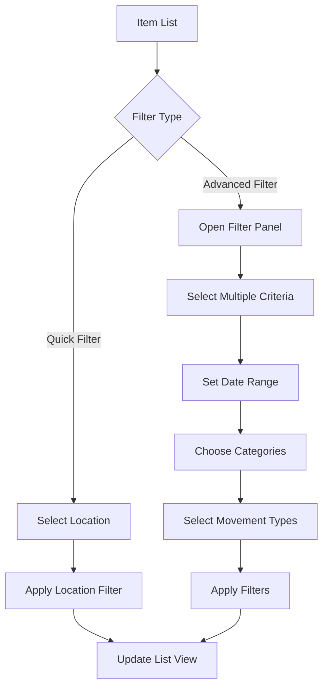
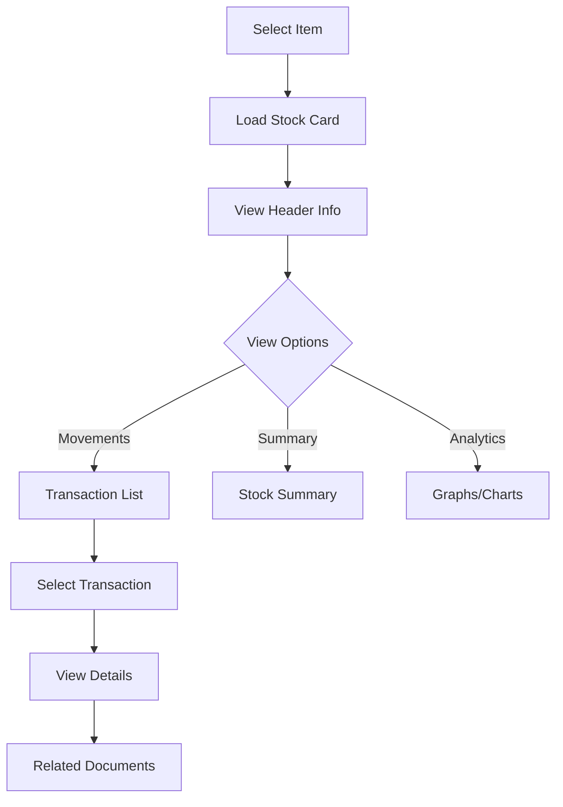
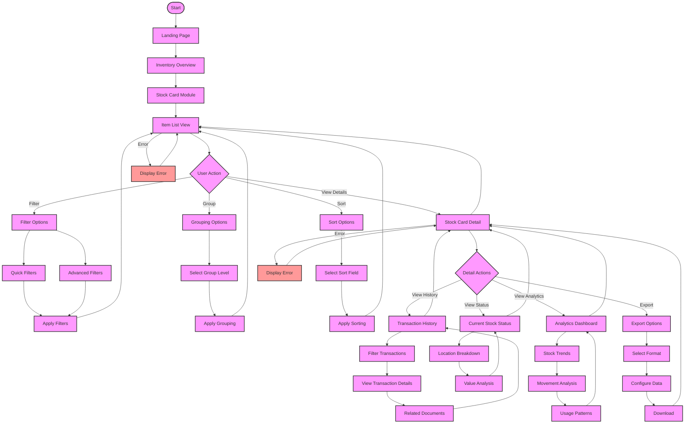
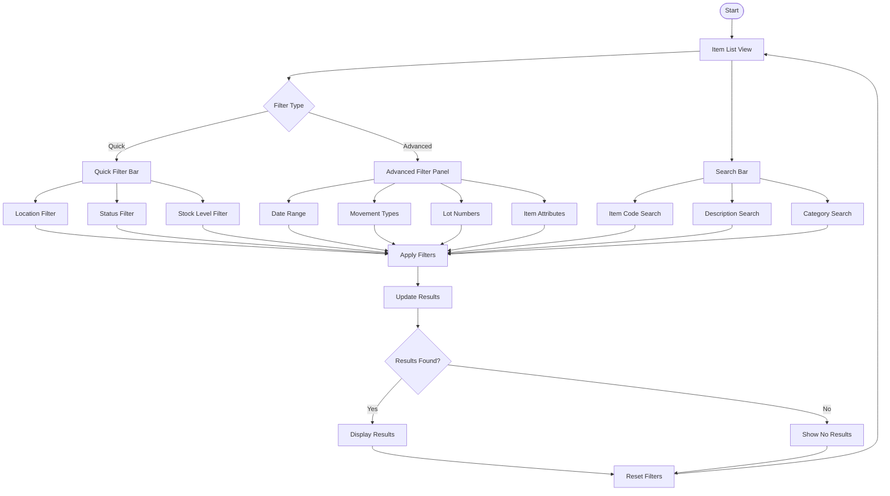
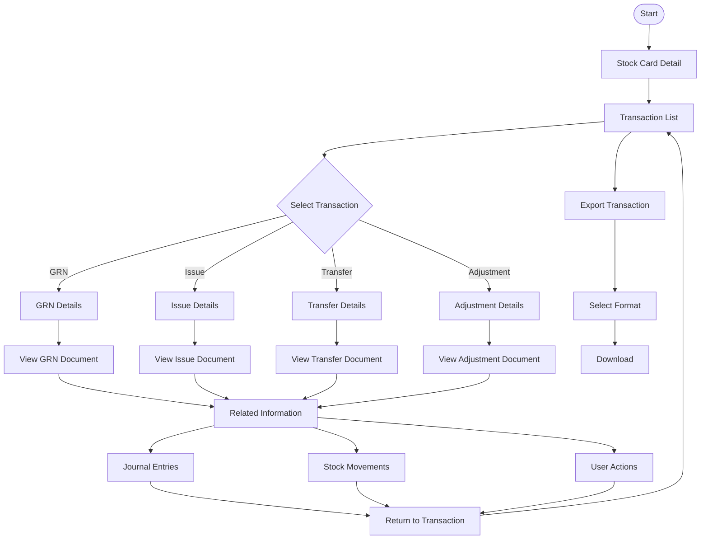

# Stock Card Module - Product Requirements Document (PRD)

**Document Status:** Draft  
**Last Updated:** March 27, 2024  
**Author:** Carmen Development Team

## Table of Contents
1. [Overview](#1-overview)
2. [Feature Requirements](#2-feature-requirements)
3. [User Flows](#3-user-flows)
4. [Technical Requirements](#4-technical-requirements)
5. [UI Components](#5-ui-components)
6. [Performance Requirements](#6-performance-requirements)
7. [Security Requirements](#7-security-requirements)
8. [Error Handling](#8-error-handling)
9. [Future Enhancements](#9-future-enhancements)

## 1. Overview

### 1.1 Purpose
The Stock Card module provides a detailed view of inventory movements and balances for each item across different locations, with hierarchical item categorization and advanced filtering capabilities.

### 1.2 Target Users
- Inventory Managers
- Store Managers
- Finance Teams
- Operations Managers

### 1.3 Business Value
- Improved inventory visibility
- Better stock control
- Enhanced decision making
- Efficient stock tracking
- Accurate financial reporting

## 2. Feature Requirements

### 2.1 Navigation Structure


### 2.2 Item List View Features

#### 2.2.1 Hierarchical Grouping
- Item Group
  - Primary classification
  - Group-level metrics
- Category
  - Secondary classification
  - Category-specific filters
- Sub-Category
  - Detailed classification
  - Specialized grouping

#### 2.2.2 Quick Filters
- Location
  - Single/Multiple selection
  - Location hierarchy support
- Item Status
  - Active/Inactive
  - Out of stock
  - Low stock
  - Excess stock
- Stock Level
  - Below minimum
  - Above maximum
  - Optimal range

#### 2.2.3 Advanced Filters
- Date Range
  - Custom periods
  - Preset ranges
- Movement Types
  - Receipts
  - Issues
  - Adjustments
  - Transfers
- Lot Numbers
  - Single/Multiple selection
  - Expiry date range
- Item Attributes
  - Custom fields
  - Tags
  - Classifications

### 2.3 Stock Card Detail View

#### 2.3.1 Item Information Header
- Item code and name
- Primary UOM
- Alternative UOMs
- Item classification
- Item status

#### 2.3.2 Current Stock Status
- Quantity on hand
- Available quantity
- Reserved quantity
- In-transit quantity
- Blocked quantity

#### 2.3.3 Movement History
- Transaction date
- Document reference
- Movement type
- Quantity in/out
- Running balance
- Unit cost
- Total value

#### 2.3.4 Graphical Representation
- Stock level trends
- Movement patterns
- Value analysis
- Usage statistics

## 3. User Flows

### 3.1 Main Navigation Flow


### 3.2 Filtering Flow


### 3.3 Stock Card Detail Flow


### 3.4 Detailed User Flow Diagrams

#### 3.4.1 Complete User Interaction Flow


#### 3.4.2 Filter and Search Flow


#### 3.4.3 Transaction Drill-Down Flow


## 4. Technical Requirements

### 4.1 Data Structure
```typescript
interface StockCard {
  itemId: string
  itemCode: string
  itemName: string
  itemGroup: string
  category: string
  subCategory: string
  uom: string
  locations: Location[]
  movements: Movement[]
  currentStock: StockStatus
}

interface Location {
  id: string
  name: string
  stockOnHand: number
  reservedStock: number
  availableStock: number
}

interface Movement {
  transactionId: string
  date: Date
  type: MovementType
  quantity: number
  unitCost: number
  totalCost: number
  reference: string
  location: string
}

interface StockStatus {
  totalStock: number
  valueOnHand: number
  averageCost: number
  lastPurchaseDate: Date
  lastMovementDate: Date
}
```

### 4.2 API Endpoints
```typescript
// Required API endpoints
interface StockCardAPI {
  getItemList(filters: FilterCriteria): Promise<Item[]>
  getStockCard(itemId: string): Promise<StockCard>
  getMovements(itemId: string, filters: MovementFilters): Promise<Movement[]>
  getItemHierarchy(): Promise<ItemHierarchy>
  getLocations(): Promise<Location[]>
}
```

## 5. UI Components

### 5.1 List View Components
- Hierarchical Tree View for Categories
- Quick Filter Bar
- Advanced Filter Panel
- Item List Grid
- Group Headers
- Summary Cards

### 5.2 Detail View Components
- Item Information Header
- Stock Status Dashboard
- Movement History Timeline
- Transaction Grid
- Charts and Graphs
- Document Links

## 6. Performance Requirements

### 6.1 Loading Times
- Initial page load: < 2 seconds
- Filter application: < 1 second
- Stock card detail: < 1.5 seconds
- Transaction drill-down: < 1 second

### 6.2 Data Management
- Implement pagination for large datasets
- Cache frequently accessed data
- Lazy load transaction history
- Progressive loading for scrolling

## 7. Security Requirements

### 7.1 Access Control
- Role-based access control
- Location-based restrictions
- Cost visibility permissions
- Transaction detail access levels

### 7.2 Data Security
- Encrypted data transmission
- Audit logging
- Session management
- Data access validation

## 8. Error Handling

### 8.1 Error Scenarios
- No data available
- Network connectivity issues
- Invalid filter combinations
- Access denied scenarios

### 8.2 Error Messages
- User-friendly error messages
- Clear resolution steps
- Support contact information
- Error logging and tracking

## 9. Future Enhancements

### 9.1 Phase 2 Features
- Export capabilities
  - PDF export
  - Excel export
  - Custom report templates
- Custom report generation
  - User-defined layouts
  - Scheduled reports
  - Email distribution
- Batch operations
  - Multi-item updates
  - Bulk data export
  - Mass status changes
- Advanced analytics
  - Predictive analytics
  - Usage patterns
  - Cost analysis
  - Trend forecasting
- Mobile optimization
  - Responsive design
  - Mobile-specific features
  - Offline capabilities 