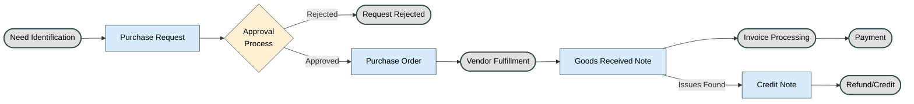
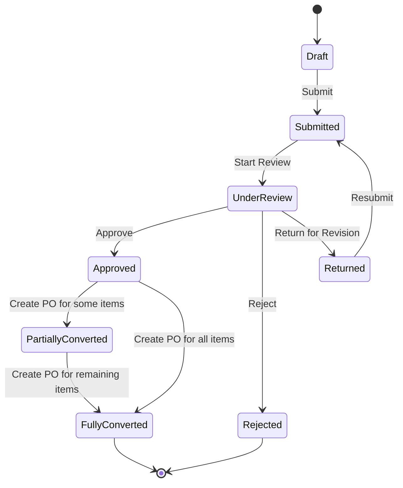
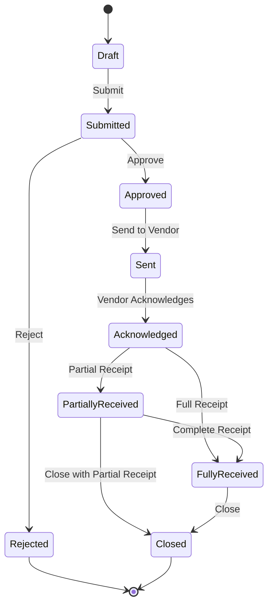
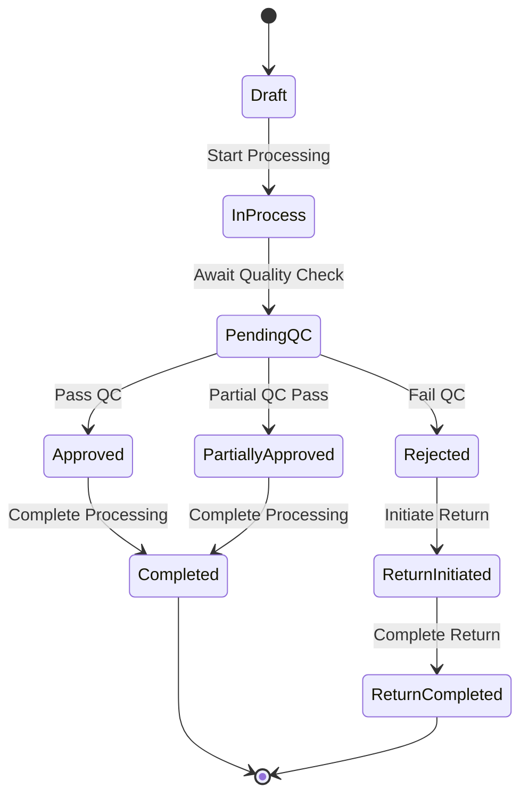
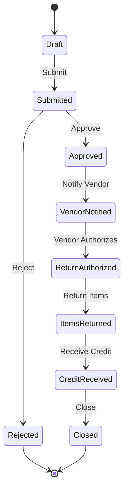
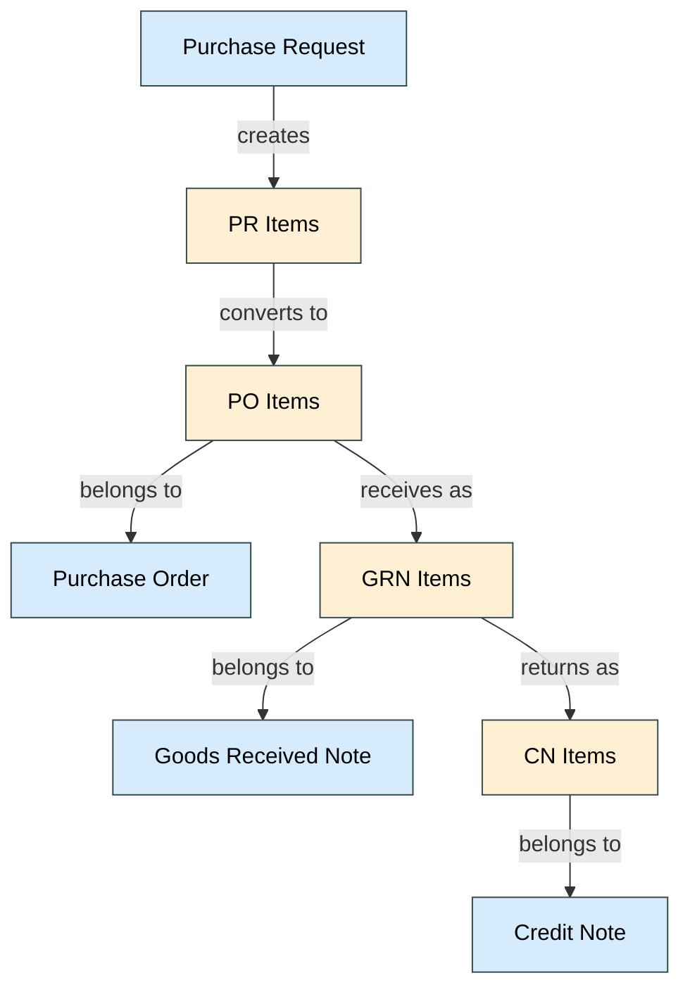

# Procurement Process Flow

> **Note**: This is a consolidated document that provides an overview of the end-to-end procurement process across multiple modules:
> - Purchase Request (PR)
> - Purchase Order (PO)
> - Goods Received Note (GRN)
> - Credit Note (CN)

## Table of Contents
1. [Introduction](#introduction)
2. [Procurement Lifecycle Overview](#procurement-lifecycle-overview)
3. [Module Interactions](#module-interactions)
4. [Purchase Request (PR) Process](#purchase-request-pr-process)
5. [Purchase Order (PO) Process](#purchase-order-po-process)
6. [Goods Received Note (GRN) Process](#goods-received-note-grn-process)
7. [Credit Note (CN) Process](#credit-note-cn-process)
8. [Data Flow Between Modules](#data-flow-between-modules)
9. [Status Transitions](#status-transitions)
10. [Key Integration Points](#key-integration-points)
11. [Common Business Rules](#common-business-rules)
12. [Related Documentation](#related-documentation)

## Introduction
This document provides a comprehensive overview of the end-to-end procurement process within the Carmen F&B Management System, detailing how the Purchase Request (PR), Purchase Order (PO), Goods Received Note (GRN), and Credit Note (CN) modules interact to form a complete procurement lifecycle.

## Procurement Lifecycle Overview
The procurement process follows a standard lifecycle:
1. **Need Identification**: A need is identified and a Purchase Request is created
2. **Approval Process**: The PR goes through an approval workflow
3. **Vendor Selection**: Approved vendors are selected and a Purchase Order is created
4. **Order Fulfillment**: The vendor fulfills the order
5. **Goods Receipt**: Goods are received and a GRN is created
6. **Invoice Processing**: Invoices are processed and payments are made
7. **Returns/Credits**: If needed, returns are processed and credit notes are issued

## Module Interactions

### PR to PO Conversion
The conversion from Purchase Request (PR) to Purchase Order (PO) is a critical process that ensures traceability throughout the procurement lifecycle. This section details how PR items are converted to PO items and how the relationship between them is maintained.

#### Conversion Process

1. **PR Approval**: Only approved PRs can be converted to POs
2. **Conversion Methods**:
   - **Full Conversion**: All items from a PR are converted to a single PO
   - **Partial Conversion**: Selected items from a PR are converted to a PO
   - **Split Conversion**: Items from a PR are split across multiple POs
   - **Consolidated Conversion**: Items from multiple PRs are consolidated into a single PO

3. **Data Mapping**:

| PR Item Field | PO Item Field | Transformation Rule |
|---------------|---------------|---------------------|
| item_id | item_id | Direct mapping |
| description | description | Direct mapping |
| quantity_requested | quantity_ordered | Direct mapping |
| unit | unit | Direct mapping |
| estimated_price | price | Updated with actual vendor price |
| delivery_date | delivery_date | May be adjusted based on vendor terms |
| pr_id | source_pr_id | Reference to source PR |
| pr_item_id | source_pr_item_id | Reference to source PR item |
| status | - | Not mapped (PO has its own status) |

4. **Traceability Links**:
   - Each PO item maintains references to its source PR and PR item
   - The PR item status is updated to reflect its conversion to a PO
   - Bidirectional links allow navigation from PR to PO and vice versa

#### Conversion Rules

1. **Quantity Rules**:
   - PO quantity cannot exceed PR approved quantity
   - PR items can be partially converted (some quantity to one PO, remaining to another)
   - System tracks remaining quantity to be converted

2. **Vendor Rules**:
   - PR may suggest vendors, but final vendor selection happens during PO creation
   - Multiple vendors may be selected for different items from the same PR
   - Vendor-specific pricing overrides estimated PR pricing

3. **Status Updates**:
   - PR items status updated to "In Progress" when partially converted
   - PR items status updated to "Converted" when fully converted
   - PR status updated to "Partially Converted" or "Fully Converted" based on items

#### Traceability Queries

The system supports the following traceability queries:

1. **Forward Traceability**:
   - For a given PR, find all POs created from it
   - For a given PR item, find all PO items created from it

2. **Backward Traceability**:
   - For a given PO, find all source PRs
   - For a given PO item, find the source PR item

3. **Full Lifecycle Traceability**:
   - For a given PR, trace through POs to GRNs and CNs
   - For a given PR item, trace through PO items to GRN items and CN items

#### Conversion UI

The PO creation interface provides the following features for PR conversion:

1. **PR Selection**: Ability to select one or more approved PRs
2. **Item Selection**: Ability to select specific items from selected PRs
3. **Quantity Adjustment**: Ability to adjust quantities (within approved limits)
4. **Vendor Assignment**: Ability to assign vendors to items
5. **Price Update**: Ability to update prices based on vendor quotes
6. **Delivery Schedule**: Ability to adjust delivery dates

#### Reporting

The system provides the following reports for PR-to-PO traceability:

1. **PR Conversion Status Report**: Shows conversion status of all PRs
2. **PO Source Report**: Shows source PRs for all POs
3. **Item Traceability Report**: Shows the full lifecycle of items from PR to PO to GRN to CN

### PO to GRN Relationship

The relationship between Purchase Orders (PO) and Goods Received Notes (GRN) is fundamental to the procurement process, enabling accurate tracking of ordered versus received goods.

#### Key Aspects of PO-GRN Relationship

1. **Reference Integrity**:
   - Each GRN must reference a valid PO
   - Multiple GRNs can be created against a single PO (partial deliveries)
   - GRN items must reference specific PO items

2. **Data Mapping**:

| PO Item Field | GRN Item Field | Transformation Rule |
|---------------|----------------|---------------------|
| po_id | source_po_id | Direct reference |
| po_item_id | source_po_item_id | Direct reference |
| item_id | item_id | Direct mapping |
| description | description | Direct mapping |
| quantity_ordered | expected_quantity | Direct mapping |
| unit | unit | Direct mapping |
| price | unit_price | Direct mapping |
| - | quantity_received | New field in GRN |
| - | quantity_accepted | New field in GRN |
| - | quantity_rejected | New field in GRN |

3. **Quantity Tracking**:
   - System tracks ordered, received, accepted, and rejected quantities
   - Partial receipts are supported (receiving less than ordered quantity)
   - Over-receipts can be allowed or restricted based on configuration
   - Remaining quantities to be received are calculated and displayed

4. **Status Management**:
   - PO status is updated based on GRN creation
   - PO items can be in different states (fully received, partially received, not received)
   - PO can be closed when all items are fully received or when explicitly marked as complete

#### GRN Creation Process

1. **GRN Initiation**:
   - User selects a PO to receive against
   - System loads PO details and outstanding items
   - User can choose to receive all or selected items

2. **Quantity Verification**:
   - User enters received quantities for each item
   - System validates against ordered quantities
   - Discrepancies are highlighted and may require approval

3. **Quality Inspection**:
   - Received items can undergo quality inspection
   - Quantities can be split into accepted and rejected
   - Rejected items can trigger Credit Note creation

4. **Inventory Update**:
   - Accepted quantities update inventory levels
   - Lot/batch tracking information is recorded
   - Storage locations are assigned

5. **Financial Processing**:
   - GRN generates financial entries
   - Accruals are created for received goods
   - Tax calculations are performed

#### Reporting and Analytics

1. **Receipt Status Report**: Shows receipt status of all POs
2. **Delivery Performance Report**: Analyzes vendor delivery performance
3. **Receipt Variance Report**: Highlights discrepancies between ordered and received quantities

### GRN to CN Relationship

The relationship between Goods Received Notes (GRN) and Credit Notes (CN) enables the management of returns, rejections, and financial adjustments in the procurement process.

#### Key Aspects of GRN-CN Relationship

1. **Reference Integrity**:
   - Each CN must reference a valid GRN
   - Multiple CNs can be created against a single GRN
   - CN items must reference specific GRN items

2. **Data Mapping**:

| GRN Item Field | CN Item Field | Transformation Rule |
|----------------|---------------|---------------------|
| grn_id | source_grn_id | Direct reference |
| grn_item_id | source_grn_item_id | Direct reference |
| po_id | po_id | Indirect reference through GRN |
| po_item_id | po_item_id | Indirect reference through GRN |
| item_id | item_id | Direct mapping |
| description | description | Direct mapping |
| quantity_accepted | max_returnable_quantity | Calculated field |
| unit_price | unit_price | Direct mapping |
| - | return_quantity | New field in CN |
| - | return_reason | New field in CN |

3. **Return Quantity Management**:
   - System enforces that return quantities cannot exceed received quantities
   - Partial returns are supported
   - Multiple returns against the same GRN item are tracked cumulatively

4. **Financial Implications**:
   - CN generates financial entries to reverse GRN entries
   - Tax adjustments are calculated
   - Credit amounts are applied to vendor accounts

5. **Inventory Adjustments**:
   - Returned quantities reduce inventory levels
   - Lot/batch tracking is maintained for returns
   - FIFO/LIFO/Average cost calculations are adjusted

#### CN Creation Process

1. **CN Initiation**:
   - User selects a GRN to create a return against
   - System loads GRN details and returnable items
   - User selects items to return

2. **Return Details**:
   - User enters return quantities for each item
   - Return reasons are documented
   - System validates against received quantities

3. **Return Authorization**:
   - Returns may require approval based on value or other criteria
   - Approval workflow can be triggered
   - Notifications are sent to relevant stakeholders

4. **Inventory and Financial Processing**:
   - Inventory levels are adjusted
   - Financial entries are generated
   - Vendor account is credited

#### Reporting and Analytics

1. **Return Analysis Report**: Analyzes return patterns and reasons
2. **Vendor Quality Report**: Evaluates vendors based on return rates
3. **Financial Impact Report**: Summarizes financial implications of returns

## Purchase Request (PR) Process

The Purchase Request (PR) process is the initial step in the procurement lifecycle, where users identify needs and request items to be purchased.

### Key Steps

1. **PR Creation**:
   - User initiates a new purchase request
   - Basic information is entered (department, requestor, purpose)
   - Items are added with quantities, specifications, and estimated prices
   - Supporting documents can be attached

2. **Item Management**:
   - Items can be added from catalog or as free-text entries
   - Specifications and requirements are documented
   - Estimated prices and quantities are entered
   - Preferred vendors can be suggested

3. **Budget Validation**:
   - System checks if budget is available for the requested items
   - Budget allocations are displayed
   - Warnings are shown for potential budget overruns
   - Budget holders can be notified

4. **Approval Workflow**:
   - PR is submitted for approval
   - Approval routing is determined based on value, department, and item types
   - Approvers review and approve/reject/return the PR
   - Comments and feedback can be provided at each step

5. **Conversion to PO**:
   - Approved PRs are available for conversion to POs
   - Procurement officers select PRs to convert
   - PR items are mapped to PO items
   - PR status is updated based on conversion status

### PR Status Flow

### User Roles and Responsibilities

| Role | Responsibilities |
|------|------------------|
| Requestor | Creates and submits PRs |
| Department Approver | Reviews and approves departmental PRs |
| Finance Approver | Validates budget and financial aspects |
| Procurement Officer | Converts approved PRs to POs |

## Purchase Order (PO) Process

The Purchase Order (PO) process follows the approval of Purchase Requests and involves creating formal orders to vendors for goods or services.

### Key Steps

1. **PO Creation**:
   - PO can be created from approved PRs or directly
   - Vendor is selected and terms are specified
   - Items are added with quantities, prices, and delivery dates
   - Financial calculations are performed (subtotals, taxes, totals)

2. **Vendor Assignment**:
   - Vendors are selected from the vendor master
   - Vendor-specific terms and conditions are applied
   - Multiple vendors can be used for different items
   - Vendor performance history can be reviewed

3. **Terms Negotiation**:
   - Payment terms are specified
   - Delivery terms and schedules are set
   - Discounts and special conditions are documented
   - Contract references can be added

4. **PO Approval**:
   - PO may require approval based on value or other criteria
   - Approval workflow routes the PO to appropriate approvers
   - Approvers can approve, reject, or request changes
   - Approved POs are ready to be sent to vendors

5. **PO Issuance**:
   - Approved POs are sent to vendors
   - Transmission methods include email, EDI, or vendor portal
   - PO acknowledgment from vendor is recorded
   - Changes after issuance follow a formal amendment process

6. **Receipt of Goods**:
   - Goods are received against the PO
   - GRNs are created to document receipt
   - PO status is updated based on receipt status
   - Discrepancies are managed through exception processes

### PO Status Flow

### User Roles and Responsibilities

| Role | Responsibilities |
|------|------------------|
| Procurement Officer | Creates and manages POs |
| Procurement Manager | Approves POs and handles exceptions |
| Finance Officer | Reviews financial aspects |
| Warehouse Staff | Receives goods against POs |

## Goods Received Note (GRN) Process

The Goods Received Note (GRN) process documents the receipt of goods from vendors against Purchase Orders, updating inventory and financial records.

### Key Steps

1. **GRN Creation**:
   - User selects a PO to receive against
   - System loads PO details and outstanding items
   - User enters received quantities and conditions
   - Discrepancies between ordered and received are documented

2. **Item Verification**:
   - Physical goods are compared to PO specifications
   - Quantities are counted and verified
   - Item conditions are assessed
   - Discrepancies are noted and may require approval

3. **Quantity Confirmation**:
   - Received quantities are entered for each item
   - System validates against ordered quantities
   - Over/under receipts are handled according to business rules
   - Remaining quantities to be received are calculated

4. **Quality Check**:
   - Quality inspection can be performed
   - Items can be accepted or rejected based on quality
   - Rejected items can trigger return process
   - Quality notes and measurements are recorded

5. **Inventory Update**:
   - Accepted items update inventory levels
   - Lot/batch numbers are assigned
   - Storage locations are specified
   - Inventory valuation is updated

6. **Discrepancy Handling**:
   - Quantity discrepancies are documented
   - Quality issues are recorded
   - Resolution actions are initiated
   - Approvals for exceptions are obtained

### GRN Status Flow

### User Roles and Responsibilities

| Role | Responsibilities |
|------|------------------|
| Warehouse Staff | Receives goods and creates GRNs |
| Quality Control | Inspects received goods |
| Warehouse Manager | Approves GRNs and handles exceptions |
| Inventory Controller | Manages inventory updates |

## Credit Note (CN) Process

The Credit Note (CN) process handles returns, rejections, and financial adjustments related to goods received from vendors.

### Key Steps

1. **CN Creation**:
   - User selects a GRN to create a return against
   - System loads GRN details and returnable items
   - User selects items to return and specifies quantities
   - Return reasons are documented

2. **Return Reason Documentation**:
   - Specific reasons for return are selected
   - Supporting evidence can be attached
   - Quality issues are documented
   - Vendor communication is recorded

3. **Item Selection**:
   - Items to be returned are selected
   - Return quantities are specified
   - System validates against received quantities
   - Lot/batch numbers are maintained for traceability

4. **Approval Process**:
   - Returns may require approval based on value or other criteria
   - Approval workflow routes the CN to appropriate approvers
   - Approvers can approve, reject, or request changes
   - Approved CNs proceed to vendor communication

5. **Vendor Communication**:
   - Return authorization is requested from vendor
   - Return details are communicated
   - Return shipping arrangements are made
   - Vendor acknowledgment is recorded

6. **Credit/Refund Processing**:
   - Financial entries are generated to reverse GRN entries
   - Vendor account is credited
   - Tax adjustments are calculated
   - Inventory levels are adjusted

### CN Status Flow

### User Roles and Responsibilities

| Role | Responsibilities |
|------|------------------|
| Warehouse Staff | Initiates returns and creates CNs |
| Procurement Officer | Communicates with vendors |
| Finance Officer | Processes credits and financial adjustments |
| Warehouse Manager | Approves returns and handles exceptions |

## Data Flow Between Modules

The procurement process involves a complex flow of data between modules, ensuring traceability and data integrity throughout the lifecycle.

### Data Mapping

The following diagram illustrates the key data relationships between modules:

### Data Transformation

As data moves through the procurement lifecycle, it undergoes various transformations:

1. **PR to PO Transformation**:
   - Estimated prices become actual vendor prices
   - Requested quantities may be adjusted based on vendor MOQs
   - Delivery dates are finalized based on vendor commitments
   - Additional vendor-specific information is added

2. **PO to GRN Transformation**:
   - Ordered quantities are compared to received quantities
   - Actual receipt dates are recorded
   - Quality inspection results are added
   - Storage locations and lot information are assigned

3. **GRN to CN Transformation**:
   - Received quantities become returnable quantities
   - Return reasons and conditions are added
   - Return authorization information is included
   - Credit amounts and adjustments are calculated

### Data Integrity Rules

To maintain data integrity across the procurement lifecycle, the following rules are enforced:

1. **Quantity Rules**:
   - PO quantities cannot exceed PR approved quantities
   - GRN quantities cannot exceed PO quantities (unless over-receipt is allowed)
   - CN quantities cannot exceed GRN accepted quantities

2. **Reference Integrity**:
   - Each PO item maintains reference to its source PR item (if applicable)
   - Each GRN item must reference a valid PO item
   - Each CN item must reference a valid GRN item

3. **Status Synchronization**:
   - PR status is updated based on PO creation status
   - PO status is updated based on GRN creation status
   - GRN status is updated based on CN creation status

4. **Financial Consistency**:
   - Financial calculations must be consistent across modules
   - Currency conversions must use appropriate exchange rates
   - Tax calculations must follow consistent rules

## Status Transitions

Status transitions across modules ensure proper workflow management and provide visibility into the procurement lifecycle.

### Cross-Module Status Dependencies

The status of documents in one module can affect the available actions in another module:

1. **PR Status Impact**:
   - Only approved PRs can be converted to POs
   - Rejected PRs cannot be converted to POs
   - PRs under revision cannot be converted to POs

2. **PO Status Impact**:
   - Only approved POs can have GRNs created against them
   - Closed POs cannot have new GRNs created
   - Cancelled POs cannot have GRNs created

3. **GRN Status Impact**:
   - Only approved GRNs can have CNs created against them
   - GRNs with pending quality checks cannot have CNs created
   - Fully returned GRNs cannot have additional CNs created

### Status Synchronization

Status changes in one document can trigger status updates in related documents:

1. **PO Creation Impact on PR**:
   - When all PR items are converted to POs, PR status changes to "Fully Converted"
   - When some PR items are converted to POs, PR status changes to "Partially Converted"

2. **GRN Creation Impact on PO**:
   - When all PO items are fully received, PO status changes to "Fully Received"
   - When some PO items are received, PO status changes to "Partially Received"

3. **CN Creation Impact on GRN**:
   - When all GRN items are fully returned, GRN status changes to "Fully Returned"
   - When some GRN items are returned, GRN status changes to "Partially Returned"

## Key Integration Points

The procurement process integrates with various other systems and modules to provide a comprehensive solution.

### System Integrations

1. **Inventory Management**:
   - GRNs update inventory levels
   - CNs adjust inventory levels
   - Lot/batch tracking is maintained
   - Inventory valuation is updated

2. **Financial Management**:
   - POs create financial commitments
   - GRNs generate accruals or actual expenses
   - CNs create vendor credits
   - Budget allocations are updated

3. **Vendor Management**:
   - Vendor performance is tracked
   - Vendor communication is recorded
   - Vendor terms and conditions are applied
   - Vendor pricing agreements are enforced

4. **Budget Management**:
   - PRs check budget availability
   - POs allocate budget
   - GRNs and CNs update budget utilization
   - Budget variance reporting is supported

5. **Document Management**:
   - Documents are attached to PRs, POs, GRNs, and CNs
   - Version control is maintained
   - Document approvals are tracked
   - Document retention policies are enforced

### External Integrations

1. **Vendor Portals**:
   - POs are transmitted to vendors
   - Vendor acknowledgments are received
   - Delivery schedules are communicated
   - Return authorizations are requested

2. **Banking Systems**:
   - Payment information is transmitted
   - Payment status is received
   - Credit adjustments are processed
   - Foreign exchange rates are obtained

3. **Logistics Systems**:
   - Shipping information is exchanged
   - Delivery tracking is integrated
   - Return shipping is arranged
   - Customs documentation is managed

4. **Compliance Systems**:
   - Regulatory requirements are enforced
   - Compliance documentation is maintained
   - Audit trails are generated
   - Reporting requirements are met

## Common Business Rules

Business rules ensure consistency and compliance across the procurement process.

### Financial Rules

1. **Budget Control**:
   - PRs cannot be approved without budget availability
   - Budget overrides require special approval
   - Budget transfers must be documented
   - Budget variance reporting is required

2. **Currency Management**:
   - Multi-currency transactions are supported
   - Exchange rates are maintained and applied consistently
   - Exchange rate fluctuations are managed
   - Base currency reporting is provided

3. **Tax Handling**:
   - Tax codes are applied based on item and vendor
   - Tax calculations follow regulatory requirements
   - Tax adjustments for returns are properly calculated
   - Tax reporting is supported

4. **Payment Terms**:
   - Standard payment terms are applied based on vendor
   - Special payment terms require approval
   - Early payment discounts are calculated
   - Payment scheduling follows terms

### Inventory Rules

1. **Receipt Management**:
   - Over-receipts may be allowed within tolerance limits
   - Under-receipts require decision on whether to close or keep PO open
   - Partial receipts are tracked
   - Receipt timing is monitored

2. **Quality Control**:
   - Quality inspection may be required for certain items
   - Rejection criteria are defined
   - Quality holds prevent inventory usage
   - Quality history is maintained

3. **Lot Management**:
   - Lot tracking is required for certain items
   - Lot information is maintained throughout the lifecycle
   - Lot-specific returns are supported
   - Lot expiry is managed

4. **Valuation Methods**:
   - FIFO, LIFO, or Average cost methods are applied
   - Cost adjustments are properly calculated
   - Inventory value reports are generated
   - Period-end valuation is supported

### Approval Rules

1. **Approval Thresholds**:
   - Approval requirements based on value thresholds
   - Department-specific approval rules
   - Item category-specific approval rules
   - Exception handling for special cases

2. **Delegation of Authority**:
   - Approval authority can be delegated
   - Temporary delegations are supported
   - Delegation history is maintained
   - Delegation limits can be specified

3. **Approval Timing**:
   - SLAs for approval responses
   - Escalation for delayed approvals
   - Reminder notifications
   - Approval performance reporting

4. **Approval Documentation**:
   - Justifications required for certain approvals
   - Supporting documentation requirements
   - Approval comments are recorded
   - Approval audit trail is maintained

### Document Rules

1. **Numbering Schemes**:
   - Consistent numbering across modules
   - Sequential or pattern-based numbering
   - Prefix/suffix based on document type
   - Year/period indicators in document numbers

2. **Document Relationships**:
   - Clear parent-child relationships
   - Reference integrity between documents
   - Traceability throughout lifecycle
   - Document relationship reporting

3. **Document Retention**:
   - Retention periods by document type
   - Archiving rules
   - Retrieval mechanisms
   - Compliance with regulatory requirements

4. **Document Security**:
   - Access controls by document type and status
   - Edit/view permissions
   - Digital signatures where required
   - Audit logging of document access

## Related Documentation
- [Purchase Request (PR) Documentation](./pr/README.md)
- [Purchase Order (PO) Documentation](./po/README.md)
- [Goods Received Note (GRN) Documentation](./grn/README.md)
- [Credit Note (CN) Documentation](./cn/README.md)

---

**Document Status**: Updated - Content Migration Completed (Phase 2)  
**Last Updated**: March 14, 2024  
**Next Update**: Phase 3 - Content Refinement 