# Technical Specification: Currency Management

## Module Information
- **Module**: Finance
- **Sub-Module**: Currency Management
- **Route**: `/finance/currency-management`
- **Version**: 1.0.0
- **Last Updated**: 2025-11-12
- **Owner**: Finance & Treasury Team
- **Status**: Draft

## Document History
| Version | Date | Author | Changes |
|---------|------|--------|---------|
| 1.0.0 | 2025-11-12 | Carmen ERP Documentation Team | Initial version |

---

## Overview

The Currency Management module implements a comprehensive multi-currency system that supports foreign currency transactions, automatic exchange rate retrieval, currency conversion with configurable rounding, and periodic revaluation of foreign currency balances. The architecture integrates an Exchange Rate Service for real-time rate retrieval, a Currency Conversion Engine for accurate calculations, and a Revaluation Service for IAS 21-compliant unrealized gain/loss calculations.

The technical implementation emphasizes accuracy through high-precision decimal arithmetic (6+ decimal places for exchange rates), compliance through IAS 21 financial reporting standards, auditability through complete exchange rate history and gain/loss traceability, and performance through intelligent rate caching and batch revaluation processing. All foreign currency transactions are recorded in both transaction currency and base currency simultaneously, with automatic calculation of realized and unrealized exchange gains and losses.

**⚠️ IMPORTANT: This is a Technical Specification Document - TEXT FORMAT ONLY**

**Related Documents**:
- [Business Requirements](./BR-currency-management.md)
- [Use Cases](./UC-currency-management.md)
- [Data Schema](./DS-currency-management.md)
- [Flow Diagrams](./FD-currency-management.md)
- [Validation Rules](./VAL-currency-management.md)

---

## Architecture

### High-Level Architecture

```
┌────────────────────────────────────────────────────────────────────┐
│                     Client Layer (Browser)                          │
│  ┌──────────────┐  ┌──────────────┐  ┌──────────────┐  ┌────────┐│
│  │   Currency   │  │   Foreign    │  │   Exchange   │  │ Multi- ││
│  │    Setup     │  │ Transaction  │  │    Rates     │  │Currency││
│  │ Management   │  │   Processing │  │  Management  │  │ Reports││
│  └──────────────┘  └──────────────┘  └──────────────┘  └────────┘│
└────────────┬────────────────────────────────────────────────────────┘
             │ HTTPS / Server Actions
             ▼
┌────────────────────────────────────────────────────────────────────┐
│             Application Layer (Next.js Server)                      │
│  ┌────────────────────────────────────────────────────────────┐  │
│  │                    Server Actions                          │  │
│  │  - configureCurrency     - postForeignTransaction          │  │
│  │  - retrieveExchangeRate  - calculateExchangeGainLoss       │  │
│  │  - runRevaluation        - generateMultiCurrencyReport     │  │
│  └────────────────────────────────────────────────────────────┘  │
│           │                    │                    │              │
│           ▼                    ▼                    ▼              │
│  ┌────────────────────────────────────────────────────────────┐  │
│  │              Business Logic Services                        │  │
│  │  - Exchange Rate Service    - Currency Conversion Engine   │  │
│  │  - Revaluation Service      - Posting Engine Integration   │  │
│  │  - Rounding Service         - Foreign Currency Validator   │  │
│  └────────────────────────────────────────────────────────────┘  │
└────────────┬────────────────────────────────────────────────────────┘
             │
             ▼
┌────────────────────────────────────────────────────────────────────┐
│                 External Integrations                               │
│  ┌──────────────────┐  ┌──────────────────┐  ┌─────────────────┐│
│  │  Exchange Rate   │  │  Banking Systems │  │   Account Code  ││
│  │    Providers     │  │   (Multi-Curr)   │  │     Mapping     ││
│  │  (BOE, ECB, etc) │  │                  │  │   Integration   ││
│  └──────────────────┘  └──────────────────┘  └─────────────────┘│
└────────────┬────────────────────────────────────────────────────────┘
             │
             ▼
┌────────────────────────────────────────────────────────────────────┐
│                         Data Layer                                  │
│                  (PostgreSQL via Supabase)                          │
│  ┌────────────────────────────────────────────────────────────┐  │
│  │                     Core Tables                             │  │
│  │  - currencies                - exchange_rates              │  │
│  │  - exchange_rate_history     - foreign_currency_txns       │  │
│  │  │  bank_accounts_multi_curr  - currency_revaluations      │  │
│  │  - exchange_gain_loss_log    - currency_exposure           │  │
│  └────────────────────────────────────────────────────────────┘  │
│  ┌──────────────┐  ┌──────────────┐  ┌──────────────┐           │
│  │  Functions   │  │  Triggers    │  │ Materialized │           │
│  │ calculateFX  │  │ auditRates   │  │    Views     │           │
│  └──────────────┘  └──────────────┘  └──────────────┘           │
└─────────────────────────────────────────────────────────────────────┘
```

### Component Architecture

**Frontend Layer**
- **Page Components**: Server Components for currency configuration, exchange rate dashboard, foreign currency transaction forms, revaluation wizard, multi-currency reports
- **UI Components**: Client Components for currency selector with flags, dual currency display widgets, exchange rate charts, currency exposure visualization
- **State Management**: Zustand for UI preferences and selected currencies, React Query for exchange rate data with aggressive caching (10-minute TTL)
- **Form Handling**: React Hook Form with Zod for foreign currency transaction validation, automatic base currency calculation

**Backend Layer - Exchange Rate Service**
- **Rate Retriever**: Connects to external providers (Bank of England, ECB, Bank of Japan, etc.) via REST APIs
- **Rate Validator**: Validates retrieved rates for reasonableness (variance checks, historical comparison)
- **Rate Cacher**: Redis-based caching with configurable TTL (default 1 hour for rates, 24 hours for historical)
- **Rate Interpolator**: Calculates missing historical rates using linear interpolation from nearest dates
- **Manual Rate Handler**: Processes manual rate entries with approval workflow for >5% variance from market

**Backend Layer - Currency Conversion Engine**
- **Conversion Calculator**: High-precision decimal calculations using Decimal.js or equivalent (no floating point)
- **Rounding Engine**: Implements multiple rounding strategies (standard, cash rounding, banker's rounding)
- **Batch Converter**: Processes multiple currency conversions in parallel for performance
- **Cross-Rate Calculator**: Derives exchange rates between non-USD currency pairs using triangulation

**Backend Layer - Revaluation Service**
- **Balance Identifier**: Queries open foreign currency balances (AR, AP, cash) requiring revaluation
- **Revaluation Calculator**: Calculates unrealized gains/losses using period-end rates
- **Journal Entry Generator**: Creates revaluation journal entries with automatic reversal flagging
- **Reversal Processor**: Posts automatic reversal entries at period start
- **Compliance Reporter**: Generates IAS 21 disclosure reports

**Backend Layer - Posting Integration**
- **Dual Currency Poster**: Interfaces with Posting Engine to record both transaction and base currency amounts
- **Realized Gain/Loss Calculator**: Calculates realized gains/losses on payment/receipt transactions
- **Exchange Impact Tracker**: Logs all exchange rate impacts for financial analysis
- **Dimension Handler**: Maintains dimension consistency across currencies

**Data Layer**
- **Currency Master**: Stores currency definitions with ISO 4217 compliance, display formats, rounding rules
- **Exchange Rate Tables**: Current rates (real-time), historical rates (daily granularity for 7+ years)
- **Foreign Currency Transactions**: Dual currency storage (foreign amount, base amount, exchange rate used)
- **Revaluation History**: Complete audit trail of all revaluation calculations
- **Materialized Views**: Pre-aggregated currency exposure by currency, multi-currency trial balance

---

## Technology Stack

### Frontend
- **Framework**: Next.js 14.2+ (App Router)
- **UI Library**: React 18.2+
- **Styling**: Tailwind CSS 3.4+, Shadcn/ui
- **State Management**: Zustand 4.4+ (UI), React Query 5.17+ (exchange rates)
- **Form Handling**: React Hook Form 7.48+, Zod 3.22+
- **Icons**: Lucide React 0.263+ (currency flags package)
- **Date Handling**: date-fns 3.0+
- **Number Formatting**: Intl.NumberFormat (native) for currency display
- **Charting**: Recharts 2.10+ (exchange rate trends)

### Backend
- **Runtime**: Node.js 20.14.0+
- **Framework**: Next.js 14.2+ Server Actions
- **Database**: PostgreSQL 14+ (Supabase)
- **ORM**: Prisma 5.8+
- **Decimal Library**: Decimal.js 10.4+ (high-precision currency calculations)
- **Rate Caching**: Redis 7+ (exchange rate cache)
- **HTTP Client**: node-fetch 3+ (external rate APIs)
- **Authentication**: Supabase Auth with RLS
- **Background Jobs**: Vercel Cron (hourly rate retrieval, daily revaluation checks)

### External APIs
- **Bank of England API**: GBP exchange rates
- **European Central Bank API**: EUR exchange rates
- **Bank of Japan API**: JPY exchange rates
- **Open Exchange Rates API**: Fallback for multiple currencies
- **XE.com API**: Secondary provider for validation

### Testing
- **Unit Tests**: Vitest 1.0+ with Decimal.js mocking
- **Integration Tests**: Vitest with test database and mocked exchange rate APIs
- **E2E Tests**: Playwright 1.40+ (foreign currency workflows)

### DevOps
- **Version Control**: Git with GitHub
- **CI/CD**: GitHub Actions with exchange rate API mocking
- **Hosting**: Vercel
- **Monitoring**: Sentry (errors), Datadog (exchange rate API health)
- **Alerting**: PagerDuty (rate retrieval failures, revaluation errors)

---

## Component Structure

### Directory Structure

```
app/(main)/finance/currency-management/
├── page.tsx                           # Currency dashboard
├── currencies/
│   ├── page.tsx                       # Currency master list
│   ├── [code]/page.tsx                # Currency detail
│   └── new/page.tsx                   # Add currency
├── exchange-rates/
│   ├── page.tsx                       # Exchange rate dashboard
│   ├── history/page.tsx               # Historical rates
│   └── manual/page.tsx                # Manual rate entry form
├── foreign-transactions/
│   ├── page.tsx                       # Foreign transaction list
│   ├── [id]/page.tsx                  # Transaction detail
│   └── process/page.tsx               # Foreign transaction form
├── revaluation/
│   ├── page.tsx                       # Revaluation dashboard
│   ├── run/page.tsx                   # Revaluation wizard
│   └── history/page.tsx               # Revaluation history
├── exposure/
│   └── page.tsx                       # Currency exposure dashboard
├── bank-accounts/
│   └── page.tsx                       # Multi-currency bank accounts
├── reports/
│   ├── trial-balance/page.tsx        # Multi-currency trial balance
│   ├── gain-loss/page.tsx            # Exchange gain/loss analysis
│   └── exposure/page.tsx             # Currency exposure report
├── components/
│   ├── CurrencySelector.tsx          # Currency picker with flags
│   ├── DualCurrencyDisplay.tsx       # Display amount in 2 currencies
│   ├── ExchangeRateWidget.tsx        # Current rate display
│   ├── ExchangeRateChart.tsx         # Rate history chart
│   ├── ForeignTransactionForm.tsx    # Foreign currency txn form
│   ├── CurrencyConversionPanel.tsx   # Real-time converter
│   ├── RevaluationWizard.tsx         # Period-end revaluation wizard
│   ├── GainLossCalculator.tsx        # Show gain/loss calculation
│   ├── CurrencyExposureChart.tsx     # Exposure visualization
│   ├── MultiBankAccountList.tsx      # Multi-currency accounts
│   └── ExchangeRateHistory.tsx       # Historical rate table
├── types.ts                           # Currency type definitions
├── actions.ts                         # Server Actions
├── hooks/
│   ├── useCurrencies.ts               # Currency master data
│   ├── useExchangeRates.ts            # Exchange rate fetching
│   ├── useCurrencyConversion.ts       # Real-time conversion
│   ├── useRevaluation.ts              # Revaluation operations
│   └── useExposure.ts                 # Exposure analytics
└── lib/
    ├── exchange-rate-service.ts       # Rate retrieval service
    ├── conversion-engine.ts           # Currency conversion logic
    ├── revaluation-service.ts         # Revaluation calculations
    ├── rounding-service.ts            # Rounding strategies
    ├── currency-validator.ts          # Currency validation
    ├── multi-currency-poster.ts       # Dual currency posting
    └── exposure-calculator.ts         # Exposure analytics
```

### Key Components

#### Currency Selector Component
**File**: `CurrencySelector.tsx` (Client Component)
**Purpose**: Allow users to select currency from active currencies
**Responsibilities**:
- Display currency list with flags, codes, names, and symbols
- Support search by code, name, or country
- Show exchange rate preview on hover
- Highlight base currency
- Filter by active/inactive status
**Props**: Value (selected currency code), onChange callback, showExchangeRate boolean, filterActive boolean

#### Dual Currency Display Component
**File**: `DualCurrencyDisplay.tsx` (Client Component)
**Purpose**: Display amount in both transaction and base currency
**Responsibilities**:
- Format amounts according to currency conventions (symbol placement, decimals)
- Display exchange rate used
- Highlight exchange gain/loss if applicable
- Support click-to-toggle between currencies
- Responsive layout (vertical on mobile, horizontal on desktop)
**Props**: Foreign amount, foreign currency code, base amount, base currency code, exchange rate, gain/loss amount (optional)

#### Foreign Transaction Form Component
**File**: `ForeignTransactionForm.tsx` (Client Component)
**Purpose**: Enter foreign currency transactions with automatic conversion
**Responsibilities**:
- Currency selection with default from vendor/customer
- Dual currency entry (user enters foreign, system calculates base)
- Real-time exchange rate retrieval
- Manual rate override with reason field
- Exchange rate source display
- Automatic base currency calculation on foreign amount change
- Validation (amounts positive, rate positive, period open)
- Display journal entry preview with dual currency
**Props**: Transaction type (invoice, payment, receipt), initial data, submit handler

#### Revaluation Wizard Component
**File**: `RevaluationWizard.tsx` (Client Component)
**Purpose**: Guide accountants through period-end currency revaluation
**Responsibilities**:
- **Step 1: Configuration**: Select revaluation date, currencies to revalue
- **Step 2: Rate Retrieval**: Fetch period-end rates, allow manual entry if unavailable
- **Step 3: Balance Identification**: Display open foreign currency balances (AR, AP, cash)
- **Step 4: Calculation**: Calculate unrealized gains/losses, show detailed breakdown
- **Step 5: Preview**: Display revaluation journal entry with net impact
- **Step 6: Post**: Post revaluation entry with reversal flagging
- **Step 7: Confirmation**: Show completion summary with GL impact
- Progress tracking with ability to save and resume
**Props**: Current period, previous revaluation date

#### Exchange Rate Dashboard Component
**File**: `exchange-rates/page.tsx` (Server Component)
**Purpose**: Display current and historical exchange rates
**Responsibilities**:
- Current rates for all active currencies
- Rate change indicators (%, up/down arrows)
- Last update timestamp and source
- Quick rate history chart (30-day trend)
- Manual rate entry button
- Rate alerts for significant changes (>5%)
- Currency volatility indicators
**Data Sources**: Exchange rate cache, historical rate table

---

## Sitemap

### Page Hierarchy

```mermaid
graph TD
    A["Currency Management"] --> B["Currencies"]
    A --> C["Exchange Rates"]
    A --> D["Foreign Transactions"]
    A --> E["Revaluation"]
    A --> F["Bank Accounts"]
    A --> G["Reports"]

    B --> B1["Currency List"]
    B --> B2["Currency Detail"]
    B --> B3["Add Currency"]

    C --> C1["Rate Dashboard"]
    C --> C2["Rate History"]
    C --> C3["Manual Entry"]

    D --> D1["Transaction List"]
    D --> D2["Transaction Detail"]
    D --> D3["Process Foreign Txn"]

    E --> E1["Revaluation Dashboard"]
    E --> E2["Run Revaluation"]
    E --> E3["Revaluation History"]

    F --> F1["Multi-Currency Accounts"]
    F --> F2["Account Detail"]

    G --> G1["Multi-Currency Trial Balance"]
    G --> G2["Exchange Gain/Loss Report"]
    G --> G3["Currency Exposure Report"]
```



### Pages

#### 1. Currency Master List Page
**Route**: `/finance/currency-management/currencies`
**Purpose**: Display and manage all supported currencies
**Sections**:
- Header: Title, base currency indicator, "Add Currency" button
- Active Currencies Table: Code, name, symbol, decimal places, exchange rate, status, actions
- Inactive Currencies Section: Collapsed list of deactivated currencies
**Actions**: View detail, edit configuration, deactivate, reactivate
**Filters**: Active/Inactive, search by code/name

#### 2. Exchange Rate Dashboard Page
**Route**: `/finance/currency-management/exchange-rates`
**Purpose**: Monitor current and historical exchange rates
**Sections**:
- Current Rates Panel: Grid of all currency pairs with base currency
- Rate Changes: Highlight significant changes in last 24 hours
- Rate Charts: 30-day trend charts for major currencies
- Manual Rates: List of manually entered rates pending approval
- Rate Alerts: Notifications for rate volatility or retrieval failures
**Actions**: Refresh rates, enter manual rate, view full history
**Real-Time Updates**: Exchange rates refresh every 60 minutes automatically

#### 3. Foreign Transaction Processing Page
**Route**: `/finance/currency-management/foreign-transactions/process`
**Purpose**: Enter and post foreign currency transactions
**Sections**:
- Transaction Type Selection: Invoice, Payment, Receipt
- Vendor/Customer Selection: Auto-populates currency
- Currency Selection: Foreign currency dropdown
- Exchange Rate Panel: Current rate display, manual override option
- Line Items: Enter amounts in foreign currency
- Dual Currency Preview: Show both foreign and base amounts
- Journal Entry Preview: Display full journal entry
**Actions**: Post transaction, save draft, cancel
**Validation**: Real-time validation of balanced entry, period open, rate validity

#### 4. Period-End Revaluation Page
**Route**: `/finance/currency-management/revaluation/run`
**Purpose**: Execute period-end currency revaluation
**Sections**:
- Revaluation Wizard: 7-step guided process
- Balance Summary: Open foreign currency balances by currency
- Calculation Details: Gain/loss breakdown per account/currency
- Journal Entry Preview: Revaluation entry with net P&L impact
- Posting Confirmation: Final review before posting
**Actions**: Next step, previous step, save and resume, post revaluation
**Progress**: Visual progress indicator showing current step

#### 5. Currency Exposure Report Page
**Route**: `/finance/currency-management/reports/exposure`
**Purpose**: Analyze currency risk exposure
**Sections**:
- Exposure Summary: Net position by currency (long/short)
- AR Exposure: Foreign currency receivables by currency
- AP Exposure: Foreign currency payables by currency
- Cash Exposure: Foreign currency bank balances
- Exposure Trend: Historical exposure charts
- Sensitivity Analysis: Impact of 10% rate change
**Actions**: Export to Excel, schedule email, configure alerts
**Filters**: Date range, currency, exposure threshold

---

## Data Flow

### Foreign Currency Transaction Posting

```
User Enters Foreign Currency Invoice
    ↓
Select Vendor (auto-populate currency: GBP)
    ↓
Enter Invoice Amount: £900.00
    ↓
System Retrieves Exchange Rate for Invoice Date
    ↓
Call Exchange Rate Service
    ↓
Check Rate Cache (TTL: 1 hour)
    ↓
If cached and fresh: Return cached rate (1.2750)
If expired: Call External API (Bank of England)
    ↓
Validate Retrieved Rate:
  - Positive number
  - Within bounds (0.0001 to 10,000)
  - Variance check vs previous rate (<10%)
    ↓
Store Rate in Cache and Historical Table
    ↓
Calculate Base Currency Amount
    ↓
Use Decimal.js for precision:
  base_amount = foreign_amount × exchange_rate
  £900.00 × 1.2750 = $1,147.50 (exact)
    ↓
Apply Rounding Rules:
  USD: 2 decimals, standard rounding
  Result: $1,147.50
    ↓
Display Dual Currency Amounts:
  Transaction: £900.00 GBP
  Base: $1,147.50 USD
  Rate: 1.2750
  Source: Bank of England
    ↓
User Reviews and Clicks "Post"
    ↓
Validate Transaction:
  - Period is open
  - Amounts positive
  - GL accounts mapped
  - Exchange rate valid
    ↓
Begin Database Transaction
    ↓
Call Account Code Mapping for GL accounts
    ↓
Generate Journal Entry:
  Date: 2025-11-12
  Debit: 5100 - COGS: £900.00 / $1,147.50
  Credit: 2100 - AP: £900.00 / $1,147.50
    ↓
Store Dual Currency Amounts:
  transaction_currency: GBP
  transaction_amount: 900.00
  base_currency: USD
  base_amount: 1147.50
  exchange_rate: 1.2750
  rate_source: Bank of England
  rate_date: 2025-11-12
    ↓
Post Journal Entry to GL
    ↓
Create AP Balance Record (dual currency)
    ↓
Log Exchange Rate Used in Audit Trail
    ↓
Commit Database Transaction
    ↓
Display Success Message:
  "Invoice posted successfully"
  "AP Balance: £900.00 GBP ($1,147.50 USD)"
```

### Realized Exchange Gain/Loss Calculation (Payment)

```
User Processes Payment for Foreign Invoice
    ↓
Select Invoice: INV-UK-2025-00123
  Original Date: 2025-11-12
  Amount: £900.00 GBP
  Original Rate: 1.2750
  Original Base: $1,147.50 USD
    ↓
Enter Payment Details:
  Payment Date: 2025-11-20
  Amount: £900.00 GBP (full payment)
  Bank Account: NatWest GBP Account
    ↓
System Retrieves Current Exchange Rate
    ↓
Call Exchange Rate Service for Payment Date
    ↓
Settlement Rate: 1.2800 (GBP strengthened)
    ↓
Calculate Payment in Base Currency:
  payment_base = £900.00 × 1.2800 = $1,152.00
    ↓
Retrieve Original Invoice Base Amount:
  original_base = $1,147.50
    ↓
Calculate Exchange Difference:
  difference = payment_base - original_base
  $1,152.00 - $1,147.50 = $4.50
    ↓
Determine Gain or Loss:
  difference > 0: Loss (paid more USD)
  difference < 0: Gain (paid less USD)
  Result: $4.50 Loss
    ↓
Validate Calculation:
  difference = foreign_amount × (settlement_rate - original_rate)
  £900.00 × (1.2800 - 1.2750) = £900.00 × 0.0050 = $4.50 ✓
    ↓
Determine GL Account:
  Loss: 7200 - Realized Exchange Loss (debit)
  Gain: 7200 - Realized Exchange Gain (credit)
    ↓
Generate Journal Entry:
  Date: 2025-11-20
  Description: Payment for INV-UK-2025-00123

  Debit: 2100 - Accounts Payable: $1,147.50
    (Clear original AP balance)

  Debit: 7200 - Realized Exchange Loss: $4.50
    (Exchange loss on settlement)

  Credit: 1111 - Cash - NatWest GBP: £900.00 / $1,152.00
    (Payment from GBP account)

  Debits: $1,152.00
  Credits: $1,152.00
  Balanced: ✓
    ↓
Begin Database Transaction
    ↓
Post Journal Entry to GL
    ↓
Clear AP Invoice (mark as paid)
    ↓
Update Bank Account Balance:
  GBP Balance: -£900.00
  USD Equivalent: -$1,152.00 (at current rate)
    ↓
Log Exchange Gain/Loss Details:
  original_rate: 1.2750
  settlement_rate: 1.2800
  rate_change_percent: +0.39%
  gain_loss_amount: -$4.50 (loss)
  gain_loss_account: 7200
    ↓
Update Exchange Gain/Loss Summary Table
    ↓
Commit Database Transaction
    ↓
Publish "RealizedGainLoss" Event
    ↓
Display Success Message:
  "Payment processed successfully"
  "Realized exchange loss: $4.50 posted to GL 7200"
  "Exchange rate: 1.2750 → 1.2800 (+0.39%)"
```

### Period-End Currency Revaluation

```
Accountant Initiates Period-End Revaluation
    ↓
User Navigates to Revaluation Wizard
    ↓
Step 1: Configuration
  - Select Revaluation Date: 2025-11-30 (period-end)
  - Base Currency: USD
  - Foreign Currencies: GBP, EUR, JPY (all active)
    ↓
Step 2: Retrieve Period-End Exchange Rates
    ↓
Call Exchange Rate Service for Each Currency:
  - GBP: 1.2800 (Bank of England, 2025-11-30)
  - EUR: 1.0850 (European Central Bank, 2025-11-30)
  - JPY: 0.00690 (Bank of Japan, 2025-11-30)
    ↓
Display Rate Retrieval Status:
  "3 of 3 rates retrieved successfully"
    ↓
Step 3: Identify Open Foreign Currency Balances
    ↓
Query Accounts Requiring Revaluation:
  - 1200 - Accounts Receivable (monetary)
  - 2100 - Accounts Payable (monetary)
  - 1110 - Cash Accounts (monetary)
  - 1230 - Inventory (non-monetary - SKIP)
    ↓
Query Open Balances by Currency:
    ↓
Accounts Receivable (GBP):
  Invoice #1: £10,000 @ 1.2750 = $12,750
  Invoice #2: £5,000 @ 1.2700 = $6,350
  Total AR (GBP): £15,000 / $19,100 (original)
    ↓
Accounts Payable (EUR):
  Invoice #3: €15,000 @ 1.0800 = $16,200
  Total AP (EUR): €15,000 / $16,200 (original)
    ↓
Cash - GBP Account:
  Balance: £20,000 @ 1.2750 = $25,500 (original)
    ↓
Step 4: Calculate Revaluation Adjustments
    ↓
For Each Open Balance:
    ↓
AR (GBP) - Invoice #1:
  Original: £10,000 @ 1.2750 = $12,750
  Revalued: £10,000 @ 1.2800 = $12,800
  Unrealized Gain: $50
    ↓
AR (GBP) - Invoice #2:
  Original: £5,000 @ 1.2700 = $6,350
  Revalued: £5,000 @ 1.2800 = $6,400
  Unrealized Gain: $50
    ↓
AP (EUR):
  Original: €15,000 @ 1.0800 = $16,200
  Revalued: €15,000 @ 1.0850 = $16,275
  Unrealized Loss: ($75)
    ↓
Cash (GBP):
  Original: £20,000 @ 1.2750 = $25,500
  Revalued: £20,000 @ 1.2800 = $25,600
  Unrealized Gain: $100
    ↓
Total Revaluation Impact:
  Unrealized Gains: $200 (AR + Cash)
  Unrealized Losses: ($75) (AP)
  Net Unrealized Gain: $125
    ↓
Step 5: Generate Revaluation Journal Entry
    ↓
Journal Entry Details:
  Date: 2025-11-30
  Description: Period-end currency revaluation - November 2025

  Debit: 1200 - AR (GBP): $100
    (Increase AR for GBP strengthening)

  Debit: 1110 - Cash (GBP): $100
    (Increase Cash for GBP strengthening)

  Debit: 7210 - Unrealized Exchange Loss: $75
    (Loss on AP due to EUR strengthening)

  Credit: 2100 - AP (EUR): $75
    (Increase AP for EUR strengthening)

  Credit: 7210 - Unrealized Exchange Gain: $200
    (Gain on AR and Cash)

  Debits: $275
  Credits: $275
  Balanced: ✓

  Net P&L Impact: +$125 gain
    ↓
Step 6: User Reviews and Approves
    ↓
Display Summary Report:
  - Rate changes by currency
  - Account-by-account impact
  - Journal entry preview
  - Net P&L impact: $125 gain
    ↓
User Clicks "Post Revaluation"
    ↓
Validate Revaluation:
  - Period is open
  - All rates current
  - Calculations balanced
  - No duplicate revaluation for period
    ↓
Begin Database Transaction
    ↓
Post Revaluation Journal Entry to GL
    ↓
Update Account Balances (base currency only):
  AR: $19,100 → $19,200 (+$100)
  AP: $16,200 → $16,275 (+$75)
  Cash: $25,500 → $25,600 (+$100)
    ↓
Create Revaluation History Record:
  revaluation_date: 2025-11-30
  period: November 2025
  total_gain: $200
  total_loss: $75
  net_gain: $125
  journal_entry_id: JE-2025-005678
  status: Posted
    ↓
Flag Reversal Entry for Next Period:
  reversal_date: 2025-12-01
  reversal_required: true
  original_entry_id: JE-2025-005678
    ↓
Commit Database Transaction
    ↓
Schedule Automatic Reversal Job:
  Run Date: 2025-12-01 00:00:00
    ↓
Log Revaluation in Audit Trail:
  - Exchange rates used (source, date)
  - Accounts revalued
  - Gain/loss by currency
  - Journal entry posted
  - Reversal scheduled
    ↓
Display Success Message:
  "Revaluation completed successfully"
  "Net unrealized gain: $125 posted to GL 7210"
  "Reversal scheduled for 2025-12-01"
    ↓
Step 7: Automatic Reversal (Next Day)
    ↓
2025-12-01 00:00:00 - Scheduled Job Runs
    ↓
Generate Reversal Journal Entry:
  Date: 2025-12-01
  Description: Reversal of Nov 2025 revaluation

  Debit: 2100 - AP: $75
  Debit: 7210 - Unrealized Gain: $200
  Credit: 1200 - AR: $100
  Credit: 1110 - Cash: $100
  Credit: 7210 - Unrealized Loss: $75
    ↓
Post Reversal Entry to GL
    ↓
Reset Account Balances:
  AR: $19,200 → $19,100 (reverted)
  AP: $16,275 → $16,200 (reverted)
  Cash: $25,600 → $25,500 (reverted)
    ↓
Update Revaluation History:
  reversal_posted: true
  reversal_date: 2025-12-01
  reversal_entry_id: JE-2025-005679
    ↓
Log Reversal in Audit Trail
    ↓
Send Notification to Accountant:
  "November 2025 revaluation reversed automatically"
```

---

## Integration Points

### 1. Account Code Mapping Integration
**Purpose**: Obtain GL accounts for exchange gain/loss posting
**Integration Type**: Internal module API call
**Direction**: Currency Management → Account Code Mapping

**Data Flow**:
- Currency Management requests GL accounts for:
  - Realized Exchange Gain/Loss (7200)
  - Unrealized Exchange Gain/Loss (7210)
  - Currency Rounding Differences (7250)
- Account Code Mapping returns account configurations
- Currency Management validates accounts exist and active
- If accounts missing, Currency Management alerts Finance Manager

**Error Handling**:
- Missing accounts: Display error, block posting until configured
- Inactive accounts: Suggest active alternative accounts
- Configuration change: Refresh account cache immediately

---

### 2. Exchange Rate Provider Integration
**Purpose**: Retrieve real-time and historical exchange rates
**Integration Type**: External REST API
**Direction**: Currency Management → External Providers

**Supported Providers**:
- **Bank of England API**: GBP rates, hourly updates, free tier
- **European Central Bank API**: EUR rates, daily updates, free
- **Bank of Japan API**: JPY rates, daily updates, free
- **Open Exchange Rates**: Multi-currency, hourly, requires subscription
- **XE.com API**: Backup provider, real-time, premium tier

**Data Flow**:
- Exchange Rate Service calls primary provider API
- Parse JSON response, extract rate data
- Validate rate (positive, within bounds, reasonable variance)
- Store in rate cache (Redis) with TTL
- Store in historical rate table for audit
- If primary fails, attempt fallback provider
- If all providers fail, use cached rate with warning

**API Request Example** (Descriptive):
- Endpoint: Bank of England Daily Rates
- Method: GET
- Headers: None (public API)
- Parameters: Currency (GBP), Date (2025-11-20)
- Response: JSON with rate, timestamp, source

**Error Handling**:
- API unavailable (timeout, 5xx): Retry 3 times with exponential backoff, use cache
- Authentication failure (401): Refresh credentials, alert admin
- Rate missing (404): Use interpolated rate from nearest dates, mark as estimated
- Invalid rate (negative, out of bounds): Reject, use previous rate, alert Finance Manager
- Rate variance >10%: Flag for review, require manual approval

**Rate Caching Strategy**:
- Current rates: 1-hour TTL (aggressive caching)
- Historical rates: 24-hour TTL (stable data)
- Manual rates: No TTL (permanent until changed)
- Cache key format: {currency}_{base_currency}_{date}
- Cache miss: Fetch from API, populate cache
- Cache hit: Return immediately (sub-10ms response)

---

### 3. Posting Engine Integration
**Purpose**: Record dual currency journal entries with exchange gain/loss
**Integration Type**: Internal module API call
**Direction**: Currency Management → Posting Engine → GL

**Data Flow for Foreign Currency Transaction**:
- User posts foreign currency transaction via Currency Management
- Currency Management prepares dual currency journal entry:
  - Line 1: Debit COGS (foreign + base amounts, exchange rate)
  - Line 2: Credit AP (foreign + base amounts, exchange rate)
- Currency Management calls Posting Engine API
- Posting Engine validates:
  - Entry balanced in both currencies
  - Period is open
  - GL accounts exist
- Posting Engine posts to GL with dual currency storage
- Posting Engine returns confirmation with JE number
- Currency Management logs exchange rate used

**Data Flow for Realized Gain/Loss**:
- User posts payment for foreign currency invoice
- Currency Management calculates realized gain/loss:
  - Retrieve original invoice (amount, rate)
  - Retrieve settlement (amount, rate)
  - Calculate difference
- Currency Management prepares journal entry:
  - Line 1: Debit AP (clear original balance)
  - Line 2: Debit/Credit Exchange Gain/Loss (difference)
  - Line 3: Credit Cash (payment amount)
- Currency Management calls Posting Engine
- Posting Engine posts entry with exchange impact logged

**Data Flow for Revaluation**:
- Accountant runs period-end revaluation
- Currency Management calculates unrealized gains/losses
- Currency Management prepares revaluation entry:
  - Adjust AR/AP/Cash balances
  - Post to Unrealized Gain/Loss account
- Currency Management calls Posting Engine
- Posting Engine posts with reversal flag set
- Posting Engine schedules automatic reversal for next period

**Error Handling**:
- Posting failure: Rollback all currency calculations
- Unbalanced entry: Reject, display error to user
- Period closed: Block posting, suggest period reopen
- GL account missing: Alert Finance Manager, hold transaction

---

### 4. Banking System Integration
**Purpose**: Import multi-currency bank statements
**Integration Type**: External file import or API
**Direction**: Banking System → Currency Management

**Data Flow**:
- Banking system generates multi-currency statement (MT940, CSV, API)
- Currency Management imports statement:
  - Parse file/API response
  - Identify foreign currency transactions
  - Retrieve exchange rates for transaction dates
  - Convert to base currency
- Currency Management displays statement with dual currency:
  - Transaction currency (from bank)
  - Base currency (calculated)
  - Exchange rate used
- User reconciles transactions, posts to GL
- Currency Management updates bank account balance (dual currency)

**Supported Formats**:
- MT940 (SWIFT standard)
- CSV with multi-currency columns
- Banking API (REST) with JSON response

**Error Handling**:
- Missing exchange rate: Prompt user for manual entry
- Invalid format: Display parsing errors, allow manual correction
- Duplicate transactions: Detect and skip, alert user

---

## API Specifications

### Server Actions (Next.js)

#### configureCurrency
**Purpose**: Add or update currency configuration
**Input Parameters**:
- currency_code (string, required): ISO 4217 code (USD, EUR, GBP)
- currency_name (string, required): Full currency name
- currency_symbol (string, required): Currency symbol ($, €, £)
- minor_unit (integer, required): Decimal places (0-4)
- symbol_position (enum, required): 'before' or 'after'
- rounding_rule (enum, required): 'standard', 'cash', 'mathematical'
- is_active (boolean, required): Active status
- effective_date (date, required): Activation date
**Output**: Success/error status, currency ID
**Validation**: ISO 4217 compliance, base currency cannot be changed if transactions exist
**Authorization**: Finance Manager or higher

#### retrieveExchangeRate
**Purpose**: Fetch current exchange rate for currency pair
**Input Parameters**:
- from_currency (string, required): Source currency code
- to_currency (string, required): Target currency code (usually base currency)
- rate_date (date, optional): Historical rate date (default: today)
**Output**: Exchange rate (decimal), rate source, rate timestamp
**Caching**: 1-hour TTL for current rates, 24-hour TTL for historical
**Error Handling**: Returns cached rate if API unavailable, flags as stale

#### calculateCurrencyConversion
**Purpose**: Convert amount from one currency to another
**Input Parameters**:
- amount (decimal, required): Amount to convert
- from_currency (string, required): Source currency
- to_currency (string, required): Target currency
- rate_date (date, optional): Date for exchange rate (default: today)
- rounding_rule (enum, optional): Override default rounding
**Output**: Converted amount (decimal), exchange rate used, rounding applied
**Validation**: Amount positive, currencies active, exchange rate available

#### postForeignCurrencyTransaction
**Purpose**: Record transaction in foreign currency with automatic conversion
**Input Parameters**:
- transaction_type (enum, required): 'invoice', 'payment', 'receipt'
- foreign_currency (string, required): Transaction currency code
- foreign_amount (decimal, required): Amount in foreign currency
- exchange_rate (decimal, optional): Manual rate override
- rate_source (string, optional): Source of manual rate
- transaction_date (date, required): Transaction date
- line_items (array, required): Transaction line items with GL accounts
**Output**: Journal entry ID, dual currency amounts, exchange rate used
**Validation**: Period open, balanced entry, rate valid
**Authorization**: Accountant or higher

#### runPeriodEndRevaluation
**Purpose**: Execute period-end currency revaluation
**Input Parameters**:
- revaluation_date (date, required): Period-end date
- currencies_to_revalue (array, optional): Specific currencies (default: all active)
- post_automatically (boolean, optional): Auto-post without preview (default: false)
**Output**: Revaluation summary (gains, losses, net impact), journal entry ID
**Validation**: Period open, rates available for revaluation date, no duplicate revaluation
**Authorization**: Accountant or higher, CFO approval if net impact > $10,000

---

## Security & Authorization

### Role-Based Access Control

**Finance Manager**:
- Add/edit/deactivate currencies
- Configure exchange rate sources
- Enter manual exchange rates (approval required if variance >5%)
- View all exchange rate history
- Generate all reports

**Accountant**:
- Process foreign currency transactions
- Run period-end revaluation
- Post manual journal entries in foreign currency
- View exchange rates (read-only)
- Generate standard reports

**Treasury Manager**:
- Manage multi-currency bank accounts
- Monitor currency exposure
- View exchange rate trends
- Generate risk reports
- Configure rate alerts

**CFO/Controller**:
- All Finance Manager + Accountant + Treasury Manager permissions
- Approve manual rates with high variance
- Approve large revaluation impacts
- Configure base currency (one-time during setup)

### Data Security

**Exchange Rate Data**:
- Row-Level Security (RLS) on historical rates (read-only after 24 hours)
- Manual rates require approval workflow
- Rate changes logged in audit trail with user, timestamp, reason

**Foreign Currency Transactions**:
- RLS on transactions by department/location
- Exchange gain/loss calculations auditable
- Dual currency amounts immutable after posting

**Revaluation Entries**:
- Revaluation journal entries flagged (cannot be deleted, only reversed)
- Reversal entries link to original revaluation
- Complete audit trail of revaluation decisions

---

## Performance Optimization

### Exchange Rate Caching
- **Current Rates**: Redis cache with 1-hour TTL, 99.9% cache hit rate
- **Historical Rates**: PostgreSQL table with composite index on (currency, date)
- **Rate Retrieval**: <10ms for cached rates, <500ms for API retrieval

### Currency Conversion
- **Batch Processing**: Convert multiple amounts in single operation (up to 1000 conversions per call)
- **Decimal Precision**: Use Decimal.js for all calculations (no floating point errors)
- **Conversion Cache**: Cache frequently used conversions (e.g., USD to EUR at specific rate)

### Revaluation Performance
- **Parallel Processing**: Revalue accounts by currency in parallel (GBP, EUR, JPY simultaneously)
- **Materialized Views**: Pre-aggregate open foreign currency balances (refresh on transaction post)
- **Batch Updates**: Update account balances in single database transaction

### Database Optimization
- **Indexes**: Composite indexes on (currency_code, transaction_date) for rate lookups
- **Partitioning**: Partition historical rate table by year (7 partitions for 7-year retention)
- **Archival**: Archive transactions older than 7 years to separate table

---

## Monitoring & Alerting

### Exchange Rate Monitoring
- **Rate Retrieval Success**: Alert if <95% success rate in 24-hour window
- **Rate Variance**: Alert if rate changes >5% in 24 hours
- **API Availability**: Alert if external API unavailable for >30 minutes
- **Stale Rates**: Alert if using cached rate older than 12 hours

### Currency Transaction Monitoring
- **Large Gain/Loss**: Alert if single transaction gain/loss >$1,000
- **Cumulative Gain/Loss**: Alert if daily net gain/loss >$10,000
- **Currency Exposure**: Alert if net exposure exceeds threshold per currency

### Revaluation Monitoring
- **Revaluation Completion**: Alert if period-end revaluation not run by 5th business day
- **Large Revaluation Impact**: Alert if net revaluation >$10,000
- **Reversal Failure**: Critical alert if automatic reversal fails

---

## Testing Strategy

### Unit Tests
- Currency conversion calculations (various rates, amounts, rounding rules)
- Exchange gain/loss calculations (realized and unrealized)
- Revaluation calculations (gains, losses, net impact)
- Rounding strategies (standard, cash, banker's)
- Rate validation logic (positive, bounds, variance)

### Integration Tests
- Exchange rate retrieval from external APIs (mocked responses)
- Foreign currency transaction posting with dual currency
- Period-end revaluation workflow (end-to-end)
- Automatic reversal entry posting
- Multi-currency bank statement import

### E2E Tests (Playwright)
- Complete foreign currency invoice → payment workflow
- Period-end revaluation wizard (all 7 steps)
- Manual exchange rate entry with approval
- Multi-currency trial balance generation

---

**Document End**

> 📝 **Document Status**: Draft - Pending Technical Review
>
> **Next Steps**:
> - Review by Development Team for technical accuracy
> - Review by Finance Team for business logic correctness
> - Infrastructure review for scalability and performance
> - Security review for authorization and data protection
