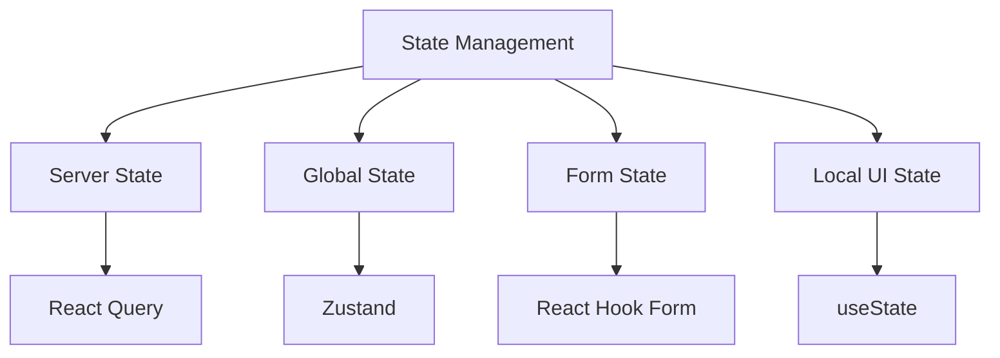

# State Management Guide

**Carmen's multi-layered state management strategy** using the right tool for each type of state.

## Document History

| Version | Date | Author | Changes |
|---------|------|--------|---------|
| 1.0.0 | 2025-11-19 | Documentation Team | Initial version |
---

## State Types



---

## 1. Server State (React Query)

**Purpose**: Data from API/database with caching and synchronization

**When to use**: Data from server that multiple components need

**Example**:
```typescript
'use client'

import { useQuery, useMutation, useQueryClient } from '@tanstack/react-query'

function usePurchaseRequests() {
  return useQuery({
    queryKey: ['purchase-requests'],
    queryFn: async () => {
      const response = await fetch('/api/purchase-requests')
      return response.json()
    },
    staleTime: 5 * 60 * 1000  // 5 minutes
  })
}

function useCreatePurchaseRequest() {
  const queryClient = useQueryClient()

  return useMutation({
    mutationFn: async (data: PurchaseRequestInput) => {
      const response = await fetch('/api/purchase-requests', {
        method: 'POST',
        body: JSON.stringify(data)
      })
      return response.json()
    },
    onSuccess: () => {
      // Invalidate and refetch
      queryClient.invalidateQueries({ queryKey: ['purchase-requests'] })
    }
  })
}
```

---

## 2. Global State (Zustand)

**Purpose**: Application-wide state (user context, theme, preferences)

**When to use**: State that persists across routes and needs global access

**Example - User Context**:
```typescript
import { create } from 'zustand'
import { persist } from 'zustand/middleware'

interface UserState {
  user: User | null
  activeRole: Role | null
  activeDepartment: Department | null
  activeLocation: Location | null

  setUser: (user: User | null) => void
  setActiveRole: (role: Role) => void
  setActiveDepartment: (dept: Department) => void
  setActiveLocation: (loc: Location) => void
}

export const useUserStore = create<UserState>()(
  persist(
    (set) => ({
      user: null,
      activeRole: null,
      activeDepartment: null,
      activeLocation: null,

      setUser: (user) => set({ user }),
      setActiveRole: (role) => set({ activeRole: role }),
      setActiveDepartment: (dept) => set({ activeDepartment: dept }),
      setActiveLocation: (loc) => set({ activeLocation: loc })
    }),
    {
      name: 'user-store'
    }
  )
)

// Usage in components
function SomeComponent() {
  const user = useUserStore(state => state.user)
  const setUser = useUserStore(state => state.setUser)

  return <div>{user?.name}</div>
}
```

**Example - Theme**:
```typescript
interface ThemeState {
  theme: 'light' | 'dark'
  setTheme: (theme: 'light' | 'dark') => void
}

export const useThemeStore = create<ThemeState>((set) => ({
  theme: 'light',
  setTheme: (theme) => set({ theme })
}))
```

---

## 3. Form State (React Hook Form)

**Purpose**: Form field values and validation

**When to use**: Any form with validation

**Example**:
```typescript
const form = useForm<PurchaseRequestInput>({
  resolver: zodResolver(purchaseRequestSchema),
  defaultValues: {
    request_date: new Date(),
    department_id: '',
    items: []
  }
})

// Access form state
const isSubmitting = form.formState.isSubmitting
const errors = form.formState.errors
const isDirty = form.formState.isDirty

// Programmatically set values
form.setValue('department_id', 'dept-123')
form.reset()
```

**📖 [Complete Form Guide](FORM-HANDLING.md)**

---

## 4. Local UI State (useState)

**Purpose**: Component-specific UI state

**When to use**: State that only matters within a single component

**Examples**:
```typescript
// Modal/dialog open state
const [isOpen, setIsOpen] = useState(false)

// Search term
const [searchTerm, setSearchTerm] = useState('')

// Selected tab
const [selectedTab, setSelectedTab] = useState('overview')

// Loading state
const [isLoading, setIsLoading] = useState(false)

// Expanded/collapsed state
const [isExpanded, setIsExpanded] = useState(false)
```

---

## Decision Matrix

| State Type | Tool | When to Use | Example |
|------------|------|-------------|---------|
| **Server Data** | React Query | Data from API/database | Purchase requests list |
| **Global App State** | Zustand | Cross-route state | Current user, theme |
| **Form State** | React Hook Form | Form fields + validation | Create purchase request |
| **Local UI** | useState | Component-only state | Modal open/close |

---

## Common Patterns

### Pattern 1: Server Data with Local Filter

```typescript
function PurchaseRequestList() {
  // Server data
  const { data: requests } = useQuery({
    queryKey: ['purchase-requests'],
    queryFn: getPurchaseRequests
  })

  // Local UI state for filtering
  const [searchTerm, setSearchTerm] = useState('')
  const [statusFilter, setStatusFilter] = useState<string | null>(null)

  // Combine
  const filteredRequests = useMemo(() => {
    return requests
      ?.filter(r => r.request_number.includes(searchTerm))
      ?.filter(r => !statusFilter || r.status === statusFilter)
  }, [requests, searchTerm, statusFilter])

  return <DataTable data={filteredRequests} />
}
```

### Pattern 2: Global User Context + Server Data

```typescript
function DepartmentPurchaseRequests() {
  // Global state
  const activeDepartment = useUserStore(state => state.activeDepartment)

  // Server data filtered by department
  const { data: requests } = useQuery({
    queryKey: ['purchase-requests', activeDepartment?.id],
    queryFn: () => getPurchaseRequests({ department_id: activeDepartment?.id }),
    enabled: !!activeDepartment
  })

  return <DataTable data={requests} />
}
```

### Pattern 3: Form with Optimistic Update

```typescript
function CreatePurchaseRequestForm() {
  const queryClient = useQueryClient()
  const form = useForm<PurchaseRequestInput>({...})

  const { mutate } = useMutation({
    mutationFn: createPurchaseRequest,
    onMutate: async (newRequest) => {
      // Cancel outgoing refetches
      await queryClient.cancelQueries({ queryKey: ['purchase-requests'] })

      // Snapshot previous value
      const previous = queryClient.getQueryData(['purchase-requests'])

      // Optimistically update
      queryClient.setQueryData(['purchase-requests'], (old: any[]) => [
        ...old,
        { ...newRequest, id: 'temp', status: 'DRAFT' }
      ])

      return { previous }
    },
    onError: (err, newRequest, context) => {
      // Rollback on error
      queryClient.setQueryData(['purchase-requests'], context?.previous)
    },
    onSettled: () => {
      // Refetch after error or success
      queryClient.invalidateQueries({ queryKey: ['purchase-requests'] })
    }
  })

  async function onSubmit(data: PurchaseRequestInput) {
    mutate(data)
  }

  return <Form {...form} onSubmit={onSubmit} />
}
```

---

## Best Practices

**✅ Do**:
- Use the right state management tool for the job
- Keep server state in React Query
- Use Zustand for global app state only
- Prefer local state when possible
- Use selectors to avoid unnecessary renders

**❌ Don't**:
- Put server data in Zustand
- Use global state for UI-only state
- Forget to handle loading/error states
- Skip memoization for expensive calculations

---

## Zustand Selectors (Performance)

**Bad** (re-renders on any user store change):
```typescript
const userStore = useUserStore()
const userName = userStore.user?.name
```

**Good** (re-renders only when name changes):
```typescript
const userName = useUserStore(state => state.user?.name)
```

---

## Related Documentation

- **[COMPONENT-PATTERNS.md](COMPONENT-PATTERNS.md)** - Component best practices
- **[FORM-HANDLING.md](FORM-HANDLING.md)** - Form patterns
- **[ARCHITECTURE-OVERVIEW.md](../ARCHITECTURE-OVERVIEW.md)** - Architecture

---

**🏠 [Back to Wiki](../WIKI-HOME.md)** | **🚀 [Getting Started](GETTING-STARTED.md)**
