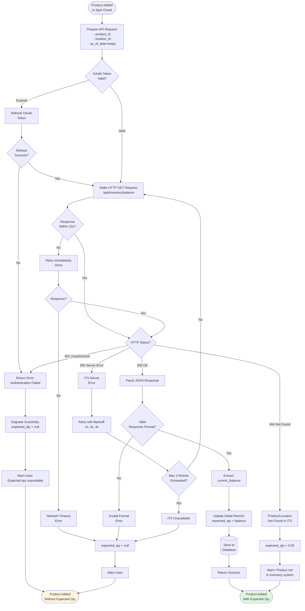

# Flow Diagrams: Spot Check

## Module Information
- **Module**: Inventory Management
- **Sub-Module**: Spot Check
- **Route**: `/app/(main)/inventory-management/spot-check`
- **Version**: 1.0.0
- **Last Updated**: 2025-01-11
- **Owner**: Inventory Management Team
- **Status**: Draft

## Document History
| Version | Date | Author | Changes |
|---------|------|--------|---------|
| 1.0.0 | 2025-01-11 | System | Initial version |

---

## Overview

This document provides visual representations of workflows, data flows, and system interactions for the Spot Check sub-module using Mermaid diagrams.

**Diagram Types**:
- **Process Flows**: End-to-end user workflows
- **Data Flows**: How data moves through the system
- **Sequence Diagrams**: Component interactions over time
- **State Diagrams**: Status transitions and rules
- **Integration Flows**: External system interactions

**Related Documents**:
- [Business Requirements](./BR-spot-check.md)
- [Use Cases](./UC-spot-check.md)
- [Technical Specification](./TS-spot-check.md)
- [Data Definition](./DD-spot-check.md)
- [Validations](./VAL-spot-check.md)

---

## High-Level Process Flow

### Complete Spot Check Lifecycle

---

## Detailed Process Flows

### 1. Create Spot Check Session

### 2. Add Products to Spot Check

### 3. Enter Counted Quantities

### 4. Review Variance and Complete

### 5. Supervisor Approval Flow

---

## Data Flow Diagrams

### Context Diagram: Spot Check System

### Detailed Data Flow: Complete Spot Check

---

## Sequence Diagrams

### Sequence: Create and Complete Spot Check

---

## State Diagrams

### Spot Check Status State Machine

### Product Detail Status Flow

---

## Integration Flow Diagrams

### Integration: Retrieve Expected Quantities from ITS

### Integration: Post Adjustments to ITS

---

## Component Interaction Diagram

### Frontend-Backend Interaction

---

## Error Handling Flow

### Error Recovery Flow

---

## Appendix

### Glossary

- **Spot Check**: Targeted inventory verification of selected products
- **Expected Quantity**: System-calculated inventory balance from ITS
- **Actual Quantity**: Physical count performed by storekeeper
- **Variance**: Difference between expected and actual quantities
- **High Variance**: Variance exceeding 5% or $100 threshold
- **ITS**: Inventory Transaction System (external integration)
- **Auto-Save**: Automatic periodic saving of entered data (every 30s)
- **Local Storage**: Browser-based temporary data storage for offline scenarios
- **Server Action**: Next.js function that runs on server, called from client
- **Optimistic UI**: Update UI immediately before server confirmation
- **Exponential Backoff**: Retry strategy with increasing wait times (1s, 2s, 4s)

### Diagram Conventions

**Color Coding**:
- Green: Successful completion, happy path
- Yellow: Warning, conditional path
- Red: Error, cancellation
- Blue: System/process box
- Gray: Database/storage

**Symbols**:
- Rectangle: Process step
- Diamond: Decision point
- Cylinder: Database/storage
- Circle: Start/end point
- Arrow: Data/control flow
- Dashed line: Optional/fallback path

---

**Document End**

> 📝 **Flow Diagram Summary**:
> - **Process Flows**: 6 detailed workflows (create, add products, enter quantities, review/complete, approval, error handling)
> - **Data Flows**: 2 diagrams (context, detailed completion flow)
> - **Sequence Diagrams**: 1 comprehensive sequence covering full lifecycle
> - **State Diagrams**: 2 state machines (spot check status, product detail status)
> - **Integration Flows**: 2 detailed integration diagrams (fetch expected qty, post adjustments)
> - **Component Interaction**: 1 architectural interaction diagram
> - **Total Diagrams**: 14 comprehensive Mermaid diagrams
