# Technical Specification: Spot Check

## Module Information
- **Module**: Inventory Management
- **Sub-Module**: Spot Check
- **Route**: `/app/(main)/inventory-management/spot-check`
- **Version**: 1.0.0
- **Last Updated**: 2025-01-11
- **Owner**: Inventory Management Team
- **Status**: Draft

## Document History
| Version | Date | Author | Changes |
|---------|------|--------|---------|
| 1.0.0 | 2025-01-11 | System | Initial version |

---

## Overview

The Spot Check sub-module implements a rapid, targeted inventory verification system using Next.js 14+ App Router with React Server Components. The technical implementation focuses on real-time variance calculation, auto-save functionality, and seamless integration with the Inventory Transaction System.

**Key Technical Features**:
- Real-time variance calculation with immediate visual feedback
- Auto-save with local storage fallback for offline scenarios
- Server-side validation with client-side optimistic UI
- Integration with Inventory Transaction System via REST API
- Role-based access control with location-based permissions

**⚠️ IMPORTANT**: This document describes implementation patterns in text format. No actual code is included. For data structures, see DD document.

**Related Documents**:
- [Business Requirements](./BR-spot-check.md)
- [Use Cases](./UC-spot-check.md)
- [Data Definition](./DD-spot-check.md)
- [Flow Diagrams](./FD-spot-check.md)
- [Validations](./VAL-spot-check.md)

---

## Architecture

### High-Level Architecture

The Spot Check module follows a three-tier architecture pattern:

```
┌─────────────────────────────────────────────────────────────┐
│                    Client Layer                             │
│  ┌──────────────┐  ┌──────────────┐  ┌──────────────┐     │
│  │  React Pages │  │ UI Components│  │Local Storage │     │
│  │   (RSC)      │  │  (Shadcn/ui) │  │  (Fallback)  │     │
│  └──────┬───────┘  └──────┬───────┘  └──────┬───────┘     │
└─────────┼──────────────────┼──────────────────┼─────────────┘
          │                  │                  │
          │ Server Actions   │ Client State     │ Cache
          │                  │                  │
┌─────────▼──────────────────▼──────────────────▼─────────────┐
│                 Application Layer                            │
│  ┌──────────────┐  ┌──────────────┐  ┌──────────────┐     │
│  │Server Actions│  │Business Logic│  │ Validation   │     │
│  │              │  │  & Workflows │  │   Engine     │     │
│  └──────┬───────┘  └──────┬───────┘  └──────┬───────┘     │
└─────────┼──────────────────┼──────────────────┼─────────────┘
          │                  │                  │
          │ Prisma Client    │ API Calls        │ Rules
          │                  │                  │
┌─────────▼──────────────────▼──────────────────▼─────────────┐
│                    Data Layer                                │
│  ┌──────────────┐  ┌──────────────┐  ┌──────────────┐     │
│  │  PostgreSQL  │  │ Inventory    │  │  Audit Log   │     │
│  │   (Prisma)   │  │ Transaction  │  │   System     │     │
│  │              │  │    System    │  │              │     │
│  └──────────────┘  └──────────────┘  └──────────────┘     │
└──────────────────────────────────────────────────────────────┘
```

**Key Architectural Decisions**:
1. **React Server Components (RSC)** for initial data loading reduces client-side bundle
2. **Server Actions** for mutations eliminate need for separate API routes
3. **Local Storage Fallback** ensures data persistence during network interruptions
4. **Prisma ORM** provides type-safe database access with transaction management
5. **REST API Integration** with Inventory Transaction System using OAuth 2.0

### Component Architecture

**Frontend Layer**:
- **Pages**: Server Components for initial rendering (list, detail, create, edit)
- **Client Components**: Interactive UI elements marked with 'use client' directive
- **Forms**: React Hook Form with Zod validation for type-safe form handling
- **State Management**: Zustand for global UI state, React Query for server state caching
- **UI Components**: Shadcn/ui primitives with custom styling

**Application Layer**:
- **Server Actions**: Handle mutations (create, update, delete, complete spot check)
- **Business Logic**: Variance calculation, approval workflows, status transitions
- **Validation Layer**: Three-tier validation (client, server, database)
- **Integration Client**: REST API wrapper for Inventory Transaction System

**Data Layer**:
- **Database**: PostgreSQL via Supabase with Prisma ORM
- **Tables**: Shares tb_count_stock and tb_count_stock_detail with Physical Count Management
- **External Integration**: Inventory Transaction System for expected quantities and adjustment posting

---

## Technology Stack

### Frontend
- **Framework**: Next.js 14.2+ with App Router
- **UI Library**: React 18+
- **Language**: TypeScript 5.8+
- **Styling**: Tailwind CSS 3.4+, Shadcn/ui components
- **State Management**: Zustand 4.5+ (global state), React Query 5.0+ (server state)
- **Form Handling**: React Hook Form 7.50+, Zod 3.22+ (validation)
- **Icons**: Lucide React 0.300+
- **Date Handling**: date-fns 3.0+

### Backend
- **Runtime**: Node.js 20.14.0+
- **Framework**: Next.js Server Actions (mutations), API Routes (if needed)
- **Database**: PostgreSQL 14+ via Supabase
- **ORM**: Prisma 5.8+
- **Authentication**: Supabase Auth with Row-Level Security
- **API Client**: Native fetch with retry logic and exponential backoff

### Testing
- **Unit Tests**: Vitest 1.0+
- **E2E Tests**: Playwright 1.40+
- **API Tests**: Built-in Next.js testing utilities

### DevOps
- **Version Control**: Git with GitHub
- **CI/CD**: GitHub Actions (automated testing, linting, deployment)
- **Hosting**: Vercel (Next.js optimized hosting)
- **Monitoring**: Vercel Analytics, Sentry (error tracking)

---

## Component Structure

### Directory Structure

```
app/(main)/inventory-management/spot-check/
├── page.tsx                          # List page (Server Component)
├── [id]/
│   ├── page.tsx                      # Detail page (Server Component)
│   ├── add-products/
│   │   └── page.tsx                  # Add products screen
│   ├── enter-quantities/
│   │   └── page.tsx                  # Enter quantities screen
│   ├── review-variance/
│   │   └── page.tsx                  # Review variance screen
│   ├── complete/
│   │   └── page.tsx                  # Completion screen
│   └── approve/
│       └── page.tsx                  # Approval screen (supervisor)
├── new/
│   └── page.tsx                      # Create new spot check
├── templates/
│   └── page.tsx                      # Template management (future)
├── components/
│   ├── SpotCheckList.tsx             # List component with filters
│   ├── SpotCheckCard.tsx             # Summary card component
│   ├── ProductSearch.tsx             # Product search and add component
│   ├── QuantityEntryForm.tsx         # Quantity entry with auto-save
│   ├── VarianceTable.tsx             # Variance display with status indicators
│   ├── ApprovalDialog.tsx            # High variance approval dialog
│   ├── CancellationDialog.tsx        # Cancellation confirmation
│   └── SpotCheckFilters.tsx          # List filtering component
├── actions.ts                        # Server actions for mutations
├── api.ts                            # API client for ITS integration
├── types.ts                          # TypeScript type definitions
├── hooks/
│   ├── useSpotCheck.ts               # Spot check data management hook
│   ├── useProductSearch.ts           # Product search hook
│   ├── useAutoSave.ts                # Auto-save functionality hook
│   └── useVarianceCalculation.ts     # Real-time variance calculation hook
└── utils/
    ├── variance.ts                   # Variance calculation utilities
    ├── validation.ts                 # Client-side validation functions
    └── formatting.ts                 # Data formatting utilities
```

### Key Components

#### SpotCheckList Component
**File**: `components/SpotCheckList.tsx`
**Type**: Client Component ('use client')
**Purpose**: Display paginated, filterable list of spot checks

**Responsibilities**:
- Render spot check list with sortable columns (number, date, location, status, variance)
- Handle filtering by date range, location, status, product
- Manage search functionality with debouncing (300ms)
- Display summary statistics (total, completed, variance rate)
- Provide row actions (view, cancel, export)
- Handle pagination with configurable page sizes (10, 25, 50, 100)

**State Management**:
- Uses React Query for server state (list data, caching, refetching)
- Uses Zustand for UI state (filters, sort order, selected items)
- Implements optimistic updates for status changes

**Props**:
- initialData: Spot check array from server pre-rendering
- userPermissions: User's location access and role information

#### QuantityEntryForm Component
**File**: `components/QuantityEntryForm.tsx`
**Type**: Client Component
**Purpose**: Interactive form for entering actual quantities with real-time variance calculation

**Responsibilities**:
- Display product list with expected quantities
- Provide numeric input fields with validation (>= 0, max 2 decimals)
- Calculate variance quantity and percentage on input change (debounced 300ms)
- Show visual variance indicators (green=match, yellow=small, red=high)
- Auto-save entered data every 30 seconds
- Store data in local storage as fallback
- Support barcode scanner input
- Display progress indicator (e.g., "8 of 10 counted")

**State Management**:
- Uses React Hook Form for form state and validation
- Uses custom useAutoSave hook for periodic saves
- Uses custom useVarianceCalculation hook for real-time calculations
- Implements local storage persistence via useEffect

**Validation**:
- Client-side: Zod schema validation (non-negative, 2 decimal max)
- Server-side: Validation on auto-save and manual save
- Visual feedback: Inline error messages below each field

#### VarianceTable Component
**File**: `components/VarianceTable.tsx`
**Type**: Client Component
**Purpose**: Display variance analysis with sorting, filtering, and notes

**Responsibilities**:
- Render product variance data in table format
- Apply color coding (green/yellow/red) based on variance thresholds
- Support sorting by variance percentage, value, product name
- Filter by variance status (all, match, small variance, high variance)
- Display aggregate statistics (total items, items with variance, total variance value)
- Allow adding notes to explain variances
- Highlight items requiring supervisor approval

**Features**:
- Collapsible notes section for each product
- Export to CSV functionality
- Recount action for individual products

#### ApprovalDialog Component
**File**: `components/ApprovalDialog.tsx`
**Type**: Client Component
**Purpose**: Modal dialog for supervisor approval of high variance items

**Responsibilities**:
- Display high variance item details (product, expected, actual, variance, notes)
- Provide approve/reject/request recount actions
- Require additional notes for approval decisions
- Submit approval decision via Server Action
- Update UI optimistically on approval

**Dialog Flow**:
1. Triggered by "Approve" button in variance review
2. Display variance details with requester's explanation
3. Supervisor reviews and makes decision
4. On approve: Record approval, notify requester, allow spot check completion
5. On reject: Record rejection with reason, notify requester
6. On request recount: Flag item, notify storekeeper

---

## Sitemap

### Page Hierarchy

```mermaid
graph TD
    A["Spot Check Module"] --> B["List Page"]
    A --> C["Create Page"]
    A --> D["Detail Page"]
    A --> E["Approval Queue"]

    B --> B1["All Spot Checks Tab"]
    B --> B2["Pending Tab"]
    B --> B3["In Progress Tab"]
    B --> B4["Completed Tab"]

    C --> C1["Select Location"]
    C --> C2["Add Products Screen"]
    C --> C3["Enter Quantities Screen"]
    C --> C4["Review Variance Screen"]
    C --> C5["Complete Screen"]

    D --> D1["Overview Tab"]
    D --> D2["Variance Details Tab"]
    D --> D3["Approval History Tab"]

    E --> E1["High Variance Items Tab"]

    B --> BD1["Filter Dialog"]
    B --> BD2["Export Dialog"]

    C2 --> CD1["Product Search Dialog"]
    C2 --> CD2["Add by Category Dialog"]

    C4 --> CD3["Add Note Dialog"]
    C4 --> CD4["Recount Confirm Dialog"]

    C5 --> CD5["Completion Confirm Dialog"]

    D --> DD1["Cancel Confirm Dialog"]

    E --> ED1["Approval Dialog"]
    E --> ED2["Rejection Dialog"]
```



### Pages

#### 1. List Page
**Route**: `/app/(main)/inventory-management/spot-check`
**File**: `page.tsx`
**Type**: Server Component with Client Components for interactivity

**Purpose**: Display all spot checks with filtering, sorting, and search

**Sections**:
- Header: "Spot Checks" title, breadcrumbs, "Create New" button
- Summary Cards: Total spot checks, Pending, In Progress, Completed (with variance stats)
- Filters Bar: Date range picker, location selector, status filter, search box
- Data Table: Sortable columns with spot check details
- Pagination: Page size selector, page navigation controls

**Tabs**:
- **All Spot Checks**: Shows all spot checks user has access to (default view)
- **Pending**: Spot checks in pending status (created, products added, not started)
- **In Progress**: Spot checks currently being conducted
- **Completed**: Completed spot checks with final variance data

**Dialogs**:
- **Filter Dialog**: Advanced filters (multiple locations, date presets, product filter)
- **Export Dialog**: Export options (CSV, Excel, PDF) with field selection

**Server Data Fetching**:
- Pre-renders list data using Prisma query in Server Component
- Applies user's location permissions via where clause
- Includes related location and creator user data
- Sorts by created date descending by default

**Navigation**:
- Click row → Detail Page
- "Create New" button → Create Page
- "View" action → Detail Page
- "Cancel" action → Opens Cancel Confirm Dialog

---

#### 2. Create Page (Multi-Step Flow)

**Route**: `/app/(main)/inventory-management/spot-check/new`
**File**: `new/page.tsx`

**Purpose**: Create new spot check session

**Flow**:
1. Select location and enter description
2. Submit to create spot check record
3. Redirect to Add Products screen

**Fields**:
- Location (required, dropdown filtered by user access)
- Description (optional, max 500 characters)

**Validation**:
- Location required
- User must have access to selected location
- No other validation on creation (lightweight)

**Server Action**: createSpotCheck
- Validates location access
- Generates spot check number (SPOT-YYYY-NNNNNN)
- Sets count_stock_type = 'spot'
- Sets status = 'pending'
- Records created_by user ID

---

#### 3. Add Products Screen

**Route**: `/app/(main)/inventory-management/spot-check/[id]/add-products`
**File**: `[id]/add-products/page.tsx`

**Purpose**: Select products to include in spot check

**Sections**:
- Header: Spot check number, location, "Start Counting" button
- Product List: Currently added products with expected quantities
- Product Search: Search box with autocomplete
- Category Selector: Browse by product category
- Progress Indicator: "5 of 50 products added" (50 is configurable limit)

**Dialogs**:
- **Product Search Dialog**: Modal with search, results, "Add" actions
- **Add by Category Dialog**: Category tree, select multiple products, "Add Selected" button

**Functionality**:
- Search products by name or code with debounced API call (300ms)
- Add products individually or by category
- Display expected quantity from ITS integration (async, shows loading state)
- Remove products from list before starting
- Validate max 50 products limit
- "Start Counting" button changes status to 'in_progress', redirects to Enter Quantities

**Server Actions**:
- addProductToSpotCheck: Adds single product, fetches expected quantity
- addProductsByCategory: Adds multiple products from category
- removeProductFromSpotCheck: Removes product from detail list

---

#### 4. Enter Quantities Screen

**Route**: `/app/(main)/inventory-management/spot-check/[id]/enter-quantities`
**File**: `[id]/enter-quantities/page.tsx`

**Purpose**: Enter actual physical quantities for each product

**Sections**:
- Header: Spot check number, location, progress indicator
- Product Table: Product name, expected qty, actual qty input, variance (live calculated)
- Actions: "Save Draft" button, "Next" button (validates all counted)

**Features**:
- Auto-save every 30 seconds (visual indicator "Saving..." → "Saved")
- Local storage persistence (fallback for network issues)
- Real-time variance calculation on input change (debounced 300ms)
- Color-coded variance indicators (green/yellow/red)
- Barcode scanner support (focuses matching product input)
- "Skip" action for unavailable products

**Validation**:
- Client-side: Non-negative, max 2 decimals
- Server-side: Same validations on save
- Prevents "Next" until all products have actual_qty or marked skipped

**Server Actions**:
- updateActualQuantity: Saves single product actual quantity, calculates variance
- autoSaveQuantities: Batch save of multiple products (auto-save)
- markProductSkipped: Sets note for skipped product

---

#### 5. Review Variance Screen

**Route**: `/app/(main)/inventory-management/spot-check/[id]/review-variance`
**File**: `[id]/review-variance/page.tsx`

**Purpose**: Review variance analysis before completion

**Sections**:
- Header: Spot check number, location
- Summary Stats: Total products, items with variance, high variance items, total variance value
- Variance Table: Product, expected, actual, variance qty, variance %, notes, status
- Filters: All items, High variance only, Items without notes
- Actions: "Export to CSV", "Recount Product", "Add Note", "Proceed to Complete"

**Dialogs**:
- **Add Note Dialog**: Modal with text area for variance explanation (especially for high variance)
- **Recount Confirm Dialog**: Confirmation before returning to Enter Quantities for specific product

**High Variance Handling**:
- Items with variance > 5% OR variance value > $100 highlighted in red
- "Requires Approval" badge displayed
- System prevents direct completion, shows "Submit for Approval" button instead

**Server Actions**:
- addVarianceNote: Adds note to specific product detail
- requestRecount: Flags product for recount, redirects to Enter Quantities

---

#### 6. Complete Screen

**Route**: `/app/(main)/inventory-management/spot-check/[id]/complete`
**File**: `[id]/complete/page.tsx`

**Purpose**: Final confirmation before completing spot check

**Sections**:
- Header: "Complete Spot Check" title
- Summary Card: Spot check details, total products, variance summary
- Confirmation Message: "This will post inventory adjustments and update stock levels. Continue?"
- Item List: Products with variance (adjustments to be posted)
- Actions: "Confirm Completion" button, "Cancel" button

**Validation**:
- All products must be counted
- High variance items must be approved
- User must have 'complete_spot_check' permission

**Server Action**: completeSpotCheck
- Validates completion requirements
- Sets end_date = current timestamp
- For each product with variance:
  - Calls ITS API to post adjustment transaction
  - Records adjustment_transaction_id
  - Sets adjustment_posted = true
- Sets status = 'completed'
- Logs completion event
- Sends notification to supervisor/manager
- Redirects to Detail Page (read-only)

**Error Handling**:
- ITS unavailable: Queues adjustments, sets status = 'pending_adjustment_post'
- Partial success: Commits successful, retries failed, notifies manager
- Business rule violation: Flags product, notifies manager for manual resolution

---

#### 7. Detail Page

**Route**: `/app/(main)/inventory-management/spot-check/[id]`
**File**: `[id]/page.tsx`
**Type**: Server Component

**Purpose**: Read-only view of completed or cancelled spot check

**Sections**:
- Header: Spot check number, location, status badge, dates
- Summary Card: Products counted, total variance, high variance items
- Product Table: All products with expected, actual, variance, notes
- Approval History: Supervisor approval records for high variance items
- Activity Log: Created by, completed by, timestamps, cancellation info (if applicable)

**Tabs**:
- **Overview**: Main details and summary statistics
- **Variance Details**: Full product table with all variance data
- **Approval History**: High variance approval workflow records (if applicable)

**Actions** (if applicable):
- **Cancel** button: Available only if status = 'pending' or 'in_progress' AND user is supervisor+
- **Export** button: Export spot check data to CSV/Excel

**Dialogs**:
- **Cancel Confirm Dialog**: Requires cancellation reason (dropdown + notes)

**Server Data Fetching**:
- Fetches spot check with all details using Prisma include
- Includes related product, location, user information
- Read-only after completion (no edit actions)

---

#### 8. Approval Queue Page

**Route**: `/app/(main)/inventory-management/spot-check/approve`
**File**: `approve/page.tsx`
**Type**: Server Component with Client interactions

**Purpose**: Supervisor view of spot checks requiring high variance approval

**Sections**:
- Header: "Approval Queue" title, filter by location
- Summary Stats: Pending approvals, average variance, oldest pending
- Approval List: Spot checks with high variance items awaiting approval
- Quick Actions: "Approve All", "View Details", "Request Recount"

**Tabs**:
- **High Variance Items**: Items requiring approval across all spot checks

**List Columns**:
- Spot Check Number, Location, Product, Expected, Actual, Variance, Requester, Date, Notes

**Dialogs**:
- **Approval Dialog**: Display variance details, add approval notes, approve/reject actions
- **Rejection Dialog**: Require rejection reason, optional guidance for requester
- **Request Recount Dialog**: Optional notes for recount request

**Server Actions**:
- approveHighVarianceItem: Records approval, updates product detail, notifies requester
- rejectHighVarianceItem: Records rejection with reason, notifies requester
- requestRecount: Flags item for recount, notifies storekeeper

**Notification**:
- In-app notification badge on approval queue link
- Email notification for new approval requests (configurable)

---

## Data Flow

### 1. Create Spot Check Flow

**User Action**: User selects location and clicks "Create"

**Client-Side**:
1. User fills form with location selection
2. Form validation (location required)
3. Submit triggers Server Action

**Server-Side**:
4. Server Action receives location_id
5. Validates user has access to location (RLS check)
6. Generates unique spot check number using sequence pattern
7. Creates record in tb_count_stock:
   - count_stock_type = 'spot'
   - doc_status = 'pending'
   - start_date = current timestamp
   - created_by = user ID
8. Returns spot check ID to client

**Client-Side**:
9. Receives spot check ID
10. Redirects to Add Products screen with spot check ID in route

**Data Persistence**:
- Spot check session record created in tb_count_stock
- No product details yet (tb_count_stock_detail remains empty)

---

### 2. Add Products Flow

**User Action**: User searches for product and clicks "Add"

**Client-Side**:
1. User enters search term
2. Debounced search (300ms) triggers product query
3. Display search results
4. User clicks "Add" on product

**Server-Side** (Add Product):
5. Server Action receives spot_check_id and product_id
6. Validates product not already in spot check
7. Creates detail record in tb_count_stock_detail:
   - count_stock_id = spot check ID
   - product_id = selected product ID
   - sequence_no = auto-incremented
   - expected_qty = null (initially)
   - actual_qty = null
   - is_counted = false
8. Returns detail record to client

**Integration** (Fetch Expected Quantity):
9. Server Action calls ITS API GET /api/inventory/balance
10. Passes product_id, location_id, as_of_date=today
11. ITS returns current balance
12. Server updates detail record expected_qty = returned balance
13. Returns updated detail to client

**Client-Side**:
14. Receives detail record with expected quantity
15. Updates local state
16. Displays product in list with expected quantity

**Error Handling**:
- ITS unavailable: Set expected_qty = null, display warning, allow proceeding
- Product already added: Display error, don't create duplicate
- Max products reached: Display error, prevent adding more

---

### 3. Enter Quantities Flow

**User Action**: User enters actual quantity for product

**Client-Side** (Real-Time Calculation):
1. User types actual quantity in input field
2. onChange event triggers with debounce (300ms)
3. Client-side variance calculation:
   - variance_qty = actual_qty - expected_qty
   - variance_pct = (variance_qty / expected_qty) * 100
4. Update UI with calculated variance
5. Apply color coding (green/yellow/red)
6. Mark is_counted = true

**Client-Side** (Auto-Save):
7. Auto-save timer (30 seconds) triggers
8. Collects all modified product quantities
9. Stores in local storage (fallback)
10. Calls Server Action with batch update

**Server-Side** (Auto-Save):
11. Server Action receives array of quantity updates
12. For each product:
    - Validates actual_qty >= 0, max 2 decimals
    - Calculates variance_qty and variance_pct
    - Updates tb_count_stock_detail record
13. Returns success status

**Client-Side**:
14. Receives save confirmation
15. Displays "Saved" indicator
16. Clears local storage for saved items

**Error Handling**:
- Network failure: Keep data in local storage, retry on next interval
- Validation failure: Display inline error, don't save invalid data
- Session timeout: Preserve local storage, prompt re-login, restore data after login

---

### 4. Complete Spot Check Flow

**User Action**: User clicks "Complete Spot Check" after reviewing variances

**Client-Side**:
1. User confirms completion in dialog
2. Display progress indicator
3. Call Server Action to complete

**Server-Side** (Validation):
4. Server Action validates:
   - All products have is_counted = true
   - High variance items have approved = true
   - User has 'complete_spot_check' permission
5. If validation fails, return error to client

**Server-Side** (Completion):
6. Set end_date = current timestamp
7. Begin transaction

**Integration** (Post Adjustments):
8. For each product with variance_qty != 0:
   - Prepare adjustment payload
   - Call ITS API POST /api/inventory/adjustment
   - Parameters: product_id, location_id, adjustment_qty, reason='spot_check', reference_no=spot_check_no
   - ITS creates adjustment transaction
   - ITS updates inventory balance
   - ITS returns transaction_id
   - Update detail record:
     - adjustment_transaction_id = returned transaction_id
     - adjustment_posted = true
9. Commit transaction
10. Set spot check status = 'completed'
11. Log completion event
12. Send notification to supervisor/manager

**Client-Side**:
13. Receive completion success
14. Display success message
15. Redirect to Detail Page (read-only)

**Error Handling**:
- ITS unavailable: Set status = 'pending_adjustment_post', queue for retry, notify user
- Partial success: Commit successful, log failed, queue failed for retry
- Business rule violation: Flag product, notify manager, partial completion
- Transaction rollback: Restore original state, log error, alert operations

---

### 5. Approval Flow

**User Action**: Supervisor receives notification, clicks approval link

**Client-Side**:
1. Supervisor navigates to Approval Queue or specific spot check
2. Opens Approval Dialog for high variance item
3. Reviews variance details and requester notes
4. Adds own notes and clicks "Approve" or "Reject"

**Server-Side** (Approval):
5. Server Action receives approval decision
6. Validates user has supervisor role
7. Updates tb_count_stock_detail record:
   - Sets approved = true/false
   - Records approved_by = supervisor user ID
   - Records approved_at = current timestamp
   - Stores approval_notes in info JSON field
8. If all high variance items approved:
   - Updates spot check info.supervisor_approved = true
9. Sends notification to requester
10. Returns success status

**Client-Side**:
11. Receives approval confirmation
12. Updates UI optimistically
13. Displays success message
14. If all approved, enables "Complete Spot Check" button

**Integration** (Notification):
15. Notification Service sends email/in-app notification
16. Requester receives "Approval granted" notification with link

**Error Handling**:
- Permission denied: Display error, don't allow approval
- Concurrent approval: Handle with optimistic locking (updated_at check)
- Notification failure: Queue notification for retry, log warning

---

## State Management

### Global State (Zustand)

**SpotCheckStore**: Manages UI state across spot check workflows

**State Structure** (described in text, not code):
- filters: Current filter selections (date range, location, status, search term)
- sortConfig: Current sort column and direction
- selectedItems: Array of selected spot check IDs for bulk actions
- draftData: Temporary storage for form data during creation/editing
- uiState: Loading indicators, error messages, toast notifications

**Actions** (described in text):
- setFilters: Updates filter state and triggers refetch
- setSortConfig: Updates sort configuration
- toggleSelectItem: Adds/removes item from selection
- clearSelection: Clears all selected items
- updateDraftData: Stores draft form data for persistence
- setLoading: Controls loading state for async operations
- showToast: Displays temporary notification message

### Server State (React Query)

**Query Keys**: Organized hierarchically for efficient caching and invalidation

Structure:
- ['spotChecks', 'list', filters]: List of spot checks with filter cache key
- ['spotChecks', 'detail', id]: Individual spot check details
- ['spotChecks', 'products', id]: Products for specific spot check
- ['spotChecks', 'variance', id]: Variance data for specific spot check
- ['spotChecks', 'approvalQueue']: High variance items awaiting approval

**Query Configuration**:
- staleTime: 5 minutes (data considered fresh for 5 minutes)
- cacheTime: 30 minutes (cache retained for 30 minutes after last use)
- refetchOnWindowFocus: true for list queries, false for detail queries
- retry: 3 attempts with exponential backoff

**Mutations**:
- createSpotCheck: Invalidates ['spotChecks', 'list'] on success
- addProduct: Invalidates ['spotChecks', 'products', id] on success
- updateQuantity: Optimistic update, invalidates on error
- completeSpotCheck: Invalidates ['spotChecks', 'list'] and ['spotChecks', 'detail', id]
- approveVariance: Invalidates ['spotChecks', 'approvalQueue'] and ['spotChecks', 'detail', id]

**Optimistic Updates**:
- Quantity entry: Update local cache immediately, revert on error
- Status changes: Update status in cache, revert on error
- Product addition: Add to list immediately, remove on error

### Form State (React Hook Form)

**SpotCheckForm**: Manages spot check creation and editing

**Form Fields** (described in text):
- location_id: Required, validated against user's accessible locations
- description: Optional, max 500 characters

**Validation Mode**: onBlur (validate on field blur for better UX)
**Revalidation Mode**: onChange (revalidate on change after first validation)

**QuantityEntryForm**: Manages actual quantity inputs

**Form Fields** (described in text):
- Array of quantity inputs, one per product
- Each field: actual_qty (non-negative, max 2 decimals)

**Dynamic Validation**:
- Zod schema generated dynamically based on number of products
- Custom validators for decimal precision and non-negative constraint

**Error Handling**:
- Field-level errors displayed inline below each input
- Form-level errors displayed in toast notification
- Async validation errors from server merged with client validation

### Local Storage Persistence

**Purpose**: Fallback for network interruptions during quantity entry

**Storage Keys**:
- spotCheck_{id}_quantities: Stored quantity data for specific spot check
- spotCheck_{id}_lastSaved: Timestamp of last successful save
- spotCheck_{id}_pendingSave: Flag indicating unsaved changes

**Data Structure** (JSON):
```
Key: spotCheck_550e8400_quantities
Value: {
  "660e8400-product1": { actual_qty: 95.00, timestamp: "2024-01-15T10:30:00Z" },
  "660e8400-product2": { actual_qty: 42.50, timestamp: "2024-01-15T10:31:00Z" }
}
```

**Synchronization**:
- On successful auto-save: Clear local storage for saved items
- On page load: Check local storage, restore unsaved data if exists
- On successful manual save: Clear all local storage for spot check
- On session timeout: Preserve local storage, restore after re-login

**Cleanup**:
- On spot check completion: Delete all local storage for that spot check
- On spot check cancellation: Delete all local storage
- On browser close: Retain data for session recovery
- Periodic cleanup: Remove data older than 7 days

---

## API Integration

### Inventory Transaction System (ITS) Integration

**Base URL**: Configured in environment variables (NEXT_PUBLIC_ITS_API_URL)
**Authentication**: OAuth 2.0 Bearer token
**Protocol**: REST over HTTPS
**Data Format**: JSON

#### Retrieve Expected Quantities

**Endpoint**: GET /api/inventory/balance
**Purpose**: Fetch current inventory balance for product at location
**Trigger**: When product added to spot check

**Request Parameters**:
- product_id (UUID, required): Product identifier
- location_id (UUID, required): Storage location identifier
- as_of_date (ISO 8601 date, optional): Date for balance calculation (default: today)

**Request Headers**:
- Authorization: Bearer {oauth_token}
- Content-Type: application/json
- X-Request-ID: {unique_request_id} (for tracing)

**Response Format** (Success):
- status: "success"
- data object containing:
  - product_id: UUID
  - location_id: UUID
  - current_balance: decimal (15,2)
  - unit_id: UUID
  - unit_name: string
  - last_transaction_date: ISO 8601 datetime or null
  - last_transaction_type: string or null

**Response Format** (Error):
- status: "error"
- error object containing:
  - code: Error code (PRODUCT_NOT_FOUND, LOCATION_NOT_FOUND, etc.)
  - message: Human-readable error message
  - details: Additional context information

**Error Handling**:
- 200 OK: Process balance data normally
- 404 Not Found: Product/location not found, set expected_qty = null, warn user
- 401 Unauthorized: Token expired, refresh token, retry once
- 500 Server Error: ITS unavailable, set expected_qty = null, queue for retry
- Network timeout (10s): Retry once immediately, then degrade gracefully

**Retry Logic**:
- Max retries: 3
- Backoff strategy: Exponential (1s, 2s, 4s)
- Retry on: 408 Timeout, 429 Rate Limit, 502 Bad Gateway, 503 Service Unavailable
- Don't retry: 400 Bad Request, 401 Unauthorized, 403 Forbidden, 404 Not Found

#### Post Inventory Adjustments

**Endpoint**: POST /api/inventory/adjustment
**Purpose**: Create inventory adjustment transaction to correct stock levels
**Trigger**: When spot check completed

**Request Body**:
- transaction_type: "adjustment" (constant)
- product_id: UUID (required)
- location_id: UUID (required)
- adjustment_qty: decimal (15,2) (required, can be negative)
- reason: "spot_check" (constant)
- reference_type: "spot_check" (constant)
- reference_no: Spot check number (required)
- notes: Variance explanation (optional, max 1000 chars)
- posted_by: User ID (required)
- posted_at: ISO 8601 datetime (required)

**Request Headers**:
- Authorization: Bearer {oauth_token}
- Content-Type: application/json
- X-Request-ID: {unique_request_id}
- X-Idempotency-Key: {spot_check_id}_{product_id} (prevents duplicate posting)

**Response Format** (Success):
- status: "success"
- data object containing:
  - transaction_id: UUID (adjustment transaction ID)
  - transaction_no: String (human-readable transaction number)
  - previous_balance: decimal (15,2)
  - adjustment_qty: decimal (15,2)
  - new_balance: decimal (15,2)
  - posted_at: ISO 8601 datetime

**Response Format** (Business Rule Violation):
- status: "error"
- error object containing:
  - code: INSUFFICIENT_STOCK, PRODUCT_INACTIVE, etc.
  - message: Violation description
  - details: Additional context
  - product_id, location_id: For identification

**Error Handling**:
- 200 OK: Record transaction_id, mark adjustment_posted = true
- 400 Bad Request: Business rule violation, flag product, notify manager
- 401 Unauthorized: Refresh token, retry once
- 409 Conflict: Concurrent update, retry with latest balance
- 422 Unprocessable: Business rule violation, log and notify manager
- 500 Server Error: Retry with backoff, queue for background retry if exhausted
- 503 Service Unavailable: Queue for background retry, notify user

**Retry Logic**:
- Max retries: 3
- Backoff strategy: Exponential (1s, 2s, 4s)
- Retry on: 408, 429, 502, 503
- Don't retry: 400, 422 (business rule violations)
- Idempotency: Use X-Idempotency-Key to prevent duplicate adjustments on retry

**Batch Processing** (Optimization):
- If > 10 products with variance, use batch endpoint
- Endpoint: POST /api/inventory/adjustment/batch
- Payload: Array of adjustment objects
- Response: Array of transaction results (success/failure per item)
- Atomic: All succeed or all rolled back (depending on ITS configuration)

### OAuth 2.0 Authentication Flow

**Token Acquisition**:
1. Application starts: Retrieve stored refresh token from secure storage
2. Check token expiry: If access token expired, refresh it
3. Refresh token: POST /oauth/token with grant_type=refresh_token
4. Store new access token: Cache in memory for subsequent requests
5. Store new refresh token: Persist securely for next application start

**Token Refresh**:
- Triggered: On 401 Unauthorized response from ITS API
- Process: Exchange refresh token for new access and refresh tokens
- Retry: Retry original request with new access token
- Failure: If refresh fails, redirect to re-authentication flow

**Token Storage**:
- Access Token: In-memory only, expires after 1 hour
- Refresh Token: Secure HTTP-only cookie, expires after 30 days
- Never: Store tokens in local storage or session storage (security risk)

**Security Considerations**:
- All API calls over HTTPS only
- Tokens never exposed in URLs or logs
- Automatic token refresh before expiry when possible
- Secure token storage with encryption at rest

---

## Security Implementation

### Authentication & Authorization

**Authentication**: Supabase Auth with JWT tokens
- Users authenticate via Supabase Auth (email/password, OAuth providers)
- JWT token stored in HTTP-only cookie
- Token validated on every Server Action and API Route

**Authorization**: Role-Based Access Control (RBAC) with location-based permissions
- User roles: Storekeeper, Inventory Coordinator, Supervisor, Manager
- Location assignments: Users assigned to specific locations
- Permission matrix (described in text):
  - Storekeeper: Create, enter quantities for own locations
  - Coordinator: Create, manage for own locations
  - Supervisor: Approve high variance, cancel, view own locations
  - Manager: View all locations, analytics

**Row-Level Security (RLS)**:
- Implemented at database level using PostgreSQL RLS policies
- Policies filter queries based on user's location assignments
- Example policy (described in text):
  - SELECT: User can view spot checks for locations they have access to
  - INSERT: User can create spot checks for locations they have access to
  - UPDATE: User can modify spot checks they created OR have supervisor role
  - DELETE: Not allowed (soft delete only)

### Data Protection

**Encryption**:
- Data at rest: PostgreSQL encryption via Supabase
- Data in transit: HTTPS/TLS 1.3 for all API calls
- Sensitive fields: None (no PII or financial data in spot check records)

**Data Privacy**:
- User data: Only user ID stored, no email or personal information in audit fields
- Location data: Only location ID and name (public within organization)
- Product data: Only product ID, code, name (not sensitive)

**Audit Trail**:
- All spot check actions logged: created_by, updated_by, created_date, updated_date
- Approval decisions recorded: approved_by, approved_at, approval_notes
- Status changes tracked: workflow_history JSON field stores all transitions
- Soft delete: deleted_at timestamp preserves audit trail

### Input Validation

**Client-Side Validation** (React Hook Form + Zod):
- Location ID: Required, valid UUID format
- Actual quantity: Non-negative number, max 2 decimal places
- Description: Max 500 characters, no special characters
- Notes: Max 1000 characters, no XSS vectors

**Server-Side Validation** (Server Actions):
- All client validations re-applied on server
- Business rule validation: One active count per location (if configured), max 50 products
- Data type validation: UUID format, numeric ranges, string lengths
- Authorization validation: User has permission to perform action

**Database Validation** (PostgreSQL Constraints):
- Foreign key constraints: location_id, product_id, count_stock_id references
- Check constraints: actual_qty >= 0, variance fields calculated correctly
- NOT NULL constraints: Required fields enforced at database level
- Unique constraints: count_stock_no unique across all spot checks

**Sanitization**:
- All user input sanitized before storage using parameterized queries (Prisma)
- HTML/JavaScript stripped from text fields before rendering
- No dynamic SQL generation (prevents SQL injection)

### XSS Prevention

**Output Encoding**:
- All user-generated content escaped before rendering
- React JSX automatically escapes by default
- Explicit escaping for innerHTML usage (avoided when possible)

**Content Security Policy (CSP)**:
- Configured in Next.js middleware
- Restricts script sources to same origin and trusted CDNs
- Prevents inline script execution
- Blocks unsafe-eval and unsafe-inline

### CSRF Protection

**Protection Mechanism**:
- Next.js Server Actions include automatic CSRF protection
- Tokens validated on every mutation request
- SameSite cookie attribute set to 'lax' or 'strict'

---

## Performance Optimization

### Initial Load Performance

**Server-Side Rendering (SSR)**:
- List page pre-rendered on server with initial data
- Reduces time-to-interactive by avoiding client-side data fetching
- Provides instant content display (Largest Contentful Paint < 2.5s)

**Code Splitting**:
- Automatic route-based code splitting via Next.js
- Large components (ApprovalDialog, VarianceTable) lazy-loaded
- Shadcn/ui components tree-shaken to include only used components
- Bundle size target: < 500KB initial load, < 2MB total

**Image Optimization**:
- No images in spot check module (text and data only)
- Product images (if added) served via Next.js Image component with lazy loading

**Font Optimization**:
- System fonts used (no custom web fonts)
- No font loading delay (instant text display)

### Runtime Performance

**Debouncing**:
- Product search: 300ms debounce on input change
- Variance calculation: 300ms debounce on quantity input
- Auto-save: 30-second interval for batch updates

**Memoization**:
- Expensive calculations (variance, aggregations) memoized with useMemo
- Component re-renders prevented with React.memo where appropriate
- Callback functions stabilized with useCallback

**Virtualization**:
- Product list (if > 50 items) uses react-window for virtual scrolling
- Only visible rows rendered (improves performance for large lists)
- Reduces DOM nodes and memory usage

**Pagination**:
- List page paginated (default 25 items per page)
- Server-side pagination with Prisma take/skip
- Reduces data transfer and rendering time

### Data Fetching Optimization

**React Query Caching**:
- Spot check list cached for 5 minutes (reduces redundant fetches)
- Detail data cached for 10 minutes
- Automatic background refetch on stale data

**Prefetching**:
- Next page of results prefetched on pagination hover
- Detail page data prefetched when hovering over list row
- Improves perceived performance

**Batch Requests**:
- Auto-save sends batch update for all modified products
- Adjustment posting can use batch endpoint (if > 10 products)
- Reduces number of HTTP requests

**Parallel Requests**:
- Independent data fetched in parallel (Promise.all)
- Example: Product data + Expected quantities fetched simultaneously
- Reduces total wait time

### Database Optimization

**Indexing** (see DD document for details):
- Primary key indexes on id fields (tb_count_stock, tb_count_stock_detail)
- Foreign key indexes on location_id, product_id, count_stock_id
- Composite index on (count_stock_id, product_id) for join performance
- Index on doc_status for filtered queries
- Index on created_date for sorting

**Query Optimization**:
- Prisma select statements specify only needed fields
- Include used for eager loading related data (prevents N+1 queries)
- Where clauses use indexed columns
- Limit applied for paginated queries

**Connection Pooling**:
- Prisma connection pool size: 10-50 connections
- Prevents connection exhaustion under high load
- Timeout: 10 seconds for query execution

### Monitoring and Metrics

**Web Vitals Tracking**:
- Largest Contentful Paint (LCP): Target < 2.5s
- First Input Delay (FID): Target < 100ms
- Cumulative Layout Shift (CLS): Target < 0.1

**API Performance Monitoring**:
- Server Action execution time logged
- ITS API response time tracked
- Slow query detection (> 1s threshold)

**Error Tracking**:
- Sentry integration for runtime errors
- Automatic error reporting with context
- Source maps for readable stack traces

---

## Error Handling

### Client-Side Error Handling

**Form Validation Errors**:
- Displayed inline below each field
- Highlighted field border in red
- Form submission blocked until errors resolved

**API Errors**:
- Displayed in toast notification (top-right corner)
- Error message extracted from server response
- Retry button provided for retryable errors (network, timeout)

**Network Errors**:
- Auto-save fails: Display warning, data preserved in local storage
- ITS unavailable: Display banner, allow proceeding with degraded functionality
- Session timeout: Display dialog, preserve unsaved data, prompt re-login

**Unexpected Errors**:
- Caught by Error Boundary component
- User-friendly error message displayed
- "Refresh Page" and "Go Home" action buttons provided
- Error automatically reported to Sentry

### Server-Side Error Handling

**Validation Errors**:
- Zod validation errors formatted with field names
- Returned to client with 400 status code
- Client displays field-specific errors

**Business Logic Errors**:
- Custom error classes (ValidationError, BusinessRuleError)
- Formatted error messages returned to client
- Logged with context for debugging

**Database Errors**:
- Prisma errors caught and logged
- Generic error message returned to client (don't expose schema)
- Automatic retry for transient errors (connection timeout)

**Integration Errors**:
- ITS API errors handled with retry logic
- Exponential backoff for retryable errors
- Queue for background retry on persistent failures

**Unhandled Errors**:
- Caught by global error handler
- Logged to Sentry with full context
- Generic error message returned to client
- Alert sent to operations team for critical errors

### Error Recovery

**Auto-Save Recovery**:
- On network reconnection: Retry saved data synchronization
- On session timeout: Restore data from local storage after re-login
- On browser crash: Restore data from local storage on next visit

**Transaction Rollback**:
- Database transaction automatically rolled back on error
- Compensation transactions for external API calls (ITS adjustments)
- User notified of rollback and can retry

**Partial Failure Handling**:
- Adjustment posting: Commit successful, log failed, queue for retry
- Batch operations: Process all items, report successes and failures separately
- User can retry failed items individually

---

## Testing Strategy

### Unit Testing

**Component Tests** (Vitest + React Testing Library):
- Test individual components in isolation
- Mock external dependencies (API calls, Server Actions)
- Focus on user interactions and component behavior
- Target: 80%+ test coverage for components

**Example Test Scenarios** (described in text):
- QuantityEntryForm: Renders product list, validates input, calculates variance
- VarianceTable: Displays variance data, applies color coding, sorts and filters
- ApprovalDialog: Displays variance details, validates input, submits approval

**Utility Tests** (Vitest):
- Test variance calculation functions
- Test validation functions
- Test formatting functions
- Target: 90%+ coverage for utility functions

### Integration Testing

**Server Action Tests** (Vitest):
- Test Server Actions with database
- Use test database with seed data
- Test validation, business logic, database interactions
- Test error handling and edge cases

**API Integration Tests** (Mock Service Worker):
- Mock ITS API responses
- Test success scenarios (expected quantity retrieval, adjustment posting)
- Test error scenarios (ITS unavailable, business rule violations)
- Test retry logic and error handling

### End-to-End Testing

**E2E Test Scenarios** (Playwright):
1. **Create Spot Check**: Navigate to list, create new, select location, add products
2. **Enter Quantities**: Enter actual quantities, verify variance calculation, auto-save works
3. **Complete Spot Check**: Review variance, complete, verify adjustments posted
4. **Approve High Variance**: Supervisor approves high variance item, verify notification
5. **Cancel Spot Check**: Cancel in-progress spot check, verify data retained

**Test Environment**:
- Separate test database with seed data
- Mock ITS API for consistent test results
- Isolated test user accounts with specific permissions

---

## Deployment

### Build Process

**Build Steps**:
1. Install dependencies: npm install
2. Run linter: npm run lint (fail build on errors)
3. Run type checker: npm run checktypes (fail build on errors)
4. Run unit tests: npm run test:run (fail build on failures)
5. Build application: npm run build (generates production bundle)

**Environment Variables**:
- NEXT_PUBLIC_ITS_API_URL: ITS API base URL
- DATABASE_URL: PostgreSQL connection string
- NEXT_PUBLIC_SUPABASE_URL: Supabase project URL
- NEXT_PUBLIC_SUPABASE_ANON_KEY: Supabase anonymous key
- OAUTH_CLIENT_ID: ITS OAuth client ID
- OAUTH_CLIENT_SECRET: ITS OAuth client secret (server-side only)

### CI/CD Pipeline

**GitHub Actions Workflow**:
1. Trigger: On push to main branch or pull request
2. Setup: Install Node.js 20, cache dependencies
3. Install: npm ci (clean install)
4. Lint: npm run lint
5. Type Check: npm run checktypes
6. Test: npm run test:run
7. Build: npm run build
8. Deploy: Deploy to Vercel (if tests pass)

**Deployment Targets**:
- Development: Auto-deploy from development branch
- Staging: Auto-deploy from staging branch
- Production: Manual approval required, deploy from main branch

### Monitoring & Observability

**Application Monitoring**:
- Vercel Analytics: Page views, unique visitors, performance metrics
- Sentry: Error tracking, performance monitoring, release tracking
- Custom metrics: Spot check completion rate, average variance, approval time

**Database Monitoring**:
- Supabase dashboard: Query performance, connection pool usage
- Slow query log: Queries exceeding 1s threshold
- Database size: Track growth, plan for scaling

**API Monitoring**:
- ITS API response time: Track via custom middleware
- ITS availability: Health check endpoint polled every 5 minutes
- Error rate: Track 4xx and 5xx responses, alert on threshold

---

## Appendix

### Glossary of Technical Terms

- **Server Component (RSC)**: React component rendered on server, not sent to client bundle
- **Client Component**: React component with 'use client' directive, interactive on client
- **Server Action**: Next.js function that runs on server, called from client or server
- **Prisma**: Type-safe ORM for PostgreSQL, generates TypeScript types from schema
- **Zustand**: Lightweight state management library for React
- **React Query**: Data fetching and caching library for React
- **Zod**: TypeScript-first schema validation library
- **Row-Level Security (RLS)**: PostgreSQL feature to filter rows based on user permissions
- **Optimistic Update**: Update UI immediately before server confirmation, revert on error

### Related Technical Documentation

- [Next.js App Router Documentation](https://nextjs.org/docs/app)
- [Prisma Documentation](https://www.prisma.io/docs)
- [React Query Documentation](https://tanstack.com/query/latest)
- [Zod Documentation](https://zod.dev)
- [Supabase Documentation](https://supabase.com/docs)

### Technical Debt and Future Improvements

**Known Technical Debt**:
1. Spot Check Templates not implemented (documented as future feature)
2. Offline mode limited to local storage fallback (needs service worker)
3. Batch adjustment API not utilized (sends individual requests)
4. No WebSocket for real-time updates (relies on polling/refetch)

**Future Technical Improvements**:
1. **Progressive Web App (PWA)**: Add service worker for true offline support
2. **Real-Time Collaboration**: WebSocket integration for multi-user spot checks
3. **Advanced Analytics**: Data warehouse integration for historical analysis
4. **Mobile Native App**: React Native version for better mobile experience
5. **Barcode Scanner SDK**: Native barcode scanning instead of camera-based
6. **Voice Input**: Speech-to-text for hands-free quantity entry

---

**Document End**

> 📝 **Technical Specification Summary**:
> - **Architecture**: Three-tier (Client, Application, Data)
> - **Technology**: Next.js 14+, React 18+, TypeScript, PostgreSQL, Prisma
> - **Integration**: REST API with ITS using OAuth 2.0
> - **Security**: RBAC, RLS, three-tier validation, CSRF protection
> - **Performance**: SSR, code splitting, caching, optimization targets defined
> - **Error Handling**: Comprehensive client/server/integration error handling
> - **Testing**: Unit, integration, E2E with Vitest and Playwright
