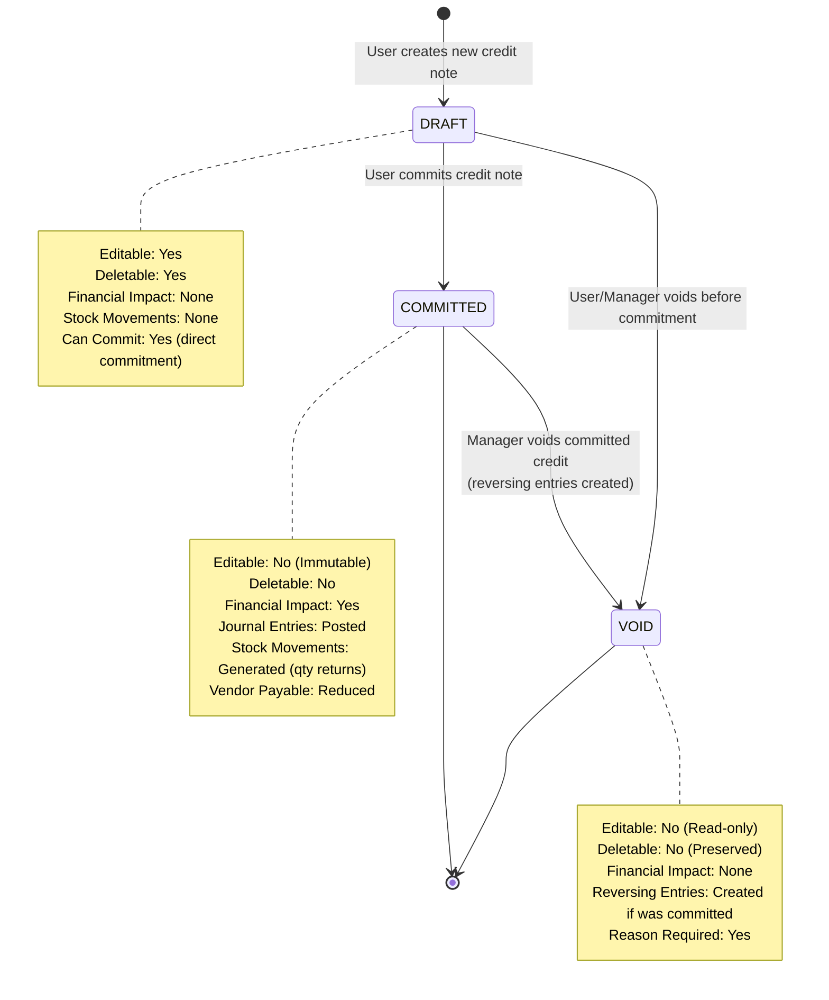
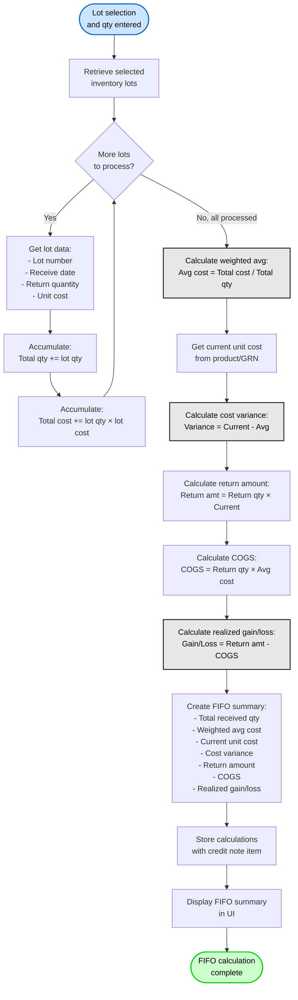

```mermaid
flowchart TD
    Start([User clicks<br/>New Credit Note]) --> SelectVendor[Select Vendor]

    SelectVendor --> LoadVendors[System loads<br/>vendor list]
    LoadVendors --> DisplayVendors[Display vendor<br/>selection dialog]

    DisplayVendors --> PickVendor[User selects vendor]
    PickVendor --> LoadGRNs[System loads GRNs<br/>for vendor]

    LoadGRNs --> DisplayGRNs[Display GRN<br/>selection dialog]
    DisplayGRNs --> SelectGRN{Select<br/>GRN?}

    SelectGRN -->|Yes| PickGRN[User selects GRN]
    SelectGRN -->|No, skip| ItemSelect

    PickGRN --> LoadItems[System loads<br/>GRN items]
    LoadItems --> ItemSelect[Display item/lot<br/>selection dialog]

    ItemSelect --> SelectType{Select Credit Type}
    SelectType -->|Quantity Return| ExpandItem[User expands item<br/>to view lots]

    ExpandItem --> LoadLots[System loads<br/>inventory lots<br/>for item]
    LoadLots --> DisplayLots[Display available lots:<br/>- Lot number<br/>- Receive date<br/>- GRN reference<br/>- Available qty<br/>- Unit cost]

    DisplayLots --> CheckLot[User checks<br/>lot selection<br/>checkboxes]
    CheckLot --> EnterQty[User enters<br/>return quantity<br/>per lot]

    EnterQty --> ValidateQty{Qty ≤<br/>available?}
    ValidateQty -->|No| ShowError1[Display error:<br/>Exceeds available]
    ShowError1 --> EnterQty

    ValidateQty -->|Yes| CalcFIFO[System calculates<br/>FIFO costs:<br/>- Weighted avg cost<br/>- Cost variance<br/>- Realized gain/loss]

    CalcFIFO --> DisplayFIFO[Display FIFO summary<br/>in expandable section]
    DisplayFIFO --> EnterDiscount{Enter<br/>discount?}

    EnterDiscount -->|Yes| AddDiscount[User enters<br/>discount amount]
    EnterDiscount -->|No| SaveLots
    AddDiscount --> SaveLots[User saves<br/>lot selections]

    SaveLots --> EnterHeader[User enters header:<br/>- Document date<br/>- Invoice references<br/>- Tax invoice ref<br/>- Credit reason<br/>- Description]

    EnterHeader --> CalcTax[System calculates<br/>tax amounts]
    CalcTax --> Validate{Validation<br/>passed?}

    Validate -->|No| ShowErrors[Display<br/>validation errors]
    ShowErrors --> EnterHeader

    Validate -->|Yes| GenNumber[System generates<br/>CN number<br/>CN-YYYY-NNN]
    GenNumber --> SetStatus[Set status to DRAFT]
    SetStatus --> SaveCN[(Save credit note)]

    SaveCN --> NavDetail[Navigate to<br/>detail page]
    NavDetail --> Success([Credit Note Created<br/>Successfully])

    style Start fill:#cce5ff,stroke:#0066cc,stroke-width:2px,color:#000
    style Success fill:#ccffcc,stroke:#00cc00,stroke-width:2px,color:#000
    style ShowError1 fill:#ffcccc,stroke:#cc0000,stroke-width:2px,color:#000
    style ShowErrors fill:#ffe0b3,stroke:#cc6600,stroke-width:2px,color:#000
    style SaveCN fill:#e0ccff,stroke:#6600cc,stroke-width:2px,color:#000
    style CalcFIFO fill:#e8e8e8,stroke:#333,stroke-width:2px,color:#000
```

```mermaid
flowchart TD
    Start([User clicks<br/>New Credit Note]) --> SelectVendor[Select Vendor]

    SelectVendor --> LoadVendors[System loads<br/>vendor list]
    LoadVendors --> PickVendor[User selects vendor]

    PickVendor --> LoadGRNs[System loads GRNs<br/>for vendor]
    LoadGRNs --> SelectGRN{Select<br/>GRN?}

    SelectGRN -->|Yes| PickGRN[User selects GRN]
    SelectGRN -->|No, skip| ItemSelect

    PickGRN --> LoadItems[System loads<br/>GRN items]
    LoadItems --> ItemSelect[Display item<br/>selection dialog]

    ItemSelect --> SelectType{Select Credit Type}
    SelectType -->|Amount Discount| SelectItem[User selects<br/>product/item]

    SelectItem --> EnterAmount[User enters<br/>discount amount]
    EnterAmount --> EnterPrice{Enter unit<br/>price adj?}

    EnterPrice -->|Yes| AddPrice[User enters<br/>adjusted unit price]
    EnterPrice -->|No| CalcTax
    AddPrice --> CalcTax[System calculates<br/>tax on discount]

    CalcTax --> AddMore{Add more<br/>items?}
    AddMore -->|Yes| SelectItem
    AddMore -->|No| EnterHeader[User enters header:<br/>- Document date<br/>- Invoice references<br/>- Tax invoice ref<br/>- Credit reason<br/>- Description]

    EnterHeader --> Validate{Validation<br/>passed?}
    Validate -->|No| ShowErrors[Display<br/>validation errors]
    ShowErrors --> EnterHeader

    Validate -->|Yes| CheckAmount{Discount ><br/>invoice amt?}
    CheckAmount -->|Yes| WarnAmount[Display warning:<br/>Exceeds invoice]
    WarnAmount --> Confirm{User<br/>confirms?}
    Confirm -->|No| EnterHeader
    Confirm -->|Yes| GenNumber
    CheckAmount -->|No| GenNumber

    GenNumber[System generates<br/>CN number<br/>CN-YYYY-NNN]
    GenNumber --> SetStatus[Set status to DRAFT]
    SetStatus --> SaveCN[(Save credit note)]

    SaveCN --> NavDetail[Navigate to<br/>detail page]
    NavDetail --> Success([Credit Note Created<br/>Successfully])

    style Start fill:#cce5ff,stroke:#0066cc,stroke-width:2px,color:#000
    style Success fill:#ccffcc,stroke:#00cc00,stroke-width:2px,color:#000
    style ShowErrors fill:#ffe0b3,stroke:#cc6600,stroke-width:2px,color:#000
    style WarnAmount fill:#ffe0b3,stroke:#cc6600,stroke-width:2px,color:#000
    style SaveCN fill:#e0ccff,stroke:#6600cc,stroke-width:2px,color:#000
```

# Flow Diagrams: Credit Note

## Module Information
- **Module**: Procurement
- **Sub-Module**: Credit Note
- **Version**: 1.0.0
- **Last Updated**: 2025-01-11
- **Owner**: Procurement Team
- **Status**: Approved

## Document History
| Version | Date | Author | Changes |
|---------|------|--------|---------|
| 1.0.0 | 2025-01-11 | Documentation Team | Initial version from workflow analysis |

---

## Overview

This document provides visual representations of the key workflows, data flows, and state transitions in the Credit Note module. The diagrams illustrate two primary credit types (quantity returns with FIFO costing and amount discounts), credit note lifecycle state transitions, commitment workflows with journal entry generation, and system integrations discovered in the actual codebase.

**Related Documents**:
- [Business Requirements](./BR-credit-note.md)
- [Use Cases](./UC-credit-note.md)
- [Technical Specification](./TS-credit-note.md)
- [Data Definition](./DD-credit-note.md)
- [Validations](./VAL-credit-note.md)

---

## Diagram Index

| Diagram | Type | Purpose | Complexity |
|---------|------|---------|------------|
| [Quantity Return Creation](#quantity-return-credit-note-creation-flow) | Process | Create credit note with physical returns and FIFO costing | High |
| [Amount Discount Creation](#amount-discount-credit-note-creation-flow) | Process | Create credit note for pricing adjustments | Medium |
| [Credit Note State Transitions](#credit-note-state-transition-diagram) | State | Status lifecycle management | Medium |
| [Commitment Workflow](#commitment-workflow) | Workflow | Commit to GL with journal entries | High |
| [FIFO Calculation](#fifo-costing-calculation-flow) | Process | Calculate weighted average cost | High |
| [System Integration](#system-integration-flow) | Integration | Module integrations on commitment | High |

---

## Quantity Return Credit Note Creation Flow

**Purpose**: Document the complete workflow for creating a quantity-based credit note from GRN with lot selection and FIFO costing

**Actors**: Purchasing Staff, Receiving Clerk, System

**Trigger**: User clicks "New Credit Note" button



**Flow Steps**:

1. **Start**: User navigates to credit note list and clicks "New Credit Note" button
2. **Select Vendor**: System navigates to vendor selection page
3. **Load Vendors**: System retrieves all active vendors
4. **Display Vendors**: Vendor selection dialog shows vendor cards with name, code, contact
5. **Pick Vendor**: User selects vendor via radio button
6. **Load GRNs**: System filters GRNs for selected vendor
7. **Display GRNs**: GRN selection dialog shows GRN number, date, invoice, amount
8. **Select GRN**: User chooses to select GRN or skip for standalone credit
9. **Pick GRN**: User selects GRN from list
10. **Load Items**: System retrieves GRN items
11. **Item Selection**: Item/lot selection dialog opens
12. **Select Type**: User selects "Quantity Return" credit type
13. **Expand Item**: User clicks to expand item row and view available lots
14. **Load Lots**: System queries inventory for available lots for this product
15. **Display Lots**: Table shows lot details with checkboxes
16. **Check Lot**: User selects one or more lots via checkboxes
17. **Enter Quantity**: User enters return quantity for each selected lot
18. **Validate Quantity**: System checks quantity doesn't exceed lot available quantity
19. **Calculate FIFO**: System performs FIFO costing calculation:
    - Total received quantity = sum of lot quantities
    - Weighted average cost = Σ(lot qty × lot cost) / total qty
    - Current unit cost from product/GRN
    - Cost variance = current cost - weighted avg
    - Return amount = return qty × current cost
    - COGS = return qty × weighted avg
    - Realized gain/loss = return amount - COGS
20. **Display FIFO**: FIFO summary shown in expandable section with all calculations
21. **Enter Discount**: Optionally add discount amount
22. **Save Lots**: User saves item/lot selections
23. **Enter Header**: User fills credit note header fields
24. **Calculate Tax**: System applies tax rate and calculates tax amount
25. **Validation**: System validates all required fields and business rules
26. **Generate Number**: Assign unique sequential CN number
27. **Set Status**: Initial status is DRAFT
28. **Save**: Persist credit note data
29. **Navigate**: Route to detail page for review
30. **Success**: Quantity return credit note created

**Exception Handling**:
- No GRNs available: Allow manual entry without GRN reference
- No lots available: Display error, cannot proceed with quantity return
- Quantity exceeds available: Inline error, require correction
- Validation failures: Field-level errors with highlighting

---

## Amount Discount Credit Note Creation Flow

**Purpose**: Document the workflow for creating amount-based credit note for pricing adjustments without physical returns

**Actors**: Purchasing Staff, System

**Trigger**: User clicks "New Credit Note" button



**Flow Steps**:

1. **Start**: User clicks "New Credit Note" from list page
2. **Select Vendor**: Navigate to vendor selection
3. **Load Vendors**: Retrieve active vendors
4. **Pick Vendor**: User selects vendor
5. **Load GRNs**: Optional - retrieve GRNs for reference
6. **Select GRN**: User can select GRN or skip
7. **Load Items**: If GRN selected, load items for reference
8. **Item Selection**: Display item selection dialog
9. **Select Type**: User chooses "Amount Discount" credit type
10. **Select Item**: User picks product from GRN items or catalog
11. **Enter Amount**: User enters discount amount (not quantity)
12. **Enter Price Adjustment**: Optionally enter adjusted unit price
13. **Calculate Tax**: System calculates tax on discount amount
14. **Add More**: User can add multiple items with discounts
15. **Enter Header**: Fill credit note header information
16. **Validation**: System validates required fields
17. **Check Amount**: Compare total discount to original invoice amount
18. **Warn Amount**: If exceeds invoice, show warning
19. **User Confirms**: Allow proceeding or go back to correct
20. **Generate Number**: Assign CN number
21. **Set Status**: DRAFT status
22. **Save**: Persist credit note
23. **Navigate**: Go to detail page
24. **Success**: Amount discount credit note created

**Key Differences from Quantity Return**:
- No lot selection required
- No FIFO costing calculation
- No stock movements will be generated
- Focus on discount amounts, not quantities
- Simpler workflow, fewer validation steps

---

## Credit Note State Transition Diagram

**Purpose**: Document the valid status transitions and rules governing credit note lifecycle



**Status Descriptions**:

**DRAFT**:
- Initial state when credit note first created
- Fully editable - all fields and items can be modified
- Can be deleted without restriction
- No approval required - can be committed directly
- No impact on financials or inventory
- Common for work-in-progress credits

**COMMITTED**:
- Credit note committed to general ledger
- Immutable - no edits allowed
- Cannot be deleted (must void instead)
- Journal entries created and posted
- Stock movements generated (for quantity returns)
- Vendor payable balance reduced
- Can only be voided (with reversals)

**VOID**:
- Cancelled credit note
- Read-only - cannot edit or delete
- Preserved for audit trail
- If previously COMMITTED, reversing entries created
- If never committed, just marked void
- Void reason recorded and visible
- No financial or inventory impact

**Transition Rules**:
- DRAFT → COMMITTED: All required fields complete, at least one item, lot selections (for qty returns), GL accounts configured, accounting period open
- COMMITTED → VOID: Manager permission required, void reason mandatory
- DRAFT → VOID: Manager permission (for cancellation before commitment)

---

## Commitment Workflow

**Purpose**: Document the commitment process with journal entry and stock movement generation

**Actors**: Finance Team, Procurement Manager, System

**Trigger**: User clicks "Commit" button on draft credit note

```mermaid
flowchart TD
    Start([User clicks Commit]) --> ValidateStatus{Status =<br/>DRAFT?}

    ValidateStatus -->|No| ShowError1[Display: Must be<br/>in draft status]
    ShowError1 --> End1([Remain in current status])

    ValidateStatus -->|Yes| EnterDate{Enter custom<br/>commitment date?}

    EnterDate -->|Yes| InputDate[User enters<br/>commitment date]
    EnterDate -->|No| UseDocDate[Use document date]
    InputDate --> ValidatePeriod
    UseDocDate --> ValidatePeriod

    ValidatePeriod{Accounting<br/>period open?}
    ValidatePeriod -->|No| ShowError2[Display: Period<br/>closed for date]
    ShowError2 --> End2([Remain DRAFT])

    ValidatePeriod -->|Yes| ValidateGL{GL accounts<br/>configured?}
    ValidateGL -->|No| ShowError3[Display: Missing<br/>GL configuration]
    ShowError3 --> End3([Remain DRAFT])

    ValidateGL -->|Yes| ValidateVendor{Vendor account<br/>active?}
    ValidateVendor -->|No| ShowError4[Display: Inactive<br/>vendor account]
    ShowError4 --> End4([Remain DRAFT])

    ValidateVendor -->|Yes| GenJournals[System generates<br/>journal entries]

    GenJournals --> Primary[PRIMARY ENTRIES:<br/>1. DR Accounts Payable<br/>2. CR Inventory (qty returns)<br/>3. CR Input VAT]

    Primary --> CheckVariance{Cost variance<br/>exists?}

    CheckVariance -->|Yes| Inventory[INVENTORY ENTRIES:<br/>4. DR/CR Cost Variance]
    CheckVariance -->|No| ValidateBalance
    Inventory --> ValidateBalance

    ValidateBalance{Total DR =<br/>Total CR?}
    ValidateBalance -->|No| ShowError5[Display: Journal<br/>imbalance error]
    ShowError5 --> End5([Remain DRAFT])

    ValidateBalance -->|Yes| CheckType{Credit type =<br/>QUANTITY_RETURN?}

    CheckType -->|Yes| GenStock[System generates<br/>stock movements]
    GenStock --> StockDetails[For each item:<br/>- Transaction type: CN Return<br/>- Location: INV/CON<br/>- Lot number<br/>- Qty: Negative value<br/>- Unit cost: FIFO<br/>- Reference: CN number]
    StockDetails --> CommitAll

    CheckType -->|No, AMOUNT_DISCOUNT| CommitAll

    CommitAll[Commit all transactions<br/>atomically]
    CommitAll --> PostJE[Post journal entries<br/>to Finance module]

    PostJE --> PostStock{Stock movements?}
    PostStock -->|Yes| PostInv[Post stock movements<br/>to Inventory module]
    PostStock -->|No| UpdatePayable
    PostInv --> UpdatePayable

    UpdatePayable[Reduce vendor<br/>payable balance]
    UpdatePayable --> SetCommitted[Set status to COMMITTED]
    SetCommitted --> AssignRef[Assign commitment reference<br/>and commitment date]

    AssignRef --> LockCN[Lock credit note<br/>from edits]
    LockCN --> LogCommit[Log commitment in<br/>audit trail]
    LogCommit --> NotifyUsers[Notify finance team<br/>and requester]
    NotifyUsers --> Success([Status: COMMITTED<br/>Commitment complete])

    style Start fill:#cce5ff,stroke:#0066cc,stroke-width:2px,color:#000
    style Success fill:#ccffcc,stroke:#00cc00,stroke-width:2px,color:#000
    style End1 fill:#ffe0b3,stroke:#cc6600,stroke-width:2px,color:#000
    style End2 fill:#ffe0b3,stroke:#cc6600,stroke-width:2px,color:#000
    style End3 fill:#ffe0b3,stroke:#cc6600,stroke-width:2px,color:#000
    style End4 fill:#ffe0b3,stroke:#cc6600,stroke-width:2px,color:#000
    style End5 fill:#ffe0b3,stroke:#cc6600,stroke-width:2px,color:#000
    style ShowError1 fill:#ffcccc,stroke:#cc0000,stroke-width:2px,color:#000
    style ShowError2 fill:#ffcccc,stroke:#cc0000,stroke-width:2px,color:#000
    style ShowError3 fill:#ffcccc,stroke:#cc0000,stroke-width:2px,color:#000
    style ShowError4 fill:#ffcccc,stroke:#cc0000,stroke-width:2px,color:#000
    style ShowError5 fill:#ffcccc,stroke:#cc0000,stroke-width:2px,color:#000
```

**Journal Entry Structure**:

**Primary Entries Group**:
1. **DR Accounts Payable (2100)**: Credit total amount
   - Reduces vendor payable balance
   - Department: Purchasing (PUR)

2. **CR Inventory (1140)**: Net inventory value (quantity returns only)
   - Reduces inventory value
   - Department: Warehouse (WHS)
   - Amount: Σ(return qty × FIFO cost)

3. **CR Input VAT (1240)**: Tax amount
   - Reduces input VAT credit
   - Department: Accounting (ACC)
   - Tax code: VAT with rate

**Inventory Entries Group** (if cost variance exists):
4. **DR/CR Cost Variance Account**: Variance amount
   - Department: Warehouse (WHS)
   - Amount: (current cost - FIFO cost) × return qty
   - DR if loss (current < FIFO), CR if gain (current > FIFO)

**Workflow Steps**:

1. **Start**: User clicks "Commit" button
2. **Validate Status**: Must be DRAFT
3. **Enter Date**: Optionally enter custom commitment date
4. **Validate Period**: Accounting period must be open for commitment date
5. **Validate GL**: All required GL accounts must be configured
6. **Validate Vendor**: Vendor account must be active
7. **Generate Journals**: System creates journal entry structure
8. **Primary Entries**: Create main GL entries
9. **Check Variance**: If cost variance exists (qty returns)
10. **Inventory Entries**: Create cost variance entries if applicable
11. **Validate Balance**: Total debits must equal total credits
12. **Check Type**: If quantity return, generate stock movements
13. **Generate Stock**: Create negative stock movement records
14. **Stock Details**: For each item/lot, create movement with lot number, negative qty, FIFO cost
15. **Commit All**: Atomic transaction - all or nothing
16. **Post JE**: Post journal entries to Finance module
17. **Post Stock**: Post stock movements to Inventory module (if applicable)
18. **Update Payable**: Reduce vendor payable balance in Vendor module
19. **Set Committed**: Change status to COMMITTED
20. **Assign Reference**: Assign commitment date and journal voucher reference
21. **Lock**: Make credit note immutable
22. **Log**: Record commitment in audit trail with all details
23. **Notify**: Send email to finance team and requester
24. **Success**: Credit note committed successfully

**Error Handling**:
- If any validation fails: display error, remain in DRAFT status
- If journal imbalance: log error, notify administrator
- If inventory posting fails: rollback journal entries, remain DRAFT
- All operations are atomic (all succeed or all rollback)

---

## FIFO Costing Calculation Flow

**Purpose**: Document the FIFO (First-In-First-Out) weighted average cost calculation for quantity returns

**Actors**: System

**Trigger**: User selects lots and enters return quantities



**FIFO Calculation Example**:

**Scenario**: Returning 15 units, selected from 2 lots:
- Lot A: 5 units @ $387.50 (received 2024-05-23)
- Lot B: 10 units @ $400.00 (received 2024-09-15)
- Current cost: $400.00

**Calculations**:
1. **Total Received Qty**: 5 + 10 = 15 units
2. **Total Cost**: (5 × $387.50) + (10 × $400.00) = $1,937.50 + $4,000.00 = $5,937.50
3. **Weighted Avg Cost**: $5,937.50 / 15 = $395.83
4. **Current Unit Cost**: $400.00
5. **Cost Variance**: $400.00 - $395.83 = $4.17 per unit (loss on return)
6. **Return Amount**: 15 × $400.00 = $6,000.00
7. **COGS**: 15 × $395.83 = $5,937.50
8. **Realized Gain/Loss**: $6,000.00 - $5,937.50 = $62.50 (gain)

**Business Rules**:
- FIFO method mandatory for quantity-based credit notes
- All selected lots must have unit cost data
- Weighted average rounded to 2 decimal places for currency, 4 for costs
- Negative variance = gain (current cost lower than FIFO avg)
- Positive variance = loss (current cost higher than FIFO avg)
- Realized gain/loss impacts gross margin reporting

---

## System Integration Flow

**Purpose**: Document system integrations triggered when credit note is committed

**Actors**: Finance Module, Inventory Module, System

**Trigger**: Credit note commitment completes successfully

```mermaid
flowchart TD
    Start([Credit note<br/>status → COMMITTED]) --> CheckType{Credit type?}

    CheckType -->|QUANTITY_RETURN| FinanceInt
    CheckType -->|AMOUNT_DISCOUNT| FinanceInt

    FinanceInt[Finance Module<br/>Integration]
    FinanceInt --> PostJE[Post journal entries<br/>to general ledger]

    PostJE --> UpdateAP[Update Accounts Payable:<br/>DR vendor account<br/>Reduce payable balance]

    UpdateAP --> UpdateInventoryGL{Quantity<br/>return?}
    UpdateInventoryGL -->|Yes| UpdateInvGL[Update Inventory GL:<br/>CR inventory account<br/>Reduce inventory value]
    UpdateInventoryGL -->|No| UpdateVAT
    UpdateInvGL --> UpdateVAT

    UpdateVAT[Update Input VAT:<br/>CR input VAT account<br/>Reduce tax credit]

    UpdateVAT --> CheckVarianceGL{Cost variance<br/>exists?}
    CheckVarianceGL -->|Yes| UpdateVarianceGL[Update Cost Variance:<br/>DR/CR variance account]
    CheckVarianceGL -->|No| AssignJV
    UpdateVarianceGL --> AssignJV

    AssignJV[Assign journal<br/>voucher reference]
    AssignJV --> FinanceComplete[Finance integration<br/>complete]

    FinanceComplete --> CheckQty{Quantity<br/>return?}

    CheckQty -->|Yes| InventoryInt[Inventory Module<br/>Integration]
    CheckQty -->|No| NotifyComplete

    InventoryInt --> PostStock[Post stock movements<br/>to inventory system]

    PostStock --> UpdateLots[Update inventory lots:<br/>Reduce available qty<br/>per lot selected]

    UpdateLots --> UpdateLocations[Update location balances:<br/>Reduce qty per location]

    UpdateLocations --> UpdateValuation[Update inventory valuation:<br/>Reduce total value<br/>by FIFO cost]

    UpdateValuation --> RecordTrans[Record transaction history:<br/>Type: CN Return<br/>Reference: CN number<br/>Lots: Applied lots]

    RecordTrans --> InventoryComplete[Inventory integration<br/>complete]

    InventoryComplete --> NotifyComplete[Send notifications:<br/>- Finance team<br/>- Requester<br/>- Accounts payable]

    NotifyComplete --> AuditLog[Record in audit trail:<br/>- Posting timestamp<br/>- Journal voucher ref<br/>- Stock movements ref<br/>- User who posted]

    AuditLog --> Success([Integration complete])

    style Start fill:#cce5ff,stroke:#0066cc,stroke-width:2px,color:#000
    style Success fill:#ccffcc,stroke:#00cc00,stroke-width:2px,color:#000
    style FinanceInt fill:#e0ccff,stroke:#6600cc,stroke-width:2px,color:#000
    style InventoryInt fill:#e0ccff,stroke:#6600cc,stroke-width:2px,color:#000
```



**Integration Points**:

**Finance Module**:
- **GL Posting**: Post journal entries to general ledger
- **Accounts Payable**: Reduce vendor payable balance by credit amount
- **Inventory GL**: Reduce inventory asset value (quantity returns only)
- **Input VAT**: Reduce input tax credit by tax amount
- **Cost Variance**: Record cost variance gain/loss (if applicable)
- **Journal Voucher**: Generate journal voucher reference for traceability

**Inventory Module** (Quantity Returns Only):
- **Stock Movements**: Post negative stock movement transactions
- **Lot Balances**: Reduce available quantity per lot selected
- **Location Balances**: Reduce inventory quantity per storage location
- **Inventory Valuation**: Reduce total inventory value by FIFO cost
- **Transaction History**: Record credit note return in lot/location history

**Vendor Module** (Indirect):
- **Payable Balance**: Reduced via Finance module AP update
- **Vendor Credits**: Applied to vendor account for future payment offsets

**Integration Sequence**:
1. Finance module integration first (GL entries)
2. Inventory module integration second (stock movements)
3. All integrations atomic (all succeed or all rollback)
4. Notifications sent after all integrations complete
5. Audit logging captures all integration results

**Error Handling**:
- If Finance integration fails: Rollback credit note commitment, remain DRAFT
- If Inventory integration fails: Rollback Finance integration and commitment, remain DRAFT
- All operations atomic to prevent partial updates
- Detailed error logging for troubleshooting
- Administrator notification for integration failures

---

## Summary

**Key Workflows Documented**:
1. **Quantity Return Creation**: Complex flow with vendor/GRN/lot selection, FIFO costing
2. **Amount Discount Creation**: Simpler flow for pricing adjustments without returns
3. **State Transitions**: Three status states (DRAFT, COMMITTED, VOID) with defined transition rules
4. **Commitment Workflow**: GL posting with journal entry and stock movement generation
5. **FIFO Calculation**: Weighted average cost calculation for accurate inventory valuation
6. **System Integration**: Finance and inventory module integrations on commitment

**Process Complexity**:
- Quantity returns: High complexity (lot selection, FIFO, inventory updates)
- Amount discounts: Medium complexity (simpler, no inventory impact)
- Commitment: High complexity (multi-system integration, atomic transactions)

**Integration Points**:
- GRN Module: Source data for credit notes
- Inventory Module: Lot data, stock movement posting
- Finance Module: GL posting, vendor payable updates
- Vendor Module: Payable balance adjustments

---

**Document Control**:
- **Classification**: Internal Use
- **Distribution**: Development Team, Procurement Team, Finance Team, Business Analysts
- **Review Cycle**: Quarterly or when workflows change
- **Approval**: Business Process Owner, Technical Lead

**End of Document**
