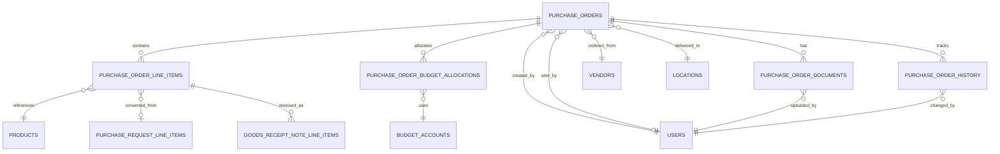

# Data Definition: Purchase Orders

## Document Information
- **Module**: Procurement
- **Sub-Module**: Purchase Orders
- **Document Type**: Data Definition (DD)
- **Version**: 3.0.0
- **Last Updated**: 2025-11-21
- **Status**: In Progress

## Document History

| Version | Date | Author | Changes |
|---------|------|--------|---------|
| 1.0.0 | 2025-10-30 | System | Initial creation with approval workflow tables |
| 2.0.0 | 2025-10-31 | System | Removed purchase_order_approvals table, updated ERD, removed v_pending_po_approvals view, updated status constraints, clarified approved_by/approved_at fields are NOT multi-stage approval workflow |
| 3.0.0 | 2025-11-21 | System | Major restructure: Converted from SQL-focused implementation document to proper Data Definition document with field definitions, business rules, and diagrams; moved all SQL code (DDL, triggers, functions, views) to Technical Specification document |

## Related Documents

- [Business Requirements](./BR-purchase-orders.md)
- [Use Cases](./UC-purchase-orders.md)
- [Technical Specification](./TS-purchase-orders.md)
- [Flow Diagrams](./FD-purchase-orders.md)
- [Validations](./VAL-purchase-orders.md)

---

## Overview

This document defines the data structures and relationships for the Purchase Orders sub-module including:
- Entity Relationship Diagram (ERD)
- Entity definitions and purposes
- Field definitions with data types and business rules
- Relationships between entities
- Business constraints and validation rules

**Note**: For technical implementation details (SQL DDL, triggers, functions), refer to the [Technical Specification](./TS-purchase-orders.md).

---

## Entity Relationship Diagram

---

## Core Entities

### 1. Purchase Orders

**Purpose**: Represents a purchase order document sent to vendors for procurement of goods or services.

**Primary Key**: Unique identifier (UUID)

**Business Identifier**: PO Number (Format: PO-YYYY-NNNNNN, e.g., PO-2024-001234)

#### Field Definitions

| Field Name | Data Type | Required | Description | Business Rules |
|------------|-----------|----------|-------------|----------------|
| **Identification** |
| id | UUID | Yes | System-generated unique identifier | Auto-generated |
| po_number | String(50) | Yes | Human-readable PO number | Unique, format: PO-YYYY-NNNNNN |
| version | Integer | Yes | Document version for change tracking | Increments on each modification |
| **Vendor Information** |
| vendor_id | UUID | Yes | Reference to vendor entity | Must be active vendor |
| **Status and Workflow** |
| status | String(20) | Yes | Current lifecycle status | Values: Draft, Sent, Acknowledged, Partially Received, Fully Received, Completed, Cancelled, On Hold |
| **Dates** |
| order_date | Date | Yes | Date when PO was created | Defaults to current date |
| expected_delivery_date | Date | Yes | Expected delivery date | Must be >= order_date |
| **Delivery Information** |
| delivery_location_id | UUID | Yes | Reference to delivery location | Must be valid location |
| **Financial Information** |
| subtotal | Decimal(15,2) | Yes | Sum of line item totals | Must be >= 0 |
| discount_amount | Decimal(15,2) | Yes | Total discount applied | Must be >= 0 |
| discount_percentage | Decimal(5,2) | No | Discount percentage if applicable | 0-100% |
| tax_amount | Decimal(15,2) | Yes | Total tax amount | Must be >= 0 |
| shipping_amount | Decimal(15,2) | Yes | Shipping/delivery charges | Must be >= 0 |
| grand_total | Decimal(15,2) | Yes | Final total amount | Calculated: subtotal - discount + tax + shipping |
| currency | String(3) | Yes | Currency code (ISO 4217) | Default: USD |
| **Terms and Conditions** |
| payment_terms | String(100) | Yes | Payment terms agreed with vendor | E.g., "Net 30", "COD" |
| delivery_terms | String(100) | Yes | Delivery terms (Incoterms) | E.g., "FOB", "CIF" |
| **Notes** |
| notes | Text | No | Public notes visible to vendor | |
| internal_notes | Text | No | Internal notes for staff only | Not shared with vendor |
| **Workflow Tracking** |
| created_by | UUID | Yes | User who created the PO | Reference to users |
| created_at | Timestamp | Yes | Creation timestamp | Auto-generated |
| approved_by | UUID | No | Purchasing staff who authorized PO | Single authorization, not multi-stage |
| approved_at | Timestamp | No | Authorization timestamp | Set when PO is sent |
| sent_by | UUID | No | User who sent PO to vendor | |
| sent_at | Timestamp | No | Timestamp when sent to vendor | |
| acknowledged_at | Timestamp | No | Vendor acknowledgment timestamp | |
| completed_at | Timestamp | No | Completion timestamp | |
| cancelled_at | Timestamp | No | Cancellation timestamp | |
| cancellation_reason | Text | No | Reason for cancellation | Required if cancelled |
| **Audit Fields** |
| updated_at | Timestamp | Yes | Last update timestamp | Auto-updated |
| updated_by | UUID | Yes | User who last updated | Reference to users |
| **Soft Delete** |
| deleted_at | Timestamp | No | Deletion timestamp | Null if not deleted |
| deleted_by | UUID | No | User who deleted | |

#### Business Constraints

1. **Status Transitions**:
   - Draft → Sent (when sent to vendor)
   - Sent → Acknowledged (vendor confirms receipt)
   - Acknowledged → Partially Received (some items received)
   - Partially Received → Fully Received (all items received)
   - Fully Received → Completed (all processes complete)
   - Any status → Cancelled (with reason required)

2. **Financial Validation**:
   - All amounts must be non-negative
   - Grand total must equal: subtotal - discount + tax + shipping
   - Either discount_amount OR discount_percentage can be used, not both

3. **Date Validation**:
   - Expected delivery date must be >= order date

4. **Authorization**:
   - Only authorized purchasing staff can send POs to vendors
   - approved_by and approved_at are set together when PO is sent

---

### 2. purchase_order_line_items Table

**Purpose**: Individual line items on purchase orders.

\`\`\`sql
CREATE TABLE purchase_order_line_items (
  -- Primary Key
  id UUID PRIMARY KEY DEFAULT gen_random_uuid(),
  
  -- Parent Reference
  purchase_order_id UUID NOT NULL REFERENCES purchase_orders(id) ON DELETE CASCADE,
  
  -- Line Number
  line_number INT NOT NULL,
  
  -- Source Reference
  purchase_request_line_item_id UUID REFERENCES purchase_request_line_items(id),
  
  -- Product Information
  product_id UUID REFERENCES products(id),
  description TEXT NOT NULL,
  
  -- Quantity and Pricing
  quantity DECIMAL(15,3) NOT NULL,
  unit_of_measure VARCHAR(20) NOT NULL,
  unit_price DECIMAL(15,2) NOT NULL,
  line_total DECIMAL(15,2) NOT NULL,
  tax_amount DECIMAL(15,2) NOT NULL DEFAULT 0.00,
  
  -- Delivery
  expected_delivery_date DATE,
  
  -- Receipt Tracking
  quantity_received DECIMAL(15,3) NOT NULL DEFAULT 0,
  quantity_remaining DECIMAL(15,3) NOT NULL,
  
  -- Additional Information
  specifications TEXT,
  notes TEXT,
  
  -- Audit Fields
  created_at TIMESTAMPTZ NOT NULL DEFAULT NOW(),
  created_by UUID NOT NULL REFERENCES users(id),
  updated_at TIMESTAMPTZ NOT NULL DEFAULT NOW(),
  updated_by UUID NOT NULL REFERENCES users(id),
  
  -- Constraints
  CONSTRAINT po_line_unique UNIQUE (purchase_order_id, line_number),
  CONSTRAINT po_line_quantity_check CHECK (quantity > 0),
  CONSTRAINT po_line_unit_price_check CHECK (unit_price >= 0),
  CONSTRAINT po_line_received_check CHECK (quantity_received >= 0 AND quantity_received <= quantity * 1.05),
  CONSTRAINT po_line_remaining_check CHECK (quantity_remaining >= 0)
);

-- Indexes
CREATE INDEX idx_po_line_po_id ON purchase_order_line_items(purchase_order_id);
CREATE INDEX idx_po_line_product_id ON purchase_order_line_items(product_id);
CREATE INDEX idx_po_line_pr_line_id ON purchase_order_line_items(purchase_request_line_item_id);
CREATE INDEX idx_po_line_line_number ON purchase_order_line_items(purchase_order_id, line_number);

-- Comments
COMMENT ON TABLE purchase_order_line_items IS 'Individual items on purchase orders';
COMMENT ON COLUMN purchase_order_line_items.line_number IS 'Sequential line number within PO';
COMMENT ON COLUMN purchase_order_line_items.quantity_received IS 'Total quantity received across all GRNs';
COMMENT ON COLUMN purchase_order_line_items.quantity_remaining IS 'Quantity yet to be received';
\`\`\`

---

### 3. purchase_order_budget_allocations Table

**Purpose**: Budget account allocations for purchase orders.

\`\`\`sql
CREATE TABLE purchase_order_budget_allocations (
  -- Primary Key
  id UUID PRIMARY KEY DEFAULT gen_random_uuid(),
  
  -- Parent Reference
  purchase_order_id UUID NOT NULL REFERENCES purchase_orders(id) ON DELETE CASCADE,
  
  -- Budget Information
  budget_account_id UUID NOT NULL REFERENCES budget_accounts(id),
  allocation_amount DECIMAL(15,2) NOT NULL,
  allocation_percentage DECIMAL(5,2) NOT NULL,
  fiscal_year INT NOT NULL,
  
  -- Additional Information
  notes TEXT,
  
  -- Audit Fields
  created_at TIMESTAMPTZ NOT NULL DEFAULT NOW(),
  created_by UUID NOT NULL REFERENCES users(id),
  updated_at TIMESTAMPTZ NOT NULL DEFAULT NOW(),
  updated_by UUID NOT NULL REFERENCES users(id),
  
  -- Constraints
  CONSTRAINT po_budget_allocation_check CHECK (allocation_amount > 0),
  CONSTRAINT po_budget_percentage_check CHECK (allocation_percentage > 0 AND allocation_percentage <= 100)
);

-- Indexes
CREATE INDEX idx_po_budget_po_id ON purchase_order_budget_allocations(purchase_order_id);
CREATE INDEX idx_po_budget_account_id ON purchase_order_budget_allocations(budget_account_id);
CREATE INDEX idx_po_budget_fiscal_year ON purchase_order_budget_allocations(fiscal_year);

-- Comments
COMMENT ON TABLE purchase_order_budget_allocations IS 'Budget account allocations for purchase orders';
COMMENT ON COLUMN purchase_order_budget_allocations.allocation_percentage IS 'Percentage of PO total allocated to this account';
\`\`\`

---

### 4. purchase_order_documents Table

**Purpose**: Documents and attachments related to purchase orders.

\`\`\`sql
CREATE TABLE purchase_order_documents (
  -- Primary Key
  id UUID PRIMARY KEY DEFAULT gen_random_uuid(),
  
  -- Parent Reference
  purchase_order_id UUID NOT NULL REFERENCES purchase_orders(id) ON DELETE CASCADE,
  
  -- File Information
  file_name VARCHAR(255) NOT NULL,
  file_size BIGINT NOT NULL,
  file_type VARCHAR(100) NOT NULL,
  file_path TEXT NOT NULL,
  
  -- Document Classification
  document_type VARCHAR(50) NOT NULL,
  description TEXT,
  version INT NOT NULL DEFAULT 1,
  
  -- Status
  is_active BOOLEAN NOT NULL DEFAULT TRUE,
  
  -- Audit Fields
  uploaded_by UUID NOT NULL REFERENCES users(id),
  uploaded_at TIMESTAMPTZ NOT NULL DEFAULT NOW(),
  
  -- Constraints
  CONSTRAINT po_doc_type_check CHECK (document_type IN (
    'Quote', 'Specification', 'Contract', 'Drawing', 'Email', 'Other'
  )),
  CONSTRAINT po_doc_file_size_check CHECK (file_size > 0 AND file_size <= 10485760) -- 10MB max
);

-- Indexes
CREATE INDEX idx_po_doc_po_id ON purchase_order_documents(purchase_order_id);
CREATE INDEX idx_po_doc_type ON purchase_order_documents(document_type);
CREATE INDEX idx_po_doc_active ON purchase_order_documents(purchase_order_id, is_active) WHERE is_active = TRUE;

-- Comments
COMMENT ON TABLE purchase_order_documents IS 'Documents and attachments for purchase orders';
COMMENT ON COLUMN purchase_order_documents.version IS 'Document version number';
\`\`\`

---

### 5. purchase_order_history Table

**Purpose**: Complete audit trail of all changes to purchase orders.

\`\`\`sql
CREATE TABLE purchase_order_history (
  -- Primary Key
  id UUID PRIMARY KEY DEFAULT gen_random_uuid(),
  
  -- Parent Reference
  purchase_order_id UUID NOT NULL REFERENCES purchase_orders(id) ON DELETE CASCADE,
  
  -- Change Information
  change_type VARCHAR(50) NOT NULL,
  field_name VARCHAR(100),
  old_value TEXT,
  new_value TEXT,
  
  -- Change Metadata
  changed_by UUID NOT NULL REFERENCES users(id),
  changed_at TIMESTAMPTZ NOT NULL DEFAULT NOW(),
  comments TEXT,
  change_reason TEXT,
  
  -- Context
  ip_address INET,
  user_agent TEXT
);

-- Indexes
CREATE INDEX idx_po_history_po_id ON purchase_order_history(purchase_order_id);
CREATE INDEX idx_po_history_changed_at ON purchase_order_history(changed_at DESC);
CREATE INDEX idx_po_history_changed_by ON purchase_order_history(changed_by);
CREATE INDEX idx_po_history_change_type ON purchase_order_history(change_type);

-- Comments
COMMENT ON TABLE purchase_order_history IS 'Complete audit trail for purchase orders';
COMMENT ON COLUMN purchase_order_history.change_type IS 'Type of change (Created, Modified, Approved, Sent, etc.)';
\`\`\`

---

### 6. po_sequence Table

**Purpose**: Manages sequential PO number generation per fiscal year.

\`\`\`sql
CREATE TABLE po_sequence (
  -- Primary Key
  year INT PRIMARY KEY,
  
  -- Sequence
  sequence INT NOT NULL DEFAULT 0,
  
  -- Audit
  updated_at TIMESTAMPTZ NOT NULL DEFAULT NOW(),
  
  -- Constraints
  CONSTRAINT po_sequence_year_check CHECK (year >= 2000 AND year <= 2100),
  CONSTRAINT po_sequence_value_check CHECK (sequence >= 0)
);

-- Comments
COMMENT ON TABLE po_sequence IS 'Sequence counter for PO number generation per year';
COMMENT ON COLUMN po_sequence.sequence IS 'Current sequence number for the year';
\`\`\`

---

## Database Functions

### 1. Function: get_next_po_sequence

**Purpose**: Atomically generates next PO sequence number for given year.

\`\`\`sql
CREATE OR REPLACE FUNCTION get_next_po_sequence(p_year INTEGER)
RETURNS INTEGER
LANGUAGE plpgsql
AS $$
DECLARE
  v_sequence INTEGER;
BEGIN
  -- Insert or update sequence for the year
  INSERT INTO po_sequence (year, sequence)
  VALUES (p_year, 1)
  ON CONFLICT (year)
  DO UPDATE SET
    sequence = po_sequence.sequence + 1,
    updated_at = NOW()
  RETURNING sequence INTO v_sequence;
  
  RETURN v_sequence;
END;
$$;

COMMENT ON FUNCTION get_next_po_sequence IS 'Generate next PO sequence number for given year';
\`\`\`

### 2. Function: update_po_line_remaining_quantity

**Purpose**: Automatically calculates remaining quantity on line items.

\`\`\`sql
CREATE OR REPLACE FUNCTION update_po_line_remaining_quantity()
RETURNS TRIGGER
LANGUAGE plpgsql
AS $$
BEGIN
  NEW.quantity_remaining := NEW.quantity - NEW.quantity_received;
  RETURN NEW;
END;
$$;

CREATE TRIGGER trigger_update_po_line_remaining
  BEFORE INSERT OR UPDATE OF quantity, quantity_received
  ON purchase_order_line_items
  FOR EACH ROW
  EXECUTE FUNCTION update_po_line_remaining_quantity();

COMMENT ON FUNCTION update_po_line_remaining_quantity IS 'Calculate remaining quantity on PO line items';
\`\`\`

### 3. Function: update_po_totals

**Purpose**: Recalculates PO totals when line items change.

\`\`\`sql
CREATE OR REPLACE FUNCTION update_po_totals()
RETURNS TRIGGER
LANGUAGE plpgsql
AS $$
DECLARE
  v_subtotal DECIMAL(15,2);
  v_tax_amount DECIMAL(15,2);
  v_discount_amount DECIMAL(15,2);
  v_shipping_amount DECIMAL(15,2);
  v_grand_total DECIMAL(15,2);
  v_po_id UUID;
BEGIN
  -- Determine which PO to update
  IF TG_OP = 'DELETE' THEN
    v_po_id := OLD.purchase_order_id;
  ELSE
    v_po_id := NEW.purchase_order_id;
  END IF;
  
  -- Calculate subtotal and tax from line items
  SELECT
    COALESCE(SUM(line_total), 0),
    COALESCE(SUM(tax_amount), 0)
  INTO v_subtotal, v_tax_amount
  FROM purchase_order_line_items
  WHERE purchase_order_id = v_po_id;
  
  -- Get discount and shipping from PO header
  SELECT discount_amount, shipping_amount
  INTO v_discount_amount, v_shipping_amount
  FROM purchase_orders
  WHERE id = v_po_id;
  
  -- Calculate grand total
  v_grand_total := v_subtotal - v_discount_amount + v_tax_amount + v_shipping_amount;
  
  -- Update PO header
  UPDATE purchase_orders
  SET
    subtotal = v_subtotal,
    tax_amount = v_tax_amount,
    grand_total = v_grand_total,
    updated_at = NOW()
  WHERE id = v_po_id;
  
  RETURN COALESCE(NEW, OLD);
END;
$$;

CREATE TRIGGER trigger_update_po_totals_on_line_change
  AFTER INSERT OR UPDATE OR DELETE
  ON purchase_order_line_items
  FOR EACH ROW
  EXECUTE FUNCTION update_po_totals();

COMMENT ON FUNCTION update_po_totals IS 'Recalculate PO totals when line items change';
\`\`\`

### 4. Function: log_po_history

**Purpose**: Automatically logs changes to purchase orders.

\`\`\`sql
CREATE OR REPLACE FUNCTION log_po_history()
RETURNS TRIGGER
LANGUAGE plpgsql
AS $$
BEGIN
  IF TG_OP = 'INSERT' THEN
    INSERT INTO purchase_order_history (
      purchase_order_id, change_type, changed_by, comments
    ) VALUES (
      NEW.id, 'Created', NEW.created_by, 'Purchase order created'
    );
  ELSIF TG_OP = 'UPDATE' THEN
    -- Log status changes
    IF OLD.status IS DISTINCT FROM NEW.status THEN
      INSERT INTO purchase_order_history (
        purchase_order_id, change_type, field_name, old_value, new_value, changed_by
      ) VALUES (
        NEW.id, 'Status Changed', 'status', OLD.status, NEW.status, NEW.updated_by
      );
    END IF;
    
    -- Log authorization (single field, not multi-stage approval workflow)
    IF OLD.approved_at IS NULL AND NEW.approved_at IS NOT NULL THEN
      INSERT INTO purchase_order_history (
        purchase_order_id, change_type, changed_by, comments
      ) VALUES (
        NEW.id, 'Authorized', NEW.approved_by, 'Purchase order authorized by purchasing staff'
      );
    END IF;
    
    -- Log sent to vendor
    IF OLD.sent_at IS NULL AND NEW.sent_at IS NOT NULL THEN
      INSERT INTO purchase_order_history (
        purchase_order_id, change_type, changed_by, comments
      ) VALUES (
        NEW.id, 'Sent to Vendor', NEW.sent_by, 'Purchase order sent to vendor'
      );
    END IF;
    
    -- Log cancellation
    IF OLD.cancelled_at IS NULL AND NEW.cancelled_at IS NOT NULL THEN
      INSERT INTO purchase_order_history (
        purchase_order_id, change_type, changed_by, comments, change_reason
      ) VALUES (
        NEW.id, 'Cancelled', NEW.updated_by, 'Purchase order cancelled', NEW.cancellation_reason
      );
    END IF;
  END IF;
  
  RETURN NEW;
END;
$$;

CREATE TRIGGER trigger_log_po_history
  AFTER INSERT OR UPDATE
  ON purchase_orders
  FOR EACH ROW
  EXECUTE FUNCTION log_po_history();

COMMENT ON FUNCTION log_po_history IS 'Automatically log changes to purchase orders';
\`\`\`

### 5. Function: update_po_timestamp

**Purpose**: Automatically updates updated_at timestamp.

\`\`\`sql
CREATE OR REPLACE FUNCTION update_po_timestamp()
RETURNS TRIGGER
LANGUAGE plpgsql
AS $$
BEGIN
  NEW.updated_at := NOW();
  RETURN NEW;
END;
$$;

CREATE TRIGGER trigger_update_po_timestamp
  BEFORE UPDATE ON purchase_orders
  FOR EACH ROW
  EXECUTE FUNCTION update_po_timestamp();

COMMENT ON FUNCTION update_po_timestamp IS 'Update timestamp on PO changes';
\`\`\`

---

## Views

### 1. View: v_purchase_orders_with_details

**Purpose**: Complete purchase order information with related data.

\`\`\`sql
CREATE OR REPLACE VIEW v_purchase_orders_with_details AS
SELECT
  po.id,
  po.po_number,
  po.status,
  po.order_date,
  po.expected_delivery_date,
  
  -- Vendor Information
  v.id AS vendor_id,
  v.company_name AS vendor_name,
  v.email AS vendor_email,
  
  -- Location Information
  l.id AS delivery_location_id,
  l.name AS delivery_location_name,
  
  -- Financial Information
  po.subtotal,
  po.discount_amount,
  po.tax_amount,
  po.shipping_amount,
  po.grand_total,
  po.currency,
  
  -- Counts
  (SELECT COUNT(*) FROM purchase_order_line_items WHERE purchase_order_id = po.id) AS line_item_count,

  -- Tracking
  po.created_by,
  po.created_at,
  po.approved_at,
  po.sent_at,
  po.completed_at
  
FROM purchase_orders po
JOIN vendors v ON po.vendor_id = v.id
JOIN locations l ON po.delivery_location_id = l.id
WHERE po.deleted_at IS NULL;

COMMENT ON VIEW v_purchase_orders_with_details IS 'Purchase orders with vendor and location details';
\`\`\`

### 2. View: v_po_line_items_with_receipt_status

**Purpose**: Line items with receipt status and quantities.

\`\`\`sql
CREATE OR REPLACE VIEW v_po_line_items_with_receipt_status AS
SELECT
  li.id,
  li.purchase_order_id,
  li.line_number,
  li.description,
  li.quantity AS quantity_ordered,
  li.quantity_received,
  li.quantity_remaining,
  li.unit_price,
  li.line_total,
  
  -- Product Information
  p.name AS product_name,
  p.sku AS product_sku,
  
  -- Receipt Status
  CASE
    WHEN li.quantity_received = 0 THEN 'Not Received'
    WHEN li.quantity_received < li.quantity THEN 'Partially Received'
    WHEN li.quantity_received >= li.quantity THEN 'Fully Received'
  END AS receipt_status,
  
  -- Percentage Received
  ROUND((li.quantity_received / NULLIF(li.quantity, 0)) * 100, 2) AS percentage_received
  
FROM purchase_order_line_items li
LEFT JOIN products p ON li.product_id = p.id;

COMMENT ON VIEW v_po_line_items_with_receipt_status IS 'PO line items with receipt status';
\`\`\`

---

## Sample Data Migration

### Initial Sequence Setup

\`\`\`sql
-- Initialize sequence for current year
INSERT INTO po_sequence (year, sequence)
VALUES (EXTRACT(YEAR FROM CURRENT_DATE)::INT, 0)
ON CONFLICT (year) DO NOTHING;
\`\`\`

---

## Data Integrity Rules

### 1. Referential Integrity
- All foreign keys use RESTRICT on delete for parent tables
- Cascade delete for dependent records (line items, approvals)
- Soft delete on main purchase_orders table

### 2. Business Logic Constraints
- PO status must follow valid workflow transitions
- Budget allocations must sum to 100% (validated in application layer)
- Approval levels must be sequential
- Quantities and amounts must be non-negative
- Received quantities cannot exceed ordered by more than 5%

### 3. Audit Requirements
- All tables include created_at, created_by, updated_at, updated_by
- Changes logged automatically via triggers
- History table preserves complete audit trail
- Soft delete preserves historical data

---

## Performance Considerations

### Query Optimization
- Indexes on frequently queried columns (status, vendor_id, dates)
- Composite indexes for common filter combinations
- Partial indexes for active records only
- Covering indexes for common queries

### Data Volume Estimates
- Purchase Orders: ~50,000 records/year
- Line Items: ~200,000 records/year (avg 4 items per PO)
- History: ~500,000 records/year (avg 10 changes per PO)

### Archival Strategy
- Completed POs archived after 2 years
- History maintained for 7 years (regulatory requirement)
- Soft delete allows recovery within 30 days

---
