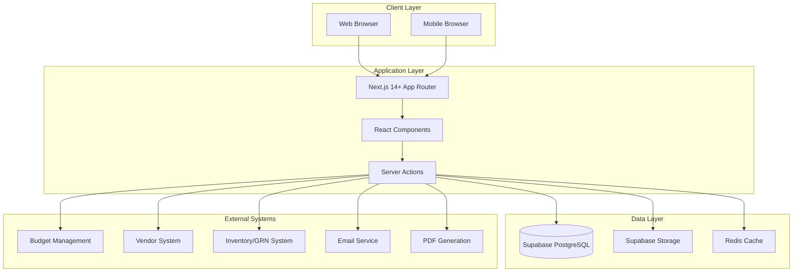
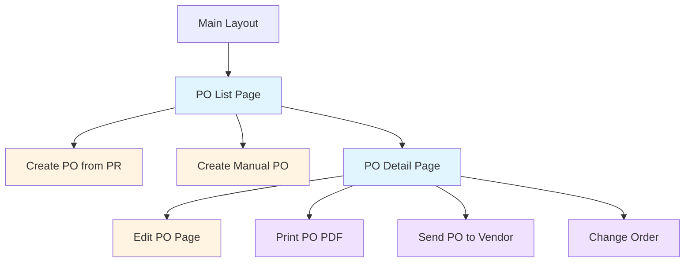
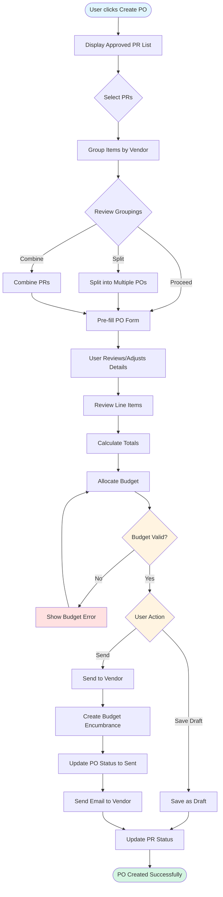
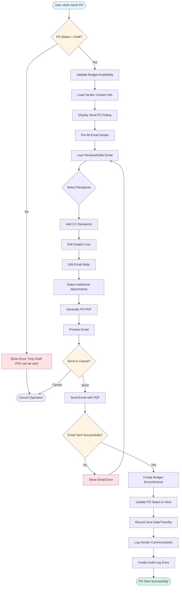
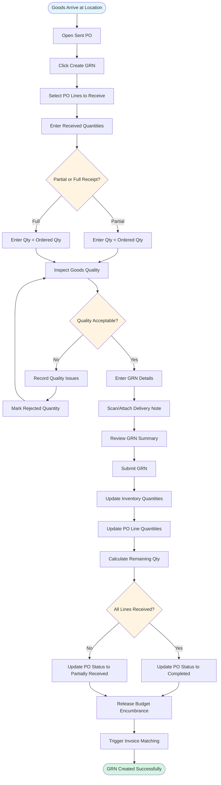

# Technical Specification: Purchase Orders

## Document Information
- **Module**: Procurement
- **Sub-Module**: Purchase Orders
- **Document Type**: Technical Specification (TS)
- **Version**: 2.0.0
- **Last Updated**: 2025-10-31
- **Status**: Approved

**Document History**:
- v1.0.0 (2025-10-30): Initial version with approval workflows
- v1.1.0 (2025-10-31): Added correction notice
- v2.0.0 (2025-10-31): Complete revision - removed all approval workflow content, corrected status flow to match actual implementation

## Related Documents
- [Business Requirements](./BR-purchase-orders.md)
- [Use Cases](./UC-purchase-orders.md)
- [Data Definition](./DS-purchase-orders.md)
- [Flow Diagrams](./FD-purchase-orders.md)
- [Validations](./VAL-purchase-orders.md)

---

## Overview

This document provides high-level technical implementation guidance for the Purchase Orders sub-module. It describes the system architecture, page structure, navigation flows, component responsibilities, and integration patterns without including specific code implementations.

**Technology Stack**:
- **Framework**: Next.js 14+ with App Router
- **Language**: TypeScript (strict mode)
- **Styling**: Tailwind CSS + Shadcn/ui
- **State Management**: Zustand + React Query
- **Forms**: React Hook Form + Zod validation
- **Database**: PostgreSQL via Supabase
- **API**: Next.js Server Actions + REST API

---

## High-Level System Architecture



**Architecture Description**:
- **Client Layer**: Browser-based interface supporting desktop and mobile responsive design
- **Application Layer**: Next.js server-side rendering with React components and server actions for data operations
- **Data Layer**: PostgreSQL database via Supabase with caching layer for performance
- **External Systems**: Integration with budget validation, vendor management, inventory tracking, email notifications, and PDF generation

---

## Page Hierarchy and Structure



**Page Hierarchy Description**:
- **Main Layout**: Contains global navigation, sidebar, and common elements
- **PO List Page**: Primary landing page with filterable, sortable PO list
- **Create PO from PR**: Conversion workflow from approved purchase requests
- **Create Manual PO**: Direct PO creation without PR (for emergency purchases)
- **PO Detail Page**: Read-only view of complete PO information
- **Edit PO Page**: Form for modifying draft POs
- **Print PO PDF**: Generate and download formatted PO document
- **Send PO to Vendor**: Email dialog for transmitting PO to supplier
- **Change Order**: Create amendments to approved POs

---

## Page Descriptions

### Purchase Order List Page

**Route**: `/procurement/purchase-orders`

**Purpose**: Display all purchase orders with filtering, sorting, and search capabilities

**Layout Components**:
- **Page Header**: Title, breadcrumb, Create PO button
- **Filter Bar**: Status filter, Vendor dropdown, Date range, Created by, Amount range
- **Quick Filters**: My POs, Draft, Sent, Acknowledged, Partial Received, Fully Received
- **Search Bar**: Search by PO number, vendor name, item description
- **Data Table**: Paginated list of POs with sortable columns
- **Action Buttons**: View, Edit (draft only), Print, Send (draft only), contextual actions
- **Export Button**: Export filtered results to Excel/CSV

**Key Features**:
- Real-time auto-refresh (no manual refresh button)
- Click row to view details
- Responsive table with column visibility toggle
- Status indicators with color coding (Draft: gray, Sent: blue, Acknowledged: green, Partial Received: yellow, Fully Received: purple, Closed: teal, Cancelled: red)
- Pagination (20 items per page default, configurable)
- Bulk actions for multiple POs (export, print)

**Display Columns**:
- PO Number (clickable link)
- Vendor Name
- Order Date
- Expected Delivery Date
- Status Badge
- Grand Total (formatted with currency)
- Created By (user name)
- Actions (icon buttons)

**State Management**:
- Local state for filters, sorting, pagination
- React Query for server state (PO data)
- Debounced search for performance

---

### Create PO from PR Page

**Route**: `/procurement/purchase-orders/create`

**Purpose**: Convert one or more approved purchase requests into purchase orders

**Layout Components**:
- **Page Header**: Title "Create Purchase Order from PR", breadcrumb
- **PR Selection Panel**: Search and select approved PRs
  * Search by PR number, item, requestor
  * Filter by department, location, date range
  * Multi-select capability for combining PRs
  * Preview of selected PR items
- **Vendor Grouping Panel**: Automatic grouping of PR items by vendor
  * Show vendor name and item count
  * Option to split into multiple POs
  * Option to combine items from multiple PRs to same vendor
- **PO Form**: Main purchase order creation form (see PO Form Component below)
- **Action Buttons**: Save as Draft, Send to Vendor, Cancel

**Workflow**:
1. User selects one or more approved PRs
2. System groups PR items by vendor
3. User reviews groupings and can split/combine as needed
4. For each vendor group, user creates a PO
5. System pre-fills PO details from PR (vendor, delivery location, items, terms)
6. User reviews, adjusts if needed, and sends to vendor

**Business Rules**:
- Only approved PRs can be converted
- PR items already on a PO cannot be selected again
- Multiple PRs can be combined if they have the same vendor
- Single PR can be split into multiple POs by vendor or delivery date

---

### Create Manual PO Page

**Route**: `/procurement/purchase-orders/create/manual`

**Purpose**: Create purchase order directly without a purchase request (for urgent or small purchases)

**Layout Components**:
- **Page Header**: Title "Create Manual Purchase Order", breadcrumb
- **PO Form**: Main purchase order creation form
- **Authorization Notice**: Note that manual POs must be created by authorized purchasing staff
- **Action Buttons**: Save as Draft, Send to Vendor, Cancel

**Key Features**:
- All fields manually entered by user
- Vendor selection with search capability
- Line item entry with product catalog integration
- Budget allocation selection
- Automatic totals calculation
- Validation against budget availability

**Business Rules**:
- Requires special permission (create_manual_po - authorized purchasing staff only)
- Amount limits may apply (e.g., under $5,000 for certain staff levels)
- High-value POs may be flagged for manager review (informational, not blocking)
- Justification/reason field is mandatory

---

### Purchase Order Detail Page

**Route**: `/procurement/purchase-orders/[id]`

**Purpose**: Display complete purchase order information in read-only format

**Layout Components**:
- **Page Header**:
  * PO Number (large, prominent)
  * Status Badge
  * Action buttons (Edit, Print, Send, Change Order, Cancel)
  * Breadcrumb navigation
- **PO Header Section**:
  * Vendor information (name, contact, address)
  * Order Date, Expected Delivery Date
  * Delivery Location
  * Payment Terms, Delivery Terms
  * Created By, Created Date
  * Authorized By (purchasing staff who created/sent PO)
  * Sent Date, Sent By (if sent)
- **Line Items Table**:
  * Line Number, Product/Description
  * Quantity, Unit of Measure, Unit Price
  * Line Total, Tax Amount
  * Expected Delivery Date (if different from PO)
  * Quantity Received, Quantity Remaining
  * Specifications, Notes
- **Totals Panel**:
  * Subtotal
  * Discount Amount/Percentage
  * Amount After Discount
  * Tax Amount
  * Shipping Amount
  * Grand Total (prominent, large font)
- **Budget Allocation Panel**:
  * Budget account name and code
  * Allocation percentage
  * Allocation amount
  * Budget availability status
  * Budget encumbrance status (created when PO sent to vendor)
- **Documents Panel**:
  * Attached quotes, specifications, contracts
  * File name, type, size, upload date
  * Download links
- **Notes Section**:
  * Public notes (visible to vendor)
  * Internal notes (internal use only)
- **Activity Log**:
  * Chronological list of all changes
  * Change type, changed by, date/time
  * Old value → New value (for field changes)
  * Comments/reason for change

**Key Features**:
- Print-friendly layout
- PDF generation for vendor transmission
- Email PO to vendor (approved POs only)
- Track vendor acknowledgment
- Link to related PRs (if converted from PR)
- Link to GRNs (Goods Receipt Notes) when received
- Change order creation (for approved POs)
- Cancellation with reason (appropriate permissions required)

---

### Edit PO Page

**Route**: `/procurement/purchase-orders/[id]/edit`

**Purpose**: Modify draft purchase orders before submission

**Layout Components**:
- **Page Header**: Title "Edit Purchase Order [PO Number]", breadcrumb
- **PO Form**: Main purchase order form (see PO Form Component)
- **Action Buttons**: Save Changes, Send to Vendor, Cancel

**Key Features**:
- Pre-populated with existing PO data
- Same validation as create form
- Automatic totals recalculation on changes
- Budget re-validation on amount changes
- Audit trail of all modifications

**Business Rules**:
- Only draft POs can be edited
- Once sent to vendor, editing requires creating a change order
- Changes to sent POs require change order process
- Re-validation of budget availability if total increases

---

## Navigation Flow Diagrams

### 1. Create Purchase Order from PR Flow



**Flow Description**:
1. **PR Selection**: User browses approved PRs and selects one or more to convert
2. **Vendor Grouping**: System automatically groups PR items by vendor
3. **Review and Adjust**: User can split items to multiple POs or combine multiple PRs
4. **Form Pre-fill**: System loads vendor, location, terms, and items from PRs
5. **Detail Entry**: User reviews and adjusts quantities, prices, delivery dates
6. **Totals Calculation**: System calculates subtotal, discounts, tax, total automatically
7. **Budget Allocation**: User allocates PO total to budget accounts (percentages must sum to 100%)
8. **Budget Validation**: System validates budget availability in real-time
9. **Save or Send**: User can save as draft for later or send to vendor immediately
10. **Budget Encumbrance**: If sent, system creates budget encumbrance for PO amount
11. **Vendor Notification**: If sent, system sends PO email to vendor
12. **PR Status Update**: Source PR status updated to "On PO" or "Partially on PO"

---

### 2. Send PO to Vendor Flow



**Flow Description**:
1. **Status Validation**: System verifies PO is in "Draft" status
2. **Budget Validation**: System confirms budget is available for encumbrance
3. **Vendor Lookup**: System retrieves vendor primary and additional contacts
4. **Email Dialog**: Modal opens with email composition form
5. **Pre-fill**: System populates To (vendor primary contact), Subject, Body from template
6. **User Customization**: User can edit recipients, subject, body text
7. **CC Recipients**: User can add additional recipients (accounting, receiving, etc.)
8. **Attachments**: User can add additional documents (quotes, specifications, contracts)
9. **PDF Generation**: System generates formatted PO PDF for attachment
10. **Preview**: User reviews complete email before sending
11. **Email Transmission**: System sends email via SMTP service
12. **Budget Encumbrance**: If successful, system creates budget encumbrance for PO amount
13. **Status Update**: PO status changes to "Sent"
14. **Timestamp Recording**: Sent date, time, and user recorded
15. **Communication Log**: Email details saved for audit trail
16. **Audit Trail**: Change logged in PO history

**Email Template Example**:
- **Subject**: "Purchase Order [PO-2024-000123] - [Vendor Name]"
- **Body**: Professional business letter format with PO details, delivery instructions, contact information
- **Attachments**: PO PDF (required), additional specs/drawings (optional)

---

### 3. Receive Goods Flow (Goods Receipt Note Creation)



**Flow Description**:
1. **Goods Arrival**: Warehouse staff opens the sent PO when goods arrive
2. **GRN Creation**: Click "Create GRN" button on PO detail page
3. **Line Selection**: Select which PO lines are being received (can be subset)
4. **Quantity Entry**: Enter actual received quantities for each line
5. **Partial vs Full**: System identifies if receiving full order or partial shipment
6. **Quality Inspection**: Staff physically inspects goods for quality, damage, correctness
7. **Quality Issues**: If problems found, record issues and mark rejected quantities
8. **GRN Details**: Enter delivery note number, carrier name, condition notes
9. **Document Attachment**: Scan and attach supplier delivery note/packing slip
10. **Review**: User reviews GRN summary before submission
11. **Inventory Update**: System increases on-hand inventory quantities
12. **PO Update**: System updates "Quantity Received" and "Quantity Remaining" on PO lines
13. **Completion Check**: If all lines fully received, PO marked "Completed", otherwise "Partially Received"
14. **Budget Release**: Budget encumbrance released (partial for partial receipt, full for complete)
15. **Invoice Matching**: System triggers 3-way match process (PO-GRN-Invoice)

---

## Component Descriptions

### Purchase Order List Component

**Responsibility**: Display paginated, filterable, sortable list of purchase orders

**Features**:
- Server-side data fetching with React Query
- Client-side filtering and sorting
- Pagination with page size options (10, 20, 50, 100)
- Column visibility toggle
- Export to Excel/CSV
- Bulk actions (print multiple POs)
- Real-time updates via polling or websockets
- Responsive design (card view on mobile, table view on desktop)

**Data Requirements**:
- Purchase order list with vendor, status, dates, totals
- User permissions for action buttons
- Filter and sort preferences from user session

**User Interactions**:
- Click row to navigate to detail page
- Apply filters via sidebar
- Sort by column headers
- Change page size
- Navigate pages
- Export filtered results
- Bulk select and print

---

### Purchase Order Form Component

**Responsibility**: Handle PO creation and editing with comprehensive validation

**Features**:
- Multi-section form layout (header, line items, totals, budget)
- Real-time validation (client and server)
- Auto-save draft (every 2 minutes)
- Vendor search and selection
- Product catalog integration for line items
- Automatic totals calculation
- Budget allocation with real-time availability check
- Document upload capability
- Template application (if creating from template)
- Responsive form layout

**Sections**:
1. **Vendor Selection**: Searchable dropdown with vendor details preview
2. **Order Details**: Order date, delivery date, location, terms
3. **Line Items Table**:
   - Add/edit/remove rows
   - Product search
   - Quantity, UOM, unit price entry
   - Automatic line total calculation
   - Expected delivery date per line
   - Specifications and notes per line
4. **Discount Section**: Amount or percentage, mutually exclusive
5. **Totals Display**: Real-time calculation of subtotal, discount, tax, shipping, grand total
6. **Budget Allocation**: Allocate grand total to one or more budget accounts (must sum to 100%)
7. **Notes**: Public notes (to vendor) and internal notes (internal use)
8. **Attachments**: Upload quotes, specifications, contracts

**Validation Rules**:
- Vendor required
- At least one line item required
- Quantities must be positive
- Expected delivery date must be after order date
- Budget allocations must sum to exactly 100%
- Cannot specify both discount amount and percentage
- Budget must be available for total amount

**State Management**:
- Form state with React Hook Form
- Zod schema validation
- Optimistic updates for better UX
- Error handling with user-friendly messages

---

### Purchase Order Line Items Component

**Responsibility**: Manage line items table within PO form

**Features**:
- Add new line items via modal or inline
- Edit existing line items
- Remove line items (with confirmation)
- Reorder line items via drag-and-drop
- Product search and selection from catalog
- Copy line items from another PO or PR
- Bulk edit (apply same change to multiple lines)
- Column customization

**Line Item Data**:
- Line number (auto-assigned)
- Product (optional, from catalog)
- Description (required)
- Quantity and unit of measure
- Unit price
- Line total (calculated)
- Tax amount (calculated based on product tax code)
- Expected delivery date (optional, defaults to PO delivery date)
- Specifications (optional)
- Notes (optional)

**Calculations**:
- Line total = quantity × unit price
- Tax amount = line total × tax rate (from product or location)
- Subtotal = sum of all line totals
- Grand total = subtotal - discount + tax + shipping

---

### Purchase Order Totals Component

**Responsibility**: Display financial calculations for PO

**Features**:
- Real-time calculation updates
- Currency formatting
- Breakdown of all charges
- Prominent grand total display
- Tax details breakdown

**Display Sections**:
1. **Subtotal**: Sum of all line item totals
2. **Discount**: Amount or percentage applied
3. **Amount After Discount**: Subtotal minus discount
4. **Tax**: Detailed by tax code and rate
5. **Shipping/Freight**: Shipping charges
6. **Grand Total**: Final amount in large, bold font

**Calculation Flow**:
```
Subtotal = Σ(Quantity × Unit Price) for all line items
Discount = Discount Amount OR (Subtotal × Discount Percentage)
Amount After Discount = Subtotal - Discount
Tax = Amount After Discount × Tax Rate(s)
Grand Total = Amount After Discount + Tax + Shipping
```

---

### Vendor Selection Dialog Component

**Responsibility**: Search and select vendor for PO

**Features**:
- Search vendors by name, code, category
- Filter by status (active only by default)
- Display vendor summary (contact, terms, rating)
- Show vendor performance metrics (on-time delivery %, quality rating)
- Display recent purchase history with vendor
- Quick create new vendor option (if permitted)

**Vendor Information Displayed**:
- Vendor name and code
- Primary contact name and email
- Phone number
- Payment terms (default)
- Delivery terms (default)
- Approved product categories
- Credit status
- Performance rating (1-5 stars)

**Selection Behavior**:
- Single selection only
- Auto-populate PO terms from vendor defaults
- Validate vendor is active and approved
- Check vendor credit limit if applicable

---

### PR Selection Dialog Component

**Responsibility**: Select purchase requests to convert to PO

**Features**:
- List approved PRs eligible for conversion
- Search by PR number, item, requestor
- Filter by department, location, date range
- Multi-select capability
- Preview selected PR details
- Show which items already on POs
- Display total value of selected PRs

**PR Display Information**:
- PR number
- Requestor name and department
- Request date
- Status (must be Approved)
- Number of items
- Total amount
- Vendor (if single vendor)
- Delivery location

**Selection Logic**:
- Only approved PRs selectable
- Cannot select PR items already on a PO
- Can select multiple PRs if same vendor
- Highlight incompatible PRs (different vendors)

---

### Send PO Dialog Component

**Responsibility**: Compose and send PO email to vendor

**Features**:
- Pre-filled email template
- Vendor contact selection (primary + additional)
- CC field for internal recipients
- Subject line editing
- Rich text email body editor
- Attachment management (PO PDF + additional files)
- Email preview
- Send confirmation

**Email Template Fields**:
- **To**: Vendor primary contact email (editable)
- **CC**: Additional vendor contacts, internal accounting, receiving (multi-select)
- **Subject**: "Purchase Order [PO Number] - [Vendor Name]" (editable)
- **Body**: Professional business letter with:
  * Greeting
  * PO details (number, date, amount)
  * Delivery instructions
  * Payment terms
  * Contact information for questions
  * Closing and signature
- **Attachments**:
  * PO PDF (required, auto-generated)
  * Additional specifications (optional)
  * Drawings/technical documents (optional)

**Send Process**:
1. User opens Send dialog from PO detail page
2. System pre-fills template with PO and vendor data
3. User reviews and edits as needed
4. User clicks Send
5. System validates email addresses
6. System generates PO PDF
7. System sends email via SMTP
8. System updates PO status to "Sent"
9. System records communication log
10. User receives confirmation message

---

### Change Order Dialog Component

**Responsibility**: Create amendment to approved PO

**Features**:
- Select change type (add items, change quantities, change prices, change dates)
- Enter change reason (required)
- Impact analysis (budget, delivery date, approval requirements)
- Approval routing (may require re-approval)
- Change order number generation
- Audit trail of changes

**Change Types**:
1. **Add Line Items**: Add new products to PO
2. **Remove Line Items**: Remove products (if not yet received)
3. **Change Quantities**: Increase or decrease ordered quantities
4. **Change Prices**: Adjust unit prices (price changes only)
5. **Change Delivery Date**: Modify expected delivery date
6. **Change Terms**: Modify payment or delivery terms

**Change Order Process**:
1. User selects change type
2. User enters changes in form
3. System calculates impact:
   - Budget change (increase requires budget validation)
   - Approval requirements (increases over threshold require re-approval)
   - Vendor notification requirements
4. User enters change reason (mandatory)
5. System creates change order record
6. If re-approval required, route through approval workflow
7. If approved/no approval needed, system:
   - Updates PO with changes
   - Generates amendment PDF
   - Sends to vendor if already sent
   - Records in audit trail

---

### Cancel PO Dialog Component

**Responsibility**: Cancel purchase order with reason

**Features**:
- Cancellation reason dropdown (out of stock, vendor issue, no longer needed, price change, etc.)
- Free-text explanation field
- Impact analysis (budget release, inventory adjustment, PR status update)
- Vendor notification option
- Confirmation with summary

**Cancellation Process**:
1. User clicks Cancel PO (requires permission)
2. System validates PO status (cannot cancel if goods already received)
3. User selects cancellation reason category
4. User enters detailed explanation
5. System shows impact summary:
   - Budget encumbrance to be released
   - Source PR status to be updated
   - Vendor notification (if PO was sent)
6. User confirms cancellation
7. System:
   - Updates PO status to "Cancelled"
   - Records cancellation date, reason, cancelled by
   - Releases budget encumbrance
   - Updates source PR status to allow re-conversion
   - Sends cancellation notification to vendor (if applicable)
   - Creates audit log entry

**Business Rules**:
- Cannot cancel PO with received goods (must create return)
- Cancelled POs cannot be reactivated (must create new PO)
- Cancellation recorded in vendor performance metrics
- Requires appropriate permission level

---

## Server Actions and Data Operations

### Purchase Order Server Actions

**File Location**: Server-side actions for PO operations

**Actions**:

1. **createPurchaseOrder**
   - **Purpose**: Create new PO from form data
   - **Inputs**: PO form data, user context
   - **Process**:
     * Validate user permissions
     * Generate PO number (format: PO-YYYY-NNNNNN)
     * Calculate totals and validate calculations
     * Validate budget availability
     * Create PO header record
     * Create line item records
     * Create budget allocation records
     * Update source PR status (if converting from PR)
     * Create audit log entry
     * Revalidate cache
   - **Outputs**: Success/failure response with PO ID and number

2. **sendPurchaseOrderToVendor**
   - **Purpose**: Send PO to vendor via email
   - **Inputs**: PO ID, email data (to, cc, subject, body, additional attachments)
   - **Process**:
     * Validate PO is in Draft status
     * Validate user has send_purchase_orders permission
     * Load PO and vendor details
     * Validate budget availability
     * Generate PO PDF
     * Compose email with PDF and attachments
     * Send email via SMTP service
     * If successful:
       - Create budget encumbrance for PO amount
       - Update PO status to "Sent"
       - Record sent date, time, user
       - Log vendor communication
       - Create audit log entry
   - **Outputs**: Success/failure response

3. **cancelPurchaseOrder**
   - **Purpose**: Cancel PO with reason
   - **Inputs**: PO ID, cancellation reason, detailed explanation
   - **Process**:
     * Validate no goods received yet
     * Validate user has cancellation permission
     * Update PO status to "Cancelled"
     * Record cancellation details
     * Release budget encumbrance
     * Update source PR status (if applicable)
     * Send vendor cancellation notification (if PO was sent)
     * Create audit log entry
   - **Outputs**: Success/failure response

4. **createChangeOrder**
   - **Purpose**: Create amendment to sent PO
   - **Inputs**: PO ID, change type, change details, reason
   - **Process**:
     * Validate change is allowed (not fully received)
     * Calculate impact (budget change, delivery date change)
     * Create change order record
     * Apply changes to PO
     * Update budget encumbrance if amount changed
     * Generate amendment PDF
     * Notify vendor if already sent
     * Create audit log entry
   - **Outputs**: Success/failure response, change order ID

---

### Custom Hooks

**Purpose**: Encapsulate data fetching and business logic

**Hooks**:

1. **usePurchaseOrders**
   - **Purpose**: Fetch paginated, filtered, sorted PO list
   - **Inputs**: Filters, sort config, page, page size
   - **Returns**: Purchase orders array, total count, loading state, error state
   - **Features**: React Query integration, caching (30 seconds stale time)

2. **usePurchaseOrder**
   - **Purpose**: Fetch single PO with all related data
   - **Inputs**: PO ID
   - **Returns**: Purchase order object with line items, approvals, documents, history
   - **Features**: Optimistic updates, real-time sync

3. **usePurchaseOrderForm**
   - **Purpose**: Manage PO form state and validation
   - **Inputs**: Initial PO data (for editing)
   - **Returns**: Form methods, validation state, submit handler
   - **Features**: Zod validation, auto-save draft, totals calculation

4. **usePurchaseOrderCalculations**
   - **Purpose**: Calculate PO totals in real-time
   - **Inputs**: Line items, discount, shipping, location
   - **Returns**: Subtotal, discount amount, tax, grand total
   - **Features**: Memoized calculations, automatic recalc on changes

5. **useBudgetValidation**
   - **Purpose**: Validate budget availability
   - **Inputs**: Budget allocations, required amount
   - **Returns**: Validation status, available amounts, error messages
   - **Features**: Real-time validation, integration with budget service

6. **usePurchaseOrderSend**
   - **Purpose**: Manage PO sending to vendor
   - **Inputs**: PO ID
   - **Returns**: Send status, vendor contact info, email template data
   - **Features**: Email composition, PDF generation trigger, status tracking

---

### Utility Functions

**Purpose**: Reusable helper functions

**Utilities**:

1. **generatePONumber**
   - **Purpose**: Generate unique PO number
   - **Logic**: Format PO-YYYY-NNNNNN where YYYY is fiscal year and NNNNNN is sequential
   - **Implementation**: Database function maintains sequence per year, atomic increment

2. **calculateTotals**
   - **Purpose**: Calculate PO financial totals
   - **Inputs**: Line items, discount, shipping, tax rates
   - **Returns**: Subtotal, discount amount, amount after discount, tax amount, grand total
   - **Logic**: Sum line items, apply discount, calculate tax on discounted amount, add shipping

3. **generatePOPDF**
   - **Purpose**: Generate formatted PO PDF document
   - **Inputs**: PO data with all related entities
   - **Returns**: PDF file path or buffer
   - **Features**: Professional layout, company branding, barcode/QR code

4. **validateVendorEligibility**
   - **Purpose**: Check vendor can fulfill PO requirements
   - **Inputs**: Vendor ID, product categories
   - **Returns**: Eligibility status, reason if ineligible
   - **Checks**: Vendor active status, approved categories, credit limit

---

## Integration Points

### Budget Management Integration

**Purpose**: Validate budget availability and create encumbrances

**Integration Type**: REST API calls to budget service

**Operations**:

1. **Check Budget Availability**
   - **Endpoint**: POST /api/budget/check-availability
   - **Inputs**: Budget account ID, required amount, fiscal year
   - **Returns**: Available amount, sufficient flag
   - **When**: Before PO submission, during creation/editing

2. **Create Budget Encumbrance**
   - **Endpoint**: POST /api/budget/create-encumbrance
   - **Inputs**: Budget account ID, amount, fiscal year, reference (PO number)
   - **Returns**: Encumbrance ID
   - **When**: When PO is sent to vendor

3. **Release Budget Encumbrance**
   - **Endpoint**: POST /api/budget/release-encumbrance
   - **Inputs**: Encumbrance ID, release amount
   - **Returns**: Success status
   - **When**: On cancellation, partial on partial receipt, full on complete receipt

4. **Update Encumbrance**
   - **Endpoint**: PUT /api/budget/update-encumbrance
   - **Inputs**: Encumbrance ID, new amount
   - **Returns**: Success status
   - **When**: On change order approval

**Error Handling**:
- Display budget error messages to user
- Prevent submission if insufficient budget
- Retry logic for transient failures
- Fallback to manual budget check if service unavailable

---

### Vendor System Integration

**Purpose**: Retrieve vendor information and validate status

**Integration Type**: Direct database queries via Supabase

**Operations**:

1. **Get Vendor Details**
   - **Query**: vendors table by ID
   - **Returns**: Vendor profile with contact, terms, categories
   - **When**: On vendor selection, PO form load

2. **Validate Vendor Eligibility**
   - **Query**: vendors table with status and category checks
   - **Returns**: Eligibility status, reason if ineligible
   - **When**: On vendor selection, before PO submission

3. **Get Vendor Performance Metrics**
   - **Query**: Aggregate queries on past POs and GRNs
   - **Returns**: On-time delivery %, quality rating, average lead time
   - **When**: Display in vendor selection dialog

4. **Update Vendor Performance**
   - **Query**: Update vendor metrics based on PO outcome
   - **When**: On PO completion or cancellation

---

### Inventory System Integration

**Purpose**: Check stock levels and reserve inventory

**Integration Type**: API calls to inventory service

**Operations**:

1. **Check Stock Availability**
   - **Endpoint**: GET /api/inventory/check-stock
   - **Inputs**: Product ID, location ID
   - **Returns**: On-hand, reserved, available quantities
   - **When**: Display in line item entry

2. **Reserve Inventory**
   - **Endpoint**: POST /api/inventory/reserve
   - **Inputs**: Product ID, quantity, PO line item ID
   - **Returns**: Reservation ID
   - **When**: On PO approval (optional, based on business rules)

3. **Release Reservation**
   - **Endpoint**: DELETE /api/inventory/reserve/{id}
   - **When**: On PO cancellation

4. **Update Inventory on Receipt**
   - **Endpoint**: POST /api/inventory/receive
   - **Inputs**: Product ID, quantity, location ID, GRN ID
   - **Returns**: New inventory levels
   - **When**: On GRN creation (handled by GRN module)

---

### Email/Notification Service Integration

**Purpose**: Send PO documents and notifications

**Integration Type**: SMTP service for emails, internal notification system

**Operations**:

1. **Send PO to Vendor**
   - **Method**: SMTP email with PDF attachment
   - **Triggered by**: User action "Send PO"
   - **Content**: Business letter with PO PDF
   - **Tracking**: Log sent date, recipients, delivery status

2. **Status Change Notifications**
   - **Method**: Email + in-app notification
   - **Triggered by**: PO sent to vendor, vendor acknowledgment, goods receipt
   - **Recipients**: PO creator, department manager, receiving staff
   - **Content**: Status update, link to PO, next actions

3. **Completion Notifications**
   - **Method**: Email + in-app notification
   - **Triggered by**: Goods fully received, PO closed
   - **Recipients**: PO creator, accounting, purchasing manager
   - **Content**: Completion summary, invoice matching status

---

### PDF Generation Service

**Purpose**: Create formatted PO documents

**Integration Type**: Server-side PDF library (e.g., puppeteer, pdfkit)

**Features**:
- Company letterhead and branding
- Professional PO layout
- Line items table with subtotals
- Terms and conditions
- Payment and delivery instructions
- Barcode/QR code with PO number
- Digital signature (if configured)
- Watermark for status (Draft, Approved, Sent)

**Generation Process**:
1. Load PO data with all related entities
2. Load company branding and template
3. Populate template with PO data
4. Generate line items table
5. Calculate and display totals
6. Add barcode/QR code
7. Apply watermark based on status
8. Generate PDF file
9. Save to storage
10. Return file path or stream

---

## Security Considerations

### Role-Based Access Control (RBAC)

**Permission Matrix**:

| Action | Required Permission | Additional Checks |
|--------|-------------------|-------------------|
| View PO | view_purchase_orders OR created PO | Department access |
| Create PO | create_purchase_orders | Budget allocation permission |
| Edit Draft PO | edit_purchase_orders | Must be creator OR admin |
| Send PO | send_purchase_orders | PO must be in Draft status, authorized purchasing staff only |
| Cancel PO | cancel_purchase_orders | No goods received yet |
| Create Change Order | edit_purchase_orders | PO not fully received |
| View Budget Details | view_budget_details | Department budget only |
| High-Value PO Review | purchasing_manager | Informational review for POs above threshold (optional) |

**Permission Checking**:
- Middleware validates permissions before page access
- Server actions validate permissions before operations
- UI conditionally renders actions based on permissions
- Audit log records all permission checks and denials

---

### Data Validation

**Client-Side Validation**:
- Zod schemas for all form inputs
- Real-time validation on field blur
- Clear error messages
- Prevent invalid data from reaching server

**Server-Side Validation**:
- Re-validate all inputs on server actions
- Business rule validation (e.g., budget availability)
- Database constraints (foreign keys, uniqueness, check constraints)
- Input sanitization to prevent injection attacks

**Security Measures**:
- SQL injection prevention via parameterized queries (Supabase)
- XSS prevention via proper output escaping (React automatic)
- CSRF protection via Next.js built-in middleware
- File upload validation (type, size, malware scan)

---

### Data Privacy

**Sensitive Data Protection**:
- Vendor pricing information restricted by permission
- Internal notes not sent to vendor
- Budget details restricted to authorized users
- Personal information (phone, email) access controlled

**Audit Trail**:
- All PO operations logged with user ID, timestamp, action
- Before/after values recorded for changes
- IP address and user agent logged
- Retention policy: 7 years for financial records

---

## Performance Optimization

### Database Query Optimization

**Indexing Strategy**:
- Index on po_number (unique) for fast lookup
- Index on status for filtering
- Index on vendor_id for vendor queries
- Index on order_date for date range queries
- Composite index on (status, order_date) for common list query
- Index on created_by for "My POs" filter
- Full-text index on search fields (description, notes)

**Query Optimization**:
- Use SELECT with specific columns, avoid SELECT *
- JOIN only necessary related tables
- Pagination to limit result sets
- Use database views for complex aggregations
- Connection pooling for performance

**Caching Strategy**:
- React Query cache (30 seconds stale time for list, 5 minutes for details)
- Server-side cache for lookup data (vendors, locations, products)
- CDN caching for static assets (CSS, images)
- Edge caching for read-heavy data

---

### React Query Configuration

**Query Settings**:
- **staleTime**: 30 seconds (list views), 5 minutes (detail views)
- **cacheTime**: 5 minutes (garbage collection)
- **refetchOnWindowFocus**: false (prevent unnecessary refetches)
- **retry**: 1 attempt (fast failure)

**Optimistic Updates**:
- Line item changes apply immediately in UI
- Server validation in background
- Rollback on server error
- Success toast on confirmation

---

### Pagination Strategy

**Implementation**:
- Server-side pagination for all list views
- Page size options: 10, 20, 50, 100
- Default: 20 items per page
- Cursor-based pagination for large datasets (better performance than offset)
- Total count cached separately (expensive query)

---

### Code Splitting

**Optimization**:
- Dynamic imports for modals and dialogs
- Route-based code splitting (Next.js automatic)
- Lazy load PDF viewer component
- Lazy load rich text editor (email body)

---

## Error Handling

### Client-Side Error Handling

**Error Boundary**:
- Top-level error boundary for PO module
- Catches component render errors
- Displays user-friendly error message
- Provides retry button
- Logs error to monitoring service

**Form Errors**:
- Field-level validation errors inline
- Form-level errors in alert banner
- Clear, actionable error messages
- Preserve user input on error

**Network Errors**:
- Detect network failures
- Display offline message
- Queue operations for retry
- Auto-retry on reconnection

---

### Server-Side Error Handling

**Error Response Format**:
```
Success: { success: true, data: {...} }
Error: { success: false, error: "message", code: "ERROR_CODE" }
```

**Error Types**:
- **Validation Errors**: 400 Bad Request with field details
- **Authentication Errors**: 401 Unauthorized
- **Permission Errors**: 403 Forbidden
- **Not Found Errors**: 404 Not Found
- **Business Logic Errors**: 422 Unprocessable Entity
- **Server Errors**: 500 Internal Server Error

**Error Logging**:
- All server errors logged with context
- Error details sent to monitoring service
- User-friendly message returned to client
- Sensitive information excluded from client response

---

### Error Recovery

**Automatic Recovery**:
- Retry transient failures (network, timeout)
- Exponential backoff for retries
- Circuit breaker for failing services
- Fallback to cached data when possible

**User-Initiated Recovery**:
- Clear error messages with suggested actions
- Retry button for failed operations
- Contact support link for unrecoverable errors
- Session recovery on browser refresh

---

## Monitoring and Logging

### Performance Monitoring

**Metrics Tracked**:
- Page load time (target: <2 seconds)
- API response time (target: <500ms)
- Database query time (target: <100ms)
- PDF generation time (target: <3 seconds)
- Email send time (target: <5 seconds)

**Monitoring Tools**:
- Application Performance Monitoring (APM) service integration
- Real User Monitoring (RUM) for client-side performance
- Database query performance logs
- Server resource utilization (CPU, memory, disk)

**Alerts**:
- Page load time >5 seconds
- API error rate >5%
- Database connection pool exhaustion
- Failed email deliveries
- Budget service unavailable

---

### Application Logging

**Log Levels**:
- **ERROR**: System errors, exceptions, failures
- **WARN**: Unexpected conditions, degraded functionality
- **INFO**: Key operations (create PO, approve PO, send PO)
- **DEBUG**: Detailed debugging information (development only)

**Logged Operations**:
- PO creation with user ID and total amount
- Approval actions with approver ID and decision
- Budget validation results
- Vendor communications
- Error conditions with stack traces

**Log Retention**:
- Application logs: 90 days
- Audit logs: 7 years (regulatory requirement)
- Performance metrics: 1 year

---

### Audit Trail

**Audited Actions**:
- Create, update, delete PO
- Submit for approval
- Approve or reject
- Send to vendor
- Change orders
- Cancellations
- Budget allocation changes

**Audit Record Contains**:
- Timestamp (UTC)
- User ID and name
- Action type
- PO ID and number
- Field changed (if applicable)
- Old value → New value
- Change reason (if applicable)
- IP address
- User agent

---

## Testing Strategy

### Unit Tests

**Testing Framework**: Vitest

**Coverage Targets**:
- Utility functions: 100%
- Calculation logic: 100%
- Business rules: 95%
- Components: 80%

**Test Examples**:
- PO number generation produces correct format
- Totals calculation with various discount scenarios
- Tax calculation based on location
- Budget allocation validation (sum to 100%)
- Approval level determination by amount

---

### Integration Tests

**Test Scenarios**:
- Create PO from PR successfully
- Submit PO for approval and route to correct approvers
- Approve PO at multiple levels
- Reject PO and verify status rollback
- Send PO to vendor with PDF generation
- Cancel PO and verify budget release
- Create change order and re-route for approval

**Database Tests**:
- Transaction rollback on errors
- Foreign key constraint violations
- Concurrent update handling
- Data integrity after complex operations

---

### End-to-End Tests

**Testing Tool**: Playwright

**Critical User Flows**:
1. Complete PO creation flow (PR selection → form → submit → approve)
2. Multi-level approval workflow
3. Send PO to vendor flow
4. Goods receipt flow (PO → GRN → inventory update)
5. Change order flow (create → approve → notify vendor)
6. Cancellation flow

**Browser Coverage**:
- Chrome (latest)
- Firefox (latest)
- Safari (latest)
- Edge (latest)

---

### Accessibility Testing

**Standards**: WCAG 2.1 AA compliance

**Testing**:
- Keyboard navigation (all actions accessible)
- Screen reader compatibility (NVDA, JAWS)
- Color contrast ratios (minimum 4.5:1)
- Focus indicators visible
- Semantic HTML structure
- ARIA labels where needed

---

## Deployment Considerations

### Environment Variables

**Required Variables**:
```
DATABASE_URL - PostgreSQL connection string
SUPABASE_URL - Supabase project URL
SUPABASE_ANON_KEY - Supabase anonymous key
BUDGET_API_URL - Budget service endpoint
BUDGET_API_KEY - Budget service authentication key
SMTP_HOST - Email server host
SMTP_PORT - Email server port
SMTP_USER - Email server username
SMTP_PASSWORD - Email server password
SMTP_FROM - From email address
PDF_STORAGE_PATH - Local or cloud storage path for PDFs
MONITORING_API_KEY - APM service key
```

**Environment-Specific**:
- Development: Relaxed validation, verbose logging, test email addresses
- Staging: Production-like, test data, limited email sends
- Production: Strict validation, minimal logging, real operations

---

### Build Configuration

**Next.js Config**:
- Enable server actions
- Configure image domains (Supabase storage)
- Set output to standalone for containerized deployment
- Enable compression for smaller bundle size

**TypeScript Config**:
- Strict mode enabled
- Path aliases configured (@/ prefix)
- Include all source directories
- Exclude test files from production build

---

### Deployment Strategy

**Deployment Method**: Containerized deployment (Docker)

**Process**:
1. Build Next.js application
2. Create Docker image
3. Push to container registry
4. Deploy to orchestration platform (e.g., Kubernetes)
5. Run database migrations
6. Update environment variables
7. Perform health checks
8. Route traffic to new version
9. Monitor for errors
10. Rollback if critical issues

**Database Migrations**:
- Version-controlled SQL migration files
- Run automatically on deployment
- Backward-compatible changes preferred
- Separate data migrations from schema changes

---

## Future Enhancements

**Planned Features**:
1. **Purchase Order Templates**: Save and reuse common PO configurations
2. **Recurring POs**: Automatically generate POs on schedule (monthly suppliers)
3. **Vendor Portal**: Allow vendors to acknowledge POs and provide updates online
4. **Advanced Analytics**: PO trends, vendor performance dashboards, spend analysis
5. **AI-Assisted Pricing**: Suggest optimal pricing based on historical data
6. **Mobile App**: Native mobile app for approval workflows
7. **Blockchain Integration**: Immutable audit trail for regulatory compliance
8. **Integration Hub**: Connect to ERP systems, accounting software, supplier catalogs

**Technical Debt**:
- Refactor large components into smaller, more focused components
- Improve test coverage to 90% overall
- Implement GraphQL for more efficient data fetching
- Add real-time updates via WebSockets
- Optimize bundle size (current: ~500KB, target: <300KB)

---

**Document History**

| Version | Date | Author | Changes |
|---------|------|--------|---------|
| 1.0.0 | 2025-10-30 | System | Converted to high-level text descriptions with Mermaid diagrams |
