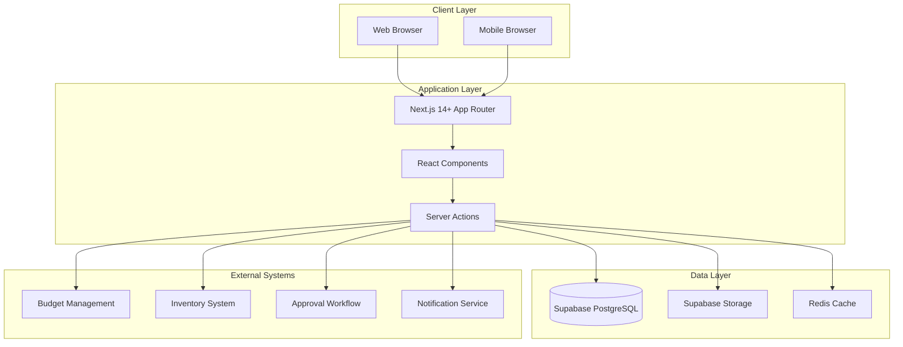
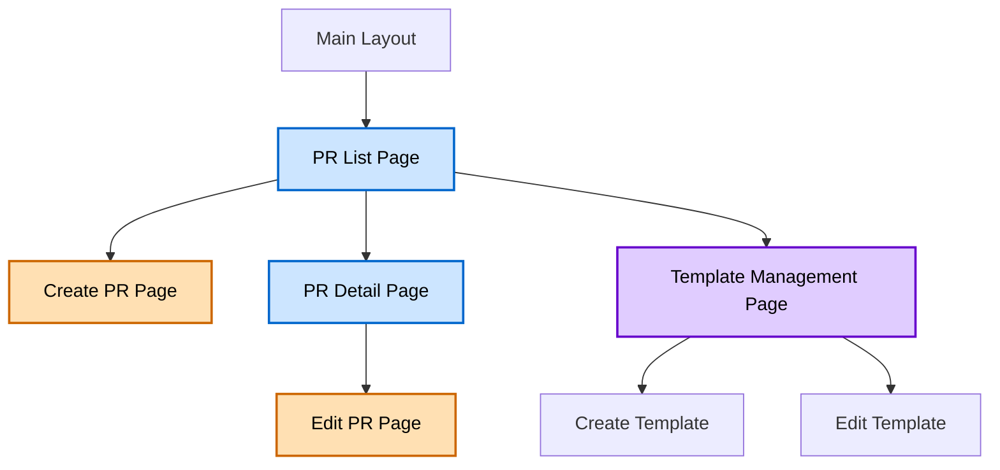
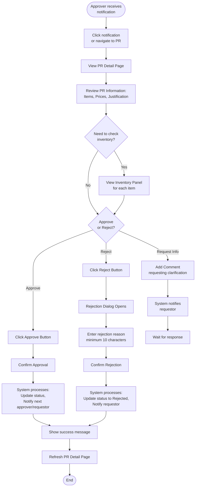

# Technical Specification: Purchase Requests

## Module Information
- **Module**: Procurement
- **Sub-Module**: Purchase Requests
- **Route**: `/procurement/purchase-requests`
- **Version**: 1.0.0
- **Last Updated**: 2025-10-30
- **Owner**: Development Team
- **Status**: Draft

## Document History
| Version | Date | Author | Changes |
|---------|------|--------|---------|
| 1.0.0 | 2025-10-30 | Development Team | Initial technical specification |

---

## Overview

This document provides high-level technical implementation guidance for the Purchase Requests sub-module within the Procurement module of the Carmen ERP system. It describes the architecture, page structure, navigation flows, component responsibilities, and integration patterns.

The Purchase Requests module allows users to create, submit, approve, and track purchase requests within the organization. It integrates with budget management, approval workflows, vendor management, and inventory systems.

**Related Documents**:
- [Business Requirements](./BR-purchase-requests.md)
- [Use Cases](./UC-purchase-requests.md)
- [Data Definition](./DS-purchase-requests.md)
- [Flow Diagrams](./FD-purchase-requests.md)
- [Validations](./VAL-purchase-requests.md)

---

## Architecture

### High-Level System Architecture



### Component Architecture

The Purchase Requests module follows a layered architecture:

- **Presentation Layer**: React components for UI rendering and user interaction
- **State Management Layer**: Zustand for global state, React Query for server state
- **Business Logic Layer**: Server Actions containing validation, calculations, and workflow logic
- **Data Access Layer**: Supabase client for database operations
- **Integration Layer**: APIs for external system communication (Budget, Inventory, Workflow)

---

## Technology Stack

### Frontend Technologies
- **Framework**: Next.js 14+ with App Router pattern
- **UI Library**: React 18+
- **Styling**: Tailwind CSS with Shadcn/ui component library
- **State Management**: Zustand (global), React Query (server state)
- **Form Handling**: React Hook Form with Zod validation
- **Icons**: Lucide React
- **Date Handling**: date-fns library

### Backend Technologies
- **Runtime**: Node.js 20+
- **Server Framework**: Next.js Server Actions
- **Database**: PostgreSQL via Supabase
- **Authentication**: Supabase Auth
- **File Storage**: Supabase Storage
- **Caching**: Redis (for inventory data)

### Testing & DevOps
- **Unit Tests**: Vitest
- **E2E Tests**: Playwright
- **Version Control**: Git
- **CI/CD**: GitHub Actions
- **Hosting**: Vercel
- **Database Hosting**: Supabase Cloud

---

## Page Structure & Navigation

### Page Hierarchy



### Main Pages

#### 1. Purchase Request List Page
**Route**: `/procurement/purchase-requests`

**Purpose**: Display all purchase requests with filtering, sorting, and search capabilities

**Layout Components**:
- **Page Header**: Title, breadcrumb, Create button
- **Filter Bar**: Status filter, Date range, Department, Location, Requestor, Amount range
- **Quick Filters**: My PRs, Pending Approval, Recently Approved, In Process, Rejected
- **Search Bar**: Search by PR number, item name, description, vendor
- **Data Table**: Paginated list of PRs with sortable columns
- **Action Buttons**: View, Edit (contextual based on status), Delete (draft only)
- **Export Button**: Export to Excel/CSV

**Key Features**:
- Real-time auto-refresh (no manual refresh button)
- Click row to view/edit (no modify button in row)
- Responsive table with column visibility toggle
- Status indicators with color coding
- Pagination (20 items per page default)

---

#### 2. Create Purchase Request Page
**Route**: `/procurement/purchase-requests/new`

**Purpose**: Create new purchase request

**Layout Sections**:
1. **Header Information Form**
   - PR Type selection (Market List, Standard Order, Fixed Asset)
   - Delivery date picker
   - Department and location selectors
   - Description and justification text areas

2. **Line Items Section**
   - Add Item button (opens item dialog)
   - Item list table with inline edit capability
   - FOC quantity and unit fields
   - Price and tax calculation display
   - Remove item button per row

3. **Item Selection Dialog** (when adding items)
   - Product search/select
   - Real-time inventory display panel (UC-PR-012)
   - Quantity and unit input
   - Price input with tax rate auto-fill
   - FOC quantity and unit inputs
   - Adjust checkbox for price lock
   - Budget code, cost center, GL account fields

4. **Financial Summary Panel**
   - Subtotal calculation
   - Discount amount
   - Tax amount
   - Grand total
   - Currency display

5. **Action Buttons**
   - Save as Draft
   - Submit for Approval
   - Cancel

---

#### 3. Purchase Request Detail Page
**Route**: `/procurement/purchase-requests/[id]`

**Purpose**: View complete PR details with status-specific actions

**Layout Sections**:
1. **Header Information Display**
   - PR number, date, status badge
   - Requestor details
   - Department (labeled as "Department", not "Approve by")
   - Location, delivery date
   - PR type

2. **Line Items Table** (read-only)
   - Item details with specifications
   - Quantities, units, prices
   - FOC quantity and unit (if applicable)
   - Line totals
   - Tax rates

3. **Financial Summary**
   - Subtotal, discount, tax, total
   - Display in transaction and base currency

4. **Approval Workflow Section**
   - Visual workflow progress indicator
   - Approval history timeline
   - Current approvers
   - Status of each approval level

5. **Attachments Section**
   - List of attached documents
   - Upload new attachment button (if editable)
   - Download, preview actions

6. **Comments Section**
   - Threaded comment display
   - Add comment input (if user has permission)
   - Internal vs external comment toggle

7. **Activity Log**
   - Chronological log of all activities
   - User actions, timestamp
   - Status changes, field modifications

8. **Related Documents**
   - Links to created POs
   - Links to converted from PRs (if created from template)

9. **Context Action Buttons** (status-dependent)
   - Edit (Draft, Rejected status only)
   - Submit for Approval (Draft only)
   - Approve (Pending Approval, for approvers)
   - Reject (Pending Approval, for approvers)
   - Recall (Submitted, for requestor)
   - Convert to PO (Approved, for purchasing staff)
   - Cancel (Draft, Submitted)
   - Save as Template (any status)
   - Print/Export PDF

---

#### 4. Edit Purchase Request Page
**Route**: `/procurement/purchase-requests/[id]/edit`

**Purpose**: Modify existing draft or rejected PR

**Layout**: Same as Create PR Page, but pre-filled with existing data

**Additional Features**:
- Version conflict detection
- Change tracking indicator
- Restore original values option
- Save changes button
- Discard changes button

**Access Control**: Only accessible when PR status is "Draft" or "Rejected" and user is the requestor

---

#### 5. Template Management Page
**Route**: `/procurement/purchase-requests/templates`

**Purpose**: Manage PR templates for recurring orders

**Layout Sections**:
1. **Template List**
   - Template name, type, last used date
   - Usage count
   - Department/visibility
   - Created by

2. **Filter Bar**
   - Filter by type (Market List, Standard Order, Fixed Asset)
   - Filter by department
   - Filter by tags
   - Sort by recently used, usage count, name

3. **Actions**
   - Create New Template button
   - Edit template
   - Duplicate template
   - Archive template
   - Delete template (with confirmation)
   - View usage history

4. **Template Detail Panel** (when template selected)
   - Template metadata
   - List of items in template
   - Estimated total
   - Usage statistics

---

## Navigation Flow Diagrams

### Create Purchase Request Flow

```mermaid
flowchart TD
    Start([User clicks Create PR]) --> Choice{New from scratch<br/>or template?}

    Choice -->|New| SelectType[Select PR Type:<br/>Market List, Standard Order,<br/>Fixed Asset]
    Choice -->|Template| TemplateDialog[Open Template<br/>Selection Dialog]

    TemplateDialog --> SelectTemplate[Select Template]
    SelectTemplate --> TemplateOptions[Configure Template<br/>Options]
    TemplateOptions --> LoadTemplate[Load Template Data<br/>with Price Updates]
    LoadTemplate --> SelectType

    SelectType --> HeaderForm[Fill Header Info:<br/>Delivery Date, Department,<br/>Location, Description]

    HeaderForm --> AddItems[Add Line Items]

    AddItems --> ItemDialog[Item Selection Dialog]
    ItemDialog --> SearchProduct[Search/Select Product]
    SearchProduct --> InventoryPanel[View Real-time<br/>Inventory & Pricing]
    InventoryPanel --> EnterDetails[Enter Quantity, Price,<br/>FOC Qty/Unit, Tax Rate]
    EnterDetails --> MoreItems{Add more<br/>items?}

    MoreItems -->|Yes| ItemDialog
    MoreItems -->|No| ReviewItems[Review All Items<br/>and Financial Summary]

    ReviewItems --> SaveChoice{Save as Draft<br/>or Submit?}

    SaveChoice -->|Draft| SaveDraft[Save as Draft]
    SaveChoice -->|Submit| ValidateSubmit[Validate Required<br/>Fields]

    ValidateSubmit --> SubmitPR[Submit for Approval]

    SaveDraft --> SuccessMsg[Show Success Message]
    SubmitPR --> SuccessMsg

    SuccessMsg --> RedirectDetail[Redirect to<br/>PR Detail Page]

    RedirectDetail --> End([End])
```



### Approval Workflow Navigation



### Convert PR to PO Flow

```mermaid
flowchart TD
    Start([Purchasing staff<br/>views approved PR]) --> ClickConvert[Click Convert to PO<br/>button]

    ClickConvert --> ValidatePR{PR already<br/>converted?}

    ValidatePR -->|Yes| ShowError[Show error:<br/>Already converted]
    ValidatePR -->|No| LoadPRData[Load PR data]

    LoadPRData --> POForm[Display PO Form<br/>pre-filled with PR data]

    POForm --> SelectVendors[Select vendors<br/>for items]

    SelectVendors --> ReviewData[Review PO data:<br/>Items, Vendors,<br/>Delivery dates]

    ReviewData --> SplitChoice{Split to<br/>multiple POs?}

    SplitChoice -->|No| SinglePO[Create single PO]
    SplitChoice -->|Yes| GroupItems[Group items by:<br/>Vendor or Delivery date]

    GroupItems --> ReviewGroups[Review grouping]
    ReviewGroups --> CreateMultiplePOs[Create multiple POs]

    SinglePO --> ValidateBudget[Validate budget<br/>availability]
    CreateMultiplePOs --> ValidateBudget

    ValidateBudget --> CreatePOs[Create PO record(s)<br/>in database]

    CreatePOs --> LinkPRPO[Link PR to PO(s)]

    LinkPRPO --> UpdatePRStatus[Update PR status<br/>to Converted]

    UpdatePRStatus --> NotifyCreator[Notify PR creator]

    NotifyCreator --> ShowSuccess[Show success message<br/>with PO number(s)]

    ShowSuccess --> RedirectPO[Redirect to PO<br/>detail page]

    ShowError --> End([End])
    RedirectPO --> End
```

---

## Component Descriptions

### Page Components

#### Purchase Request List Component
**Responsibility**: Display paginated list of purchase requests with filtering and sorting

**Features**:
- Status-based color coding
- Real-time auto-refresh
- Column sorting (client-side for current page)
- Responsive table with mobile view
- Batch operations (future enhancement)

**Data Requirements**:
- Fetch list of PRs with pagination
- Apply filters server-side
- Load user preferences for column visibility

---

#### Purchase Request Form Component
**Responsibility**: Handle PR creation and editing with validation

**Features**:
- Multi-section form layout
- Real-time validation
- Auto-save draft (every 2 minutes)
- Item management with add/edit/remove
- Financial calculations in real-time
- Template application
- Inventory integration panel

**Validation**:
- Client-side: Zod schema validation
- Server-side: Business rule validation
- Field-level validation on blur
- Form-level validation on submit

---

#### Inventory Display Panel Component
**Responsibility**: Show real-time inventory and pricing data during item selection

**Features**:
- Display on-hand, reserved, available quantities
- Show reorder point and reorder quantity
- Display pricing history
- Stock level indicators (green, yellow, red, gray)
- Multi-location inventory view
- Alternative product suggestions
- Historical consumption charts

**Performance**:
- Load data asynchronously (<2 seconds)
- Cache data for 5 minutes
- Show cached data with warning if real-time unavailable

---

#### Approval Workflow Component
**Responsibility**: Display approval progress and enable approval actions

**Features**:
- Visual workflow progress indicator
- Approval history timeline
- Current approvers list
- Approve/Reject action buttons
- Comment/note entry
- Status badges with color coding

**Access Control**:
- Show approve/reject only to current approver
- Display read-only history to others
- Validate approver permissions server-side

---

#### Financial Summary Component
**Responsibility**: Display calculated financial totals

**Features**:
- Real-time calculation as items change
- Display in transaction currency
- Display in base currency (if different)
- Breakdown: Subtotal, Discount, Tax, Total
- Currency conversion rate display
- Visual highlight of total amount

**Calculations**:
- Triggered on item add/edit/remove
- Uses business rules from BR document
- Validated server-side on submit

---

### Shared Components

#### Item Selection Dialog
**Responsibility**: Enable product search and item configuration

**Features**:
- Product search with autocomplete
- Product catalog browse
- Inventory integration
- Quantity and unit selection
- Price entry with tax auto-fill
- FOC quantity and unit fields
- Budget code selection
- Adjust checkbox for price lock

---

#### Comment Thread Component
**Responsibility**: Display and manage comments

**Features**:
- Threaded conversation display
- Add new comment
- Mention users with @ notation
- Internal vs external comment toggle
- Rich text editor (basic formatting)
- Attachment support

---

#### Attachment Manager Component
**Responsibility**: Handle file uploads and display attachments

**Features**:
- Drag-and-drop upload
- File type validation
- File size limit (10MB per file)
- Preview for images and PDFs
- Download attachment
- Delete attachment (if permitted)
- Multiple file upload

**Supported File Types**: PDF, DOC, DOCX, XLS, XLSX, JPG, PNG, TXT

---

#### Inventory Integration Service Component
**Responsibility**: Fetch and display real-time inventory data (on-hand and on-order quantities) from external Inventory Management System and Purchase Order System APIs.

**Features**:
- Real-time API integration with Inventory Management System
- Real-time API integration with Purchase Order System
- Caching with 5-minute TTL for frequently accessed products
- Asynchronous data loading with loading indicators
- Graceful error handling when APIs are unavailable
- Display "N/A" when inventory data is not available
- Visual indicators for stock levels (green/yellow/red for healthy/low/critical)
- Tooltip with expected delivery dates for on-order quantities
- Batch API calls for multiple items to optimize performance
- Retry mechanism for failed API calls

**API Endpoints**:
- `GET /api/inventory/on-hand?product_id={id}&location_id={id}`: Fetch on-hand quantity
- `GET /api/inventory/on-order?product_id={id}`: Fetch on-order quantity with expected dates

**Data Structure**:
```typescript
interface InventoryData {
  product_id: string
  on_hand: number | null
  on_order: number | null
  stock_status: 'healthy' | 'low' | 'critical' | 'out_of_stock' | 'no_data'
  expected_delivery_dates?: Date[]
  last_updated: Date
}
```

**Performance**:
- Load within 2 seconds (95th percentile)
- Support 50+ concurrent queries without degradation
- Cache inventory data with timestamp display

**Error Handling**:
- Display cached data with "Last updated: XX minutes ago" when API is slow
- Show "Unable to load inventory data" with retry button on failure
- Log API failures for investigation
- Allow PR creation to proceed even if inventory data unavailable

---

#### Price Visibility Controller Component
**Responsibility**: Manage role-based price visibility and hide_price toggle functionality for Requestors, ensuring approvers always see full pricing.

**Features**:
- "Hide Price" toggle in PR header (visible only to Requestor role)
- Hide pricing fields when hide_price = true for Requestor:
  * vendor_name
  * unit_price
  * discount_amount
  * net_amount
  * tax_amount
  * total_amount
- Display all pricing fields for Approver, Procurement, Finance roles (override hide_price flag)
- Display indicator badge when hide_price = true for authorized viewers: "Requestor chose to hide prices"
- Persist hide_price flag with PR record
- Prevent toggle changes after PR submission
- API enforces role-based pricing visibility server-side

**Role-Based Logic**:
```typescript
interface PriceVisibilityRules {
  canToggleHidePrice: boolean  // True for Requestor during creation only
  canSeePricing: boolean        // Always true for Approver/Procurement/Finance
  hidePrice: boolean            // PR-level flag, only affects Requestor view
}

function getPriceVisibility(user: User, pr: PurchaseRequest): PriceVisibilityRules {
  return {
    canToggleHidePrice: user.role === 'requestor' && pr.status === 'draft',
    canSeePricing: user.role in ['approver', 'procurement', 'finance'] || !pr.hide_price,
    hidePrice: pr.hide_price && user.role === 'requestor'
  }
}
```

**UI Behavior**:
- Toggle with tooltip: "Hide pricing fields from view. Approvers will still see prices."
- Visual confirmation when toggle is changed
- Clear messaging that pricing data is preserved in database
- Mobile-responsive layout for toggle

**Security**:
- Server-side validation of hide_price field access
- API returns 403 if unauthorized role attempts to set hide_price after submission
- Audit log records all hide_price toggle actions

---

#### Delivery Point Manager Component
**Responsibility**: Manage delivery point selection, auto-population of delivery point labels, and integration with delivery_points master data.

**Features**:
- Searchable/typeahead dropdown for delivery point selection
- Load only active delivery points (active_flag = true)
- Filter by user's department (if applicable)
- Display format: "{code} - {name}" (e.g., "DOCK-A - Main Kitchen Loading Dock")
- Sort alphabetically by name
- Tooltip showing full delivery point details (description, address)
- Auto-populate delivery_point_label when delivery_point is selected
- Clear button to remove selection
- Cache delivery point list with 15-minute TTL
- Loading state while fetching delivery points
- Mobile-friendly dropdown (native select on mobile)

**Data Structure**:
```typescript
interface DeliveryPoint {
  id: string              // UUID
  code: string            // VARCHAR(20), e.g., "DOCK-A"
  name: string            // VARCHAR(100), e.g., "Main Kitchen Loading Dock"
  description: string     // TEXT
  address: string         // VARCHAR(500)
  department_id: string   // UUID
  active_flag: boolean
  created_at: Date
  created_by: string
}

interface ItemDeliveryInfo {
  delivery_point: string | null          // UUID reference
  delivery_point_label: string | null    // Auto-populated, read-only
  comment: string | null                 // VARCHAR(500)
  required_date: Date | null             // DATE
}
```

**API Endpoints**:
- `GET /api/delivery-points?department_id={id}&active=true`: Fetch active delivery points
- `GET /api/delivery-points/{id}`: Fetch specific delivery point details

**Validation**:
- Selected delivery_point must exist in master data
- Selected delivery_point must be active
- delivery_point_label cannot be manually edited (read-only)
- Server verifies delivery_point_label matches delivery_points.name

**Performance**:
- Dropdown loads within 1 second
- Typeahead search filters in real-time
- Refresh delivery point list when master data changes

---

#### Monetary Format Service Component
**Responsibility**: Ensure consistent formatting of all monetary amounts with proper currency symbols, thousands separators, and decimal places.

**Features**:
- Auto-format monetary fields with 2 decimal places
- Add comma thousands separators (e.g., "1,234.56")
- Position currency symbol based on locale (e.g., "$1,234.56" or "1.234,56 €")
- Display negative amounts with minus sign or parentheses (configurable)
- Display zero amounts as "0.00" (never "-" or blank)
- Accept input with or without currency symbols and commas
- Round to 2 decimal places automatically
- Validate numeric input only
- Right-align monetary amounts in tables
- Use tabular/monospace numbers for alignment

**Locale Support**:
```typescript
interface LocaleFormatConfig {
  currency_code: string          // USD, EUR, GBP, etc.
  currency_symbol: string        // $, €, £, etc.
  symbol_position: 'before' | 'after'
  decimal_separator: string      // . or ,
  thousands_separator: string    // , or . or space
  decimal_places: number         // Always 2 for monetary
}

function formatMoney(amount: number, locale: LocaleFormatConfig): string {
  // Format: $1,234.56 or 1.234,56 € based on locale
}
```

**Affected Fields**:
- unit_price
- discount_amount
- net_amount (calculated)
- tax_amount (calculated)
- total_amount (calculated)
- override_amount
- All header totals (subtotal, grand total, etc.)

**Multi-Currency Support**:
- Display transaction currency by default
- Show base currency equivalent in tooltip
- Display currency code alongside amount (e.g., "1,234.56 USD")
- Show exchange rate when viewing foreign currency

**Export Formatting**:
- PDF: Maintain visual formatting with currency symbols
- Excel: Numeric format with 2 decimals (no symbols)
- CSV: Unformatted numbers for data processing
- Print: Formatted for readability

**Performance**:
- Client-side formatting with immediate feedback
- Minimal overhead (<10ms per field)
- Batch format operations for table rendering

---

#### Enhanced Pricing Calculator Component
**Responsibility**: Auto-calculate net_amount, tax_amount, and total_amount with real-time updates and server-side verification.

**Features**:
- Real-time calculation as user inputs unit_price, quantity, discount, or tax_rate
- Display calculated fields as read-only
- Visual feedback when calculations update
- Server-side recalculation and verification
- Reject submissions if client/server calculation mismatch > $0.01
- Highlight override_amount when it differs from calculated total
- Display calculated vs. override amount for comparison
- Warning when override differs by >20% from calculated amount

**Calculation Formulas**:
```typescript
interface PricingCalculations {
  // Step 1: Net Amount (after discount, before tax)
  net_amount = (unit_price × quantity) - discount_amount

  // Step 2: Tax Amount
  tax_amount = net_amount × (tax_rate / 100)

  // Step 3: Total Amount (including tax)
  total_amount = net_amount + tax_amount

  // Step 4: Override handling
  final_amount = override_amount ?? total_amount
}

function calculatePricing(item: PRItem): ItemPricing {
  const netAmount = (item.unit_price * item.quantity) - (item.discount_amount || 0)
  const taxAmount = netAmount * (item.tax_rate / 100)
  const totalAmount = netAmount + taxAmount

  return {
    net_amount: round(netAmount, 2),
    tax_amount: round(taxAmount, 2),
    total_amount: round(totalAmount, 2),
    calculated_total: round(totalAmount, 2), // For override comparison
    final_amount: item.override_amount ?? round(totalAmount, 2)
  }
}
```

**Validation Rules**:
- net_amount cannot be negative (discount cannot exceed unit_price × quantity)
- tax_amount must be non-negative
- total_amount must be non-negative
- override_amount must be > 0 if specified
- Server recalculates and verifies all amounts
- Precision: 2 decimal places (DECIMAL(15,2))

**Visual Indicators**:
- Calculated fields have subtle background color
- Real-time update animation when values change
- Override amount highlighted with warning color (yellow)
- Tooltip showing calculation formula on hover
- "Calculated: $XX.XX" label next to override field

**Error Handling**:
- Display "Net amount calculation is incorrect. Expected: $XX.XX" if mismatch
- System auto-corrects calculation errors
- User cannot manually edit calculated fields
- Validation errors displayed inline with field

**Performance**:
- Instant calculation (<50ms)
- Debounced input for smooth UX
- No server round-trip for calculations (client-side only)
- Server verification on submit only

**Integration**:
- Works with MonetaryFormatService for display formatting
- Integrates with PriceVisibilityController for conditional display
- Supports multi-currency with exchange rates
- Header totals calculated by summing all line item amounts

---

## Data Flow Patterns

### Read Operations Flow

```
User Action (view list/detail)
    ↓
Component renders
    ↓
React Query checks cache
    ↓ (cache miss or stale)
Server Action called
    ↓
Validate user permissions
    ↓
Query database (Supabase)
    ↓
Apply business logic/transformations
    ↓
Return data to client
    ↓
React Query caches data
    ↓
Component displays data
```

### Write Operations Flow

```
User submits form
    ↓
Client-side validation (Zod)
    ↓ (validation passes)
Server Action called
    ↓
Server-side validation
    ↓ (validation passes)
Check user permissions
    ↓ (authorized)
Start database transaction
    ↓
Execute business logic
    ↓
Write to database
    ↓
Trigger integrations (Budget, Workflow, Notifications)
    ↓
Commit transaction
    ↓ (success)
Return success response
    ↓
Invalidate React Query cache
    ↓
Update UI / Redirect
    ↓
Show success message
```

---

## Database Schema

### Entity Relationship Diagram (ERD)

The following ERD illustrates the database schema for the Purchase Request module, showing all tables, columns, data types, and relationships.

```mermaid
erDiagram
    purchase_requests ||--o{ pr_line_items : "contains"
    purchase_requests ||--o{ pr_approvals : "requires"
    purchase_requests ||--o{ pr_attachments : "has"
    purchase_requests ||--o{ pr_comments : "has"
    purchase_requests ||--o{ pr_activity_log : "tracks"
    purchase_requests }o--|| users : "created_by"
    purchase_requests }o--o| users : "submitted_by"
    purchase_requests }o--|| departments : "belongs_to"
    purchase_requests }o--|| locations : "requested_for"
    purchase_requests }o--o| delivery_points : "delivers_to"
    purchase_requests }o--o| currencies : "uses"
    pr_line_items }o--|| products : "references"
    pr_line_items }o--|| units : "measured_in"
    pr_line_items }o--o| units : "foc_unit"
    pr_line_items }o--o| delivery_points : "delivers_to"
    pr_line_items }o--o| budget_codes : "charged_to"
    pr_line_items }o--o| cost_centers : "allocated_to"
    pr_line_items }o--o| gl_accounts : "posted_to"
    pr_approvals }o--|| users : "approved_by"
    pr_approvals }o--|| purchase_requests : "approves"
    pr_attachments }o--|| users : "uploaded_by"
    pr_comments }o--|| users : "authored_by"
    pr_activity_log }o--|| users : "performed_by"

    purchase_requests {
        uuid id PK
        varchar pr_number UK "Auto-generated unique identifier"
        date pr_date "Date of PR creation"
        varchar pr_type "Market List, Standard Order, Fixed Asset"
        uuid department_id FK
        uuid location_id FK
        uuid requestor_id FK "User who created PR"
        uuid submitted_by_id FK "User who submitted PR (nullable)"
        date delivery_date "Requested delivery date"
        text description
        text justification
        varchar status "Draft, Submitted, Approved, Rejected, Cancelled, Converted"
        boolean hide_price "Hide pricing from requestor view"
        uuid delivery_point FK "Header-level delivery point (nullable)"
        decimal subtotal "DECIMAL(15,2)"
        decimal discount_amount "DECIMAL(15,2)"
        decimal net_amount "DECIMAL(15,2)"
        decimal tax_amount "DECIMAL(15,2)"
        decimal total_amount "DECIMAL(15,2)"
        uuid currency_id FK
        decimal exchange_rate "DECIMAL(10,4)"
        decimal base_currency_total "DECIMAL(15,2)"
        uuid created_by FK
        timestamp created_at
        uuid updated_by FK
        timestamp updated_at
        uuid approved_by FK "Final approver (nullable)"
        timestamp approved_at
        uuid rejected_by FK "Rejector (nullable)"
        timestamp rejected_at
        text rejection_reason
        uuid converted_to_po_id FK "PO reference (nullable)"
        timestamp converted_at
        varchar workflow_status "Approval workflow tracking"
        integer approval_level "Current approval level (0-based)"
    }

    pr_line_items {
        uuid id PK
        uuid pr_id FK
        integer line_number "Sequence number within PR"
        uuid product_id FK
        text description "Item description"
        text specifications "Detailed specifications"
        decimal quantity "DECIMAL(15,3)"
        uuid unit_id FK
        decimal foc_quantity "DECIMAL(15,3) - Free of charge qty"
        uuid foc_unit_id FK "Free of charge unit (nullable)"
        decimal unit_price "DECIMAL(15,2)"
        decimal discount_amount "DECIMAL(15,2)"
        decimal net_amount "DECIMAL(15,2) - Calculated"
        decimal tax_rate "DECIMAL(5,2) - Percentage"
        decimal tax_amount "DECIMAL(15,2) - Calculated"
        decimal total_amount "DECIMAL(15,2) - Calculated"
        decimal override_amount "DECIMAL(15,2) - Manual override (nullable)"
        boolean adjust "Price lock flag"
        uuid delivery_point FK "Item-level delivery point (nullable)"
        varchar delivery_point_label "Auto-populated name (read-only)"
        text comment "Delivery instructions"
        date required_date "Item-specific required date"
        uuid budget_code_id FK
        uuid cost_center_id FK
        uuid gl_account_id FK
        uuid created_by FK
        timestamp created_at
        uuid updated_by FK
        timestamp updated_at
    }

    pr_approvals {
        uuid id PK
        uuid pr_id FK
        integer approval_level "Level in approval hierarchy (0-based)"
        uuid approver_id FK
        varchar approver_role "Department Manager, Finance Manager, General Manager"
        decimal approval_threshold "Amount threshold for this level (nullable)"
        varchar status "Pending, Approved, Rejected, Cancelled"
        timestamp approved_at
        timestamp rejected_at
        text comments "Approval/rejection comments"
        integer sequence "Order within same level (for parallel approvals)"
        uuid created_by FK
        timestamp created_at
        uuid updated_by FK
        timestamp updated_at
    }

    pr_attachments {
        uuid id PK
        uuid pr_id FK
        varchar file_name
        varchar file_type "PDF, DOC, DOCX, XLS, XLSX, JPG, PNG, TXT"
        varchar file_path "Storage path (Supabase Storage)"
        integer file_size "Size in bytes"
        text description
        uuid uploaded_by FK
        timestamp uploaded_at
    }

    pr_comments {
        uuid id PK
        uuid pr_id FK
        uuid parent_comment_id FK "For threaded replies (nullable)"
        text comment_text
        boolean is_internal "Internal vs external visibility"
        uuid author_id FK
        timestamp created_at
        uuid updated_by FK
        timestamp updated_at
        boolean is_deleted "Soft delete flag"
    }

    pr_activity_log {
        uuid id PK
        uuid pr_id FK
        varchar activity_type "Created, Submitted, Approved, Rejected, Edited, Commented, etc."
        text description "Human-readable activity description"
        jsonb changes "Before/after values for edits"
        uuid performed_by FK
        timestamp performed_at
        varchar ip_address
        varchar user_agent
    }

    users {
        uuid id PK
        varchar username
        varchar email
        varchar full_name
        varchar role
        uuid department_id FK
        uuid location_id FK
        boolean active_flag
    }

    departments {
        uuid id PK
        varchar code
        varchar name
        boolean active_flag
    }

    locations {
        uuid id PK
        varchar code
        varchar name
        varchar address
        boolean active_flag
    }

    delivery_points {
        uuid id PK
        varchar code
        varchar name
        text description
        varchar address
        uuid department_id FK
        boolean active_flag
    }

    currencies {
        uuid id PK
        varchar code "USD, EUR, GBP, etc."
        varchar symbol
        boolean is_base_currency
        boolean active_flag
    }

    products {
        uuid id PK
        varchar code
        varchar name
        text description
        uuid default_unit_id FK
        boolean active_flag
    }

    units {
        uuid id PK
        varchar code "EA, KG, LB, L, etc."
        varchar name
        boolean active_flag
    }

    budget_codes {
        uuid id PK
        varchar code
        varchar name
        boolean active_flag
    }

    cost_centers {
        uuid id PK
        varchar code
        varchar name
        boolean active_flag
    }

    gl_accounts {
        uuid id PK
        varchar account_number
        varchar account_name
        boolean active_flag
    }
```



### Database Design Notes

**Primary Keys**:
- All tables use UUID as primary key for global uniqueness and security
- Auto-generated at application level or database level (uuid_generate_v4())

**Foreign Key Relationships**:
- **purchase_requests**: References users (creator, submitter, approver, rejector), departments, locations, delivery_points, currencies
- **pr_line_items**: References purchase_requests (parent), products, units (quantity and FOC), delivery_points, budget_codes, cost_centers, gl_accounts
- **pr_approvals**: References purchase_requests, users (approver)
- **pr_attachments**: References purchase_requests, users (uploader)
- **pr_comments**: References purchase_requests, users (author), self-reference for threading
- **pr_activity_log**: References purchase_requests, users (performer)

**Indexes** (Recommended):
- `purchase_requests(pr_number)` - Unique index for PR number lookups
- `purchase_requests(status, pr_date)` - Composite index for status filtering with date sorting
- `purchase_requests(requestor_id, status)` - For "My PRs" queries
- `purchase_requests(department_id, status)` - For department-based filtering
- `pr_line_items(pr_id, line_number)` - For ordered line item retrieval
- `pr_approvals(pr_id, approval_level)` - For approval workflow queries
- `pr_approvals(approver_id, status)` - For "My Approvals" queries
- `pr_activity_log(pr_id, performed_at)` - For activity timeline retrieval

**Constraints**:
- `pr_number` must be unique across all purchase requests
- `status` must be one of: Draft, Submitted, Approved, Rejected, Cancelled, Converted
- `pr_type` must be one of: Market List, Standard Order, Fixed Asset
- All monetary amounts use DECIMAL(15,2) for precision
- All quantity fields use DECIMAL(15,3) to support fractional quantities
- Exchange rates use DECIMAL(10,4) for precision
- Tax rates use DECIMAL(5,2) to support percentages up to 999.99%

**Calculated Fields**:
- `net_amount = (unit_price × quantity) - discount_amount`
- `tax_amount = net_amount × (tax_rate / 100)`
- `total_amount = net_amount + tax_amount`
- `final_amount = override_amount ?? total_amount`
- Header-level totals are sums of line item amounts

**Soft Deletes**:
- `pr_comments.is_deleted` - Comments are soft-deleted, not physically removed
- Other tables use status changes instead of deletes (e.g., status='Cancelled')

**Audit Fields**:
- All primary tables include: created_by, created_at, updated_by, updated_at
- Activity log provides comprehensive audit trail for all changes

**Data Validation**:
- Server-side validation enforces business rules (see VAL-purchase-requests.md)
- Database constraints provide last line of defense
- Triggers can enforce complex business rules (e.g., approval workflow integrity)

---

## Data Models

### Class Diagram

The following class diagram illustrates the data model structure for the Purchase Request module, showing classes, properties, methods, and relationships.

```mermaid
classDiagram
    class PurchaseRequest {
        +UUID id
        +String prNumber
        +Date prDate
        +PRType prType
        +UUID departmentId
        +UUID locationId
        +UUID requestorId
        +UUID submittedById
        +Date deliveryDate
        +String description
        +String justification
        +DocumentStatus status
        +Boolean hidePrice
        +UUID deliveryPoint
        +Money subtotal
        +Money discountAmount
        +Money netAmount
        +Money taxAmount
        +Money totalAmount
        +UUID currencyId
        +Decimal exchangeRate
        +Money baseCurrencyTotal
        +UUID createdBy
        +DateTime createdAt
        +UUID updatedBy
        +DateTime updatedAt
        +UUID approvedBy
        +DateTime approvedAt
        +UUID rejectedBy
        +DateTime rejectedAt
        +String rejectionReason
        +UUID convertedToPoId
        +DateTime convertedAt
        +String workflowStatus
        +Integer approvalLevel
        +LineItem[] lineItems
        +Approval[] approvals
        +Attachment[] attachments
        +Comment[] comments
        +ActivityLog[] activityLog
        +submit() Boolean
        +approve(userId, comments) Boolean
        +reject(userId, reason) Boolean
        +recall(userId) Boolean
        +cancel(userId, reason) Boolean
        +convertToPO(userId) UUID
        +calculateTotals() void
        +validateBusinessRules() ValidationResult
        +canEdit(userId) Boolean
        +canApprove(userId) Boolean
        +canReject(userId) Boolean
        +getCurrentApprovers() User[]
        +getNextApprovalLevel() Integer
        +addLineItem(item) void
        +removeLineItem(lineNumber) void
        +updateLineItem(lineNumber, item) void
        +addComment(userId, text, isInternal) void
        +addAttachment(userId, file) void
        +logActivity(userId, activityType, description) void
    }

    class LineItem {
        +UUID id
        +UUID prId
        +Integer lineNumber
        +UUID productId
        +String description
        +String specifications
        +Decimal quantity
        +UUID unitId
        +Decimal focQuantity
        +UUID focUnitId
        +Money unitPrice
        +Money discountAmount
        +Money netAmount
        +Decimal taxRate
        +Money taxAmount
        +Money totalAmount
        +Money overrideAmount
        +Boolean adjust
        +UUID deliveryPoint
        +String deliveryPointLabel
        +String comment
        +Date requiredDate
        +UUID budgetCodeId
        +UUID costCenterId
        +UUID glAccountId
        +UUID createdBy
        +DateTime createdAt
        +UUID updatedBy
        +DateTime updatedAt
        +Product product
        +Unit unit
        +Unit focUnit
        +calculateNetAmount() Money
        +calculateTaxAmount() Money
        +calculateTotalAmount() Money
        +getFinalAmount() Money
        +validate() ValidationResult
        +hasOverride() Boolean
        +getOverrideVariance() Decimal
    }

    class Approval {
        +UUID id
        +UUID prId
        +Integer approvalLevel
        +UUID approverId
        +String approverRole
        +Money approvalThreshold
        +ApprovalStatus status
        +DateTime approvedAt
        +DateTime rejectedAt
        +String comments
        +Integer sequence
        +UUID createdBy
        +DateTime createdAt
        +UUID updatedBy
        +DateTime updatedAt
        +User approver
        +approve(userId, comments) Boolean
        +reject(userId, reason) Boolean
        +cancel() Boolean
        +isPending() Boolean
        +isApproved() Boolean
        +isRejected() Boolean
        +canApprove(userId) Boolean
    }

    class Attachment {
        +UUID id
        +UUID prId
        +String fileName
        +FileType fileType
        +String filePath
        +Integer fileSize
        +String description
        +UUID uploadedBy
        +DateTime uploadedAt
        +User uploader
        +download() Blob
        +preview() String
        +delete(userId) Boolean
        +validateFileType() Boolean
        +validateFileSize() Boolean
        +getStorageUrl() String
    }

    class Comment {
        +UUID id
        +UUID prId
        +UUID parentCommentId
        +String commentText
        +Boolean isInternal
        +UUID authorId
        +DateTime createdAt
        +UUID updatedBy
        +DateTime updatedAt
        +Boolean isDeleted
        +User author
        +Comment parentComment
        +Comment[] replies
        +edit(userId, newText) Boolean
        +delete(userId) Boolean
        +addReply(userId, text) Comment
        +canEdit(userId) Boolean
        +canDelete(userId) Boolean
        +isReply() Boolean
    }

    class ActivityLog {
        +UUID id
        +UUID prId
        +ActivityType activityType
        +String description
        +JSON changes
        +UUID performedBy
        +DateTime performedAt
        +String ipAddress
        +String userAgent
        +User performer
        +getChangesSummary() String
        +getFieldChanges() Map
    }

    class User {
        +UUID id
        +String username
        +String email
        +String fullName
        +UserRole role
        +UUID departmentId
        +UUID locationId
        +Boolean activeFlag
        +Department department
        +Location location
        +hasPermission(permission) Boolean
        +canApprovePR(pr) Boolean
        +canEditPR(pr) Boolean
        +getApprovalLevel() Integer
    }

    class Department {
        +UUID id
        +String code
        +String name
        +Boolean activeFlag
    }

    class Location {
        +UUID id
        +String code
        +String name
        +String address
        +Boolean activeFlag
    }

    class DeliveryPoint {
        +UUID id
        +String code
        +String name
        +String description
        +String address
        +UUID departmentId
        +Boolean activeFlag
        +Department department
    }

    class Currency {
        +UUID id
        +String code
        +String symbol
        +Boolean isBaseCurrency
        +Boolean activeFlag
        +getExchangeRate() Decimal
    }

    class Product {
        +UUID id
        +String code
        +String name
        +String description
        +UUID defaultUnitId
        +Boolean activeFlag
        +Unit defaultUnit
        +getInventoryLevel(locationId) Decimal
        +getLastPurchasePrice() Money
    }

    class Unit {
        +UUID id
        +String code
        +String name
        +Boolean activeFlag
    }

    class BudgetCode {
        +UUID id
        +String code
        +String name
        +Boolean activeFlag
        +checkAvailability(amount) Boolean
    }

    class CostCenter {
        +UUID id
        +String code
        +String name
        +Boolean activeFlag
    }

    class GLAccount {
        +UUID id
        +String accountNumber
        +String accountName
        +Boolean activeFlag
    }

    class Money {
        <<value object>>
        +Decimal amount
        +UUID currencyId
        +Currency currency
        +add(other) Money
        +subtract(other) Money
        +multiply(factor) Money
        +divide(divisor) Money
        +convertTo(targetCurrency, rate) Money
        +format() String
        +isZero() Boolean
        +isPositive() Boolean
        +isNegative() Boolean
    }

    class ValidationResult {
        <<value object>>
        +Boolean isValid
        +String[] errors
        +String[] warnings
        +addError(message) void
        +addWarning(message) void
        +hasErrors() Boolean
        +hasWarnings() Boolean
    }

    PurchaseRequest "1" --> "*" LineItem : contains
    PurchaseRequest "1" --> "*" Approval : requires
    PurchaseRequest "1" --> "*" Attachment : has
    PurchaseRequest "1" --> "*" Comment : has
    PurchaseRequest "1" --> "*" ActivityLog : tracks
    PurchaseRequest "*" --> "1" User : created_by
    PurchaseRequest "*" --> "0..1" User : submitted_by
    PurchaseRequest "*" --> "1" Department : belongs_to
    PurchaseRequest "*" --> "1" Location : requested_for
    PurchaseRequest "*" --> "0..1" DeliveryPoint : delivers_to
    PurchaseRequest "*" --> "0..1" Currency : uses
    LineItem "*" --> "1" Product : references
    LineItem "*" --> "1" Unit : measured_in
    LineItem "*" --> "0..1" Unit : foc_unit
    LineItem "*" --> "0..1" DeliveryPoint : delivers_to
    LineItem "*" --> "0..1" BudgetCode : charged_to
    LineItem "*" --> "0..1" CostCenter : allocated_to
    LineItem "*" --> "0..1" GLAccount : posted_to
    Approval "*" --> "1" User : approved_by
    Attachment "*" --> "1" User : uploaded_by
    Comment "*" --> "1" User : authored_by
    Comment "*" --> "0..1" Comment : replies_to
    ActivityLog "*" --> "1" User : performed_by
    User "*" --> "1" Department : belongs_to
    User "*" --> "1" Location : works_at
    DeliveryPoint "*" --> "1" Department : belongs_to
    Product "*" --> "1" Unit : default_unit
    PurchaseRequest ..> Money : uses
    LineItem ..> Money : uses
    PurchaseRequest ..> ValidationResult : returns
    LineItem ..> ValidationResult : returns

    <<enumeration>> PRType
    PRType : MARKET_LIST
    PRType : STANDARD_ORDER
    PRType : FIXED_ASSET

    <<enumeration>> DocumentStatus
    DocumentStatus : DRAFT
    DocumentStatus : SUBMITTED
    DocumentStatus : APPROVED
    DocumentStatus : REJECTED
    DocumentStatus : CANCELLED
    DocumentStatus : CONVERTED

    <<enumeration>> ApprovalStatus
    ApprovalStatus : PENDING
    ApprovalStatus : APPROVED
    ApprovalStatus : REJECTED
    ApprovalStatus : CANCELLED

    <<enumeration>> FileType
    FileType : PDF
    FileType : DOC
    FileType : DOCX
    FileType : XLS
    FileType : XLSX
    FileType : JPG
    FileType : PNG
    FileType : TXT

    <<enumeration>> ActivityType
    ActivityType : CREATED
    ActivityType : SUBMITTED
    ActivityType : APPROVED
    ActivityType : REJECTED
    ActivityType : EDITED
    ActivityType : COMMENTED
    ActivityType : ATTACHED
    ActivityType : RECALLED
    ActivityType : CANCELLED
    ActivityType : CONVERTED

    <<enumeration>> UserRole
    UserRole : STAFF
    UserRole : DEPARTMENT_MANAGER
    UserRole : FINANCE_MANAGER
    UserRole : PURCHASING_STAFF
    UserRole : ADMIN
```

### Design Patterns

**Domain-Driven Design**:
- **Entities**: PurchaseRequest, LineItem, Approval, User, Product
- **Value Objects**: Money, ValidationResult
- **Aggregates**: PurchaseRequest is the aggregate root containing LineItems, Approvals, Comments, Attachments
- **Repositories**: PRRepository, UserRepository, ProductRepository for data access abstraction

**Business Logic Encapsulation**:
- **PurchaseRequest** class encapsulates all PR-related business logic (submit, approve, reject, convert)
- **LineItem** class handles pricing calculations and validation
- **Approval** class manages approval workflow state transitions

**Validation Pattern**:
- **ValidationResult** value object provides structured validation feedback
- Each entity has a `validate()` method returning ValidationResult
- Business rule validation is centralized in domain models

**Factory Pattern**:
- Create complex objects like PurchaseRequest with proper initialization
- Ensure all required relationships are established
- Generate auto-calculated fields (PR number, totals)

**Repository Pattern**:
- Abstract data access layer from domain logic
- Support for querying, filtering, and persistence
- Transaction management for complex operations

**Observer Pattern**:
- Activity logging observes all state changes
- Notification service observes workflow events
- Audit trail automatically captures modifications

**State Pattern**:
- DocumentStatus defines valid PR states
- ApprovalStatus defines approval record states
- State transitions enforce workflow rules

**Money Pattern**:
- Money value object encapsulates amount + currency
- Arithmetic operations maintain currency consistency
- Format and conversion methods centralized

### Key Relationships

**Composition** (Strong ownership):
- PurchaseRequest ◆─ LineItem (PR owns line items, cascade delete)
- PurchaseRequest ◆─ Approval (PR owns approvals, cascade delete)
- PurchaseRequest ◆─ Attachment (PR owns attachments, cascade delete)
- PurchaseRequest ◆─ Comment (PR owns comments, soft delete)
- PurchaseRequest ◆─ ActivityLog (PR owns activity log, cascade delete)

**Association** (Reference):
- PurchaseRequest → User (creator, submitter, approver)
- PurchaseRequest → Department (many PRs to one department)
- PurchaseRequest → Location (many PRs to one location)
- LineItem → Product (many line items reference one product)
- Approval → User (many approvals reference one approver)

**Aggregation** (Weak ownership):
- PurchaseRequest ◇─ DeliveryPoint (optional, shared across PRs)
- PurchaseRequest ◇─ Currency (shared, independent lifecycle)
- LineItem ◇─ BudgetCode (shared financial codes)

**Self-Reference**:
- Comment → Comment (parent-child for threading)

### Method Categories

**Command Methods** (Modify state):
- `submit()`, `approve()`, `reject()`, `cancel()`, `convertToPO()`
- `addLineItem()`, `removeLineItem()`, `updateLineItem()`
- `addComment()`, `addAttachment()`, `logActivity()`

**Query Methods** (Read state):
- `canEdit()`, `canApprove()`, `canReject()`
- `getCurrentApprovers()`, `getNextApprovalLevel()`
- `getFinalAmount()`, `getOverrideVariance()`

**Calculation Methods** (Compute values):
- `calculateTotals()`, `calculateNetAmount()`, `calculateTaxAmount()`

**Validation Methods** (Check rules):
- `validate()`, `validateBusinessRules()`
- `validateFileType()`, `validateFileSize()`

---

## Integration Points

### Budget Management Integration
**Purpose**: Check budget availability and create budget encumbrances

**Integration Type**: REST API calls

**Operations**:
- Check budget availability (before PR submission)
- Create soft commitment (on PR submission)
- Update commitment (on PR modification)
- Release funds (on PR rejection/cancellation)
- Convert to hard commitment (on PO creation)

**Error Handling**:
- Display budget error messages to user
- Prevent submission if insufficient budget
- Retry logic for transient failures

---

### Inventory System Integration
**Purpose**: Display real-time inventory data during PR creation

**Integration Type**: REST API with Redis caching

**Operations**:
- Fetch on-hand quantities by location
- Get reserved quantities
- Calculate available quantities
- Retrieve reorder points and quantities
- Get last purchase prices
- Fetch consumption history

**Performance Requirements**:
- Response time <2 seconds
- Cache data for 5 minutes
- Support 50+ concurrent requests

---

### Approval Workflow Integration
**Purpose**: Route PRs through approval hierarchy

**Integration Type**: Workflow engine API

**Operations**:
- Determine approval route (based on amount)
- Get next approver(s)
- Update approval status
- Send notifications to approvers
- Track approval history

**Business Rules**:
- Amount-based routing (see BR-PR-009, BR-PR-012)
- Sequential approval (department → finance → GM)
- Parallel approval at same level (optional)

---

### Notification Service Integration
**Purpose**: Send email and in-app notifications

**Integration Type**: Message queue (async)

**Notification Types**:
- PR submitted → notify first approver
- PR approved → notify next approver or requestor
- PR rejected → notify requestor with comments
- PR converted to PO → notify requestor
- Comment added → notify mentioned users

**Delivery Channels**:
- Email (with template)
- In-app notification
- SMS (optional, for urgent)

---

## Security Considerations

### Authentication
- All users must be authenticated via Supabase Auth
- Session-based authentication with JWT tokens
- Token refresh on expiry
- Logout on session timeout (30 minutes inactive)

### Authorization
- Role-based access control (RBAC)
- Permission checks at page level
- Permission checks at action level (server-side)
- Department-based data filtering
- Location-based data filtering

**Roles & Permissions**:
- **Staff**: Create PR, view own PRs
- **Department Manager**: Approve PRs for department, view department PRs
- **Finance Manager**: Approve high-value PRs, view all PRs
- **Purchasing Staff**: Convert PR to PO, view all PRs
- **Admin**: Full access

### Data Protection
- Sensitive data encrypted at rest (database)
- Sensitive data encrypted in transit (HTTPS)
- Audit logging for all write operations
- Personal data handling per GDPR requirements
- Price data access controlled by role

---

## Performance Requirements

### Page Load Performance
- **List Page**: <2 seconds (for 20 items)
- **Detail Page**: <1.5 seconds
- **Create/Edit Page**: <1 second (initial load)
- **Search Results**: <500ms

### API Response Times
- **Read Operations**: <500ms (95th percentile)
- **Write Operations**: <1 second (95th percentile)
- **Inventory Integration**: <2 seconds (95th percentile)
- **Budget Check**: <1 second

### Concurrent Users
- Support 100+ concurrent users
- Support 50+ concurrent PR creations
- Support 200+ concurrent read operations

### Scalability
- Horizontal scaling via Vercel
- Database connection pooling
- Redis caching for frequently accessed data
- Pagination for large data sets

---

## Error Handling

### Client-Side Errors
- Form validation errors → Display inline with field
- API errors → Display toast notification
- Network errors → Display retry option
- Session timeout → Redirect to login with return URL

### Server-Side Errors
- Validation errors → Return structured error with field mapping
- Business rule violations → Return error with explanation
- Database errors → Log error, return generic message to user
- Integration errors → Log error, attempt retry, fallback behavior

### User-Friendly Error Messages
- Avoid technical jargon
- Provide actionable guidance
- Include error code for support reference
- Log detailed error server-side

---

## Monitoring & Logging

### Application Logging
- Log all write operations (create, update, delete)
- Log approval actions (approve, reject)
- Log integration calls (success, failure, latency)
- Log authentication events (login, logout, failed attempts)

### Performance Monitoring
- Track page load times
- Track API response times
- Track database query performance
- Alert on performance degradation

### Error Monitoring
- Capture client-side errors
- Capture server-side errors
- Track error rates and patterns
- Alert on error spikes

### Business Metrics
- Track PR creation rate
- Track approval times
- Track conversion rate (PR to PO)
- Track user activity patterns

---

## Deployment Strategy

### Environment Setup
- **Development**: Local development environment
- **Staging**: Pre-production testing environment
- **Production**: Live production environment

### Deployment Process
1. Code pushed to Git repository
2. GitHub Actions CI/CD triggered
3. Run automated tests (unit, integration)
4. Build Next.js application
5. Deploy to Vercel (staging first)
6. Run smoke tests on staging
7. Promote to production (manual approval)
8. Monitor production metrics

### Database Migrations
- Migrations versioned in repository
- Apply migrations before code deployment
- Test migrations on staging first
- Rollback plan for each migration

### Feature Flags
- Use feature flags for gradual rollout
- Toggle features without code deployment
- A/B testing capability
- Emergency feature disable

---

## Testing Strategy

### Unit Testing
- Test business logic functions
- Test utility functions
- Test validation schemas
- Target coverage: >80%

### Integration Testing
- Test server actions with database
- Test form submission flows
- Test approval workflow
- Target coverage: >70%

### End-to-End Testing
- Test critical user journeys
- Test PR creation flow
- Test approval flow
- Test PR to PO conversion
- Run on staging before production deploy

### Manual Testing
- Exploratory testing on staging
- User acceptance testing (UAT)
- Cross-browser testing
- Mobile responsiveness testing

---

## Future Enhancements

### Phase 2 Enhancements
- Bulk PR creation from Excel upload
- Advanced search with saved filters
- PR duplication feature
- Email notifications with embedded actions
- Mobile app (native or PWA)

### Phase 3 Enhancements
- AI-powered price suggestions
- Automated vendor selection
- Predictive inventory reordering
- Advanced analytics dashboard
- Integration with accounting systems

---

## Appendix

### Glossary
- **PR**: Purchase Request
- **PO**: Purchase Order
- **FOC**: Free of Charge
- **GRN**: Goods Receipt Note
- **GL**: General Ledger

### References
- [Next.js Documentation](https://nextjs.org/docs)
- [Supabase Documentation](https://supabase.com/docs)
- [Shadcn/ui Documentation](https://ui.shadcn.com)
- [React Query Documentation](https://tanstack.com/query)

---

**Document End**
