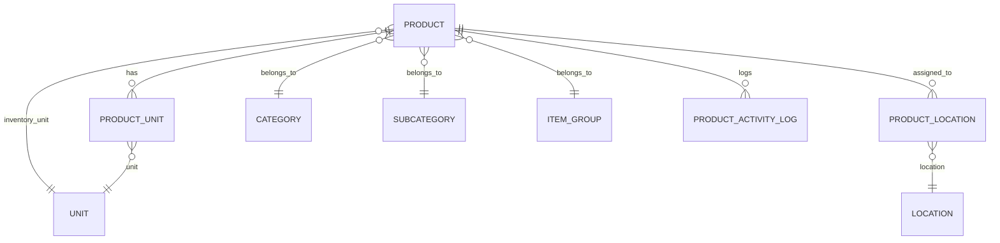

# Data Definitions: Products

**Module**: Product Management
**Sub-Module**: Products
**Document Version**: 1.0
**Last Updated**: 2025-01-06

---

## 1. Overview

This document defines the data structures, database schema, field specifications, data types, constraints, and relationships for the Products module. All product-related data is centrally defined to ensure consistency across the application.

**Document Purpose**:
- Define database tables and columns for product master data
- Specify data types, constraints, and validation rules
- Document relationships between product entities
- Provide field-level specifications for all product attributes
- Define enumerations and lookup values

---

## 2. Core Entities

### 2.1 Entity Relationship Overview



---

## 3. Table Definitions

### 3.1 products Table

**Purpose**: Core product master data table storing all product information

**Table Name**: `products`

| Column Name | Data Type | Null | Default | Description | Constraints |
|-------------|-----------|------|---------|-------------|-------------|
| id | UUID | No | gen_random_uuid() | Unique product identifier | PRIMARY KEY |
| product_code | VARCHAR(50) | No | - | Business key, unique product code | UNIQUE, INDEX |
| product_name | VARCHAR(255) | No | - | Primary product name (English) | INDEX |
| display_name | VARCHAR(255) | Yes | NULL | Alternative display name | - |
| local_description | VARCHAR(255) | Yes | NULL | Product name in local language | - |
| description | TEXT | Yes | NULL | Detailed product description | - |
| barcode | VARCHAR(50) | Yes | NULL | Product barcode (EAN-13, UPC, etc.) | INDEX |
| sku | VARCHAR(50) | Yes | NULL | Stock keeping unit identifier | UNIQUE |
| category_id | UUID | No | - | Foreign key to categories | FK categories(id) |
| subcategory_id | UUID | Yes | NULL | Foreign key to subcategories | FK subcategories(id) |
| item_group_id | UUID | No | - | Foreign key to item groups | FK item_groups(id) |
| primary_inventory_unit_id | UUID | No | - | Foreign key to units (base unit) | FK units(id) |
| brand | VARCHAR(100) | Yes | NULL | Product brand name | - |
| manufacturer | VARCHAR(100) | Yes | NULL | Manufacturer name | - |
| country_of_origin | VARCHAR(100) | Yes | NULL | Country of origin | - |
| size | VARCHAR(50) | Yes | NULL | Product size | - |
| color | VARCHAR(50) | Yes | NULL | Product color | - |
| weight | DECIMAL(10,3) | Yes | NULL | Product weight | CHECK (weight > 0) |
| weight_unit | VARCHAR(10) | Yes | NULL | Weight unit (kg, g, lb, oz) | - |
| shelf_life | INTEGER | Yes | NULL | Shelf life in days | CHECK (shelf_life > 0) |
| storage_instructions | TEXT | Yes | NULL | Storage requirements | - |
| standard_cost | DECIMAL(15,5) | Yes | NULL | Standard/planned cost per base unit | CHECK (standard_cost >= 0) |
| last_cost | DECIMAL(15,5) | Yes | NULL | Last receiving cost per base unit | CHECK (last_cost >= 0) |
| average_cost | DECIMAL(15,5) | Yes | NULL | Weighted average cost per base unit | CHECK (average_cost >= 0) |
| base_price | DECIMAL(15,5) | Yes | NULL | Selling price per base unit | CHECK (base_price >= 0) |
| currency | VARCHAR(3) | No | 'USD' | Currency code (ISO 4217) | - |
| tax_type | VARCHAR(20) | Yes | NULL | Tax calculation type | ENUM tax_types |
| tax_rate | DECIMAL(5,2) | Yes | NULL | Tax rate percentage | CHECK (0 <= tax_rate <= 100) |
| price_deviation_limit | DECIMAL(5,2) | Yes | NULL | Price deviation % threshold | CHECK (0 <= price_deviation_limit <= 100) |
| quantity_deviation_limit | DECIMAL(5,2) | Yes | NULL | Quantity deviation % threshold | CHECK (0 <= quantity_deviation_limit <= 100) |
| minimum_stock_level | DECIMAL(12,3) | Yes | NULL | Global minimum stock | CHECK (minimum_stock_level >= 0) |
| maximum_stock_level | DECIMAL(12,3) | Yes | NULL | Global maximum stock | CHECK (maximum_stock_level >= minimum_stock_level) |
| is_for_sale | BOOLEAN | No | false | Product can be sold | - |
| is_ingredient | BOOLEAN | No | false | Product used in recipes | - |
| is_active | BOOLEAN | No | true | Product active status | INDEX |
| status | VARCHAR(20) | No | 'ACTIVE' | Product lifecycle status | ENUM product_status |
| images_url | TEXT | Yes | NULL | Comma-separated image URLs | - |
| notes | TEXT | Yes | NULL | Additional notes | - |
| created_by | UUID | No | - | User who created record | FK users(id) |
| created_at | TIMESTAMP | No | CURRENT_TIMESTAMP | Creation timestamp | INDEX |
| updated_by | UUID | Yes | NULL | User who last updated | FK users(id) |
| updated_at | TIMESTAMP | Yes | NULL | Last update timestamp | - |
| deleted_at | TIMESTAMP | Yes | NULL | Soft delete timestamp | INDEX |
| deleted_by | UUID | Yes | NULL | User who deleted | FK users(id) |

**Indexes**:
- `PRIMARY KEY (id)`
- `UNIQUE INDEX idx_products_product_code ON products(product_code) WHERE deleted_at IS NULL`
- `INDEX idx_products_product_name ON products(product_name)`
- `INDEX idx_products_barcode ON products(barcode) WHERE barcode IS NOT NULL`
- `INDEX idx_products_category ON products(category_id)`
- `INDEX idx_products_is_active ON products(is_active, deleted_at)`
- `INDEX idx_products_status ON products(status) WHERE deleted_at IS NULL`
- `INDEX idx_products_created_at ON products(created_at DESC)`

**Enumerations**:

```sql
-- product_status enum
CREATE TYPE product_status AS ENUM (
  'DRAFT',          -- Product being configured
  'ACTIVE',         -- Available for transactions
  'INACTIVE',       -- Temporarily unavailable
  'DISCONTINUED'    -- Permanently discontinued
);

-- tax_types enum
CREATE TYPE tax_type AS ENUM (
  'ADDED_TAX',      -- Tax added on top of price
  'INCLUDED_TAX',   -- Tax included in price
  'NONE'            -- No tax
);
```

---

### 3.2 product_units Table

**Purpose**: Stores alternative units of measure for products with conversion rates

**Table Name**: `product_units`

| Column Name | Data Type | Null | Default | Description | Constraints |
|-------------|-----------|------|---------|-------------|-------------|
| id | UUID | No | gen_random_uuid() | Unique product unit identifier | PRIMARY KEY |
| product_id | UUID | No | - | Foreign key to products | FK products(id) ON DELETE CASCADE |
| unit_id | UUID | No | - | Foreign key to units | FK units(id) |
| unit_type | VARCHAR(20) | No | - | Unit usage type | ENUM unit_types |
| conversion_factor | DECIMAL(12,5) | No | - | Conversion to base unit | CHECK (conversion_factor > 0) |
| is_default | BOOLEAN | No | false | Default unit for this type | - |
| description | VARCHAR(255) | Yes | NULL | Unit description | - |
| barcode | VARCHAR(50) | Yes | NULL | Unit-specific barcode | INDEX |
| created_by | UUID | No | - | User who created record | FK users(id) |
| created_at | TIMESTAMP | No | CURRENT_TIMESTAMP | Creation timestamp | - |
| updated_by | UUID | Yes | NULL | User who last updated | FK users(id) |
| updated_at | TIMESTAMP | Yes | NULL | Last update timestamp | - |

**Indexes**:
- `PRIMARY KEY (id)`
- `UNIQUE INDEX idx_product_units_unique ON product_units(product_id, unit_id, unit_type)`
- `INDEX idx_product_units_product ON product_units(product_id)`
- `INDEX idx_product_units_type ON product_units(product_id, unit_type)`
- `INDEX idx_product_units_default ON product_units(product_id, unit_type, is_default) WHERE is_default = true`

**Enumerations**:

```sql
-- unit_types enum
CREATE TYPE unit_type AS ENUM (
  'INVENTORY',      -- Base inventory unit (conversion_factor = 1)
  'ORDER',          -- Purchasing/ordering unit
  'RECIPE',         -- Recipe ingredient unit
  'COUNT'           -- Physical count unit
);
```

**Business Rules**:
- Each product must have exactly one INVENTORY unit type (conversion_factor = 1.00000)
- Each product can have multiple ORDER, RECIPE, and COUNT unit types
- Only one unit per type can be marked as default (is_default = true)
- The combination of (product_id, unit_id, unit_type) must be unique

---

### 3.3 product_locations Table

**Purpose**: Store product assignments to specific locations with min/max thresholds

**Table Name**: `product_locations`

| Column Name | Data Type | Null | Default | Description | Constraints |
|-------------|-----------|------|---------|-------------|-------------|
| id | UUID | No | gen_random_uuid() | Unique assignment identifier | PRIMARY KEY |
| product_id | UUID | No | - | Foreign key to products | FK products(id) ON DELETE CASCADE |
| location_id | UUID | No | - | Foreign key to locations | FK locations(id) |
| minimum_stock_level | DECIMAL(12,3) | No | 0 | Min stock for this location | CHECK (minimum_stock_level >= 0) |
| maximum_stock_level | DECIMAL(12,3) | No | 0 | Max stock for this location | CHECK (maximum_stock_level >= minimum_stock_level) |
| reorder_point | DECIMAL(12,3) | Yes | NULL | Reorder trigger level | CHECK (reorder_point >= 0) |
| reorder_quantity | DECIMAL(12,3) | Yes | NULL | Standard reorder quantity | CHECK (reorder_quantity > 0) |
| is_active | BOOLEAN | No | true | Assignment active status | - |
| created_by | UUID | No | - | User who created record | FK users(id) |
| created_at | TIMESTAMP | No | CURRENT_TIMESTAMP | Creation timestamp | - |
| updated_by | UUID | Yes | NULL | User who last updated | FK users(id) |
| updated_at | TIMESTAMP | Yes | NULL | Last update timestamp | - |

**Indexes**:
- `PRIMARY KEY (id)`
- `UNIQUE INDEX idx_product_locations_unique ON product_locations(product_id, location_id)`
- `INDEX idx_product_locations_product ON product_locations(product_id)`
- `INDEX idx_product_locations_location ON product_locations(location_id)`
- `INDEX idx_product_locations_active ON product_locations(is_active) WHERE is_active = true`

**Business Rules**:
- Each product can be assigned to a location only once
- Maximum stock level must be greater than or equal to minimum stock level
- All stock levels are in the product's base inventory unit
- Reorder point typically set between minimum and maximum levels

---

### 3.4 product_activity_log Table

**Purpose**: Audit trail for all product data changes

**Table Name**: `product_activity_log`

| Column Name | Data Type | Null | Default | Description | Constraints |
|-------------|-----------|------|---------|-------------|-------------|
| id | UUID | No | gen_random_uuid() | Unique log entry identifier | PRIMARY KEY |
| product_id | UUID | No | - | Foreign key to products | FK products(id) |
| action_type | VARCHAR(50) | No | - | Type of action performed | ENUM action_types |
| entity_type | VARCHAR(50) | No | 'PRODUCT' | Entity type (PRODUCT, UNIT, LOCATION) | - |
| entity_id | UUID | Yes | NULL | Specific entity affected | - |
| field_name | VARCHAR(100) | Yes | NULL | Field that changed | - |
| old_value | TEXT | Yes | NULL | Previous value (JSON) | - |
| new_value | TEXT | Yes | NULL | New value (JSON) | - |
| description | TEXT | Yes | NULL | Human-readable description | - |
| created_by | UUID | No | - | User who performed action | FK users(id) |
| created_at | TIMESTAMP | No | CURRENT_TIMESTAMP | Action timestamp | INDEX |

**Indexes**:
- `PRIMARY KEY (id)`
- `INDEX idx_activity_log_product ON product_activity_log(product_id, created_at DESC)`
- `INDEX idx_activity_log_created_at ON product_activity_log(created_at DESC)`
- `INDEX idx_activity_log_created_by ON product_activity_log(created_by, created_at DESC)`
- `INDEX idx_activity_log_action ON product_activity_log(action_type, created_at DESC)`

**Enumerations**:

```sql
-- action_types enum
CREATE TYPE action_type AS ENUM (
  'CREATED',                -- Product created
  'UPDATED',                -- Product updated
  'DELETED',                -- Product soft deleted
  'RESTORED',               -- Product restored from deleted
  'STATUS_CHANGED',         -- Status changed
  'UNIT_ADDED',             -- Unit conversion added
  'UNIT_UPDATED',           -- Unit conversion updated
  'UNIT_REMOVED',           -- Unit conversion removed
  'LOCATION_ASSIGNED',      -- Product assigned to location
  'LOCATION_UPDATED',       -- Location assignment updated
  'LOCATION_REMOVED',       -- Location assignment removed
  'COST_UPDATED',           -- Cost fields updated
  'PRICE_UPDATED'           -- Price fields updated
);
```

---

## 4. TypeScript Type Definitions

### 4.1 Core Product Types

Location: `/lib/types/product.ts`

```typescript
// Product Type Enumerations
export type ProductType =
  | 'raw_material'
  | 'finished_good'
  | 'semi_finished'
  | 'service'
  | 'asset'
  | 'consumable';

export type ProductStatus =
  | 'active'
  | 'inactive'
  | 'discontinued'
  | 'pending_approval'
  | 'draft';

export type UnitType =
  | 'INVENTORY'
  | 'ORDER'
  | 'RECIPE'
  | 'COUNT';

// Core Product Interface
export interface Product {
  // Identification
  id: string;
  productCode: string;
  productName: string;
  displayName?: string;
  description?: string;
  localDescription?: string;

  // Classification
  productType: ProductType;
  status: ProductStatus;
  categoryId: string;
  categoryName?: string;
  subcategoryId?: string;
  subcategoryName?: string;
  itemGroupId?: string;
  itemGroupName?: string;

  // Units
  baseUnit: string;
  primaryInventoryUnitId: string;
  primaryUnitName?: string;
  alternativeUnits: ProductUnit[];
  unitConversions?: ProductUnit[];

  // Identifiers
  barcode?: string;
  sku?: string;

  // Physical Properties
  size?: string;
  color?: string;
  weight?: number;
  weightUnit?: string;

  // Brand and Origin
  brand?: string;
  manufacturer?: string;
  countryOfOrigin?: string;

  // Inventory Settings
  isInventoried: boolean;
  isSerialTrackingRequired: boolean;
  isBatchTrackingRequired: boolean;
  shelfLifeDays?: number;
  storageConditions?: string;

  // Operational Flags
  isPurchasable: boolean;
  isSellable: boolean;
  isForSale?: boolean;
  isIngredient?: boolean;

  // Cost Information
  standardCost?: Money;
  lastPurchaseCost?: Money;
  lastCost?: number;
  averageCost?: Money;

  // Pricing
  basePrice?: number;
  currency?: string;
  taxType?: string;
  taxRate?: number;

  // Deviation Limits
  priceDeviationLimit?: number;
  quantityDeviationLimit?: number;

  // Stock Levels
  minStockLevel?: number;
  maxStockLevel?: number;
  minimumOrderQuantity?: number;
  leadTimeDays?: number;

  // Vendor
  defaultVendorId?: string;

  // Media
  images: ProductImage[];
  imagesUrl?: string;
  documents: ProductDocument[];

  // Status and Tracking
  isActive: boolean;

  // Audit Fields
  createdBy?: string;
  createdAt?: Date;
  updatedBy?: string;
  updatedAt?: Date;
  deletedAt?: Date | null;
  deletedBy?: string | null;
}

// Product Unit Interface
export interface ProductUnit {
  id: string;
  productId: string;
  unit: string;
  unitId?: string;
  unitName?: string;
  unitType: UnitType;
  conversionFactor: number;
  isActive: boolean;
  isDefault: boolean;
  isPurchaseUnit?: boolean;
  isSalesUnit?: boolean;
  isInventoryUnit?: boolean;
  barcode?: string;
  description?: string;
  createdAt?: Date;
  updatedAt?: Date;
}

// Product Location Assignment Interface
export interface ProductLocation {
  id: string;
  productId: string;
  locationId: string;
  locationName?: string;
  minimumStockLevel: number;
  maximumStockLevel: number;
  reorderPoint?: number;
  reorderQuantity?: number;
  isActive: boolean;
  createdAt?: Date;
  updatedAt?: Date;
}

// Product Activity Log Interface
export interface ProductActivityLog {
  id: string;
  productId: string;
  actionType:
    | 'CREATED'
    | 'UPDATED'
    | 'DELETED'
    | 'RESTORED'
    | 'STATUS_CHANGED'
    | 'UNIT_ADDED'
    | 'UNIT_UPDATED'
    | 'UNIT_REMOVED'
    | 'LOCATION_ASSIGNED'
    | 'LOCATION_UPDATED'
    | 'LOCATION_REMOVED'
    | 'COST_UPDATED'
    | 'PRICE_UPDATED';
  entityType: 'PRODUCT' | 'UNIT' | 'LOCATION';
  entityId?: string;
  fieldName?: string;
  oldValue?: string;
  newValue?: string;
  description: string;
  createdBy: string;
  createdByName?: string;
  createdAt: Date;
}

// Money Interface (from common types)
export interface Money {
  amount: number;
  currency: string;
}

// Product Image Interface
export interface ProductImage {
  id: string;
  url: string;
  isPrimary: boolean;
  caption?: string;
  displayOrder: number;
}

// Product Document Interface
export interface ProductDocument {
  id: string;
  name: string;
  url: string;
  type: string;
  size: number;
  uploadedAt: Date;
  uploadedBy: string;
}
```

---

### 4.2 Form and Validation Schemas

Location: `/app/(main)/product-management/products/[id]/components/ProductForm.tsx`

```typescript
import * as z from "zod";

// Product Form Schema
const productFormSchema = z.object({
  name: z.string().min(1, "Name is required"),
  description: z.string(),
  category: z.string().min(1, "Category is required"),
  itemGroup: z.string().min(1, "Item group is required"),
  brand: z.string(),
  manufacturer: z.string(),
  countryOfOrigin: z.string(),
  barcode: z.string(),
  sku: z.string(),
  notes: z.string(),
  defaultUnit: z.string().min(1, "Default unit is required"),
  purchaseUnit: z.string().min(1, "Purchase unit is required"),
  stockUnit: z.string().min(1, "Stock unit is required"),
  taxType: z.string().min(1, "Tax type is required"),
});

export type ProductFormValues = z.infer<typeof productFormSchema>;
```

---

## 5. Field Specifications

### 5.1 Required Fields

The following fields are **REQUIRED** and must be provided when creating a product:

- `product_code` - Unique business identifier
- `product_name` - Primary product name
- `category_id` - Product category
- `item_group_id` - Product item group
- `primary_inventory_unit_id` - Base inventory unit
- `currency` - Monetary currency
- `is_for_sale` - Sale flag (defaults to false)
- `is_ingredient` - Recipe flag (defaults to false)
- `is_active` - Active status (defaults to true)
- `status` - Lifecycle status (defaults to 'ACTIVE')
- `created_by` - Creating user

### 5.2 Optional Fields

All other fields are **OPTIONAL** and can be NULL or set to default values.

### 5.3 Calculated Fields

The following fields are **CALCULATED** or **SYSTEM-MANAGED**:

- `id` - Auto-generated UUID
- `last_cost` - Updated from GRN transactions
- `average_cost` - Calculated using weighted average formula
- `created_at` - Auto-set on creation
- `updated_at` - Auto-set on update
- `deleted_at` - Set when soft deleted

---

## 6. Data Validation Rules

### 6.1 Field Validations

**Product Code**:
- Length: 1-50 characters
- Must be unique (case-insensitive)
- Cannot contain special characters except dash (-) and underscore (_)
- Cannot be changed after creation

**Product Name**:
- Length: 1-255 characters
- Cannot be empty or whitespace only
- Should be unique within category (warning, not error)

**Barcode**:
- Length: 1-50 characters
- Should match standard barcode formats (EAN-13, UPC-A, Code 128)
- Should be unique across products (warning, not error)

**SKU**:
- Length: 1-50 characters
- Must be unique if provided
- Cannot contain special characters

**Weight**:
- Must be positive number if provided
- Range: 0.001 to 999999.999
- Precision: 3 decimal places

**Shelf Life**:
- Must be positive integer if provided
- Range: 1 to 9999 days

**Standard Cost, Last Cost, Average Cost, Base Price**:
- Must be non-negative if provided
- Range: 0.00000 to 9999999999.99999
- Precision: 5 decimal places

**Tax Rate**:
- Range: 0.00 to 100.00 (percentage)
- Precision: 2 decimal places
- Required if tax_type is not 'NONE'

**Deviation Limits**:
- Range: 0.00 to 100.00 (percentage)
- Precision: 2 decimal places

**Minimum and Maximum Stock Levels**:
- Must be non-negative
- Maximum must be greater than or equal to minimum
- Precision: 3 decimal places

### 6.2 Unit Conversion Validations

**Conversion Factor**:
- Must be positive (> 0)
- Range: 0.00001 to 9999999.99999
- Precision: 5 decimal places
- INVENTORY unit type must have conversion_factor = 1.00000

**Unit Uniqueness**:
- Combination of (product_id, unit_id, unit_type) must be unique

**Default Unit**:
- Only one unit per unit_type can be marked as default
- If no default specified, first unit added becomes default

### 6.3 Location Assignment Validations

**Stock Levels**:
- Minimum must be non-negative
- Maximum must be >= Minimum
- Reorder point should be between minimum and maximum (warning)
- All values in base inventory unit

**Location Uniqueness**:
- Each product can be assigned to a location only once

---

## 7. Data Relationships

### 7.1 Foreign Key Relationships

**products Table**:
- `category_id` → `categories(id)` - ON DELETE RESTRICT
- `subcategory_id` → `subcategories(id)` - ON DELETE RESTRICT
- `item_group_id` → `item_groups(id)` - ON DELETE RESTRICT
- `primary_inventory_unit_id` → `units(id)` - ON DELETE RESTRICT
- `created_by` → `users(id)` - ON DELETE RESTRICT
- `updated_by` → `users(id)` - ON DELETE RESTRICT
- `deleted_by` → `users(id)` - ON DELETE RESTRICT

**product_units Table**:
- `product_id` → `products(id)` - ON DELETE CASCADE
- `unit_id` → `units(id)` - ON DELETE RESTRICT
- `created_by` → `users(id)` - ON DELETE RESTRICT
- `updated_by` → `users(id)` - ON DELETE RESTRICT

**product_locations Table**:
- `product_id` → `products(id)` - ON DELETE CASCADE
- `location_id` → `locations(id)` - ON DELETE RESTRICT
- `created_by` → `users(id)` - ON DELETE RESTRICT
- `updated_by` → `users(id)` - ON DELETE RESTRICT

**product_activity_log Table**:
- `product_id` → `products(id)` - ON DELETE CASCADE
- `created_by` → `users(id)` - ON DELETE RESTRICT

### 7.2 Cascade Behavior

**ON DELETE CASCADE**:
- When a product is deleted (soft delete), all related records in `product_units`, `product_locations`, and `product_activity_log` remain (cascade handles hard deletes only)

**ON DELETE RESTRICT**:
- Cannot delete categories, units, or locations that are referenced by active products
- System displays error message listing dependent products

---

## 8. Indexes and Performance

### 8.1 Primary Indexes

All tables have clustered primary key indexes on the `id` (UUID) column.

### 8.2 Secondary Indexes

**products Table** (8 indexes):
1. Unique product_code (excluding soft-deleted)
2. product_name (for search)
3. barcode (for barcode scanning)
4. category_id (for filtering)
5. (is_active, deleted_at) composite (for active products query)
6. status (for lifecycle filtering)
7. created_at DESC (for recent products)

**product_units Table** (4 indexes):
1. Unique (product_id, unit_id, unit_type)
2. product_id (for unit lookup)
3. (product_id, unit_type) composite (for unit type filtering)
4. (product_id, unit_type, is_default) partial (for default unit lookup)

**product_locations Table** (4 indexes):
1. Unique (product_id, location_id)
2. product_id (for location lookup)
3. location_id (for location-product lookup)
4. is_active partial (for active assignments)

**product_activity_log Table** (4 indexes):
1. (product_id, created_at DESC) composite (for product history)
2. created_at DESC (for recent activities)
3. (created_by, created_at DESC) composite (for user activities)
4. (action_type, created_at DESC) composite (for action filtering)

### 8.3 Full-Text Search Indexes

```sql
-- Full-text search on product name and description
CREATE INDEX idx_products_fulltext
ON products
USING GIN (
  to_tsvector('english',
    coalesce(product_name, '') || ' ' ||
    coalesce(description, '') || ' ' ||
    coalesce(local_description, '')
  )
);
```

---

## 9. Mock Data Structure

Location: `/app/(main)/product-management/products/components/product-list.tsx` and detail pages

### 9.1 Mock Product List Data

```typescript
interface Product {
  id: string;
  productCode: string;
  name: string;
  description: string;
  localDescription?: string;
  categoryId: string;
  categoryName?: string;
  subCategoryId: string;
  subCategoryName?: string;
  itemGroupId?: string;
  itemGroupName?: string;
  primaryInventoryUnitId: string;
  primaryUnitName?: string;
  size?: string;
  color?: string;
  barcode?: string;
  isActive: boolean;
  basePrice: number;
  currency: string;
  taxType?: string;
  taxRate?: number;
  standardCost?: number;
  lastCost?: number;
  priceDeviationLimit?: number;
  quantityDeviationLimit?: number;
  minStockLevel?: number;
  maxStockLevel?: number;
  isForSale?: boolean;
  isIngredient?: boolean;
  weight?: number;
  shelfLife?: number;
  storageInstructions?: string;
  unitConversions?: UnitConversion[];
  imagesUrl?: string;
}

interface UnitConversion {
  id: string;
  productId: string;
  unitId: string;
  unitName: string;
  conversionFactor: number;
  unitType: 'ORDER' | 'RECIPE' | 'COUNT';
  isDefault: boolean;
  description?: string;
}
```

### 9.2 Mock Unit Data

Location: `/app/(main)/product-management/products/data/mock-product-units.ts`

```typescript
export interface BaseProductUnit {
  baseInventoryUnit: string;
  baseInventoryUnitLabel: string;
}

export interface StockCountUnit {
  countUnit: string;
  factor: number;
  description: string;
  isDefault: boolean;
  isInverse: boolean;
}

export interface OrderUnit {
  unit: string;
  conversionRate: number;
  isDefault: boolean;
  description?: string;
  isInverse: boolean;
}

export interface OrderUnitRules {
  minimumOrderQuantity: number;
  orderMultiple: number;
  enforceOrderMultiple: boolean;
  allowPartialOrders: boolean;
}
```

---

## 10. Data Migration Considerations

### 10.1 Initial Data Load

When migrating from legacy systems:

1. **Product Codes**: Validate uniqueness before import; append suffix for duplicates
2. **Categories**: Ensure all referenced categories exist in system
3. **Units**: Map legacy unit codes to standard unit master data
4. **Cost Data**: Migrate standard costs; last/average costs can be recalculated
5. **Status Mapping**: Map legacy status codes to standard ACTIVE/INACTIVE/DISCONTINUED

### 10.2 Data Cleansing Rules

- Remove leading/trailing whitespace from all text fields
- Standardize product codes to uppercase
- Validate and format barcodes to standard formats
- Set default values for required fields if missing
- Create activity log entry for initial import

---

## 11. Data Retention and Archival

### 11.1 Soft Delete Strategy

Products use soft delete (deleted_at timestamp) rather than physical deletion:

- Maintains referential integrity with transactions
- Preserves historical data for reporting
- Allows restoration if needed
- Excluded from active queries via `WHERE deleted_at IS NULL` clause

### 11.2 Activity Log Retention

Activity logs are retained indefinitely for audit trail purposes:

- No automatic purging implemented
- Periodic archival to historical tables may be implemented in future
- Indexes support efficient querying of recent activities

---

## 12. Related Documents

- **Business Requirements**: [BR-products.md](./BR-products.md)
- **Use Cases**: [UC-products.md](./UC-products.md)
- **Technical Specification**: [TS-products.md](./TS-products.md)
- **Flow Diagrams**: [FD-products.md](./FD-products.md)
- **Validations**: [VAL-products.md](./VAL-products.md)
- **Type Definitions**: `/lib/types/product.ts`
- **Mock Data**: `/lib/mock-data/products.ts`

---

**Document Control**:
- **Created By**: System Documentation Team
- **Approved By**: [Pending]
- **Next Review Date**: [To be determined]
