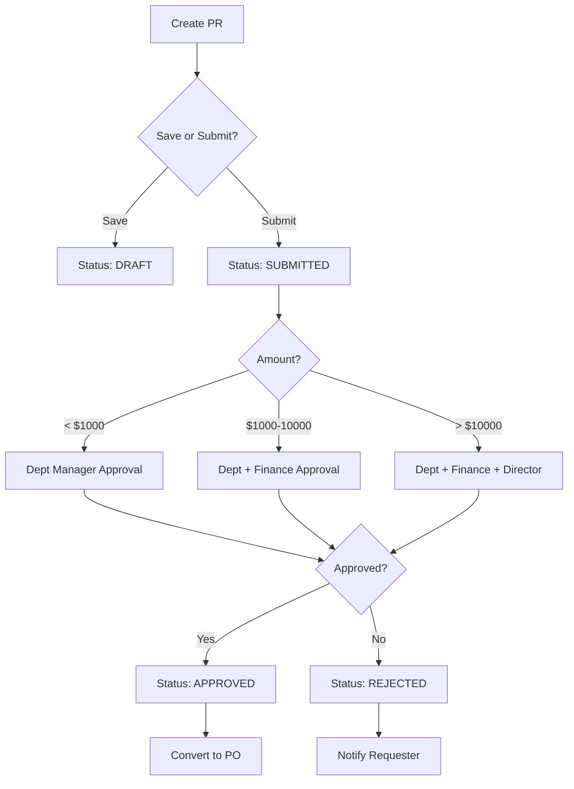

# Document Types Explained

**Complete guide to Carmen's 7 documentation types** and how to use them effectively.

## Document History

| Version | Date | Author | Changes |
|---------|------|--------|---------|
| 1.0.0 | 2025-11-19 | Documentation Team | Initial version |
---

## Overview

Carmen uses **7 specialized document types** to comprehensively document the system:

| Type | Purpose | Count | Who Reads | When to Read |
|------|---------|-------|-----------|--------------|
| **DD** | Data Definition | 40 | Developers, DBAs | Implementing features, schema work |
| **BR** | Business Requirements | 38 | All | Understanding business rules |
| **TS** | Technical Specification | 36 | Developers | Implementation details |
| **UC** | Use Cases | 38 | All | User workflows, testing |
| **FD** | Flow Diagrams | 38 | All | Visual process understanding |
| **VAL** | Validations | 38 | Developers, QA | Validation rules, testing |
| **PROCESS** | Process Documentation | 2 | All | End-to-end workflows |

---

## DD - Data Definition

**Purpose**: Database schema, tables, fields, relationships

**Contains**:
- Table definitions (like SQL CREATE TABLE)
- Field types and constraints
- Relationships and foreign keys
- Indexes and performance optimizations
- JSON field structures
- Enum definitions
- Business rules related to data

**Example Content**:
```
### tb_purchase_request

**Purpose**: Stores purchase request headers

**Fields**:
- id (UUID, PRIMARY KEY)
- request_number (VARCHAR(50), UNIQUE, NOT NULL)
- request_date (DATE, NOT NULL)
- status (ENUM: DRAFT, SUBMITTED, APPROVED, REJECTED)
- department_id (UUID, FOREIGN KEY → tb_department)
- total_amount (DECIMAL(15,2))
- notes (TEXT, NULLABLE)

**Indexes**:
- idx_pr_status ON (status)
- idx_pr_department ON (department_id)
- idx_pr_date ON (request_date DESC)

**Relationships**:
- belongs_to: Department
- has_many: PurchaseRequestDetail
- has_many: Approval
```

**When to Read**:
- Implementing new features
- Database schema work
- Understanding data model
- Writing Prisma queries

**Example**: [DD-purchase-requests.md](../procurement/purchase-requests/DD-purchase-requests.md)

---

## BR - Business Requirements

**Purpose**: Functional requirements and business rules

**Contains**:
- Feature descriptions
- Business rules
- Approval workflows
- Calculation formulas
- User permissions
- Business constraints
- Integration requirements

**Example Content**:
```
### BR-PRO-001: Purchase Request Approval

**Rule**: Purchase requests require approval based on total amount:
- < $1,000: Department Manager approval
- $1,000 - $10,000: Department Manager + Finance Manager
- > $10,000: Department Manager + Finance Manager + Director

**Rule**: Users can only create purchase requests for their own department

**Rule**: Purchase requests can only be edited in DRAFT status
```

**When to Read**:
- Understanding business logic
- Implementing business rules
- Writing validation logic
- Clarifying requirements

**Example**: [BR-purchase-requests.md](../procurement/purchase-requests/BR-purchase-requests.md)

---

## TS - Technical Specification

**Purpose**: Implementation details and technical approach

**Contains**:
- Algorithm descriptions
- API specifications
- Component architecture
- Technology choices
- Performance considerations
- Security implementations
- Third-party integrations

**Example Content**:
```
### Cost Calculation Algorithm

**FIFO (First-In-First-Out)**:
1. Retrieve all cost layers for inventory item ordered by creation date ASC
2. For issue quantity, consume cost layers in order until quantity fulfilled
3. Update remaining quantity for each cost layer
4. Calculate total cost = Σ(quantity_consumed × cost_per_unit)

**Periodic Average**:
1. Calculate period average: (opening_value + receipt_value) ÷ (opening_qty + receipt_qty)
2. Apply average cost to all issues in period
3. Update average cost at period close
```

**When to Read**:
- Implementing features
- Understanding algorithms
- Debugging issues
- Architecture decisions

**Example**: [TS-lot-based-costing.md](../inventory-management/lot-based-costing/TS-lot-based-costing.md)

---

## UC - Use Cases

**Purpose**: User workflows and scenarios

**Contains**:
- User stories
- Step-by-step workflows
- Success scenarios
- Alternative flows
- Error handling
- User roles
- Prerequisites
- Expected outcomes

**Example Content**:
```
### UC-PRO-001: Create Purchase Request

**Actor**: Purchasing Staff
**Preconditions**:
- User is authenticated
- User has permission to create purchase requests
- User's department is active

**Main Flow**:
1. User navigates to Purchase Requests
2. User clicks "New Purchase Request"
3. System displays empty form
4. User enters request date
5. User selects products and quantities
6. System calculates total amount
7. User adds notes (optional)
8. User clicks "Save as Draft" OR "Submit for Approval"
9. System validates data
10. System creates purchase request
11. System displays success message

**Alternative Flows**:
- A1: Validation fails → System shows errors, user corrects
- A2: Save as Draft → Status = DRAFT, no approval workflow triggered
- A3: Submit → Status = SUBMITTED, approval workflow triggered
```

**When to Read**:
- Understanding user workflows
- Writing tests
- User training
- Feature walkthroughs

**Example**: [UC-purchase-requests.md](../procurement/purchase-requests/UC-purchase-requests.md)

---

## FD - Flow Diagrams

**Purpose**: Visual process flows using Mermaid diagrams

**Contains**:
- Workflow diagrams
- Sequence diagrams
- State transitions
- Decision trees
- Integration flows
- Data flow diagrams

**Example Content**:
````markdown
### Purchase Request Workflow


````

**When to Read**:
- Understanding workflows visually
- Learning process flow
- Identifying integration points
- Planning implementation

**Example**: [FD-purchase-requests.md](../procurement/purchase-requests/FD-purchase-requests.md)

---

## VAL - Validations

**Purpose**: Business rules and data validation specifications

**Contains**:
- Field validation rules
- Business rule validations
- Error messages
- Validation timing (client vs server)
- Data integrity rules
- Cross-field validations

**Example Content**:
```
### Purchase Request Validations

**VAL-PRO-001: Request Date Required**
- Rule: request_date must not be null
- Message: "Request date is required"
- When: Form submission (client + server)

**VAL-PRO-002: Future Request Date**
- Rule: request_date must not be more than 30 days in the future
- Message: "Request date cannot be more than 30 days in the future"
- When: Form submission (server)

**VAL-PRO-003: At Least One Item**
- Rule: Purchase request must have at least 1 item
- Message: "At least one item is required"
- When: Form submission (client + server)

**VAL-PRO-004: Positive Quantity**
- Rule: Each item quantity must be > 0
- Message: "Quantity must be greater than zero"
- When: Item entry (client + server)

**VAL-PRO-005: Department Active**
- Rule: Department must be active (is_active = true)
- Message: "Cannot create purchase request for inactive department"
- When: Form submission (server)
```

**When to Read**:
- Implementing validation logic
- Writing tests
- Understanding business rules
- Debugging validation errors

**Example**: [VAL-purchase-requests.md](../procurement/purchase-requests/VAL-purchase-requests.md)

---

## PROCESS - Process Documentation

**Purpose**: End-to-end workflow documentation

**Contains**:
- Complete process flows
- Multiple document types integrated
- Step-by-step procedures
- Role responsibilities
- System interactions
- Best practices

**Example Content**:
```
### Procurement Process (End-to-End)

**Overview**: Complete procurement workflow from request to goods receipt

**Steps**:

1. **Create Purchase Request**
   - Actor: Purchasing Staff
   - System: Purchase Request module
   - Output: Purchase Request (DRAFT or SUBMITTED)

2. **Approval Workflow**
   - Actor: Managers (based on amount)
   - System: Approval module
   - Decision Points: Approve or Reject
   - Output: Purchase Request (APPROVED or REJECTED)

3. **Create Purchase Order**
   - Actor: Purchasing Staff
   - System: Purchase Order module
   - Input: Approved Purchase Request
   - Actions: Select vendor, confirm prices
   - Output: Purchase Order

4. **Send to Vendor**
   - Actor: System (automated) or Purchasing Staff
   - Action: Email/print purchase order
   - Output: PO sent to vendor

5. **Receive Goods**
   - Actor: Warehouse Staff
   - System: GRN module
   - Input: Purchase Order
   - Actions: Verify quantity and quality
   - Output: Goods Received Note

6. **Update Inventory**
   - Actor: System (automated)
   - System: Inventory module
   - Input: GRN
   - Actions: Create inventory transactions, assign lot numbers, update stock
   - Output: Updated inventory levels
```

**When to Read**:
- Understanding complete workflows
- Training new team members
- Process improvement
- Integration planning

**Example**: [PROCESS-procurement.md](../procurement/PROCESS-procurement.md)

---

## Reading Strategy by Task

**Understanding a Feature** (Read in order):
1. DD - Data model
2. BR - Business rules
3. UC - User workflows
4. TS - Implementation
5. FD - Visual flow
6. VAL - Validation rules

**Implementing a Feature**:
1. BR - Requirements first
2. DD - Data model
3. VAL - Validation rules
4. TS - Technical approach
5. UC - Test scenarios
6. FD - Workflow visualization

**Debugging**:
1. TS - Current implementation
2. BR - Expected behavior
3. VAL - Validation rules
4. DD - Data structure

**Writing Tests**:
1. UC - User workflows to test
2. VAL - Validation scenarios
3. BR - Business rule edge cases
4. FD - Process coverage

---

## Related Documentation

- **[FINDING-DOCUMENTATION.md](../guides/FINDING-DOCUMENTATION.md)** - How to find docs
- **[MODULE-INDEX.md](../MODULE-INDEX.md)** - All 247 files
- **[WIKI-HOME.md](../WIKI-HOME.md)** - Documentation hub

---

**🏠 [Back to Wiki](../WIKI-HOME.md)** | **🗺️ [Module Index](../MODULE-INDEX.md)**
