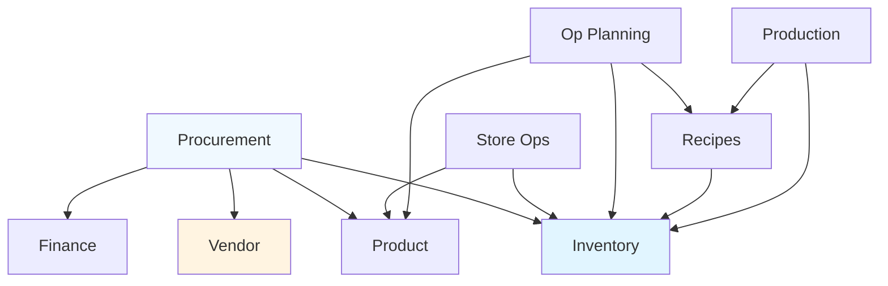

# Module Dependencies

**Understanding inter-module relationships** and integration points in Carmen ERP.

---

## Module Dependency Map



---

## Key Integration Points

### 1. Procurement → Inventory

**Flow**: Purchase Order → GRN → Inventory Transaction

**Data Exchange**:
```typescript
// When GRN is created
const grn = await createGRN({
  purchase_order_id: po.id,
  received_date: new Date(),
  items: [...]
})

// Automatically create inventory transactions
for (const item of grn.items) {
  await createInventoryTransaction({
    inventory_item_id: item.product_id,
    transaction_type: 'RECEIPT',
    quantity: item.quantity_received,
    lot_no: generateLotNumber(),
    cost_per_unit: item.unit_price,
    grn_id: grn.id
  })
}

// Update stock levels
await updateStockLevel({
  inventory_item_id: item.product_id,
  location_id: grn.location_id,
  quantity_change: item.quantity_received
})
```

**Shared Tables**:
- `tb_purchase_order` (Procurement)
- `tb_goods_received_note` (Procurement)
- `tb_inventory_transaction` (Inventory)
- `tb_stock_level` (Inventory)
- `tb_inventory_transaction_cost_layer` (Inventory)

---

### 2. Vendor → Procurement

**Flow**: Vendor Price List → Purchase Request → Purchase Order

**Data Exchange**:
```typescript
// Get vendor price for product
const priceListItem = await getVendorPrice({
  vendor_id: selectedVendor.id,
  product_id: product.id,
  effective_date: new Date()
})

// Use in purchase request
const requestItem = {
  product_id: product.id,
  quantity: requestedQty,
  unit_id: product.unit_id,
  unit_price: priceListItem.unit_price  // From vendor price list
}
```

**Shared Tables**:
- `tb_vendor` (Vendor)
- `tb_pricelist` (Vendor)
- `tb_pricelist_detail` (Vendor)
- `tb_purchase_request` (Procurement)
- `tb_purchase_order` (Procurement)

---

### 3. Recipe → Inventory

**Flow**: Recipe → Production Plan → Ingredient Issues → Inventory Deduction

**Data Exchange**:
```typescript
// Calculate recipe cost from inventory
async function calculateRecipeCost(recipe: Recipe) {
  let totalCost = 0

  for (const ingredient of recipe.ingredients) {
    const inventoryItem = await getInventoryItem(ingredient.inventory_item_id)
    const currentCost = await getCurrentCost(inventoryItem.id)

    totalCost += ingredient.quantity * currentCost
  }

  return totalCost
}

// Issue ingredients for production
async function issueIngredients(productionPlan: ProductionPlan) {
  for (const ingredient of productionPlan.recipe.ingredients) {
    await createInventoryTransaction({
      inventory_item_id: ingredient.inventory_item_id,
      transaction_type: 'ISSUE',
      quantity: -ingredient.quantity * productionPlan.production_quantity,
      reference_type: 'PRODUCTION_PLAN',
      reference_id: productionPlan.id
    })
  }
}
```

**Shared Tables**:
- `tb_recipe` (Op Planning)
- `tb_recipe_ingredient` (Op Planning)
- `tb_inventory_item` (Inventory)
- `tb_inventory_transaction` (Inventory)

---

### 4. Finance → Procurement

**Flow**: Multi-Currency Purchase Order → Currency Conversion → Accounting Entry

**Data Exchange**:
```typescript
// Multi-currency purchase order
const po = await createPurchaseOrder({
  vendor_id: vendor.id,
  currency_id: 'EUR',  // Vendor's currency
  items: [...]
})

// Convert to base currency (USD)
const exchangeRate = await getExchangeRate({
  from_currency: 'EUR',
  to_currency: 'USD',
  rate_date: po.order_date
})

const totalInBaseCurrency = {
  amount: po.total_amount.amount * exchangeRate.rate,
  currency: 'USD'
}

// Department allocation
const accountingEntry = {
  department_id: po.department_id,
  account_code_id: '5000',  // Purchases
  amount: totalInBaseCurrency,
  exchange_rate: exchangeRate.rate
}
```

**Shared Tables**:
- `tb_currency` (Finance)
- `tb_exchange_rate` (Finance)
- `tb_department` (Finance)
- `tb_purchase_order` (Procurement)

---

### 5. Store Operations → Inventory

**Flow**: Store Requisition → Transfer → Inventory Update

**Data Exchange**:
```typescript
// Create store requisition
const requisition = await createStoreRequisition({
  from_location_id: 'warehouse',
  to_location_id: 'restaurant',
  items: [...]
})

// Fulfill requisition (creates inventory transactions)
async function fulfillRequisition(requisition: StoreRequisition) {
  for (const item of requisition.items) {
    // Issue from source location
    await createInventoryTransaction({
      inventory_item_id: item.inventory_item_id,
      location_id: requisition.from_location_id,
      transaction_type: 'TRANSFER_OUT',
      quantity: -item.quantity
    })

    // Receipt at destination location
    await createInventoryTransaction({
      inventory_item_id: item.inventory_item_id,
      location_id: requisition.to_location_id,
      transaction_type: 'TRANSFER_IN',
      quantity: item.quantity
    })
  }
}
```

**Shared Tables**:
- `tb_store_requisition` (Store Ops)
- `tb_inventory_transaction` (Inventory)
- `tb_stock_level` (Inventory)
- `tb_inventory_location` (Inventory)

---

## Dependency Levels

### Independent Modules (No Dependencies)

These modules can function independently:
- **System Administration** - User management, permissions
- **Product Management** - Product catalog (used by others, doesn't depend on them)
- **Finance** (Currency, Department) - Used by others

### Level 1 Dependencies

Depend only on independent modules:
- **Vendor Management** → Product (for vendor-product mappings)
- **Procurement** → Product, Vendor, Finance

### Level 2 Dependencies

Depend on Level 1:
- **Inventory** → Product, Procurement (for GRN)
- **Operational Planning** (Recipes) → Product

### Level 3 Dependencies

Depend on Level 2:
- **Store Operations** → Inventory
- **Production** → Recipes, Inventory

---

## Shared Data Types

**Common across all modules**:
```typescript
interface AuditFields {
  created_at: Date
  created_by: string
  updated_at: Date
  updated_by: string
}

interface Money {
  amount: number
  currency: string
}

type DocumentStatus =
  | 'DRAFT'
  | 'SUBMITTED'
  | 'APPROVED'
  | 'REJECTED'
  | 'COMPLETED'
  | 'CANCELLED'
```

---

## Integration Best Practices

**✅ Do**:
- Use centralized types from `lib/types/`
- Create service layers for cross-module operations
- Use transactions for multi-module updates
- Document integration points
- Handle failures gracefully

**❌ Don't**:
- Create circular dependencies
- Bypass integration points
- Duplicate business logic across modules
- Modify other module's data directly
- Skip validation at integration boundaries

---

## Related Documentation

- **[ARCHITECTURE-OVERVIEW.md](../ARCHITECTURE-OVERVIEW.md)** - System architecture
- **[DATABASE-SCHEMA-GUIDE.md](../DATABASE-SCHEMA-GUIDE.md)** - Schema relationships
- **[MODULE-INDEX.md](../MODULE-INDEX.md)** - All modules

---

**🏠 [Back to Wiki](../WIKI-HOME.md)** | **🗺️ [Module Index](../MODULE-INDEX.md)**
