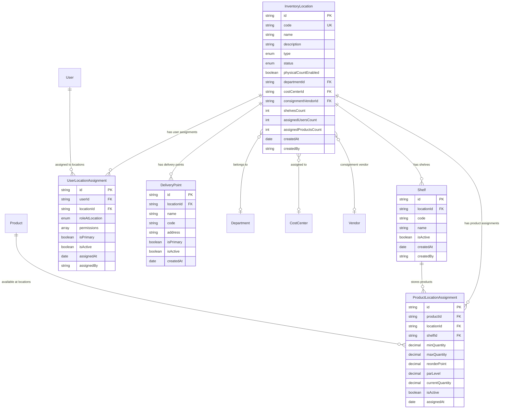

# Data Definition: Location Management

## Document Information
- **Module**: System Administration / Location Management
- **Version**: 1.1
- **Last Updated**: 2025-11-26
- **Status**: Active
- **Database**: PostgreSQL 15+
- **ORM**: Prisma 5.x

## Document History

| Version | Date | Author | Changes |
|---------|------|--------|---------|
| 1.0.0 | 2025-11-19 | Documentation Team | Initial version |
| 1.1.0 | 2025-11-26 | Documentation Team | Code compliance review - aligned with BR document, updated data models |

## Schema Overview

Location Management uses TypeScript interfaces in the frontend to manage physical and logical inventory locations across the hospitality organization. The data models support location creation, shelf management, user assignments, product assignments, and delivery points.

## Core Data Models

### 1. InventoryLocation

**Purpose**: Main location interface storing location details and configuration

**TypeScript Interface**:

```typescript
interface InventoryLocation {
  id: string
  code: string                    // Max 10 chars, uppercase alphanumeric with hyphens
  name: string                    // Max 100 chars
  description?: string
  type: InventoryLocationType     // inventory | direct | consignment
  status: LocationStatus          // active | inactive | closed | pending_setup
  physicalCountEnabled: boolean

  // Organization
  departmentId?: string
  departmentName?: string
  costCenterId?: string
  costCenterName?: string

  // Consignment
  consignmentVendorId?: string
  consignmentVendorName?: string

  // Address (optional)
  address?: LocationAddress

  // Counts
  shelvesCount: number
  assignedUsersCount: number
  assignedProductsCount: number

  // Audit fields
  createdAt: Date
  createdBy: string
  updatedAt?: Date
  updatedBy?: string
}
```

**Field Specifications**:

| Field | Type | Constraints | Description |
|-------|------|-------------|-------------|
| id | string | PK, NOT NULL | Unique identifier |
| code | string | UNIQUE, NOT NULL, max 10 chars | Location code (e.g., "WH-001") |
| name | string | NOT NULL, max 100 chars | Location name |
| description | string | NULL | Optional location description |
| type | enum | NOT NULL | Location type: inventory, direct, consignment |
| status | enum | NOT NULL | Status: active, inactive, closed, pending_setup |
| physicalCountEnabled | boolean | NOT NULL | Whether physical counts required |
| departmentId | string | FK, NULL | Reference to department |
| departmentName | string | NULL | Denormalized department name |
| costCenterId | string | FK, NULL | Reference to cost center |
| costCenterName | string | NULL | Denormalized cost center name |
| consignmentVendorId | string | FK, NULL | Reference to vendor (for consignment type) |
| consignmentVendorName | string | NULL | Denormalized vendor name |
| shelvesCount | number | NOT NULL | Count of shelves at location |
| assignedUsersCount | number | NOT NULL | Count of assigned users |
| assignedProductsCount | number | NOT NULL | Count of assigned products |
| createdAt | Date | NOT NULL | Creation timestamp |
| createdBy | string | NOT NULL | User who created the record |
| updatedAt | Date | NULL | Last update timestamp |
| updatedBy | string | NULL | User who last updated |

### 2. Shelf

**Purpose**: Storage areas within a location for product organization

**TypeScript Interface**:

```typescript
interface Shelf {
  id: string
  locationId: string
  code: string                    // Max 20 chars
  name: string
  zoneType?: StorageZoneType
  isActive: boolean
  createdAt: Date
  createdBy: string
}
```

**Field Specifications**:

| Field | Type | Constraints | Description |
|-------|------|-------------|-------------|
| id | string | PK, NOT NULL | Unique identifier |
| locationId | string | FK, NOT NULL | Reference to location |
| code | string | NOT NULL, max 20 chars | Shelf code (e.g., "A1") |
| name | string | NOT NULL | Shelf name |
| zoneType | enum | NULL | Storage zone type (optional) |
| isActive | boolean | NOT NULL | Active status |
| createdAt | Date | NOT NULL | Creation timestamp |
| createdBy | string | NOT NULL | User who created |

### 3. UserLocationAssignment

**Purpose**: Junction table linking users to locations with roles and permissions

**TypeScript Interface**:

```typescript
interface UserLocationAssignment {
  id: string
  userId: string
  userName: string
  userEmail: string
  locationId: string
  roleAtLocation: LocationRole
  permissions: LocationPermission[]
  isPrimary: boolean
  isActive: boolean
  assignedAt: Date
  assignedBy: string
}
```

**Field Specifications**:

| Field | Type | Constraints | Description |
|-------|------|-------------|-------------|
| id | string | PK, NOT NULL | Unique identifier |
| userId | string | FK, NOT NULL | Reference to user |
| userName | string | NOT NULL | Denormalized user name |
| userEmail | string | NOT NULL | Denormalized user email |
| locationId | string | FK, NOT NULL | Reference to location |
| roleAtLocation | enum | NOT NULL | User's role at this location |
| permissions | array | NOT NULL | Array of permission strings |
| isPrimary | boolean | NOT NULL | Whether this is user's primary location |
| isActive | boolean | NOT NULL | Assignment active status |
| assignedAt | Date | NOT NULL | Assignment timestamp |
| assignedBy | string | NOT NULL | User who made assignment |

### 4. ProductLocationAssignment

**Purpose**: Junction table for product-location assignments with inventory parameters

**TypeScript Interface**:

```typescript
interface ProductLocationAssignment {
  id: string
  productId: string
  productCode: string
  productName: string
  categoryName: string
  baseUnit: string
  locationId: string
  shelfId?: string
  shelfName?: string
  minQuantity?: number
  maxQuantity?: number
  reorderPoint?: number
  parLevel?: number
  currentQuantity: number
  isActive: boolean
  isStocked: boolean
  assignedAt: Date
  assignedBy: string
}
```

**Field Specifications**:

| Field | Type | Constraints | Description |
|-------|------|-------------|-------------|
| id | string | PK, NOT NULL | Unique identifier |
| productId | string | FK, NOT NULL | Reference to product |
| productCode | string | NOT NULL | Denormalized product code |
| productName | string | NOT NULL | Denormalized product name |
| categoryName | string | NOT NULL | Denormalized category name |
| baseUnit | string | NOT NULL | Product base unit |
| locationId | string | FK, NOT NULL | Reference to location |
| shelfId | string | FK, NULL | Reference to shelf |
| shelfName | string | NULL | Denormalized shelf name |
| minQuantity | number | NULL | Minimum stock quantity |
| maxQuantity | number | NULL | Maximum stock quantity |
| reorderPoint | number | NULL | Reorder point threshold |
| parLevel | number | NULL | PAR level for replenishment |
| currentQuantity | number | NOT NULL | Current stock quantity |
| isActive | boolean | NOT NULL | Assignment active status |
| isStocked | boolean | NOT NULL | Whether product is stocked |
| assignedAt | Date | NOT NULL | Assignment timestamp |
| assignedBy | string | NOT NULL | User who made assignment |

### 5. DeliveryPoint

**Purpose**: Delivery addresses and logistics configuration per location

**TypeScript Interface**:

```typescript
interface DeliveryPoint {
  id: string
  locationId: string
  name: string
  code: string
  address: string
  city: string
  postalCode: string
  country: string
  contactName?: string
  contactPhone?: string
  contactEmail?: string
  deliveryInstructions?: string
  accessInstructions?: string
  operatingHours?: string
  maxVehicleSize?: string
  hasDockLeveler: boolean
  hasForklift: boolean
  isPrimary: boolean
  isActive: boolean
  createdAt: Date
  createdBy: string
}
```

**Field Specifications**:

| Field | Type | Constraints | Description |
|-------|------|-------------|-------------|
| id | string | PK, NOT NULL | Unique identifier |
| locationId | string | FK, NOT NULL | Reference to location |
| name | string | NOT NULL | Delivery point name |
| code | string | NOT NULL | Delivery point code |
| address | string | NOT NULL | Street address |
| city | string | NOT NULL | City name |
| postalCode | string | NOT NULL | Postal/ZIP code |
| country | string | NOT NULL | Country (default: Thailand) |
| contactName | string | NULL | Contact person name |
| contactPhone | string | NULL | Contact phone number |
| contactEmail | string | NULL | Contact email |
| deliveryInstructions | string | NULL | Delivery instructions |
| accessInstructions | string | NULL | Access instructions |
| operatingHours | string | NULL | Operating hours |
| maxVehicleSize | string | NULL | Maximum vehicle size allowed |
| hasDockLeveler | boolean | NOT NULL | Dock leveler availability |
| hasForklift | boolean | NOT NULL | Forklift availability |
| isPrimary | boolean | NOT NULL | Whether this is primary delivery point |
| isActive | boolean | NOT NULL | Active status |
| createdAt | Date | NOT NULL | Creation timestamp |
| createdBy | string | NOT NULL | User who created |

### 6. LocationAddress

**Purpose**: Address structure for location physical address

**TypeScript Interface**:

```typescript
interface LocationAddress {
  addressLine1: string
  addressLine2?: string
  city: string
  postalCode: string
  country: string
}
```

## Enum Types

### InventoryLocationType

**Purpose**: Classify locations by inventory handling behavior

```typescript
enum InventoryLocationType {
  INVENTORY = 'inventory',    // Standard warehouse with full tracking
  DIRECT = 'direct',          // Production areas, immediate expense
  CONSIGNMENT = 'consignment' // Vendor-owned until consumed
}
```

**Usage Matrix**:

| Type | Stock-In Required | Inventory Tracking | Ownership | Use Case |
|------|------------------|-------------------|-----------|----------|
| inventory | Yes | Full | Company | Warehouses, storage areas |
| direct | No | Consumption only | Company | Production kitchens |
| consignment | Yes | Full | Vendor until consumed | Vendor-managed inventory |

### LocationStatus

**Purpose**: Location operational status

```typescript
enum LocationStatus {
  ACTIVE = 'active',
  INACTIVE = 'inactive',
  CLOSED = 'closed',
  PENDING_SETUP = 'pending_setup'
}
```

### LocationRole

**Purpose**: User roles at location level

```typescript
type LocationRole =
  | 'location_manager'
  | 'inventory_controller'
  | 'receiver'
  | 'picker'
  | 'counter'
  | 'viewer'
```

### LocationPermission

**Purpose**: Granular permissions for location operations

```typescript
type LocationPermission =
  | 'location:view'
  | 'location:edit'
  | 'inventory:view'
  | 'inventory:receive'
  | 'inventory:issue'
  | 'inventory:adjust'
  | 'inventory:transfer'
  | 'count:view'
  | 'count:participate'
  | 'count:finalize'
  | 'shelf:manage'
```

### StorageZoneType

**Purpose**: Storage zone classification (optional)

```typescript
enum StorageZoneType {
  DRY = 'dry',
  COLD = 'cold',
  FROZEN = 'frozen',
  HAZMAT = 'hazmat'
}
```

## Constants

### Location Type Labels and Descriptions

```typescript
const LOCATION_TYPE_LABELS: Record<InventoryLocationType, string> = {
  [InventoryLocationType.INVENTORY]: 'Inventory',
  [InventoryLocationType.DIRECT]: 'Direct',
  [InventoryLocationType.CONSIGNMENT]: 'Consignment'
}

const LOCATION_TYPE_DESCRIPTIONS: Record<InventoryLocationType, string> = {
  [InventoryLocationType.INVENTORY]: 'Standard warehouse/storage with full inventory tracking',
  [InventoryLocationType.DIRECT]: 'Production areas with immediate expense on receipt',
  [InventoryLocationType.CONSIGNMENT]: 'Vendor-owned inventory until consumed'
}
```

## Entity Relationship Diagram



## Data Constraints

### Business Rules

1. **Location Code Format**
   - Must match regex pattern `^[A-Z0-9-]+$`
   - Maximum 10 characters
   - Uppercase alphanumeric with hyphens only

2. **Cannot Delete Location with Products**
   - Locations with assignedProductsCount > 0 cannot be deleted
   - User must remove product assignments first

3. **Consignment Vendor Required**
   - Consignment type locations should have a vendor assigned

4. **Shelf Code Uniqueness**
   - Shelf codes should be unique within a location

5. **One Primary Delivery Point**
   - Each location should have at most one delivery point marked as primary

6. **One Primary User Assignment**
   - Each user's assignments can have at most one location marked as primary

### Validation Rules

See VAL-location-management.md for complete validation rules.

## Query Patterns

### 1. List Active Locations

**Purpose**: Retrieve all active locations for list view

```typescript
const locations = mockLocations.filter(loc =>
  loc.status === 'active'
).sort((a, b) => a.name.localeCompare(b.name))
```

### 2. Search and Filter Locations

**Purpose**: Search by name, code, description, department

```typescript
const filteredLocations = locations.filter(loc => {
  const matchesSearch = !search ||
    loc.name.toLowerCase().includes(search.toLowerCase()) ||
    loc.code.toLowerCase().includes(search.toLowerCase()) ||
    loc.description?.toLowerCase().includes(search.toLowerCase()) ||
    loc.departmentName?.toLowerCase().includes(search.toLowerCase())

  const matchesType = typeFilter === 'all' || loc.type === typeFilter
  const matchesStatus = statusFilter === 'all' || loc.status === statusFilter
  const matchesCount = countFilter === 'all' ||
    (countFilter === 'enabled' && loc.physicalCountEnabled) ||
    (countFilter === 'disabled' && !loc.physicalCountEnabled)

  return matchesSearch && matchesType && matchesStatus && matchesCount
})
```

### 3. Get Location with Related Data

**Purpose**: Fetch location with shelves, users, products, and delivery points

```typescript
const locationDetail = {
  ...location,
  shelves: mockShelves.filter(s => s.locationId === location.id),
  users: mockUserAssignments.filter(u => u.locationId === location.id),
  products: mockProductAssignments.filter(p => p.locationId === location.id),
  deliveryPoints: mockDeliveryPoints.filter(d => d.locationId === location.id)
}
```

### 4. Filter Locations for Physical Count

**Purpose**: Get locations that require physical counts

```typescript
const countLocations = locations.filter(loc =>
  loc.physicalCountEnabled && loc.status === 'active'
)
```

## Performance Considerations

### Memoization Strategy

```typescript
// Filter and sort with useMemo
const filteredAndSortedLocations = useMemo(() => {
  let filtered = locations.filter(/* filter logic */)
  return filtered.sort(/* sort logic */)
}, [locations, filters, sortConfig])
```

### Denormalization

The following fields are denormalized for display performance:
- `departmentName` on InventoryLocation
- `costCenterName` on InventoryLocation
- `consignmentVendorName` on InventoryLocation
- `userName`, `userEmail` on UserLocationAssignment
- `productCode`, `productName`, `categoryName` on ProductLocationAssignment
- `shelfName` on ProductLocationAssignment

## Security Considerations

### Permission-Based Access

- View locations: All authenticated users
- Create location: Operations Manager, System Administrator
- Edit location: Operations Manager, System Administrator, Store Manager
- Delete location: System Administrator only
- Assign users: Operations Manager, System Administrator
- Assign products: Store Manager, Inventory Manager

### Data Validation

All inputs validated at:
1. Client-side (Zod schemas)
2. Server-side (API validation)
3. Database-level (constraints)
