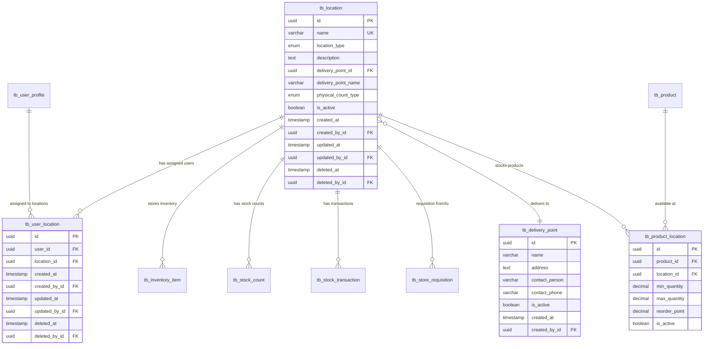

# Data Schema: Location Management

## Document Information
- **Module**: System Administration / Location Management
- **Version**: 1.0
- **Last Updated**: 2025-01-16
- **Status**: Active
- **Database**: PostgreSQL 15+
- **ORM**: Prisma 5.x

## Schema Overview

Location Management uses 4 core tables and 2 enum types to manage physical and logical inventory locations across the hospitality organization.

## Core Tables

### 1. tb_location

**Purpose**: Main location master table storing location details and configuration

**Table Structure**:

```sql
CREATE TABLE tb_location (
  id UUID PRIMARY KEY DEFAULT gen_random_uuid(),
  name VARCHAR UNIQUE NOT NULL,
  location_type enum_location_type DEFAULT 'inventory' NOT NULL,
  description TEXT,
  delivery_point_id UUID REFERENCES tb_delivery_point(id),
  delivery_point_name VARCHAR,
  physical_count_type enum_physical_count_type DEFAULT 'no' NOT NULL,
  is_active BOOLEAN DEFAULT true,

  -- Audit fields
  created_at TIMESTAMP DEFAULT CURRENT_TIMESTAMP NOT NULL,
  created_by_id UUID REFERENCES tb_user_profile(id),
  updated_at TIMESTAMP DEFAULT CURRENT_TIMESTAMP NOT NULL,
  updated_by_id UUID REFERENCES tb_user_profile(id),
  deleted_at TIMESTAMP,
  deleted_by_id UUID REFERENCES tb_user_profile(id)
);
```

**Prisma Schema**:

```prisma
model tb_location {
  id                  String                   @id @default(dbgenerated("gen_random_uuid()")) @db.Uuid
  name                String                   @unique @db.VarChar
  location_type       enum_location_type       @default(inventory)
  description         String?
  delivery_point_id   String?                  @db.Uuid
  delivery_point_name String?                  @db.VarChar
  physical_count_type enum_physical_count_type @default(no)
  is_active           Boolean?                 @default(true)

  created_at          DateTime                 @default(now()) @db.Timestamp(6)
  created_by_id       String?                  @db.Uuid
  updated_at          DateTime                 @default(now()) @db.Timestamp(6)
  updated_by_id       String?                  @db.Uuid
  deleted_at          DateTime?                @db.Timestamp(6)
  deleted_by_id       String?                  @db.Uuid

  // Relations
  delivery_point      tb_delivery_point?       @relation(fields: [delivery_point_id], references: [id])
  created_by          tb_user_profile?         @relation("location_created_by", fields: [created_by_id], references: [id])
  updated_by          tb_user_profile?         @relation("location_updated_by", fields: [updated_by_id], references: [id])
  deleted_by          tb_user_profile?         @relation("location_deleted_by", fields: [deleted_by_id], references: [id])

  user_locations      tb_user_location[]
  inventory_items     tb_inventory_item[]
  stock_counts        tb_stock_count[]
  stock_transactions  tb_stock_transaction[]
  requisitions_from   tb_store_requisition[]   @relation("requisition_from_location")
  requisitions_to     tb_store_requisition[]   @relation("requisition_to_location")
}
```

**Field Specifications**:

| Field | Type | Constraints | Description |
|-------|------|-------------|-------------|
| id | UUID | PK, NOT NULL | Unique identifier |
| name | VARCHAR | UNIQUE, NOT NULL | Location name (e.g., "New York Central Kitchen") |
| location_type | ENUM | NOT NULL, DEFAULT 'inventory' | Location type: inventory, direct, consignment |
| description | TEXT | NULL | Optional location description |
| delivery_point_id | UUID | FK, NULL | Reference to tb_delivery_point |
| delivery_point_name | VARCHAR | NULL | Denormalized delivery point name |
| physical_count_type | ENUM | NOT NULL, DEFAULT 'no' | Whether physical counts required: yes, no |
| is_active | BOOLEAN | DEFAULT true | Active status |
| created_at | TIMESTAMP | NOT NULL | Creation timestamp |
| created_by_id | UUID | FK | User who created the record |
| updated_at | TIMESTAMP | NOT NULL | Last update timestamp |
| updated_by_id | UUID | FK | User who last updated |
| deleted_at | TIMESTAMP | NULL | Soft delete timestamp |
| deleted_by_id | UUID | FK | User who deleted |

**Indexes**:

```sql
CREATE INDEX idx_location_name ON tb_location(name);
CREATE INDEX idx_location_type ON tb_location(location_type);
CREATE INDEX idx_location_active ON tb_location(is_active);
CREATE INDEX idx_location_delivery_point ON tb_location(delivery_point_id);
CREATE INDEX idx_location_deleted ON tb_location(deleted_at) WHERE deleted_at IS NULL;
```

### 2. tb_user_location

**Purpose**: Junction table linking users to locations for access control

**Table Structure**:

```sql
CREATE TABLE tb_user_location (
  id UUID PRIMARY KEY DEFAULT gen_random_uuid(),
  user_id UUID NOT NULL REFERENCES tb_user_profile(id),
  location_id UUID NOT NULL REFERENCES tb_location(id),

  -- Audit fields
  created_at TIMESTAMP DEFAULT CURRENT_TIMESTAMP NOT NULL,
  created_by_id UUID REFERENCES tb_user_profile(id),
  updated_at TIMESTAMP DEFAULT CURRENT_TIMESTAMP NOT NULL,
  updated_by_id UUID REFERENCES tb_user_profile(id),
  deleted_at TIMESTAMP,
  deleted_by_id UUID REFERENCES tb_user_profile(id),

  UNIQUE(user_id, location_id)
);
```

**Prisma Schema**:

```prisma
model tb_user_location {
  id            String           @id @default(dbgenerated("gen_random_uuid()")) @db.Uuid
  user_id       String           @db.Uuid
  location_id   String           @db.Uuid

  created_at    DateTime         @default(now()) @db.Timestamp(6)
  created_by_id String?          @db.Uuid
  updated_at    DateTime         @default(now()) @db.Timestamp(6)
  updated_by_id String?          @db.Uuid
  deleted_at    DateTime?        @db.Timestamp(6)
  deleted_by_id String?          @db.Uuid

  // Relations
  user          tb_user_profile  @relation(fields: [user_id], references: [id])
  location      tb_location      @relation(fields: [location_id], references: [id])
  created_by    tb_user_profile? @relation("user_location_created_by", fields: [created_by_id], references: [id])
  updated_by    tb_user_profile? @relation("user_location_updated_by", fields: [updated_by_id], references: [id])
  deleted_by    tb_user_profile? @relation("user_location_deleted_by", fields: [deleted_by_id], references: [id])

  @@unique([user_id, location_id])
}
```

**Field Specifications**:

| Field | Type | Constraints | Description |
|-------|------|-------------|-------------|
| id | UUID | PK, NOT NULL | Unique identifier |
| user_id | UUID | FK, NOT NULL | Reference to tb_user_profile |
| location_id | UUID | FK, NOT NULL | Reference to tb_location |
| created_at | TIMESTAMP | NOT NULL | Assignment timestamp |
| created_by_id | UUID | FK | User who created assignment |
| updated_at | TIMESTAMP | NOT NULL | Last update timestamp |
| updated_by_id | UUID | FK | User who last updated |
| deleted_at | TIMESTAMP | NULL | Soft delete timestamp |
| deleted_by_id | UUID | FK | User who removed assignment |

**Indexes**:

```sql
CREATE INDEX idx_user_location_user ON tb_user_location(user_id);
CREATE INDEX idx_user_location_location ON tb_user_location(location_id);
CREATE UNIQUE INDEX idx_user_location_unique ON tb_user_location(user_id, location_id) WHERE deleted_at IS NULL;
```

### 3. tb_delivery_point

**Purpose**: Delivery addresses and contact information for locations

**Table Structure**:

```sql
CREATE TABLE tb_delivery_point (
  id UUID PRIMARY KEY DEFAULT gen_random_uuid(),
  name VARCHAR NOT NULL,
  address TEXT,
  contact_person VARCHAR,
  contact_phone VARCHAR,
  is_active BOOLEAN DEFAULT true,

  -- Audit fields
  created_at TIMESTAMP DEFAULT CURRENT_TIMESTAMP NOT NULL,
  created_by_id UUID REFERENCES tb_user_profile(id),
  updated_at TIMESTAMP DEFAULT CURRENT_TIMESTAMP NOT NULL,
  updated_by_id UUID REFERENCES tb_user_profile(id),
  deleted_at TIMESTAMP,
  deleted_by_id UUID REFERENCES tb_user_profile(id)
);
```

**Prisma Schema**:

```prisma
model tb_delivery_point {
  id              String           @id @default(dbgenerated("gen_random_uuid()")) @db.Uuid
  name            String           @db.VarChar
  address         String?
  contact_person  String?          @db.VarChar
  contact_phone   String?          @db.VarChar
  is_active       Boolean?         @default(true)

  created_at      DateTime         @default(now()) @db.Timestamp(6)
  created_by_id   String?          @db.Uuid
  updated_at      DateTime         @default(now()) @db.Timestamp(6)
  updated_by_id   String?          @db.Uuid
  deleted_at      DateTime?        @db.Timestamp(6)
  deleted_by_id   String?          @db.Uuid

  // Relations
  locations       tb_location[]
  created_by      tb_user_profile? @relation("delivery_point_created_by", fields: [created_by_id], references: [id])
  updated_by      tb_user_profile? @relation("delivery_point_updated_by", fields: [updated_by_id], references: [id])
  deleted_by      tb_user_profile? @relation("delivery_point_deleted_by", fields: [deleted_by_id], references: [id])
}
```

**Field Specifications**:

| Field | Type | Constraints | Description |
|-------|------|-------------|-------------|
| id | UUID | PK, NOT NULL | Unique identifier |
| name | VARCHAR | NOT NULL | Delivery point name |
| address | TEXT | NULL | Full delivery address |
| contact_person | VARCHAR | NULL | Contact person name |
| contact_phone | VARCHAR | NULL | Contact phone number |
| is_active | BOOLEAN | DEFAULT true | Active status |

### 4. tb_product_location (Future)

**Purpose**: Junction table for product-location assignments with min/max levels

**Planned Structure**:

```sql
CREATE TABLE tb_product_location (
  id UUID PRIMARY KEY DEFAULT gen_random_uuid(),
  product_id UUID NOT NULL REFERENCES tb_product(id),
  location_id UUID NOT NULL REFERENCES tb_location(id),
  min_quantity DECIMAL(15, 5),
  max_quantity DECIMAL(15, 5),
  reorder_point DECIMAL(15, 5),
  is_active BOOLEAN DEFAULT true,

  -- Audit fields
  created_at TIMESTAMP DEFAULT CURRENT_TIMESTAMP NOT NULL,
  created_by_id UUID REFERENCES tb_user_profile(id),
  updated_at TIMESTAMP DEFAULT CURRENT_TIMESTAMP NOT NULL,
  updated_by_id UUID REFERENCES tb_user_profile(id),
  deleted_at TIMESTAMP,
  deleted_by_id UUID REFERENCES tb_user_profile(id),

  UNIQUE(product_id, location_id)
);
```

## Enum Types

### enum_location_type

**Purpose**: Classify locations by inventory handling behavior

**Values**:

```sql
CREATE TYPE enum_location_type AS ENUM (
  'inventory',    -- Standard warehouse/storage with full inventory tracking
  'direct',       -- Direct consumption (kitchen, production) - bypass stock-in
  'consignment'   -- Consignment stock (vendor-owned until consumed)
);
```

**Enum Definition**:

```prisma
enum enum_location_type {
  inventory
  direct
  consignment
}
```

**Usage Matrix**:

| Type | Stock-In Required | Inventory Tracking | Ownership | Use Case |
|------|------------------|-------------------|-----------|----------|
| inventory | Yes | Full | Company | Warehouses, storage areas, central kitchens |
| direct | No | Consumption only | Company | Production kitchens, direct-use areas |
| consignment | Yes | Full | Vendor until consumed | Vendor-managed inventory |

### enum_physical_count_type

**Purpose**: Determine if location requires physical inventory counts

**Values**:

```sql
CREATE TYPE enum_physical_count_type AS ENUM (
  'yes',  -- Location requires periodic physical counts
  'no'    -- Location excluded from physical count schedules
);
```

**Enum Definition**:

```prisma
enum enum_physical_count_type {
  no
  yes
}
```

**Business Rules**:
- Locations with `physical_count_type = yes` appear in stock count schedules
- Locations with `physical_count_type = no` cannot be selected for physical counts
- Direct-type locations typically set to 'no' (consumption tracking only)
- Inventory and consignment types typically set to 'yes'

## Entity Relationship Diagram



## Query Patterns

### 1. List Active Locations

**Purpose**: Retrieve all active locations for dropdown and list views

**SQL**:
```sql
SELECT
  id,
  name,
  location_type,
  physical_count_type,
  delivery_point_name,
  is_active
FROM tb_location
WHERE deleted_at IS NULL
  AND is_active = true
ORDER BY name ASC;
```

**Prisma**:
```typescript
const locations = await prisma.tb_location.findMany({
  where: {
    deleted_at: null,
    is_active: true
  },
  select: {
    id: true,
    name: true,
    location_type: true,
    physical_count_type: true,
    delivery_point_name: true,
    is_active: true
  },
  orderBy: {
    name: 'asc'
  }
})
```

### 2. Get Location with Delivery Point

**Purpose**: Fetch location details including delivery point information

**SQL**:
```sql
SELECT
  l.*,
  d.name as delivery_point_full_name,
  d.address,
  d.contact_person,
  d.contact_phone
FROM tb_location l
LEFT JOIN tb_delivery_point d ON l.delivery_point_id = d.id
WHERE l.id = $1
  AND l.deleted_at IS NULL;
```

**Prisma**:
```typescript
const location = await prisma.tb_location.findUnique({
  where: { id: locationId },
  include: {
    delivery_point: {
      select: {
        name: true,
        address: true,
        contact_person: true,
        contact_phone: true
      }
    }
  }
})
```

### 3. Get Users Assigned to Location

**Purpose**: Retrieve all users with access to a specific location

**SQL**:
```sql
SELECT
  u.id,
  u.name,
  u.email,
  ul.created_at as assigned_at
FROM tb_user_location ul
INNER JOIN tb_user_profile u ON ul.user_id = u.id
WHERE ul.location_id = $1
  AND ul.deleted_at IS NULL
  AND u.deleted_at IS NULL
ORDER BY u.name ASC;
```

**Prisma**:
```typescript
const userLocations = await prisma.tb_user_location.findMany({
  where: {
    location_id: locationId,
    deleted_at: null,
    user: {
      deleted_at: null
    }
  },
  include: {
    user: {
      select: {
        id: true,
        name: true,
        email: true
      }
    }
  },
  orderBy: {
    user: {
      name: 'asc'
    }
  }
})
```

### 4. Get Locations for User

**Purpose**: Retrieve all locations accessible by a specific user

**SQL**:
```sql
SELECT
  l.id,
  l.name,
  l.location_type,
  l.is_active
FROM tb_user_location ul
INNER JOIN tb_location l ON ul.location_id = l.id
WHERE ul.user_id = $1
  AND ul.deleted_at IS NULL
  AND l.deleted_at IS NULL
  AND l.is_active = true
ORDER BY l.name ASC;
```

**Prisma**:
```typescript
const userLocations = await prisma.tb_user_location.findMany({
  where: {
    user_id: userId,
    deleted_at: null,
    location: {
      deleted_at: null,
      is_active: true
    }
  },
  include: {
    location: {
      select: {
        id: true,
        name: true,
        location_type: true,
        is_active: true
      }
    }
  },
  orderBy: {
    location: {
      name: 'asc'
    }
  }
})
```

### 5. Search Locations

**Purpose**: Full-text search across location name and code

**SQL**:
```sql
SELECT *
FROM tb_location
WHERE deleted_at IS NULL
  AND (
    name ILIKE '%' || $1 || '%' OR
    location_type::text ILIKE '%' || $1 || '%'
  )
ORDER BY name ASC
LIMIT $2 OFFSET $3;
```

**Prisma**:
```typescript
const locations = await prisma.tb_location.findMany({
  where: {
    deleted_at: null,
    OR: [
      { name: { contains: searchTerm, mode: 'insensitive' } },
      { location_type: { equals: searchTerm as enum_location_type } }
    ]
  },
  orderBy: { name: 'asc' },
  take: pageSize,
  skip: (page - 1) * pageSize
})
```

### 6. Filter Locations by Type

**Purpose**: Get all locations of a specific type

**SQL**:
```sql
SELECT *
FROM tb_location
WHERE deleted_at IS NULL
  AND location_type = $1
  AND is_active = $2
ORDER BY name ASC;
```

**Prisma**:
```typescript
const locations = await prisma.tb_location.findMany({
  where: {
    deleted_at: null,
    location_type: locationType,
    is_active: true
  },
  orderBy: { name: 'asc' }
})
```

### 7. Get Locations for Physical Count

**Purpose**: Retrieve locations that require physical inventory counts

**SQL**:
```sql
SELECT *
FROM tb_location
WHERE deleted_at IS NULL
  AND is_active = true
  AND physical_count_type = 'yes'
ORDER BY name ASC;
```

**Prisma**:
```typescript
const countLocations = await prisma.tb_location.findMany({
  where: {
    deleted_at: null,
    is_active: true,
    physical_count_type: 'yes'
  },
  orderBy: { name: 'asc' }
})
```

### 8. Check Location Has Active Stock

**Purpose**: Validate if location can be deleted (no active inventory)

**SQL**:
```sql
SELECT EXISTS (
  SELECT 1
  FROM tb_inventory_item
  WHERE location_id = $1
    AND quantity_on_hand > 0
    AND deleted_at IS NULL
) as has_stock;
```

**Prisma**:
```typescript
const hasStock = await prisma.tb_inventory_item.count({
  where: {
    location_id: locationId,
    quantity_on_hand: { gt: 0 },
    deleted_at: null
  }
}) > 0
```

### 9. Bulk Assign Users to Location

**Purpose**: Assign multiple users to a location in a single transaction

**SQL**:
```sql
INSERT INTO tb_user_location (user_id, location_id, created_by_id)
VALUES
  ($1, $2, $3),
  ($4, $2, $3),
  ($5, $2, $3)
ON CONFLICT (user_id, location_id)
WHERE deleted_at IS NULL
DO NOTHING;
```

**Prisma**:
```typescript
await prisma.tb_user_location.createMany({
  data: userIds.map(userId => ({
    user_id: userId,
    location_id: locationId,
    created_by_id: currentUserId
  })),
  skipDuplicates: true
})
```

### 10. Soft Delete Location

**Purpose**: Mark location as deleted while preserving data

**SQL**:
```sql
UPDATE tb_location
SET
  deleted_at = CURRENT_TIMESTAMP,
  deleted_by_id = $2,
  updated_at = CURRENT_TIMESTAMP,
  updated_by_id = $2
WHERE id = $1
  AND deleted_at IS NULL;
```

**Prisma**:
```typescript
await prisma.tb_location.update({
  where: { id: locationId },
  data: {
    deleted_at: new Date(),
    deleted_by_id: currentUserId,
    updated_at: new Date(),
    updated_by_id: currentUserId
  }
})
```

## Data Constraints

### Business Rules

1. **Unique Location Name**
   ```sql
   ALTER TABLE tb_location ADD CONSTRAINT unique_location_name
   UNIQUE (name) WHERE deleted_at IS NULL;
   ```

2. **Valid Location Type**
   - Must be one of: inventory, direct, consignment
   - Enforced by enum type

3. **Active Delivery Point**
   ```sql
   ALTER TABLE tb_location ADD CONSTRAINT check_active_delivery_point
   CHECK (
     delivery_point_id IS NULL OR
     EXISTS (
       SELECT 1 FROM tb_delivery_point d
       WHERE d.id = delivery_point_id
       AND d.is_active = true
       AND d.deleted_at IS NULL
     )
   );
   ```

4. **User-Location Uniqueness**
   ```sql
   CREATE UNIQUE INDEX idx_user_location_active_unique
   ON tb_user_location(user_id, location_id)
   WHERE deleted_at IS NULL;
   ```

5. **Cannot Delete with Stock**
   - Enforced in application logic (not database constraint)
   - Check `tb_inventory_item.quantity_on_hand > 0`

### Referential Integrity

**Foreign Keys**:
```sql
ALTER TABLE tb_location
  ADD CONSTRAINT fk_location_delivery_point
  FOREIGN KEY (delivery_point_id)
  REFERENCES tb_delivery_point(id)
  ON DELETE SET NULL;

ALTER TABLE tb_location
  ADD CONSTRAINT fk_location_created_by
  FOREIGN KEY (created_by_id)
  REFERENCES tb_user_profile(id)
  ON DELETE SET NULL;

ALTER TABLE tb_user_location
  ADD CONSTRAINT fk_user_location_user
  FOREIGN KEY (user_id)
  REFERENCES tb_user_profile(id)
  ON DELETE CASCADE;

ALTER TABLE tb_user_location
  ADD CONSTRAINT fk_user_location_location
  FOREIGN KEY (location_id)
  REFERENCES tb_location(id)
  ON DELETE CASCADE;
```

## Data Migration Considerations

### Initial Data Load

**Sample Locations**:
```sql
INSERT INTO tb_location (name, location_type, physical_count_type, is_active)
VALUES
  ('Central Kitchen', 'inventory', 'yes', true),
  ('Main Warehouse', 'inventory', 'yes', true),
  ('Production Area', 'direct', 'no', true),
  ('Vendor Consignment', 'consignment', 'yes', true);
```

### Migration Scripts

**Add Location Code Field** (if needed):
```sql
ALTER TABLE tb_location ADD COLUMN code VARCHAR(10);
CREATE UNIQUE INDEX idx_location_code ON tb_location(code) WHERE deleted_at IS NULL;

-- Backfill existing records
UPDATE tb_location
SET code = CONCAT('LOC', LPAD(ROW_NUMBER() OVER (ORDER BY created_at)::TEXT, 4, '0'))
WHERE code IS NULL;

ALTER TABLE tb_location ALTER COLUMN code SET NOT NULL;
```

**Denormalize Delivery Point Name**:
```sql
-- Already exists in schema
UPDATE tb_location l
SET delivery_point_name = d.name
FROM tb_delivery_point d
WHERE l.delivery_point_id = d.id
  AND l.delivery_point_name IS NULL;
```

## Performance Considerations

### Index Strategy

**Essential Indexes**:
- Primary key on `id` (automatic)
- Unique index on `name` (for constraint)
- Index on `location_type` (frequent filtering)
- Index on `is_active` (frequent filtering)
- Composite index on `(user_id, location_id)` in tb_user_location

**Partial Indexes**:
```sql
-- Index only non-deleted records
CREATE INDEX idx_location_active_not_deleted
ON tb_location(is_active)
WHERE deleted_at IS NULL;

-- Index for physical count locations
CREATE INDEX idx_location_physical_count
ON tb_location(physical_count_type)
WHERE deleted_at IS NULL AND physical_count_type = 'yes';
```

### Query Optimization

**Use Covering Indexes**:
```sql
CREATE INDEX idx_location_list_view
ON tb_location(name, location_type, is_active)
WHERE deleted_at IS NULL;
```

**Materialized Views** (for reporting):
```sql
CREATE MATERIALIZED VIEW mv_location_summary AS
SELECT
  l.id,
  l.name,
  l.location_type,
  COUNT(DISTINCT ul.user_id) as user_count,
  COUNT(DISTINCT ii.product_id) as product_count,
  SUM(ii.quantity_on_hand) as total_stock
FROM tb_location l
LEFT JOIN tb_user_location ul ON l.id = ul.location_id AND ul.deleted_at IS NULL
LEFT JOIN tb_inventory_item ii ON l.id = ii.location_id AND ii.deleted_at IS NULL
WHERE l.deleted_at IS NULL
GROUP BY l.id, l.name, l.location_type;

REFRESH MATERIALIZED VIEW mv_location_summary;
```

## Data Archival Strategy

### Soft Delete Policy

**Retention Period**: 7 years (compliance requirement)

**Archival Process**:
1. Records soft-deleted (`deleted_at` set)
2. Remain in main table for 90 days (quick restore)
3. After 90 days, move to `tb_location_archive` table
4. After 7 years, permanently delete from archive

**Archive Table**:
```sql
CREATE TABLE tb_location_archive (
  LIKE tb_location INCLUDING ALL
);

-- Move old deletions to archive
INSERT INTO tb_location_archive
SELECT * FROM tb_location
WHERE deleted_at < CURRENT_DATE - INTERVAL '90 days';

DELETE FROM tb_location
WHERE deleted_at < CURRENT_DATE - INTERVAL '90 days';
```

## Security Considerations

### Row-Level Security (RLS)

**Supabase RLS Policies**:

```sql
-- Users can view locations they are assigned to
CREATE POLICY location_select_policy ON tb_location
  FOR SELECT USING (
    id IN (
      SELECT location_id
      FROM tb_user_location
      WHERE user_id = auth.uid()
      AND deleted_at IS NULL
    ) OR
    EXISTS (
      SELECT 1 FROM tb_user_profile
      WHERE id = auth.uid()
      AND role IN ('admin', 'operations_manager')
    )
  );

-- Only admins can insert locations
CREATE POLICY location_insert_policy ON tb_location
  FOR INSERT WITH CHECK (
    EXISTS (
      SELECT 1 FROM tb_user_profile
      WHERE id = auth.uid()
      AND role IN ('admin', 'operations_manager')
    )
  );

-- Users can update locations they have access to
CREATE POLICY location_update_policy ON tb_location
  FOR UPDATE USING (
    id IN (
      SELECT location_id
      FROM tb_user_location
      WHERE user_id = auth.uid()
      AND deleted_at IS NULL
    ) AND
    EXISTS (
      SELECT 1 FROM tb_user_profile
      WHERE id = auth.uid()
      AND role IN ('admin', 'operations_manager', 'store_manager')
    )
  );

-- Only admins can soft-delete locations
CREATE POLICY location_delete_policy ON tb_location
  FOR UPDATE USING (
    EXISTS (
      SELECT 1 FROM tb_user_profile
      WHERE id = auth.uid()
      AND role = 'admin'
    )
  );
```

### Data Encryption

**Sensitive Fields** (if applicable):
- None currently (location data is not sensitive)
- Future: Delivery addresses may need encryption in regulated industries

### Audit Trail

All tables include full audit trail:
- `created_at`, `created_by_id`
- `updated_at`, `updated_by_id`
- `deleted_at`, `deleted_by_id`

**Trigger for automatic updated_at**:
```sql
CREATE OR REPLACE FUNCTION update_updated_at_column()
RETURNS TRIGGER AS $$
BEGIN
  NEW.updated_at = CURRENT_TIMESTAMP;
  RETURN NEW;
END;
$$ language 'plpgsql';

CREATE TRIGGER update_location_updated_at
BEFORE UPDATE ON tb_location
FOR EACH ROW
EXECUTE FUNCTION update_updated_at_column();
```

## Data Validation

### Database-Level Validation

```sql
ALTER TABLE tb_location
  ADD CONSTRAINT check_name_not_empty
  CHECK (LENGTH(TRIM(name)) > 0);

ALTER TABLE tb_location
  ADD CONSTRAINT check_positive_deleted_sequence
  CHECK (deleted_at IS NULL OR deleted_at >= created_at);
```

### Application-Level Validation

See VAL-location-management.md for complete validation rules.
