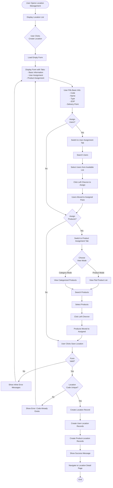
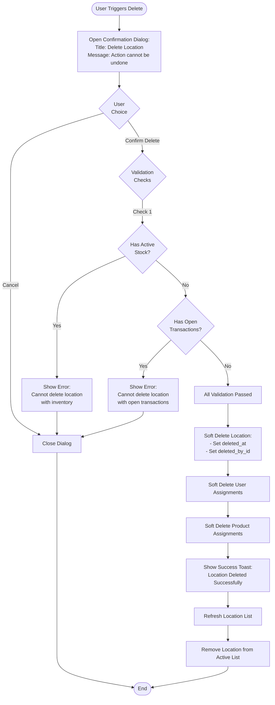
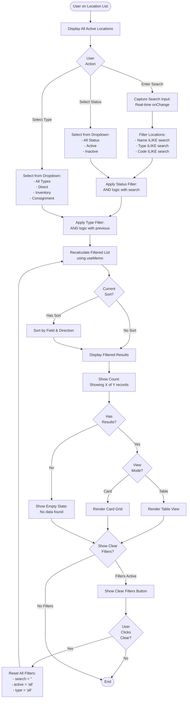
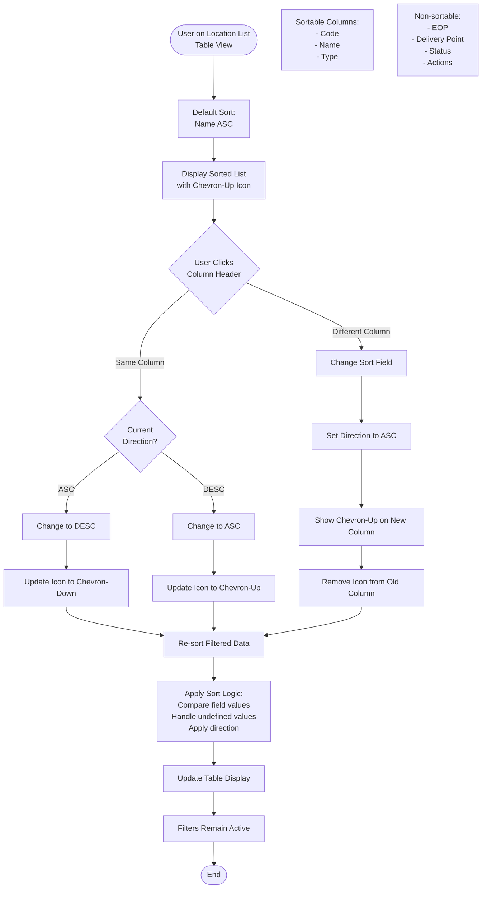
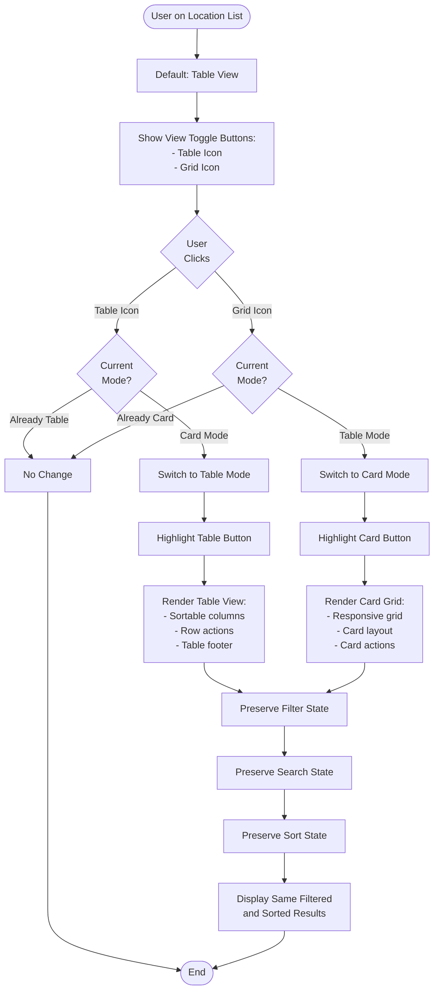

# Flow Diagrams: Location Management

## Document Information
- **Module**: System Administration / Location Management
- **Version**: 1.0
- **Last Updated**: 2025-01-16
- **Status**: Active

## Overview

This document provides comprehensive flow diagrams for all Location Management workflows using Mermaid notation. Each diagram illustrates the complete user journey, system interactions, and decision points.

---

## FD-001: Create Location Flow



---

## FD-002: Edit Location Flow

```mermaid
flowchart TD
    Start([User on Location List/Detail]) --> Action{Edit<br/>Action}
    Action -->|From List| ClickEditList[Click Edit Icon in Row]
    Action -->|From Detail| ClickEditDetail[Click Edit Button]

    ClickEditList --> LoadLocation[Fetch Location Data]
    ClickEditDetail --> LoadLocation

    LoadLocation --> LoadAssignments[Load User & Product Assignments]
    LoadAssignments --> DisplayForm[Display Pre-filled Form:<br/>- Basic Info (Code disabled)<br/>- Current User Assignments<br/>- Current Product Assignments]

    DisplayForm --> ModifyFields{User<br/>Modifies<br/>Fields?}

    ModifyFields -->|Basic Info| UpdateBasic[Update Name, Type, EOP,<br/>Delivery Point, Active Status]
    UpdateBasic --> ModifyUsers

    ModifyFields -->|User Assignments| ModifyUsers{Modify<br/>Users?}
    ModifyUsers -->|Add| AddUsers[Select Users from Available]
    AddUsers --> ClickAssign[Click Left Chevron]
    ClickAssign --> UsersAdded[Users Added to Assigned]
    UsersAdded --> ModifyProducts

    ModifyUsers -->|Remove| RemoveUsers[Select Users from Assigned]
    RemoveUsers --> ClickRemove[Click Right Chevron]
    ClickRemove --> UsersRemoved[Users Removed]
    UsersRemoved --> ModifyProducts

    ModifyUsers -->|No Change| ModifyProducts

    ModifyProducts{Modify<br/>Products?}
    ModifyProducts -->|Yes| UpdateProducts[Add/Remove Products<br/>via Dual-Pane Interface]
    UpdateProducts --> ClickSave

    ModifyProducts -->|No| ClickSave[User Clicks Save]

    ClickSave --> ValidateChanges{Form<br/>Valid?}
    ValidateChanges -->|No| ShowErrors[Show Validation Errors]
    ShowErrors --> DisplayForm

    ValidateChanges -->|Yes| CheckConstraints{Has Active<br/>Transactions?}
    CheckConstraints -->|Yes - Type Change| RestrictFields[Block Type/Active Changes<br/>Show Warning]
    RestrictFields --> AllowOtherChanges[Allow Other Modifications]
    AllowOtherChanges --> UpdateRecord

    CheckConstraints -->|No| UpdateRecord[Update Location Record]
    UpdateRecord --> UpdateUserLinks[Update User-Location Records:<br/>- Delete removed assignments<br/>- Create new assignments]
    UpdateUserLinks --> UpdateProductLinks[Update Product-Location Records]
    UpdateProductLinks --> UpdateAudit[Update Audit Fields:<br/>- updated_at<br/>- updated_by_id]
    UpdateAudit --> ShowSuccess[Show Success Message]
    ShowSuccess --> RefreshDetail[Refresh Location Detail Page]
    RefreshDetail --> End([End])
```

---

## FD-003: View Location Detail Flow

```mermaid
flowchart TD
    Start([User on Location List]) --> SearchFilter{Search/<br/>Filter?}
    SearchFilter -->|Yes| EnterSearch[Enter Search Term]
    EnterSearch --> ApplyFilters[Apply Status/Type Filters]
    ApplyFilters --> ShowResults[Show Filtered Results]
    ShowResults --> ClickView

    SearchFilter -->|No| ClickView[Click View Icon for Location]

    ClickView --> FetchLocation[Fetch Location Data]
    FetchLocation --> FetchUsers[Fetch Assigned Users]
    FetchUsers --> FetchProducts[Fetch Assigned Products (Future)]
    FetchProducts --> DisplayDetail[Display Location Detail Page]

    DisplayDetail --> ShowBasicCard[Card 1: Basic Information<br/>- Code<br/>- Name<br/>- Type Badge<br/>- Status Badge]
    ShowBasicCard --> ShowDeliveryCard[Card 2: Delivery Information<br/>- Physical Count Required<br/>- Delivery Point]
    ShowDeliveryCard --> ShowUsersCard{Has<br/>Assigned<br/>Users?}

    ShowUsersCard -->|Yes| DisplayUsers[Card 3: Assigned Users<br/>- User Count<br/>- Avatar Grid<br/>- Name, Email per User]
    ShowUsersCard -->|No| EmptyUsers[Card 3: No Users Assigned]

    DisplayUsers --> ShowActions
    EmptyUsers --> ShowActions[Show Action Buttons:<br/>- Back<br/>- Edit<br/>- Delete]

    ShowActions --> UserAction{User<br/>Action}
    UserAction -->|Back| GoBack[Navigate to Location List]
    GoBack --> End([End])

    UserAction -->|Edit| NavigateEdit[Navigate to Edit Page]
    NavigateEdit --> End

    UserAction -->|Delete| TriggerDelete[Trigger Delete Flow]
    TriggerDelete --> DeleteDialog

    UserAction -->|None| End

    DeleteDialog[See FD-004 Delete Flow]
```

---

## FD-004: Delete Location Flow



---

## FD-005: Search and Filter Flow



---

## FD-006: Sort Location List Flow



---

## FD-007: Toggle View Mode Flow



---

## FD-008: Assign Users to Location Flow

```mermaid
flowchart TD
    Start([User on Location Edit Form]) --> ClickUserTab[Click User Assignment Tab]
    ClickUserTab --> LoadInterface[Load Dual-Pane Interface]

    LoadInterface --> SplitUsers[Split Users:<br/>- Assigned (left pane)<br/>- Available (right pane)]
    SplitUsers --> DisplayPanes[Display Both Panes with:<br/>- Search fields<br/>- Select All checkboxes<br/>- User lists<br/>- Chevron buttons]

    DisplayPanes --> UserAction{User<br/>Action}

    UserAction -->|Search Available| SearchAvailable[Enter Search in Available Pane]
    SearchAvailable --> FilterAvailable[Filter by Name or Email<br/>Real-time onChange]
    FilterAvailable --> UpdateAvailableList[Update Available User List]
    UpdateAvailableList --> UserAction

    UserAction -->|Search Assigned| SearchAssigned[Enter Search in Assigned Pane]
    SearchAssigned --> FilterAssigned[Filter by Name or Email]
    FilterAssigned --> UpdateAssignedList[Update Assigned User List]
    UpdateAssignedList --> UserAction

    UserAction -->|Select Users| SelectFromAvailable[Click Checkboxes in Available]
    SelectFromAvailable --> HighlightSelected[Highlight Selected Users<br/>Blue Background]
    HighlightSelected --> EnableAssignButton[Enable Left Chevron Button]
    EnableAssignButton --> ClickAssign{Click<br/>Assign<br/>Button?}

    ClickAssign -->|Yes| MoveToAssigned[Move Selected Users to Assigned Pane]
    MoveToAssigned --> UpdateState[Update assignedUserIds State]
    UpdateState --> ClearSelection[Clear Selection]
    ClearSelection --> DisableButton[Disable Chevron Button]
    DisableButton --> UserAction

    ClickAssign -->|No| UserAction

    UserAction -->|Remove Users| SelectFromAssigned[Click Checkboxes in Assigned]
    SelectFromAssigned --> HighlightRemove[Highlight Selected Users]
    HighlightRemove --> EnableRemoveButton[Enable Right Chevron Button]
    EnableRemoveButton --> ClickRemove{Click<br/>Remove<br/>Button?}

    ClickRemove -->|Yes| MoveToAvailable[Move Selected Users to Available Pane]
    MoveToAvailable --> UpdateStateRemove[Update assignedUserIds State]
    UpdateStateRemove --> ClearSelectionRemove[Clear Selection]
    ClearSelectionRemove --> DisableRemoveButton[Disable Chevron Button]
    DisableRemoveButton --> UserAction

    ClickRemove -->|No| UserAction

    UserAction -->|Select All Available| ClickSelectAllAvail[Click Select All Checkbox]
    ClickSelectAllAvail --> SelectAllAvailable[Select All Filtered Users<br/>in Available Pane]
    SelectAllAvailable --> EnableAssignButton

    UserAction -->|Select All Assigned| ClickSelectAllAssigned[Click Select All Checkbox]
    ClickSelectAllAssigned --> SelectAllAssigned[Select All Filtered Users<br/>in Assigned Pane]
    SelectAllAssigned --> EnableRemoveButton

    UserAction -->|Save Form| SaveLocation[Save Location<br/>See FD-001 or FD-002]
    SaveLocation --> CreateUserRecords[Create tb_user_location Records<br/>for New Assignments]
    CreateUserRecords --> DeleteUserRecords[Soft Delete tb_user_location Records<br/>for Removed Assignments]
    DeleteUserRecords --> End([End])
```

---

## FD-009: Assign Products to Location Flow

```mermaid
flowchart TD
    Start([User on Location Edit Form]) --> ClickProductTab[Click Product Assignment Tab]
    ClickProductTab --> ShowModeToggle[Show View Mode Toggle:<br/>- Product Mode<br/>- Category Mode]

    ShowModeToggle --> DefaultMode[Default: Product Mode]
    DefaultMode --> LoadDualPane[Load Dual-Pane Interface]

    LoadDualPane --> ModeCheck{View<br/>Mode?}

    ModeCheck -->|Product Mode| DisplayProducts[Display Flat Product Lists:<br/>- Assigned (left)<br/>- Available (right)]
    DisplayProducts --> ProductInfo[Each Product Shows:<br/>- Product Code with Icon<br/>- Product Name<br/>- Category & Base Unit]
    ProductInfo --> ProductActions

    ModeCheck -->|Category Mode| DisplayCategories[Display Category Trees:<br/>- Expandable folders<br/>- Product count badges<br/>- Nested products]
    DisplayCategories --> CategoryActions[Category Actions:<br/>- Click to expand/collapse<br/>- Select products within]
    CategoryActions --> ProductActions

    ProductActions{User<br/>Action}

    ProductActions -->|Search| SearchProducts[Enter Search Term]
    SearchProducts --> FilterProducts[Filter by Code or Name]
    FilterProducts --> UpdateLists[Update Both Panes]
    UpdateLists --> ProductActions

    ProductActions -->|Switch Mode| ToggleMode{Current<br/>Mode?}
    ToggleMode -->|Product| SwitchToCategory[Switch to Category Mode]
    SwitchToCategory --> PreserveSelections1[Preserve Current Selections]
    PreserveSelections1 --> DisplayCategories

    ToggleMode -->|Category| SwitchToProduct[Switch to Product Mode]
    SwitchToProduct --> PreserveSelections2[Preserve Current Selections]
    PreserveSelections2 --> DisplayProducts

    ProductActions -->|Select Products| SelectAvailable[Click Product Checkboxes]
    SelectAvailable --> HighlightProducts[Highlight Selected<br/>Blue Background]
    HighlightProducts --> EnableAssign[Enable Left Chevron]
    EnableAssign --> ClickAssignProduct{Click<br/>Assign?}

    ClickAssignProduct -->|Yes| MoveProducts[Move to Assigned Pane]
    MoveProducts --> UpdateProductState[Update assignedProductIds]
    UpdateProductState --> ClearProductSelection[Clear Selection]
    ClearProductSelection --> ProductActions

    ClickAssignProduct -->|No| ProductActions

    ProductActions -->|Remove Products| SelectAssigned[Select from Assigned Pane]
    SelectAssigned --> EnableRemove[Enable Right Chevron]
    EnableRemove --> ClickRemoveProduct{Click<br/>Remove?}

    ClickRemoveProduct -->|Yes| MoveToAvailable[Move to Available Pane]
    MoveToAvailable --> UpdateRemoveState[Update assignedProductIds]
    UpdateRemoveState --> ProductActions

    ClickRemoveProduct -->|No| ProductActions

    ProductActions -->|Expand Category| CategoryMode{In Category<br/>Mode?}
    CategoryMode -->|Yes| ToggleExpand[Toggle Category Expansion]
    ToggleExpand --> ShowNested{Expanded?}
    ShowNested -->|Yes| DisplayNested[Show Nested Products]
    ShowNested -->|No| HideNested[Hide Nested Products]
    DisplayNested --> ProductActions
    HideNested --> ProductActions

    CategoryMode -->|No| ProductActions

    ProductActions -->|Save Form| SaveWithProducts[Save Location with Products]
    SaveWithProducts --> CreateProductLinks[Create Product-Location Records]
    CreateProductLinks --> End([End])
```

---

## FD-010: Permission Validation Flow

```mermaid
flowchart TD
    Start([User Attempts Action]) --> GetAction{Action<br/>Type}

    GetAction -->|View| CheckViewPerm{Has View<br/>Permission?}
    CheckViewPerm -->|Yes - All Users| AllowView[Display Location List/Detail]
    AllowView --> ApplyRLS[Apply Row-Level Security:<br/>Show only assigned locations<br/>(unless admin)]
    ApplyRLS --> DisplayFiltered[Display Filtered Results]
    DisplayFiltered --> End([End])

    CheckViewPerm -->|No| DenyAccess[Show Error: Access Denied]
    DenyAccess --> End

    GetAction -->|Create| CheckCreatePerm{Has Create<br/>Permission?}
    CheckCreatePerm -->|Yes - Ops Manager/Admin| AllowCreate[Show Create Form]
    AllowCreate --> End

    CheckCreatePerm -->|No| DenyAccess

    GetAction -->|Edit| CheckEditPerm{Has Edit<br/>Permission?}
    CheckEditPerm -->|Yes - Store Mgr/Ops/Admin| CheckLocationAccess{User Assigned<br/>to Location?}
    CheckLocationAccess -->|Yes| AllowEdit[Show Edit Form]
    AllowEdit --> End

    CheckLocationAccess -->|No - But Admin| AllowEdit
    CheckLocationAccess -->|No - Not Admin| DenyAccessLocation[Error: No access to location]
    DenyAccessLocation --> End

    CheckEditPerm -->|No| DenyAccess

    GetAction -->|Delete| CheckDeletePerm{Has Delete<br/>Permission?}
    CheckDeletePerm -->|Yes - Admin Only| CheckConstraints{Has Active<br/>Stock/Trans?}
    CheckConstraints -->|No| AllowDelete[Allow Deletion]
    AllowDelete --> End

    CheckConstraints -->|Yes| DenyConstraint[Error: Cannot delete]
    DenyConstraint --> End

    CheckDeletePerm -->|No| DenyAccess

    GetAction -->|Assign Users| CheckAssignPerm{Has Assign<br/>Permission?}
    CheckAssignPerm -->|Yes - Ops/Admin| AllowAssign[Allow User Assignment]
    AllowAssign --> End

    CheckAssignPerm -->|No| DenyAccess
```

---

## Workflow Summary

### Critical Paths

1. **Create Location**: FD-001 (7-12 steps depending on assignments)
2. **Edit Location**: FD-002 (6-10 steps depending on changes)
3. **View Details**: FD-003 (3-5 steps)
4. **Delete Location**: FD-004 (4-6 steps with validations)
5. **Search & Filter**: FD-005 (2-5 steps for each filter)

### Integration Points

**With User Management**:
- FD-008: User assignment workflow
- FD-010: Permission validation

**With Product Management**:
- FD-009: Product assignment workflow

**With Inventory Management**:
- FD-004: Stock validation before deletion

**With Procurement**:
- FD-001, FD-002: Delivery point configuration

### Error Handling Flows

All flows include error handling for:
- Validation errors (inline display)
- Network errors (toast notifications)
- Permission errors (access denial)
- Business rule violations (constraint errors)
