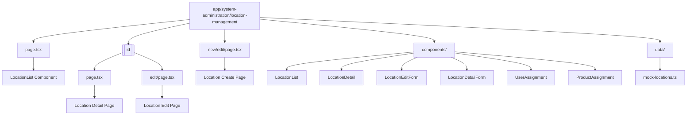
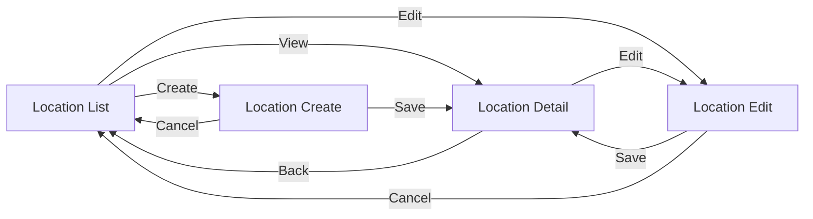
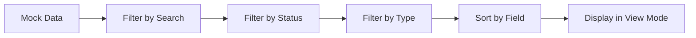
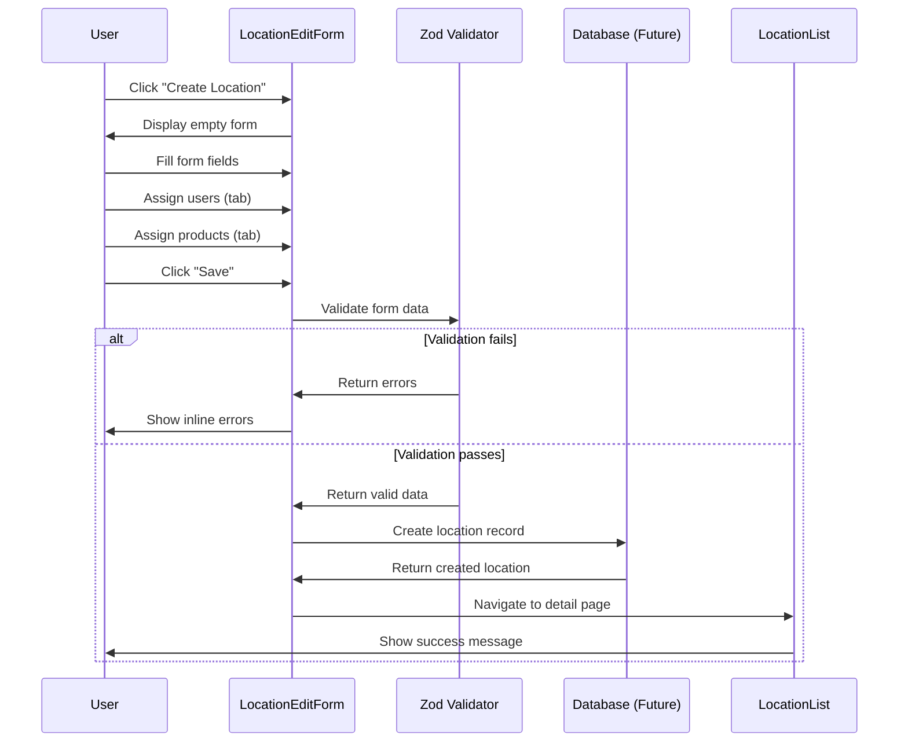
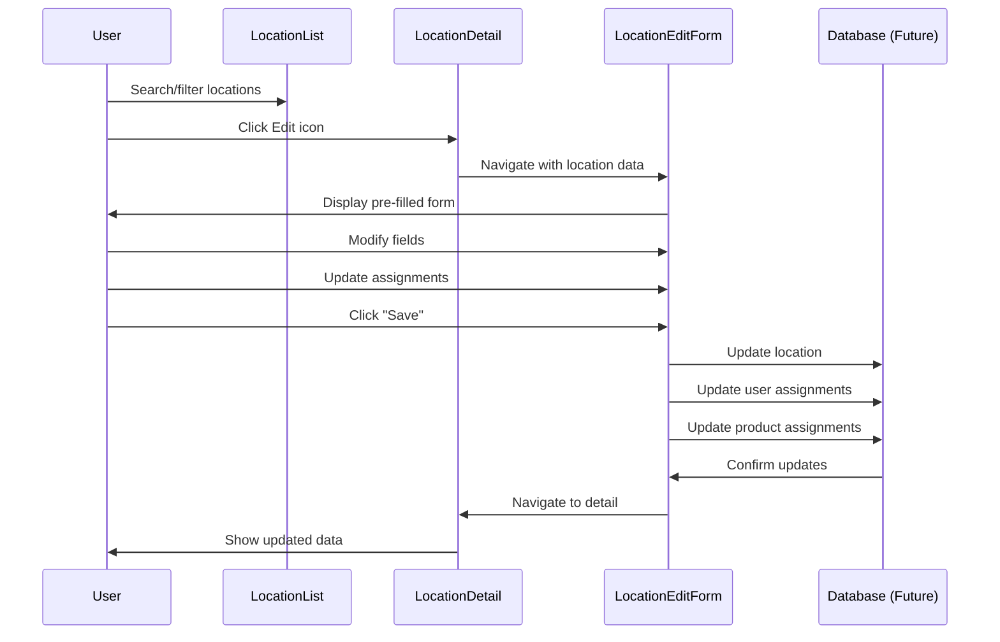
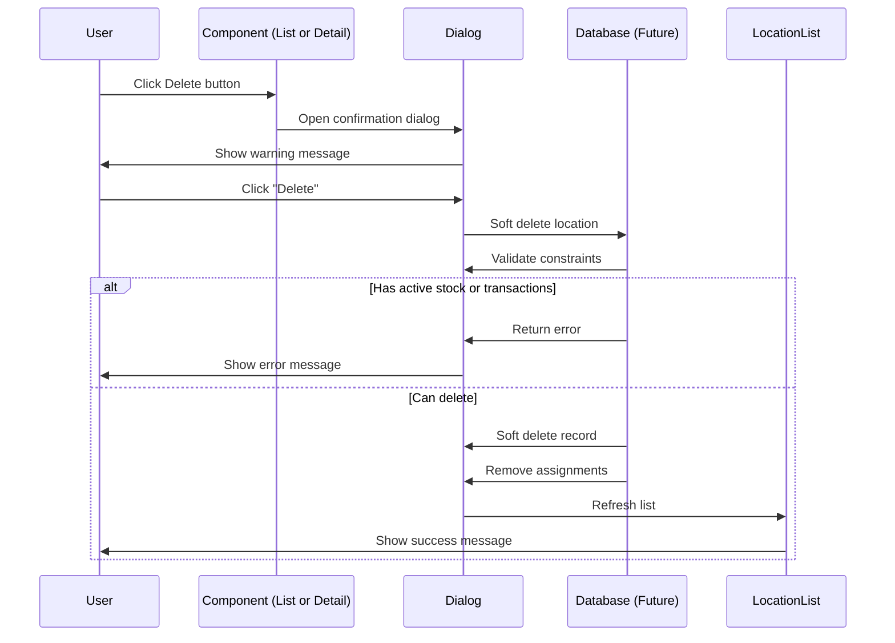
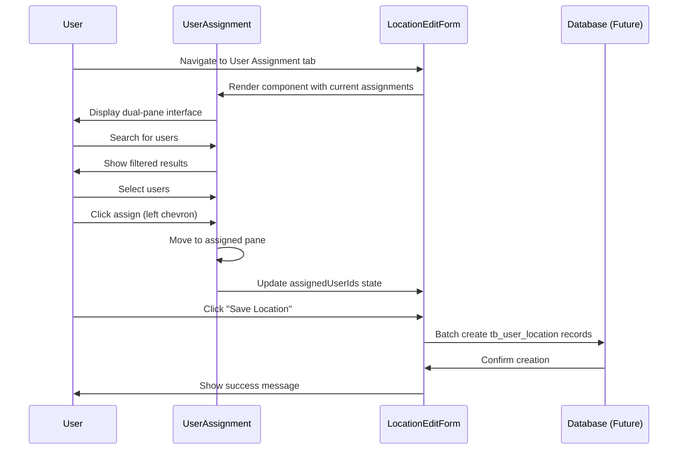
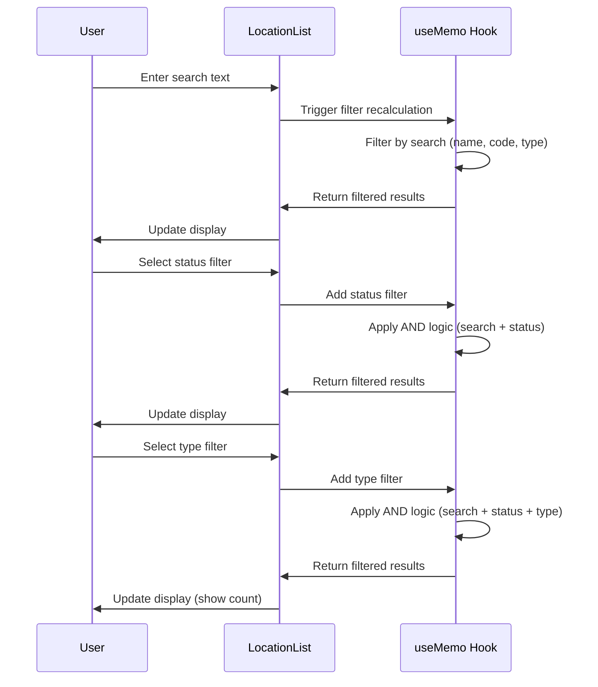

# Technical Specification: Location Management

## Document Information
- **Module**: System Administration / Location Management
- **Version**: 1.0
- **Last Updated**: 2025-01-16
- **Status**: Active
- **Tech Stack**: Next.js 14 (App Router), TypeScript, React, PostgreSQL (Supabase), Zod, React Hook Form

## System Architecture

### Component Hierarchy



## Page Structure and Routes

### Route Configuration

| Route | Component | Purpose |
|-------|-----------|---------|
| `/system-administration/location-management` | page.tsx → LocationList | Main location list view |
| `/system-administration/location-management/[id]` | [id]/page.tsx → LocationDetail | View location details |
| `/system-administration/location-management/[id]/edit` | [id]/edit/page.tsx → LocationEditForm | Edit existing location |
| `/system-administration/location-management/new/edit` | new/edit/page.tsx → LocationDetailForm | Create new location |

### Navigation Flow



## Component Specifications

### 1. LocationList Component

**File**: `components/location-list.tsx` (380 lines)

**Purpose**: Main list view with search, filter, sort, and dual-view capabilities

**Props**: None

**State Management**:
```typescript
// Sort configuration
const [sortConfig, setSortConfig] = useState<SortConfig>({
  field: 'name',
  direction: 'asc'
})

// View mode (table or card)
const [viewMode, setViewMode] = useState<'table' | 'card'>('table')

// Filter configuration
const [filters, setFilters] = useState<FilterConfig>({
  search: '',
  active: 'all',
  type: 'all'
})

// Delete dialog state
const [deleteDialogOpen, setDeleteDialogOpen] = useState(false)
const [deleteLocationId, setDeleteLocationId] = useState<string | null>(null)
```

**Key Features**:
- Real-time search across name, type, code
- Filter by active status and location type
- Sortable columns (code, name, type)
- Table and card view modes
- Delete confirmation dialog
- Responsive design
- Print functionality

**Data Flow**:


**Performance Optimizations**:
- `useMemo` for filtered and sorted data
- Separate state for view mode to prevent re-renders
- Lazy filtering with real-time updates

### 2. LocationDetail Component

**File**: `components/location-detail.tsx` (176 lines)

**Purpose**: Display comprehensive location information with related data

**Props**:
```typescript
interface LocationDetailProps {
  location: Location
  onEdit: () => void
  onDelete: () => void
}
```

**Key Features**:
- Three information cards:
  - Basic Information (code, name, type, status)
  - Delivery Information (physical count, delivery point)
  - Assigned Users (with avatar, role, location badges)
- Action buttons (Back, Edit, Delete)
- Responsive grid layout
- Status badges with color coding

**User Display Logic**:
```typescript
const assignedUsers = useMemo(() => {
  if (!location.assignedUsers) return []
  return mockUsers.filter(user => location.assignedUsers?.includes(user.id))
}, [location.assignedUsers])
```

### 3. LocationEditForm Component

**File**: `components/location-edit-form.tsx` (243 lines)

**Purpose**: Comprehensive form for creating and editing locations

**Props**:
```typescript
interface LocationEditFormProps {
  location?: Location
  onSave: (location: Partial<Location>) => void
  onCancel: () => void
}
```

**Form Schema** (Zod):
```typescript
const locationSchema = z.object({
  code: z.string()
    .min(1, 'Code is required')
    .max(10, 'Code must be 10 characters or less'),
  name: z.string()
    .min(1, 'Name is required')
    .max(100, 'Name must be 100 characters or less'),
  type: z.enum(['Direct', 'Inventory', 'Consignment']),
  eop: z.enum(['true', 'false']),
  deliveryPoint: z.string()
    .min(1, 'Delivery point is required'),
  isActive: z.boolean(),
})
```

**State Management**:
- React Hook Form with Zod resolver
- Separate state for assigned users and products
- Tab navigation state (users vs products)
- Form values watched for real-time updates

**Form Sections**:
1. **Basic Information Section**:
   - Code field (disabled for existing locations)
   - Name field
   - Type dropdown
   - Physical Count dropdown (EOP)
   - Delivery Point input
   - Active checkbox

2. **Assignment Section** (Tabs):
   - User Assignment tab
   - Product Assignment tab

**Validation Rules**:
- All required fields validated on blur and submit
- Inline error messages
- Real-time validation feedback
- Disabled code field for existing locations

### 4. UserAssignment Component

**File**: `components/user-assignment.tsx` (325 lines)

**Purpose**: Dual-pane interface for assigning users to locations

**Props**:
```typescript
interface UserAssignmentProps {
  assignedUserIds: string[]
  onAssignedUsersChange: (userIds: string[]) => void
}
```

**State Management**:
```typescript
const [availableSearch, setAvailableSearch] = useState('')
const [assignedSearch, setAssignedSearch] = useState('')
const [selectedAvailable, setSelectedAvailable] = useState<string[]>([])
const [selectedAssigned, setSelectedAssigned] = useState<string[]>([])
```

**Key Features**:
- Dual-pane layout (Assigned | Available)
- Independent search in each pane
- Select all functionality
- Bulk assign/remove with chevron buttons
- User display:
  - Avatar with colored background and initials
  - User name
  - Role badge
  - Primary location
  - Additional location badges
- Responsive height (h-96 with overflow)

**User List Logic**:
```typescript
// Split users into available and assigned
const availableUsers = useMemo(() => {
  return mockUsers.filter(user => !assignedUserIds.includes(user.id))
}, [assignedUserIds])

const assignedUsers = useMemo(() => {
  return mockUsers.filter(user => assignedUserIds.includes(user.id))
}, [assignedUserIds])

// Filter based on search
const filteredAvailable = useMemo(() => {
  if (!availableSearch) return availableUsers
  const query = availableSearch.toLowerCase()
  return availableUsers.filter(user =>
    user.name.toLowerCase().includes(query) ||
    user.email.toLowerCase().includes(query)
  )
}, [availableUsers, availableSearch])
```

**User Avatar System**:
- Color generation based on user ID hash
- 7 color variants (blue, purple, emerald, amber, rose, indigo, slate)
- Initials extraction from name
- Consistent color per user

### 5. ProductAssignment Component

**File**: `components/product-assignment.tsx` (526 lines)

**Purpose**: Dual-pane interface with product and category view modes

**Props**:
```typescript
interface ProductAssignmentProps {
  assignedProductIds: string[]
  onAssignedProductsChange: (productIds: string[]) => void
}
```

**State Management**:
```typescript
const [viewMode, setViewMode] = useState<'product' | 'category'>('product')
const [availableSearch, setAvailableSearch] = useState('')
const [assignedSearch, setAssignedSearch] = useState('')
const [selectedAvailable, setSelectedAvailable] = useState<string[]>([])
const [selectedAssigned, setSelectedAssigned] = useState<string[]>([])
const [expandedCategories, setExpandedCategories] = useState<Set<string>>(new Set())
```

**View Modes**:

1. **Product Mode** (Default):
   - Flat list of products
   - Similar to user assignment interface
   - Each product shows: code, name, category, unit

2. **Category Mode**:
   - Products grouped by category
   - Expandable category folders
   - Product count badges
   - Nested product selection
   - ChevronDown/ChevronRight icons for expand/collapse

**Category Grouping Logic**:
```typescript
const groupProductsByCategory = (products: Product[]): CategoryGroup[] => {
  const grouped = products.reduce((acc, product) => {
    const categoryId = product.categoryId || 'uncategorized'
    if (!acc[categoryId]) {
      acc[categoryId] = {
        categoryId,
        categoryName: categoryId,
        products: [],
        isExpanded: expandedCategories.has(categoryId)
      }
    }
    acc[categoryId].products.push(product)
    return acc
  }, {} as Record<string, CategoryGroup>)

  return Object.values(grouped).sort((a, b) =>
    a.categoryName.localeCompare(b.categoryName)
  )
}
```

**Mode Toggle UI**:
- Button group with List and FolderTree icons
- Persistent selections across mode switch
- Independent search per mode

## Data Models

### Location Interface

```typescript
export interface Location {
  id: string
  code: string
  name: string
  type: 'Direct' | 'Inventory' | 'Consignment'
  eop: string  // 'true' or 'false' (physical count required)
  deliveryPoint: string
  isActive: boolean
  assignedUsers?: string[]     // Array of user IDs
  assignedProducts?: string[]  // Array of product IDs
}
```

### Form Data Type

```typescript
type LocationFormData = z.infer<typeof locationSchema>
// Equivalent to:
{
  code: string
  name: string
  type: 'Direct' | 'Inventory' | 'Consignment'
  eop: 'true' | 'false'
  deliveryPoint: string
  isActive: boolean
}
```

### Sort and Filter Configuration

```typescript
interface SortConfig {
  field: keyof Location
  direction: 'asc' | 'desc'
}

interface FilterConfig {
  search: string
  active: string   // 'all' | 'true' | 'false'
  type: string     // 'all' | 'Direct' | 'Inventory' | 'Consignment'
}
```

## Data Flow Diagrams

### Create Location Flow



### Edit Location Flow



### Delete Location Flow



### User Assignment Flow



### Search and Filter Flow



## Integration Points

### 1. User Management Integration

**Purpose**: Fetch user data for assignment

**Interface**:
```typescript
import { mockUsers } from '@/lib/mock-data'
import { User } from '@/lib/types'
```

**Data Flow**:
- UserAssignment component imports mockUsers
- Filters out already assigned users
- Displays user with role and location info
- Creates tb_user_location records on save

### 2. Product Management Integration

**Purpose**: Fetch product catalog for assignment

**Interface**:
```typescript
import { mockProducts } from '@/lib/mock-data'
import { Product } from '@/lib/types'
```

**Data Flow**:
- ProductAssignment component imports mockProducts
- Groups by category in category mode
- Supports bulk assignment
- Creates product-location association records

### 3. Delivery Point Integration

**Purpose**: Link locations to delivery addresses

**Current Implementation**: Text input for delivery point

**Future Enhancement**:
```typescript
// Dropdown from tb_delivery_point table
interface DeliveryPoint {
  id: string
  name: string
  address: string
  contactPerson: string
  contactPhone: string
  isActive: boolean
}
```

### 4. Inventory Management Integration

**Purpose**: Validate location deletion constraints

**Validation Points**:
- Check for active inventory balances
- Check for open stock transactions
- Check for pending requisitions

**Integration Interface** (Future):
```typescript
async function canDeleteLocation(locationId: string): Promise<{
  canDelete: boolean
  reason?: string
}> {
  // Check inventory balances
  const hasStock = await checkInventoryBalance(locationId)
  if (hasStock) {
    return { canDelete: false, reason: "Location has active inventory" }
  }

  // Check open transactions
  const hasTransactions = await checkOpenTransactions(locationId)
  if (hasTransactions) {
    return { canDelete: false, reason: "Location has open transactions" }
  }

  return { canDelete: true }
}
```

### 5. Procurement Integration

**Purpose**: Use location's delivery point for purchase orders

**Integration Flow**:
1. User creates purchase request for a location
2. System retrieves location's delivery point
3. Delivery point appears on purchase order
4. Vendor ships to specified delivery point

### 6. Store Operations Integration

**Purpose**: Enable store requisitions from locations

**Integration Points**:
- Source locations (inventory type only)
- Destination locations (direct or consignment)
- Product availability based on assignment
- Stock replenishment based on min/max levels

## UI/UX Specifications

### Table View

**Column Configuration**:
| Column | Width | Sortable | Alignment |
|--------|-------|----------|-----------|
| Code | Auto | Yes | Left |
| Name | Auto | Yes | Left |
| Type | Auto | Yes | Left |
| EOP | Fixed (80px) | No | Left |
| Delivery Point | Auto | No | Left |
| Status | Fixed (100px) | No | Left |
| Actions | Fixed (120px) | No | Right |

**Row Actions**:
- View (FileText icon) - Navigate to detail page
- Edit (Edit icon) - Navigate to edit page
- Delete (Trash2 icon, destructive color) - Open delete dialog

**Table Footer**:
- Record count: "Showing X of Y records"
- Future: Pagination controls

### Card View

**Card Layout**:
```
┌─────────────────────────────┐
│ Name              [Badge]   │
│ Code                        │
│                             │
│ Type: Direct    EOP: Yes    │
│ Delivery Point: Loading...  │
│                             │
│        [View] [Edit] [Del]  │
└─────────────────────────────┘
```

**Responsive Grid**:
- Mobile: 1 column
- Tablet: 2 columns
- Desktop: 3 columns
- Grid gap: 1rem (4 spacing units)

### Color Coding

**Status Badges**:
- Active: `variant="default"` (blue background)
- Inactive: `variant="secondary"` (gray background)

**Type Badges** (in detail view):
- Direct: `variant="outline"`
- Inventory: `variant="outline"`
- Consignment: `variant="outline"`

**User Avatars**:
- 7 color variants based on user ID hash
- Consistent color per user across sessions

### Accessibility

**ARIA Labels**:
- Sort buttons: `aria-label="Sort by [field]"`
- View toggle: `aria-label="Table view" / "Card view"`
- Action buttons: `aria-label="View location / Edit location / Delete location"`

**Keyboard Navigation**:
- Tab through all interactive elements
- Enter to activate buttons
- Escape to close dialogs
- Arrow keys for dropdown navigation

**Screen Reader**:
- Table semantics (`<Table>`, `<TableHeader>`, `<TableBody>`)
- Badge text announced
- Status changes announced
- Error messages associated with form fields

## Performance Optimization

### Memoization Strategy

**Filtered and Sorted Data**:
```typescript
const filteredAndSortedData = useMemo(() => {
  let filtered = mockLocations.filter(location => {
    // Apply all filters
  })

  return filtered.sort((a, b) => {
    // Apply sorting
  })
}, [mockLocations, sortConfig, filters])
```

**Filter Options**:
```typescript
const filterOptions = useMemo(() => {
  const types = Array.from(new Set(mockLocations.map(loc => loc.type))).sort()
  return { types }
}, [])
```

**User/Product Lists**:
```typescript
const availableUsers = useMemo(() => {
  return mockUsers.filter(user => !assignedUserIds.includes(user.id))
}, [assignedUserIds])
```

### Component Optimization

**Lazy Loading** (Future):
- Virtualized lists for large datasets (react-window or react-virtual)
- Lazy load assignment components only when tabs are active
- Image lazy loading for user avatars (if using photos)

**Code Splitting**:
- Each page is a separate bundle (Next.js automatic)
- Component modules loaded on demand

### Database Query Optimization (Future)

**Indexes Required**:
```sql
CREATE INDEX idx_location_code ON tb_location(code);
CREATE INDEX idx_location_name ON tb_location(name);
CREATE INDEX idx_location_type ON tb_location(location_type);
CREATE INDEX idx_location_active ON tb_location(is_active);
CREATE INDEX idx_user_location_user ON tb_user_location(user_id);
CREATE INDEX idx_user_location_location ON tb_user_location(location_id);
```

**Query Patterns**:
- List query: `SELECT * FROM tb_location WHERE is_active = true ORDER BY name`
- Detail query: `SELECT * FROM tb_location WHERE id = $1`
- User assignment: `SELECT user_id FROM tb_user_location WHERE location_id = $1`

## Security Considerations

### Authorization

**Permission Requirements**:
- View locations: All authenticated users
- Create location: Operations Manager, System Administrator
- Edit location: Operations Manager, System Administrator, Store Manager
- Delete location: System Administrator only
- Assign users: Operations Manager, System Administrator
- Assign products: Store Manager, Inventory Manager

**Row-Level Security** (Future - Supabase RLS):
```sql
-- Users can only view locations they are assigned to (unless admin)
CREATE POLICY location_select_policy ON tb_location
  FOR SELECT USING (
    auth.uid() IN (
      SELECT user_id FROM tb_user_location WHERE location_id = tb_location.id
    ) OR
    auth.jwt() ->> 'role' IN ('admin', 'operations_manager')
  );
```

### Input Validation

**Client-Side** (Zod):
- Field length limits
- Required field validation
- Type validation (enum values)
- Format validation

**Server-Side** (Future):
- Same validations as client
- Unique constraint validation
- Foreign key validation
- Business rule validation

### Audit Trail

**Tracked Fields**:
- created_at: Timestamp
- created_by_id: User UUID
- updated_at: Timestamp
- updated_by_id: User UUID
- deleted_at: Timestamp (soft delete)
- deleted_by_id: User UUID (soft delete)

**Audit Log Entries** (Future):
```typescript
interface AuditLog {
  id: string
  entityType: 'location'
  entityId: string
  action: 'create' | 'update' | 'delete' | 'assign_user' | 'remove_user'
  userId: string
  timestamp: Date
  changes: Record<string, { old: any, new: any }>
}
```

## Error Handling

### Client-Side Errors

**Form Validation Errors**:
```typescript
{errors.code && (
  <p className="text-sm text-red-600 dark:text-red-400 mt-1">
    {errors.code.message}
  </p>
)}
```

**Network Errors**:
```typescript
try {
  await createLocation(data)
  toast.success('Location created successfully')
} catch (error) {
  toast.error('Failed to create location. Please try again.')
  console.error('Location creation error:', error)
}
```

**Deletion Constraints**:
```typescript
if (hasActiveStock) {
  toast.error('Cannot delete location with existing inventory')
  return
}

if (hasOpenTransactions) {
  toast.error('Cannot delete location with open transactions')
  return
}
```

### Server-Side Errors (Future)

**Error Response Format**:
```typescript
interface ApiError {
  code: string
  message: string
  details?: Record<string, any>
}

// Example responses:
{
  code: 'DUPLICATE_CODE',
  message: 'Location code already exists',
  details: { field: 'code', value: 'NYC001' }
}

{
  code: 'HAS_ACTIVE_STOCK',
  message: 'Cannot delete location with inventory balances',
  details: { locationId: '123', stockCount: 45 }
}
```

## Testing Strategy

### Unit Tests

**Component Tests** (Vitest + React Testing Library):
```typescript
describe('LocationList', () => {
  it('should render location list', () => {})
  it('should filter locations by search', () => {})
  it('should sort locations by column', () => {})
  it('should toggle view mode', () => {})
  it('should open delete dialog', () => {})
})

describe('LocationEditForm', () => {
  it('should validate required fields', () => {})
  it('should disable code field for existing locations', () => {})
  it('should submit valid form data', () => {})
})

describe('UserAssignment', () => {
  it('should split users into available and assigned', () => {})
  it('should filter users by search', () => {})
  it('should assign users', () => {})
  it('should remove users', () => {})
})
```

### Integration Tests

**End-to-End Flows**:
1. Create location flow
2. Edit location flow
3. Delete location flow
4. User assignment flow
5. Product assignment flow
6. Search and filter flow

### E2E Tests (Playwright)

**Critical User Journeys**:
```typescript
test('Create and assign users to location', async ({ page }) => {
  await page.goto('/system-administration/location-management')
  await page.click('text=Create Location')
  await page.fill('[name="code"]', 'TEST001')
  await page.fill('[name="name"]', 'Test Location')
  await page.selectOption('[name="type"]', 'Inventory')
  await page.click('text=User Assignment')
  // ... assignment steps
  await page.click('text=Save Location')
  await expect(page).toHaveURL(/.*\/system-administration\/location-management\/.*/)
})
```

## Future Enhancements

### Phase 1: Database Integration
- Replace mock data with Supabase queries
- Implement server actions for mutations
- Add optimistic updates with React Query
- Implement row-level security policies

### Phase 2: Advanced Features
- CSV import/export
- Bulk operations (activate/deactivate multiple)
- Location hierarchy (parent-child relationships)
- Location templates
- Historical view (audit log)

### Phase 3: Analytics
- Location utilization metrics
- Stock level dashboards per location
- User activity by location
- Product movement analysis

### Phase 4: Mobile App
- Mobile-optimized location management
- Barcode scanning for location codes
- Offline support with sync
- Push notifications for location events
