# Monitoring - Data Definition (DS)

**Module**: System Administration - Monitoring
**Version**: 1.0
**Last Updated**: 2025-01-16
**Status**: Planned (PostgreSQL + TimescaleDB)

## Document History

| Version | Date | Author | Changes |
|---------|------|--------|---------|
| 1.0.0 | 2025-11-19 | Documentation Team | Initial version |
---

## 1. Database Overview

### 1.1 Database Technology
- **Primary Database**: PostgreSQL 15+
- **Time-Series Extension**: TimescaleDB 2.x (for metrics and logs)
- **Connection Pooling**: PgBouncer
- **ORM**: Prisma 5.x

### 1.2 Schema Organization
- **Monitoring Tables**: 14 core tables
- **Time-Series Hypertables**: 4 tables (performance_metric, error_log, audit_event, user_activity)
- **Configuration Tables**: 5 tables (alert_rule, dashboard, widget, integration_config)
- **Enums**: 12 enum types

### 1.3 Data Retention Policies
- **Real-time metrics**: 7 days (1-minute granularity)
- **Aggregated metrics**: 90 days (5-minute granularity), 1 year (hourly granularity)
- **Error logs**: 90 days (configurable)
- **Audit events**: 1 year minimum, 7 years maximum (configurable)
- **Alert history**: 90 days
- **User activity**: 90 days (anonymized after 30 days)

---

## 2. Enums

### 2.1 Service Status
```sql
CREATE TYPE service_status AS ENUM (
  'healthy',
  'degraded',
  'down',
  'unknown'
);
```

### 2.2 Severity Level
```sql
CREATE TYPE severity_level AS ENUM (
  'debug',
  'info',
  'warning',
  'error',
  'fatal',
  'critical'
);
```

### 2.3 Alert Status
```sql
CREATE TYPE alert_status AS ENUM (
  'active',
  'acknowledged',
  'resolved',
  'suppressed'
);
```

### 2.4 Alert Rule Status
```sql
CREATE TYPE alert_rule_status AS ENUM (
  'enabled',
  'disabled',
  'testing'
);
```

### 2.5 Error Status
```sql
CREATE TYPE error_status AS ENUM (
  'new',
  'acknowledged',
  'in-progress',
  'resolved',
  'ignored'
);
```

### 2.6 Notification Channel
```sql
CREATE TYPE notification_channel AS ENUM (
  'email',
  'slack',
  'sms',
  'webhook',
  'pagerduty',
  'in-app'
);
```

### 2.7 Audit Action Type
```sql
CREATE TYPE audit_action_type AS ENUM (
  'create',
  'read',
  'update',
  'delete',
  'execute',
  'export',
  'login',
  'logout',
  'access-denied'
);
```

### 2.8 Metric Type
```sql
CREATE TYPE metric_type AS ENUM (
  'counter',
  'gauge',
  'histogram',
  'summary'
);
```

### 2.9 Widget Type
```sql
CREATE TYPE widget_type AS ENUM (
  'time-series',
  'counter',
  'gauge',
  'table',
  'pie-chart',
  'bar-chart',
  'heatmap',
  'alert-list',
  'custom-query'
);
```

### 2.10 Integration Type
```sql
CREATE TYPE integration_type AS ENUM (
  'payment-gateway',
  'email-service',
  'cloud-storage',
  'auth-provider',
  'analytics',
  'erp-system',
  'sms-service',
  'webhook'
);
```

### 2.11 Dashboard Visibility
```sql
CREATE TYPE dashboard_visibility AS ENUM (
  'private',
  'team',
  'organization',
  'public'
);
```

### 2.12 Comparison Operator
```sql
CREATE TYPE comparison_operator AS ENUM (
  'gt',   -- greater than
  'gte',  -- greater than or equal
  'lt',   -- less than
  'lte',  -- less than or equal
  'eq',   -- equals
  'ne',   -- not equals
  'contains',
  'not-contains'
);
```

---

## 3. Core Tables

### 3.1 Service Health Table
```sql
CREATE TABLE tb_service_health (
  id                  VARCHAR(50) PRIMARY KEY,
  name                VARCHAR(100) NOT NULL,
  description         TEXT,
  service_type        VARCHAR(50) NOT NULL, -- 'database', 'cache', 'email', 'storage', 'api'
  status              service_status NOT NULL DEFAULT 'unknown',
  last_check          TIMESTAMP NOT NULL DEFAULT NOW(),
  health_check_url    VARCHAR(500),
  check_interval      INTEGER NOT NULL DEFAULT 300, -- seconds
  timeout             INTEGER NOT NULL DEFAULT 30,  -- seconds
  retry_count         INTEGER NOT NULL DEFAULT 3,
  metrics             JSONB NOT NULL DEFAULT '{}',
  uptime_24h          DECIMAL(5,2),
  uptime_7d           DECIMAL(5,2),
  uptime_30d          DECIMAL(5,2),
  created_at          TIMESTAMP NOT NULL DEFAULT NOW(),
  updated_at          TIMESTAMP NOT NULL DEFAULT NOW()
);

CREATE INDEX idx_service_health_status ON tb_service_health(status);
CREATE INDEX idx_service_health_type ON tb_service_health(service_type);
CREATE INDEX idx_service_health_last_check ON tb_service_health(last_check DESC);
```

### 3.2 Health Check Log Table
```sql
CREATE TABLE tb_health_check_log (
  id                  BIGSERIAL PRIMARY KEY,
  service_id          VARCHAR(50) NOT NULL REFERENCES tb_service_health(id) ON DELETE CASCADE,
  status              service_status NOT NULL,
  response_time       INTEGER, -- milliseconds
  error_message       TEXT,
  details             JSONB,
  checked_at          TIMESTAMP NOT NULL DEFAULT NOW()
);

CREATE INDEX idx_health_check_service ON tb_health_check_log(service_id, checked_at DESC);
CREATE INDEX idx_health_check_status ON tb_health_check_log(status, checked_at DESC);

-- Auto-delete old health check logs after 30 days
CREATE INDEX idx_health_check_retention ON tb_health_check_log(checked_at)
  WHERE checked_at < NOW() - INTERVAL '30 days';
```

### 3.3 Performance Metric Table (TimescaleDB Hypertable)
```sql
CREATE TABLE tb_performance_metric (
  time                TIMESTAMPTZ NOT NULL,
  metric_name         VARCHAR(100) NOT NULL,
  endpoint            VARCHAR(500),
  method              VARCHAR(10), -- GET, POST, PUT, DELETE
  status_code         INTEGER,
  p50                 DECIMAL(10,2), -- milliseconds
  p95                 DECIMAL(10,2),
  p99                 DECIMAL(10,2),
  mean                DECIMAL(10,2),
  min                 DECIMAL(10,2),
  max                 DECIMAL(10,2),
  request_count       INTEGER NOT NULL DEFAULT 0,
  error_count         INTEGER NOT NULL DEFAULT 0,
  error_rate          DECIMAL(5,2), -- percentage
  throughput          DECIMAL(10,2), -- requests per second
  tags                JSONB DEFAULT '{}',
  CONSTRAINT tb_performance_metric_pkey PRIMARY KEY (time, metric_name, endpoint)
);

-- Convert to TimescaleDB hypertable
SELECT create_hypertable('tb_performance_metric', 'time');

-- Create indexes for common queries
CREATE INDEX idx_performance_metric_endpoint ON tb_performance_metric(endpoint, time DESC);
CREATE INDEX idx_performance_metric_name ON tb_performance_metric(metric_name, time DESC);
CREATE INDEX idx_performance_metric_tags ON tb_performance_metric USING GIN (tags);

-- Continuous aggregates for 5-minute rollups
CREATE MATERIALIZED VIEW tb_performance_metric_5min
WITH (timescaledb.continuous) AS
SELECT
  time_bucket('5 minutes', time) AS bucket,
  metric_name,
  endpoint,
  AVG(p50) AS avg_p50,
  AVG(p95) AS avg_p95,
  AVG(p99) AS avg_p99,
  SUM(request_count) AS total_requests,
  SUM(error_count) AS total_errors,
  AVG(error_rate) AS avg_error_rate
FROM tb_performance_metric
GROUP BY bucket, metric_name, endpoint;

-- Continuous aggregates for hourly rollups
CREATE MATERIALIZED VIEW tb_performance_metric_hourly
WITH (timescaledb.continuous) AS
SELECT
  time_bucket('1 hour', time) AS bucket,
  metric_name,
  endpoint,
  AVG(p50) AS avg_p50,
  AVG(p95) AS avg_p95,
  AVG(p99) AS avg_p99,
  SUM(request_count) AS total_requests,
  SUM(error_count) AS total_errors,
  AVG(error_rate) AS avg_error_rate
FROM tb_performance_metric
GROUP BY bucket, metric_name, endpoint;

-- Data retention policy
SELECT add_retention_policy('tb_performance_metric', INTERVAL '90 days');
```

### 3.4 Error Log Table (TimescaleDB Hypertable)
```sql
CREATE TABLE tb_error_log (
  id                  VARCHAR(50) PRIMARY KEY,
  time                TIMESTAMPTZ NOT NULL DEFAULT NOW(),
  error_hash          VARCHAR(64) NOT NULL, -- MD5 hash for grouping similar errors
  message             TEXT NOT NULL,
  error_type          VARCHAR(100) NOT NULL,
  severity            severity_level NOT NULL DEFAULT 'error',
  stack_trace         TEXT,
  file_path           VARCHAR(500),
  line_number         INTEGER,
  function_name       VARCHAR(200),
  user_id             VARCHAR(50),
  session_id          VARCHAR(100),
  request_id          VARCHAR(100),
  endpoint            VARCHAR(500),
  method              VARCHAR(10),
  status_code         INTEGER,
  user_agent          TEXT,
  ip_address          INET,
  environment         VARCHAR(50) DEFAULT 'production',
  context             JSONB DEFAULT '{}',
  breadcrumbs         JSONB DEFAULT '[]',
  first_seen          TIMESTAMPTZ NOT NULL DEFAULT NOW(),
  last_seen           TIMESTAMPTZ NOT NULL DEFAULT NOW(),
  occurrence_count    INTEGER NOT NULL DEFAULT 1,
  affected_users      INTEGER NOT NULL DEFAULT 1,
  status              error_status NOT NULL DEFAULT 'new',
  assigned_to         VARCHAR(50),
  resolution_note     TEXT,
  resolved_at         TIMESTAMPTZ
);

-- Convert to TimescaleDB hypertable
SELECT create_hypertable('tb_error_log', 'time');

-- Indexes
CREATE INDEX idx_error_log_hash ON tb_error_log(error_hash, time DESC);
CREATE INDEX idx_error_log_severity ON tb_error_log(severity, time DESC);
CREATE INDEX idx_error_log_status ON tb_error_log(status, time DESC);
CREATE INDEX idx_error_log_user ON tb_error_log(user_id, time DESC);
CREATE INDEX idx_error_log_endpoint ON tb_error_log(endpoint, time DESC);
CREATE INDEX idx_error_log_type ON tb_error_log(error_type, time DESC);
CREATE INDEX idx_error_log_context ON tb_error_log USING GIN (context);

-- Data retention policy
SELECT add_retention_policy('tb_error_log', INTERVAL '90 days');
```

### 3.5 Error Instance Table
```sql
CREATE TABLE tb_error_instance (
  id                  BIGSERIAL PRIMARY KEY,
  error_id            VARCHAR(50) NOT NULL REFERENCES tb_error_log(id) ON DELETE CASCADE,
  occurred_at         TIMESTAMPTZ NOT NULL DEFAULT NOW(),
  user_id             VARCHAR(50),
  session_id          VARCHAR(100),
  request_id          VARCHAR(100),
  context             JSONB DEFAULT '{}',
  stack_trace         TEXT,
  breadcrumbs         JSONB DEFAULT '[]'
);

CREATE INDEX idx_error_instance_error ON tb_error_instance(error_id, occurred_at DESC);
CREATE INDEX idx_error_instance_user ON tb_error_instance(user_id, occurred_at DESC);

-- Auto-delete old error instances after 30 days
CREATE INDEX idx_error_instance_retention ON tb_error_instance(occurred_at)
  WHERE occurred_at < NOW() - INTERVAL '30 days';
```

### 3.6 Audit Event Table (TimescaleDB Hypertable)
```sql
CREATE TABLE tb_audit_event (
  id                  BIGSERIAL,
  time                TIMESTAMPTZ NOT NULL DEFAULT NOW(),
  event_id            VARCHAR(50) NOT NULL UNIQUE,
  user_id             VARCHAR(50) NOT NULL,
  user_email          VARCHAR(255) NOT NULL,
  user_role           VARCHAR(50) NOT NULL,
  action_type         audit_action_type NOT NULL,
  resource_type       VARCHAR(100) NOT NULL,
  resource_id         VARCHAR(100),
  resource_name       VARCHAR(255),
  description         TEXT NOT NULL,
  before_data         JSONB,
  after_data          JSONB,
  changes             JSONB, -- Specific fields that changed
  outcome             VARCHAR(20) NOT NULL DEFAULT 'success', -- 'success', 'failure'
  failure_reason      TEXT,
  ip_address          INET NOT NULL,
  user_agent          TEXT,
  session_id          VARCHAR(100),
  request_id          VARCHAR(100),
  module              VARCHAR(100),
  severity            severity_level NOT NULL DEFAULT 'info',
  metadata            JSONB DEFAULT '{}',
  PRIMARY KEY (time, id)
);

-- Convert to TimescaleDB hypertable
SELECT create_hypertable('tb_audit_event', 'time');

-- Indexes for common queries
CREATE INDEX idx_audit_event_user ON tb_audit_event(user_id, time DESC);
CREATE INDEX idx_audit_event_action ON tb_audit_event(action_type, time DESC);
CREATE INDEX idx_audit_event_resource ON tb_audit_event(resource_type, resource_id, time DESC);
CREATE INDEX idx_audit_event_outcome ON tb_audit_event(outcome, time DESC);
CREATE INDEX idx_audit_event_module ON tb_audit_event(module, time DESC);
CREATE INDEX idx_audit_event_event_id ON tb_audit_event(event_id);
CREATE INDEX idx_audit_event_session ON tb_audit_event(session_id, time DESC);
CREATE INDEX idx_audit_event_changes ON tb_audit_event USING GIN (changes);

-- Data retention policy (configurable, default 1 year)
SELECT add_retention_policy('tb_audit_event', INTERVAL '1 year');
```

### 3.7 Alert Rule Table
```sql
CREATE TABLE tb_alert_rule (
  id                  VARCHAR(50) PRIMARY KEY,
  name                VARCHAR(200) NOT NULL,
  description         TEXT,
  severity            severity_level NOT NULL DEFAULT 'warning',
  status              alert_rule_status NOT NULL DEFAULT 'enabled',
  metric_name         VARCHAR(100) NOT NULL,
  comparison_operator comparison_operator NOT NULL,
  threshold           DECIMAL(15,4) NOT NULL,
  duration_minutes    INTEGER NOT NULL DEFAULT 5,
  evaluation_interval INTEGER NOT NULL DEFAULT 60, -- seconds
  scope               JSONB DEFAULT '{}', -- Filters for applying the rule
  notification_channels TEXT[] NOT NULL DEFAULT '{}',
  notification_recipients JSONB NOT NULL DEFAULT '{}',
  notification_template VARCHAR(50),
  auto_resolve        BOOLEAN NOT NULL DEFAULT TRUE,
  suppress_duration   INTEGER DEFAULT 300, -- seconds
  max_alerts_per_hour INTEGER DEFAULT 10,
  escalation_policy_id VARCHAR(50),
  escalation_delay    INTEGER, -- minutes
  tags                JSONB DEFAULT '{}',
  created_by          VARCHAR(50) NOT NULL,
  created_at          TIMESTAMP NOT NULL DEFAULT NOW(),
  updated_at          TIMESTAMP NOT NULL DEFAULT NOW(),
  last_triggered      TIMESTAMP
);

CREATE INDEX idx_alert_rule_status ON tb_alert_rule(status);
CREATE INDEX idx_alert_rule_metric ON tb_alert_rule(metric_name);
CREATE INDEX idx_alert_rule_severity ON tb_alert_rule(severity);
CREATE INDEX idx_alert_rule_created_by ON tb_alert_rule(created_by);
CREATE INDEX idx_alert_rule_tags ON tb_alert_rule USING GIN (tags);
```

### 3.8 Alert Table
```sql
CREATE TABLE tb_alert (
  id                  VARCHAR(50) PRIMARY KEY,
  alert_rule_id       VARCHAR(50) NOT NULL REFERENCES tb_alert_rule(id) ON DELETE CASCADE,
  status              alert_status NOT NULL DEFAULT 'active',
  severity            severity_level NOT NULL,
  message             TEXT NOT NULL,
  current_value       DECIMAL(15,4) NOT NULL,
  threshold           DECIMAL(15,4) NOT NULL,
  triggered_at        TIMESTAMP NOT NULL DEFAULT NOW(),
  acknowledged_at     TIMESTAMP,
  acknowledged_by     VARCHAR(50),
  acknowledgment_note TEXT,
  resolved_at         TIMESTAMP,
  resolution_note     TEXT,
  notifications_sent  JSONB DEFAULT '[]',
  metadata            JSONB DEFAULT '{}',
  created_at          TIMESTAMP NOT NULL DEFAULT NOW(),
  updated_at          TIMESTAMP NOT NULL DEFAULT NOW()
);

CREATE INDEX idx_alert_rule ON tb_alert(alert_rule_id, triggered_at DESC);
CREATE INDEX idx_alert_status ON tb_alert(status, triggered_at DESC);
CREATE INDEX idx_alert_severity ON tb_alert(severity, triggered_at DESC);
CREATE INDEX idx_alert_acknowledged_by ON tb_alert(acknowledged_by);
```

### 3.9 Dashboard Table
```sql
CREATE TABLE tb_dashboard (
  id                  VARCHAR(50) PRIMARY KEY,
  name                VARCHAR(200) NOT NULL,
  description         TEXT,
  visibility          dashboard_visibility NOT NULL DEFAULT 'private',
  owner_id            VARCHAR(50) NOT NULL,
  team_id             VARCHAR(50),
  layout              JSONB NOT NULL DEFAULT '[]', -- Grid layout configuration
  variables           JSONB DEFAULT '{}', -- Dashboard-level variables
  auto_refresh        BOOLEAN NOT NULL DEFAULT TRUE,
  refresh_interval    INTEGER DEFAULT 30, -- seconds
  default_time_range  VARCHAR(20) DEFAULT '24h',
  theme               VARCHAR(20) DEFAULT 'light',
  tags                TEXT[] DEFAULT '{}',
  is_template         BOOLEAN NOT NULL DEFAULT FALSE,
  created_at          TIMESTAMP NOT NULL DEFAULT NOW(),
  updated_at          TIMESTAMP NOT NULL DEFAULT NOW()
);

CREATE INDEX idx_dashboard_owner ON tb_dashboard(owner_id);
CREATE INDEX idx_dashboard_team ON tb_dashboard(team_id);
CREATE INDEX idx_dashboard_visibility ON tb_dashboard(visibility);
CREATE INDEX idx_dashboard_template ON tb_dashboard(is_template);
```

### 3.10 Widget Table
```sql
CREATE TABLE tb_widget (
  id                  VARCHAR(50) PRIMARY KEY,
  dashboard_id        VARCHAR(50) NOT NULL REFERENCES tb_dashboard(id) ON DELETE CASCADE,
  title               VARCHAR(200) NOT NULL,
  widget_type         widget_type NOT NULL,
  position            JSONB NOT NULL, -- {x, y, w, h}
  data_source         VARCHAR(100) NOT NULL,
  metric_name         VARCHAR(100),
  query               TEXT, -- Custom query for custom-query widgets
  aggregation         VARCHAR(50), -- 'sum', 'avg', 'min', 'max', 'count'
  time_range          VARCHAR(20), -- '1h', '24h', '7d', 'custom'
  filters             JSONB DEFAULT '{}',
  visualization       JSONB NOT NULL DEFAULT '{}', -- Chart config, colors, etc.
  refresh_interval    INTEGER, -- seconds, null = use dashboard default
  created_at          TIMESTAMP NOT NULL DEFAULT NOW(),
  updated_at          TIMESTAMP NOT NULL DEFAULT NOW()
);

CREATE INDEX idx_widget_dashboard ON tb_widget(dashboard_id);
CREATE INDEX idx_widget_type ON tb_widget(widget_type);
```

### 3.11 Integration Health Table
```sql
CREATE TABLE tb_integration_health (
  id                  VARCHAR(50) PRIMARY KEY,
  name                VARCHAR(100) NOT NULL,
  integration_type    integration_type NOT NULL,
  status              service_status NOT NULL DEFAULT 'unknown',
  endpoint_url        VARCHAR(500),
  api_version         VARCHAR(20),
  last_check          TIMESTAMP NOT NULL DEFAULT NOW(),
  last_success        TIMESTAMP,
  configured_at       TIMESTAMP NOT NULL,
  success_rate_24h    DECIMAL(5,2),
  avg_response_time   INTEGER, -- milliseconds
  rate_limit_quota    INTEGER,
  rate_limit_remaining INTEGER,
  rate_limit_reset    TIMESTAMP,
  error_count_24h     INTEGER DEFAULT 0,
  webhook_url         VARCHAR(500),
  webhook_secret      VARCHAR(255), -- Encrypted
  authentication      JSONB, -- Encrypted auth details
  settings            JSONB DEFAULT '{}',
  is_active           BOOLEAN NOT NULL DEFAULT TRUE,
  created_at          TIMESTAMP NOT NULL DEFAULT NOW(),
  updated_at          TIMESTAMP NOT NULL DEFAULT NOW()
);

CREATE INDEX idx_integration_type ON tb_integration_health(integration_type);
CREATE INDEX idx_integration_status ON tb_integration_health(status);
CREATE INDEX idx_integration_active ON tb_integration_health(is_active);
```

### 3.12 Integration Event Table
```sql
CREATE TABLE tb_integration_event (
  id                  BIGSERIAL PRIMARY KEY,
  integration_id      VARCHAR(50) NOT NULL REFERENCES tb_integration_health(id) ON DELETE CASCADE,
  event_type          VARCHAR(50) NOT NULL, -- 'api-call', 'webhook-delivery', 'error'
  direction           VARCHAR(10) NOT NULL, -- 'outbound', 'inbound'
  endpoint            VARCHAR(500),
  method              VARCHAR(10),
  status_code         INTEGER,
  success             BOOLEAN NOT NULL,
  response_time       INTEGER, -- milliseconds
  request_payload     JSONB,
  response_payload    JSONB,
  error_message       TEXT,
  retry_count         INTEGER DEFAULT 0,
  occurred_at         TIMESTAMP NOT NULL DEFAULT NOW()
);

CREATE INDEX idx_integration_event_integration ON tb_integration_event(integration_id, occurred_at DESC);
CREATE INDEX idx_integration_event_success ON tb_integration_event(success, occurred_at DESC);
CREATE INDEX idx_integration_event_type ON tb_integration_event(event_type, occurred_at DESC);

-- Auto-delete old integration events after 30 days
CREATE INDEX idx_integration_event_retention ON tb_integration_event(occurred_at)
  WHERE occurred_at < NOW() - INTERVAL '30 days';
```

### 3.13 User Activity Table (TimescaleDB Hypertable)
```sql
CREATE TABLE tb_user_activity (
  id                  BIGSERIAL,
  time                TIMESTAMPTZ NOT NULL DEFAULT NOW(),
  user_id             VARCHAR(50) NOT NULL,
  session_id          VARCHAR(100) NOT NULL,
  activity_type       VARCHAR(50) NOT NULL, -- 'page-view', 'action', 'feature-use'
  module              VARCHAR(100),
  feature             VARCHAR(100),
  page_url            VARCHAR(500),
  action              VARCHAR(100),
  duration            INTEGER, -- seconds spent
  metadata            JSONB DEFAULT '{}',
  device_type         VARCHAR(50), -- 'desktop', 'mobile', 'tablet'
  browser             VARCHAR(100),
  os                  VARCHAR(100),
  ip_address          INET,
  PRIMARY KEY (time, id)
);

-- Convert to TimescaleDB hypertable
SELECT create_hypertable('tb_user_activity', 'time');

-- Indexes
CREATE INDEX idx_user_activity_user ON tb_user_activity(user_id, time DESC);
CREATE INDEX idx_user_activity_session ON tb_user_activity(session_id, time DESC);
CREATE INDEX idx_user_activity_type ON tb_user_activity(activity_type, time DESC);
CREATE INDEX idx_user_activity_module ON tb_user_activity(module, time DESC);
CREATE INDEX idx_user_activity_feature ON tb_user_activity(feature, time DESC);

-- Continuous aggregates for hourly user activity
CREATE MATERIALIZED VIEW tb_user_activity_hourly
WITH (timescaledb.continuous) AS
SELECT
  time_bucket('1 hour', time) AS bucket,
  module,
  feature,
  activity_type,
  COUNT(DISTINCT user_id) AS unique_users,
  COUNT(*) AS total_activities,
  AVG(duration) AS avg_duration
FROM tb_user_activity
GROUP BY bucket, module, feature, activity_type;

-- Data retention and anonymization
-- Raw data: 30 days, then anonymize user_id
-- Aggregated data: 90 days
SELECT add_retention_policy('tb_user_activity', INTERVAL '90 days');
```

### 3.14 User Session Table
```sql
CREATE TABLE tb_user_session (
  id                  VARCHAR(100) PRIMARY KEY,
  user_id             VARCHAR(50) NOT NULL,
  started_at          TIMESTAMP NOT NULL DEFAULT NOW(),
  ended_at            TIMESTAMP,
  duration            INTEGER, -- seconds
  page_views          INTEGER DEFAULT 0,
  actions             INTEGER DEFAULT 0,
  device_type         VARCHAR(50),
  browser             VARCHAR(100),
  os                  VARCHAR(100),
  ip_address          INET,
  metadata            JSONB DEFAULT '{}'
);

CREATE INDEX idx_user_session_user ON tb_user_session(user_id, started_at DESC);
CREATE INDEX idx_user_session_started ON tb_user_session(started_at DESC);

-- Auto-delete old sessions after 90 days
CREATE INDEX idx_user_session_retention ON tb_user_session(ended_at)
  WHERE ended_at < NOW() - INTERVAL '90 days';
```

---

## 4. Entity Relationship Diagram

```mermaid
erDiagram
    TB_SERVICE_HEALTH ||--o{ TB_HEALTH_CHECK_LOG : "has"
    TB_ALERT_RULE ||--o{ TB_ALERT : "triggers"
    TB_DASHBOARD ||--o{ TB_WIDGET : "contains"
    TB_INTEGRATION_HEALTH ||--o{ TB_INTEGRATION_EVENT : "logs"
    TB_ERROR_LOG ||--o{ TB_ERROR_INSTANCE : "has"
    TB_USER_SESSION ||--o{ TB_USER_ACTIVITY : "contains"

    TB_SERVICE_HEALTH {
        varchar id PK
        varchar name
        service_status status
        timestamp last_check
        jsonb metrics
    }

    TB_HEALTH_CHECK_LOG {
        bigserial id PK
        varchar service_id FK
        service_status status
        integer response_time
        timestamp checked_at
    }

    TB_PERFORMANCE_METRIC {
        timestamptz time PK
        varchar metric_name PK
        varchar endpoint PK
        decimal p50
        decimal p95
        decimal p99
        integer request_count
    }

    TB_ERROR_LOG {
        varchar id PK
        timestamptz time
        varchar error_hash
        text message
        severity_level severity
        error_status status
        integer occurrence_count
    }

    TB_ERROR_INSTANCE {
        bigserial id PK
        varchar error_id FK
        timestamptz occurred_at
        varchar user_id
        jsonb context
    }

    TB_AUDIT_EVENT {
        bigserial id PK
        timestamptz time
        varchar event_id
        varchar user_id
        audit_action_type action_type
        varchar resource_type
        jsonb before_data
        jsonb after_data
    }

    TB_ALERT_RULE {
        varchar id PK
        varchar name
        alert_rule_status status
        varchar metric_name
        decimal threshold
        integer duration_minutes
    }

    TB_ALERT {
        varchar id PK
        varchar alert_rule_id FK
        alert_status status
        severity_level severity
        decimal current_value
        timestamp triggered_at
    }

    TB_DASHBOARD {
        varchar id PK
        varchar name
        dashboard_visibility visibility
        varchar owner_id
        jsonb layout
    }

    TB_WIDGET {
        varchar id PK
        varchar dashboard_id FK
        widget_type widget_type
        varchar metric_name
        jsonb visualization
    }

    TB_INTEGRATION_HEALTH {
        varchar id PK
        varchar name
        integration_type integration_type
        service_status status
        decimal success_rate_24h
    }

    TB_INTEGRATION_EVENT {
        bigserial id PK
        varchar integration_id FK
        varchar event_type
        boolean success
        integer response_time
        timestamp occurred_at
    }

    TB_USER_ACTIVITY {
        bigserial id PK
        timestamptz time
        varchar user_id
        varchar session_id FK
        varchar activity_type
        varchar module
    }

    TB_USER_SESSION {
        varchar id PK
        varchar user_id
        timestamp started_at
        timestamp ended_at
        integer page_views
    }
```



---

## 5. Sample Queries

### 5.1 System Health Queries

#### Get Overall System Health Status
```sql
SELECT
  COUNT(*) AS total_services,
  COUNT(*) FILTER (WHERE status = 'healthy') AS healthy_count,
  COUNT(*) FILTER (WHERE status = 'degraded') AS degraded_count,
  COUNT(*) FILTER (WHERE status = 'down') AS down_count,
  ROUND(AVG(uptime_24h), 2) AS avg_uptime_24h
FROM tb_service_health;
```

#### Get Service Health with Recent Checks
```sql
SELECT
  s.id,
  s.name,
  s.status,
  s.uptime_24h,
  s.last_check,
  (
    SELECT jsonb_agg(
      jsonb_build_object(
        'status', l.status,
        'response_time', l.response_time,
        'checked_at', l.checked_at
      ) ORDER BY l.checked_at DESC
    )
    FROM (
      SELECT * FROM tb_health_check_log
      WHERE service_id = s.id
      ORDER BY checked_at DESC
      LIMIT 10
    ) l
  ) AS recent_checks
FROM tb_service_health s
ORDER BY s.name;
```

### 5.2 Performance Monitoring Queries

#### Get API Performance Summary (Last 24 Hours)
```sql
SELECT
  endpoint,
  COUNT(*) AS total_requests,
  ROUND(AVG(p50)::numeric, 2) AS avg_p50,
  ROUND(AVG(p95)::numeric, 2) AS avg_p95,
  ROUND(AVG(p99)::numeric, 2) AS avg_p99,
  ROUND(AVG(error_rate)::numeric, 2) AS avg_error_rate,
  SUM(error_count) AS total_errors
FROM tb_performance_metric
WHERE time >= NOW() - INTERVAL '24 hours'
  AND endpoint IS NOT NULL
GROUP BY endpoint
ORDER BY total_requests DESC
LIMIT 20;
```

#### Get Slowest Endpoints (P95 > 1000ms)
```sql
SELECT
  endpoint,
  AVG(p95) AS avg_p95,
  MAX(p99) AS max_p99,
  COUNT(*) AS data_points,
  ROUND(AVG(error_rate)::numeric, 2) AS avg_error_rate
FROM tb_performance_metric
WHERE time >= NOW() - INTERVAL '24 hours'
  AND p95 > 1000
GROUP BY endpoint
ORDER BY avg_p95 DESC;
```

#### Get Performance Trend (Hourly Aggregates)
```sql
SELECT
  bucket AS hour,
  endpoint,
  avg_p50,
  avg_p95,
  total_requests,
  total_errors,
  ROUND((total_errors::numeric / NULLIF(total_requests, 0) * 100), 2) AS error_rate_percent
FROM tb_performance_metric_hourly
WHERE bucket >= NOW() - INTERVAL '7 days'
  AND endpoint = '/api/purchase-orders'
ORDER BY bucket DESC;
```

### 5.3 Error Tracking Queries

#### Get Top Errors by Occurrence (Last 7 Days)
```sql
SELECT
  id,
  message,
  error_type,
  severity,
  occurrence_count,
  affected_users,
  status,
  first_seen,
  last_seen,
  EXTRACT(EPOCH FROM (last_seen - first_seen)) / 3600 AS duration_hours
FROM tb_error_log
WHERE time >= NOW() - INTERVAL '7 days'
ORDER BY occurrence_count DESC
LIMIT 20;
```

#### Get Error Trend by Type
```sql
SELECT
  error_type,
  DATE_TRUNC('day', time) AS day,
  COUNT(*) AS error_count,
  COUNT(DISTINCT user_id) AS affected_users
FROM tb_error_log
WHERE time >= NOW() - INTERVAL '30 days'
GROUP BY error_type, day
ORDER BY day DESC, error_count DESC;
```

#### Get Unresolved Errors by Severity
```sql
SELECT
  severity,
  COUNT(*) AS unresolved_count,
  SUM(occurrence_count) AS total_occurrences,
  SUM(affected_users) AS total_users_affected
FROM tb_error_log
WHERE status IN ('new', 'acknowledged', 'in-progress')
  AND time >= NOW() - INTERVAL '30 days'
GROUP BY severity
ORDER BY
  CASE severity
    WHEN 'fatal' THEN 1
    WHEN 'error' THEN 2
    WHEN 'warning' THEN 3
    WHEN 'info' THEN 4
    WHEN 'debug' THEN 5
  END;
```

### 5.4 Audit Trail Queries

#### Search Audit Events
```sql
SELECT
  event_id,
  time,
  user_email,
  user_role,
  action_type,
  resource_type,
  resource_id,
  description,
  outcome,
  ip_address
FROM tb_audit_event
WHERE user_id = 'user-123'
  AND time >= '2025-01-01'
  AND time <= '2025-01-31'
  AND action_type IN ('create', 'update', 'delete')
  AND resource_type = 'purchase-order'
ORDER BY time DESC
LIMIT 100;
```

#### Get Audit Event with Change Details
```sql
SELECT
  event_id,
  time,
  user_email,
  action_type,
  resource_type,
  resource_id,
  description,
  before_data,
  after_data,
  changes
FROM tb_audit_event
WHERE event_id = 'AUD-2025-001234';
```

#### Get User Activity Summary
```sql
SELECT
  user_id,
  user_email,
  COUNT(*) AS total_actions,
  COUNT(DISTINCT DATE(time)) AS active_days,
  MIN(time) AS first_action,
  MAX(time) AS last_action,
  COUNT(*) FILTER (WHERE outcome = 'failure') AS failed_actions
FROM tb_audit_event
WHERE time >= NOW() - INTERVAL '30 days'
GROUP BY user_id, user_email
ORDER BY total_actions DESC
LIMIT 20;
```

### 5.5 Alert Queries

#### Get Active Alerts
```sql
SELECT
  a.id,
  a.message,
  a.severity,
  a.current_value,
  a.threshold,
  a.triggered_at,
  ar.name AS rule_name,
  ar.metric_name
FROM tb_alert a
JOIN tb_alert_rule ar ON a.alert_rule_id = ar.id
WHERE a.status = 'active'
ORDER BY
  CASE a.severity
    WHEN 'critical' THEN 1
    WHEN 'fatal' THEN 2
    WHEN 'error' THEN 3
    WHEN 'warning' THEN 4
    ELSE 5
  END,
  a.triggered_at DESC;
```

#### Get Alert Statistics by Rule
```sql
SELECT
  ar.id,
  ar.name,
  ar.status,
  COUNT(a.id) AS total_alerts,
  COUNT(a.id) FILTER (WHERE a.status = 'active') AS active_alerts,
  COUNT(a.id) FILTER (WHERE a.status = 'resolved') AS resolved_alerts,
  MAX(a.triggered_at) AS last_triggered,
  ROUND(AVG(EXTRACT(EPOCH FROM (a.resolved_at - a.triggered_at)) / 60), 2) AS avg_resolution_time_minutes
FROM tb_alert_rule ar
LEFT JOIN tb_alert a ON ar.id = a.alert_rule_id
  AND a.triggered_at >= NOW() - INTERVAL '30 days'
GROUP BY ar.id, ar.name, ar.status
ORDER BY total_alerts DESC;
```

### 5.6 Integration Health Queries

#### Get Integration Health Summary
```sql
SELECT
  i.id,
  i.name,
  i.integration_type,
  i.status,
  i.success_rate_24h,
  i.avg_response_time,
  i.error_count_24h,
  COUNT(e.id) FILTER (WHERE e.occurred_at >= NOW() - INTERVAL '1 hour') AS errors_last_hour
FROM tb_integration_health i
LEFT JOIN tb_integration_event e ON i.id = e.integration_id
  AND e.success = FALSE
  AND e.occurred_at >= NOW() - INTERVAL '24 hours'
GROUP BY i.id
ORDER BY i.error_count_24h DESC;
```

#### Get Integration Event Metrics
```sql
SELECT
  i.name,
  e.event_type,
  COUNT(*) AS total_events,
  COUNT(*) FILTER (WHERE e.success) AS successful_events,
  ROUND((COUNT(*) FILTER (WHERE e.success)::numeric / COUNT(*) * 100), 2) AS success_rate,
  ROUND(AVG(e.response_time), 2) AS avg_response_time_ms
FROM tb_integration_event e
JOIN tb_integration_health i ON e.integration_id = i.id
WHERE e.occurred_at >= NOW() - INTERVAL '24 hours'
GROUP BY i.name, e.event_type
ORDER BY total_events DESC;
```

### 5.7 User Activity Queries

#### Get Active Users Statistics
```sql
SELECT
  COUNT(DISTINCT user_id) FILTER (WHERE time >= NOW() - INTERVAL '1 hour') AS active_last_hour,
  COUNT(DISTINCT user_id) FILTER (WHERE time >= NOW() - INTERVAL '24 hours') AS active_last_24h,
  COUNT(DISTINCT user_id) FILTER (WHERE time >= NOW() - INTERVAL '7 days') AS active_last_7d,
  COUNT(DISTINCT user_id) FILTER (WHERE time >= NOW() - INTERVAL '30 days') AS active_last_30d
FROM tb_user_activity;
```

#### Get Feature Usage Statistics
```sql
SELECT
  module,
  feature,
  COUNT(DISTINCT user_id) AS unique_users,
  COUNT(*) AS total_uses,
  ROUND(AVG(duration), 2) AS avg_duration_seconds
FROM tb_user_activity
WHERE time >= NOW() - INTERVAL '30 days'
  AND activity_type = 'feature-use'
GROUP BY module, feature
ORDER BY total_uses DESC
LIMIT 20;
```

#### Get User Retention Cohort Analysis
```sql
WITH user_cohorts AS (
  SELECT
    user_id,
    DATE_TRUNC('month', MIN(time)) AS cohort_month
  FROM tb_user_activity
  GROUP BY user_id
)
SELECT
  uc.cohort_month,
  COUNT(DISTINCT uc.user_id) AS cohort_size,
  COUNT(DISTINCT CASE WHEN ua.time >= uc.cohort_month + INTERVAL '1 month'
    AND ua.time < uc.cohort_month + INTERVAL '2 months'
    THEN uc.user_id END) AS retained_month_1,
  ROUND(
    COUNT(DISTINCT CASE WHEN ua.time >= uc.cohort_month + INTERVAL '1 month'
      AND ua.time < uc.cohort_month + INTERVAL '2 months'
      THEN uc.user_id END)::numeric / COUNT(DISTINCT uc.user_id) * 100,
    2
  ) AS retention_rate_month_1
FROM user_cohorts uc
LEFT JOIN tb_user_activity ua ON uc.user_id = ua.user_id
GROUP BY uc.cohort_month
ORDER BY uc.cohort_month DESC;
```

---

## 6. Data Retention and Archival

### 6.1 Automatic Retention Policies
```sql
-- Performance metrics: 90 days raw, continuous aggregates for longer
SELECT add_retention_policy('tb_performance_metric', INTERVAL '90 days');

-- Error logs: 90 days (configurable)
SELECT add_retention_policy('tb_error_log', INTERVAL '90 days');

-- Audit events: 1 year (configurable 1-7 years)
SELECT add_retention_policy('tb_audit_event', INTERVAL '1 year');

-- User activity: 90 days
SELECT add_retention_policy('tb_user_activity', INTERVAL '90 days');
```

### 6.2 Manual Data Archival (Before Deletion)
```sql
-- Archive old audit events to separate table before deletion
CREATE TABLE tb_audit_event_archive (LIKE tb_audit_event INCLUDING ALL);

INSERT INTO tb_audit_event_archive
SELECT * FROM tb_audit_event
WHERE time < NOW() - INTERVAL '1 year';

-- Archive old error logs
CREATE TABLE tb_error_log_archive (LIKE tb_error_log INCLUDING ALL);

INSERT INTO tb_error_log_archive
SELECT * FROM tb_error_log
WHERE time < NOW() - INTERVAL '90 days';
```

### 6.3 User Data Anonymization (Privacy Compliance)
```sql
-- Anonymize user activity after 30 days
UPDATE tb_user_activity
SET
  user_id = 'anonymized',
  ip_address = NULL,
  metadata = '{}'::jsonb
WHERE time < NOW() - INTERVAL '30 days'
  AND user_id != 'anonymized';

-- Anonymize audit events (keep for compliance but remove PII)
UPDATE tb_audit_event
SET
  user_email = 'anonymized@example.com',
  ip_address = NULL,
  user_agent = NULL
WHERE time < NOW() - INTERVAL '30 days'
  AND user_email != 'anonymized@example.com';
```

---

## 7. Performance Optimization

### 7.1 Partitioning Strategy
- TimescaleDB automatically partitions hypertables by time
- Default chunk interval: 7 days
- Adjust based on data volume and query patterns

### 7.2 Index Strategy
- Create indexes on frequently queried columns
- Use partial indexes for common filter conditions
- Use GIN indexes for JSONB columns
- Monitor index usage and remove unused indexes

### 7.3 Query Optimization
- Use continuous aggregates for pre-computed rollups
- Leverage materialized views for complex analytics
- Use EXPLAIN ANALYZE to identify slow queries
- Consider connection pooling for high-concurrency scenarios

---

**Document Control**:
- **Created**: 2025-01-16
- **Version**: 1.0
- **Status**: Planned
- **Next Review**: Q2 2025
