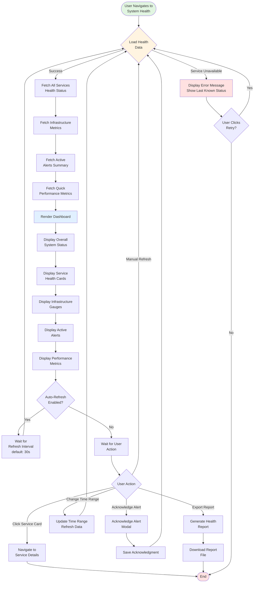

# Monitoring - Flow Diagrams (FD)

**Module**: System Administration - Monitoring
**Version**: 1.0
**Last Updated**: 2025-01-16
**Status**: Active Development

---

## Flow Diagram Index

| ID | Flow Name | Use Case | Complexity |
|----|-----------|----------|------------|
| FD-MON-001 | View System Health Dashboard | UC-MON-001 | Medium |
| FD-MON-002 | Run Health Check | UC-MON-001 | Medium |
| FD-MON-003 | Investigate Performance Issues | UC-MON-002 | High |
| FD-MON-004 | Review and Troubleshoot Errors | UC-MON-003 | High |
| FD-MON-005 | Search Audit Trail | UC-MON-004 | Medium |
| FD-MON-006 | Configure Alert Rule | UC-MON-005 | High |
| FD-MON-007 | Alert Evaluation and Notification | Background Process | High |
| FD-MON-008 | Create Custom Dashboard | UC-MON-006 | Medium |
| FD-MON-009 | Monitor Integration Health | UC-MON-007 | Medium |
| FD-MON-010 | Analyze User Activity | UC-MON-008 | Medium |
| FD-MON-011 | Error Aggregation Process | Background Process | Medium |
| FD-MON-012 | Data Retention and Archival | Background Process | Low |

---

## FD-MON-001: View System Health Dashboard

**Description**: User accesses the system health dashboard to view overall system status, service health, infrastructure metrics, and active alerts. The dashboard auto-refreshes at configurable intervals.

**Key Decision Points**:
- Health check service availability
- Auto-refresh enabled/disabled
- User interaction choices

**Error Handling**:
- Display last known status if service unavailable
- Retry mechanism for failed data loads
- Warning banner for monitoring issues

---

## FD-MON-002: Run Health Check

**Description**: Execute health check for a specific service, measure response time, handle retries, update service status, and trigger alerts if necessary.

**Key Decision Points**:
- Service configuration validity
- Health check success/failure
- Retry logic (max 3 attempts)
- Critical status change detection

**Error Handling**:
- Retry with exponential backoff
- Record detailed error information
- Trigger alerts for critical failures

---

## FD-MON-003: Investigate Performance Issues

**Description**: User investigates performance issues by analyzing metrics, drilling down into slow endpoints, reviewing request traces, and identifying root causes.

**Key Decision Points**:
- Performance spike detected
- Trace data availability
- Root cause category identification
- Task creation decision

**Error Handling**:
- Show limited metadata if trace unavailable
- Suggest enabling trace collection
- Handle missing data gracefully

---

## FD-MON-004: Review and Troubleshoot Errors

**Description**: User reviews error logs, investigates error details with full context, identifies root causes, and takes appropriate actions (assign, resolve, ignore, alert).

**Key Decision Points**:
- User permission check for sensitive errors
- Root cause identification
- Similar error merging
- Action selection (assign/resolve/ignore/alert)

**Error Handling**:
- Access control for sensitive errors
- Graceful handling of missing error details
- Alternative actions when root cause unclear

---

## FD-MON-005: Search Audit Trail

**Description**: User searches audit trail with configurable filters, views event details, analyzes data changes, and generates audit reports for compliance.

**Key Decision Points**:
- Filter validation
- Query timeout handling
- Results availability
- User action selection

**Error Handling**:
- Validation errors for filters
- Timeout handling with suggestions
- No results with adjustment hints

---

## FD-MON-006: Configure Alert Rule

**Description**: User creates and configures a new alert rule with conditions, notification settings, behavior configuration, optional escalation, and testing before activation.

**Key Decision Points**:
- Advanced condition configuration
- Escalation policy setup
- Alert rule testing
- Configuration validation

**Error Handling**:
- Validation errors with field highlighting
- Test results with current metric values
- Configuration correction opportunities

---

## FD-MON-007: Alert Evaluation and Notification

**Description**: Background process that continuously evaluates all active alert rules, creates alerts when conditions are met, sends notifications through configured channels, and auto-resolves alerts.

**Key Decision Points**:
- Evaluation interval timing
- Metric availability
- Condition and duration requirements
- Alert suppression
- Auto-resolve configuration

**Error Handling**:
- Missing metric logging
- Notification delivery failures
- Retry mechanisms for failed notifications
- Error logging for troubleshooting

---

## FD-MON-008: Create Custom Dashboard

**Description**: User creates a custom dashboard by adding and configuring widgets, arranging layout, setting dashboard-level preferences, and optionally sharing with team.

**Key Decision Points**:
- Widget type selection
- Query preview validation
- Dashboard configuration
- Sharing configuration
- Configuration validation

**Error Handling**:
- Widget query validation
- Preview data availability
- Dashboard validation errors
- Permission checks for sharing

---

## FD-MON-009: Monitor Integration Health

**Description**: User monitors integration health, investigates degraded integrations, reviews failed requests, tests integration endpoints, and takes corrective actions.

**Key Decision Points**:
- Integration degradation detection
- Error pattern identification
- Test result validation
- User action selection

**Error Handling**:
- Authentication failures with suggestions
- Test failures with detailed information
- Graceful handling of missing logs

---

## FD-MON-010: Analyze User Activity

**Description**: User analyzes user activity patterns, feature adoption, retention cohorts, user segmentation, and individual user profiles while respecting privacy policies.

**Key Decision Points**:
- Module drill-down selection
- Tab selection (retention/segmentation/individual)
- Privacy data availability
- Sufficient data for reporting

**Error Handling**:
- Privacy restrictions with anonymized data
- Insufficient data warnings
- Estimation of data availability timeline

---

## FD-MON-011: Error Aggregation Process

**Description**: Background process that aggregates similar errors by hash, tracks occurrence counts and affected users, stores error instances, and triggers alerts for critical errors or spikes.

**Key Decision Points**:
- Error hash matching
- User already affected check
- Severity level check
- Threshold exceeded check
- Recent alert check

**Error Handling**:
- Hash collision handling
- Database transaction management
- Alert rate limiting

---

## FD-MON-012: Data Retention and Archival

**Description**: Scheduled background process that enforces data retention policies, archives old data, anonymizes PII for privacy compliance, and deletes data past retention periods.

**Key Decision Points**:
- Data age checks per table
- Legal hold status for audit events
- Large volume deletion notification
- Privacy compliance (anonymization)

**Error Handling**:
- Transaction rollback on failures
- Notification on errors
- Retry mechanisms
- Administrator alerts for issues

---

**Document Control**:
- **Created**: 2025-01-16
- **Version**: 1.0
- **Status**: Active Development
- **Next Review**: Q2 2025
