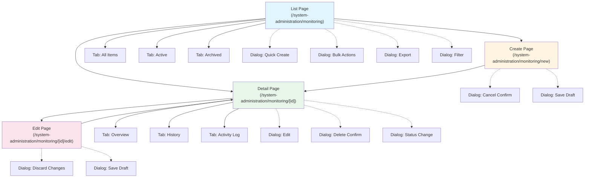

# Monitoring - Technical Specification (TS)

**Module**: System Administration - Monitoring
**Version**: 1.0
**Last Updated**: 2025-01-16
**Status**: Active Development

## Document History

| Version | Date | Author | Changes |
|---------|------|--------|---------|
| 1.0.0 | 2025-11-19 | Documentation Team | Initial version |
---

## 1. Technology Stack

### 1.1 Core Technologies
- **Framework**: Next.js 14 with App Router
- **Language**: TypeScript 5.8.2 (strict mode)
- **UI Library**: React 18
- **Styling**: Tailwind CSS 3.x
- **Component Library**: shadcn/ui (Radix UI primitives)
- **Icons**: Lucide React

### 1.2 State Management
- **Client State**: React hooks (useState, useReducer, useContext)
- **Server State**: React Query (TanStack Query) - Planned Q1 2025
- **Form State**: React Hook Form
- **Global State**: Zustand (for UI state only)

### 1.3 Data Visualization
- **Charts Library**: Recharts (for time series, gauges, pie charts)
- **Alternative**: Apache ECharts (for advanced visualizations)
- **Tables**: TanStack React Table v8
- **Heatmaps**: Custom implementation with Recharts

### 1.4 Backend & Data
- **Current**: Mock data in `lib/mock-data/monitoring.ts`
- **Planned**: PostgreSQL 15+ with Prisma 5.x (Q1 2025)
- **Time-Series Data**: TimescaleDB extension for PostgreSQL (Planned)
- **Caching**: Redis (Planned for metrics caching)

### 1.5 Monitoring & Observability (Integration)
- **APM**: DataDog / New Relic (External integration)
- **Logs**: Winston / Pino (Structured logging)
- **Metrics**: Prometheus format export (Planned)
- **Distributed Tracing**: OpenTelemetry (Planned)

### 1.6 Validation & Forms
- **Schema Validation**: Zod
- **Form Handling**: React Hook Form + Zod resolver
- **Server Validation**: Same Zod schemas in server actions

### 1.7 Date & Time
- **Library**: date-fns
- **Timezone**: Support UTC and user's local timezone
- **Format**: ISO 8601 for storage, localized display

---

## 2. Module Structure

### 2.1 Directory Organization

```
app/(main)/system-administration/monitoring/
├── page.tsx                                    # Main monitoring dashboard
├── system-health/
│   ├── page.tsx                               # System health dashboard
│   └── components/
│       ├── service-health-card.tsx            # Individual service status
│       ├── infrastructure-metrics.tsx          # CPU, memory, disk gauges
│       ├── alert-summary.tsx                  # Active alerts widget
│       └── health-check-log.tsx               # Health check history
├── performance/
│   ├── page.tsx                               # Performance monitoring dashboard
│   ├── [endpoint]/
│   │   └── page.tsx                           # Endpoint-specific performance
│   └── components/
│       ├── response-time-chart.tsx            # P50, P95, P99 trends
│       ├── throughput-chart.tsx               # Requests per second
│       ├── slowest-endpoints-table.tsx        # Ranked slow endpoints
│       ├── database-performance.tsx           # DB query metrics
│       ├── client-performance.tsx             # Core Web Vitals
│       └── request-trace-viewer.tsx           # Detailed trace visualization
├── errors/
│   ├── page.tsx                               # Error tracking dashboard
│   ├── [errorId]/
│   │   └── page.tsx                           # Error detail page
│   └── components/
│       ├── error-rate-chart.tsx               # Error rate trends
│       ├── error-list-table.tsx               # Error list with filters
│       ├── error-detail-panel.tsx             # Full error context
│       ├── stack-trace-viewer.tsx             # Syntax-highlighted stack
│       ├── error-instances-table.tsx          # Recent occurrences
│       └── error-assignment.tsx               # Assign to team member
├── audit/
│   ├── page.tsx                               # Audit trail search
│   └── components/
│       ├── audit-search-filters.tsx           # Advanced search panel
│       ├── audit-events-table.tsx             # Event list
│       ├── audit-event-detail.tsx             # Event details panel
│       ├── audit-timeline.tsx                 # Visual timeline
│       └── audit-export.tsx                   # Export functionality
├── alerts/
│   ├── page.tsx                               # Alert management dashboard
│   ├── rules/
│   │   ├── page.tsx                           # Alert rules list
│   │   ├── [ruleId]/
│   │   │   └── page.tsx                       # Edit alert rule
│   │   └── new/
│   │       └── page.tsx                       # Create alert rule
│   └── components/
│       ├── alert-rules-table.tsx              # Rules list
│       ├── alert-rule-form.tsx                # Rule configuration
│       ├── active-alerts-list.tsx             # Current active alerts
│       ├── alert-timeline.tsx                 # Alert history
│       └── alert-notification-config.tsx       # Notification settings
├── dashboards/
│   ├── page.tsx                               # Custom dashboards list
│   ├── [dashboardId]/
│   │   └── page.tsx                           # View dashboard
│   ├── new/
│   │   └── page.tsx                           # Dashboard builder
│   └── components/
│       ├── dashboard-grid.tsx                 # Drag-drop grid layout
│       ├── widget-library.tsx                 # Available widgets
│       ├── widget-config-panel.tsx            # Widget configuration
│       └── widgets/
│           ├── time-series-widget.tsx
│           ├── counter-widget.tsx
│           ├── gauge-widget.tsx
│           ├── table-widget.tsx
│           └── alert-list-widget.tsx
├── integrations/
│   ├── page.tsx                               # Integration health dashboard
│   ├── [integrationId]/
│   │   └── page.tsx                           # Integration detail page
│   └── components/
│       ├── integration-health-card.tsx        # Integration status card
│       ├── integration-metrics.tsx            # Call volume, success rate
│       ├── webhook-delivery-log.tsx           # Webhook status
│       └── integration-test.tsx               # Test integration
├── user-activity/
│   ├── page.tsx                               # User activity analytics
│   └── components/
│       ├── active-users-chart.tsx             # Active users trend
│       ├── feature-usage-chart.tsx            # Feature adoption
│       ├── user-journey-flow.tsx              # User path visualization
│       ├── retention-cohort-table.tsx         # Cohort analysis
│       └── user-segment-analysis.tsx          # Segmentation
└── components/
    ├── time-range-picker.tsx                  # Shared time range selector
    ├── metric-card.tsx                        # Reusable metric display
    ├── status-badge.tsx                       # Status indicators
    ├── refresh-controls.tsx                   # Auto-refresh config
    └── export-button.tsx                      # Export functionality

lib/
├── types/
│   └── monitoring.ts                          # Monitoring TypeScript types
├── mock-data/
│   └── monitoring.ts                          # Mock monitoring data
├── actions/
│   └── monitoring.ts                          # Server actions (planned)
└── utils/
    └── monitoring-helpers.ts                  # Helper functions
```

### 2.2 Route Structure

```
/system-administration/monitoring
  - Main monitoring overview

/system-administration/monitoring/system-health
  - System health dashboard

/system-administration/monitoring/performance
  - Performance monitoring dashboard

/system-administration/monitoring/performance/[endpoint]
  - Endpoint-specific performance analysis

/system-administration/monitoring/errors
  - Error tracking dashboard

/system-administration/monitoring/errors/[errorId]
  - Error detail and management

/system-administration/monitoring/audit
  - Audit trail search and analysis

/system-administration/monitoring/alerts
  - Alert management dashboard

/system-administration/monitoring/alerts/rules
  - Alert rules list

/system-administration/monitoring/alerts/rules/new
  - Create alert rule

/system-administration/monitoring/alerts/rules/[ruleId]
  - Edit alert rule

/system-administration/monitoring/dashboards
  - Custom dashboards list

/system-administration/monitoring/dashboards/[dashboardId]
  - View custom dashboard

/system-administration/monitoring/dashboards/new
  - Dashboard builder

/system-administration/monitoring/integrations
  - Integration health dashboard

/system-administration/monitoring/integrations/[integrationId]
  - Integration detail and testing

/system-administration/monitoring/user-activity
  - User activity analytics
```

---

## 3. Component Architecture

### 3.1 System Health Dashboard Components

#### ServiceHealthCard Component
```typescript
// app/(main)/system-administration/monitoring/system-health/components/service-health-card.tsx

interface ServiceHealthCardProps {
  service: {
    id: string;
    name: string;
    status: 'healthy' | 'degraded' | 'down';
    lastCheck: Date;
    uptime: {
      '24h': number;
      '7d': number;
      '30d': number;
    };
    metrics: {
      responseTime?: number;
      errorRate?: number;
      [key: string]: any;
    };
  };
  onViewDetails: (serviceId: string) => void;
  onRunHealthCheck: (serviceId: string) => void;
}

export function ServiceHealthCard({
  service,
  onViewDetails,
  onRunHealthCheck
}: ServiceHealthCardProps) {
  const statusColors = {
    healthy: 'bg-green-100 text-green-800 border-green-300',
    degraded: 'bg-yellow-100 text-yellow-800 border-yellow-300',
    down: 'bg-red-100 text-red-800 border-red-300'
  };

  return (
    <Card className={cn('border-2', statusColors[service.status])}>
      <CardHeader>
        <div className="flex items-center justify-between">
          <CardTitle className="text-lg">{service.name}</CardTitle>
          <Badge variant={service.status === 'healthy' ? 'success' : 'destructive'}>
            {service.status}
          </Badge>
        </div>
      </CardHeader>
      <CardContent>
        <div className="space-y-3">
          {/* Uptime metrics */}
          <div className="grid grid-cols-3 gap-2">
            <div className="text-center">
              <div className="text-2xl font-bold">{service.uptime['24h']}%</div>
              <div className="text-xs text-muted-foreground">24h</div>
            </div>
            <div className="text-center">
              <div className="text-2xl font-bold">{service.uptime['7d']}%</div>
              <div className="text-xs text-muted-foreground">7d</div>
            </div>
            <div className="text-center">
              <div className="text-2xl font-bold">{service.uptime['30d']}%</div>
              <div className="text-xs text-muted-foreground">30d</div>
            </div>
          </div>

          {/* Additional metrics */}
          {service.metrics.responseTime && (
            <div className="flex justify-between text-sm">
              <span className="text-muted-foreground">Response Time</span>
              <span className="font-medium">{service.metrics.responseTime}ms</span>
            </div>
          )}

          {/* Last check */}
          <div className="text-xs text-muted-foreground">
            Last checked: {formatDistanceToNow(service.lastCheck, { addSuffix: true })}
          </div>
        </div>
      </CardContent>
      <CardFooter className="gap-2">
        <Button size="sm" variant="outline" onClick={() => onViewDetails(service.id)}>
          View Details
        </Button>
        <Button size="sm" onClick={() => onRunHealthCheck(service.id)}>
          Run Check
        </Button>
      </CardFooter>
    </Card>
  );
}
```

#### InfrastructureMetrics Component
```typescript
// app/(main)/system-administration/monitoring/system-health/components/infrastructure-metrics.tsx

interface InfrastructureMetricsProps {
  metrics: {
    cpu: {
      usage: number;      // 0-100
      threshold: number;  // Alert threshold
    };
    memory: {
      usage: number;      // 0-100
      threshold: number;
    };
    disk: {
      usage: number;      // 0-100
      threshold: number;
    };
    network: {
      latency: number;    // milliseconds
      bandwidth: number;  // Mbps
    };
  };
  timeRange: '1h' | '24h' | '7d';
}

export function InfrastructureMetrics({ metrics, timeRange }: InfrastructureMetricsProps) {
  const getGaugeColor = (usage: number, threshold: number) => {
    if (usage >= threshold) return 'text-red-500';
    if (usage >= threshold * 0.8) return 'text-yellow-500';
    return 'text-green-500';
  };

  return (
    <div className="grid grid-cols-1 md:grid-cols-2 lg:grid-cols-4 gap-4">
      {/* CPU Gauge */}
      <Card>
        <CardHeader>
          <CardTitle className="text-sm">CPU Usage</CardTitle>
        </CardHeader>
        <CardContent>
          <div className="flex items-center justify-center">
            <div className={cn(
              'relative w-32 h-32',
              getGaugeColor(metrics.cpu.usage, metrics.cpu.threshold)
            )}>
              {/* Recharts RadialBarChart for gauge */}
              <ResponsiveContainer width="100%" height="100%">
                <RadialBarChart
                  data={[{ value: metrics.cpu.usage }]}
                  startAngle={180}
                  endAngle={0}
                  innerRadius="80%"
                  outerRadius="100%"
                >
                  <RadialBar dataKey="value" cornerRadius={10} />
                </RadialBarChart>
              </ResponsiveContainer>
              <div className="absolute inset-0 flex items-center justify-center">
                <div className="text-center">
                  <div className="text-3xl font-bold">{metrics.cpu.usage}%</div>
                  <div className="text-xs text-muted-foreground">CPU</div>
                </div>
              </div>
            </div>
          </div>
        </CardContent>
      </Card>

      {/* Memory, Disk, Network gauges following same pattern */}
      {/* ... similar structure for other metrics ... */}
    </div>
  );
}
```

### 3.2 Performance Monitoring Components

#### ResponseTimeChart Component
```typescript
// app/(main)/system-administration/monitoring/performance/components/response-time-chart.tsx

interface ResponseTimeChartProps {
  data: {
    timestamp: Date;
    p50: number;
    p95: number;
    p99: number;
  }[];
  timeRange: '1h' | '6h' | '24h' | '7d' | '30d';
  onTimeRangeChange: (range: string) => void;
}

export function ResponseTimeChart({ data, timeRange, onTimeRangeChange }: ResponseTimeChartProps) {
  const chartData = useMemo(() => {
    return data.map(item => ({
      time: format(item.timestamp, 'HH:mm'),
      p50: item.p50,
      p95: item.p95,
      p99: item.p99
    }));
  }, [data]);

  return (
    <Card>
      <CardHeader>
        <div className="flex items-center justify-between">
          <CardTitle>API Response Times</CardTitle>
          <Select value={timeRange} onValueChange={onTimeRangeChange}>
            <SelectTrigger className="w-32">
              <SelectValue />
            </SelectTrigger>
            <SelectContent>
              <SelectItem value="1h">Last Hour</SelectItem>
              <SelectItem value="6h">Last 6 Hours</SelectItem>
              <SelectItem value="24h">Last 24 Hours</SelectItem>
              <SelectItem value="7d">Last 7 Days</SelectItem>
              <SelectItem value="30d">Last 30 Days</SelectItem>
            </SelectContent>
          </Select>
        </div>
      </CardHeader>
      <CardContent>
        <ResponsiveContainer width="100%" height={300}>
          <LineChart data={chartData}>
            <CartesianGrid strokeDasharray="3 3" />
            <XAxis dataKey="time" />
            <YAxis label={{ value: 'Response Time (ms)', angle: -90 }} />
            <Tooltip />
            <Legend />
            <Line
              type="monotone"
              dataKey="p50"
              stroke="#22c55e"
              name="P50 (Median)"
              strokeWidth={2}
            />
            <Line
              type="monotone"
              dataKey="p95"
              stroke="#eab308"
              name="P95"
              strokeWidth={2}
            />
            <Line
              type="monotone"
              dataKey="p99"
              stroke="#ef4444"
              name="P99"
              strokeWidth={2}
            />
          </LineChart>
        </ResponsiveContainer>
      </CardContent>
    </Card>
  );
}
```

#### RequestTraceViewer Component
```typescript
// app/(main)/system-administration/monitoring/performance/components/request-trace-viewer.tsx

interface RequestTrace {
  traceId: string;
  timestamp: Date;
  duration: number;
  endpoint: string;
  method: string;
  statusCode: number;
  spans: TraceSpan[];
}

interface TraceSpan {
  id: string;
  name: string;
  startTime: number;  // Relative to trace start (ms)
  duration: number;   // milliseconds
  type: 'database' | 'http' | 'function' | 'other';
  details: Record<string, any>;
  children?: TraceSpan[];
}

export function RequestTraceViewer({ trace }: { trace: RequestTrace }) {
  const [expandedSpans, setExpandedSpans] = useState<Set<string>>(new Set());

  const toggleSpan = (spanId: string) => {
    setExpandedSpans(prev => {
      const next = new Set(prev);
      if (next.has(spanId)) {
        next.delete(spanId);
      } else {
        next.add(spanId);
      }
      return next;
    });
  };

  const getSpanColor = (type: TraceSpan['type']) => {
    const colors = {
      database: 'bg-blue-500',
      http: 'bg-green-500',
      function: 'bg-purple-500',
      other: 'bg-gray-500'
    };
    return colors[type];
  };

  const renderSpan = (span: TraceSpan, depth: number = 0) => (
    <div key={span.id} className="space-y-1">
      <div
        className="flex items-center gap-2 p-2 hover:bg-muted rounded cursor-pointer"
        style={{ paddingLeft: `${depth * 20 + 8}px` }}
        onClick={() => span.children && toggleSpan(span.id)}
      >
        {span.children && (
          <ChevronRight
            className={cn(
              'h-4 w-4 transition-transform',
              expandedSpans.has(span.id) && 'rotate-90'
            )}
          />
        )}
        <div className={cn('w-2 h-2 rounded-full', getSpanColor(span.type))} />
        <div className="flex-1 flex items-center justify-between">
          <span className="text-sm font-medium">{span.name}</span>
          <span className="text-sm text-muted-foreground">{span.duration}ms</span>
        </div>
      </div>

      {span.children && expandedSpans.has(span.id) && (
        <div>
          {span.children.map(child => renderSpan(child, depth + 1))}
        </div>
      )}
    </div>
  );

  return (
    <Card>
      <CardHeader>
        <CardTitle>Request Trace Timeline</CardTitle>
        <CardDescription>
          {trace.method} {trace.endpoint} - {trace.duration}ms total
        </CardDescription>
      </CardHeader>
      <CardContent>
        <div className="space-y-2">
          {/* Timeline visualization */}
          <div className="relative h-12 bg-muted rounded">
            {trace.spans.map(span => (
              <div
                key={span.id}
                className={cn(
                  'absolute h-8 top-2 rounded',
                  getSpanColor(span.type)
                )}
                style={{
                  left: `${(span.startTime / trace.duration) * 100}%`,
                  width: `${(span.duration / trace.duration) * 100}%`,
                  minWidth: '2px'
                }}
                title={`${span.name}: ${span.duration}ms`}
              />
            ))}
          </div>

          {/* Span details tree */}
          <div className="border rounded-lg p-2">
            {trace.spans.map(span => renderSpan(span))}
          </div>
        </div>
      </CardContent>
    </Card>
  );
}
```

### 3.3 Error Tracking Components

#### ErrorListTable Component
```typescript
// app/(main)/system-administration/monitoring/errors/components/error-list-table.tsx

interface Error {
  id: string;
  message: string;
  type: string;
  severity: 'debug' | 'info' | 'warning' | 'error' | 'fatal';
  firstSeen: Date;
  lastSeen: Date;
  occurrences: number;
  affectedUsers: number;
  status: 'new' | 'acknowledged' | 'in-progress' | 'resolved' | 'ignored';
}

export function ErrorListTable() {
  const [sorting, setSorting] = useState<SortingState>([
    { id: 'occurrences', desc: true }
  ]);
  const [columnFilters, setColumnFilters] = useState<ColumnFiltersState>([]);

  const columns: ColumnDef<Error>[] = [
    {
      accessorKey: 'message',
      header: 'Error Message',
      cell: ({ row }) => (
        <div className="max-w-md">
          <div className="font-medium truncate">{row.original.message}</div>
          <div className="text-sm text-muted-foreground">{row.original.type}</div>
        </div>
      )
    },
    {
      accessorKey: 'severity',
      header: 'Severity',
      cell: ({ row }) => {
        const severityColors = {
          debug: 'bg-gray-100 text-gray-800',
          info: 'bg-blue-100 text-blue-800',
          warning: 'bg-yellow-100 text-yellow-800',
          error: 'bg-orange-100 text-orange-800',
          fatal: 'bg-red-100 text-red-800'
        };
        return (
          <Badge className={severityColors[row.original.severity]}>
            {row.original.severity}
          </Badge>
        );
      }
    },
    {
      accessorKey: 'occurrences',
      header: 'Occurrences',
      cell: ({ row }) => (
        <div className="text-center font-medium">
          {row.original.occurrences.toLocaleString()}
        </div>
      )
    },
    {
      accessorKey: 'affectedUsers',
      header: 'Users',
      cell: ({ row }) => (
        <div className="text-center">
          {row.original.affectedUsers.toLocaleString()}
        </div>
      )
    },
    {
      accessorKey: 'lastSeen',
      header: 'Last Seen',
      cell: ({ row }) => (
        <div className="text-sm">
          {formatDistanceToNow(row.original.lastSeen, { addSuffix: true })}
        </div>
      )
    },
    {
      accessorKey: 'status',
      header: 'Status',
      cell: ({ row }) => {
        const statusColors = {
          new: 'bg-blue-100 text-blue-800',
          acknowledged: 'bg-yellow-100 text-yellow-800',
          'in-progress': 'bg-purple-100 text-purple-800',
          resolved: 'bg-green-100 text-green-800',
          ignored: 'bg-gray-100 text-gray-800'
        };
        return (
          <Badge className={statusColors[row.original.status]}>
            {row.original.status}
          </Badge>
        );
      }
    },
    {
      id: 'actions',
      cell: ({ row }) => (
        <DropdownMenu>
          <DropdownMenuTrigger asChild>
            <Button variant="ghost" size="sm">
              <MoreHorizontal className="h-4 w-4" />
            </Button>
          </DropdownMenuTrigger>
          <DropdownMenuContent align="end">
            <DropdownMenuItem onClick={() => router.push(`/errors/${row.original.id}`)}>
              View Details
            </DropdownMenuItem>
            <DropdownMenuItem>Acknowledge</DropdownMenuItem>
            <DropdownMenuItem>Assign to Team</DropdownMenuItem>
            <DropdownMenuSeparator />
            <DropdownMenuItem>Mark as Resolved</DropdownMenuItem>
            <DropdownMenuItem>Ignore Error</DropdownMenuItem>
          </DropdownMenuContent>
        </DropdownMenu>
      )
    }
  ];

  const table = useReactTable({
    data: errors,
    columns,
    state: { sorting, columnFilters },
    onSortingChange: setSorting,
    onColumnFiltersChange: setColumnFilters,
    getCoreRowModel: getCoreRowModel(),
    getSortedRowModel: getSortedRowModel(),
    getFilteredRowModel: getFilteredRowModel(),
    getPaginationRowModel: getPaginationRowModel()
  });

  return (
    <div className="space-y-4">
      {/* Filters */}
      <div className="flex items-center gap-2">
        <Input
          placeholder="Search errors..."
          value={(table.getColumn('message')?.getFilterValue() as string) ?? ''}
          onChange={(e) => table.getColumn('message')?.setFilterValue(e.target.value)}
          className="max-w-sm"
        />
        <Select
          value={(table.getColumn('severity')?.getFilterValue() as string) ?? 'all'}
          onValueChange={(value) =>
            table.getColumn('severity')?.setFilterValue(value === 'all' ? '' : value)
          }
        >
          <SelectTrigger className="w-32">
            <SelectValue placeholder="Severity" />
          </SelectTrigger>
          <SelectContent>
            <SelectItem value="all">All Severity</SelectItem>
            <SelectItem value="fatal">Fatal</SelectItem>
            <SelectItem value="error">Error</SelectItem>
            <SelectItem value="warning">Warning</SelectItem>
          </SelectContent>
        </Select>
      </div>

      {/* Table */}
      <div className="rounded-md border">
        <Table>
          <TableHeader>
            {table.getHeaderGroups().map(headerGroup => (
              <TableRow key={headerGroup.id}>
                {headerGroup.headers.map(header => (
                  <TableHead key={header.id}>
                    {flexRender(header.column.columnDef.header, header.getContext())}
                  </TableHead>
                ))}
              </TableRow>
            ))}
          </TableHeader>
          <TableBody>
            {table.getRowModel().rows.map(row => (
              <TableRow key={row.id}>
                {row.getVisibleCells().map(cell => (
                  <TableCell key={cell.id}>
                    {flexRender(cell.column.columnDef.cell, cell.getContext())}
                  </TableCell>
                ))}
              </TableRow>
            ))}
          </TableBody>
        </Table>
      </div>

      {/* Pagination */}
      <div className="flex items-center justify-between">
        <div className="text-sm text-muted-foreground">
          {table.getFilteredRowModel().rows.length} error(s) total
        </div>
        <div className="flex items-center gap-2">
          <Button
            variant="outline"
            size="sm"
            onClick={() => table.previousPage()}
            disabled={!table.getCanPreviousPage()}
          >
            Previous
          </Button>
          <Button
            variant="outline"
            size="sm"
            onClick={() => table.nextPage()}
            disabled={!table.getCanNextPage()}
          >
            Next
          </Button>
        </div>
      </div>
    </div>
  );
}
```

### 3.4 Alert Management Components

#### AlertRuleForm Component
```typescript
// app/(main)/system-administration/monitoring/alerts/components/alert-rule-form.tsx

import { useForm } from 'react-hook-form';
import { zodResolver } from '@hookform/resolvers/zod';
import { alertRuleSchema } from '@/lib/types/monitoring';

export function AlertRuleForm({ defaultValues, onSubmit }: AlertRuleFormProps) {
  const form = useForm({
    resolver: zodResolver(alertRuleSchema),
    defaultValues
  });

  return (
    <Form {...form}>
      <form onSubmit={form.handleSubmit(onSubmit)} className="space-y-6">
        {/* Basic Information */}
        <Card>
          <CardHeader>
            <CardTitle>Basic Information</CardTitle>
          </CardHeader>
          <CardContent className="space-y-4">
            <FormField
              control={form.control}
              name="name"
              render={({ field }) => (
                <FormItem>
                  <FormLabel>Alert Name</FormLabel>
                  <FormControl>
                    <Input {...field} placeholder="High API Response Time" />
                  </FormControl>
                  <FormMessage />
                </FormItem>
              )}
            />

            <FormField
              control={form.control}
              name="description"
              render={({ field }) => (
                <FormItem>
                  <FormLabel>Description</FormLabel>
                  <FormControl>
                    <Textarea
                      {...field}
                      placeholder="Alert when API p95 exceeds 1000ms for 5 minutes"
                    />
                  </FormControl>
                  <FormMessage />
                </FormItem>
              )}
            />

            <div className="grid grid-cols-2 gap-4">
              <FormField
                control={form.control}
                name="severity"
                render={({ field }) => (
                  <FormItem>
                    <FormLabel>Severity</FormLabel>
                    <Select onValueChange={field.onChange} value={field.value}>
                      <FormControl>
                        <SelectTrigger>
                          <SelectValue />
                        </SelectTrigger>
                      </FormControl>
                      <SelectContent>
                        <SelectItem value="info">Info</SelectItem>
                        <SelectItem value="warning">Warning</SelectItem>
                        <SelectItem value="critical">Critical</SelectItem>
                      </SelectContent>
                    </Select>
                    <FormMessage />
                  </FormItem>
                )}
              />

              <FormField
                control={form.control}
                name="enabled"
                render={({ field }) => (
                  <FormItem className="flex items-center gap-2 space-y-0 pt-8">
                    <FormControl>
                      <Switch
                        checked={field.value}
                        onCheckedChange={field.onChange}
                      />
                    </FormControl>
                    <FormLabel className="!mt-0">Enabled</FormLabel>
                  </FormItem>
                )}
              />
            </div>
          </CardContent>
        </Card>

        {/* Alert Condition */}
        <Card>
          <CardHeader>
            <CardTitle>Alert Condition</CardTitle>
          </CardHeader>
          <CardContent className="space-y-4">
            <FormField
              control={form.control}
              name="condition.metric"
              render={({ field }) => (
                <FormItem>
                  <FormLabel>Metric</FormLabel>
                  <Select onValueChange={field.onChange} value={field.value}>
                    <FormControl>
                      <SelectTrigger>
                        <SelectValue />
                      </SelectTrigger>
                    </FormControl>
                    <SelectContent>
                      <SelectItem value="response_time_p95">API Response Time (P95)</SelectItem>
                      <SelectItem value="error_rate">Error Rate</SelectItem>
                      <SelectItem value="cpu_usage">CPU Usage</SelectItem>
                      <SelectItem value="memory_usage">Memory Usage</SelectItem>
                      <SelectItem value="disk_usage">Disk Usage</SelectItem>
                    </SelectContent>
                  </Select>
                  <FormMessage />
                </FormItem>
              )}
            />

            <div className="grid grid-cols-3 gap-4">
              <FormField
                control={form.control}
                name="condition.operator"
                render={({ field }) => (
                  <FormItem>
                    <FormLabel>Operator</FormLabel>
                    <Select onValueChange={field.onChange} value={field.value}>
                      <FormControl>
                        <SelectTrigger>
                          <SelectValue />
                        </SelectTrigger>
                      </FormControl>
                      <SelectContent>
                        <SelectItem value="gt">Greater Than</SelectItem>
                        <SelectItem value="gte">Greater Than or Equal</SelectItem>
                        <SelectItem value="lt">Less Than</SelectItem>
                        <SelectItem value="lte">Less Than or Equal</SelectItem>
                        <SelectItem value="eq">Equals</SelectItem>
                      </SelectContent>
                    </Select>
                    <FormMessage />
                  </FormItem>
                )}
              />

              <FormField
                control={form.control}
                name="condition.threshold"
                render={({ field }) => (
                  <FormItem>
                    <FormLabel>Threshold</FormLabel>
                    <FormControl>
                      <Input
                        type="number"
                        {...field}
                        onChange={e => field.onChange(parseFloat(e.target.value))}
                      />
                    </FormControl>
                    <FormMessage />
                  </FormItem>
                )}
              />

              <FormField
                control={form.control}
                name="condition.duration"
                render={({ field }) => (
                  <FormItem>
                    <FormLabel>Duration (minutes)</FormLabel>
                    <FormControl>
                      <Input
                        type="number"
                        {...field}
                        onChange={e => field.onChange(parseInt(e.target.value))}
                      />
                    </FormControl>
                    <FormDescription>
                      Alert if condition persists for this duration
                    </FormDescription>
                    <FormMessage />
                  </FormItem>
                )}
              />
            </div>
          </CardContent>
        </Card>

        {/* Notification Settings */}
        <Card>
          <CardHeader>
            <CardTitle>Notification Settings</CardTitle>
          </CardHeader>
          <CardContent className="space-y-4">
            <FormField
              control={form.control}
              name="notifications.channels"
              render={({ field }) => (
                <FormItem>
                  <FormLabel>Notification Channels</FormLabel>
                  <div className="space-y-2">
                    {['email', 'slack', 'sms', 'webhook'].map(channel => (
                      <div key={channel} className="flex items-center space-x-2">
                        <Checkbox
                          checked={field.value?.includes(channel)}
                          onCheckedChange={(checked) => {
                            const current = field.value || [];
                            if (checked) {
                              field.onChange([...current, channel]);
                            } else {
                              field.onChange(current.filter(c => c !== channel));
                            }
                          }}
                        />
                        <label className="text-sm capitalize">{channel}</label>
                      </div>
                    ))}
                  </div>
                  <FormMessage />
                </FormItem>
              )}
            />

            <FormField
              control={form.control}
              name="notifications.recipients"
              render={({ field }) => (
                <FormItem>
                  <FormLabel>Email Recipients</FormLabel>
                  <FormControl>
                    <Input
                      {...field}
                      placeholder="ops-team@company.com, admin@company.com"
                    />
                  </FormControl>
                  <FormDescription>
                    Comma-separated email addresses
                  </FormDescription>
                  <FormMessage />
                </FormItem>
              )}
            />
          </CardContent>
        </Card>

        {/* Form Actions */}
        <div className="flex items-center justify-between">
          <Button type="button" variant="outline" onClick={() => router.back()}>
            Cancel
          </Button>
          <div className="flex items-center gap-2">
            <Button type="button" variant="secondary">
              Test Alert
            </Button>
            <Button type="submit">
              Save Alert Rule
            </Button>
          </div>
        </div>
      </form>
    </Form>
  );
}
```

---

## 4. State Management

### 4.1 Local Component State (useState, useReducer)

```typescript
// Example: System health dashboard state
function SystemHealthDashboard() {
  const [services, setServices] = useState<ServiceHealth[]>([]);
  const [loading, setLoading] = useState(true);
  const [autoRefresh, setAutoRefresh] = useState(true);
  const [refreshInterval, setRefreshInterval] = useState(30000); // 30 seconds

  useEffect(() => {
    loadServicesHealth();

    if (autoRefresh) {
      const interval = setInterval(loadServicesHealth, refreshInterval);
      return () => clearInterval(interval);
    }
  }, [autoRefresh, refreshInterval]);

  const loadServicesHealth = async () => {
    setLoading(true);
    // Fetch services health data
    setServices(data);
    setLoading(false);
  };

  // ...
}
```

### 4.2 Server State (React Query - Planned)

```typescript
// Future implementation with React Query
import { useQuery, useMutation, useQueryClient } from '@tanstack/react-query';

// Query for system health
export function useSystemHealth(refreshInterval = 30000) {
  return useQuery({
    queryKey: ['system-health'],
    queryFn: fetchSystemHealth,
    refetchInterval: refreshInterval,
    staleTime: 10000 // 10 seconds
  });
}

// Query for performance metrics
export function usePerformanceMetrics(endpoint?: string, timeRange = '24h') {
  return useQuery({
    queryKey: ['performance-metrics', endpoint, timeRange],
    queryFn: () => fetchPerformanceMetrics(endpoint, timeRange),
    staleTime: 60000 // 1 minute
  });
}

// Query for errors
export function useErrors(filters: ErrorFilters) {
  return useQuery({
    queryKey: ['errors', filters],
    queryFn: () => fetchErrors(filters),
    keepPreviousData: true
  });
}

// Mutation for acknowledging alert
export function useAcknowledgeAlert() {
  const queryClient = useQueryClient();

  return useMutation({
    mutationFn: acknowledgeAlert,
    onSuccess: () => {
      queryClient.invalidateQueries({ queryKey: ['alerts'] });
    }
  });
}

// Mutation for creating alert rule
export function useCreateAlertRule() {
  const queryClient = useQueryClient();

  return useMutation({
    mutationFn: createAlertRule,
    onSuccess: () => {
      queryClient.invalidateQueries({ queryKey: ['alert-rules'] });
      toast.success('Alert rule created successfully');
    },
    onError: (error) => {
      toast.error(`Failed to create alert rule: ${error.message}`);
    }
  });
}
```

### 4.3 Global UI State (Zustand)

```typescript
// lib/store/monitoring-ui-store.ts
import { create } from 'zustand';

interface MonitoringUIState {
  // Dashboard settings
  defaultTimeRange: string;
  autoRefreshEnabled: boolean;
  refreshInterval: number;

  // UI preferences
  chartTheme: 'light' | 'dark';
  compactMode: boolean;

  // Filters and selections
  selectedServices: string[];
  selectedSeverities: string[];

  // Actions
  setTimeRange: (range: string) => void;
  toggleAutoRefresh: () => void;
  setRefreshInterval: (interval: number) => void;
  toggleService: (serviceId: string) => void;
  reset: () => void;
}

export const useMonitoringUIStore = create<MonitoringUIState>((set) => ({
  defaultTimeRange: '24h',
  autoRefreshEnabled: true,
  refreshInterval: 30000,
  chartTheme: 'light',
  compactMode: false,
  selectedServices: [],
  selectedSeverities: [],

  setTimeRange: (range) => set({ defaultTimeRange: range }),
  toggleAutoRefresh: () => set((state) => ({
    autoRefreshEnabled: !state.autoRefreshEnabled
  })),
  setRefreshInterval: (interval) => set({ refreshInterval: interval }),
  toggleService: (serviceId) => set((state) => ({
    selectedServices: state.selectedServices.includes(serviceId)
      ? state.selectedServices.filter(id => id !== serviceId)
      : [...state.selectedServices, serviceId]
  })),
  reset: () => set({
    selectedServices: [],
    selectedSeverities: [],
    defaultTimeRange: '24h'
  })
}));
```

---

## 5. Data Flow & API Integration

### 5.1 Current Mock Data Pattern

```typescript
// lib/mock-data/monitoring.ts
export const mockSystemHealth: SystemHealth = {
  overall: 'healthy',
  services: [
    {
      id: 'database',
      name: 'PostgreSQL Database',
      status: 'healthy',
      lastCheck: new Date(),
      uptime: { '24h': 99.98, '7d': 99.95, '30d': 99.92 },
      metrics: {
        connectionPool: { active: 12, max: 100, usage: 12 },
        queryLatency: { p50: 15, p95: 45, p99: 120 },
        slowQueries: 3
      }
    },
    // ... more services
  ],
  infrastructure: {
    cpu: { usage: 45, threshold: 80 },
    memory: { usage: 62, threshold: 85 },
    disk: { usage: 58, threshold: 90 },
    network: { latency: 12, bandwidth: 850 }
  }
};

export const mockPerformanceMetrics: PerformanceMetric[] = [
  {
    timestamp: new Date('2025-01-16T14:00:00Z'),
    endpoint: '/api/purchase-orders',
    p50: 125,
    p95: 380,
    p99: 650,
    requestCount: 1247,
    errorRate: 0.8
  },
  // ... more metrics
];

export const mockErrors: ErrorLog[] = [
  {
    id: 'err-001',
    message: 'Failed to validate purchase order: Required field "vendor_id" is missing',
    type: 'ValidationError',
    severity: 'error',
    firstSeen: new Date('2025-01-15T08:23:45Z'),
    lastSeen: new Date('2025-01-16T14:30:12Z'),
    occurrences: 1247,
    affectedUsers: 89,
    status: 'new',
    stackTrace: '...',
    context: {
      // ... error context
    }
  },
  // ... more errors
];
```

### 5.2 Future Server Actions Pattern

```typescript
// lib/actions/monitoring.ts
'use server';

import { revalidatePath } from 'next/cache';
import { prisma } from '@/lib/prisma';
import { alertRuleSchema } from '@/lib/types/monitoring';

export async function getSystemHealth() {
  try {
    const services = await prisma.serviceHealth.findMany({
      include: {
        metrics: true,
        healthChecks: {
          take: 10,
          orderBy: { timestamp: 'desc' }
        }
      }
    });

    return { success: true, data: services };
  } catch (error) {
    console.error('Failed to fetch system health:', error);
    return { success: false, error: 'Failed to load system health' };
  }
}

export async function runHealthCheck(serviceId: string) {
  try {
    // Execute health check logic
    const result = await performHealthCheck(serviceId);

    // Store health check result
    await prisma.healthCheck.create({
      data: {
        serviceId,
        status: result.status,
        responseTime: result.responseTime,
        details: result.details
      }
    });

    revalidatePath('/system-administration/monitoring/system-health');
    return { success: true, data: result };
  } catch (error) {
    return { success: false, error: error.message };
  }
}

export async function createAlertRule(data: unknown) {
  try {
    const validated = alertRuleSchema.parse(data);

    const alertRule = await prisma.alertRule.create({
      data: {
        ...validated,
        createdAt: new Date(),
        updatedAt: new Date()
      }
    });

    revalidatePath('/system-administration/monitoring/alerts/rules');
    return { success: true, data: alertRule };
  } catch (error) {
    if (error instanceof z.ZodError) {
      return { success: false, error: 'Validation failed', details: error.errors };
    }
    return { success: false, error: error.message };
  }
}

export async function acknowledgeAlert(alertId: string, note?: string) {
  try {
    const alert = await prisma.alert.update({
      where: { id: alertId },
      data: {
        status: 'acknowledged',
        acknowledgedAt: new Date(),
        acknowledgedBy: await getCurrentUserId(),
        acknowledgmentNote: note
      }
    });

    revalidatePath('/system-administration/monitoring/alerts');
    return { success: true, data: alert };
  } catch (error) {
    return { success: false, error: error.message };
  }
}

export async function searchAuditTrail(filters: AuditSearchFilters) {
  try {
    const where = {
      ...(filters.userId && { userId: filters.userId }),
      ...(filters.actionType && { actionType: filters.actionType }),
      ...(filters.resourceType && { resourceType: filters.resourceType }),
      ...(filters.dateFrom && filters.dateTo && {
        timestamp: {
          gte: filters.dateFrom,
          lte: filters.dateTo
        }
      })
    };

    const [total, events] = await Promise.all([
      prisma.auditEvent.count({ where }),
      prisma.auditEvent.findMany({
        where,
        orderBy: { timestamp: 'desc' },
        skip: (filters.page - 1) * filters.pageSize,
        take: filters.pageSize,
        include: {
          user: { select: { id: true, name: true, email: true } }
        }
      })
    ]);

    return {
      success: true,
      data: { events, total, page: filters.page, pageSize: filters.pageSize }
    };
  } catch (error) {
    return { success: false, error: error.message };
  }
}
```

---

## 6. Performance Considerations

### 6.1 Data Fetching Optimization
- **Pagination**: All large lists paginated (50-100 items per page)
- **Lazy Loading**: Load detailed data only when needed (drill-down)
- **Caching**: Use React Query cache for frequently accessed data
- **Stale-While-Revalidate**: Show cached data while fetching fresh data
- **Debouncing**: Search inputs debounced (300ms)

### 6.2 Chart Performance
- **Data Sampling**: Large datasets downsampled for visualization
- **Virtual Scrolling**: For large tables and lists
- **Memoization**: useMemo for expensive calculations
- **Lazy Chart Loading**: Load chart libraries only when needed

### 6.3 Real-Time Updates
- **WebSocket**: For real-time metrics (future implementation)
- **Polling Interval**: Configurable (default 30 seconds)
- **Backoff**: Exponential backoff on errors
- **Pause When Hidden**: Stop polling when page not visible

---

## 7. Security Considerations

### 7.1 Authentication & Authorization
- All monitoring routes require authentication
- Role-based access: administrators, operations, developers
- Audit trail access restricted to administrators and auditors
- PII redaction in logs and error details

### 7.2 Data Protection
- Sensitive data encrypted in transit (HTTPS only)
- Error context sanitized (no passwords, tokens in logs)
- Audit logs immutable (append-only)
- Data retention policies enforced

### 7.3 API Security
- Rate limiting on monitoring API endpoints
- API authentication required for programmatic access
- CORS configured for authorized domains only

---

## 8. Testing Strategy

### 8.1 Unit Tests
- Component rendering tests
- Utility function tests
- Validation schema tests
- Mock data generation tests

### 8.2 Integration Tests
- Dashboard loading and rendering
- Filter and search functionality
- Chart data transformation
- Alert rule configuration

### 8.3 E2E Tests (Planned)
- Complete monitoring workflows
- Alert creation and management
- Error investigation flow
- Dashboard customization

---

## Sitemap

### Overview
This section provides a complete navigation structure of all pages, tabs, and dialogues in the Monitoring sub-module.

### Page Hierarchy



### Pages

#### 1. List Page
**Route**: `/system-administration/monitoring`
**File**: `page.tsx`
**Purpose**: Display paginated list of all metrics

**Sections**:
- Header: Title, breadcrumbs, primary actions
- Filters: Quick filters, advanced filter panel
- Search: Global search with autocomplete
- Data Table: Sortable columns, row actions, bulk selection
- Pagination: Page size selector, page navigation

**Tabs**:
- **All Items**: Complete list of all metrics
- **Active**: Filter active items only
- **Archived**: View archived items

**Dialogues**:
- **Quick Create**: Fast creation form with essential fields only
- **Bulk Actions**: Multi-select actions (delete, export, status change)
- **Export**: Export data in various formats (CSV, Excel, PDF)
- **Filter**: Advanced filtering with multiple criteria

#### 2. Detail Page
**Route**: `/system-administration/monitoring/[id]`
**File**: `[id]/page.tsx`
**Purpose**: Display comprehensive metric details

**Sections**:
- Header: Breadcrumbs, metric title, action buttons
- Info Cards: Multiple cards showing different aspects
- Related Data: Associated records and relationships

**Tabs**:
- **Overview**: Key information and summary
- **History**: Change history and audit trail
- **Activity Log**: User actions and system events

**Dialogues**:
- **Edit**: Navigate to edit form
- **Delete Confirm**: Confirmation before deletion
- **Status Change**: Change metric status with reason

#### 3. Create Page
**Route**: `/system-administration/monitoring/new`
**File**: `new/page.tsx`
**Purpose**: Create new metric

**Sections**:
- Form Header: Title, Save/Cancel actions
- Form Fields: All required and optional fields
- Validation: Real-time field validation

**Dialogues**:
- **Cancel Confirm**: Confirm discarding unsaved changes
- **Save Draft**: Save incomplete form as draft

#### 4. Edit Page
**Route**: `/system-administration/monitoring/[id]/edit`
**File**: `[id]/edit/page.tsx`
**Purpose**: Modify existing metric

**Sections**:
- Form Header: Title, Save/Cancel/Delete actions
- Form Fields: Pre-populated with existing data
- Change Tracking: Highlight modified fields

**Dialogues**:
- **Discard Changes**: Confirm discarding modifications
- **Save Draft**: Save changes as draft


## 9. Migration Plan (Mock to PostgreSQL)

### Phase 1: Database Schema (Q1 2025)
- Define Prisma schema for monitoring tables
- Create migration scripts
- Set up TimescaleDB for time-series data

### Phase 2: Data Layer (Q1 2025)
- Implement server actions for data operations
- Add React Query integration
- Maintain mock data fallback during transition

### Phase 3: Real-Time Features (Q2 2025)
- Implement WebSocket for real-time metrics
- Add push notifications
- Implement alert evaluation engine

### Phase 4: Advanced Features (Q2-Q3 2025)
- Anomaly detection
- Predictive alerts
- Advanced analytics
- Custom metric collection

---

**Document Control**:
- **Created**: 2025-01-16
- **Version**: 1.0
- **Status**: Active Development
- **Next Review**: Q2 2025
