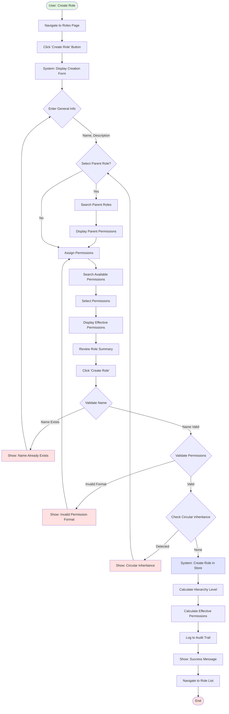
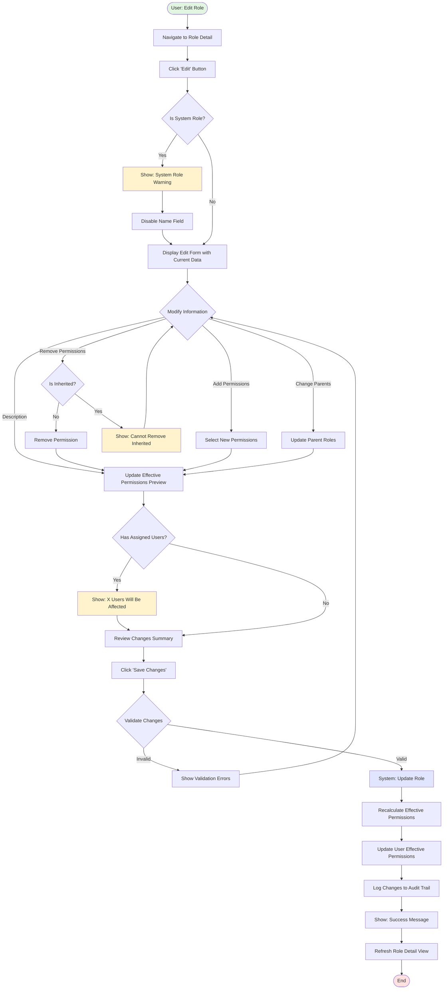
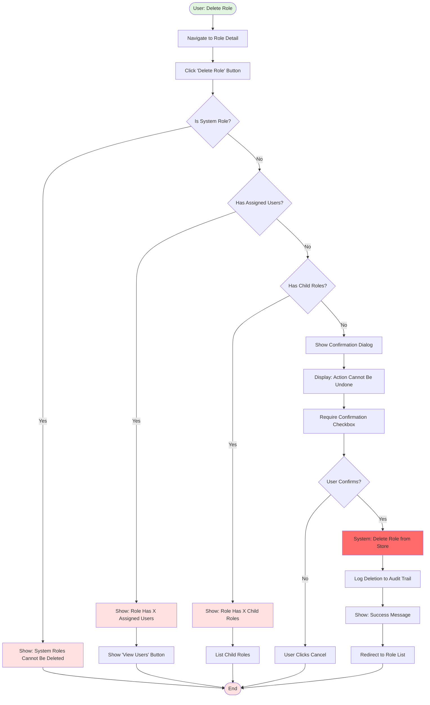
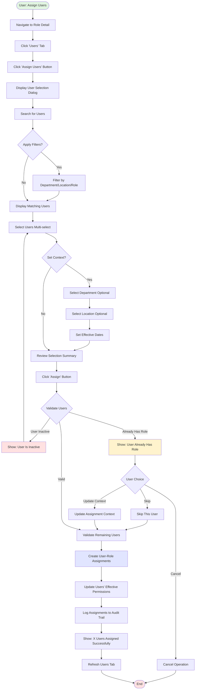
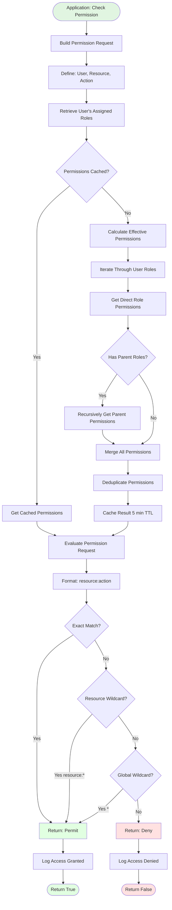
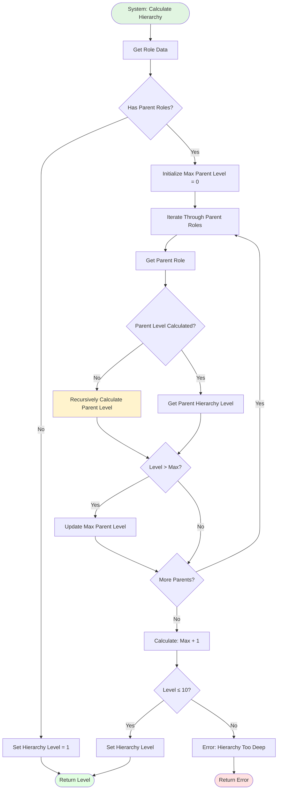
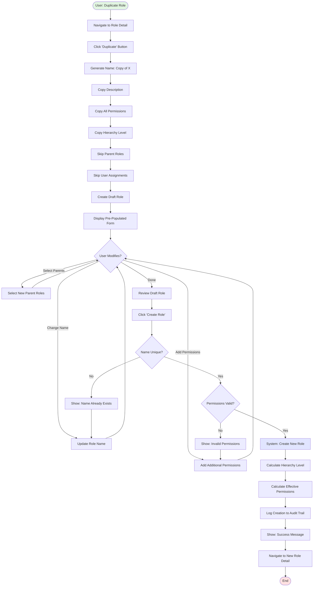
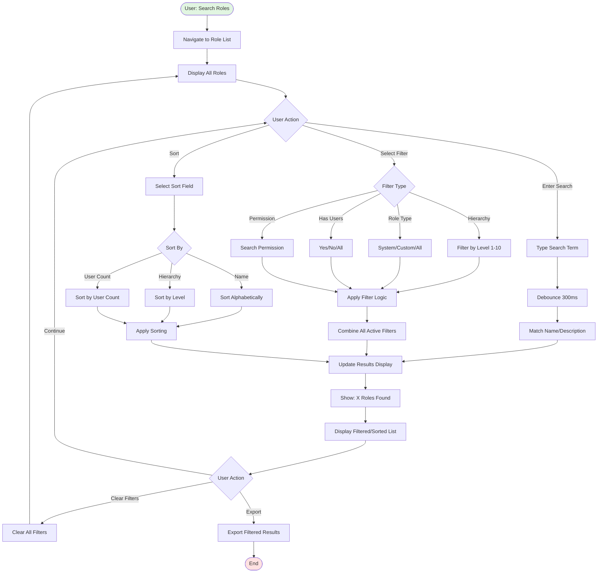

# Permission Management - Flow Diagrams (FD)

**Module**: System Administration - Permission Management
**Version**: 1.0
**Last Updated**: 2025-01-16
**Document Status**: Active

---

## Overview

This document provides visual flow diagrams for the Permission Management module, focusing on current RBAC (Role-Based Access Control) workflows. All diagrams use Mermaid syntax for clarity and maintainability.

**Flow Diagram Index**:
- FD-001: Create New Role Flow
- FD-002: Edit Existing Role Flow
- FD-003: Delete Role Flow
- FD-004: Assign Users to Role Flow
- FD-005: Permission Check Flow
- FD-006: Role Hierarchy Calculation Flow
- FD-007: Duplicate Role Flow
- FD-008: Search and Filter Roles Flow

---

## FD-001: Create New Role Flow

### Description
Complete workflow for creating a new role with permissions and hierarchy configuration.

### Flow Diagram



### Key Decision Points
1. **Parent Role Selection**: Optional but affects hierarchy level
2. **Name Validation**: Must be unique (case-insensitive)
3. **Permission Format Validation**: Must follow "resource:action" pattern
4. **Circular Inheritance Check**: Prevents role A inheriting from role B if B inherits from A

### Validation Rules
- **BR-PM-001**: Role name must be unique
- **BR-PM-002**: Role name must be 3-100 characters
- **BR-PM-003**: Permission format must be "resource:action"
- **BR-PM-004**: Circular inheritance is not allowed

---

## FD-002: Edit Existing Role Flow

### Description
Workflow for modifying an existing role's properties, permissions, and hierarchy relationships.

### Flow Diagram



### Key Decision Points
1. **System Role Check**: System roles have restricted modifications
2. **Inherited Permission Check**: Cannot directly remove inherited permissions
3. **User Impact Check**: Warn when changes affect assigned users

### Business Rules
- **BR-PM-003**: System roles cannot have name changed
- **BR-PM-007**: Inherited permissions cannot be removed directly
- Users with >50 assignments trigger additional confirmation

---

## FD-003: Delete Role Flow

### Description
Workflow for deleting a role with constraint validation and user impact checking.

### Flow Diagram



### Constraint Validation
1. **System Role Check**: System roles cannot be deleted
2. **User Assignment Check**: Role must have no assigned users
3. **Child Role Check**: Role must have no child roles
4. **User Confirmation**: Requires explicit confirmation

### Business Rules
- **BR-PM-004**: System roles cannot be deleted
- **BR-PM-006**: Cannot delete role with assigned users or child roles

---

## FD-004: Assign Users to Role Flow

### Description
Workflow for assigning one or more users to a role with optional context restrictions.

### Flow Diagram



### Assignment Context Options
- **Department**: Restricts role permissions to specific department
- **Location**: Restricts role permissions to specific location
- **Effective From**: Start date for role assignment
- **Effective To**: Optional expiration date for time-bound assignments

### Business Rules
- **BR-PM-005**: Users can have multiple roles
- **BR-PM-005**: Role assignments can be time-bound
- Users must be active to receive role assignments

---

## FD-005: Permission Check Flow

### Description
Runtime permission check flow using the access decision engine.

### Flow Diagram



### Permission Matching Logic
1. **Exact Match**: `purchase_request:create` matches `purchase_request:create`
2. **Resource Wildcard**: `purchase_request:*` matches any action on purchase_request
3. **Global Wildcard**: `*` matches any permission (System Administrator only)

### Performance Considerations
- Effective permissions cached for 5 minutes
- Role hierarchy pre-calculated and cached for 15 minutes
- Permission checks must complete within 50ms

---

## FD-006: Role Hierarchy Calculation Flow

### Description
Algorithm for calculating role hierarchy level based on parent relationships.

### Flow Diagram



### Hierarchy Calculation Rules
1. Roles with no parents have hierarchy level 1
2. Roles with parents have level = max(parent levels) + 1
3. Maximum hierarchy level is 10
4. Circular inheritance is prevented during role creation

### Example Calculation
```
System Administrator (Level 1) ← no parents
└─ General Manager (Level 2) ← parent: System Administrator
   ├─ Finance Director (Level 3) ← parent: General Manager
   └─ Procurement Manager (Level 3) ← parent: General Manager
      └─ Purchasing Staff (Level 4) ← parent: Procurement Manager
```

---

## FD-007: Duplicate Role Flow

### Description
Workflow for creating a new role based on an existing role template.

### Flow Diagram



### Duplication Rules
- **Copied**: Name (with prefix), Description, Permissions, Hierarchy Level
- **NOT Copied**: Parent roles, User assignments, Audit history
- **Modified**: Name automatically prefixed with "Copy of"

---

## FD-008: Search and Filter Roles Flow

### Description
Real-time search and filtering workflow for finding specific roles.

### Flow Diagram



### Search and Filter Features
- **Real-time Search**: 300ms debounce for performance
- **Multi-Filter Support**: Multiple filters applied simultaneously
- **Sorting Options**: Name, hierarchy, user count
- **Export Capability**: Export filtered results to CSV/Excel
- **Filter Persistence**: Filter state persists during session

### Filter Combination Logic
```typescript
filteredRoles = allRoles
  .filter(role => role.name.includes(searchTerm) || role.description?.includes(searchTerm))
  .filter(role => hierarchyFilter ? role.hierarchy === hierarchyFilter : true)
  .filter(role => typeFilter === 'system' ? role.isSystem : typeFilter === 'custom' ? !role.isSystem : true)
  .filter(role => hasUsersFilter !== 'all' ? (hasUsersFilter === 'yes' ? role.userCount > 0 : role.userCount === 0) : true)
  .filter(role => permissionFilter ? role.effectivePermissions.includes(permissionFilter) : true)
  .sort(sortFunction)
```

---

## Data Flow Summary

### Create/Edit Operations
```
User Input → Form Validation → Business Rule Validation → Data Store Update →
Effective Permissions Calculation → Cache Invalidation → Audit Logging → UI Update
```

### Permission Check Operations
```
Permission Request → User Role Retrieval → Cache Check →
Effective Permission Calculation → Permission Matching →
Access Decision → Audit Logging → Return Result
```

### Role Hierarchy Operations
```
Role Data → Parent Retrieval → Recursive Level Calculation →
Max Parent Level + 1 → Validation (≤10) → Store Hierarchy Level
```

---

## Performance Metrics

| Operation | Target Time | Cache Strategy |
|-----------|-------------|----------------|
| Permission Check | <50ms | 5-minute TTL on effective permissions |
| Role List Load | <500ms | 30-minute TTL on role list |
| Hierarchy Calculation | <100ms | 15-minute TTL on hierarchy tree |
| Search/Filter | <200ms | No cache (real-time) |
| Create Role | <1000ms | Invalidate role cache |
| Edit Role | <1000ms | Invalidate role + user permission cache |

---

## Error Handling Patterns

### Validation Errors
- Display inline error messages at field level
- Highlight invalid fields with red border
- Provide clear correction instructions
- Prevent submission until all errors resolved

### System Errors
- Display user-friendly error message
- Log detailed error to console and audit trail
- Provide retry option
- Offer support contact if error persists

### Constraint Violations
- Prevent operation before execution
- Display clear explanation of constraint
- Provide actionable next steps
- Show affected entities (users, child roles)

---

**Document Control**:
- **Created**: 2025-01-16
- **Version**: 1.0
- **Status**: Active
- **Review Cycle**: Quarterly
