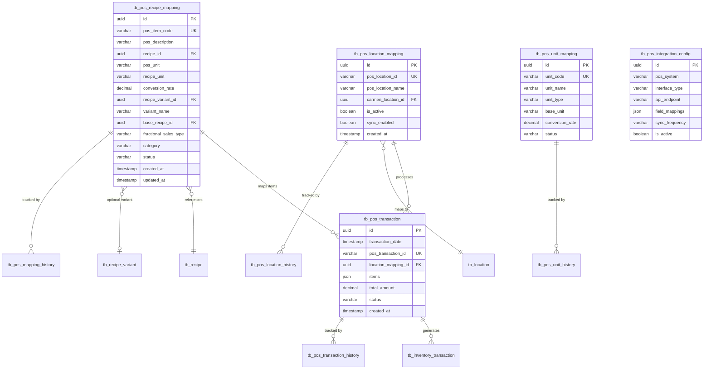

# System Integrations - Data Schema (DS)

**Module**: System Administration - System Integrations
**Version**: 1.0
**Last Updated**: 2025-01-16
**Implementation Status**: Planned (Mock Data Currently)

---

## 1. Overview

### 1.1 Current State
- **Status**: Mock data implementation using TypeScript files
- **Storage**: In-memory objects in `data.ts` files
- **Location**: `app/(main)/system-administration/system-integrations/pos/mapping/*/data.ts`

### 1.2 Planned Implementation
- **Database**: PostgreSQL 15+ (via Supabase)
- **ORM**: Prisma 5.x
- **Migration**: Q2 2025
- **Schema Location**: `prisma/schema.prisma` (to be created)

---

## 2. Planned Database Schema

### 2.1 Core Tables

#### tb_pos_recipe_mapping
Stores POS-to-Recipe mappings with fractional sales support.

```prisma
model tb_pos_recipe_mapping {
  id                 String    @id @default(dbgenerated("gen_random_uuid()")) @db.Uuid
  pos_item_code      String    @db.VarChar(50)
  pos_description    String    @db.VarChar(255)
  recipe_id          String    @db.Uuid
  pos_unit           String    @db.VarChar(50)
  recipe_unit        String    @db.VarChar(50)
  conversion_rate    Decimal   @db.Decimal(18, 8)

  // Fractional sales support
  recipe_variant_id       String?  @db.Uuid
  variant_name            String?  @db.VarChar(100)
  base_recipe_id          String?  @db.Uuid
  fractional_sales_type   String?  @db.VarChar(50) // 'pizza-slice' | 'cake-slice' | 'bottle-glass' | 'portion-control' | 'custom'

  category           String    @db.VarChar(100)
  status             String    @db.VarChar(20)  // 'mapped' | 'unmapped' | 'error'
  last_sync_date     DateTime? @db.Timestamptz(6)
  last_sync_status   String?   @db.VarChar(20)
  is_active          Boolean   @default(true)

  // Audit fields
  created_at         DateTime  @default(now()) @db.Timestamptz(6)
  created_by_id      String?   @db.Uuid
  updated_at         DateTime  @default(now()) @db.Timestamptz(6)
  updated_by_id      String?   @db.Uuid
  deleted_at         DateTime? @db.Timestamptz(6)
  deleted_by_id      String?   @db.Uuid

  // Relations
  recipe             tb_recipe         @relation(fields: [recipe_id], references: [id], onDelete: Restrict)
  recipe_variant     tb_recipe_variant? @relation(fields: [recipe_variant_id], references: [id])
  base_recipe        tb_recipe?        @relation("BaseRecipe", fields: [base_recipe_id], references: [id])
  transactions       tb_pos_transaction[]
  mapping_history    tb_pos_mapping_history[]

  @@unique([pos_item_code, deleted_at])
  @@index([recipe_id])
  @@index([status])
  @@index([category])
  @@index([fractional_sales_type])
  @@index([created_at])
  @@map("tb_pos_recipe_mapping")
}
```

**Constraints**:
- Primary Key: `id` (UUID)
- Unique: `(pos_item_code, deleted_at)` - allows soft delete and recreation
- Foreign Keys:
  - `recipe_id` → `tb_recipe.id` (Restrict - prevent deletion if mapped)
  - `recipe_variant_id` → `tb_recipe_variant.id` (optional)
  - `base_recipe_id` → `tb_recipe.id` (optional, for multi-variant mappings)
- Check: `conversion_rate > 0`
- Check: `status IN ('mapped', 'unmapped', 'error')`
- Check: `deleted_at IS NULL OR deleted_by_id IS NOT NULL`

**Sample Data**:
```json
{
  "id": "550e8400-e29b-41d4-a716-446655440001",
  "pos_item_code": "POS009",
  "pos_description": "Pizza Slice - Margherita",
  "recipe_id": "recipe-uuid-123",
  "pos_unit": "Slice",
  "recipe_unit": "large pizza",
  "conversion_rate": 0.125,
  "recipe_variant_id": "variant-uuid-456",
  "variant_name": "Pizza Slice",
  "base_recipe_id": "recipe-uuid-123",
  "fractional_sales_type": "pizza-slice",
  "category": "Main Course",
  "status": "mapped",
  "is_active": true
}
```

---

#### tb_pos_unit_mapping
Stores unit conversion mappings between POS and Carmen units.

```prisma
model tb_pos_unit_mapping {
  id              String    @id @default(dbgenerated("gen_random_uuid()")) @db.Uuid
  unit_code       String    @unique @db.VarChar(50)
  unit_name       String    @db.VarChar(100)
  unit_type       String    @db.VarChar(20)  // 'recipe' | 'sales' | 'both'
  base_unit       String    @db.VarChar(50)
  conversion_rate Decimal   @db.Decimal(18, 8)
  status          String    @db.VarChar(20)  // 'active' | 'inactive'
  last_used       DateTime? @db.Timestamptz(6)

  // Audit fields
  created_at      DateTime  @default(now()) @db.Timestamptz(6)
  created_by_id   String?   @db.Uuid
  updated_at      DateTime  @default(now()) @db.Timestamptz(6)
  updated_by_id   String?   @db.Uuid
  deleted_at      DateTime? @db.Timestamptz(6)
  deleted_by_id   String?   @db.Uuid

  // Relations
  recipe_mappings tb_pos_recipe_mapping[]
  unit_history    tb_pos_unit_history[]

  @@index([unit_type])
  @@index([status])
  @@map("tb_pos_unit_mapping")
}
```

**Constraints**:
- Primary Key: `id` (UUID)
- Unique: `unit_code`
- Check: `conversion_rate > 0`
- Check: `unit_type IN ('recipe', 'sales', 'both')`
- Check: `status IN ('active', 'inactive')`

**Sample Data**:
```json
{
  "id": "550e8400-e29b-41d4-a716-446655440002",
  "unit_code": "KG",
  "unit_name": "Kilogram",
  "unit_type": "both",
  "base_unit": "G",
  "conversion_rate": 1000.0,
  "status": "active"
}
```

---

#### tb_pos_location_mapping
Maps POS locations to Carmen locations.

```prisma
model tb_pos_location_mapping {
  id                  String    @id @default(dbgenerated("gen_random_uuid()")) @db.Uuid
  pos_location_id     String    @db.VarChar(50)
  pos_location_name   String    @db.VarChar(255)
  pos_location_code   String?   @db.VarChar(50)
  carmen_location_id  String    @db.Uuid
  carmen_location_type String   @db.VarChar(50)
  is_active           Boolean   @default(true)
  sync_enabled        Boolean   @default(true)
  mapped_at           DateTime  @default(now()) @db.Timestamptz(6)
  notes               String?   @db.Text

  // Audit fields
  created_at          DateTime  @default(now()) @db.Timestamptz(6)
  created_by_id       String?   @db.Uuid
  updated_at          DateTime  @default(now()) @db.Timestamptz(6)
  updated_by_id       String?   @db.Uuid
  deleted_at          DateTime? @db.Timestamptz(6)
  deleted_by_id       String?   @db.Uuid

  // Relations
  carmen_location     tb_location          @relation(fields: [carmen_location_id], references: [id], onDelete: Restrict)
  transactions        tb_pos_transaction[]
  location_history    tb_pos_location_history[]

  @@unique([pos_location_id, deleted_at])
  @@index([carmen_location_id])
  @@index([is_active])
  @@map("tb_pos_location_mapping")
}
```

**Constraints**:
- Primary Key: `id` (UUID)
- Unique: `(pos_location_id, deleted_at)`
- Foreign Key: `carmen_location_id` → `tb_location.id` (Restrict)

---

#### tb_pos_transaction
Stores POS transactions for processing and tracking.

```prisma
model tb_pos_transaction {
  id                   String    @id @default(dbgenerated("gen_random_uuid()")) @db.Uuid
  transaction_date     DateTime  @db.Timestamptz(6)
  pos_transaction_id   String    @unique @db.VarChar(100)
  pos_location_id      String    @db.VarChar(50)
  location_mapping_id  String    @db.Uuid
  items                Json      @db.Json  // Array of transaction items
  total_amount         Decimal   @db.Decimal(18, 2)
  status               String    @db.VarChar(20)  // 'received' | 'validating' | 'pending_approval' | 'approved' | 'processing' | 'processed' | 'failed' | 'rejected' | 'ignored'
  validation_errors    Json?     @db.Json
  failure_reason       String?   @db.Text
  processed_at         DateTime? @db.Timestamptz(6)
  approved_by_id       String?   @db.Uuid
  approved_at          DateTime? @db.Timestamptz(6)
  approval_notes       String?   @db.Text

  // Audit fields
  created_at           DateTime  @default(now()) @db.Timestamptz(6)
  created_by_id        String?   @db.Uuid
  updated_at           DateTime  @default(now()) @db.Timestamptz(6)
  updated_by_id        String?   @db.Uuid

  // Relations
  location_mapping     tb_pos_location_mapping @relation(fields: [location_mapping_id], references: [id])
  recipe_mappings      tb_pos_recipe_mapping[]
  inventory_transactions tb_inventory_transaction[]
  transaction_history  tb_pos_transaction_history[]

  @@index([transaction_date])
  @@index([status])
  @@index([pos_location_id])
  @@index([created_at])
  @@map("tb_pos_transaction")
}
```

**Constraints**:
- Primary Key: `id` (UUID)
- Unique: `pos_transaction_id`
- Foreign Key: `location_mapping_id` → `tb_pos_location_mapping.id`
- Check: `status IN ('received', 'validating', 'pending_approval', 'approved', 'processing', 'processed', 'failed', 'rejected', 'ignored')`
- Check: `total_amount >= 0`

**items JSON Structure**:
```json
[
  {
    "code": "POS001",
    "name": "Chicken Curry",
    "category": "Main Course",
    "quantity": 2,
    "unitPrice": 12.75,
    "totalPrice": 25.50,
    "recipeMapping": {
      "id": "mapping-uuid-123",
      "recipeId": "recipe-uuid-456",
      "conversionRate": 1.0
    }
  }
]
```

---

#### tb_pos_failed_transaction
Stores failed transactions for review and resolution.

```prisma
model tb_pos_failed_transaction {
  id                   String    @id @default(dbgenerated("gen_random_uuid()")) @db.Uuid
  pos_transaction_id   String    @db.VarChar(100)
  transaction_data     Json      @db.Json  // Original transaction payload
  failure_type         String    @db.VarChar(50)  // 'unmapped_item' | 'invalid_location' | 'validation_error' | 'processing_error'
  failure_reason       String    @db.Text
  failure_details      Json?     @db.Json
  retry_count          Int       @default(0)
  last_retry_at        DateTime? @db.Timestamptz(6)
  resolution_status    String    @db.VarChar(20)  // 'pending' | 'resolved' | 'ignored' | 'manual_intervention'
  resolved_by_id       String?   @db.Uuid
  resolved_at          DateTime? @db.Timestamptz(6)
  resolution_notes     String?   @db.Text

  // Audit fields
  created_at           DateTime  @default(now()) @db.Timestamptz(6)
  updated_at           DateTime  @default(now()) @db.Timestamptz(6)

  @@index([failure_type])
  @@index([resolution_status])
  @@index([created_at])
  @@map("tb_pos_failed_transaction")
}
```

**Constraints**:
- Primary Key: `id` (UUID)
- Check: `failure_type IN ('unmapped_item', 'invalid_location', 'validation_error', 'processing_error')`
- Check: `resolution_status IN ('pending', 'resolved', 'ignored', 'manual_intervention')`
- Check: `retry_count >= 0`

---

#### tb_pos_integration_config
Stores POS system configuration settings.

```prisma
model tb_pos_integration_config {
  id                   String    @id @default(dbgenerated("gen_random_uuid()")) @db.Uuid
  pos_system           String    @db.VarChar(100)  // 'oracle-simphony' | 'micros' | 'toast' | 'square' | 'clover'
  interface_type       String    @db.VarChar(20)   // 'api' | 'file'

  // API Configuration
  api_endpoint         String?   @db.VarChar(500)
  api_method           String?   @db.VarChar(10)   // 'GET' | 'POST'
  security_token       String?   @db.Text          // Encrypted
  auth_type            String?   @db.VarChar(50)   // 'bearer' | 'api-key' | 'basic'

  // File Configuration
  file_path            String?   @db.VarChar(500)
  file_pattern         String?   @db.VarChar(100)
  file_format          String?   @db.VarChar(20)   // 'csv' | 'json' | 'xml'

  // Field Mapping
  field_mappings       Json      @db.Json

  // Sync Schedule
  sync_frequency       String    @db.VarChar(20)   // 'real-time' | 'hourly' | 'daily'
  sync_time            String?   @db.VarChar(10)   // HH:MM for scheduled sync
  last_sync            DateTime? @db.Timestamptz(6)
  next_sync            DateTime? @db.Timestamptz(6)

  // Status
  is_active            Boolean   @default(true)
  connection_status    String    @db.VarChar(20)   // 'connected' | 'disconnected' | 'error'
  last_connection_test DateTime? @db.Timestamptz(6)
  connection_error     String?   @db.Text

  // Audit fields
  created_at           DateTime  @default(now()) @db.Timestamptz(6)
  created_by_id        String?   @db.Uuid
  updated_at           DateTime  @default(now()) @db.Timestamptz(6)
  updated_by_id        String?   @db.Uuid

  @@index([pos_system])
  @@index([is_active])
  @@map("tb_pos_integration_config")
}
```

**field_mappings JSON Structure**:
```json
[
  {
    "posField": "item_code",
    "systemField": "posItemCode",
    "dataType": "string",
    "required": true
  },
  {
    "posField": "description",
    "systemField": "posDescription",
    "dataType": "string",
    "required": true
  },
  {
    "posField": "price",
    "systemField": "price",
    "dataType": "decimal",
    "required": true
  },
  {
    "posField": "quantity",
    "systemField": "quantity",
    "dataType": "decimal",
    "required": true
  }
]
```

---

### 2.2 Audit & History Tables

#### tb_pos_mapping_history
Tracks changes to recipe mappings for audit purposes.

```prisma
model tb_pos_mapping_history {
  id              String   @id @default(dbgenerated("gen_random_uuid()")) @db.Uuid
  mapping_id      String   @db.Uuid
  mapping_type    String   @db.VarChar(20)  // 'recipe' | 'unit' | 'location'
  action          String   @db.VarChar(20)  // 'created' | 'updated' | 'deleted' | 'tested'
  changes         Json     @db.Json         // Before/after values
  performed_by_id String   @db.Uuid
  performed_at    DateTime @default(now()) @db.Timestamptz(6)
  ip_address      String?  @db.VarChar(45)
  user_agent      String?  @db.VarChar(255)

  // Relations
  recipe_mapping  tb_pos_recipe_mapping? @relation(fields: [mapping_id], references: [id])

  @@index([mapping_id])
  @@index([mapping_type])
  @@index([action])
  @@index([performed_at])
  @@map("tb_pos_mapping_history")
}
```

#### tb_pos_transaction_history
Tracks transaction status changes and processing steps.

```prisma
model tb_pos_transaction_history {
  id              String   @id @default(dbgenerated("gen_random_uuid()")) @db.Uuid
  transaction_id  String   @db.Uuid
  previous_status String   @db.VarChar(20)
  new_status      String   @db.VarChar(20)
  notes           String?  @db.Text
  changed_by_id   String?  @db.Uuid
  changed_at      DateTime @default(now()) @db.Timestamptz(6)

  // Relations
  transaction     tb_pos_transaction @relation(fields: [transaction_id], references: [id])

  @@index([transaction_id])
  @@index([changed_at])
  @@map("tb_pos_transaction_history")
}
```

#### tb_pos_unit_history
Tracks changes to unit mappings.

```prisma
model tb_pos_unit_history {
  id            String   @id @default(dbgenerated("gen_random_uuid()")) @db.Uuid
  unit_id       String   @db.Uuid
  action        String   @db.VarChar(20)
  changes       Json     @db.Json
  changed_by_id String   @db.Uuid
  changed_at    DateTime @default(now()) @db.Timestamptz(6)

  // Relations
  unit_mapping  tb_pos_unit_mapping @relation(fields: [unit_id], references: [id])

  @@index([unit_id])
  @@index([changed_at])
  @@map("tb_pos_unit_history")
}
```

#### tb_pos_location_history
Tracks changes to location mappings.

```prisma
model tb_pos_location_history {
  id              String   @id @default(dbgenerated("gen_random_uuid()")) @db.Uuid
  location_id     String   @db.Uuid
  action          String   @db.VarChar(20)
  changes         Json     @db.Json
  changed_by_id   String   @db.Uuid
  changed_at      DateTime @default(now()) @db.Timestamptz(6)

  // Relations
  location_mapping tb_pos_location_mapping @relation(fields: [location_id], references: [id])

  @@index([location_id])
  @@index([changed_at])
  @@map("tb_pos_location_history")
}
```

---

## 3. Enumerations

### 3.1 Planned Enums

```prisma
enum enum_pos_mapping_status {
  mapped
  unmapped
  error
}

enum enum_pos_unit_type {
  recipe
  sales
  both
}

enum enum_pos_transaction_status {
  received
  validating
  pending_approval
  approved
  processing
  processed
  failed
  rejected
  ignored
}

enum enum_pos_failure_type {
  unmapped_item
  invalid_location
  validation_error
  processing_error
}

enum enum_pos_resolution_status {
  pending
  resolved
  ignored
  manual_intervention
}

enum enum_pos_fractional_sales_type {
  pizza_slice
  cake_slice
  bottle_glass
  portion_control
  custom
}

enum enum_pos_interface_type {
  api
  file
}

enum enum_pos_sync_frequency {
  real_time
  hourly
  daily
}

enum enum_pos_connection_status {
  connected
  disconnected
  error
}
```

---

## 4. Relationships & ERD

### 4.1 Entity Relationships

```
tb_recipe (1) ──< (N) tb_pos_recipe_mapping
tb_recipe_variant (1) ──< (N) tb_pos_recipe_mapping
tb_location (1) ──< (N) tb_pos_location_mapping
tb_pos_location_mapping (1) ──< (N) tb_pos_transaction
tb_pos_recipe_mapping (1) ──< (N) tb_pos_transaction
tb_pos_transaction (1) ──< (N) tb_inventory_transaction
tb_pos_transaction (1) ──< (N) tb_pos_transaction_history
tb_pos_recipe_mapping (1) ──< (N) tb_pos_mapping_history
tb_pos_unit_mapping (1) ──< (N) tb_pos_unit_history
tb_pos_location_mapping (1) ──< (N) tb_pos_location_history
```

### 4.2 ERD Diagram



---

## 5. Indexes

### 5.1 Performance Indexes

```sql
-- Recipe Mapping Indexes
CREATE INDEX idx_recipe_mapping_recipe_id ON tb_pos_recipe_mapping(recipe_id);
CREATE INDEX idx_recipe_mapping_status ON tb_pos_recipe_mapping(status);
CREATE INDEX idx_recipe_mapping_category ON tb_pos_recipe_mapping(category);
CREATE INDEX idx_recipe_mapping_fractional_type ON tb_pos_recipe_mapping(fractional_sales_type);
CREATE INDEX idx_recipe_mapping_created_at ON tb_pos_recipe_mapping(created_at);
CREATE UNIQUE INDEX idx_recipe_mapping_pos_code_deleted ON tb_pos_recipe_mapping(pos_item_code, deleted_at);

-- Location Mapping Indexes
CREATE INDEX idx_location_mapping_carmen_location ON tb_pos_location_mapping(carmen_location_id);
CREATE INDEX idx_location_mapping_is_active ON tb_pos_location_mapping(is_active);
CREATE UNIQUE INDEX idx_location_mapping_pos_id_deleted ON tb_pos_location_mapping(pos_location_id, deleted_at);

-- Transaction Indexes
CREATE INDEX idx_transaction_date ON tb_pos_transaction(transaction_date);
CREATE INDEX idx_transaction_status ON tb_pos_transaction(status);
CREATE INDEX idx_transaction_pos_location ON tb_pos_transaction(pos_location_id);
CREATE INDEX idx_transaction_created_at ON tb_pos_transaction(created_at);
CREATE UNIQUE INDEX idx_transaction_pos_id ON tb_pos_transaction(pos_transaction_id);

-- Failed Transaction Indexes
CREATE INDEX idx_failed_transaction_type ON tb_pos_failed_transaction(failure_type);
CREATE INDEX idx_failed_transaction_resolution ON tb_pos_failed_transaction(resolution_status);
CREATE INDEX idx_failed_transaction_created_at ON tb_pos_failed_transaction(created_at);

-- History Indexes
CREATE INDEX idx_mapping_history_mapping_id ON tb_pos_mapping_history(mapping_id);
CREATE INDEX idx_mapping_history_type ON tb_pos_mapping_history(mapping_type);
CREATE INDEX idx_mapping_history_action ON tb_pos_mapping_history(action);
CREATE INDEX idx_mapping_history_performed_at ON tb_pos_mapping_history(performed_at);

CREATE INDEX idx_transaction_history_transaction_id ON tb_pos_transaction_history(transaction_id);
CREATE INDEX idx_transaction_history_changed_at ON tb_pos_transaction_history(changed_at);

-- Unit Mapping Indexes
CREATE INDEX idx_unit_mapping_type ON tb_pos_unit_mapping(unit_type);
CREATE INDEX idx_unit_mapping_status ON tb_pos_unit_mapping(status);

-- Integration Config Indexes
CREATE INDEX idx_integration_config_pos_system ON tb_pos_integration_config(pos_system);
CREATE INDEX idx_integration_config_is_active ON tb_pos_integration_config(is_active);
```

---

## 6. Sample Queries

### 6.1 Get Recipe Mappings with Fractional Sales

```sql
-- Get all fractional sales mappings grouped by base recipe
SELECT
  base_recipe_id,
  r.name AS recipe_name,
  fractional_sales_type,
  COUNT(*) AS variant_count,
  JSON_AGG(
    JSON_BUILD_OBJECT(
      'pos_item_code', pos_item_code,
      'variant_name', variant_name,
      'conversion_rate', conversion_rate
    )
    ORDER BY conversion_rate
  ) AS variants
FROM tb_pos_recipe_mapping prm
JOIN tb_recipe r ON r.id = prm.base_recipe_id
WHERE fractional_sales_type IS NOT NULL
  AND deleted_at IS NULL
GROUP BY base_recipe_id, r.name, fractional_sales_type
ORDER BY r.name;
```

**Sample Output**:
```json
[
  {
    "base_recipe_id": "recipe-uuid-123",
    "recipe_name": "Margherita Pizza",
    "fractional_sales_type": "pizza-slice",
    "variant_count": 3,
    "variants": [
      {
        "pos_item_code": "POS009",
        "variant_name": "Pizza Slice",
        "conversion_rate": 0.125
      },
      {
        "pos_item_code": "POS009H",
        "variant_name": "Half Pizza",
        "conversion_rate": 0.5
      },
      {
        "pos_item_code": "POS009W",
        "variant_name": "Whole Pizza",
        "conversion_rate": 1.0
      }
    ]
  }
]
```

### 6.2 Get Unmapped POS Items

```sql
-- Find all unmapped POS items from failed transactions
SELECT DISTINCT
  ft.pos_transaction_id,
  ft.transaction_data->>'item_code' AS pos_item_code,
  ft.transaction_data->>'description' AS pos_description,
  ft.transaction_data->>'category' AS category,
  ft.failure_reason,
  ft.created_at,
  ft.resolution_status
FROM tb_pos_failed_transaction ft
WHERE ft.failure_type = 'unmapped_item'
  AND ft.resolution_status = 'pending'
ORDER BY ft.created_at DESC;
```

### 6.3 Get Transaction Processing Summary

```sql
-- Daily transaction processing summary
SELECT
  DATE(transaction_date) AS date,
  status,
  COUNT(*) AS transaction_count,
  SUM(total_amount) AS total_amount,
  AVG(
    EXTRACT(EPOCH FROM (processed_at - created_at))
  ) / 60 AS avg_processing_time_minutes
FROM tb_pos_transaction
WHERE transaction_date >= CURRENT_DATE - INTERVAL '7 days'
GROUP BY DATE(transaction_date), status
ORDER BY date DESC, status;
```

### 6.4 Get Failed Transactions by Failure Type

```sql
-- Failed transaction breakdown by failure type
SELECT
  failure_type,
  resolution_status,
  COUNT(*) AS count,
  ROUND(
    COUNT(*) * 100.0 / SUM(COUNT(*)) OVER (),
    2
  ) AS percentage
FROM tb_pos_failed_transaction
WHERE created_at >= CURRENT_DATE - INTERVAL '30 days'
GROUP BY failure_type, resolution_status
ORDER BY count DESC;
```

### 6.5 Get Active POS Integration Configuration

```sql
-- Get current active POS configuration with last sync status
SELECT
  pic.pos_system,
  pic.interface_type,
  pic.sync_frequency,
  pic.last_sync,
  pic.next_sync,
  pic.connection_status,
  COUNT(pt.id) AS total_transactions_today,
  COUNT(pt.id) FILTER (WHERE pt.status = 'processed') AS processed_today,
  COUNT(pt.id) FILTER (WHERE pt.status = 'failed') AS failed_today
FROM tb_pos_integration_config pic
LEFT JOIN tb_pos_transaction pt ON DATE(pt.created_at) = CURRENT_DATE
WHERE pic.is_active = true
GROUP BY pic.id;
```

---

## 7. Data Constraints

### 7.1 Database Constraints

```sql
-- Recipe Mapping Constraints
ALTER TABLE tb_pos_recipe_mapping
ADD CONSTRAINT tb_pos_recipe_mapping_conversion_rate_positive
CHECK (conversion_rate > 0);

ALTER TABLE tb_pos_recipe_mapping
ADD CONSTRAINT tb_pos_recipe_mapping_status_valid
CHECK (status IN ('mapped', 'unmapped', 'error'));

ALTER TABLE tb_pos_recipe_mapping
ADD CONSTRAINT tb_pos_recipe_mapping_soft_delete
CHECK ((deleted_at IS NULL AND deleted_by_id IS NULL) OR
       (deleted_at IS NOT NULL AND deleted_by_id IS NOT NULL));

-- Transaction Constraints
ALTER TABLE tb_pos_transaction
ADD CONSTRAINT tb_pos_transaction_status_valid
CHECK (status IN ('received', 'validating', 'pending_approval', 'approved', 'processing', 'processed', 'failed', 'rejected', 'ignored'));

ALTER TABLE tb_pos_transaction
ADD CONSTRAINT tb_pos_transaction_amount_non_negative
CHECK (total_amount >= 0);

-- Failed Transaction Constraints
ALTER TABLE tb_pos_failed_transaction
ADD CONSTRAINT tb_pos_failed_transaction_failure_type_valid
CHECK (failure_type IN ('unmapped_item', 'invalid_location', 'validation_error', 'processing_error'));

ALTER TABLE tb_pos_failed_transaction
ADD CONSTRAINT tb_pos_failed_transaction_resolution_status_valid
CHECK (resolution_status IN ('pending', 'resolved', 'ignored', 'manual_intervention'));

ALTER TABLE tb_pos_failed_transaction
ADD CONSTRAINT tb_pos_failed_transaction_retry_count_non_negative
CHECK (retry_count >= 0);

-- Unit Mapping Constraints
ALTER TABLE tb_pos_unit_mapping
ADD CONSTRAINT tb_pos_unit_mapping_conversion_rate_positive
CHECK (conversion_rate > 0);

ALTER TABLE tb_pos_unit_mapping
ADD CONSTRAINT tb_pos_unit_mapping_unit_type_valid
CHECK (unit_type IN ('recipe', 'sales', 'both'));
```

### 7.2 Application-Level Constraints

- **Unique POS Item Codes**: Enforce uniqueness across active mappings (soft delete aware)
- **Fractional Sales Validation**: Ensure conversion rate is ≤ 1.0 for fractional sales
- **Base Recipe Consistency**: Verify base_recipe_id matches recipe_id for fractional sales
- **Transaction Completeness**: Validate all required fields in transaction items JSON
- **Location Mapping Active**: Only allow transactions for active location mappings
- **Status Transitions**: Enforce valid status transition rules (e.g., can't skip from 'received' to 'processed')

---

## 8. Migration Strategy

### 8.1 Data Migration Steps

**Phase 1: Schema Creation (Week 1-2)**
1. Create all core tables with indexes and constraints
2. Create audit/history tables
3. Set up foreign key relationships
4. Test schema integrity with sample data

**Phase 2: Mock Data Migration (Week 3)**
1. Export current mock data from TypeScript files
2. Transform to database-compatible format
3. Import into PostgreSQL tables
4. Validate data integrity and relationships
5. Create seed data for development/testing

**Phase 3: Application Updates (Week 4-6)**
1. Replace mock data imports with Prisma queries
2. Implement CRUD operations with server actions
3. Add proper error handling and validation
4. Update UI components to use fetched data
5. Implement optimistic updates with React Query

**Phase 4: Testing & Validation (Week 7)**
1. Unit tests for database queries
2. Integration tests for CRUD operations
3. E2E tests for complete workflows
4. Performance testing for large datasets
5. Security testing for data access

**Phase 5: Production Deployment (Week 8)**
1. Backup existing data (if any)
2. Deploy schema to production
3. Run data migration scripts
4. Monitor for issues
5. Gradual rollout to users

---

## 9. Performance Considerations

### 9.1 Query Optimization

- **Recipe Mapping Lookup**: Index on `pos_item_code` for O(1) lookup
- **Transaction Processing**: Composite index on `(status, created_at)` for efficient filtering
- **Fractional Sales Queries**: Index on `(base_recipe_id, fractional_sales_type)` for variant lookups
- **History Tables**: Partitioning by month for large audit logs
- **Location Mapping**: Index on `carmen_location_id` for reverse lookups

### 9.2 Caching Strategy

```typescript
// React Query caching configuration
const queryConfig = {
  recipeMappings: { staleTime: 5 * 60 * 1000 }, // 5 minutes
  unitMappings: { staleTime: 15 * 60 * 1000 },  // 15 minutes
  locationMappings: { staleTime: 30 * 60 * 1000 }, // 30 minutes
  transactions: { staleTime: 1 * 60 * 1000 },   // 1 minute
  config: { staleTime: 60 * 60 * 1000 },        // 1 hour
}
```

### 9.3 Pagination & Infinite Scroll

```sql
-- Cursor-based pagination for transactions
SELECT *
FROM tb_pos_transaction
WHERE created_at < $cursor_timestamp
  AND status = $status
ORDER BY created_at DESC
LIMIT $page_size;
```

---

## 10. Validation Rules

### 10.1 Field Validation

| Table | Field | Type | Rules |
|-------|-------|------|-------|
| tb_pos_recipe_mapping | pos_item_code | String | Required, 1-50 chars, unique |
| tb_pos_recipe_mapping | pos_description | String | Required, 1-255 chars |
| tb_pos_recipe_mapping | conversion_rate | Decimal | Required, > 0, ≤ 1000 |
| tb_pos_recipe_mapping | fractional_sales_type | Enum | Optional, valid enum value |
| tb_pos_location_mapping | pos_location_id | String | Required, 1-50 chars, unique |
| tb_pos_transaction | pos_transaction_id | String | Required, 1-100 chars, unique |
| tb_pos_transaction | total_amount | Decimal | Required, ≥ 0 |
| tb_pos_transaction | status | Enum | Required, valid enum value |

### 10.2 Business Rule Validation

- **Recipe Mapping Uniqueness**: One POS item can only map to one recipe (excluding soft deletes)
- **Fractional Sales Consistency**: If fractional_sales_type is set, base_recipe_id and recipe_variant_id must be set
- **Location Mapping Activity**: Only active mappings can process transactions
- **Transaction Status Flow**: Must follow valid status transitions (received → validating → approved → processing → processed)
- **Failed Transaction Resolution**: Only pending failed transactions can be resolved

---

## 11. Future Enhancements (Q3 2025+)

### 11.1 Planned Tables

**tb_pos_consumption_report** - Pre-aggregated consumption data for reporting
**tb_pos_gross_profit_report** - Pre-calculated gross profit metrics
**tb_pos_sync_log** - Detailed sync operation logs
**tb_pos_webhook_subscription** - Webhook management for real-time integrations
**tb_pos_api_usage** - API usage tracking and rate limiting

### 11.2 Advanced Features

- **Materialized Views**: For complex reporting queries (consumption, gross profit)
- **Partitioning**: Monthly partitions for transaction and history tables
- **Full-Text Search**: PostgreSQL FTS for recipe/item descriptions
- **Time-Series Data**: TimescaleDB extension for time-series analytics
- **Data Warehouse**: Separate OLAP database for advanced analytics

---

**Document Control**:
- **Created**: 2025-01-16
- **Version**: 1.0
- **Status**: Planned Schema
- **Target Implementation**: Q2 2025
