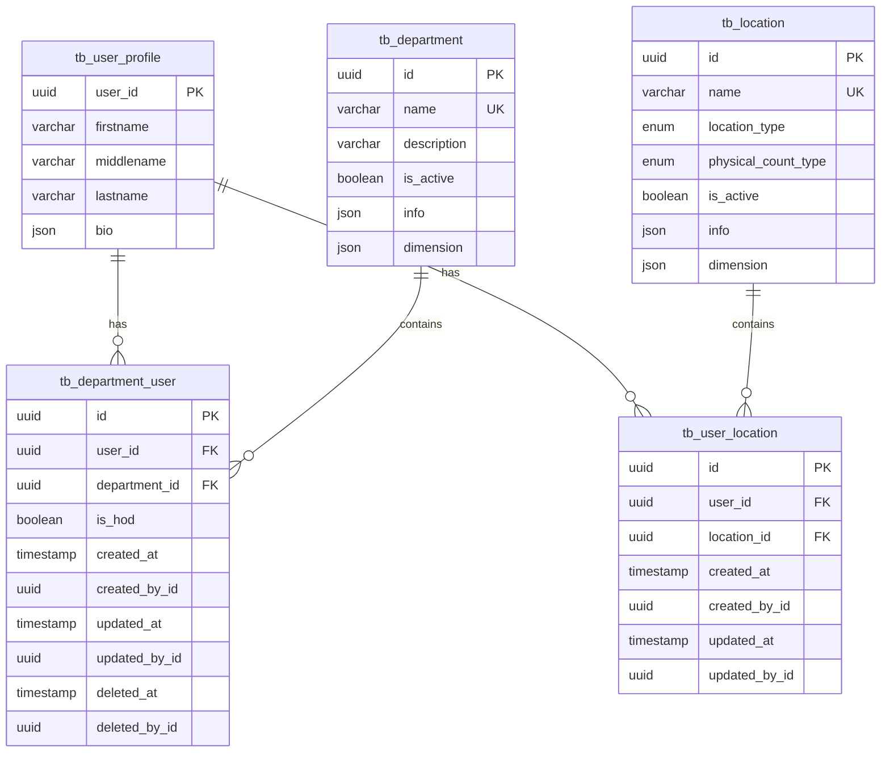

# Data Definition: User Management

## Document Information
- **Module**: System Administration / User Management
- **Version**: 1.0
- **Last Updated**: 2025-01-16
- **Database**: PostgreSQL via Supabase

## Schema Overview

The User Management module uses three primary tables with supporting relationships to departments and locations. All tables follow consistent audit patterns with soft-delete capability.

### Entity Relationship Diagram



## Table Specifications

### tb_user_profile

**Purpose**: Core user profile information and authentication data

**Table Name**: `tb_user_profile`

**Primary Key**: `user_id` (UUID)

**Unique Constraints**: `user_id`

| Column Name | Data Type | Nullable | Default | Description |
|------------|-----------|----------|---------|-------------|
| user_id | UUID | No | - | Unique user identifier (manually set, not auto-generated) |
| firstname | VARCHAR(100) | No | empty string | User's first name |
| middlename | VARCHAR(100) | Yes | empty string | User's middle name (optional) |
| lastname | VARCHAR(100) | Yes | empty string | User's last name (optional) |
| bio | JSON | Yes | {} | Extended user profile data (JSON blob) |

**Indexes**:
- `user_profile_user_id_u` (UNIQUE on `user_id`)

**Business Rules**:
- `user_id` must be set externally (typically from authentication provider)
- Empty strings used as defaults for name fields
- `bio` JSON field can store arbitrary extended attributes

**Example Data**:
```json
{
  "user_id": "a1b2c3d4-e5f6-4789-a0b1-c2d3e4f56789",
  "firstname": "John",
  "middlename": "Michael",
  "lastname": "Doe",
  "bio": {
    "phoneNumber": "+1-555-0123",
    "emergencyContact": "+1-555-0124",
    "employeeId": "EMP-001",
    "dateOfBirth": "1985-01-01",
    "hireDate": "2020-01-01",
    "title": "Head Chef",
    "timezone": "America/New_York",
    "language": "en",
    "profilePhoto": "https://example.com/photos/johndoe.jpg"
  }
}
```

**Relationships**:
- One-to-Many with `tb_department_user` (user has many department assignments)
- One-to-Many with `tb_user_location` (user has many location assignments)

**Notes**:
- This table stores only basic profile information
- Authentication credentials stored separately in authentication provider (Supabase Auth)
- Role and permission data managed by Permission Management module
- No audit fields (created_at, updated_at) in this table

### tb_department_user

**Purpose**: User-to-department assignment with Head of Department (HOD) designation

**Table Name**: `tb_department_user`

**Primary Key**: `id` (UUID)

**Unique Constraints**: `[department_id, user_id]` composite unique

| Column Name | Data Type | Nullable | Default | Description |
|------------|-----------|----------|---------|-------------|
| id | UUID | No | gen_random_uuid() | Unique assignment record ID |
| user_id | UUID | No | - | Foreign key to user profile |
| department_id | UUID | No | - | Foreign key to department |
| is_hod | BOOLEAN | Yes | false | Head of Department designation |
| note | VARCHAR | Yes | - | Assignment notes/remarks |
| info | JSON | Yes | - | Extended assignment metadata |
| dimension | JSON | Yes | - | Dimensional/analytical data |
| doc_version | DECIMAL | No | 0 | Document version for optimistic locking |
| created_at | TIMESTAMPTZ | Yes | now() | Record creation timestamp |
| created_by_id | UUID | Yes | - | User who created the assignment |
| updated_at | TIMESTAMPTZ | Yes | now() | Last modification timestamp |
| updated_by_id | UUID | Yes | - | User who last modified the assignment |
| deleted_at | TIMESTAMPTZ | Yes | - | Soft delete timestamp |
| deleted_by_id | UUID | Yes | - | User who deleted the assignment |

**Foreign Keys**:
- `department_id` → `tb_department.id` (ON DELETE: NO ACTION, ON UPDATE: NO ACTION)

**Indexes**:
- `department_user_u` (UNIQUE on `[department_id, user_id]`)

**Business Rules**:
- A user can be assigned to multiple departments
- A user can be HOD for multiple departments
- Soft delete preserves historical assignments
- `doc_version` increments on each update for concurrency control

**Example Data**:
```json
{
  "id": "11111111-2222-3333-4444-555555555555",
  "user_id": "a1b2c3d4-e5f6-4789-a0b1-c2d3e4f56789",
  "department_id": "dept-001",
  "is_hod": true,
  "note": "Assigned as HOD effective from 2024-01-01",
  "info": {
    "assignmentReason": "promotion",
    "effectiveFrom": "2024-01-01",
    "effectiveTo": "2025-12-31",
    "approvalAuthority": "auto-approve-up-to-25000"
  },
  "dimension": {
    "costCenter": "CC-KITCHEN-01",
    "region": "north-america"
  },
  "doc_version": 1,
  "created_at": "2024-01-01T00:00:00Z",
  "created_by_id": "admin-user-id",
  "updated_at": "2024-01-01T00:00:00Z",
  "updated_by_id": "admin-user-id",
  "deleted_at": null,
  "deleted_by_id": null
}
```

**Query Patterns**:
```sql
-- Get all departments for a user
SELECT d.*
FROM tb_department d
JOIN tb_department_user du ON d.id = du.department_id
WHERE du.user_id = $1
  AND du.deleted_at IS NULL
  AND d.is_active = true;

-- Get all HODs for a department
SELECT u.*
FROM tb_user_profile u
JOIN tb_department_user du ON u.user_id = du.user_id
WHERE du.department_id = $1
  AND du.is_hod = true
  AND du.deleted_at IS NULL;

-- Check if user is HOD of any department
SELECT EXISTS(
  SELECT 1 FROM tb_department_user
  WHERE user_id = $1
    AND is_hod = true
    AND deleted_at IS NULL
);
```

## Document History

| Version | Date | Author | Changes |
|---------|------|--------|---------|
| 1.0.0 | 2025-11-19 | Documentation Team | Initial version |
---

### tb_user_location

**Purpose**: User-to-location assignment for access control

**Table Name**: `tb_user_location`

**Primary Key**: `id` (UUID)

| Column Name | Data Type | Nullable | Default | Description |
|------------|-----------|----------|---------|-------------|
| id | UUID | No | gen_random_uuid() | Unique assignment record ID |
| user_id | UUID | No | - | Foreign key to user profile |
| location_id | UUID | No | - | Foreign key to location |
| note | VARCHAR | Yes | - | Assignment notes |
| info | JSON | Yes | - | Extended assignment metadata |
| created_at | TIMESTAMPTZ | Yes | now() | Record creation timestamp |
| created_by_id | UUID | Yes | - | User who created the assignment |
| updated_at | TIMESTAMPTZ | Yes | now() | Last modification timestamp (note: no auto-update trigger shown) |
| updated_by_id | UUID | Yes | - | User who last modified the assignment |
| deleted_at | TIMESTAMPTZ | Yes | - | Soft delete timestamp |
| deleted_by_id | UUID | Yes | - | User who deleted the assignment |

**Foreign Keys**:
- `location_id` → `tb_location.id` (ON DELETE: NO ACTION, ON UPDATE: NO ACTION)

**Indexes**:
- None explicitly defined (consider adding index on `user_id`)

**Business Rules**:
- A user can be assigned to multiple locations
- Location assignments determine data visibility scope
- Users can only access inventory/transactions at assigned locations
- Soft delete preserves historical assignments

**Example Data**:
```json
{
  "id": "22222222-3333-4444-5555-666666666666",
  "user_id": "a1b2c3d4-e5f6-4789-a0b1-c2d3e4f56789",
  "location_id": "loc-001",
  "note": "Primary location assignment",
  "info": {
    "isPrimary": true,
    "accessLevel": "full",
    "effectiveFrom": "2024-01-01",
    "assignmentType": "permanent"
  },
  "created_at": "2024-01-01T00:00:00Z",
  "created_by_id": "admin-user-id",
  "updated_at": "2024-01-01T00:00:00Z",
  "updated_by_id": "admin-user-id",
  "deleted_at": null,
  "deleted_by_id": null
}
```

**Query Patterns**:
```sql
-- Get all locations for a user
SELECT l.*
FROM tb_location l
JOIN tb_user_location ul ON l.id = ul.location_id
WHERE ul.user_id = $1
  AND ul.deleted_at IS NULL
  AND l.is_active = true;

-- Check if user has access to specific location
SELECT EXISTS(
  SELECT 1 FROM tb_user_location
  WHERE user_id = $1
    AND location_id = $2
    AND deleted_at IS NULL
);

-- Get users assigned to a location
SELECT u.*
FROM tb_user_profile u
JOIN tb_user_location ul ON u.user_id = ul.user_id
WHERE ul.location_id = $1
  AND ul.deleted_at IS NULL;
```

---

## Supporting Tables (Referenced)

### tb_department

**Purpose**: Department master data

**Key Fields** (relevant to user management):
- `id` (UUID): Primary key
- `name` (VARCHAR): Unique department name
- `description` (VARCHAR): Department description
- `is_active` (BOOLEAN): Active status flag
- `info` (JSON): Extended department metadata
- `dimension` (JSON): Dimensional/analytical data

**Relationship**: Referenced by `tb_department_user.department_id`

**Index**: `department_name_u` (on `name`)

---

### tb_location

**Purpose**: Location master data

**Key Fields** (relevant to user management):
- `id` (UUID): Primary key
- `name` (VARCHAR): Unique location name
- `location_type` (ENUM): Type of location (inventory, direct, consignment)
- `physical_count_type` (ENUM): Physical count requirement (no, yes)
- `is_active` (BOOLEAN): Active status flag
- `info` (JSON): Extended location metadata
- `dimension` (JSON): Dimensional/analytical data

**Relationship**: Referenced by `tb_user_location.location_id`

**Index**: `location_name_u` (on `name`)

**Enum Values**:
- `location_type`: inventory, direct, consignment
- `physical_count_type`: no, yes

---

## Common Patterns

### Audit Trail Pattern

All user management tables follow the standard audit trail pattern:

```sql
created_at      TIMESTAMPTZ DEFAULT now()
created_by_id   UUID
updated_at      TIMESTAMPTZ DEFAULT now()
updated_by_id   UUID
deleted_at      TIMESTAMPTZ  -- Soft delete
deleted_by_id   UUID
```

**Usage**:
- `created_at` and `created_by_id` set on INSERT
- `updated_at` and `updated_by_id` set on UPDATE
- `deleted_at` and `deleted_by_id` set on soft DELETE
- Soft deleted records excluded from queries via `WHERE deleted_at IS NULL`

### JSON Field Pattern

JSON fields (`bio`, `info`, `dimension`) follow consistent structure:

**bio** (user profile extended data):
- Stores unstructured user profile attributes
- Validated client-side before storage
- Searchable via PostgreSQL JSON operators

**info** (metadata):
- Stores assignment-specific metadata
- Can include effective dates, reasons, configurations
- Flexible schema for future extensions

**dimension** (analytical data):
- Stores multi-dimensional analytical attributes
- Used for reporting and analytics
- Examples: cost center, region, business unit

### Optimistic Locking Pattern

`doc_version` field enables optimistic concurrency control:

```sql
-- Update with version check
UPDATE tb_department_user
SET
  is_hod = $1,
  updated_at = now(),
  updated_by_id = $2,
  doc_version = doc_version + 1
WHERE id = $3
  AND doc_version = $4  -- Ensures no concurrent modification
RETURNING doc_version;
```

If no rows updated, version mismatch occurred → concurrent modification detected.

## Data Integrity Constraints

### Primary Key Constraints
- All tables use UUID primary keys generated via `gen_random_uuid()` (except `tb_user_profile` which requires external user_id)
- UUIDs ensure global uniqueness and prevent ID enumeration attacks

### Unique Constraints
- `tb_user_profile.user_id`: Ensures one profile per user
- `tb_department_user.[department_id, user_id]`: Prevents duplicate department assignments
- No unique constraint on `tb_user_location` (user can be assigned to same location multiple times if re-assigned)

### Foreign Key Constraints
- `tb_department_user.department_id` → `tb_department.id` (NO ACTION on delete/update)
- `tb_user_location.location_id` → `tb_location.id` (NO ACTION on delete/update)
- NO ACTION prevents accidental cascade deletes

### Check Constraints
- None explicitly defined in schema
- Application-level validation enforces:
  - Email format
  - Positive approval limits
  - Valid clearance levels
  - Logical date ranges

### Soft Delete Enforcement

Soft deletes implemented via `deleted_at` timestamp:

```sql
-- Correct query pattern (excludes deleted records)
SELECT * FROM tb_department_user
WHERE deleted_at IS NULL;

-- Hard delete (rarely used, requires special permission)
DELETE FROM tb_department_user
WHERE id = $1;
```

**Rationale**:
- Preserve audit history
- Enable "undelete" functionality
- Maintain referential integrity
- Support compliance requirements

## Performance Optimization

### Recommended Indexes

**tb_user_profile**:
```sql
-- Already exists
CREATE UNIQUE INDEX user_profile_user_id_u ON tb_user_profile(user_id);

-- Recommended additions
CREATE INDEX idx_user_profile_firstname ON tb_user_profile(firstname);
CREATE INDEX idx_user_profile_lastname ON tb_user_profile(lastname);
CREATE INDEX idx_user_profile_bio_gin ON tb_user_profile USING GIN (bio);
```

**tb_department_user**:
```sql
-- Already exists
CREATE UNIQUE INDEX department_user_u ON tb_department_user(department_id, user_id);

-- Recommended additions
CREATE INDEX idx_department_user_user_id ON tb_department_user(user_id)
  WHERE deleted_at IS NULL;
CREATE INDEX idx_department_user_hod ON tb_department_user(department_id, is_hod)
  WHERE deleted_at IS NULL AND is_hod = true;
CREATE INDEX idx_department_user_deleted_at ON tb_department_user(deleted_at);
```

**tb_user_location**:
```sql
-- Recommended additions
CREATE INDEX idx_user_location_user_id ON tb_user_location(user_id)
  WHERE deleted_at IS NULL;
CREATE INDEX idx_user_location_location_id ON tb_user_location(location_id)
  WHERE deleted_at IS NULL;
CREATE INDEX idx_user_location_deleted_at ON tb_user_location(deleted_at);
```

### Query Optimization Tips

**Use Partial Indexes for Active Records**:
```sql
CREATE INDEX idx_active_department_users
ON tb_department_user(user_id, department_id)
WHERE deleted_at IS NULL;
```

**Use GIN Indexes for JSON Queries**:
```sql
CREATE INDEX idx_user_bio_gin ON tb_user_profile USING GIN (bio);

-- Enables fast JSON queries
SELECT * FROM tb_user_profile
WHERE bio @> '{"employeeId": "EMP-001"}';
```

**Use Composite Indexes for Multi-Column Filters**:
```sql
CREATE INDEX idx_dept_user_composite
ON tb_department_user(department_id, user_id, is_hod, deleted_at);
```

## Data Migration Considerations

### Initial Data Load

**User Profile Seeding**:
```sql
INSERT INTO tb_user_profile (user_id, firstname, lastname, bio)
VALUES
  ('admin-uuid', 'System', 'Administrator', '{"role": "superadmin"}'),
  ('demo-uuid', 'Demo', 'User', '{"role": "demo"}');
```

**Department Assignment**:
```sql
INSERT INTO tb_department_user (user_id, department_id, is_hod, created_by_id)
SELECT
  'admin-uuid',
  id,
  true,
  'system'
FROM tb_department
WHERE name = 'Administration';
```

### Data Cleanup

**Purge Soft-Deleted Records** (after retention period):
```sql
-- Delete department assignments soft-deleted > 7 years ago
DELETE FROM tb_department_user
WHERE deleted_at < NOW() - INTERVAL '7 years';
```

**Archive Old Assignments**:
```sql
-- Move to archive table
INSERT INTO tb_department_user_archive
SELECT * FROM tb_department_user
WHERE deleted_at < NOW() - INTERVAL '3 years';

DELETE FROM tb_department_user
WHERE deleted_at < NOW() - INTERVAL '3 years';
```

## Backup and Recovery

### Backup Strategy

**Full Backup**: Daily at 00:00 UTC
**Incremental Backup**: Every 6 hours
**Point-in-Time Recovery**: Enabled (7-day retention)

### Critical Tables Priority
1. `tb_user_profile` (highest priority - authentication data)
2. `tb_department_user` (high priority - authorization data)
3. `tb_user_location` (medium priority - access control data)

### Recovery Procedures

**Restore Single User**:
```sql
-- From backup timestamp
SELECT * FROM tb_user_profile
FOR SYSTEM_TIME AS OF TIMESTAMP '2024-01-15 12:00:00';
```

**Audit Trail Recovery**:
```sql
-- Retrieve deleted records
SELECT * FROM tb_department_user
WHERE deleted_at IS NOT NULL
  AND user_id = 'target-user-id'
ORDER BY deleted_at DESC;
```

## Security Considerations

### Data Encryption
- All data encrypted at rest (PostgreSQL native encryption)
- Sensitive bio fields can be encrypted at application layer
- Connection encrypted via SSL/TLS

### Access Control
- Row-Level Security (RLS) policies enforce user data access
- Users can only view their own profile unless authorized
- Department/location assignments restrict data visibility

### PII Handling
- Firstname, lastname, email considered PII
- Bio JSON may contain sensitive personal information
- GDPR compliance requires user consent for data processing
- Right to erasure implemented via hard delete (after grace period)

### Audit Logging
- All modifications logged with actor, timestamp, and change details
- Soft delete preserves full audit trail
- Audit logs retained for minimum 7 years (compliance requirement)

## Future Schema Enhancements

1. **User Groups Table**: Group users for simplified permission management
2. **User Preferences Table**: Store UI preferences, language, timezone per user
3. **User Sessions Table**: Track active user sessions for security monitoring
4. **Department Hierarchy**: Parent-child relationships between departments
5. **Location Hierarchy**: Regional/branch hierarchy for locations
6. **User Delegation Table**: Temporary authority delegation during absence
7. **User Photo Storage**: Dedicated table for profile photo metadata
8. **Multi-Tenancy Support**: Tenant ID for multi-organization deployments
