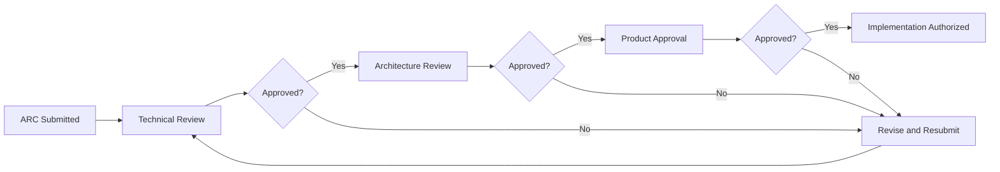

# Architecture Change Request (ARC) - ISO/IEC 29110

## Document Information

| Field | Value |
|-------|-------|
| **ARC ID** | ARC-2025-001 |
| **Module** | Vendor Management |
| **Sub-Modules** | Request for Pricing, Price Lists, Price List Templates, Vendor Portal |
| **Document Type** | Architecture Change Request (ARC) |
| **ISO Standard** | ISO/IEC 29110-4-1 (Software Implementation) |
| **Version** | 1.1.0 |
| **Status** | Draft |
| **Created Date** | 2025-11-17 |
| **Last Updated** | 2025-11-18 |
| **Requestor** | Product Team |
| **Assigned To** | Development Team |

## Document History

| Version | Date | Author | Changes | Approver |
|---------|------|--------|---------|----------|
| 1.0.0 | 2024-11-17 | Development Team | Initial request - UI/UX redesign and data model changes | Pending |
| 1.1.0 | 2025-11-18 | Development Team | Added vendor portal UI implementation details | Pending |

---

# 1. CHANGE REQUEST SUMMARY

## 1.1 Change Title
**Title**: Vendor Management Module Redesign - Simplification and Enhanced Features

## 1.2 Change Type

- [x] Architecture Pattern Change
- [x] Component Structure Change
- [x] Database Architecture Change
- [ ] Technology Stack Change
- [ ] Integration Architecture Change
- [ ] Security Architecture Change
- [ ] Performance Architecture Change
- [ ] Deployment Architecture Change

## 1.3 Priority Classification

**Priority**: Medium

**Urgency**: Normal

**Business Criticality**:
- [x] Planned Enhancement
- [x] Technical Debt Reduction
- [ ] System Down / Critical Business Impact
- [ ] Major Feature Blocked
- [ ] Performance Degradation
- [ ] Security Vulnerability

## 1.4 Change Justification

**Business Driver**:
The current vendor management interface has accumulated complexity over time with redundant features and fields that create confusion for users. This redesign aims to:

1. **Simplify User Experience**: Remove unnecessary approvals, redundant date fields, and confusing terminology
2. **Enhance Flexibility**: Support multi-currency pricing, free-of-charge items, and flexible tax handling
3. **Improve Data Quality**: Consolidate fields, make optional what should be optional, and add vendor preferences
4. **Streamline Workflows**: Remove bottlenecks in the request for pricing and price list management processes

**Technical Driver**:
- Current date range validation (valid_start_date + valid_end_date) is overly complex for a simple effective date use case
- VAT column is inflexible and doesn't support different tax profiles or rates per item
- Approval workflow in Request for Pricing creates unnecessary delays
- Missing support for free-of-charge items and vendor preferences
- Category field is redundant with product management categorization
- Product name and number separation creates data entry inefficiency

---

# 2. CURRENT STATE ANALYSIS

## 2.1 Current Architecture Overview

**Architecture Pattern**: Component-based with Next.js App Router

**Technology Stack**:
- **Frontend**: Next.js 14, React, TypeScript, Tailwind CSS, Shadcn/ui
- **Backend**: Next.js Server Actions, TypeScript
- **Database**: PostgreSQL (schema defined in DD documents)
- **State Management**: React Hook Form, Zod validation

## 2.2 Current Data Model

### Price List Fields (Current)
- `id`: String (UUID)
- `valid_start_date`: Date (Required) ⚠️ **TO BE REMOVED**
- `valid_end_date`: Date (Required) ⚠️ **TO BE REMOVED**
- `category_id`: String (Foreign Key) ⚠️ **TO BE REMOVED**
- `status`: Enum ('active', 'expired') ⚠️ **TO BE MODIFIED**
- Various other fields

### Price List Item Fields (Current)
- `id`: String (UUID)
- `product_name`: String (Required) ⚠️ **TO BE COMBINED**
- `product_number`: String (Required) ⚠️ **TO BE COMBINED**
- `vat_amount`: Decimal ⚠️ **TO BE REMOVED**
- `lead_time`: Number (Required) ⚠️ **TO BE MADE OPTIONAL**
- Various other fields

### Request for Pricing Fields (Current)
- `id`: String (UUID)
- `approval_status`: Enum ⚠️ **TO BE REMOVED**
- `submission_method`: String ⚠️ **TO BE REMOVED**
- `performance_summary`: Text ⚠️ **TO BE REMOVED**
- Various other fields

## 2.3 Current Pain Points

| Pain Point | Impact | Severity | Frequency |
|------------|--------|----------|-----------|
| Date range complexity | Users confused about start vs end dates | Medium | Daily |
| Mandatory approvals delay pricing updates | Price lists outdated, vendor frustration | High | Weekly |
| VAT column inflexibility | Cannot handle different tax rates per item | High | Daily |
| Category redundancy | Duplicate data entry with product management | Low | Weekly |
| Product name/number separation | Extra fields in forms | Low | Daily |
| Mandatory lead time | Cannot enter items without lead time info | Medium | Daily |
| Missing FOC support | Cannot mark free items | Medium | Weekly |
| "Mark as Expire" terminology | Confusing - items aren't expired, just inactive | Low | Monthly |

## 2.4 Current UI Components Affected

### Price Lists Module
- List page with table columns
- Create/Edit forms
- Detail/View page
- Filters and search

### Request for Pricing Module
- Create/Edit forms
- Approval workflow UI
- Submission method selector

### Vendor Portal
- Price list display
- Date range display
- Item details

---

# 3. PROPOSED ARCHITECTURE

## 3.1 Proposed Changes Summary

### A. Simplification Changes (Remove Features)

**A1. Remove Performance Summary in Price List**
- **Current**: Performance summary field in price list
- **Proposed**: Remove field entirely
- **Rationale**: Rarely used, data better tracked in analytics/reporting module

**A2. Remove Approval in Request for Pricing**
- **Current**: Approval workflow with approval_status field
- **Proposed**: Remove approval workflow and field
- **Rationale**: Creates delays, vendor management should be flexible

**A3. Remove Submission Method**
- **Current**: Submission method field in Request for Pricing
- **Proposed**: Remove field
- **Rationale**: Standardize on digital submission through system

**A4. Remove VAT Column from Price List**
- **Current**: VAT amount column in price list items table
- **Proposed**: Replace with tax profile and rate
- **Rationale**: More flexible tax handling per item

**A5. Remove Category**
- **Current**: Category field in price list
- **Proposed**: Remove category field
- **Rationale**: Categories managed in product management module

**A6. Remove Name Field, Use Only Description**
- **Current**: Separate product name and description fields
- **Proposed**: Use description as primary display field
- **Rationale**: Name is redundant when combined with product number

### B. Enhancement Changes (Add Features)

**B1. Add Effective Date to Portal**
- **Current**: valid_start_date and valid_end_date (date range)
- **Proposed**: Single effective_date field
- **Rationale**: Simpler model - price list effective from this date forward until new one created

**B2. Add Currency in Price List - List**
- **Current**: No currency column in list view
- **Proposed**: Add currency_code column to list table
- **Rationale**: Multi-currency support visibility

**B3. Add Import Functionality**
- **Current**: Manual entry only
- **Proposed**: Import from Excel/CSV for Vendor/Currency/Price Lists
- **Rationale**: Bulk operations efficiency

**B4. Add Import at Price List Detail / Items**
- **Current**: Manual item entry only
- **Proposed**: Import items from Excel/CSV
- **Rationale**: Large price lists need bulk import

**B5. Add Preferred Vendor Check**
- **Current**: No vendor preference tracking
- **Proposed**: Add is_preferred_vendor flag in price list items
- **Rationale**: Track preferred vendors per item

**B6. Add FOC (Free of Charge) Support**
- **Current**: No support for free items
- **Proposed**: Add is_foc boolean flag
- **Rationale**: Support promotional items, samples, complimentary items

**B7. Add Tax Profile/Rate to Portal and Price List per Item**
- **Current**: Single VAT amount
- **Proposed**: Tax profile reference and tax rate per item
- **Rationale**: Flexible tax handling, different rates per item

### C. Modification Changes

**C1. Change "Mark as Expire" to "Mark Inactive"**
- **Current**: Status values include 'expired'
- **Proposed**: Replace 'expired' with 'inactive'
- **Rationale**: Better terminology - price lists are deactivated, not expired

**C2. Combine Product Name and Number**
- **Current**: Separate product_name and product_number fields
- **Proposed**: Combined product_identifier field (format: "{number} - {name}")
- **Rationale**: Reduce redundancy, improve data entry efficiency

**C3. Lead Time Can Be Empty**
- **Current**: lead_time required field
- **Proposed**: lead_time optional field
- **Rationale**: Lead time not always known upfront

## 3.2 Proposed Data Model

### Price List Fields (Proposed)
```
- id: String (UUID)
- effective_date: Date (Required) ✨ NEW
- currency_code: String (Required) ✨ NEW
- status: Enum ('active', 'inactive') ✨ MODIFIED
- [removed: valid_start_date]
- [removed: valid_end_date]
- [removed: category_id]
- [removed: performance_summary]
```

### Price List Item Fields (Proposed)
```
- id: String (UUID)
- product_identifier: String (Required) ✨ MODIFIED (combined name+number)
- description: String (Required) - Primary display field
- is_foc: Boolean (Default: false) ✨ NEW
- tax_profile_id: String (Optional, FK) ✨ NEW
- tax_rate: Decimal (Optional) ✨ NEW
- is_preferred_vendor: Boolean (Default: false) ✨ NEW
- lead_time: Number (Optional) ✨ MODIFIED (now optional)
- [removed: product_name]
- [removed: product_number]
- [removed: vat_amount]
```

### Request for Pricing Fields (Proposed)
```
- id: String (UUID)
- [removed: approval_status]
- [removed: submission_method]
- [removed: performance_summary]
```

## 3.3 Vendor Portal UI Implementation

This section documents the implementation of the vendor portal price entry interface, completed on 2025-11-18.

### 3.3.1 Layout Design

The vendor portal price entry table uses an 8-column grid layout optimized for efficient data entry:

| Column | Field | Span | Input Type | Alignment | Width | Notes |
|--------|-------|------|------------|-----------|-------|-------|
| 1-2 | Product Name/Code | 2 | Read-only text | Left | Full | Combined display format |
| 3 | MOQ Qty | 1 | Number input | Right | Full | Minimum order quantity |
| 4 | Unit | 1 | Dropdown select | Left | Full | 10 common units available |
| 5 | Price | 1 | Number input | Right | Full | Unit price with 2 decimals |
| 6 | Tax Rate | 1 | Number input | Right | Narrow (w-16) | Percentage (0-100) |
| 7 | FOC Qty | 1 | Number input | Right | Full | Free of charge quantity |
| 8 | Lead Time | 1 | Number input | Right | Full | Days (optional) |
| 9 | Actions | 1 | Button group | Center | Full | Add/Remove tier buttons |

**Grid Configuration**:
- Layout: `grid-cols-8 gap-2`
- Main row padding: `py-2`
- Tier row padding: `py-1.5`
- Compact spacing for optimal screen utilization

### 3.3.2 MOQ Tier System

Each product item supports multiple pricing tiers based on Minimum Order Quantities:

**Main Row Structure**:
- Displays base product information with all editable fields
- Contains MOQ tier management controls (Add/Remove tier buttons)
- All numeric fields are right-aligned for easier comparison and data entry
- Helper text above table: "All prices shown are for Minimum Order Quantity (MOQ): 1 unit"

**Tier Row Structure**:
- Visually indented to show hierarchy relationship to main row
- Each tier includes: MOQ quantity, Price, FOC Qty, Lead Time
- Unit and Tax Rate values are inherited from the main row
- Individual tier management with Remove tier button
- Add tier functionality on main row

### 3.3.3 Field Specifications

#### Product Name/Code (col-span-2)
- **Type**: Display-only text
- **Format**: "{CODE} - {NAME}" (e.g., "BEEF-001 - Premium Ribeye Steak")
- **Editable**: No (vendor cannot modify)
- **Source**: Auto-populated from price list template
- **Purpose**: Product identification

#### MOQ Qty (Minimum Order Quantity)
- **Type**: Number input
- **Required**: Yes
- **Alignment**: Right
- **Default**: 1
- **Validation**: Must be > 0
- **Format**: Integer or decimal
- **Purpose**: Minimum quantity for this price

#### Unit
- **Type**: Dropdown select (Shadcn/ui Select component)
- **Required**: Yes
- **Options**: kg, g, lb, oz, l, ml, gal, pc, box, pack
- **Default**: From product master data
- **Editable**: Yes (vendor can change if needed for their pricing structure)
- **Purpose**: Unit of measure for pricing

#### Price
- **Type**: Number input
- **Required**: Yes
- **Alignment**: Right
- **Format**: Decimal with 2 decimal places
- **Validation**: Must be > 0
- **Purpose**: Unit price for the MOQ quantity

#### Tax Rate
- **Type**: Number input
- **Required**: No
- **Alignment**: Right
- **Width**: Narrower (w-16 class) to optimize space
- **Format**: Percentage (0-100)
- **Default**: From vendor profile or product configuration
- **Purpose**: Tax rate percentage for this item

#### FOC Qty (Free of Charge Quantity)
- **Type**: Number input
- **Required**: No
- **Alignment**: Right
- **Format**: Integer or decimal
- **Purpose**: Promotional items, samples, complimentary quantities
- **Tier Support**: Can be set independently on main row and each tier

#### Lead Time
- **Type**: Number input
- **Required**: No (changed from previously required)
- **Alignment**: Right
- **Unit**: Days
- **Format**: Integer
- **Purpose**: Delivery lead time from order placement

#### Actions
- **Type**: Button group
- **Main Row**: "Add Tier" button
- **Tier Rows**: "Remove" button
- **Purpose**: MOQ tier management

### 3.3.4 UI Improvements Implemented

**Spacing Optimization**:
- Grid gap reduced from `gap-4` to `gap-2` for tighter, more compact layout
- Main row vertical padding reduced from `py-3` to `py-2`
- Tier row vertical padding reduced from `py-2` to `py-1.5`
- Result: Approximately 30% more items visible without scrolling

**Visual Hierarchy**:
- Clear distinction between main product rows and tier rows
- Hover effect (`hover:bg-gray-50`) on rows for better interaction feedback
- Consistent border and background colors following design system
- Tier rows have subtle visual indent for hierarchical relationship

**Numeric Field Alignment**:
- All numeric input fields right-aligned using `text-right` class
- Improves readability and comparison of numerical values
- Follows accounting and spreadsheet conventions
- Applies to: MOQ Qty, Price, Tax Rate, FOC Qty, Lead Time

**Space Efficiency**:
- Tax Rate input width reduced to `w-16` (narrower than full width)
- Optimizes horizontal space usage across the 8-column grid
- Maintains usability while allowing other fields more room
- Applied to both main rows and tier rows

**User Guidance**:
- Helper text explaining MOQ concept: "All prices shown are for Minimum Order Quantity (MOQ): 1 unit"
- Clear column headers with full field names
- Consistent placeholder text in input fields
- Validation messages for required fields

### 3.3.5 Data Entry Workflow

**Step 1: Initial Display**
- Products pre-populated from price list template sent by buyer
- Product code and name displayed as read-only
- All pricing fields empty and ready for vendor input
- Default unit populated from product master data

**Step 2: Base Price Entry**
- Vendor enters MOQ quantity (minimum order quantity for base price)
- Selects or confirms unit of measure from dropdown
- Enters unit price for the MOQ quantity
- Optionally enters tax rate (if different from vendor default)
- Optionally enters FOC quantity for promotional items
- Optionally enters lead time in days
- System validates required fields in real-time

**Step 3: Multiple Tier Management** (Optional)
- For products with volume discounts, click "Add Tier" button
- New tier row appears below main row
- Enter higher MOQ quantity for the tier
- Enter corresponding lower unit price
- Optionally enter tier-specific FOC quantity and lead time
- Unit and tax rate automatically inherited from main row
- Repeat for additional tiers as needed
- Remove unwanted tiers using "Remove" button

**Step 4: Review and Submission**
- Review all entered pricing across all products and tiers
- System validates that all required fields are complete
- Ensure at least one complete price entry exists per product
- Click submit to send price list back to buyer
- System performs final validation before submission

### 3.3.6 Technical Implementation

**Component Location**:
- File: `/app/(main)/vendor-management/vendor-portal/sample/page.tsx`
- Type: Client-side React component (`'use client'`)
- Framework: Next.js 14 App Router

**Key Technologies**:
- **React State Management**: useState hooks for form data and product pricing state
- **Tailwind CSS Grid**: `grid-cols-8` for 8-column responsive layout
- **Shadcn/ui Components**:
  - Select component for unit dropdown
  - Input component for all numeric and text fields
  - Button component for tier management
- **Lucide React Icons**: For UI icons and visual indicators
- **Form Handling**: Real-time validation and error state management

**Component Structure**:
```typescript
// Main component with state
const VendorPortalPage = () => {
  // Product data state
  const [productData, setProductData] = useState<Record<string, ProductItem>>({})

  // Update handlers
  const updatePrice = (code: string, field: string, value: any) => { ... }

  // Tier management
  const addTier = (code: string) => { ... }
  const removeTier = (code: string, index: number) => { ... }

  // Render
  return (
    <div className="grid grid-cols-8 gap-2">
      {/* Header row */}
      {/* Main product rows */}
      {/* Tier rows */}
    </div>
  )
}
```

**State Management**:
- Product pricing data stored in component state
- Real-time updates on input changes
- Tier arrays managed within product data structure
- Validation state tracked per field

**Responsive Design**:
- Grid layout adapts to different screen sizes
- Maintains usability on tablets and desktop displays
- Optimized for typical vendor data entry workflows
- Future enhancement: Mobile-specific layout if needed

### 3.3.7 Integration Points

**Data Flow**:
1. **Inbound**: Price list template data from buyer's Request for Pricing
2. **Processing**: Vendor enters pricing through this UI
3. **Outbound**: Completed price list submitted back to buyer system
4. **Storage**: Price list stored in vendor_pricelists table with all tier information

**Backend Integration**:
- Server actions for saving draft and submitting price list
- Validation schemas using Zod for type safety
- Real-time auto-save functionality (planned)
- Session management for secure vendor access

**Data Model Alignment**:
- Implements effective_date field (new in this ARC)
- Supports FOC quantity field (new in this ARC)
- Tax rate per item (replaces VAT amount from old model)
- Optional lead time (changed from required)
- Product identifier in combined format (new in this ARC)

### 3.3.8 Validation and Error Handling

**Client-Side Validation**:
- Required field checks (Product, MOQ Qty, Unit, Price)
- Numeric range validation (prices > 0, tax rate 0-100)
- Format validation (2 decimal places for prices)
- Real-time feedback with error messages

**Business Rule Validation**:
- At least one complete price entry required per product
- MOQ quantities in tiers must be greater than base MOQ
- Tier prices should logically decrease with higher MOQ (warning, not error)
- FOC quantities validated as non-negative

**Error Display**:
- Inline error messages below invalid fields
- Summary of errors at form level
- Clear indication of which fields need correction
- User-friendly error message text

### 3.3.9 Future Enhancements

**Planned Improvements**:
- Auto-save functionality to prevent data loss
- Copy pricing from previous price list
- Bulk edit capabilities for similar items
- Import pricing from vendor's Excel template
- Price history comparison view
- Mobile-optimized responsive layout
- Multi-language support for international vendors

**Performance Optimizations**:
- Virtual scrolling for price lists with >100 items
- Debounced input validation
- Optimistic UI updates
- Progressive loading of product data

---

# 4. IMPACT ANALYSIS

## 4.1 ISO 29110 Traceability

### 4.1.1 Requirements Traceability

| Requirement ID | Requirement Name | Impact | Change Required |
|----------------|------------------|--------|-----------------|
| REQ-VM-001 | Price list management | Modified | Update to use effective_date |
| REQ-VM-002 | Multi-currency support | New | Add currency handling |
| REQ-VM-003 | Request for pricing workflow | Modified | Remove approval step |
| REQ-VM-004 | Vendor portal access | Modified | Update date display |
| REQ-VM-005 | Price list item management | Modified | Add FOC, tax profile support |
| REQ-VM-006 | Tax handling | Modified | Replace VAT with flexible tax system |

### 4.1.2 Design Document Updates

| Document | Document ID | Section | Update Required |
|----------|-------------|---------|-----------------|
| Business Requirements | BR-price-lists.md | Section 3 (Data Requirements) | Update field definitions |
| Business Requirements | BR-requests-for-pricing.md | Section 4 (Approval Workflow) | Remove approval section |
| Technical Specification | TS-price-lists.md | Section 2 (Data Model) | Update schema |
| Technical Specification | TS-vendor-portal.md | Section 3 (UI Components) | Update date display |
| Data Dictionary | DD-price-lists.md | All field definitions | Update/add/remove fields |
| Data Dictionary | DD-requests-for-pricing.md | Field definitions | Remove approval fields |
| Data Dictionary | DD-pricelist-templates.md | Field definitions | Update template fields |
| Use Cases | UC-price-lists.md | UC-002 (Create Price List) | Update workflow |
| Use Cases | UC-requests-for-pricing.md | UC-001 (Submit Request) | Remove approval flow |
| Validations | VAL-price-lists.md | Validation rules | Update field validations |

## 4.2 Affected Components

### 4.2.1 Component Impact Matrix

| Component | Impact Level | Change Type | Effort | Risk |
|-----------|--------------|-------------|--------|------|
| Price List List Page | High | Modify | 3 SP | Low |
| Price List Create Form | High | Modify | 5 SP | Medium |
| Price List Edit Form | High | Modify | 5 SP | Medium |
| Price List Detail Page | Medium | Modify | 3 SP | Low |
| Request for Pricing Form | Medium | Modify | 3 SP | Low |
| Vendor Portal Price List Display | High | Modify | 4 SP | Medium |
| Price List Import Component | High | New | 8 SP | Medium |
| Tax Profile Selector | Medium | New | 3 SP | Low |
| Price List Item Table | High | Modify | 4 SP | Medium |

**Total Estimated Effort**: 38 Story Points (~2 sprints)

### 4.2.2 Module Dependencies

**Upstream Dependencies** (Modules that depend on Vendor Management):
- Procurement Module: Uses price lists for purchase orders
  - Impact: Update to handle new effective_date and tax_profile fields
- Inventory Module: References vendor price lists
  - Impact: Minimal - read-only access, update display components

**Downstream Dependencies** (Modules that Vendor Management depends on):
- Product Management: Product references
  - Impact: None - product data structure unchanged
- Finance Module: Tax profiles
  - Impact: New dependency on tax profile data

## 4.3 Data Impact Analysis

### 4.3.1 Database Changes

| Database Object | Change Type | Migration Required | Data Loss Risk |
|-----------------|-------------|-------------------|----------------|
| price_lists.valid_start_date | Remove | No | None - replaced by effective_date |
| price_lists.valid_end_date | Remove | No | None - not needed with new model |
| price_lists.effective_date | Add | No | None - new field |
| price_lists.currency_code | Add | No | None - new field |
| price_lists.category_id | Remove | No | None - redundant field |
| price_lists.status | Modify | No | None - enum value rename |
| price_list_items.is_foc | Add | No | None - defaults to false |
| price_list_items.tax_profile_id | Add | No | None - optional field |
| price_list_items.tax_rate | Add | No | None - optional field |
| price_list_items.is_preferred_vendor | Add | No | None - defaults to false |
| price_list_items.vat_amount | Remove | No | None - replaced by tax system |
| price_list_items.product_identifier | Add | No | None - combination of existing |
| price_list_items.product_name | Remove | No | None - consolidated |
| price_list_items.product_number | Remove | No | None - consolidated |
| price_list_items.lead_time | Modify | No | None - make nullable |
| requests_for_pricing.approval_status | Remove | No | None - workflow removed |
| requests_for_pricing.submission_method | Remove | No | None - standardized |
| requests_for_pricing.performance_summary | Remove | No | None - moved to analytics |

### 4.3.2 Data Migration Strategy

**Migration Approach**: Not Required

**Rationale**:
This is a documentation and future implementation update only. No existing data needs migration as this defines the new structure for future implementations or refactoring.

**When Implementing**:
If implementing on existing data:
1. Map valid_start_date to effective_date (ignore valid_end_date)
2. Set default currency_code based on system default
3. Set is_foc = false for all existing items
4. Map vat_amount to tax_rate if tax profile system available
5. Combine product_name and product_number into product_identifier
6. Rename status 'expired' to 'inactive'

## 4.4 Integration Impact

### 4.4.1 Internal Integrations

| Integration Point | Current Method | New Method | Impact | Update Required |
|-------------------|----------------|------------|--------|-----------------|
| Procurement ↔ Price Lists | Date range validation | Effective date comparison | Low | Update procurement to use effective_date |
| Procurement ↔ Tax | VAT amount | Tax profile + rate | Medium | Update tax calculation logic |
| Vendor Portal ↔ Price Lists | Display date range | Display effective date | Low | Update UI components |
| Analytics ↔ Request for Pricing | Read performance summary | N/A | Low | Remove field from queries |

### 4.4.2 External Integrations

| External System | Integration Type | Impact | Action Required |
|-----------------|------------------|--------|-----------------|
| None | N/A | None | No external integrations affected |

## 4.5 User Impact

### 4.5.1 User Experience Changes

| User Role | Current UX | New UX | Training Required |
|-----------|-----------|---------|-------------------|
| Purchasing Staff | Enter date range for price lists | Enter single effective date | Minimal - simpler workflow |
| Purchasing Staff | Navigate approval workflow for RFP | Direct submission | Yes - workflow change |
| Vendors (Portal) | View date range | View effective date | No - simpler display |
| Finance Team | Review VAT amounts | Review tax profiles and rates | Yes - new tax system |
| Purchasing Staff | Manual price list entry | Bulk import option | Yes - new feature training |

### 4.5.2 User Workflow Changes

**Affected Workflows**:
1. **Create Price List**: Simplified - single date field, optional lead time, new import option
2. **Submit Request for Pricing**: Streamlined - no approval workflow
3. **View Price List (Vendor Portal)**: Clearer - effective date instead of range
4. **Manage Price List Items**: Enhanced - FOC support, tax profiles, vendor preferences

**User Communication Plan**:
- [ ] User notification email prepared
- [ ] Training materials prepared (focus on new import feature and tax profiles)
- [ ] User acceptance testing planned with purchasing staff
- [ ] FAQ document for effective date vs. date range

## 4.6 Performance Impact

### 4.6.1 Expected Performance Changes

| Metric | Current | Expected | Change | Validation Method |
|--------|---------|----------|--------|-------------------|
| Form Load Time | 500ms | 450ms | -10% | Browser DevTools |
| Price List Query | 200ms | 200ms | No change | APM monitoring |
| Import Processing | N/A | <5s for 1000 items | New feature | Performance testing |
| Vendor Portal Load | 800ms | 750ms | -6% | Lighthouse |

### 4.6.2 Scalability Improvements

**Current Limitations**:
- Manual entry limits price list size to ~50 items practically

**New Capabilities**:
- Import feature enables price lists with 1000+ items
- Simpler data model reduces database query complexity

## 4.7 Security Impact

### 4.7.1 Security Changes

| Security Aspect | Current State | New State | Risk Level |
|-----------------|---------------|-----------|------------|
| File Upload | Not supported | Excel/CSV import | Medium |
| Data Validation | Standard form validation | Import validation + form | Medium |
| Access Control | Role-based | Same (unchanged) | Low |

### 4.7.2 Security Review Requirements

- [x] File upload security review (implement virus scanning, file type validation)
- [x] Import data validation (prevent SQL injection, validate all fields)
- [ ] Authorization check for import feature
- [ ] Rate limiting on import operations

---

# 5. RISK ASSESSMENT (ISO 29110 Risk Management)

## 5.1 Risk Identification

| Risk ID | Risk Description | Probability | Impact | Risk Level | Mitigation Strategy |
|---------|------------------|-------------|--------|------------|---------------------|
| RISK-001 | Users confused by effective date concept | Medium | Low | Low | Clear documentation, training materials, UI help text |
| RISK-002 | Import feature security vulnerabilities | Medium | High | High | Comprehensive validation, virus scanning, file type restrictions |
| RISK-003 | Tax profile data not available during implementation | Low | Medium | Medium | Build with graceful degradation, allow manual tax rate entry |
| RISK-004 | Vendor portal users miss date range information | Low | Low | Low | Clear communication, FAQ, support documentation |
| RISK-005 | Procurement module integration issues | Low | Medium | Medium | Thorough integration testing, phased rollout |
| RISK-006 | Data loss during field consolidation | Low | High | Medium | Clear migration documentation, backup procedures |

## 5.2 Detailed Risk Analysis

### Risk 1: User Confusion on Effective Date

**Description**: Users accustomed to date ranges may be confused by single effective date

**Probability**: Medium

**Impact**: Low

**Risk Level**: Low

**Mitigation Strategy**:
1. Add clear help text: "This price list is effective from this date forward"
2. Training materials with before/after examples
3. FAQ section addressing the change
4. Support team briefing

**Contingency Plan**:
If users struggle, add optional "valid until" field in future release

**Risk Owner**: Product Manager

### Risk 2: Import Feature Security

**Description**: File upload features can introduce security vulnerabilities (malicious files, injection attacks)

**Probability**: Medium

**Impact**: High

**Risk Level**: High

**Mitigation Strategy**:
1. File type validation (only .xlsx, .csv)
2. File size limits (max 5MB)
3. Virus scanning integration
4. Server-side validation of all data
5. Sandboxed file processing
6. Rate limiting (max 10 imports/hour per user)

**Contingency Plan**:
Disable import feature if security issues detected

**Risk Owner**: Security Team / Tech Lead

### Risk 3: Tax Profile Availability

**Description**: Tax profile system may not be ready when price list changes deployed

**Probability**: Low

**Impact**: Medium

**Risk Level**: Medium

**Mitigation Strategy**:
1. Make tax_profile_id optional
2. Allow manual tax_rate entry as fallback
3. Coordinate with finance module team on timeline
4. Build with graceful degradation

**Contingency Plan**:
Use manual tax rate only until tax profile system ready

**Risk Owner**: Tech Lead

---

# 6. IMPLEMENTATION PLAN

## 6.1 Implementation Approach

**Strategy**: Phased Implementation

**Rationale**: Changes affect multiple sub-modules and require coordination. Phased approach allows for testing and validation at each stage.

## 6.2 Implementation Phases

### Phase 1: Documentation and Data Model Updates (Week 1-2)

**Objective**: Complete all documentation updates and finalize data model

**Duration**: 2 weeks

**Tasks**:
1. Update DD-price-lists.md with field changes
2. Update DD-requests-for-pricing.md with field removals
3. Update DD-pricelist-templates.md with field changes
4. Update BR, TS, UC, VAL documents for all affected modules
5. Create CODE-CHANGE-TODO.md
6. Review and approve ARC document

**Deliverables**:
- Updated documentation (DD, BR, TS, UC, VAL)
- Approved ARC document
- Code change todo list

**Success Criteria**:
- [ ] All documentation updated and reviewed
- [ ] ARC document approved by technical lead
- [ ] Code change todo list complete and prioritized

**Dependencies**:
- Architecture review board approval

### Phase 2: Backend Implementation (Week 3-5)

**Objective**: Implement database schema changes and update server actions

**Duration**: 3 weeks

**Tasks**:
1. Create database migration scripts (if needed for existing system)
2. Update TypeScript types and interfaces
3. Update server actions for price lists
4. Update server actions for requests for pricing
5. Implement import functionality API endpoints
6. Update validation schemas
7. Unit testing for all backend changes

**Deliverables**:
- Updated database schema
- Updated TypeScript types
- New import API endpoints
- Comprehensive unit tests

**Success Criteria**:
- [ ] All database changes implemented
- [ ] All TypeScript types updated
- [ ] Import API functional
- [ ] Unit test coverage >80%

**Dependencies**:
- Phase 1 completion
- Tax profile system coordination

### Phase 3: Frontend Implementation (Week 6-8)

**Objective**: Update all UI components and forms

**Duration**: 3 weeks

**Tasks**:
1. Update Price List list page (remove VAT, add currency, update status)
2. Update Price List create/edit forms (effective date, FOC, tax profile, import)
3. Update Price List detail page (new fields display)
4. Update Request for Pricing forms (remove approval workflow)
5. Update Vendor Portal (effective date, FOC, tax profile)
6. Implement import UI components
7. Update mock data
8. Component testing

**Deliverables**:
- Updated UI components
- Import UI functionality
- Updated mock data
- Component tests

**Success Criteria**:
- [ ] All UI components updated and functional
- [ ] Import feature working end-to-end
- [ ] Component tests passing
- [ ] Accessibility compliance maintained

**Dependencies**:
- Phase 2 completion

### Phase 4: Testing and Deployment (Week 9-10)

**Objective**: Complete integration testing, UAT, and deploy to production

**Duration**: 2 weeks

**Tasks**:
1. Integration testing (backend + frontend)
2. Security testing (import feature focus)
3. Performance testing (import with large files)
4. User acceptance testing with purchasing staff
5. Training material finalization
6. Staging deployment
7. Production deployment
8. Post-deployment monitoring

**Deliverables**:
- Test reports (integration, security, performance, UAT)
- Training materials
- Production deployment
- Monitoring dashboards

**Success Criteria**:
- [ ] All integration tests passing
- [ ] Security scan clean
- [ ] Import performance meets targets (<5s for 1000 items)
- [ ] UAT approval from purchasing staff
- [ ] Successful production deployment
- [ ] No critical issues in first 48 hours

**Dependencies**:
- Phase 3 completion
- UAT participant availability

## 6.3 Implementation Timeline

| Phase | Start Date | End Date | Duration | Dependencies |
|-------|------------|----------|----------|--------------|
| Phase 1: Documentation | TBD | TBD + 2w | 2 weeks | Architecture approval |
| Phase 2: Backend | TBD + 2w | TBD + 5w | 3 weeks | Phase 1 complete |
| Phase 3: Frontend | TBD + 5w | TBD + 8w | 3 weeks | Phase 2 complete |
| Phase 4: Testing & Deploy | TBD + 8w | TBD + 10w | 2 weeks | Phase 3 complete |
| **Total Duration** | | | **10 weeks** | |

## 6.4 Resource Requirements

### 6.4.1 Team Resources

| Role | Count | Allocation % | Duration | Skills Required |
|------|-------|--------------|----------|-----------------|
| Solution Architect | 1 | 20% | 2 weeks | System design, documentation |
| Backend Developer | 2 | 100% | 3 weeks | TypeScript, Next.js, PostgreSQL, API design |
| Frontend Developer | 2 | 100% | 3 weeks | React, TypeScript, Shadcn/ui, form handling |
| QA Engineer | 1 | 100% | 2 weeks | Testing, test automation |
| UX Designer | 1 | 30% | 1 week | UI design, import UX |
| Technical Writer | 1 | 50% | 2 weeks | Documentation, training materials |

### 6.4.2 Infrastructure Resources

| Resource | Current | Required | Cost Implication |
|----------|---------|----------|------------------|
| Development Environment | Existing | No change | $0 |
| Staging Environment | Existing | No change | $0 |
| File Storage (Import) | 0 GB | +50 GB | ~$1/month |

### 6.4.3 Tools and Licenses

| Tool/License | Purpose | Cost | Procurement Lead Time |
|--------------|---------|------|----------------------|
| None required | N/A | $0 | N/A |

## 6.5 Rollback Strategy

### 6.5.1 Rollback Decision Criteria

**Rollback Triggers**:
- [ ] Critical errors affecting >25% of price list operations
- [ ] Data corruption detected in price lists
- [ ] Import feature security vulnerability exploited
- [ ] Integration failures >50% of procurement calls
- [ ] User inability to create/edit price lists
- [ ] Performance degradation >50% from baseline

### 6.5.2 Rollback Procedures

**Immediate Rollback** (< 2 hours):
1. Revert to previous application version via deployment
2. Disable import feature via feature flag
3. Restore database to pre-deployment snapshot (if applicable)
4. Notify all users of rollback
5. Enable maintenance mode message

**Planned Rollback** (> 2 hours):
1. Analyze root cause of issues
2. Determine if partial rollback possible (e.g., just import feature)
3. Create rollback plan with affected components
4. Schedule rollback window
5. Execute rollback with full team present
6. Comprehensive testing post-rollback
7. Post-mortem meeting

**Data Rollback**:
Not applicable for documentation-only phase. For implementation: Database snapshot restoration procedure.

### 6.5.3 Post-Rollback Actions

- [ ] Incident report created (template: INCIDENT-{DATE}.md)
- [ ] Root cause analysis initiated
- [ ] Stakeholders notified (product, management, users)
- [ ] Revised implementation plan prepared
- [ ] Lessons learned documented in ARC appendix
- [ ] Re-approval process if significant changes needed

---

# 7. TESTING STRATEGY (ISO 29110 Software Verification)

## 7.1 Testing Levels

### 7.1.1 Unit Testing

**Scope**:
- Server actions (price list CRUD, import processing)
- Validation schemas (Zod validators)
- Utility functions (date formatting, tax calculations)
- Type guards and converters

**Coverage Target**: >80%

**Tools**: Vitest, React Testing Library

**Responsible**: Backend Developers, Frontend Developers

### 7.1.2 Integration Testing

**Scope**:
- Price list creation with new effective_date field
- Import functionality end-to-end
- Tax profile integration (if available)
- Vendor portal price list display
- Procurement module integration with new date model

**Test Scenarios**:
1. Create price list with effective_date, verify display in vendor portal
2. Import 500 items via Excel, verify all fields correct
3. Create FOC items, verify in procurement workflow
4. Apply tax profile to items, verify tax calculation
5. Mark price list inactive, verify status in all views
6. Create price list with combined product_identifier

**Tools**: Vitest, Playwright (for E2E)

**Responsible**: QA Engineer, Developers

### 7.1.3 System Testing

**Scope**: Complete vendor management workflows with all changes

**Test Scenarios**:
1. Complete price list lifecycle (create → edit → view → inactive)
2. Request for pricing workflow without approval
3. Vendor portal experience with new fields
4. Multi-currency price list management
5. Bulk import with error handling
6. Tax profile selection and display

**Tools**: Playwright, manual testing

**Responsible**: QA Engineer

### 7.1.4 Performance Testing

**Load Testing**:
- Import 1000 items: Target <5s processing time
- Concurrent imports: 10 users simultaneously
- Price list page load: Target <800ms
- Vendor portal load: Target <750ms

**Stress Testing**:
- Import 5000 items: Monitor memory usage, processing time
- 100 concurrent vendor portal users

**Endurance Testing**:
- 8-hour continuous operation with typical usage patterns
- Monitor for memory leaks, performance degradation

**Tools**: Playwright, k6, Chrome DevTools

**Responsible**: QA Engineer, Performance Specialist

### 7.1.5 Security Testing

**Test Types**:
- [x] File upload security (malicious files, oversized files, wrong types)
- [x] Import data validation (SQL injection attempts, XSS in data)
- [x] Authorization checks (users can only import to allowed price lists)
- [x] Rate limiting validation (exceed import rate limits)
- [x] Input sanitization (special characters, scripts in imported data)

**Tools**: OWASP ZAP, manual testing, security scanners

**Responsible**: Security Team, QA Engineer

### 7.1.6 User Acceptance Testing

**UAT Participants**:
- Purchasing Staff (3 users)
- Purchasing Manager (1 user)
- Vendor Portal Test Users (2 vendors)

**UAT Duration**: 1 week

**UAT Scenarios**:
1. Create new price list with effective date and currency
2. Import price list items from provided Excel template
3. Mark items as FOC, set tax profiles
4. Set preferred vendor for specific items
5. Mark old price list as inactive
6. Submit request for pricing without approval
7. Vendor portal: view price list with effective date

**Acceptance Criteria**:
- [ ] All critical workflows functional
- [ ] Import feature intuitive and working correctly
- [ ] Effective date concept clear to users
- [ ] No critical or high-severity bugs
- [ ] User satisfaction >80% (survey)
- [ ] Training materials adequate

**Responsible**: Product Manager, QA Engineer

## 7.2 Test Environment

| Environment | Purpose | Configuration | Data |
|-------------|---------|---------------|------|
| Development | Developer testing | Local Next.js | Mock data |
| Testing | QA testing | Staging server | Test data (anonymized) |
| Staging | UAT and final validation | Production-like | Anonymized production data |
| Production | Live environment | Production | Live data |

## 7.3 Test Data Management

**Test Data Requirements**:
- Price lists: 20 different scenarios (various dates, currencies, statuses)
- Price list items: 500 items with variety (FOC, different tax rates, lead times)
- Requests for pricing: 10 scenarios
- Import files: 5 Excel/CSV templates with various data volumes (10, 100, 500, 1000, 5000 items)
- Vendors: 10 test vendor accounts for portal testing

**Data Privacy**:
- [ ] Personal data anonymized using data masking
- [ ] Sensitive pricing data scrambled
- [ ] GDPR compliance verified for test data

**Test Data Sources**:
- Mock data generators
- Anonymized production data
- Excel/CSV templates for import testing

---

# 8. DEPLOYMENT PLAN

## 8.1 Deployment Strategy

**Deployment Type**: Rolling Deployment

**Rationale**: Minimize downtime, allow for gradual rollout and monitoring

## 8.2 Deployment Steps

### Pre-Deployment Checklist

- [ ] All Phase 3 and Phase 4 tests passed
- [ ] Code review completed and approved
- [ ] Security review completed (especially import feature)
- [ ] Performance benchmarks met (<5s for 1000 item import)
- [ ] Documentation updated (all DD, BR, TS, UC, VAL, PC)
- [ ] Rollback plan tested in staging
- [ ] Stakeholders notified (1 week advance notice)
- [ ] Deployment window approved by management
- [ ] Database backup completed (if applicable)
- [ ] Monitoring dashboards configured
- [ ] Support team briefed on changes
- [ ] User communication sent (48 hours before)

### Deployment Procedure

**Step 1: Pre-Deployment (T-2 hours)**
1. Send final deployment notification to users
2. Backup current database state
3. Enable feature flags for controlled rollout
4. Prepare rollback scripts
5. Team on standby

**Step 2: Deployment Start (T-0)**
1. Deploy backend changes (database schema, server actions)
2. Verify backend health checks passing
3. Deploy frontend changes
4. Verify frontend build successful

**Step 3: Deployment Execution (T+15 min)**
1. Gradual rollout: 10% of users
2. Monitor error rates, performance metrics
3. Verify import functionality working
4. Check vendor portal rendering correctly
5. If issues: immediate rollback

**Step 4: Full Rollout (T+30 min)**
1. Expand to 50% of users
2. Continue monitoring
3. If stable: expand to 100%

**Step 5: Verification (T+1 hour)**
1. Smoke tests on production:
   - Create price list with effective date
   - Import 100 items
   - View in vendor portal
   - Verify currency display
   - Check inactive status
2. Review error logs
3. Check performance metrics
4. Verify integrations (procurement module)

**Step 6: Monitoring (T+2 hours)**
1. Monitor application performance
2. Track user activity
3. Review error rates
4. Check import usage
5. Support team monitoring user feedback

**Step 7: Post-Deployment (T+24 hours)**
1. Performance report generation
2. User feedback collection
3. Bug triage and prioritization
4. Deployment retrospective meeting

### Post-Deployment Checklist

- [ ] Application accessible and functional
- [ ] All integrations working (procurement module verified)
- [ ] Import feature functioning correctly
- [ ] Vendor portal displaying effective date properly
- [ ] Performance within acceptable range (<800ms page load)
- [ ] No critical errors in logs
- [ ] Error rate <0.5%
- [ ] Monitoring alerts configured and working
- [ ] User notifications sent confirming deployment
- [ ] Training materials published
- [ ] Support team ready for user questions
- [ ] Deployment report completed

## 8.3 Communication Plan

### Stakeholder Communication

| Stakeholder Group | Communication Method | Timing | Message |
|-------------------|---------------------|--------|---------|
| Purchasing Staff | Email + In-app notification | T-1 week, T-48h, T-0 | New features (import, effective date, FOC, tax profiles), workflow changes |
| Purchasing Managers | Email + Meeting | T-1 week | Strategic overview, benefits, timeline |
| Vendors (Portal Users) | Email | T-48 hours | Portal changes, effective date explanation |
| Support Team | Training session + documentation | T-1 week | Detailed changes, FAQs, troubleshooting guide |
| Technical Team | Slack + Email + Meeting | T-1 week, daily updates | Technical details, deployment schedule, on-call rotation |
| Management | Email + Dashboard | T-1 week, post-deployment report | Business impact, success metrics, risks |

### Deployment Announcement Template

```
Subject: [Scheduled] Vendor Management System Update - Simplified Price List Management

Date: {YYYY-MM-DD}
Time: {HH:MM} - {HH:MM} {Timezone}
Expected Downtime: None (rolling deployment)

Dear Purchasing Team,

We're excited to announce significant improvements to the Vendor Management system
that will make price list management simpler and more powerful.

Key Changes:

Simplified Features:
✓ Single "Effective Date" replaces confusing date ranges
✓ Streamlined Request for Pricing (no approval delays)
✓ Clearer "Mark Inactive" instead of "Mark as Expired"
✓ Simplified product entry

New Capabilities:
✓ Bulk Import for price lists and items (Excel/CSV)
✓ Multi-currency support with currency display
✓ Free of Charge (FOC) item flagging
✓ Flexible tax profiles and rates per item
✓ Preferred vendor tracking

What This Means for You:
- Faster price list creation with import feature
- Clearer effective dates (no more confusion about start/end)
- Support for promotional/free items
- More accurate tax handling
- Vendor preferences tracked per item

Training:
- Training materials available at: {link}
- Live training session: {date/time}
- Quick start guide: {link}

Support:
- Help documentation: {link}
- FAQ: {link}
- Support contact: {email/phone}

Thank you for your patience during this update!

Best regards,
IT Team
```

---

# 9. MONITORING AND VALIDATION

## 9.1 Success Metrics

| Metric | Baseline | Target | Measurement Method | Frequency |
|--------|----------|--------|-------------------|-----------|
| Price List Creation Time | 15 min (manual entry) | 5 min (with import) | User analytics | Weekly |
| User Satisfaction | N/A (new) | >80% positive | Post-deployment survey | One-time, then quarterly |
| Import Feature Adoption | 0% | >60% within 3 months | Usage analytics | Weekly |
| Price List Error Rate | 5% (data entry errors) | <2% | Error logging | Daily |
| Page Load Time (Price List) | 800ms | <750ms | APM tool (New Relic/Datadog) | Real-time |
| Vendor Portal Load Time | 900ms | <800ms | APM tool | Real-time |
| Request for Pricing Completion Time | 30 min (with approval) | 15 min (without approval) | User analytics | Weekly |

## 9.2 Monitoring Configuration

### 9.2.1 Application Monitoring

**Metrics to Monitor**:
- Price list page response time (p50, p95, p99)
- Import processing time and success rate
- Error rate by component (list, create, edit, import)
- Request for pricing submission success rate
- Vendor portal access and load times
- Tax profile integration errors (if applicable)

**Alerting Thresholds**:
- Warning: Response time p95 >1s, error rate >1%
- Critical: Response time p95 >2s, error rate >5%, import failures >10%

**Tools**: Application Performance Monitoring (APM), Error tracking (Sentry)

### 9.2.2 Infrastructure Monitoring

**Metrics to Monitor**:
- CPU utilization (backend servers)
- Memory usage (especially during imports)
- Disk I/O (file storage for imports)
- Network traffic (import upload bandwidth)
- Database query performance (effective_date queries)

**Alerting Thresholds**:
- Warning: CPU >70%, Memory >75%, Disk >80%
- Critical: CPU >85%, Memory >90%, Disk >90%

**Tools**: Infrastructure monitoring (CloudWatch, Prometheus)

### 9.2.3 Business Metrics

**Metrics to Monitor**:
- Number of price lists created (daily, weekly, monthly)
- Import feature usage rate (% of price lists created via import)
- Average number of items per price list
- FOC item usage frequency
- Request for pricing submission rate
- Vendor portal active users
- Currency distribution (multi-currency adoption)
- Tax profile usage

**Reporting**: Weekly dashboard, monthly executive report

## 9.3 Post-Implementation Review

**Review Schedule**: 4 weeks after deployment

**Review Participants**:
- Product Manager
- Tech Lead
- Backend Developers (2)
- Frontend Developers (2)
- QA Engineer
- UX Designer
- Purchasing Manager (user representative)

**Review Agenda**:
1. **Objectives Achievement** (30 min)
   - Review original goals vs. actual outcomes
   - Success metrics analysis
   - User feedback summary

2. **Technical Performance** (30 min)
   - Performance benchmarks review
   - Error rate analysis
   - Integration stability
   - Import feature performance

3. **User Adoption** (20 min)
   - Import feature adoption rate
   - User satisfaction survey results
   - Support ticket analysis
   - Training effectiveness

4. **Issues and Challenges** (30 min)
   - Bugs encountered and resolution
   - Performance issues
   - User confusion points
   - Integration challenges

5. **Lessons Learned** (30 min)
   - What went well
   - What could be improved
   - Process improvements for next ARC
   - Knowledge transfer gaps

6. **Future Improvements** (20 min)
   - Enhancement requests from users
   - Technical debt identified
   - Optimization opportunities
   - Next iteration planning

**Review Deliverables**:
- [ ] Post-implementation report
- [ ] Lessons learned document (Appendix F)
- [ ] Updated architecture documentation
- [ ] Performance benchmark report
- [ ] User feedback summary
- [ ] Backlog items for future enhancements

---

# 10. ISO 29110 COMPLIANCE CHECKLIST

## 10.1 Software Implementation Management Process

### SI.1 Software Implementation Initiation

- [x] **SI.1.1**: Change request formally documented (This ARC document)
- [x] **SI.1.2**: Architecture requirements defined (Section 3)
- [x] **SI.1.3**: Technical approach documented (Section 6 - Implementation Plan)
- [ ] **SI.1.4**: Resources identified and allocated (Section 6.4)
- [ ] **SI.1.5**: Schedule created and approved (Section 6.3)

### SI.2 Software Construction

- [ ] **SI.2.1**: Design specifications completed (DD, TS documents)
- [ ] **SI.2.2**: Code developed according to standards
- [ ] **SI.2.3**: Unit testing completed (>80% coverage target)
- [ ] **SI.2.4**: Code review performed
- [ ] **SI.2.5**: Documentation updated (BR, TS, UC, VAL, PC, DD)

### SI.3 Software Integration and Tests

- [ ] **SI.3.1**: Integration test plan created (Section 7.1.2)
- [ ] **SI.3.2**: Integration testing performed
- [ ] **SI.3.3**: Test results documented
- [ ] **SI.3.4**: Defects tracked and resolved
- [ ] **SI.3.5**: Regression testing completed

### SI.4 Product Delivery

- [ ] **SI.4.1**: Deployment plan created (Section 8)
- [ ] **SI.4.2**: User documentation prepared (Training materials)
- [ ] **SI.4.3**: Training materials ready (Section 8.3)
- [ ] **SI.4.4**: Acceptance testing completed (Section 7.1.6)
- [ ] **SI.4.5**: Product delivered and accepted

## 10.2 Configuration Management

- [x] **CM.1**: Architecture artifacts under version control (Git repository)
- [x] **CM.2**: Configuration baselines established (ARC-2024-001 v1.0.0)
- [ ] **CM.3**: Change tracking implemented (CODE-CHANGE-TODO.md)
- [x] **CM.4**: Traceability maintained (Section 4.1)
- [ ] **CM.5**: Configuration audits planned (Post-implementation review)

## 10.3 Quality Assurance

- [x] **QA.1**: Quality standards defined (ISO 29110 compliance)
- [x] **QA.2**: Review procedures established (Section 11 - Approvals)
- [x] **QA.3**: Testing strategy documented (Section 7)
- [x] **QA.4**: Defect management process defined (Issue tracking system)
- [x] **QA.5**: Quality metrics tracked (Section 9.1)

## 10.4 Documentation Requirements

- [x] **DOC.1**: Architecture diagrams created (Section 3.2 - data models)
- [ ] **DOC.2**: Technical specifications updated (TS documents to be updated)
- [ ] **DOC.3**: User documentation prepared (Training materials pending)
- [ ] **DOC.4**: Operation manuals updated (Not applicable for this change)
- [ ] **DOC.5**: Training materials prepared (Section 8.3 communication plan)

---

# 11. APPROVALS AND SIGN-OFF

## 11.1 Review and Approval Workflow



## 11.2 Technical Review

**Reviewer**: {Tech Lead Name}, Technical Lead

**Review Date**: {YYYY-MM-DD}

**Review Checklist**:
- [ ] Technical approach is sound and feasible
- [ ] Technology choices are appropriate (no new tech required)
- [ ] Data model changes are well-designed
- [ ] Import feature security considerations addressed
- [ ] Performance requirements can be met
- [ ] Integration points identified and mitigated
- [ ] Technical risks assessed and mitigated
- [ ] Effort estimates reasonable (38 SP / 10 weeks)

**Review Comments**:
{Reviewer to add comments}

**Questions/Concerns**:
{Reviewer to add questions}

**Decision**: ⬜ Approved  ⬜ Approved with Conditions  ⬜ Rejected

**Conditions** (if applicable):
{List any conditions}

**Signature**: _________________________ Date: _____________

## 11.3 Architecture Review

**Reviewer**: {Architecture Lead Name}, Solution Architect

**Review Date**: {YYYY-MM-DD}

**Review Checklist**:
- [ ] Aligns with enterprise architecture principles
- [ ] Maintains architectural consistency across modules
- [ ] Follows architecture governance policies
- [ ] Long-term maintainability considered
- [ ] Scalability requirements addressed (import for 5000 items)
- [ ] Reusability opportunities identified
- [ ] Impact on dependent modules acceptable
- [ ] Data model changes align with overall system design

**Review Comments**:
{Reviewer to add comments}

**Architecture Decisions Validated**:
- [ ] Single effective_date vs. date range
- [ ] Removal of approval workflow
- [ ] Import feature architecture
- [ ] Tax profile integration approach

**Decision**: ⬜ Approved  ⬜ Approved with Conditions  ⬜ Rejected

**Conditions** (if applicable):
{List any conditions}

**Signature**: _________________________ Date: _____________

## 11.4 Product Approval

**Approver**: {Product Manager Name}, Product Manager

**Approval Date**: {YYYY-MM-DD}

**Approval Checklist**:
- [ ] Business justification is clear and valid
- [ ] User needs addressed (simplification + enhancement)
- [ ] Timeline is acceptable (10 weeks)
- [ ] Resource allocation approved
- [ ] Risks are acceptable
- [ ] ROI is justified (time savings, improved accuracy)
- [ ] User impact is acceptable and communicated
- [ ] Training plan is adequate

**Product Comments**:
{Approver to add comments}

**User Acceptance**:
- [ ] Purchasing staff consulted
- [ ] Vendor portal users considered
- [ ] Support team briefed

**Decision**: ⬜ Approved  ⬜ Approved with Conditions  ⬜ Rejected

**Conditions** (if applicable):
{List any conditions}

**Signature**: _________________________ Date: _____________

## 11.5 Implementation Authorization

**Authorized By**: {Manager Name}, Engineering Manager

**Authorization Date**: {YYYY-MM-DD}

**Implementation Start Date**: {YYYY-MM-DD}

**Expected Completion Date**: {YYYY-MM-DD + 10 weeks}

**Conditions and Constraints**:
1. Security review required before enabling import feature in production
2. Coordination with procurement module team required
3. User training completion before full rollout
4. Performance benchmarks must be met before production deployment

**Budget Approval**: ⬜ Approved  Amount: ${Estimated cost}

**Resource Allocation**: ⬜ Approved  (2 Backend, 2 Frontend, 1 QA, 1 Designer)

**Signature**: _________________________ Date: _____________

---

# 12. APPENDICES

## Appendix A: References

### Architecture Standards
- ISO/IEC 29110-4-1: Software Engineering - Lifecycle Profiles for VSEs - Part 4-1
- ISO/IEC 29110-5-1-2: Software Engineering - Lifecycle Profiles for VSEs - Part 5-1-2
- ISO/IEC/IEEE 42010: Systems and Software Engineering - Architecture Description

### Internal Documents
- [Vendor Management Overview](./VENDOR-MANAGEMENT-OVERVIEW.md)
- [Documentation Status](./DOCUMENTATION-STATUS.md)
- [Data Structure Gaps](./data-structure-gaps.md)
- [BR-price-lists.md](./price-lists/BR-price-lists.md)
- [TS-price-lists.md](./price-lists/TS-price-lists.md)
- [DD-price-lists.md](./price-lists/DD-price-lists.md)
- [BR-requests-for-pricing.md](./requests-for-pricing/BR-requests-for-pricing.md)
- [System Architecture](../../../02-architecture/system-architecture.md)
- [Technology Stack](../../../01-overview/tech-stack.md)

### External Resources
- Next.js 14 Documentation: https://nextjs.org/docs
- React Hook Form Documentation: https://react-hook-form.com/
- Shadcn/ui Component Library: https://ui.shadcn.com/

## Appendix B: Glossary

| Term | Definition |
|------|------------|
| ARC | Architecture Change Request |
| VSE | Very Small Entity (up to 25 people per ISO 29110) |
| ISO 29110 | Software engineering standard for Very Small Entities |
| Effective Date | The date from which a price list becomes active/effective |
| FOC | Free of Charge - items provided at no cost |
| Tax Profile | Predefined tax configuration with rates and rules |
| Price List Template | Reusable template for creating price lists |
| RFP | Request for Pricing - formal request to vendors for pricing information |
| DD | Data Dictionary - document defining all data fields and structures |
| BR | Business Requirements - document defining business needs |
| TS | Technical Specification - document defining technical implementation |
| UC | Use Cases - document defining user and system interactions |
| VAL | Validations - document defining validation rules |
| PC | Page Content - document defining UI content and copy |

## Appendix C: Field Mapping Reference

### Fields Removed

| Old Field | Table/Module | Replacement | Notes |
|-----------|--------------|-------------|-------|
| valid_start_date | price_lists | effective_date | Single date replaces range |
| valid_end_date | price_lists | effective_date | No longer needed |
| vat_amount | price_list_items | tax_rate | More flexible tax handling |
| category_id | price_lists | (removed) | Category managed in product module |
| product_name | price_list_items | product_identifier | Combined with number |
| product_number | price_list_items | product_identifier | Combined with name |
| approval_status | requests_for_pricing | (removed) | Approval workflow removed |
| submission_method | requests_for_pricing | (removed) | Standardized submission |
| performance_summary | price_lists | (removed) | Moved to analytics module |

### Fields Added

| New Field | Table/Module | Type | Required | Notes |
|-----------|--------------|------|----------|-------|
| effective_date | price_lists | Date | Yes | When price list takes effect |
| currency_code | price_lists | String(3) | Yes | ISO currency code |
| is_foc | price_list_items | Boolean | Yes (default: false) | Free of charge flag |
| tax_profile_id | price_list_items | String/FK | No | Reference to tax profile |
| tax_rate | price_list_items | Decimal | No | Tax rate percentage |
| is_preferred_vendor | price_list_items | Boolean | Yes (default: false) | Preferred vendor flag |
| product_identifier | price_list_items | String | Yes | Combined product number and name |

### Fields Modified

| Field | Table/Module | Old Type/Constraint | New Type/Constraint | Notes |
|-------|--------------|---------------------|---------------------|-------|
| status | price_lists | Enum('active', 'expired') | Enum('active', 'inactive') | Terminology change |
| lead_time | price_list_items | Number (Required) | Number (Optional) | Made nullable |
| description | price_list_items | String (Optional) | String (Required) | Now primary display field |

## Appendix D: Import File Templates

### Excel Template Structure (Price List Items)

| Column | Field Name | Data Type | Required | Format | Example | Notes |
|--------|-----------|-----------|----------|---------|---------|-------|
| A | product_identifier | Text | Yes | "{number} - {name}" | "PROD-001 - Premium Coffee Beans" | Combined product number and name |
| B | description | Text | Yes | Free text | "Arabica coffee beans, 1kg bag" | Primary product description |
| C | quantity | Number | Yes | Decimal | 100.00 | Order quantity |
| D | unit | Text | Yes | Free text | "kg" | Unit of measure |
| E | unit_price | Number | Yes | Decimal (2 places) | 25.50 | Price per unit |
| F | currency | Text | Yes | ISO code | "USD" | Currency code |
| G | is_foc | Boolean | No | TRUE/FALSE | FALSE | Free of charge flag |
| H | tax_rate | Number | No | Decimal (2 places) | 10.00 | Tax rate percentage |
| I | lead_time | Number | No | Integer (days) | 14 | Lead time in days (optional) |
| J | is_preferred_vendor | Boolean | No | TRUE/FALSE | TRUE | Preferred vendor flag |

### CSV Template Format
```csv
product_identifier,description,quantity,unit,unit_price,currency,is_foc,tax_rate,lead_time,is_preferred_vendor
"PROD-001 - Premium Coffee Beans","Arabica coffee beans, 1kg bag",100,kg,25.50,USD,FALSE,10.00,14,TRUE
"PROD-002 - Sugar","White refined sugar, 50kg bag",200,kg,15.00,USD,FALSE,5.00,7,FALSE
"PROD-003 - Sample Item","Free promotional sample",50,units,0.00,USD,TRUE,0.00,,FALSE
```

## Appendix E: User Training Materials Outline

### Training Module 1: Effective Date Concept (15 min)
- What changed: Date range → Single effective date
- Why: Simplification and clarity
- How to use: Set when price list becomes effective
- FAQs: What about end dates? How to replace old price lists?

### Training Module 2: Import Feature (30 min)
- Excel/CSV template download
- Data preparation guidelines
- Import process walkthrough
- Error handling and validation
- Best practices for large imports

### Training Module 3: New Features (20 min)
- Free of Charge (FOC) items
- Tax profiles and rates
- Multi-currency support
- Preferred vendor tracking
- Lead time now optional

### Training Module 4: Workflow Changes (15 min)
- Request for Pricing without approval
- Mark Inactive vs. Mark as Expired
- Simplified data entry (combined product identifier)

### Training Module 5: Vendor Portal Changes (10 min)
- Effective date display
- New fields visible to vendors
- No action required from vendors

## Appendix F: Lessons Learned (Post-Implementation)

*To be completed after Phase 4*

### What Went Well
{To be filled after implementation}

### Challenges Encountered
{To be filled after implementation}

### Process Improvements for Future ARCs
{To be filled after implementation}

### Technical Insights
{To be filled after implementation}

### User Feedback Summary
{To be filled after implementation}

---

# DOCUMENT END

## Quick Reference

**ARC ID**: ARC-2024-001
**Status**: Draft
**Priority**: Medium
**Sub-Modules Affected**: Request for Pricing, Price Lists, Price List Templates, Vendor Portal
**Total Changes**: 16 (6 removals, 7 additions, 3 modifications)
**Estimated Effort**: 38 Story Points / 10 weeks
**Target Completion**: TBD + 10 weeks

## Next Steps

1. [ ] Submit for technical review
2. [ ] Submit for architecture review
3. [ ] Submit for product approval
4. [ ] Create CODE-CHANGE-TODO.md
5. [ ] Update all DD documents
6. [ ] Update BR, TS, UC, VAL, PC documents
7. [ ] Schedule implementation kickoff
8. [ ] Execute Phase 1 (Documentation updates)

---

**ISO/IEC 29110 Compliance**: This Architecture Change Request follows ISO/IEC 29110-4-1 Software Implementation management process and ISO/IEC 29110-5-1-2 guidelines for Very Small Entities (VSEs).

**Template Version**: Based on ARC-template.md v1.0.0
**Document Created**: 2024-11-17
**Last Updated**: 2024-11-17
**Maintained By**: Development Team
**Document Owner**: Product Manager
