# Price Lists - Flow Diagrams (FD)

## Document Information
- **Document Type**: Flow Diagrams Document
- **Module**: Vendor Management > Price Lists
- **Version**: 1.0
- **Last Updated**: 2024-01-15
- **Document Status**: Draft

---

## 1. Introduction

This document provides visual representations of all workflows and processes in the Price Lists module using Mermaid diagrams. These diagrams complement the use cases and technical specifications by illustrating the flow of operations, decision points, and system interactions.

The Price Lists module enables organizations to manage vendor pricing information, compare prices across vendors, track price history, configure alerts, and maintain an authoritative source for procurement pricing decisions.

---

## 2. System Architecture Diagram

### 2.1 High-Level Architecture

```mermaid
graph TB
    subgraph "Frontend Layer"
        UI[Next.js UI Components]
        Wizard[5-Step Price List Wizard]
        ImportWiz[Bulk Import Wizard]
        ComparisonTable[Price Comparison Table]
        HistoryChart[Price History Chart]
        Forms[React Hook Form + Zod]
        State[Zustand + React Query]
        Tables[TanStack Table]
        Charts[Recharts]
    end

    subgraph "Application Layer"
        Pages[Server Components]
        Actions[Server Actions]
        API[Route Handlers]
        Jobs[Scheduled Jobs - node-cron]
    end

    subgraph "Business Logic Layer"
        Auth[Authentication Service]
        Validation[Validation Service]
        PriceListMgmt[Price List Management]
        Comparison[Price Comparison Service]
        Approval[Approval Service]
        PriceHistory[Price History Service]
        PriceAlert[Price Alert Service]
        Import[Import Service]
        Export[Export Service]
        Notification[Notification Service]
    end

    subgraph "Data Layer"
        Prisma[Prisma ORM]
        DB[(PostgreSQL + JSONB)]
        Cache[Redis Cache]
    end

    subgraph "External Services"
        Email[Email Service - SendGrid/SES]
        Storage[AWS S3/Azure Blob]
        Queue[BullMQ + Redis]
        Templates[Pricelist Templates]
        RFQ[RFQ Module]
    end

    UI --> Pages
    Wizard --> Actions
    ImportWiz --> Actions
    ComparisonTable --> Actions
    HistoryChart --> Actions
    Forms --> Actions
    State --> Actions
    Tables --> Actions
    Charts --> Actions
    Pages --> Actions
    Pages --> API
    Actions --> Auth
    Actions --> Validation
    Actions --> PriceListMgmt
    Actions --> Comparison
    Actions --> Approval
    Actions --> PriceHistory
    Actions --> PriceAlert
    Actions --> Import
    Actions --> Export
    Actions --> Notification
    Actions --> Prisma
    API --> Prisma
    Prisma --> DB
    Prisma --> Cache
    Import --> Queue
    Export --> Queue
    Export --> Storage
    Notification --> Email
    Jobs --> PriceListMgmt
    Jobs --> PriceAlert
    Jobs --> Notification
    PriceListMgmt --> Templates
    PriceListMgmt --> RFQ
```

---

## 3. Data Flow Diagrams

### 3.1 Price List Creation Data Flow

```mermaid
graph LR
    User[User] -->|Input| Wizard[Price List Wizard]
    Wizard -->|Step Data| Validation[Zod Validation]
    Validation -->|Valid| ServerAction[Server Action]
    Validation -->|Invalid| Wizard

    ServerAction -->|Build Structure| Builder[Price List Builder]
    Builder -->|Basic Info| BasicHandler[Basic Info Handler]
    Builder -->|Products| ProductHandler[Product Handler]
    Builder -->|Pricing| PricingHandler[Pricing Handler]
    Builder -->|Terms| TermsHandler[Terms Handler]

    BasicHandler -->|Validate| BusinessRules[Business Rules Engine]
    ProductHandler -->|Validate| BusinessRules
    PricingHandler -->|Check Changes| PriceChangeCalc[Price Change Calculator]
    PriceChangeCalc -->|>10% Increase| ApprovalCheck{Approval Required?}

    ApprovalCheck -->|Yes| ApprovalService[Approval Service]
    ApprovalCheck -->|No| DirectSave[Direct Save]
    ApprovalService -->|Route| ApprovalWorkflow[Approval Workflow]
    ApprovalWorkflow -->|Pending| Prisma

    BusinessRules -->|Valid| Prisma[Prisma Client]
    DirectSave -->|Valid| Prisma
    Prisma -->|Insert| DB[(PostgreSQL)]
    DB -->|Store JSON| JSONB[targeting/terms/pricingTiers JSONB]

    DB -->|Success| CreateHistory[Create History Record]
    CreateHistory -->|Log| HistoryTable[Price List History]

    HistoryTable -->|Check Alerts| AlertService[Price Alert Service]
    AlertService -->|Trigger| NotificationService[Notification Service]
    NotificationService -->|Send| Email[Email Notifications]

    DB -->|Update UI| Cache[React Query Cache]
    Cache -->|Refresh| Wizard
    Email -->|Notify| Users[Stakeholders]

    ServerAction -->|Error| ErrorHandler[Error Handler]
    ErrorHandler -->|Display| Wizard
```

### 3.2 Bulk Import Data Flow

```mermaid
graph TB
    User[User] -->|Upload File| ImportWizard[Import Wizard]
    ImportWizard -->|Parse| FileParser[File Parser - CSV/Excel]
    FileParser -->|Extract Rows| RawData[Raw Data Array]

    RawData -->|Validate| ValidationService[Validation Service]
    ValidationService -->|Check Each Row| RowValidation[Row Validation Loop]

    RowValidation -->|Vendor Exists?| VendorCheck{Vendor Valid?}
    VendorCheck -->|No| MarkError[Mark Row as Error]
    VendorCheck -->|Yes| ProductCheck{Product Exists?}

    ProductCheck -->|No| MarkError
    ProductCheck -->|Yes| PriceCheck{Price Valid?}

    PriceCheck -->|No| MarkError
    PriceCheck -->|Yes| FieldCheck{All Required Fields?}

    FieldCheck -->|No| MarkWarning[Mark Row as Warning]
    FieldCheck -->|Yes| MarkValid[Mark Row as Valid]

    MarkError -->|Add to Error List| ValidationResults
    MarkWarning -->|Add to Warning List| ValidationResults
    MarkValid -->|Add to Valid List| ValidationResults[Validation Results]

    ValidationResults -->|Display| PreviewTable[Preview Table]
    PreviewTable -->|User Reviews| UserDecision{User Decision?}

    UserDecision -->|Fix Errors| ReuploadFile[Reupload Corrected File]
    ReuploadFile --> FileParser

    UserDecision -->|Cancel| End([End])

    UserDecision -->|Confirm Import| FilterValid[Filter Valid Rows]
    FilterValid -->|Send to Queue| ImportQueue[BullMQ Import Queue]

    ImportQueue -->|Process Batch| BatchProcessor[Batch Processor]
    BatchProcessor -->|Create Price List| PriceListCreation[Create Price List Entity]
    PriceListCreation -->|Bulk Insert Items| ItemCreation[Create Price List Items]

    ItemCreation -->|Transaction| DB[(Database)]
    DB -->|Success| CreateHistory[Create History Records]
    CreateHistory -->|Log Import| HistoryTable[Price List History]

    HistoryTable -->|Generate Report| ImportReport[Import Report]
    ImportReport -->|Success Count| ReportStats[Statistics]
    ReportStats -->|Update UI| SuccessMessage[Show Success Message]
    SuccessMessage -->|Navigate| PriceListDetail[Price List Detail Page]

    DB -->|Error| Rollback[Rollback Transaction]
    Rollback -->|Display| ErrorMessage[Show Error Message]
    ErrorMessage --> End
    PriceListDetail --> End
```

### 3.3 Price Comparison Data Flow

```mermaid
graph LR
    User[User] -->|Search Product| SearchForm[Product Search]
    SearchForm -->|Query| ProductLookup[Product Lookup Service]
    ProductLookup -->|Find| DB[(Database)]

    DB -->|Return Product| DisplayProduct[Display Product Info]
    DisplayProduct -->|Trigger| ComparisonQuery[Price Comparison Query]

    ComparisonQuery -->|Find Active| FilterActive[Filter Active Price Lists]
    FilterActive -->|Date Range Check| DateFilter[effectiveFrom <= NOW <= effectiveTo]
    DateFilter -->|Location Filter?| LocationCheck{Location Specified?}

    LocationCheck -->|Yes| LocationFilter[Filter by Location]
    LocationCheck -->|No| SkipLocation[Skip Location Filter]
    LocationFilter -->|Parse Targeting JSON| JSONFilter[Check Targeting JSON]
    SkipLocation --> DepartmentCheck

    JSONFilter -->|Match| DepartmentCheck{Department Specified?}
    DepartmentCheck -->|Yes| DepartmentFilter[Filter by Department]
    DepartmentCheck -->|No| SkipDepartment[Skip Department Filter]

    DepartmentFilter --> ContractCheck
    SkipDepartment --> ContractCheck{Contract Pricing?}

    ContractCheck -->|Prioritize| ContractPriority[Contract Prices First]
    ContractCheck -->|Include All| AllPrices[All Active Prices]

    ContractPriority -->|Fetch Items| RetrieveItems
    AllPrices -->|Fetch Items| RetrieveItems[Retrieve Price List Items]

    RetrieveItems -->|Join Vendor| VendorInfo[Include Vendor Info]
    VendorInfo -->|Calculate Stats| StatsCalc[Statistics Calculator]

    StatsCalc -->|Compute| Metrics[Lowest, Highest, Average, Median, Spread]
    Metrics -->|Format Data| ComparisonData[Comparison Data Object]

    ComparisonData -->|Color Code| Visualization[Apply Visual Indicators]
    Visualization -->|Lowest| GreenHighlight[Green for Lowest]
    Visualization -->|Highest| RedHighlight[Red for Highest]
    Visualization -->|Average| BlueHighlight[Blue for Average]

    GreenHighlight -->|Render| ComparisonTable
    RedHighlight -->|Render| ComparisonTable
    BlueHighlight -->|Render| ComparisonTable[Comparison Table]

    ComparisonTable -->|Display| UserView[User View]
    UserView -->|Sort Column| SortTable[Re-sort Comparison]
    SortTable --> ComparisonTable

    UserView -->|Export| ExportService[Export Service]
    ExportService -->|Generate| ExcelFile[Excel/CSV/PDF File]
    ExcelFile -->|Download| User
```

### 3.4 Approval Workflow Data Flow

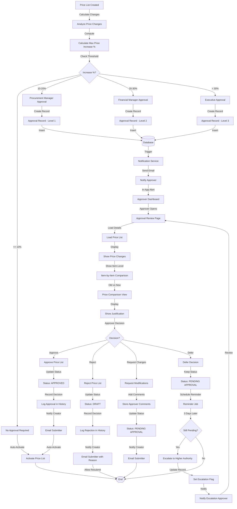

---

## 4. Core Workflows

### 4.1 Create Price List Workflow (UC-PL-001)

```mermaid
flowchart TD
    Start([User Navigates to Price Lists]) --> CheckAuth{Authenticated?}
    CheckAuth -->|No| Login[Redirect to Login]
    Login --> End([End])

    CheckAuth -->|Yes| CheckPerm{Has Permission?}
    CheckPerm -->|No| PermError[Show Permission Error]
    PermError --> End

    CheckPerm -->|Yes| ShowPriceLists[Display Price List Overview]
    ShowPriceLists --> UserAction{User Action?}

    UserAction -->|Create New| StartWizard[Start Price List Wizard]
    UserAction -->|Load Draft| LoadDraft[Load Existing Draft]
    LoadDraft --> StartWizard

    StartWizard --> Step1[Step 1: Basic Information]

    Step1 --> SelectVendor[Select Vendor]
    SelectVendor --> VendorSearch[Search/Filter Vendors]
    VendorSearch --> VendorSelected{Vendor Selected?}
    VendorSelected -->|No| SelectVendor
    VendorSelected -->|Yes| EnterName[Enter Price List Name]

    EnterName --> EnterDesc[Enter Description - Optional]
    EnterDesc --> SelectCurrency[Select Currency]
    SelectCurrency --> SetEffectiveDates[Set Effective Date Range]

    SetEffectiveDates --> ValidateDates{Dates Valid?}
    ValidateDates -->|Start in Past| DateError1[Show Date Error]
    DateError1 --> SetEffectiveDates
    ValidateDates -->|End Before Start| DateError2[Show Date Error]
    DateError2 --> SetEffectiveDates

    ValidateDates -->|Valid| SourceType{Source Type?}
    SourceType -->|Manual| ManualFlag[Mark as Manual]
    SourceType -->|Template| LinkTemplate[Link to Template]
    SourceType -->|RFQ| LinkRFQ[Link to RFQ Award]
    SourceType -->|Contract| LinkContract[Link to Contract]

    ManualFlag --> Targeting
    LinkTemplate --> Targeting
    LinkRFQ --> Targeting
    LinkContract --> ContractFlag{Contract Pricing?}

    ContractFlag -->|Yes| SetContractFlags[Set Contract Flags]
    ContractFlag -->|No| Targeting
    SetContractFlags --> Targeting[Configure Targeting - Optional]

    Targeting --> TargetOption{Targeting?}
    TargetOption -->|All Locations| AllLocations[Applicability: All]
    TargetOption -->|Specific Locations| SelectLocations[Select Locations]
    TargetOption -->|Specific Departments| SelectDepartments[Select Departments]
    TargetOption -->|Combined| SelectBoth[Select Locations & Departments]

    AllLocations --> Step2
    SelectLocations --> ValidateLocations{At Least 1?}
    ValidateLocations -->|No| LocationError[Show Location Error]
    LocationError --> SelectLocations
    ValidateLocations -->|Yes| Step2

    SelectDepartments --> ValidateDepartments{At Least 1?}
    ValidateDepartments -->|No| DeptError[Show Department Error]
    DeptError --> SelectDepartments
    ValidateDepartments -->|Yes| Step2

    SelectBoth --> ValidateBoth{At Least 1 Each?}
    ValidateBoth -->|No| BothError[Show Error]
    BothError --> SelectBoth
    ValidateBoth -->|Yes| Step2[Step 2: Product Selection]

    Step2 --> ProductSearch[Search Products]
    ProductSearch --> SearchMethod{Search Method?}

    SearchMethod -->|By Name/SKU| TextSearch[Enter Search Term]
    SearchMethod -->|By Category| CategoryFilter[Select Category]
    SearchMethod -->|Browse All| ShowAll[Show All Products]

    TextSearch --> DisplayProducts
    CategoryFilter --> DisplayProducts
    ShowAll --> DisplayProducts[Display Product List]

    DisplayProducts --> SelectProduct[Select Product]
    SelectProduct --> AddProduct[Add to Price List]
    AddProduct --> ProductCount{Product Count?}

    ProductCount -->|< 1| NoProductsError[Must Add At Least 1 Product]
    NoProductsError --> ProductSearch

    ProductCount -->|≥ 1| MoreProducts{Add More Products?}
    MoreProducts -->|Yes| ProductSearch
    MoreProducts -->|No| Step3[Step 3: Pricing Details]

    Step3 --> SelectFirstProduct[Select First Product]
    SelectFirstProduct --> EnterPricing[Enter Pricing Information]

    EnterPricing --> BasePrice[Enter Base Price - Required]
    BasePrice --> ValidateBase{Valid Price?}
    ValidateBase -->|≤ 0| PriceError1[Price Must Be Positive]
    PriceError1 --> BasePrice
    ValidateBase -->|> 4 Decimals| PriceError2[Max 4 Decimal Places]
    PriceError2 --> BasePrice

    ValidateBase -->|Valid| UnitPrice[Enter Unit Price - Required]
    UnitPrice --> ValidateUnit{Valid Price?}
    ValidateUnit -->|≤ 0| PriceError3[Price Must Be Positive]
    PriceError3 --> UnitPrice
    ValidateUnit -->|> 4 Decimals| PriceError4[Max 4 Decimal Places]
    PriceError4 --> UnitPrice

    ValidateUnit -->|Valid| OptionalPrices[Enter Case/Bulk Prices - Optional]
    OptionalPrices --> PricingTiers{Add Pricing Tiers?}

    PricingTiers -->|Yes| AddTier[Add Quantity Tier]
    AddTier --> TierDetails[Min Qty, Max Qty, Price]
    TierDetails --> ValidateTier{Valid Tier?}
    ValidateTier -->|Invalid Range| TierError[Show Tier Error]
    TierError --> TierDetails
    ValidateTier -->|Valid| MoreTiers{Add More Tiers?}
    MoreTiers -->|Yes| AddTier
    MoreTiers -->|No| CommercialTerms

    PricingTiers -->|No| CommercialTerms[Enter Commercial Terms]

    CommercialTerms --> MOQ[Enter MOQ - Optional]
    MOQ --> PackSize[Enter Pack Size - Optional]
    PackSize --> LeadTime[Enter Lead Time Days - Optional]
    LeadTime --> ShippingCost[Enter Shipping Cost - Optional]

    ShippingCost --> PriceChangeCheck[Check for Price Changes]
    PriceChangeCheck --> PreviousPrice{Previous Price Exists?}

    PreviousPrice -->|Yes| CalculateChange[Calculate Price Change %]
    CalculateChange --> ChangePercent{Change %?}
    ChangePercent -->|> 10%| RequireJustification[Require Justification]
    RequireJustification --> EnterJustification[Enter Change Reason]
    EnterJustification --> ValidateJustification{Min 20 Chars?}
    ValidateJustification -->|No| JustificationError[Justification Too Short]
    JustificationError --> EnterJustification
    ValidateJustification -->|Yes| FlagForApproval[Flag for Approval]
    FlagForApproval --> ItemNotes

    ChangePercent -->|≤ 10%| ItemNotes
    PreviousPrice -->|No| ItemNotes[Enter Item Notes - Optional]

    ItemNotes --> MoreItems{More Products to Price?}
    MoreItems -->|Yes| SelectFirstProduct
    MoreItems -->|No| Step4[Step 4: Terms & Conditions]

    Step4 --> PaymentTermsSection[Configure Payment Terms]
    PaymentTermsSection --> PaymentMethod[Select Payment Methods]
    PaymentMethod --> NetDays[Enter Net Days]
    NetDays --> ValidateNetDays{Valid?}
    ValidateNetDays -->|< 0| NetDaysError[Must Be Positive]
    NetDaysError --> NetDays
    ValidateNetDays -->|Valid| EarlyPayment{Early Payment Discount?}

    EarlyPayment -->|Yes| DiscountPercent[Enter Discount %]
    DiscountPercent --> DiscountDays[Enter Days for Discount]
    DiscountDays --> WarrantySection
    EarlyPayment -->|No| WarrantySection[Configure Warranty]

    WarrantySection --> WarrantyPeriod[Enter Warranty Period Days]
    WarrantyPeriod --> WarrantyType[Enter Warranty Type]
    WarrantyType --> WarrantyTerms[Enter Warranty Terms]
    WarrantyTerms --> ReturnPolicySection[Configure Return Policy]

    ReturnPolicySection --> ReturnsAccepted{Returns Accepted?}
    ReturnsAccepted -->|Yes| ReturnWindow[Enter Return Window Days]
    ReturnWindow --> RestockingFee{Restocking Fee?}
    RestockingFee -->|Yes| EnterRestockingFee[Enter Restocking Fee %]
    EnterRestockingFee --> ReturnConditions
    RestockingFee -->|No| ReturnConditions[Enter Return Conditions]
    ReturnConditions --> DeliverySection

    ReturnsAccepted -->|No| DeliverySection[Configure Delivery Terms]

    DeliverySection --> DeliveryMethod[Enter Delivery Method]
    DeliveryMethod --> DeliveryDays[Enter Delivery Days]
    DeliveryDays --> FreeShipping{Free Shipping Threshold?}
    FreeShipping -->|Yes| EnterThreshold[Enter Minimum Amount]
    EnterThreshold --> DeliveryZones
    FreeShipping -->|No| DeliveryZones[Enter Delivery Zones - Optional]

    DeliveryZones --> AdditionalTerms[Enter Additional Terms - Optional]
    AdditionalTerms --> Step5[Step 5: Review & Submit]

    Step5 --> ReviewSections[Review All Sections]
    ReviewSections --> ShowSummary[Display Summary]

    ShowSummary --> BasicSummary[Basic Info Summary]
    BasicSummary --> ProductsSummary[Products & Pricing Summary]
    ProductsSummary --> TermsSummary[Terms & Conditions Summary]
    TermsSummary --> ValidationCheck[Run Final Validation]

    ValidationCheck --> AllValid{All Valid?}
    AllValid -->|No| ShowErrors[Highlight Errors]
    ShowErrors --> SelectErrorSection[Go to Error Section]
    SelectErrorSection --> Step1

    AllValid -->|Yes| ApprovalRequired{Approval Required?}
    ApprovalRequired -->|Yes| ShowApprovalNotice[Show Approval Notice]
    ShowApprovalNotice --> UserDecision
    ApprovalRequired -->|No| UserDecision{User Decision?}

    UserDecision -->|Save Draft| SaveDraft[Save as Draft]
    SaveDraft -->|Status: DRAFT| SaveDB[(Save to Database)]

    UserDecision -->|Submit| CheckApproval{Requires Approval?}
    CheckApproval -->|Yes| SubmitForApproval[Submit for Approval]
    SubmitForApproval -->|Status: PENDING_APPROVAL| RouteApproval[Route to Approver]
    RouteApproval -->|Send Email| NotifyApprover[Notify Approver]
    NotifyApprover --> SaveDB

    CheckApproval -->|No| ActivateOption{Activate Now?}
    ActivateOption -->|Yes| ActivatePriceList[Activate Price List]
    ActivatePriceList -->|Status: ACTIVE| CheckSupersede{Supersede Existing?}
    CheckSupersede -->|Yes| SupersedeOld[Mark Old as Superseded]
    SupersedeOld --> SaveDB
    CheckSupersede -->|No| SaveDB

    ActivateOption -->|No| SaveDB

    SaveDB --> CreateHistory[Create History Record]
    CreateHistory --> CheckAlerts[Check Price Alerts]
    CheckAlerts -->|Triggers Found| SendAlerts[Send Alert Notifications]
    CheckAlerts -->|No Alerts| CacheUpdate

    SendAlerts --> CacheUpdate[Update React Query Cache]
    CacheUpdate --> Success[Display Success Message]
    Success --> Navigate[Navigate to Price List Detail]
    Navigate --> End
```

### 4.2 Import Vendor Prices Workflow (UC-PL-002)

```mermaid
flowchart TD
    Start([User Navigates to Import]) --> ShowImport[Display Import Page]
    ShowImport --> DownloadTemplate{Download Template?}

    DownloadTemplate -->|Yes| GenerateTemplate[Generate Template File]
    GenerateTemplate -->|Excel/CSV| DownloadFile[Download Template]
    DownloadFile --> UserFills[User Fills Template Offline]
    UserFills --> UploadInterface

    DownloadTemplate -->|No| UploadInterface[Show Upload Interface]

    UploadInterface --> DragDrop[Drag & Drop or Click to Select]
    DragDrop --> FileSelected{File Selected?}
    FileSelected -->|No| DragDrop

    FileSelected -->|Yes| ValidateFileType{Valid File Type?}
    ValidateFileType -->|No| FileTypeError[Show File Type Error]
    FileTypeError --> DragDrop

    ValidateFileType -->|Yes| CheckFileSize{Size < 10MB?}
    CheckFileSize -->|No| FileSizeError[Show File Size Error]
    FileSizeError --> DragDrop

    CheckFileSize -->|Yes| ParseFile[Parse File Contents]
    ParseFile -->|Read Rows| ExtractData[Extract Row Data]

    ExtractData --> ValidateHeaders{Headers Valid?}
    ValidateHeaders -->|No| HeaderError[Show Header Error]
    HeaderError --> DragDrop

    ValidateHeaders -->|Yes| CheckRowCount{Row Count?}
    CheckRowCount -->|= 0| EmptyError[Show Empty File Error]
    EmptyError --> DragDrop

    CheckRowCount -->|> 10,000| TooManyError[Show Too Many Rows Error]
    TooManyError --> DragDrop

    CheckRowCount -->|1-10,000| StartValidation[Start Row Validation]

    StartValidation --> ValidateVendor[Select Vendor for Import]
    ValidateVendor --> VendorSelected{Vendor Selected?}
    VendorSelected -->|No| VendorError[Show Vendor Selection Error]
    VendorError --> ValidateVendor

    VendorSelected -->|Yes| SetDates[Set Effective Dates]
    SetDates --> ValidateImportDates{Dates Valid?}
    ValidateImportDates -->|No| DateError[Show Date Error]
    DateError --> SetDates

    ValidateImportDates -->|Yes| ProcessRows[Process Each Row]

    ProcessRows --> ForEachRow[For Each Row]
    ForEachRow --> CheckProductCode{Product Code Exists?}

    CheckProductCode -->|No| ErrorRow1[Mark as ERROR: Product Not Found]
    ErrorRow1 --> NextRow

    CheckProductCode -->|Yes| CheckProductActive{Product Active?}
    CheckProductActive -->|No| WarningRow1[Mark as WARNING: Product Inactive]
    WarningRow1 --> ContinueValidation

    CheckProductActive -->|Yes| ContinueValidation[Continue Validation]

    ContinueValidation --> CheckBasePrice{Base Price Valid?}
    CheckBasePrice -->|≤ 0| ErrorRow2[Mark as ERROR: Invalid Price]
    ErrorRow2 --> NextRow

    CheckBasePrice -->|Valid| CheckUnitPrice{Unit Price Valid?}
    CheckUnitPrice -->|≤ 0| ErrorRow3[Mark as ERROR: Invalid Unit Price]
    ErrorRow3 --> NextRow

    CheckUnitPrice -->|Valid| CheckOptionalFields{Optional Fields Valid?}
    CheckOptionalFields -->|Invalid| WarningRow2[Mark as WARNING: Field Issue]
    WarningRow2 --> ValidRow

    CheckOptionalFields -->|Valid| ValidRow[Mark as VALID]

    ErrorRow1 --> CountErrors
    ErrorRow2 --> CountErrors
    ErrorRow3 --> CountErrors
    WarningRow1 --> CountWarnings
    WarningRow2 --> CountWarnings
    ValidRow --> CountValid[Count Valid Rows]

    CountErrors --> NextRow
    CountWarnings --> NextRow
    CountValid --> NextRow{More Rows?}

    NextRow -->|Yes| ForEachRow
    NextRow -->|No| CompileSummary[Compile Validation Summary]

    CompileSummary --> SummaryCounts[Count: Valid, Warnings, Errors]
    SummaryCounts --> DisplayPreview[Display Preview Table]

    DisplayPreview --> ShowStats[Show Statistics Cards]
    ShowStats --> ShowTable[Show First 100 Rows with Status]
    ShowTable --> FilterOptions[Filter: All, Valid, Warning, Error]

    FilterOptions --> UserReview{User Review}
    UserReview -->|View Errors| ScrollToErrors[Highlight Error Rows]
    ScrollToErrors --> UserReview

    UserReview -->|Export Errors| ExportErrorReport[Generate Error Report]
    ExportErrorReport --> DownloadErrors[Download Error Excel]
    DownloadErrors --> UserReview

    UserReview -->|Fix & Reupload| CancelImport[Cancel Current Import]
    CancelImport --> DragDrop

    UserReview -->|Cancel| End([End])

    UserReview -->|Confirm Import| CheckHasValid{Has Valid Rows?}
    CheckHasValid -->|No| NoValidError[Show No Valid Rows Error]
    NoValidError --> UserReview

    CheckHasValid -->|Yes| ConfirmDialog[Show Confirmation Dialog]
    ConfirmDialog --> ShowCounts[Display: Import X Valid Rows, Skip Y Errors]
    ShowCounts --> UserConfirm{User Confirms?}
    UserConfirm -->|No| UserReview

    UserConfirm -->|Yes| QueueImport[Add to Import Queue]
    QueueImport --> ShowProgress[Show Progress Indicator]

    ShowProgress --> ProcessQueue[Background Job Processes Queue]
    ProcessQueue --> CreatePriceList[Create Price List Entity]

    CreatePriceList --> GeneratePLNumber[Generate Price List Number]
    GeneratePLNumber --> InsertPriceList[Insert Price List Record]
    InsertPriceList --> BulkInsertItems[Bulk Insert Line Items]

    BulkInsertItems --> CreateHistoryRecord[Create History Record]
    CreateHistoryRecord --> TransactionCommit{Transaction Commit?}

    TransactionCommit -->|Fail| Rollback[Rollback All Changes]
    Rollback --> ImportError[Show Import Error]
    ImportError --> ErrorDetails[Display Error Details]
    ErrorDetails --> OfferRetry[Offer Retry Option]
    OfferRetry --> UserRetry{Retry?}
    UserRetry -->|Yes| QueueImport
    UserRetry -->|No| End

    TransactionCommit -->|Success| GenerateReport[Generate Import Report]
    GenerateReport --> ReportStats[Imported: X items, Skipped: Y items]
    ReportStats --> SendNotification[Send Success Notification]
    SendNotification --> UpdateCache[Update React Query Cache]
    UpdateCache --> ShowSuccess[Display Success Message]
    ShowSuccess --> NavigateToList[Navigate to Price List Detail]
    NavigateToList --> End
```

### 4.3 Update Existing Prices Workflow (UC-PL-003)

```mermaid
flowchart TD
    Start([User Opens Price List Detail]) --> CheckStatus{Price List Status?}
    CheckStatus -->|Active/Expired/Cancelled| ReadOnly[Display Read-Only View]
    ReadOnly --> ViewOnly[Cannot Edit Active Price List]
    ViewOnly --> End([End])

    CheckStatus -->|Draft| LoadPriceList[Load Price List Details]
    CheckStatus -->|Pending Approval| LoadPriceList

    LoadPriceList --> DisplayItems[Display Line Items Table]
    DisplayItems --> EditOptions[Show Edit Options]

    EditOptions --> UserAction{User Action?}
    UserAction -->|Edit Single Item| SelectItem[Select Item Row]
    UserAction -->|Bulk Edit| SelectMultiple[Select Multiple Items]
    UserAction -->|Add Item| AddNewItem[Add New Product]
    UserAction -->|Remove Item| DeleteItem[Delete Selected Items]

    SelectItem --> InlineEdit[Enable Inline Editing]
    InlineEdit --> EditFields[Edit Price Fields]

    EditFields --> ChangeDetection[Detect Changes]
    ChangeDetection --> PreviousPrice{Previous Price Exists?}

    PreviousPrice -->|Yes| CalculateChange[Calculate % Change]
    CalculateChange --> ChangeAmount{Change Amount?}
    ChangeAmount -->|> 10% Increase| ShowWarning[Show Approval Warning]
    ShowWarning --> RequireReason[Require Change Justification]
    RequireReason --> EnterReason[Enter Change Reason]
    EnterReason --> ValidateReason{Min 20 Characters?}
    ValidateReason -->|No| ReasonError[Show Reason Length Error]
    ReasonError --> EnterReason
    ValidateReason -->|Yes| FlagItem[Flag Item for Approval]
    FlagItem --> SaveChanges

    ChangeAmount -->|≤ 10% Increase| SaveChanges
    ChangeAmount -->|Decrease| SaveChanges[Save Item Changes]
    PreviousPrice -->|No| SaveChanges

    SaveChanges --> ValidatePrice{Price Valid?}
    ValidatePrice -->|No| PriceError[Show Price Validation Error]
    PriceError --> EditFields

    ValidatePrice -->|Yes| UpdateItem[Update Item Record]
    UpdateItem --> CreateHistoryEntry[Create History Entry]
    CreateHistoryEntry --> ItemUpdated[Item Updated Successfully]
    ItemUpdated --> RefreshTable[Refresh Items Table]
    RefreshTable --> EditOptions

    SelectMultiple --> BulkEditForm[Show Bulk Edit Form]
    BulkEditForm --> SelectBulkAction{Bulk Action Type?}

    SelectBulkAction -->|Increase by %| IncreasePercent[Enter Increase %]
    SelectBulkAction -->|Decrease by %| DecreasePercent[Enter Decrease %]
    SelectBulkAction -->|Set Fixed Amount| SetAmount[Enter New Amount]
    SelectBulkAction -->|Update Lead Time| UpdateLeadTime[Enter New Lead Time]
    SelectBulkAction -->|Update MOQ| UpdateMOQ[Enter New MOQ]

    IncreasePercent --> ValidateBulkPercent{Valid %?}
    ValidateBulkPercent -->|No| BulkPercentError[Show Error]
    BulkPercentError --> IncreasePercent
    ValidateBulkPercent -->|Yes| ApplyBulkIncrease

    DecreasePercent --> ValidateBulkPercent
    SetAmount --> ValidateBulkAmount{Valid Amount?}
    ValidateBulkAmount -->|No| BulkAmountError[Show Error]
    BulkAmountError --> SetAmount
    ValidateBulkAmount -->|Yes| ApplyBulkChange

    UpdateLeadTime --> ApplyBulkChange
    UpdateMOQ --> ApplyBulkChange[Apply Changes to Selected Items]

    ApplyBulkIncrease --> PreviewBulkChanges
    ApplyBulkChange --> PreviewBulkChanges[Preview Bulk Changes]

    PreviewBulkChanges --> ShowPreviewTable[Show Before/After Comparison]
    ShowPreviewTable --> CheckBulkApproval{Any Changes > 10%?}
    CheckBulkApproval -->|Yes| BulkApprovalWarning[Show Bulk Approval Warning]
    BulkApprovalWarning --> RequireBulkReason[Require Bulk Justification]
    RequireBulkReason --> EnterBulkReason[Enter Reason for Bulk Change]
    EnterBulkReason --> ValidateBulkReason{Min 50 Characters?}
    ValidateBulkReason -->|No| BulkReasonError[Show Reason Error]
    BulkReasonError --> EnterBulkReason
    ValidateBulkReason -->|Yes| FlagBulk[Flag for Approval]
    FlagBulk --> ConfirmBulkChanges

    CheckBulkApproval -->|No| ConfirmBulkChanges{User Confirms?}
    ConfirmBulkChanges -->|No| CancelBulk[Cancel Bulk Edit]
    CancelBulk --> EditOptions

    ConfirmBulkChanges -->|Yes| ApplyBulkUpdates[Apply Bulk Updates]
    ApplyBulkUpdates --> UpdateMultipleItems[Update Multiple Item Records]
    UpdateMultipleItems --> CreateBulkHistory[Create Bulk History Entries]
    CreateBulkHistory --> BulkSuccess[Bulk Update Successful]
    BulkSuccess --> RefreshTable

    AddNewItem --> ProductSearch[Search Product Catalog]
    ProductSearch --> SelectProduct[Select Product to Add]
    SelectProduct --> EnterNewPricing[Enter Pricing for New Item]
    EnterNewPricing --> ValidateNewItem{Valid?}
    ValidateNewItem -->|No| NewItemError[Show Validation Error]
    NewItemError --> EnterNewPricing

    ValidateNewItem -->|Yes| AddItemToPriceList[Add Item to Price List]
    AddItemToPriceList --> CreateNewItemRecord[Create Item Record]
    CreateNewItemRecord --> LogAddition[Log Item Addition]
    LogAddition --> ItemAdded[Item Added Successfully]
    ItemAdded --> RefreshTable

    DeleteItem --> ConfirmDelete{Confirm Delete?}
    ConfirmDelete -->|No| EditOptions
    ConfirmDelete -->|Yes| RemoveItems[Remove Selected Items]
    RemoveItems --> LogDeletion[Log Item Deletion]
    LogDeletion --> ItemsDeleted[Items Deleted Successfully]
    ItemsDeleted --> RefreshTable

    RefreshTable --> CheckModified{Price List Modified?}
    CheckModified -->|No| End
    CheckModified -->|Yes| ShowSaveOptions[Show Save Options]

    ShowSaveOptions --> SaveOption{Save Option?}
    SaveOption -->|Save Changes| SavePriceList[Save Price List]
    SaveOption -->|Discard Changes| DiscardChanges[Revert All Changes]
    SaveOption -->|Submit for Approval| SubmitChanges[Submit for Approval]

    SavePriceList --> UpdatePriceListRecord[Update Price List Record]
    UpdatePriceListRecord --> UpdateHistory[Update History Table]
    UpdateHistory --> CheckApprovalNeeded{Approval Needed?}
    CheckApprovalNeeded -->|Yes| SetPendingStatus[Status: PENDING_APPROVAL]
    SetPendingStatus -->|Route| RouteApproval[Route to Approver]
    RouteApproval --> NotifyApprover[Notify Approver]
    NotifyApprover --> SaveSuccess

    CheckApprovalNeeded -->|No| SaveSuccess[Changes Saved Successfully]
    SaveSuccess --> UpdateCache[Update Cache]
    UpdateCache --> ShowSuccessMessage[Display Success Message]
    ShowSuccessMessage --> End

    DiscardChanges --> ReloadOriginal[Reload Original Data]
    ReloadOriginal --> DiscardSuccess[Changes Discarded]
    DiscardSuccess --> End

    SubmitChanges --> FinalValidation[Run Final Validation]
    FinalValidation --> AllValidForSubmit{All Valid?}
    AllValidForSubmit -->|No| ShowValidationErrors[Show Validation Errors]
    ShowValidationErrors --> EditOptions

    AllValidForSubmit -->|Yes| SubmitForApproval[Submit for Approval]
    SubmitForApproval --> UpdatePriceListRecord
```

### 4.4 Compare Prices Across Vendors Workflow (UC-PL-004)

```mermaid
flowchart TD
    Start([User Navigates to Price Comparison]) --> ShowSearch[Display Product Search]
    ShowSearch --> SearchMethod{Search Method?}

    SearchMethod -->|Product Name| EnterName[Enter Product Name]
    SearchMethod -->|Product Code/SKU| EnterCode[Enter Product Code]
    SearchMethod -->|Category| SelectCategory[Select Product Category]
    SearchMethod -->|Browse| BrowseProducts[Browse All Products]

    EnterName --> ExecuteSearch
    EnterCode --> ExecuteSearch
    SelectCategory --> ExecuteSearch
    BrowseProducts --> ExecuteSearch[Execute Product Search]

    ExecuteSearch --> ProductsFound{Products Found?}
    ProductsFound -->|No| NoResults[Display No Results Message]
    NoResults --> SuggestAlternate[Suggest Alternative Search]
    SuggestAlternate --> ShowSearch

    ProductsFound -->|Yes| DisplayProductList[Display Product Results]
    DisplayProductList --> UserSelectProduct[User Selects Product]

    UserSelectProduct --> LoadComparison[Load Price Comparison]
    LoadComparison --> ShowFilters[Show Comparison Filters]

    ShowFilters --> FilterOptions{Apply Filters?}
    FilterOptions -->|Location| SelectLocation[Select Location]
    FilterOptions -->|Department| SelectDepartment[Select Department]
    FilterOptions -->|Vendor Tier| SelectTier[Select Vendor Tier]
    FilterOptions -->|No Filter| SkipFilters[Skip Filters]

    SelectLocation --> ApplyLocationFilter
    SelectDepartment --> ApplyDepartmentFilter
    SelectTier --> ApplyTierFilter
    SkipFilters --> QueryDatabase

    ApplyLocationFilter --> QueryDatabase
    ApplyDepartmentFilter --> QueryDatabase
    ApplyTierFilter --> QueryDatabase[Query Active Price Lists]

    QueryDatabase --> FilterByProduct[Filter by Selected Product]
    FilterByProduct --> FilterByStatus[Filter Status = ACTIVE]
    FilterByStatus --> FilterByDates[Filter by Effective Dates]
    FilterByDates --> ApplyTargeting[Apply Targeting Filters]

    ApplyTargeting --> CheckTargetingJSON{Targeting JSON?}
    CheckTargetingJSON -->|Yes| ParseTargeting[Parse Targeting JSON]
    ParseTargeting --> MatchLocation{Location Match?}
    MatchLocation -->|Required & No Match| ExcludeVendor1[Exclude this Price List]
    MatchLocation -->|Match or Not Required| CheckDepartment{Department Match?}
    CheckDepartment -->|Required & No Match| ExcludeVendor2[Exclude this Price List]
    CheckDepartment -->|Match or Not Required| IncludeVendor

    CheckTargetingJSON -->|No| IncludeVendor[Include in Comparison]

    ExcludeVendor1 --> NextPriceList
    ExcludeVendor2 --> NextPriceList{More Price Lists?}
    NextPriceList -->|Yes| FilterByProduct
    NextPriceList -->|No| CompileResults

    IncludeVendor --> ExtractPricingData[Extract Pricing Data]
    ExtractPricingData --> UnitPrice[Get Unit Price]
    UnitPrice --> CasePrice[Get Case Price]
    CasePrice --> BulkPrice[Get Bulk Price]
    BulkPrice --> CommercialTerms[Get Lead Time, MOQ]
    CommercialTerms --> VendorInfo[Get Vendor Information]
    VendorInfo --> AddToResults[Add to Results Array]
    AddToResults --> NextPriceList

    CompileResults --> CheckResults{Results Found?}
    CheckResults -->|No| NoComparison[Display No Active Prices Message]
    NoComparison --> SuggestActions[Suggest: Create Price List or Change Filters]
    SuggestActions --> End([End])

    CheckResults -->|Yes| CalculateStatistics[Calculate Statistics]
    CalculateStatistics --> FindLowest[Find Lowest Price]
    FindLowest --> FindHighest[Find Highest Price]
    FindHighest --> CalculateAverage[Calculate Average Price]
    CalculateAverage --> CalculateMedian[Calculate Median Price]
    CalculateMedian --> CalculateSpread[Calculate Price Spread]
    CalculateSpread --> CalculateVariance[Calculate Variance]

    CalculateVariance --> DisplayStats[Display Statistics Cards]
    DisplayStats --> ShowLowestCard[Lowest Price Card - Green]
    ShowLowestCard --> ShowHighestCard[Highest Price Card - Red]
    ShowHighestCard --> ShowAverageCard[Average Price Card - Blue]
    ShowAverageCard --> ShowMedianCard[Median Price Card]
    ShowMedianCard --> ShowSpreadCard[Price Spread Card]

    ShowSpreadCard --> DisplayTable[Display Comparison Table]
    DisplayTable --> TableHeaders[Headers: Vendor, Price, Case Price, Lead Time, MOQ, Valid Until]

    TableHeaders --> PopulateRows[Populate Vendor Rows]
    PopulateRows --> ApplyColorCoding[Apply Color Coding]

    ApplyColorCoding --> LowestGreen[Highlight Lowest in Green]
    LowestGreen --> HighestRed[Highlight Highest in Red]
    HighestRed --> AverageBlue[Highlight Average Range in Blue]

    AverageBlue --> AddBadges[Add Badges]
    AddBadges --> LowestBadge[Add "Lowest" Badge to Best Price]
    LowestBadge --> ContractBadge[Add "Contract" Badge if Applicable]
    ContractBadge --> PreferredBadge[Add "Preferred" Badge if Applicable]

    PreferredBadge --> EnableSorting[Enable Column Sorting]
    EnableSorting --> SortDefault[Default Sort: Price Ascending]

    SortDefault --> ShowViewOptions[Show View Options]
    ShowViewOptions --> ViewType{View Type?}

    ViewType -->|Table View| TableView[Display as Table - Default]
    ViewType -->|Card View| CardView[Display as Cards]
    ViewType -->|Chart View| ChartView[Display as Bar Chart]

    TableView --> UserInteraction
    CardView --> UserInteraction
    ChartView --> UserInteraction{User Interaction?}

    UserInteraction -->|Sort Column| SortTable[Re-sort by Selected Column]
    SortTable --> UpdateTable[Update Table Display]
    UpdateTable --> UserInteraction

    UserInteraction -->|Filter Results| ApplyTableFilter[Apply Additional Filters]
    ApplyTableFilter --> UpdateTable

    UserInteraction -->|View Vendor Detail| OpenVendorDetail[Open Vendor Detail Page]
    OpenVendorDetail --> ShowVendorInfo[Display Vendor Information]
    ShowVendorInfo --> UserInteraction

    UserInteraction -->|View Price List| OpenPriceList[Open Price List Detail]
    OpenPriceList --> ShowPriceListDetail[Display Full Price List]
    ShowPriceListDetail --> UserInteraction

    UserInteraction -->|Export Comparison| ExportDialog[Show Export Dialog]

    ExportDialog --> SelectFormat{Export Format?}
    SelectFormat -->|Excel| GenerateExcel[Generate Excel File]
    SelectFormat -->|CSV| GenerateCSV[Generate CSV File]
    SelectFormat -->|PDF| GeneratePDF[Generate PDF Report]

    GenerateExcel --> AddMetadata
    GenerateCSV --> AddMetadata
    GeneratePDF --> AddMetadata[Add Metadata & Timestamp]

    AddMetadata --> DownloadFile[Download File]
    DownloadFile --> ExportSuccess[Export Successful]
    ExportSuccess --> UserInteraction

    UserInteraction -->|Close| End
```

### 4.5 View Price History Workflow (UC-PL-005)

```mermaid
flowchart TD
    Start([User Opens Product Detail]) --> ShowProduct[Display Product Information]
    ShowProduct --> ViewOptions[Show View Options]

    ViewOptions --> UserSelect{User Selects?}
    UserSelect -->|View Price History| LoadHistory[Load Price History]
    UserSelect -->|Other Action| OtherAction[Handle Other Action]
    OtherAction --> End([End])

    LoadHistory --> QueryHistory[Query Price List History Table]
    QueryHistory --> FilterByProduct[Filter by Product ID]
    FilterByProduct --> FilterByChangeType[Filter Change Type = PRICE_CHANGED]
    FilterByChangeType --> SortByDate[Sort by Changed Date DESC]
    SortByDate --> LimitResults{Result Count?}

    LimitResults -->|> 100| Limit100[Limit to Last 100 Changes]
    LimitResults -->|≤ 100| AllResults[Return All Results]

    Limit100 --> ProcessResults
    AllResults --> ProcessResults[Process History Results]

    ProcessResults --> ExtractData[Extract Price Change Data]
    ExtractData --> ForEachRecord[For Each History Record]

    ForEachRecord --> GetOldPrice[Get Old Price]
    GetOldPrice --> GetNewPrice[Get New Price]
    GetNewPrice --> GetChangeDate[Get Changed Date]
    GetChangeDate --> GetVendorInfo[Get Vendor Information]
    GetVendorInfo --> GetPriceList[Get Price List Reference]
    GetPriceList --> CalculateChange[Calculate % Change]
    CalculateChange --> AddToDataset[Add to Dataset]

    AddToDataset --> MoreRecords{More Records?}
    MoreRecords -->|Yes| ForEachRecord
    MoreRecords -->|No| CheckDataCount{Has Data?}

    CheckDataCount -->|No| NoHistoryMsg[Display No History Message]
    NoHistoryMsg --> SuggestCreate[Suggest Creating Price List]
    SuggestCreate --> End

    CheckDataCount -->|Yes| ApplyFilters[Apply User Filters]

    ApplyFilters --> FilterOptions{Filter Options?}
    FilterOptions -->|Date Range| SelectDateRange[Select Date Range]
    FilterOptions -->|Vendor| SelectVendor[Select Specific Vendor]
    FilterOptions -->|Price Range| SetPriceRange[Set Min/Max Price]
    FilterOptions -->|No Filter| SkipFilters[Use All Data]

    SelectDateRange --> ApplyDateFilter
    SelectVendor --> ApplyVendorFilter
    SetPriceRange --> ApplyPriceFilter
    SkipFilters --> PrepareVisualization

    ApplyDateFilter --> PrepareVisualization
    ApplyVendorFilter --> PrepareVisualization
    ApplyPriceFilter --> PrepareVisualization[Prepare Data for Visualization]

    PrepareVisualization --> ChartData[Format Data for Chart]
    ChartData --> CreateDataPoints[Create Time Series Data Points]
    CreateDataPoints --> GroupByVendor[Group by Vendor]
    GroupByVendor --> AssignColors[Assign Color to Each Vendor]

    AssignColors --> RenderChart[Render Line Chart]
    RenderChart --> XAxis[X-Axis: Time/Date]
    XAxis --> YAxis[Y-Axis: Price]
    YAxis --> PlotLines[Plot Lines for Each Vendor]

    PlotLines --> VendorLines[Multiple Vendor Lines]
    VendorLines --> AddDataPoints[Add Data Points with Markers]
    AddDataPoints --> AddLabels[Add Hover Labels]
    AddLabels --> EnableTooltips[Enable Interactive Tooltips]

    EnableTooltips --> TooltipInfo[Show: Date, Price, Vendor, % Change]
    TooltipInfo --> EnableZoom[Enable Zoom & Pan]
    EnableZoom --> AddLegend[Add Interactive Legend]
    AddLegend --> LegendControls[Toggle Vendor Lines On/Off]

    LegendControls --> CalculateTrends[Calculate Trend Analysis]
    CalculateTrends --> TrendDirection[Determine: Upward, Downward, Stable]
    TrendDirection --> TrendStrength[Calculate Trend Strength]
    TrendStrength --> Seasonality[Identify Seasonality Patterns]
    Seasonality --> VolatilityScore[Calculate Volatility Score]

    VolatilityScore --> Forecast[Generate Price Forecast]
    Forecast --> ForecastMethod{Forecast Method?}
    ForecastMethod -->|Linear| LinearRegression[Apply Linear Regression]
    ForecastMethod -->|Moving Avg| MovingAverage[Calculate Moving Average]
    ForecastMethod -->|Seasonal| SeasonalModel[Apply Seasonal Model]

    LinearRegression --> DisplayForecast
    MovingAverage --> DisplayForecast
    SeasonalModel --> DisplayForecast[Display Forecast Line]

    DisplayForecast --> ForecastLabel[Add "Forecast" Label]
    ForecastLabel --> ForecastUncertainty[Show Confidence Interval]

    ForecastUncertainty --> DisplayStats[Display Statistics Panel]
    DisplayStats --> StatCards[Show Statistic Cards]

    StatCards --> MeanPrice[Mean Price]
    MeanPrice --> MedianPrice[Median Price]
    MedianPrice --> StdDeviation[Standard Deviation]
    StdDeviation --> MinMax[Min & Max Prices]
    MinMax --> PriceRange[Price Range]
    PriceRange --> VolatilityDisplay[Volatility Score]

    VolatilityDisplay --> TrendIndicator[Trend Indicator]
    TrendIndicator --> TrendIcon[Icon: ↑ Upward, ↓ Downward, → Stable]
    TrendIcon --> TrendPercentage[Trend Percentage]

    TrendPercentage --> HistoryTable[Display History Data Table]
    HistoryTable --> TableColumns[Columns: Date, Vendor, Old Price, New Price, Change %, Reason]
    TableColumns --> PopulateTable[Populate Table Rows]
    PopulateTable --> ColorCodeChanges[Color Code Changes]

    ColorCodeChanges --> GreenDecrease[Green for Price Decreases]
    GreenDecrease --> RedIncrease[Red for Price Increases]
    RedIncrease --> EnableTableSort[Enable Table Sorting]

    EnableTableSort --> EnablePagination[Enable Pagination]
    EnablePagination --> ShowPageSize[Show: 10, 25, 50, 100 per page]

    ShowPageSize --> ExportOptions[Show Export Options]
    ExportOptions --> UserAction{User Action?}

    UserAction -->|Change Date Range| UpdateDateRange[Update Date Range Filter]
    UpdateDateRange --> ApplyDateFilter

    UserAction -->|Toggle Vendor| ToggleVendor[Show/Hide Vendor Line]
    ToggleVendor --> UpdateChart[Refresh Chart]
    UpdateChart --> UserAction

    UserAction -->|Sort Table| SortColumn[Sort by Selected Column]
    SortColumn --> RefreshTable[Refresh Table Display]
    RefreshTable --> UserAction

    UserAction -->|Export Data| ExportDialog[Show Export Dialog]

    ExportDialog --> ExportFormat{Export Format?}
    ExportFormat -->|Excel| ExportExcel[Generate Excel with Chart]
    ExportFormat -->|CSV| ExportCSV[Generate CSV Data]
    ExportFormat -->|PDF| ExportPDF[Generate PDF Report]

    ExportExcel --> AddChartImage[Embed Chart Image]
    AddChartImage --> AddStatsTable[Add Statistics Table]
    AddStatsTable --> AddDataTable[Add Data Table]
    AddDataTable --> DownloadExcel[Download Excel File]
    DownloadExcel --> ExportSuccess

    ExportCSV --> DownloadCSV[Download CSV File]
    DownloadCSV --> ExportSuccess

    ExportPDF --> FormatPDF[Format PDF Layout]
    FormatPDF --> AddPDFChart[Add Chart Image]
    AddPDFChart --> AddPDFStats[Add Statistics]
    AddPDFStats --> AddPDFTable[Add Data Table]
    AddPDFTable --> DownloadPDF[Download PDF File]
    DownloadPDF --> ExportSuccess[Export Successful]

    ExportSuccess --> UserAction

    UserAction -->|Close| End
```

### 4.6 Set Price Alerts Workflow (UC-PL-006)

```mermaid
flowchart TD
    Start([User Navigates to Price Alerts]) --> ShowAlerts[Display Existing Alerts]
    ShowAlerts --> AlertsList[List Active Alerts]

    AlertsList --> UserAction{User Action?}
    UserAction -->|Create New Alert| CreateAlert[Click Create Alert Button]
    UserAction -->|Edit Alert| EditAlert[Select Alert to Edit]
    UserAction -->|Delete Alert| DeleteAlert[Select Alert to Delete]
    UserAction -->|View Triggered| ViewHistory[View Alert History]

    ViewHistory --> ShowTriggered[Display Triggered Alerts]
    ShowTriggered --> End([End])

    DeleteAlert --> ConfirmDelete{Confirm Delete?}
    ConfirmDelete -->|No| UserAction
    ConfirmDelete -->|Yes| RemoveAlert[Delete Alert Record]
    RemoveAlert --> DeleteSuccess[Alert Deleted Successfully]
    DeleteSuccess --> RefreshList[Refresh Alert List]
    RefreshList --> UserAction

    EditAlert --> LoadAlert[Load Alert Configuration]
    LoadAlert --> CreateAlert

    CreateAlert --> AlertForm[Show Alert Configuration Form]

    AlertForm --> Step1Alert[Step 1: Alert Type]
    Step1Alert --> SelectType{Select Alert Type}

    SelectType -->|Price Increase| TypeIncrease[Alert Type: INCREASE]
    SelectType -->|Price Decrease| TypeDecrease[Alert Type: DECREASE]
    SelectType -->|Any Change| TypeAny[Alert Type: ANY_CHANGE]
    SelectType -->|Expiration| TypeExpiration[Alert Type: EXPIRATION]
    SelectType -->|New List| TypeNew[Alert Type: NEW_LIST]

    TypeIncrease --> Step2Alert
    TypeDecrease --> Step2Alert
    TypeAny --> Step2Alert
    TypeExpiration --> Step2Alert
    TypeNew --> Step2Alert[Step 2: Scope Definition]

    Step2Alert --> SelectScope{Select Scope Type}

    SelectScope -->|Product| ScopeProduct[Scope: PRODUCT]
    SelectScope -->|Category| ScopeCategory[Scope: CATEGORY]
    SelectScope -->|Vendor| ScopeVendor[Scope: VENDOR]
    SelectScope -->|Department| ScopeDepartment[Scope: DEPARTMENT]

    ScopeProduct --> SearchProduct[Search & Select Product]
    SearchProduct --> ValidateProduct{Product Selected?}
    ValidateProduct -->|No| ProductError[Show Product Selection Error]
    ProductError --> SearchProduct
    ValidateProduct -->|Yes| Step3Alert

    ScopeCategory --> SelectCategoryFilter[Select Category]
    SelectCategoryFilter --> ValidateCategory{Category Selected?}
    ValidateCategory -->|No| CategoryError[Show Category Selection Error]
    CategoryError --> SelectCategoryFilter
    ValidateCategory -->|Yes| Step3Alert

    ScopeVendor --> SearchVendor[Search & Select Vendor]
    SearchVendor --> ValidateVendor{Vendor Selected?}
    ValidateVendor -->|No| VendorError[Show Vendor Selection Error]
    VendorError --> SearchVendor
    ValidateVendor -->|Yes| Step3Alert

    ScopeDepartment --> SelectDept[Select Department]
    SelectDept --> ValidateDept{Department Selected?}
    ValidateDept -->|No| DeptError[Show Department Selection Error]
    DeptError --> SelectDept
    ValidateDept -->|Yes| Step3Alert[Step 3: Threshold Configuration]

    Step3Alert --> ThresholdType{Alert Type?}

    ThresholdType -->|Increase/Decrease| SetThreshold[Set Percentage Threshold]
    ThresholdType -->|Any Change| SkipThreshold[No Threshold Needed]
    ThresholdType -->|Expiration| SetDaysBefore[Set Days Before Expiration]
    ThresholdType -->|New List| SkipThreshold

    SetThreshold --> EnterPercent[Enter Percentage]
    EnterPercent --> ValidatePercent{Valid %?}
    ValidatePercent -->|< 1 or > 100| PercentError[Show Percentage Error]
    PercentError --> EnterPercent
    ValidatePercent -->|Valid| OptionalFilters

    SetDaysBefore --> EnterDays[Enter Number of Days]
    EnterDays --> ValidateDays{Valid Days?}
    ValidateDays -->|< 1 or > 365| DaysError[Show Days Error]
    DaysError --> EnterDays
    ValidateDays -->|Valid| OptionalFilters

    SkipThreshold --> OptionalFilters[Optional: Additional Filters]

    OptionalFilters --> AddFilters{Add Filters?}
    AddFilters -->|Min Price| SetMinPrice[Set Minimum Price Threshold]
    AddFilters -->|Max Price| SetMaxPrice[Set Maximum Price Threshold]
    AddFilters -->|Locations| SelectLocations[Select Specific Locations]
    AddFilters -->|No More| Step4Alert

    SetMinPrice --> ValidateMinPrice{Valid?}
    ValidateMinPrice -->|No| MinPriceError[Show Error]
    MinPriceError --> SetMinPrice
    ValidateMinPrice -->|Yes| AddFilters

    SetMaxPrice --> ValidateMaxPrice{Valid?}
    ValidateMaxPrice -->|No| MaxPriceError[Show Error]
    MaxPriceError --> SetMaxPrice
    ValidateMaxPrice -->|Yes| AddFilters

    SelectLocations --> ValidateLocations{At Least 1?}
    ValidateLocations -->|No| LocationsError[Show Error]
    LocationsError --> SelectLocations
    ValidateLocations -->|Yes| AddFilters

    AddFilters --> Step4Alert[Step 4: Notification Methods]

    Step4Alert --> SelectMethods[Select Notification Methods]

    SelectMethods --> EmailOption{Email Notifications?}
    EmailOption -->|Yes| EnableEmail[Enable Email]
    EnableEmail --> VerifyEmail[Verify Email Address]
    VerifyEmail --> InAppOption

    EmailOption -->|No| InAppOption{In-App Notifications?}

    InAppOption -->|Yes| EnableInApp[Enable In-App]
    EnableInApp --> SMSOption

    InAppOption -->|No| SMSOption{SMS Notifications?}

    SMSOption -->|Yes| EnableSMS[Enable SMS]
    EnableSMS --> VerifyPhone[Verify Phone Number]
    VerifyPhone --> ValidatePhone{Valid Phone?}
    ValidatePhone -->|No| PhoneError[Show Phone Error]
    PhoneError --> VerifyPhone
    ValidatePhone -->|Yes| CheckMethods

    SMSOption -->|No| CheckMethods{At Least 1 Method?}

    CheckMethods -->|No| MethodError[Must Select At Least 1 Method]
    MethodError --> SelectMethods

    CheckMethods -->|Yes| Step5Alert[Step 5: Frequency]

    Step5Alert --> SelectFrequency{Select Frequency}

    SelectFrequency -->|Immediate| FreqImmediate[Frequency: IMMEDIATE]
    SelectFrequency -->|Daily Digest| FreqDaily[Frequency: DAILY_DIGEST]
    SelectFrequency -->|Weekly Summary| FreqWeekly[Frequency: WEEKLY_SUMMARY]

    FreqImmediate --> ReviewAlert
    FreqDaily --> ReviewAlert
    FreqWeekly --> ReviewAlert[Review Alert Configuration]

    ReviewAlert --> ShowSummary[Display Configuration Summary]
    ShowSummary --> AlertSummary[Show: Type, Scope, Threshold, Methods, Frequency]

    AlertSummary --> UserConfirm{User Confirms?}
    UserConfirm -->|No| BackToEdit[Go Back to Edit]
    BackToEdit --> AlertForm

    UserConfirm -->|Yes| SaveAlert[Save Alert Configuration]

    SaveAlert --> CreateAlertRecord[Create Alert Record]
    CreateAlertRecord --> ValidateAlert{Validation Pass?}
    ValidateAlert -->|No| SaveError[Show Save Error]
    SaveError --> AlertForm

    ValidateAlert -->|Yes| SetActive[Set Alert Status: ACTIVE]
    SetActive --> InsertDB[(Insert into Database)]
    InsertDB --> ScheduleCheck[Schedule Alert Check Job]
    ScheduleCheck --> SaveSuccess[Alert Created Successfully]

    SaveSuccess --> ShowConfirmation[Display Success Message]
    ShowConfirmation --> NavigateToList[Navigate to Alerts List]
    NavigateToList --> ShowAlerts
```

### 4.7 Approve Price Changes Workflow (UC-PL-008)

```mermaid
flowchart TD
    Start([Approver Opens Dashboard]) --> CheckRole{User Role?}
    CheckRole -->|Not Approver| NoAccess[Show No Access Message]
    NoAccess --> End([End])

    CheckRole -->|Approver| LoadQueue[Load Approval Queue]
    LoadQueue --> FilterByRole[Filter by Approver Role]

    FilterByRole --> RoleLevel{Approval Level?}
    RoleLevel -->|Procurement Manager| LoadLevel1[Load Level 1 Approvals]
    RoleLevel -->|Financial Manager| LoadLevel2[Load Level 2 Approvals]
    RoleLevel -->|Executive| LoadLevel3[Load Level 3 Approvals]

    LoadLevel1 --> QueryPending
    LoadLevel2 --> QueryPending
    LoadLevel3 --> QueryPending[Query Pending Approvals]

    QueryPending --> FilterAssigned[Filter Assigned to User]
    FilterAssigned --> SortByDate[Sort by Request Date]
    SortByDate --> DisplayQueue[Display Approval Queue]

    DisplayQueue --> QueueStats[Show Statistics]
    QueueStats --> PendingCount[Pending Count]
    PendingCount --> OverdueCount[Overdue Count]
    OverdueCount --> AvgResponseTime[Average Response Time]

    AvgResponseTime --> QueueTable[Display Queue Table]
    QueueTable --> TableColumns[Columns: Price List, Vendor, Change %, Request Date, Priority]
    TableColumns --> PopulateRows[Populate Approval Rows]

    PopulateRows --> ColorCode[Color Code by Priority]
    ColorCode --> HighPriority[Red for >30% Changes]
    HighPriority --> MedPriority[Yellow for 20-30% Changes]
    MedPriority --> LowPriority[Green for 10-20% Changes]

    LowPriority --> EnableSort[Enable Sorting & Filtering]
    EnableSort --> UserSelect{User Selects Approval?}

    UserSelect -->|Select Item| OpenDetail[Open Approval Detail Page]
    UserSelect -->|Batch Select| BatchApproval[Select Multiple for Batch]

    BatchApproval --> BatchActions{Batch Action?}
    BatchActions -->|Approve All| BatchApproveFlow[Batch Approve Workflow]
    BatchActions -->|Reject All| BatchRejectFlow[Batch Reject Workflow]
    BatchActions -->|Cancel| UserSelect

    BatchApproveFlow --> ConfirmBatchApprove{Confirm Batch Approve?}
    ConfirmBatchApprove -->|No| UserSelect
    ConfirmBatchApprove -->|Yes| ProcessBatch[Process Each Item]
    ProcessBatch --> ApproveEach[Approve Each Price List]
    ApproveEach --> LogBatchApproval[Log Batch Approval]
    LogBatchApproval --> NotifyBatchSubmitters[Notify All Submitters]
    NotifyBatchSubmitters --> BatchSuccess[Batch Approval Successful]
    BatchSuccess --> RefreshQueue[Refresh Queue]
    RefreshQueue --> DisplayQueue

    BatchRejectFlow --> EnterBatchReason[Enter Rejection Reason for Batch]
    EnterBatchReason --> ValidateBatchReason{Reason Min 20 Chars?}
    ValidateBatchReason -->|No| BatchReasonError[Show Error]
    BatchReasonError --> EnterBatchReason
    ValidateBatchReason -->|Yes| ConfirmBatchReject{Confirm Batch Reject?}
    ConfirmBatchReject -->|No| UserSelect
    ConfirmBatchReject -->|Yes| RejectBatch[Process Each Rejection]
    RejectBatch --> RejectEach[Reject Each Price List]
    RejectEach --> LogBatchRejection[Log Batch Rejections]
    LogBatchRejection --> NotifyBatchRejection[Notify All Submitters]
    NotifyBatchRejection --> BatchRejectSuccess[Batch Rejection Successful]
    BatchRejectSuccess --> RefreshQueue

    OpenDetail --> LoadPriceList[Load Price List Details]
    LoadPriceList --> ShowHeader[Display Header Information]

    ShowHeader --> PLNumber[Price List Number]
    PLNumber --> VendorName[Vendor Name]
    VendorName --> RequestDate[Request Date]
    RequestDate --> RequesterName[Requester Name]

    RequesterName --> ChangeAnalysis[Display Change Analysis]
    ChangeAnalysis --> MaxIncreaseCard[Max Increase % Card]
    MaxIncreaseCard --> AffectedItemsCard[Affected Items Count]
    AffectedItemsCard --> EstimatedImpactCard[Estimated Annual Impact]

    EstimatedImpactCard --> ItemLevelChanges[Display Item-Level Changes Table]
    ItemLevelChanges --> ChangeColumns[Columns: Product, Old Price, New Price, Change %, Reason]
    ChangeColumns --> PopulateChanges[Populate Change Rows]
    PopulateChanges --> HighlightSignificant[Highlight >10% Changes]

    HighlightSignificant --> ComparisonView[Show Side-by-Side Comparison]
    ComparisonView --> BeforeAfter[Before & After View]
    BeforeAfter --> ShowJustification[Display Justification]

    ShowJustification --> JustificationText[Show Submitter's Reason]
    JustificationText --> SupportingDocs{Supporting Documents?}
    SupportingDocs -->|Yes| ShowDocuments[Display Document Links]
    SupportingDocs -->|No| ShowAdditionalInfo

    ShowDocuments --> ShowAdditionalInfo[Show Additional Information]

    ShowAdditionalInfo --> ShowTerms[Display Terms & Conditions]
    ShowTerms --> ShowTargeting[Display Targeting Info]
    ShowTargeting --> ShowHistory[Show Related History]

    ShowHistory --> ApproverActions[Display Approver Actions]
    ApproverActions --> ActionButtons[Show Action Buttons]

    ActionButtons --> UserDecision{Approver Decision?}

    UserDecision -->|Approve| ApproveFlow[Approve Price List]
    UserDecision -->|Reject| RejectFlow[Reject Price List]
    UserDecision -->|Request Changes| ConditionalFlow[Request Changes]
    UserDecision -->|Defer| DeferFlow[Defer Decision]
    UserDecision -->|View More| ExpandDetail[Expand Additional Details]
    ExpandDetail --> ApproverActions

    ApproveFlow --> ApproveConfirm{Confirm Approval?}
    ApproveConfirm -->|No| ApproverActions
    ApproveConfirm -->|Yes| AddApprovalComments[Add Approval Comments - Optional]

    AddApprovalComments --> RecordApproval[Record Approval Decision]
    RecordApproval --> UpdateApprovalStatus[Status: APPROVED]
    UpdateApprovalStatus --> UpdatePLStatus[Price List Status: ACTIVE]
    UpdatePLStatus --> LogApprovalHistory[Log in History]
    LogApprovalHistory --> NotifySubmitter[Notify Submitter]

    NotifySubmitter --> CheckSupersession{Check Supersession}
    CheckSupersession -->|Required| SupersedeOld[Mark Old Price Lists as Superseded]
    SupersedeOld --> ActivatePL
    CheckSupersession -->|Not Required| ActivatePL[Activate Price List]

    ActivatePL --> TriggerAlerts[Trigger Price Alerts]
    TriggerAlerts --> ApprovalSuccess[Approval Successful]
    ApprovalSuccess --> CloseDetail[Close Detail View]
    CloseDetail --> RefreshQueue

    RejectFlow --> EnterReason[Enter Rejection Reason]
    EnterReason --> ValidateReason{Reason Min 20 Chars?}
    ValidateReason -->|No| ReasonError[Show Reason Error]
    ReasonError --> EnterReason
    ValidateReason -->|Yes| RejectConfirm{Confirm Rejection?}

    RejectConfirm -->|No| ApproverActions
    RejectConfirm -->|Yes| RecordRejection[Record Rejection]
    RecordRejection --> UpdateRejectStatus[Status: REJECTED]
    UpdateRejectStatus --> RevertPLStatus[Price List Status: DRAFT]
    RevertPLStatus --> LogRejectionHistory[Log in History]
    LogRejectionHistory --> NotifyRejection[Notify Submitter with Reason]
    NotifyRejection --> RejectionSuccess[Rejection Successful]
    RejectionSuccess --> CloseDetail

    ConditionalFlow --> EnterConditions[Enter Required Changes]
    EnterConditions --> ValidateConditions{Conditions Min 50 Chars?}
    ValidateConditions -->|No| ConditionsError[Show Error]
    ConditionsError --> EnterConditions
    ValidateConditions -->|Yes| ConditionalConfirm{Confirm Request?}

    ConditionalConfirm -->|No| ApproverActions
    ConditionalConfirm -->|Yes| RecordConditional[Record Conditional Approval]
    RecordConditional --> AddConditionsToRecord[Store Required Changes]
    AddConditionsToRecord --> KeepPending[Keep Status: PENDING_APPROVAL]
    KeepPending --> LogConditional[Log in History]
    LogConditional --> NotifyChanges[Notify Submitter with Changes]
    NotifyChanges --> ConditionalSuccess[Request Sent Successfully]
    ConditionalSuccess --> CloseDetail

    DeferFlow --> SelectDeferReason{Defer Reason?}
    SelectDeferReason -->|Need More Info| RequestInfo[Request Additional Information]
    SelectDeferReason -->|Needs Discussion| ScheduleMeeting[Schedule Discussion]
    SelectDeferReason -->|Other| EnterDeferReason[Enter Defer Reason]

    RequestInfo --> DeferComments
    ScheduleMeeting --> DeferComments
    EnterDeferReason --> DeferComments[Add Defer Comments]

    DeferComments --> DeferConfirm{Confirm Defer?}
    DeferConfirm -->|No| ApproverActions
    DeferConfirm -->|Yes| RecordDefer[Record Defer]
    RecordDefer --> KeepPendingDefer[Keep Status: PENDING_APPROVAL]
    KeepPendingDefer --> SetReminder[Set Reminder for 3 Days]
    SetReminder --> NotifyDefer[Notify Submitter]
    NotifyDefer --> DeferSuccess[Defer Successful]
    DeferSuccess --> CloseDetail
```

---

## 5. Integration Workflows

### 5.1 Auto-Create from Template Submission (UC-PL-009)

```mermaid
flowchart TD
    Start([Vendor Submits Template]) --> TemplateEvent[Template Submission Event Triggered]
    TemplateEvent --> ValidateSubmission{Submission Valid?}

    ValidateSubmission -->|No| LogError[Log Validation Error]
    LogError --> End([End])

    ValidateSubmission -->|Yes| ExtractData[Extract Template Data]
    ExtractData --> MapToStructure[Map to Price List Structure]

    MapToStructure --> VendorInfo[Extract Vendor Information]
    VendorInfo --> ProductData[Extract Product Data]
    ProductData --> PricingData[Extract Pricing Data]
    PricingData --> TermsData[Extract Terms Data]

    TermsData --> BuildPriceList[Build Price List Object]
    BuildPriceList --> GenerateNumber[Generate Price List Number]
    GenerateNumber --> SetMetadata[Set Source Metadata]

    SetMetadata --> SourceType[sourceType: 'template']
    SourceType --> SourceID[sourceId: templateId]
    SourceID --> SourceRef[sourceReference: submissionId]

    SourceRef --> MapItems[Map Template Items to Price List Items]
    MapItems --> ForEachProduct[For Each Product in Template]

    ForEachProduct --> ProductID[Get Product ID]
    ProductID --> ProductDetails[Get Product Details]
    ProductDetails --> ExtractPrices[Extract Submitted Prices]
    ExtractPrices --> ExtractTerms[Extract Commercial Terms]
    ExtractTerms --> CreateItem[Create Price List Item]

    CreateItem --> MoreProducts{More Products?}
    MoreProducts -->|Yes| ForEachProduct
    MoreProducts -->|No| CheckApprovalNeeded{Approval Needed?}

    CheckApprovalNeeded -->|Yes| SetPendingStatus[Status: PENDING_APPROVAL]
    SetPendingStatus --> CreatePriceList[Create Price List in Database]

    CheckApprovalNeeded -->|No| SetDraftStatus[Status: DRAFT]
    SetDraftStatus --> CreatePriceList

    CreatePriceList --> Transaction[Start Database Transaction]
    Transaction --> InsertPriceList[Insert Price List Record]
    InsertPriceList --> InsertItems[Insert Price List Items]
    InsertItems --> CreateHistory[Create History Record]
    CreateHistory --> CommitTransaction{Transaction Commit?}

    CommitTransaction -->|Fail| RollbackTransaction[Rollback]
    RollbackTransaction --> LogTransactionError[Log Error]
    LogTransactionError --> NotifyFailure[Notify Procurement Team of Failure]
    NotifyFailure --> End

    CommitTransaction -->|Success| LinkToTemplate[Link to Template Distribution]
    LinkToTemplate --> UpdateTemplateStatus[Update Template Distribution Status]
    UpdateTemplateStatus --> RouteIfNeeded{Approval Needed?}

    RouteIfNeeded -->|Yes| RouteApproval[Route to Approval Workflow]
    RouteApproval --> NotifyApprover[Notify Approver]
    NotifyApprover --> SendConfirmation

    RouteIfNeeded -->|No| SendConfirmation[Send Confirmation to Vendor]

    SendConfirmation --> NotifyProcurement[Notify Procurement Team]
    NotifyProcurement --> CacheUpdate[Update Cache]
    CacheUpdate --> Success[Auto-Creation Successful]
    Success --> End
```

### 5.2 Auto-Create from RFQ Award (UC-PL-010)

```mermaid
flowchart TD
    Start([RFQ Awarded to Vendor]) --> AwardEvent[RFQ Award Event Triggered]
    AwardEvent --> LoadAward[Load Award Details]

    LoadAward --> LoadRFQ[Load RFQ Information]
    LoadRFQ --> LoadBid[Load Awarded Bid]
    LoadBid --> LoadContract{Contract Generated?}

    LoadContract -->|Yes| LinkContract[Link to Contract]
    LoadContract -->|No| NoContract[No Contract Reference]

    LinkContract --> ExtractContractTerms
    NoContract --> ExtractContractTerms[Extract Contract Terms]

    ExtractContractTerms --> BuildContractPL[Build Contract Price List]
    BuildContractPL --> GenerateNumber[Generate Price List Number]
    GenerateNumber --> AddRFQSuffix[Add '-RFQ' Suffix]

    AddRFQSuffix --> SetName[Set Name: 'RFQ {number} - Contract Pricing - {vendor}']
    SetName --> SetDescription[Set Description with RFQ Context]
    SetDescription --> SetMetadata[Set Source Metadata]

    SetMetadata --> SourceType[sourceType: 'rfq']
    SourceType --> SourceID[sourceId: rfqId]
    SourceID --> SourceRef[sourceReference: RFQ + Bid + Award IDs]

    SourceRef --> SetContractFlags[Set Contract Pricing Flags]
    SetContractFlags --> IsContract[isContractPricing: true]
    IsContract --> ContractRef[contractReference: contractId]
    ContractRef --> Precedence[takesPrecedence: true]

    Precedence --> SetDates[Set Effective Dates]
    SetDates --> StartDate[effectiveFrom: Award Date or Contract Start]
    StartDate --> EndDate[effectiveTo: Contract End or +1 Year]

    EndDate --> SetStatus[Status: ACTIVE - Pre-approved]

    SetStatus --> MapBidItems[Map Awarded Bid Items]
    MapBidItems --> ForEachItem[For Each Line Item in Bid]

    ForEachItem --> ItemProduct[Get Product Information]
    ItemProduct --> ItemPricing[Get Awarded Pricing]
    ItemPricing --> ItemTerms[Get Commercial Terms]
    ItemTerms --> CreatePLItem[Create Price List Item]

    CreatePLItem --> MoreItems{More Items?}
    MoreItems -->|Yes| ForEachItem
    MoreItems -->|No| CreatePLInDB[Create Price List in Database]

    CreatePLInDB --> Transaction[Start Database Transaction]
    Transaction --> InsertPL[Insert Price List Record]
    InsertPL --> InsertItems[Bulk Insert Items]
    InsertItems --> CreateHistory[Create History Record]
    CreateHistory --> LinkToRFQ[Link to RFQ Award]
    LinkToRFQ --> CheckSupersession{Existing Prices?}

    CheckSupersession -->|Yes| FindExisting[Find Active Price Lists]
    FindExisting --> MarkSuperseded[Mark Existing as Superseded]
    MarkSuperseded --> LogSupersession[Log Supersession in History]
    LogSupersession --> CommitTransaction

    CheckSupersession -->|No| CommitTransaction{Transaction Commit?}

    CommitTransaction -->|Fail| RollbackTrans[Rollback Transaction]
    RollbackTrans --> LogError[Log Transaction Error]
    LogError --> NotifyError[Notify Procurement of Error]
    NotifyError --> End([End])

    CommitTransaction -->|Success| NotifyStakeholders[Notify Stakeholders]

    NotifyStakeholders --> EmailProcurement[Email Procurement Team]
    EmailProcurement --> EmailFinance[Email Finance Team]
    EmailFinance --> EmailVendor[Email Vendor]
    EmailVendor --> PortalNotification[Send Vendor Portal Notification]

    PortalNotification --> TriggerAlerts[Trigger Price Alerts]
    TriggerAlerts --> UpdatePO{Link to Purchase Orders?}

    UpdatePO -->|Yes| LinkPOs[Link to Related POs from RFQ]
    UpdatePO -->|No| UpdateCache

    LinkPOs --> UpdateCache[Update React Query Cache]
    UpdateCache --> Success[Contract Price List Created]
    Success --> End
```

---

## 6. Scheduled Jobs & Automation

### 6.1 Price List Expiration Check Job

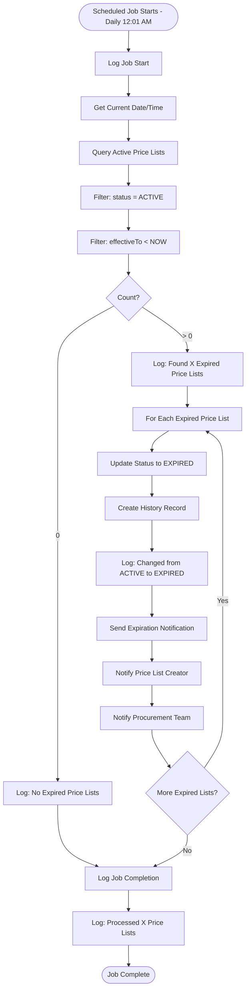

### 6.2 Expiration Warning Job

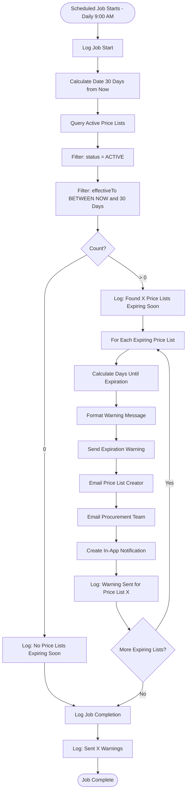

---

## Appendices

### A. Diagram Legend

#### Mermaid Flowchart Shapes

- **`([ ])`**: Start/End point
- **`[ ]`**: Process/Action step
- **`{ }`**: Decision point
- **`[( )]`**: Database operation
- **`[[ ]]`**: Subroutine/Sub-process
- **`>]`**: Asymmetric shape

#### Color Coding

- **Green**: Success path
- **Red**: Error path
- **Yellow**: Warning/Caution
- **Blue**: Information/Data flow

### B. Common Patterns

1. **Validation Pattern**: Input → Validate → Error or Success
2. **CRUD Pattern**: Load → Display → Edit → Validate → Save
3. **Approval Pattern**: Submit → Route → Review → Decide → Notify
4. **Wizard Pattern**: Step 1 → ... → Step N → Review → Submit
5. **Search Pattern**: Input → Query → Filter → Display → Select

### C. Integration Points

- **Pricelist Templates**: Auto-create price lists from template submissions
- **RFQ Module**: Auto-create contract pricing from RFQ awards
- **Procurement**: PRs and POs query price lists for pricing
- **Product Catalog**: Products referenced in price list items
- **Vendor Directory**: Vendor information linked to price lists

---

## Document Revision History

| Version | Date | Author | Changes |
|---------|------|--------|---------|
| 1.0 | 2024-01-15 | System | Initial flow diagrams document |

---

*End of Flow Diagrams Document*
