# Pricelist Templates - Flow Diagrams (FD)

## Document Information
- **Document Type**: Flow Diagrams Document
- **Module**: Vendor Management > Pricelist Templates
- **Version**: 1.0
- **Last Updated**: 2024-01-15
- **Document Status**: Draft

---

## 1. Introduction

This document provides visual representations of all workflows and processes in the Pricelist Templates module using Mermaid diagrams. These diagrams complement the use cases and technical specifications by illustrating the flow of operations, decision points, and system interactions.

The Pricelist Templates module enables organizations to create standardized pricing request templates, distribute them to vendors, track submissions, and manage template versioning efficiently.

---

## 2. System Architecture Diagram

### 2.1 High-Level Architecture

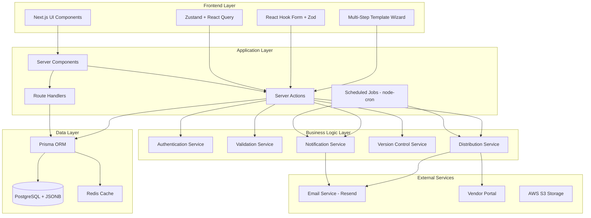

---

## 3. Data Flow Diagrams

### 3.1 Template Creation Data Flow

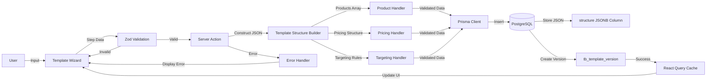

### 3.2 Template Distribution Data Flow

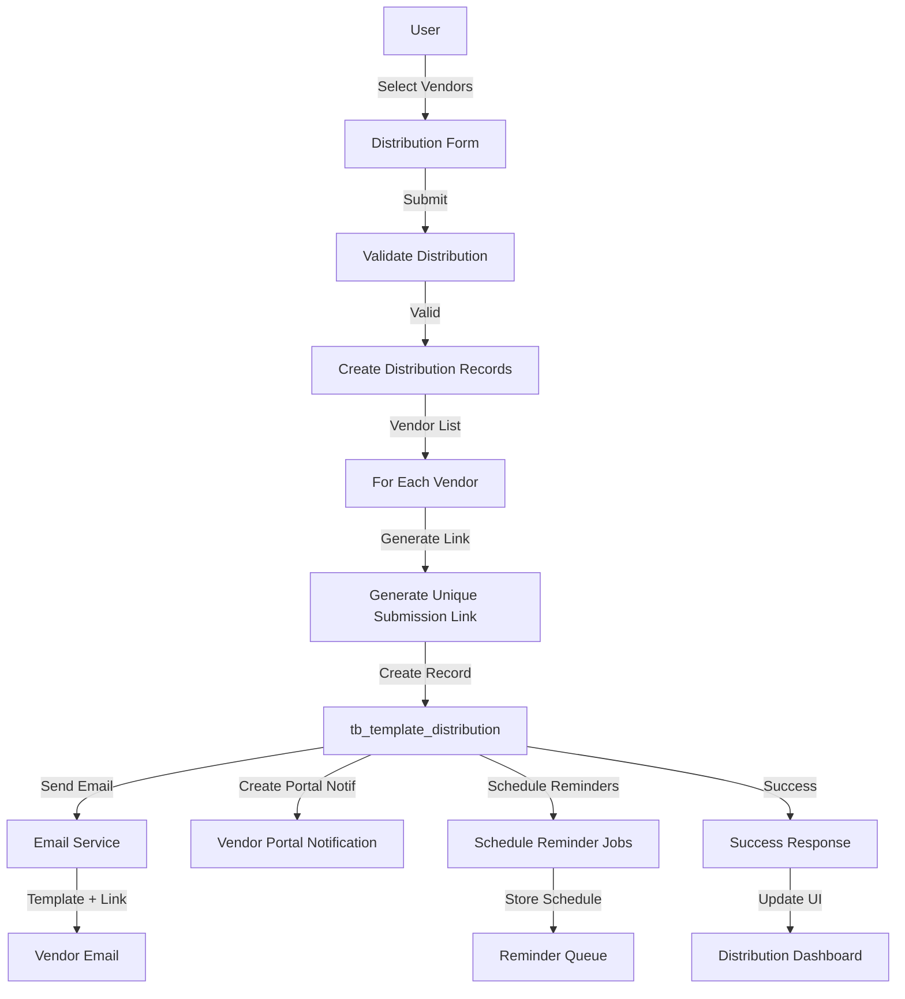

### 3.3 Vendor Submission Data Flow

```mermaid
graph LR
    Vendor[Vendor] -->|Click Link| Portal[Vendor Portal]
    Portal -->|Verify Token| Auth[Authentication]
    Auth -->|Valid| LoadTemplate[Load Template]
    Auth -->|Invalid| Error[Show Error]

    LoadTemplate -->|Fetch| DB[(Database)]
    DB -->|Return Template| ParseJSON[Parse Structure JSON]
    ParseJSON -->|Display| Form[Submission Form]

    Form -->|Enter Prices| VendorInput[Vendor Input]
    VendorInput -->|Auto-save| DraftSave[Save Draft]
    DraftSave -->|Update| DistRecord[Update Distribution Record]

    VendorInput -->|Submit| ValidateSub[Validate Submission]
    ValidateSub -->|Valid| SaveSubmission[Save Submission Data]
    SaveSubmission -->|Update JSON| DistRecord
    DistRecord -->|Set Status| Submitted[Status: SUBMITTED]

    Submitted -->|Notify| Email[Email Procurement]
    Email -->|Success| Confirmation[Show Confirmation]

    ValidateSub -->|Invalid| ShowErrors[Show Errors]
    ShowErrors --> Form
```

---

## 4. Core Workflows

### 4.1 Template Creation Workflow (UC-PT-001)

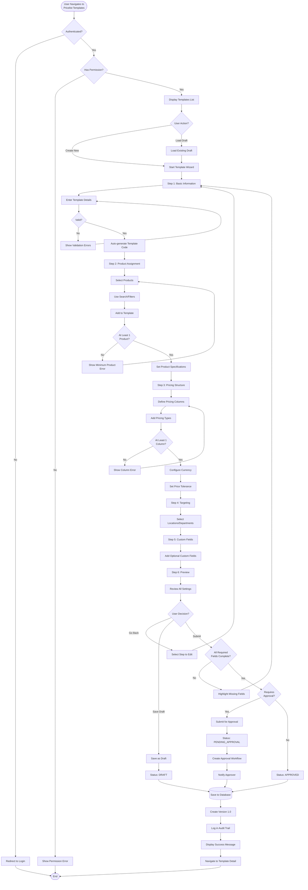

### 4.2 Product Assignment Workflow (UC-PT-002)

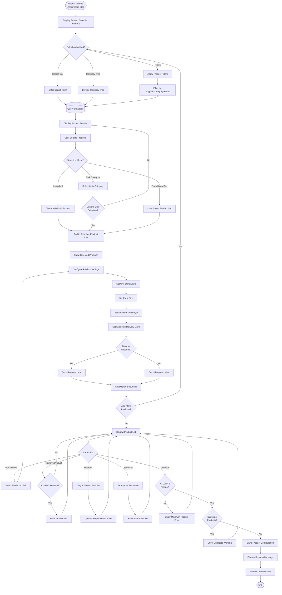

### 4.3 Pricing Structure Configuration Workflow (UC-PT-003)

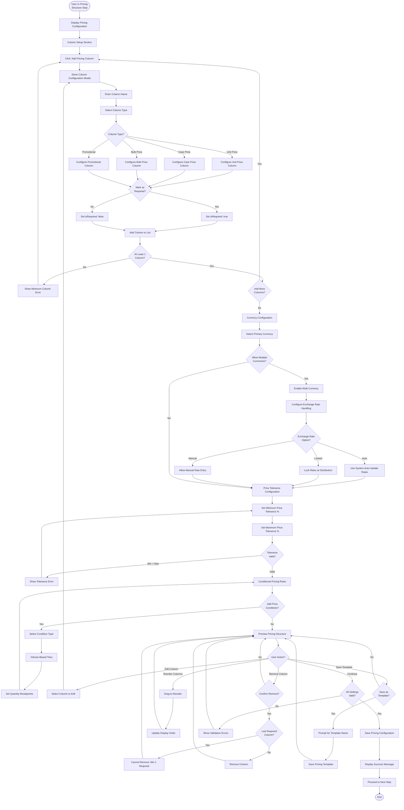

### 4.4 Template Distribution Workflow (UC-PT-004)

```mermaid
flowchart TD
    Start([User Opens<br/>Template]) --> CheckStatus{Template<br/>Status?}
    CheckStatus -->|Draft| NotApproved[Show Error: Not Approved]
    NotApproved --> End([End])

    CheckStatus -->|Pending| NotApproved
    CheckStatus -->|Approved| ClickDistribute[Click 'Distribute Template']

    ClickDistribute --> ShowWizard[Show Distribution Wizard]
    ShowWizard --> Step1Vendor[Step 1: Vendor Selection]

    Step1Vendor --> SelectionMethod{Selection Method?}

    SelectionMethod -->|Individual| ShowVendorList[Show Vendor List]
    ShowVendorList --> FilterVendors[Apply Filters]
    FilterVendors --> FilterOptions{Filter By?}

    FilterOptions -->|Status| StatusFilter[Filter by Approved/Preferred]
    FilterOptions -->|Location| LocationFilter[Filter by Location]
    FilterOptions -->|Category| CategoryFilter[Filter by Category]
    FilterOptions -->|Rating| RatingFilter[Filter by Performance Rating]

    StatusFilter --> DisplayFiltered
    LocationFilter --> DisplayFiltered
    CategoryFilter --> DisplayFiltered
    RatingFilter --> DisplayFiltered[Display Filtered Vendors]

    DisplayFiltered --> SelectVendors[User Selects Vendors]

    SelectionMethod -->|Category| SelectCategory[Select All in Category]
    SelectCategory --> ConfirmCategory{Confirm<br/>Selection?}
    ConfirmCategory -->|Yes| AddVendors
    ConfirmCategory -->|No| Step1Vendor

    SelectionMethod -->|Saved Group| LoadGroup[Load Saved Vendor Group]
    LoadGroup --> AddVendors[Add to Distribution List]

    SelectVendors --> AddVendors

    AddVendors --> CheckDuplicates{Duplicate<br/>Vendors?}
    CheckDuplicates -->|Yes| RemoveDuplicates[Remove Duplicates]
    RemoveDuplicates --> VendorList
    CheckDuplicates -->|No| VendorList[Show Selected Vendor List]

    VendorList --> CheckMinVendors{At Least 1<br/>Vendor?}
    CheckMinVendors -->|No| MinVendorError[Show Minimum Vendor Error]
    MinVendorError --> SelectionMethod

    CheckMinVendors -->|Yes| MoreVendors{Add/Remove<br/>Vendors?}
    MoreVendors -->|Add| SelectionMethod
    MoreVendors -->|Remove| RemoveVendor[Remove from List]
    RemoveVendor --> VendorList
    MoreVendors -->|Save Group| SaveGroupPrompt[Prompt for Group Name]
    SaveGroupPrompt --> SaveVendorGroup[Save Vendor Group]
    SaveVendorGroup --> VendorList
    MoreVendors -->|Continue| Step2Deadline[Step 2: Submission Deadline]

    Step2Deadline --> CalculateMin[Calculate Minimum Deadline]
    CalculateMin --> ShowMinDate[Show: Today + 5 Business Days]
    ShowMinDate --> SelectDeadline[User Selects Deadline Date]

    SelectDeadline --> ValidateDeadline{Deadline ≥<br/>Minimum?}
    ValidateDeadline -->|No| DeadlineError[Show Deadline Error]
    DeadlineError --> SelectDeadline

    ValidateDeadline -->|Yes| SetTime[Set Submission Time]
    SetTime --> Step3Notification[Step 3: Notification Settings]

    Step3Notification --> EmailNotif[Email Notification]
    EmailNotif --> EmailEnabled{Enable Email?}
    EmailEnabled -->|Yes| CustomizeEmail[Customize Email Template]
    EmailEnabled -->|No| PortalNotif

    CustomizeEmail --> PreviewEmail[Preview Email]
    PreviewEmail --> PortalNotif[Portal Notification]

    PortalNotif --> PortalEnabled{Enable Portal<br/>Notification?}
    PortalEnabled -->|Yes| PortalSettings[Configure Portal Settings]
    PortalEnabled -->|No| ReminderSettings

    PortalSettings --> ReminderSettings[Reminder Settings]
    ReminderSettings --> ConfigureReminders[Configure Automatic Reminders]

    ConfigureReminders --> Reminder1[First Reminder: 7 days before]
    Reminder1 --> Reminder2[Second Reminder: 3 days before]
    Reminder2 --> Reminder3[Final Reminder: 1 day before]
    Reminder3 --> OverdueReminder[Overdue Reminder: Daily after deadline]

    OverdueReminder --> Step4Review[Step 4: Review & Distribute]

    Step4Review --> ReviewSummary[Display Distribution Summary]
    ReviewSummary --> ShowDetails[Show: Vendor Count, Deadline, Notifications]
    ShowDetails --> UserDecision{User Decision?}

    UserDecision -->|Edit| SelectEditStep[Select Step to Edit]
    SelectEditStep --> Step1Vendor

    UserDecision -->|Cancel| CancelConfirm{Confirm Cancel?}
    CancelConfirm -->|Yes| End
    CancelConfirm -->|No| ReviewSummary

    UserDecision -->|Distribute| FinalConfirm{Confirm<br/>Distribution?}
    FinalConfirm -->|No| ReviewSummary

    FinalConfirm -->|Yes| StartDistribution[Start Distribution Process]
    StartDistribution --> ForEachVendor[For Each Vendor]

    ForEachVendor --> GenerateLink[Generate Unique Submission Link]
    GenerateLink --> CreateRecord[Create Distribution Record]
    CreateRecord --> RecordDetails[Set Status: SENT<br/>Set Deadline<br/>Set Viewed: null]

    RecordDetails --> SendEmail{Email<br/>Enabled?}
    SendEmail -->|Yes| ComposeEmail[Compose Email with Link]
    ComposeEmail --> SendEmailAPI[Send via Email Service]
    SendEmailAPI --> EmailSuccess{Email Sent?}
    EmailSuccess -->|No| LogEmailError[Log Email Error]
    LogEmailError --> TryPortal
    EmailSuccess -->|Yes| TryPortal{Portal Enabled?}

    SendEmail -->|No| TryPortal

    TryPortal -->|Yes| CreatePortalNotif[Create Portal Notification]
    CreatePortalNotif --> ScheduleReminders
    TryPortal -->|No| ScheduleReminders[Schedule Reminder Jobs]

    ScheduleReminders --> NextVendor{More Vendors?}
    NextVendor -->|Yes| ForEachVendor
    NextVendor -->|No| UpdateTemplateStatus[Update Template Status]

    UpdateTemplateStatus --> SetDistributed[Status: DISTRIBUTED]
    SetDistributed --> LogAudit[Log in Audit Trail]
    LogAudit --> SendManagerNotif[Notify Distribution Manager]
    SendManagerNotif --> Success[Display Success Message]
    Success --> NavigateDashboard[Navigate to Tracking Dashboard]
    NavigateDashboard --> End
```

### 4.5 Submission Tracking Workflow (UC-PT-005)

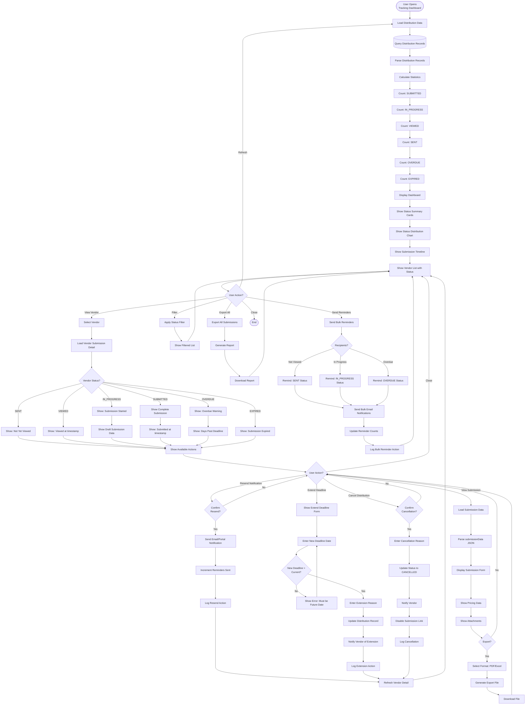

### 4.6 Template Cloning Workflow (UC-PT-006)

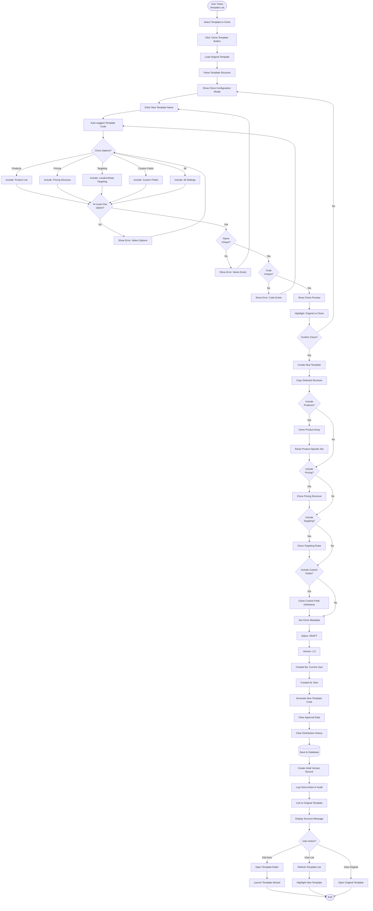

### 4.7 Template Versioning Workflow (UC-PT-007)

```mermaid
flowchart TD
    Start([User Opens<br/>Template]) --> CheckStatus{Template<br/>Status?}
    CheckStatus -->|Draft| CanEdit[Allow Direct Edit]
    CanEdit --> End([End])

    CheckStatus -->|Approved/Distributed| ClickVersion[Click 'Create New Version']

    ClickVersion --> CheckActive{Active<br/>Distributions?}
    CheckActive -->|Yes| ShowWarning[Show Warning: Active Distributions]
    ShowWarning --> WarningOptions{User Choice?}
    WarningOptions -->|Cancel| End
    WarningOptions -->|Continue| LoadCurrent

    CheckActive -->|No| LoadCurrent[Load Current Template]

    LoadCurrent --> DuplicateData[Duplicate Template Data]
    DuplicateData --> ShowVersionModal[Show Version Configuration Modal]

    ShowVersionModal --> AnalyzeChanges[Analyze Pending Changes]
    AnalyzeChanges --> CompareStructure[Compare Current vs Last Version]
    CompareStructure --> DetectChanges{Changes Detected?}

    DetectChanges -->|Product Changes| FlagProductChange[Flag: Product Modifications]
    DetectChanges -->|Pricing Changes| FlagPricingChange[Flag: Pricing Modifications]
    DetectChanges -->|Targeting Changes| FlagTargetingChange[Flag: Targeting Modifications]
    DetectChanges -->|Field Changes| FlagFieldChange[Flag: Field Modifications]

    FlagProductChange --> SuggestVersionType
    FlagPricingChange --> SuggestVersionType
    FlagTargetingChange --> SuggestVersionType
    FlagFieldChange --> SuggestVersionType[Suggest Version Type]

    SuggestVersionType --> VersionLogic{Change<br/>Severity?}

    VersionLogic -->|Major Changes| SuggestMajor[Suggest: Major Version]
    VersionLogic -->|Minor Changes| SuggestMinor[Suggest: Minor Version]

    SuggestMajor --> MajorCriteria["Major Changes:<br/>• Products added/removed<br/>• Pricing structure changed<br/>• Vendor targeting changed"]
    MajorCriteria --> CalculateMajor[Calculate: Next Major Version]
    CalculateMajor --> ShowMajorVersion["Example: 2.0 → 3.0"]

    SuggestMinor --> MinorCriteria["Minor Changes:<br/>• Product details updated<br/>• Description changes<br/>• Minor pricing adjustments"]
    MinorCriteria --> CalculateMinor[Calculate: Next Minor Version]
    CalculateMinor --> ShowMinorVersion["Example: 2.3 → 2.4"]

    ShowMajorVersion --> DisplaySuggestion
    ShowMinorVersion --> DisplaySuggestion[Display Suggested Version]

    DisplaySuggestion --> UserConfirm{Accept<br/>Suggestion?}
    UserConfirm -->|No| ManualVersion[Manually Select Version Type]
    ManualVersion --> ManualInput[Enter Version Number]
    ManualInput --> ValidateManual{Valid Format?}
    ValidateManual -->|No| VersionFormatError[Show Error: Invalid Format]
    VersionFormatError --> ManualInput
    ValidateManual -->|Yes| EnterChangeSummary

    UserConfirm -->|Yes| EnterChangeSummary[Enter Change Summary]

    EnterChangeSummary --> ShowChangesList[Show Detected Changes List]
    ShowChangesList --> EditSummary[Edit/Add Change Notes]
    EditSummary --> ValidateSummary{Summary<br/>Complete?}

    ValidateSummary -->|No| SummaryError[Show Error: Summary Required]
    SummaryError --> EditSummary

    ValidateSummary -->|Yes| PreviewVersion[Preview Version Changes]
    PreviewVersion --> ShowDiff[Show Side-by-Side Comparison]
    ShowDiff --> HighlightChanges[Highlight: Added/Modified/Removed]

    HighlightChanges --> FinalConfirm{Confirm Create<br/>Version?}
    FinalConfirm -->|No| EditSummary

    FinalConfirm -->|Yes| CreateVersion[Create New Version]

    CreateVersion --> IncrementVersion[Increment Version Number]
    IncrementVersion --> SnapshotStructure[Snapshot: Current Structure]
    SnapshotStructure --> SaveVersion[(Save to tb_template_version)]

    SaveVersion --> VersionData["Save:<br/>• Version Number<br/>• Version Type<br/>• Snapshot JSON<br/>• Change Summary<br/>• Changed By<br/>• Changed At"]

    VersionData --> UpdateTemplate[Update Template Record]
    UpdateTemplate --> UpdateVersionField[Update: version field]
    UpdateVersionField --> UpdateModifiedFields[Update: updatedBy, updatedAt]
    UpdateModifiedFields --> CheckApprovalRequired{Requires<br/>Approval?}

    CheckApprovalRequired -->|Yes| SetPendingStatus[Status: PENDING_APPROVAL]
    SetPendingStatus --> CreateApprovalWorkflow[Create Approval Workflow]
    CreateApprovalWorkflow --> NotifyApprovers[Notify Approvers]
    NotifyApprovers --> LogVersionAction

    CheckApprovalRequired -->|No| MaintainStatus[Maintain Current Status]
    MaintainStatus --> LogVersionAction[Log Version Creation]

    LogVersionAction --> CreateAuditEntry[Create Audit Trail Entry]
    CreateAuditEntry --> NotifyStakeholders[Notify Stakeholders]
    NotifyStakeholders --> CheckActiveDistributions{Active<br/>Distributions?}

    CheckActiveDistributions -->|Yes| NotifyVendors[Notify Affected Vendors]
    NotifyVendors --> UpdateDistributions[Update Distribution Records]
    UpdateDistributions --> LinkNewVersion[Link to New Version]
    LinkNewVersion --> Success

    CheckActiveDistributions -->|No| Success[Display Success Message]

    Success --> ShowVersionHistory[Show Version History]
    ShowVersionHistory --> VersionList[Display All Versions]
    VersionList --> HighlightLatest[Highlight: Latest Version]
    HighlightLatest --> End
```

### 4.8 Template Approval Workflow (UC-PT-008)

```mermaid
flowchart TD
    Start([Template Submitted<br/>for Approval]) --> CreateWorkflow[Create Approval Workflow]
    CreateWorkflow --> LoadTemplate[Load Template Data]
    LoadTemplate --> DetermineApprovers[Determine Approval Chain]

    DetermineApprovers --> CheckValue{Template<br/>Value?}
    CheckValue -->|Standard| SingleApprover[Require: 1 Approver]
    CheckValue -->|High Value| MultiApprover[Require: 2 Approvers]
    CheckValue -->|Strategic| ExecutiveApprover[Require: 3 Approvers]

    SingleApprover --> Stage1
    MultiApprover --> Stage1
    ExecutiveApprover --> Stage1[Stage 1: Department Manager]

    Stage1 --> SetPendingStatus[Status: PENDING_APPROVAL]
    SetPendingStatus --> NotifyManager[Notify Department Manager]
    NotifyManager --> SendManagerEmail[Send Email Notification]
    SendManagerEmail --> CreatePortalTask[Create Portal Task]
    CreatePortalTask --> StartSLA[Start SLA Timer: 48 hours]

    StartSLA --> WaitManager[Wait for Manager Review]
    WaitManager --> CheckSLA1{SLA<br/>Exceeded?}

    CheckSLA1 -->|Yes| SendReminder1[Send Reminder Email]
    SendReminder1 --> ReminderCount1{Reminder<br/>Count?}
    ReminderCount1 -->|< 2| WaitManager
    ReminderCount1 -->|≥ 2| EscalateManager[Escalate to Senior Manager]
    EscalateManager --> WaitManager

    CheckSLA1 -->|No| ManagerAction{Manager<br/>Action?}

    ManagerAction -->|Approve| CheckStageCount{Multi-Stage<br/>Approval?}

    CheckStageCount -->|Yes - High Value| Stage2[Stage 2: Finance Manager]
    CheckStageCount -->|Yes - Strategic| Stage2
    CheckStageCount -->|No| FinalApproval

    Stage2 --> UpdateStageStatus[Update: Stage 1 Complete]
    UpdateStageStatus --> NotifyFinance[Notify Finance Manager]
    NotifyFinance --> SendFinanceEmail[Send Email Notification]
    SendFinanceEmail --> CreateFinanceTask[Create Portal Task]
    CreateFinanceTask --> StartSLA2[Start SLA Timer: 48 hours]

    StartSLA2 --> WaitFinance[Wait for Finance Review]
    WaitFinance --> CheckSLA2{SLA<br/>Exceeded?}

    CheckSLA2 -->|Yes| SendReminder2[Send Reminder Email]
    SendReminder2 --> ReminderCount2{Reminder<br/>Count?}
    ReminderCount2 -->|< 2| WaitFinance
    ReminderCount2 -->|≥ 2| EscalateFinance[Escalate to CFO]
    EscalateFinance --> WaitFinance

    CheckSLA2 -->|No| FinanceAction{Finance<br/>Action?}

    FinanceAction -->|Approve| CheckExecutive{Executive<br/>Approval Required?}

    CheckExecutive -->|Yes| Stage3[Stage 3: Executive Approval]
    CheckExecutive -->|No| FinalApproval[Final Approval]

    Stage3 --> UpdateStageStatus2[Update: Stage 2 Complete]
    UpdateStageStatus2 --> NotifyExecutive[Notify Executive]
    NotifyExecutive --> SendExecEmail[Send Email Notification]
    SendExecEmail --> CreateExecTask[Create Portal Task]
    CreateExecTask --> StartSLA3[Start SLA Timer: 72 hours]

    StartSLA3 --> WaitExecutive[Wait for Executive Review]
    WaitExecutive --> CheckSLA3{SLA<br/>Exceeded?}

    CheckSLA3 -->|Yes| SendReminder3[Send Reminder Email]
    SendReminder3 --> ReminderCount3{Reminder<br/>Count?}
    ReminderCount3 -->|< 2| WaitExecutive
    ReminderCount3 -->|≥ 2| EscalateCEO[Escalate to CEO]
    EscalateCEO --> WaitExecutive

    CheckSLA3 -->|No| ExecutiveAction{Executive<br/>Action?}

    ExecutiveAction -->|Approve| FinalApproval

    FinalApproval --> UpdateTemplateStatus[Status: APPROVED]
    UpdateTemplateStatus --> SetApprovedBy[Set: approvedBy, approvedAt]
    SetApprovedBy --> IncrementVersion[Increment Template Version]
    IncrementVersion --> CreateVersionRecord[Create Version Record]
    CreateVersionRecord --> CompleteWorkflow[Mark Workflow Complete]

    CompleteWorkflow --> NotifySubmitter[Notify Original Submitter]
    NotifySubmitter --> NotifyStakeholders[Notify All Stakeholders]
    NotifyStakeholders --> LogApproval[Log Approval in Audit]
    LogApproval --> EnableDistribution[Enable Distribution Actions]
    EnableDistribution --> SuccessApproved[Display: Approved Successfully]
    SuccessApproved --> End([End])

    ManagerAction -->|Reject| EnterRejectReason1
    FinanceAction -->|Reject| EnterRejectReason1
    ExecutiveAction -->|Reject| EnterRejectReason1[Enter Rejection Reason]

    EnterRejectReason1 --> ValidateReason{Reason<br/>Provided?}
    ValidateReason -->|No| ReasonError[Show Error: Reason Required]
    ReasonError --> EnterRejectReason1

    ValidateReason -->|Yes| RejectTemplate[Reject Template]
    RejectTemplate --> UpdateStatusRejected[Status: REJECTED]
    UpdateStatusRejected --> SaveRejectionData["Save:<br/>• Rejection Reason<br/>• Rejected By<br/>• Rejected At<br/>• Rejection Stage"]

    SaveRejectionData --> NotifySubmitterReject[Notify Submitter]
    NotifySubmitterReject --> SendRejectEmail[Send Rejection Email]
    SendRejectEmail --> IncludeReason[Include Rejection Reason]
    IncludeReason --> IncludeNextSteps[Include Next Steps]
    IncludeNextSteps --> LogRejection[Log Rejection in Audit]
    LogRejection --> AllowRevision{Allow<br/>Revision?}

    AllowRevision -->|Yes| EnableEdit[Enable Template Edit]
    EnableEdit --> ResetStatus[Status: DRAFT]
    ResetStatus --> SuccessRejected[Display: Rejection Recorded]
    SuccessRejected --> End

    AllowRevision -->|No| ArchiveTemplate[Archive Template]
    ArchiveTemplate --> SuccessRejected

    ManagerAction -->|Request Info| RequestInfo1
    FinanceAction -->|Request Info| RequestInfo1
    ExecutiveAction -->|Request Info| RequestInfo1[Request Additional Information]

    RequestInfo1 --> EnterInfoRequest[Enter Information Request]
    EnterInfoRequest --> SpecifyRequired[Specify Required Information]
    SpecifyRequired --> SetInfoDeadline[Set Response Deadline]
    SetInfoDeadline --> UpdateStatusInfo[Status: INFO_REQUESTED]
    UpdateStatusInfo --> PauseWorkflow[Pause Approval Workflow]

    PauseWorkflow --> NotifySubmitterInfo[Notify Submitter]
    NotifySubmitterInfo --> SendInfoEmail[Send Information Request Email]
    SendInfoEmail --> WaitInfo[Wait for Information]

    WaitInfo --> InfoProvided{Information<br/>Provided?}
    InfoProvided -->|Yes| UpdateTemplate[Update Template with Info]
    UpdateTemplate --> ResumeWorkflow[Resume Workflow at Same Stage]
    ResumeWorkflow --> Stage1

    InfoProvided -->|No| InfoDeadline{Deadline<br/>Exceeded?}
    InfoDeadline -->|Yes| AutoReject[Auto-Reject Template]
    AutoReject --> UpdateStatusRejected
    InfoDeadline -->|No| WaitInfo
```

---

## 5. Search and Filter Workflows

### 5.1 Template Search Workflow

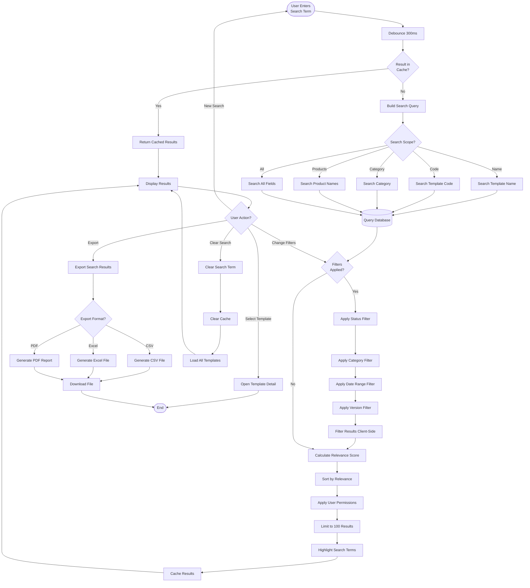

### 5.2 Advanced Template Filter Workflow

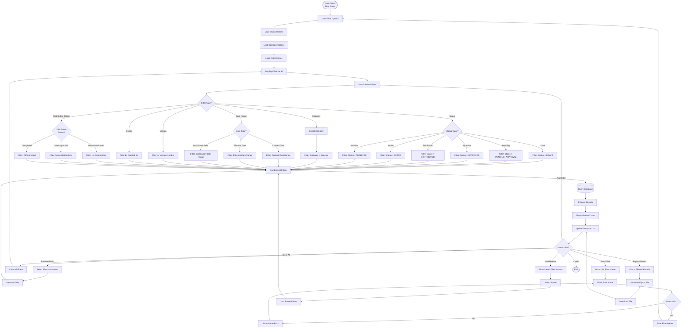

---

## 6. Status Change Workflows

### 6.1 Archive Template Workflow

```mermaid
flowchart TD
    Start([User Selects<br/>Template]) --> ClickArchive[Click 'Archive Template']
    ClickArchive --> CheckAuth{Has Permission?}

    CheckAuth -->|No| PermError[Show Permission Error]
    PermError --> End([End])

    CheckAuth -->|Yes| CheckStatus{Current Status?}
    CheckStatus -->|Already Archived| AlreadyArchived[Show: Already Archived]
    AlreadyArchived --> End

    CheckStatus -->|Active| CheckDistributions[Check Active Distributions]

    CheckDistributions --> CountActive[Count Active Distributions]
    CountActive --> CheckCount{Active Count<br/>> 0?}

    CheckCount -->|Yes| ShowWarning[Show Warning: Active Distributions]
    ShowWarning --> DisplayList[Display Active Distribution List]
    DisplayList --> WarningOptions{User Choice?}

    WarningOptions -->|Cancel| End
    WarningOptions -->|Force Archive| ForceConfirm{Confirm Force<br/>Archive?}
    ForceConfirm -->|No| End
    ForceConfirm -->|Yes| EnterReason

    CheckCount -->|No| EnterReason[Enter Archive Reason]

    EnterReason --> ReasonOptions{Reason Type?}
    ReasonOptions -->|Obsolete| ObsoleteReason[Template Obsolete]
    ReasonOptions -->|Replaced| ReplacedReason[Replaced by New Template]
    ReasonOptions -->|Expired| ExpiredReason[Effective Period Expired]
    ReasonOptions -->|Other| OtherReason[Other Reason]

    ObsoleteReason --> SelectReplacement
    ReplacedReason --> SelectReplacement{Link Replacement<br/>Template?}
    ExpiredReason --> AddNotes
    OtherReason --> AddNotes[Add Additional Notes]

    SelectReplacement -->|Yes| ChooseTemplate[Select Replacement Template]
    ChooseTemplate --> LinkTemplate[Link New Template]
    LinkTemplate --> AddNotes
    SelectReplacement -->|No| AddNotes

    AddNotes --> PreviewArchive[Preview Archive Action]
    PreviewArchive --> ShowImpact[Show Impact Summary]
    ShowImpact --> ImpactDetails["Display:<br/>• Active Distributions<br/>• Submitted Responses<br/>• Version History<br/>• Linked Documents"]

    ImpactDetails --> FinalConfirm{Confirm<br/>Archive?}
    FinalConfirm -->|No| End

    FinalConfirm -->|Yes| UpdateStatus[Status: ARCHIVED]
    UpdateStatus --> SetArchiveDate[Set: archivedAt = Now]
    SetArchiveDate --> SetArchiveBy[Set: archivedBy = Current User]
    SetArchiveBy --> SaveArchiveReason[Save Archive Reason]
    SaveArchiveReason --> HandleDistributions{Active<br/>Distributions?}

    HandleDistributions -->|Yes| CancelDistributions[Cancel Active Distributions]
    CancelDistributions --> NotifyVendors[Notify Affected Vendors]
    NotifyVendors --> DisableLinks[Disable Submission Links]
    DisableLinks --> UpdateDB

    HandleDistributions -->|No| UpdateDB[(Update Database)]

    UpdateDB --> LogArchive[Log Archive Action]
    LogArchive --> CreateAuditEntry[Create Audit Trail Entry]
    CreateAuditEntry --> NotifyStakeholders[Notify Stakeholders]
    NotifyStakeholders --> UpdateCache[Clear from Active Cache]
    UpdateCache --> Success[Display Success Message]

    Success --> ViewOptions{User Action?}
    ViewOptions -->|View Archived List| ShowArchived[Show Archived Templates]
    ViewOptions -->|Back to List| RefreshList[Refresh Template List]

    ShowArchived --> End
    RefreshList --> End
```

### 6.2 Restore Archived Template Workflow

```mermaid
flowchart TD
    Start([User Views<br/>Archived Templates]) --> SelectTemplate[Select Archived Template]
    SelectTemplate --> ClickRestore[Click 'Restore Template']

    ClickRestore --> CheckAuth{Has Permission?}
    CheckAuth -->|No| PermError[Show Permission Error]
    PermError --> End([End])

    CheckAuth -->|Yes| LoadTemplate[Load Template Data]
    LoadTemplate --> ParseStructure[Parse Template Structure]
    ParseStructure --> ValidateProducts{Products Still<br/>Valid?}

    ValidateProducts -->|No| ShowProductWarnings[Show: Invalid/Obsolete Products]
    ShowProductWarnings --> ProductOptions{User Choice?}
    ProductOptions -->|Update Products| UpdateProducts[Update Product List]
    UpdateProducts --> ValidatePricing
    ProductOptions -->|Keep As-Is| ValidatePricing
    ProductOptions -->|Cancel| End

    ValidateProducts -->|Yes| ValidatePricing{Pricing Structure<br/>Valid?}

    ValidatePricing -->|No| ShowPricingWarnings[Show: Pricing Structure Issues]
    ShowPricingWarnings --> PricingOptions{User Choice?}
    PricingOptions -->|Update Pricing| UpdatePricing[Update Pricing Structure]
    UpdatePricing --> ValidateTargeting
    PricingOptions -->|Keep As-Is| ValidateTargeting
    PricingOptions -->|Cancel| End

    ValidatePricing -->|Yes| ValidateTargeting{Locations/Depts<br/>Valid?}

    ValidateTargeting -->|No| ShowTargetingWarnings[Show: Invalid Locations/Departments]
    ShowTargetingWarnings --> TargetingOptions{User Choice?}
    TargetingOptions -->|Update Targeting| UpdateTargeting[Update Targeting Rules]
    UpdateTargeting --> EnterRestoreReason
    TargetingOptions -->|Keep As-Is| EnterRestoreReason
    TargetingOptions -->|Cancel| End

    ValidateTargeting -->|Yes| EnterRestoreReason[Enter Restoration Reason]

    EnterRestoreReason --> ValidateReason{Reason<br/>Provided?}
    ValidateReason -->|No| ReasonError[Show Error: Reason Required]
    ReasonError --> EnterRestoreReason

    ValidateReason -->|Yes| SelectRestorationMode{Restoration Mode?}

    SelectRestorationMode -->|Restore as Draft| DraftMode[Restore with Status: DRAFT]
    SelectRestorationMode -->|Restore as Approved| ApprovalRequired{Requires<br/>Approval?}

    ApprovalRequired -->|Yes| ApprovalMode[Restore with Status: PENDING_APPROVAL]
    ApprovalRequired -->|No| ApprovedMode[Restore with Status: APPROVED]

    DraftMode --> UpdateMetadata
    ApprovalMode --> UpdateMetadata
    ApprovedMode --> UpdateMetadata[Update Template Metadata]

    UpdateMetadata --> ClearArchiveDate[Clear: archivedAt, archivedBy]
    ClearArchiveDate --> SetRestoredDate[Set: restoredAt = Now]
    SetRestoredDate --> SetRestoredBy[Set: restoredBy = Current User]
    SetRestoredBy --> IncrementVersion[Increment Version]
    IncrementVersion --> CreateVersionRecord[Create Version Record]

    CreateVersionRecord --> VersionData["Save Version:<br/>• Action: Restored<br/>• Previous Status: Archived<br/>• Restoration Reason<br/>• Structure Snapshot"]

    VersionData --> SaveTemplate[(Save to Database)]
    SaveTemplate --> LogRestoration[Log Restoration Action]
    LogRestoration --> CreateAuditEntry[Create Audit Trail Entry]
    CreateAuditEntry --> CheckApprovalMode{Status =<br/>PENDING_APPROVAL?}

    CheckApprovalMode -->|Yes| CreateWorkflow[Create Approval Workflow]
    CreateWorkflow --> NotifyApprovers[Notify Approvers]
    NotifyApprovers --> Success

    CheckApprovalMode -->|No| NotifyStakeholders[Notify Stakeholders]
    NotifyStakeholders --> Success[Display Success Message]

    Success --> ViewOptions{User Action?}
    ViewOptions -->|View Template| OpenTemplate[Open Restored Template]
    ViewOptions -->|Edit Template| OpenEditor[Open Template Editor]
    ViewOptions -->|Back to List| RefreshList[Refresh Template List]

    OpenTemplate --> End([End])
    OpenEditor --> End
    RefreshList --> End
```

---

## 7. Integration Workflows

### 7.1 Template Selection in Purchase Request

```mermaid
flowchart TD
    Start([User Creates<br/>Purchase Request]) --> PRType{PR Type?}
    PRType -->|Regular| StandardPR[Standard PR Flow]
    StandardPR --> End([End])

    PRType -->|RFQ| ClickUseTemplate[Click 'Use Pricelist Template']

    ClickUseTemplate --> ShowTemplates[Show Template Selection Modal]
    ShowTemplates --> FilterTemplates[Filter Available Templates]

    FilterTemplates --> StatusFilter[Filter: Status = APPROVED/ACTIVE]
    StatusFilter --> LocationFilter[Filter: Matches PR Location]
    LocationFilter --> CategoryFilter[Filter: Relevant Categories]
    CategoryFilter --> DateFilter[Filter: Within Effective Dates]

    DateFilter --> DisplayList[Display Filtered Templates]
    DisplayList --> SearchBar[Show Search Bar]
    SearchBar --> UserSearches{User Searches?}

    UserSearches -->|Yes| EnterSearchTerm[Enter Search Term]
    EnterSearchTerm --> SearchResults[Show Search Results]
    SearchResults --> UserSelects

    UserSearches -->|No| UserSelects[User Selects Template]

    UserSelects --> CheckStatus{Template Status<br/>Valid?}
    CheckStatus -->|Archived| ArchivedError[Show Error: Template Archived]
    ArchivedError --> DisplayList

    CheckStatus -->|Expired| ExpiredError[Show Error: Template Expired]
    ExpiredError --> DisplayList

    CheckStatus -->|Valid| LoadTemplate[Load Template Data]
    LoadTemplate --> ParseStructure[Parse Template Structure]
    ParseStructure --> ShowPreview[Show Template Preview]

    ShowPreview --> PreviewProducts[Display Product List]
    PreviewProducts --> PreviewPricing[Display Pricing Columns]
    PreviewPricing --> PreviewDetails[Display Template Details]

    PreviewDetails --> UserConfirms{Confirm<br/>Selection?}
    UserConfirms -->|No| DisplayList

    UserConfirms -->|Yes| AutoPopulatePR[Auto-populate PR Fields]

    AutoPopulatePR --> PopulateProducts[Populate Product List]
    PopulateProducts --> ForEachProduct[For Each Product]
    ForEachProduct --> AddProductLine[Add Product Line to PR]
    AddProductLine --> SetProductDetails["Set:<br/>• Product Code<br/>• Product Name<br/>• UOM<br/>• Pack Size<br/>• MOQ<br/>• Expected Delivery"]

    SetProductDetails --> MoreProducts{More Products?}
    MoreProducts -->|Yes| ForEachProduct
    MoreProducts -->|No| PopulatePricingColumns[Create Pricing Columns]

    PopulatePricingColumns --> ForEachColumn[For Each Pricing Column]
    ForEachColumn --> AddPricingColumn[Add Column to PR Form]
    AddPricingColumn --> MoreColumns{More Columns?}
    MoreColumns -->|Yes| ForEachColumn
    MoreColumns -->|No| SetPRMetadata[Set PR Metadata]

    SetPRMetadata --> LinkTemplate[Link Template ID to PR]
    LinkTemplate --> SetTemplateVersion[Store Template Version]
    SetTemplateVersion --> SetCurrency[Set Default Currency]
    SetCurrency --> SetTolerances[Set Price Tolerances]

    SetTolerances --> CloseModal[Close Template Modal]
    CloseModal --> UpdatePRForm[Update PR Form Display]
    UpdatePRForm --> EnableEdit[Enable Field Editing]
    EnableEdit --> ShowTemplateBadge[Show: Template Applied Badge]
    ShowTemplateBadge --> AllowModifications{Allow<br/>Modifications?}

    AllowModifications -->|Yes| EnableProductEdit[Enable Product Add/Remove]
    EnableProductEdit --> EnableColumnEdit[Enable Column Modification]
    EnableColumnEdit --> ShowWarning[Show: Template Modified Warning]
    ShowWarning --> SavePR

    AllowModifications -->|No| LockStructure[Lock Template Structure]
    LockStructure --> SavePR[Continue PR Creation Flow]

    SavePR --> TrackTemplateUsage[Track Template Usage]
    TrackTemplateUsage --> IncrementUsageCount[Increment: templateUsageCount]
    IncrementUsageCount --> LogTemplateUsage[Log Template Usage in Audit]
    LogTemplateUsage --> End
```

### 7.2 Vendor Submission to RFQ Integration

```mermaid
flowchart TD
    Start([Vendor Submits<br/>Pricing via Template]) --> ReceiveSubmission[Receive Submission Data]
    ReceiveSubmission --> ParseJSON[Parse submissionData JSON]
    ParseJSON --> ValidateSubmission[Validate Submission]

    ValidateSubmission --> CheckRequired{All Required<br/>Fields?}
    CheckRequired -->|No| ValidationError[Return Validation Error]
    ValidationError --> End([End])

    CheckRequired -->|Yes| ExtractProducts[Extract Product Pricing]
    ExtractProducts --> CheckRFQs{Linked RFQs<br/>Exist?}

    CheckRFQs -->|No| StoreStandalone[Store as Standalone Submission]
    StoreStandalone --> UpdateDistribution[Update Distribution Status]
    UpdateDistribution --> End

    CheckRFQs -->|Yes| LoadRFQs[Load Related RFQs]
    LoadRFQs --> ForEachRFQ[For Each RFQ]

    ForEachRFQ --> CheckRFQStatus{RFQ Status?}
    CheckRFQStatus -->|Closed| SkipRFQ[Skip RFQ]
    SkipRFQ --> NextRFQ

    CheckRFQStatus -->|Open| MatchProducts[Match Products to RFQ Lines]

    MatchProducts --> ForEachProduct[For Each Product]
    ForEachProduct --> FindRFQLine[Find Matching RFQ Line]
    FindRFQLine --> LineFound{RFQ Line<br/>Found?}

    LineFound -->|No| SkipProduct[Skip Product]
    SkipProduct --> NextProduct

    LineFound -->|Yes| CreateQuoteLine[Create Quote Line]

    CreateQuoteLine --> ExtractPricing[Extract Pricing Data]
    ExtractPricing --> ForEachPriceColumn[For Each Pricing Column]
    ForEachPriceColumn --> ExtractValue[Extract Price Value]
    ExtractValue --> ValidatePrice{Price Within<br/>Tolerance?}

    ValidatePrice -->|No| FlagPriceWarning[Flag Price Warning]
    FlagPriceWarning --> SavePrice
    ValidatePrice -->|Yes| SavePrice[Save Price to Quote Line]

    SavePrice --> MorePriceColumns{More Price<br/>Columns?}
    MorePriceColumns -->|Yes| ForEachPriceColumn
    MorePriceColumns -->|No| SetLineDetails[Set Quote Line Details]

    SetLineDetails --> CopySpecifications["Copy:<br/>• UOM<br/>• Pack Size<br/>• Lead Time<br/>• MOQ"]

    CopySpecifications --> ExtractAttachments{Attachments<br/>Provided?}
    ExtractAttachments -->|Yes| LinkAttachments[Link Attachments to Quote Line]
    LinkAttachments --> ExtractNotes
    ExtractAttachments -->|No| ExtractNotes{Notes<br/>Provided?}

    ExtractNotes -->|Yes| CopyNotes[Copy Notes to Quote Line]
    CopyNotes --> SaveQuoteLine
    ExtractNotes -->|No| SaveQuoteLine[(Save Quote Line)]

    SaveQuoteLine --> NextProduct{More Products?}
    NextProduct -->|Yes| ForEachProduct
    NextProduct -->|No| CalculateQuoteTotal[Calculate Quote Total]

    CalculateQuoteTotal --> SetQuoteStatus[Set Quote Status]
    SetQuoteStatus --> StatusLogic{All Lines<br/>Complete?}
    StatusLogic -->|Yes| CompleteStatus[Status: COMPLETED]
    StatusLogic -->|No| PartialStatus[Status: PARTIAL]

    CompleteStatus --> LinkQuote
    PartialStatus --> LinkQuote[Link Quote to RFQ]

    LinkQuote --> LinkTemplate[Link Original Template]
    LinkTemplate --> LinkVendor[Link Vendor]
    LinkVendor --> LinkDistribution[Link Distribution Record]
    LinkDistribution --> SaveQuote[(Save Quote)]

    SaveQuote --> UpdateRFQStatus[Update RFQ Status]
    UpdateRFQStatus --> NotifyProcurement[Notify Procurement Team]
    NotifyProcurement --> SendEmail[Send Email Notification]
    SendEmail --> CreateTask[Create Review Task]
    CreateTask --> LogIntegration[Log Integration in Audit]

    LogIntegration --> NextRFQ{More RFQs?}
    NextRFQ -->|Yes| ForEachRFQ
    NextRFQ -->|No| UpdateDistributionFinal[Update Distribution Status]

    UpdateDistributionFinal --> SetSubmitted[Status: SUBMITTED]
    SetSubmitted --> RecordSubmissionTime[Set: submittedAt = Now]
    RecordSubmissionTime --> Success[Integration Complete]
    Success --> End
```

---

## 8. Notification Workflows

### 8.1 Distribution Reminder Workflow

```mermaid
flowchart TD
    Start([Daily Cron Job<br/>Triggers]) --> QueryDistributions[Query Active Distributions]
    QueryDistributions --> FilterActive[Filter: Status NOT IN<br/>SUBMITTED, CANCELLED, EXPIRED]

    FilterActive --> CalculateDeadline[Calculate Days Until Deadline]
    CalculateDeadline --> GroupByTiming[Group by Reminder Timing]

    GroupByTiming --> Check7Days{7 Days<br/>Before?}
    Check7Days -->|Yes| Create7DayReminder[Create 7-Day Reminders]
    Check7Days -->|No| Check3Days

    Create7DayReminder --> Add7DayBatch[Add to Reminder Batch]
    Add7DayBatch --> Check3Days{3 Days<br/>Before?}

    Check3Days -->|Yes| Create3DayReminder[Create 3-Day Reminders]
    Create3DayReminder --> Add3DayBatch[Add to Reminder Batch]
    Add3DayBatch --> Check1Day
    Check3Days -->|No| Check1Day{1 Day<br/>Before?}

    Check1Day -->|Yes| Create1DayReminder[Create 1-Day Reminders]
    Create1DayReminder --> Add1DayBatch[Add to Reminder Batch]
    Add1DayBatch --> CheckOverdue
    Check1Day -->|No| CheckOverdue{Overdue?}

    CheckOverdue -->|Yes| CreateOverdueReminder[Create Overdue Reminders]
    CreateOverdueReminder --> AddOverdueBatch[Add to Reminder Batch]
    AddOverdueBatch --> ProcessBatch
    CheckOverdue -->|No| ProcessBatch[Process Reminder Batch]

    ProcessBatch --> GroupByVendor[Group by Vendor]
    GroupByVendor --> ForEachVendor[For Each Vendor]

    ForEachVendor --> LoadVendorData[Load Vendor Contact Info]
    LoadVendorData --> LoadTemplate[Load Template Data]
    LoadTemplate --> LoadDistribution[Load Distribution Record]

    LoadDistribution --> CheckReminderCount{Reminders Sent<br/>Count?}
    CheckReminderCount -->|> 3| SkipVendor[Skip: Too Many Reminders]
    SkipVendor --> NextVendor

    CheckReminderCount -->|≤ 3| SelectTemplate{Reminder<br/>Type?}

    SelectTemplate -->|7 Days| Use7DayTemplate[Use 7-Day Template]
    SelectTemplate -->|3 Days| Use3DayTemplate[Use 3-Day Template]
    SelectTemplate -->|1 Day| Use1DayTemplate[Use 1-Day Template]
    SelectTemplate -->|Overdue| UseOverdueTemplate[Use Overdue Template]

    Use7DayTemplate --> ComposeEmail
    Use3DayTemplate --> ComposeEmail
    Use1DayTemplate --> ComposeEmail
    UseOverdueTemplate --> ComposeEmail[Compose Email]

    ComposeEmail --> PersonalizeEmail[Personalize Email Content]
    PersonalizeEmail --> IncludeDetails["Include:<br/>• Template Name<br/>• Deadline<br/>• Days Remaining<br/>• Submission Link<br/>• Contact Info"]

    IncludeDetails --> IncludeProgress{Submission<br/>Started?}
    IncludeProgress -->|Yes| IncludeProgressData[Include: Progress Status]
    IncludeProgressData --> FinalizeEmail
    IncludeProgress -->|No| FinalizeEmail[Finalize Email]

    FinalizeEmail --> SendEmail[Send Email via Service]
    SendEmail --> EmailResult{Email Sent?}

    EmailResult -->|Failed| LogEmailError[Log Email Error]
    LogEmailError --> TryPortal
    EmailResult -->|Success| TryPortal{Portal Enabled?}

    TryPortal -->|Yes| CreatePortalNotif[Create Portal Notification]
    CreatePortalNotif --> UpdateRecord
    TryPortal -->|No| UpdateRecord[Update Distribution Record]

    UpdateRecord --> IncrementCount[Increment: remindersSent]
    IncrementCount --> RecordTimestamp[Record: lastReminderAt]
    RecordTimestamp --> SaveRecord[(Save to Database)]

    SaveRecord --> LogReminder[Log Reminder in Audit]
    LogReminder --> NextVendor{More Vendors?}

    NextVendor -->|Yes| ForEachVendor
    NextVendor -->|No| GenerateSummary[Generate Daily Summary]

    GenerateSummary --> SummaryDetails["Summary:<br/>• Total Reminders Sent<br/>• 7-Day Reminders: X<br/>• 3-Day Reminders: Y<br/>• 1-Day Reminders: Z<br/>• Overdue Reminders: A<br/>• Failed Emails: B"]

    SummaryDetails --> NotifyManager[Send Summary to Manager]
    NotifyManager --> ManagerEmail[Send Manager Email]
    ManagerEmail --> LogSummary[Log Daily Summary]
    LogSummary --> End([End])
```

### 8.2 Submission Notification Workflow

```mermaid
flowchart TD
    Start([Vendor Submits<br/>Pricing]) --> ReceiveSubmission[Receive Submission Event]
    ReceiveSubmission --> ValidateSubmission[Validate Submission Data]
    ValidateSubmission --> UpdateStatus[Update Distribution Status]

    UpdateStatus --> SetSubmitted[Status: SUBMITTED]
    SetSubmitted --> RecordTime[Set: submittedAt = Now]
    RecordTime --> LoadData[Load Related Data]

    LoadData --> LoadTemplate[Load Template Data]
    LoadTemplate --> LoadVendor[Load Vendor Data]
    LoadVendor --> LoadDistribution[Load Distribution Record]
    LoadDistribution --> IdentifyRecipients[Identify Notification Recipients]

    IdentifyRecipients --> GetCreator[Get Template Creator]
    GetCreator --> GetProcurementTeam[Get Procurement Team]
    GetProcurementTeam --> GetDepartmentManager[Get Department Manager]
    GetDepartmentManager --> CheckRFQLink{Linked to<br/>RFQ?}

    CheckRFQLink -->|Yes| GetRFQOwner[Get RFQ Owner]
    GetRFQOwner --> GetApprovers[Get Approvers]
    GetApprovers --> ComposeNotifications
    CheckRFQLink -->|No| ComposeNotifications[Compose Notifications]

    ComposeNotifications --> EmailNotification[Prepare Email Notification]
    EmailNotification --> EmailTemplate[Use Submission Template]
    EmailTemplate --> PersonalizeEmail[Personalize for Each Recipient]

    PersonalizeEmail --> IncludeDetails["Include:<br/>• Template Name<br/>• Vendor Name<br/>• Submission Time<br/>• Summary Statistics"]

    IncludeDetails --> AttachSummary{Attach<br/>Summary?}
    AttachSummary -->|Yes| GenerateSummary[Generate Submission Summary PDF]
    GenerateSummary --> AttachPDF[Attach PDF to Email]
    AttachPDF --> IncludeLinks
    AttachSummary -->|No| IncludeLinks[Include Action Links]

    IncludeLinks --> ViewLink[Add: View Submission Link]
    ViewLink --> CompareLink[Add: Compare Submissions Link]
    CompareLink --> ApproveLink[Add: Approve/Reject Link]
    ApproveLink --> ForEachRecipient[For Each Recipient]

    ForEachRecipient --> SendEmail[Send Email]
    SendEmail --> EmailResult{Email Sent?}

    EmailResult -->|Failed| LogEmailError[Log Email Error]
    LogEmailError --> TryNextRecipient
    EmailResult -->|Success| LogEmailSuccess[Log Email Success]
    LogEmailSuccess --> TryNextRecipient{More Recipients?}

    TryNextRecipient -->|Yes| ForEachRecipient
    TryNextRecipient -->|No| PortalNotifications[Create Portal Notifications]

    PortalNotifications --> ForEachPortalUser[For Each Portal User]
    ForEachPortalUser --> CreateNotif[Create In-App Notification]
    CreateNotif --> SetNotifData["Set:<br/>• Title<br/>• Message<br/>• Type: SUBMISSION<br/>• Link<br/>• Priority"]

    SetNotifData --> SaveNotif[(Save Notification)]
    SaveNotif --> UpdateBadge[Update Notification Badge]
    UpdateBadge --> MoreUsers{More Users?}

    MoreUsers -->|Yes| ForEachPortalUser
    MoreUsers -->|No| WebhookNotifications{Webhooks<br/>Configured?}

    WebhookNotifications -->|Yes| TriggerWebhooks[Trigger External Webhooks]
    TriggerWebhooks --> ForEachWebhook[For Each Webhook]
    ForEachWebhook --> PreparePayload[Prepare JSON Payload]
    PreparePayload --> SendWebhook[Send HTTP POST]
    SendWebhook --> WebhookResult{Success?}

    WebhookResult -->|Failed| LogWebhookError[Log Webhook Error]
    LogWebhookError --> RetryWebhook{Retry?}
    RetryWebhook -->|Yes| SendWebhook
    RetryWebhook -->|No| NextWebhook
    WebhookResult -->|Success| NextWebhook{More Webhooks?}

    NextWebhook -->|Yes| ForEachWebhook
    NextWebhook -->|No| CheckAutoActions

    WebhookNotifications -->|No| CheckAutoActions{Automated<br/>Actions?}

    CheckAutoActions -->|Yes| TriggerAutoActions[Trigger Automated Actions]
    TriggerAutoActions --> AutoApproval{Auto-approval<br/>Enabled?}

    AutoApproval -->|Yes| CheckCriteria{Meets Approval<br/>Criteria?}
    CheckCriteria -->|Yes| AutoApproveSubmission[Auto-approve Submission]
    AutoApproveSubmission --> NotifyAutoApproval[Notify Auto-approval]
    NotifyAutoApproval --> CheckAutoRFQ
    CheckCriteria -->|No| CheckAutoRFQ
    AutoApproval -->|No| CheckAutoRFQ{Auto-create<br/>RFQ?}

    CheckAutoRFQ -->|Yes| CreateRFQ[Create RFQ from Submission]
    CreateRFQ --> LinkRFQ[Link RFQ to Submission]
    LinkRFQ --> NotifyRFQCreation[Notify RFQ Creation]
    NotifyRFQCreation --> FinalizeNotifications
    CheckAutoRFQ -->|No| FinalizeNotifications[Finalize Notifications]

    CheckAutoActions -->|No| FinalizeNotifications

    FinalizeNotifications --> UpdateMetrics[Update Metrics]
    UpdateMetrics --> IncrementSubmissions[Increment: Total Submissions]
    IncrementSubmissions --> UpdateDashboard[Update Dashboard Counters]
    UpdateDashboard --> LogNotifications[Log All Notifications]
    LogNotifications --> CreateAuditEntry[Create Audit Trail Entry]
    CreateAuditEntry --> CheckCompletion{All Vendors<br/>Submitted?}

    CheckCompletion -->|Yes| TriggerCompletionWorkflow[Trigger Completion Workflow]
    TriggerCompletionWorkflow --> NotifyCompletion[Notify: All Submissions Complete]
    NotifyCompletion --> Success
    CheckCompletion -->|No| Success[Notifications Complete]

    Success --> End([End])
```

---

## Document History

| Version | Date | Author | Changes |
|---------|------|--------|---------|
| 1.0 | 2024-01-15 | System | Initial creation |

---

## Related Documents
- BR-pricelist-templates.md - Business Requirements
- UC-pricelist-templates.md - Use Cases
- TS-pricelist-templates.md - Technical Specification
- VAL-pricelist-templates.md - Validations
- VENDOR-MANAGEMENT-OVERVIEW.md - Module Overview

---

**End of Flow Diagrams Document**
