# Requests for Pricing (RFQ) - Flow Diagrams (FD)

## Document Information
- **Document Type**: Flow Diagrams Document
- **Module**: Vendor Management > Requests for Pricing (RFQ)
- **Version**: 1.0
- **Last Updated**: 2024-01-15
- **Document Status**: Draft

---

## 1. Introduction

This document provides visual representations of all workflows and processes in the Requests for Pricing (RFQ) module using Mermaid diagrams. These diagrams complement the use cases and technical specifications by illustrating the flow of operations, decision points, and system interactions.

The RFQ module enables organizations to manage competitive bidding campaigns, from RFQ creation through vendor invitation, bid submission, evaluation, award, and contract generation.

---

## 2. System Architecture Diagram

### 2.1 High-Level Architecture

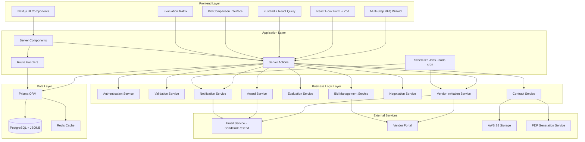

---

## 3. Data Flow Diagrams

### 3.1 RFQ Creation Data Flow

```mermaid
graph LR
    User[User] -->|Input| Wizard[RFQ Wizard]
    Wizard -->|Step Data| Validation[Zod Validation]
    Validation -->|Valid| ServerAction[Server Action]
    Validation -->|Invalid| Wizard

    ServerAction -->|Construct JSON| JSONBuilder[RFQ Structure Builder]
    JSONBuilder -->|Requirements| ReqHandler[Requirements Handler]
    JSONBuilder -->|Timeline| TimelineHandler[Timeline Handler]
    JSONBuilder -->|Evaluation| EvalHandler[Evaluation Handler]
    JSONBuilder -->|Terms| TermsHandler[Terms Handler]

    ReqHandler -->|Validated Data| Prisma[Prisma Client]
    TimelineHandler -->|Validated Data| Prisma
    EvalHandler -->|Validated Data| Prisma
    TermsHandler -->|Validated Data| Prisma

    Prisma -->|Insert| DB[(PostgreSQL)]
    DB -->|Store JSON| JSONB[requirements/timeline/evaluation JSONB]

    DB -->|Success| Invitations{Publish Now?}
    Invitations -->|Yes| CreateInvites[Create Vendor Invitations]
    Invitations -->|No| DraftStatus[Status: DRAFT]

    CreateInvites -->|Send Emails| EmailService[Email Service]
    EmailService -->|Success| OpenStatus[Status: OPEN]

    DraftStatus -->|Update UI| Cache[React Query Cache]
    OpenStatus -->|Update UI| Cache
    Cache -->|Refresh| Wizard

    ServerAction -->|Error| ErrorHandler[Error Handler]
    ErrorHandler -->|Display Error| Wizard
```

### 3.2 Bid Submission Data Flow

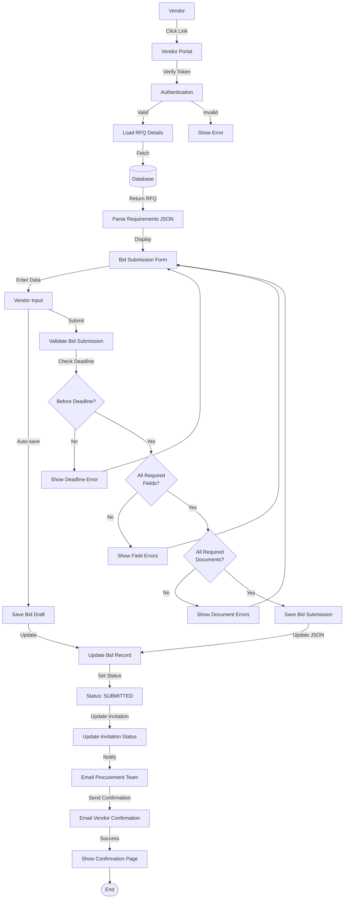

### 3.3 Bid Evaluation Data Flow

```mermaid
graph LR
    Evaluator[Evaluator] -->|Access| EvalPage[Evaluation Page]
    EvalPage -->|Load| DB[(Database)]
    DB -->|Return Bids| DisplayBids[Display Bid List]

    DisplayBids -->|Select Bid| LoadBidDetail[Load Bid Details]
    LoadBidDetail -->|Parse JSON| LineItems[Parse Line Items]
    LineItems -->|Display| EvalForm[Evaluation Form]

    EvalForm -->|Load Criteria| Criteria[Evaluation Criteria]
    Criteria -->|From RFQ JSON| CriteriaList[Display Criteria with Weights]

    Evaluator -->|Score| EnterScores[Enter Criterion Scores]
    EnterScores -->|Calculate| WeightedCalc[Calculate Weighted Score]
    WeightedCalc -->|Display| TotalScore[Show Total Score]

    Evaluator -->|Add Notes| EnterJustification[Enter Justification]
    EnterJustification -->|Save| SaveEval[Save Evaluation]

    SaveEval -->|Create/Update| EvalRecord[Evaluation Record]
    EvalRecord -->|Aggregate| CheckComplete{All Evaluators<br/>Complete?}

    CheckComplete -->|No| PartialSave[Save Partial Evaluation]
    PartialSave -->|Update UI| EvalPage

    CheckComplete -->|Yes| CalculateAvg[Calculate Average Score]
    CalculateAvg -->|Update| BidScore[Update Bid Overall Score]
    BidScore -->|Rank Bids| RankBids[Rank All Bids]
    RankBids -->|Notify| NotifyManager[Notify Procurement Manager]
    NotifyManager -->|Update UI| Dashboard[Evaluation Dashboard]
```

---

## 4. Core Workflows

### 4.1 RFQ Creation Workflow (UC-RFQ-001)

```mermaid
flowchart TD
    Start([User Navigates to RFQ Module]) --> CheckAuth{Authenticated?}
    CheckAuth -->|No| Login[Redirect to Login]
    CheckAuth -->|Yes| CheckPerm{Has Permission?}

    CheckPerm -->|No| PermError[Show Permission Error]
    PermError --> End([End])
    CheckPerm -->|Yes| ShowRFQs[Display RFQ List]

    ShowRFQs --> UserAction{User Action?}
    UserAction -->|Create New| StartWizard[Start RFQ Wizard]
    UserAction -->|Load Draft| LoadDraft[Load Existing Draft]

    LoadDraft --> StartWizard
    StartWizard --> Step1[Step 1: Basic Information]

    Step1 --> EnterBasic[Enter RFQ Details]
    EnterBasic --> BasicFields[Title, Type, Category, Description]
    BasicFields --> ValidateBasic{Valid?}
    ValidateBasic -->|No| ShowBasicErrors[Show Validation Errors]
    ShowBasicErrors --> EnterBasic

    ValidateBasic -->|Yes| GenerateRFQNum[Auto-generate RFQ Number]
    GenerateRFQNum --> Step2[Step 2: Requirements & Specs]

    Step2 --> AddLineItems[Add Line Items]
    AddLineItems --> ItemDetails[Enter Item Description, Qty, UOM]
    ItemDetails --> ItemSpecs[Add Specifications]
    ItemSpecs --> DeliveryInfo[Set Delivery Location & Date]
    DeliveryInfo --> MoreItems{Add More<br/>Items?}
    MoreItems -->|Yes| AddLineItems
    MoreItems -->|No| CheckMinItems{At Least 1<br/>Item?}

    CheckMinItems -->|No| ItemError[Show Minimum Item Error]
    ItemError --> AddLineItems
    CheckMinItems -->|Yes| GeneralReqs[Add General Requirements]
    GeneralReqs --> AttachDocs[Attach Supporting Documents]
    AttachDocs --> Step3[Step 3: Vendor Selection]

    Step3 --> SelectMethod{Selection<br/>Method?}
    SelectMethod -->|Individual| SelectVendors[Select Individual Vendors]
    SelectMethod -->|Category| SelectByCategory[Select All in Category]
    SelectMethod -->|Saved List| LoadVendorList[Load Saved Vendor List]

    SelectVendors --> CheckMinVendors
    SelectByCategory --> CheckMinVendors
    LoadVendorList --> CheckMinVendors{At Least 3<br/>Vendors?}

    CheckMinVendors -->|No| VendorError[Show Minimum Vendor Error]
    VendorError --> SelectMethod
    CheckMinVendors -->|Yes| ReviewVendors[Review Selected Vendors]
    ReviewVendors --> Step4[Step 4: Bidding Timeline]

    Step4 --> SetDates[Set Publish, Open, Close Dates]
    SetDates --> ValidateDates{Valid Timeline?}
    ValidateDates -->|< 7 Days| DateError[Show Timeline Error]
    DateError --> SetDates

    ValidateDates -->|≥ 7 Days| SetEvents[Configure Optional Events]
    SetEvents --> PreBid{Pre-bid<br/>Conference?}
    PreBid -->|Yes| SetPreBidDate[Set Pre-bid Date & Details]
    PreBid -->|No| SiteVisit{Site Visit?}
    SetPreBidDate --> SiteVisit

    SiteVisit -->|Yes| SetSiteVisit[Set Site Visit Date & Location]
    SiteVisit -->|No| SetReminders[Configure Automatic Reminders]
    SetSiteVisit --> SetReminders

    SetReminders --> Step5[Step 5: Evaluation Criteria]

    Step5 --> AddCriteria[Add Evaluation Criteria]
    AddCriteria --> CriteriaDetails[Name, Type, Weight, Scoring Method]
    CriteriaDetails --> MoreCriteria{Add More<br/>Criteria?}
    MoreCriteria -->|Yes| AddCriteria
    MoreCriteria -->|No| CheckWeights{Weights Sum<br/>to 100%?}

    CheckWeights -->|No| WeightError[Show Weight Error]
    WeightError --> AddCriteria
    CheckWeights -->|Yes| SelectScoringMethod[Select Scoring Method]

    SelectScoringMethod --> ScoringType{Scoring Type?}
    ScoringType -->|Lowest Price| SetLowestPrice[Configure Lowest Price]
    ScoringType -->|Weighted Avg| SetWeightedAvg[Configure Weighted Average]
    ScoringType -->|Tech-Commercial| SetTechCommercial[Configure Tech-Commercial Split]

    SetLowestPrice --> AssignEvaluators
    SetWeightedAvg --> AssignEvaluators
    SetTechCommercial --> TechThreshold[Set Technical Threshold]
    TechThreshold --> AssignEvaluators[Assign Evaluators]

    AssignEvaluators --> EvalDeadline[Set Evaluation Deadline]
    EvalDeadline --> Step6[Step 6: Terms & Conditions]

    Step6 --> PaymentTerms[Configure Payment Terms]
    PaymentTerms --> DeliveryTerms[Configure Delivery Terms]
    DeliveryTerms --> BidValidity[Set Bid Validity Period]
    BidValidity --> ValidateValidity{Validity ≥ 60<br/>Days?}
    ValidateValidity -->|No| ValidityError[Show Validity Error]
    ValidityError --> BidValidity

    ValidateValidity -->|Yes| BondsReq{Bonds<br/>Required?}
    BondsReq -->|Yes| SetBonds[Configure Bond Requirements]
    BondsReq -->|No| InsuranceReq{Insurance<br/>Required?}
    SetBonds --> InsuranceReq

    InsuranceReq -->|Yes| SetInsurance[Configure Insurance Requirements]
    InsuranceReq -->|No| Penalties{Liquidated<br/>Damages?}
    SetInsurance --> Penalties

    Penalties -->|Yes| SetPenalties[Configure Penalty Terms]
    Penalties -->|No| TerminationClauses[Set Termination Clauses]
    SetPenalties --> TerminationClauses

    TerminationClauses --> SpecialConditions[Add Special Conditions]
    SpecialConditions --> Step7[Step 7: Review & Publish]

    Step7 --> ReviewAll[Review All Sections]
    ReviewAll --> Completeness[Check Completeness]
    Completeness --> ValidationSummary{All Valid?}
    ValidationSummary -->|No| HighlightMissing[Highlight Missing/Invalid]
    HighlightMissing --> SelectStep[Go to Relevant Step]
    SelectStep --> Step1

    ValidationSummary -->|Yes| UserDecision{User Decision?}

    UserDecision -->|Save Draft| SaveDraft[Save as Draft]
    SaveDraft --> DraftStatus[Status: DRAFT]
    DraftStatus --> SaveDB[(Save to Database)]
    SaveDB --> DraftSuccess[Display Draft Saved Message]
    DraftSuccess --> End

    UserDecision -->|Submit for Approval| CheckApprovalReq{Approval<br/>Required?}
    CheckApprovalReq -->|Yes| SubmitApproval[Submit for Approval]
    SubmitApproval --> PendingStatus[Status: PENDING_APPROVAL]
    PendingStatus --> NotifyApprover[Notify Approver]
    NotifyApprover --> SaveDB

    CheckApprovalReq -->|No| PublishAction[Publish RFQ]
    UserDecision -->|Publish Now| PublishAction

    PublishAction --> CreateInvitations[Create Vendor Invitations]
    CreateInvitations --> SendEmails[Send Invitation Emails]
    SendEmails --> SendPortalNotifs[Send Portal Notifications]
    SendPortalNotifs --> ScheduleReminders[Schedule Reminder Jobs]
    ScheduleReminders --> PublishedStatus[Status: PUBLISHED/OPEN]
    PublishedStatus --> SaveDB

    SaveDB --> LogAudit[Log in Audit Trail]
    LogAudit --> Success[Display Success Message]
    Success --> Navigate[Navigate to RFQ Detail]
    Navigate --> End

    Login --> End
```

### 4.2 Vendor Invitation Workflow (UC-RFQ-002)

```mermaid
flowchart TD
    Start([User Opens RFQ Detail]) --> CheckStatus{RFQ Status?}
    CheckStatus -->|Draft| StatusError[Cannot Invite - Not Published]
    StatusError --> End([End])

    CheckStatus -->|Published/Open| ShowDetail[Display RFQ Details]
    ShowDetail --> ManageVendors[Click 'Manage Vendors' Tab]

    ManageVendors --> ShowInvitations[Display Current Invitations]
    ShowInvitations --> InvitationStats[Show Stats: Invited, Viewed, Submitted]

    InvitationStats --> UserAction{User Action?}
    UserAction -->|Add Vendors| AddVendorsBtn[Click 'Add Vendors']
    UserAction -->|Send Reminder| SelectVendor[Select Vendor for Reminder]
    UserAction -->|Remove Vendor| RemoveVendor[Select Vendor to Remove]

    AddVendorsBtn --> VendorSelector[Show Vendor Selection Dialog]
    VendorSelector --> SearchVendors[Search/Filter Vendors]
    SearchVendors --> DisplayQualified[Display Qualified Vendors]

    DisplayQualified --> ShowQualifications[Show Qualification Indicators]
    ShowQualifications --> SelectVendors[Select Vendors to Invite]

    SelectVendors --> SelectionMethod{Selection<br/>Method?}
    SelectionMethod -->|Individual| CheckIndividual[Check Individual Checkboxes]
    SelectionMethod -->|Select All| CheckAllQualified[Select All Qualified]
    SelectionMethod -->|Import List| UploadFile[Upload Vendor List File]

    CheckIndividual --> VendorList
    CheckAllQualified --> VendorList
    UploadFile --> ValidateFile{File Valid?}
    ValidateFile -->|No| FileError[Show File Error]
    FileError --> UploadFile
    ValidateFile -->|Yes| MatchVendors[Match Vendor IDs/Names]
    MatchVendors --> ShowMatches[Show Matched/Unmatched]
    ShowMatches --> VendorList[Show Selected Vendors]

    VendorList --> CheckConflicts{Conflicts<br/>Detected?}
    CheckConflicts -->|Yes| ShowConflictWarning[Show Conflict Warning]
    ShowConflictWarning --> ConflictDecision{User Decision?}
    ConflictDecision -->|Exclude| ExcludeVendor[Remove from Selection]
    ConflictDecision -->|Override| FlagConflict[Flag for Approval]
    ExcludeVendor --> VendorList
    FlagConflict --> VendorList

    CheckConflicts -->|No| CheckDuplicates{Already<br/>Invited?}
    CheckDuplicates -->|Yes| DuplicateWarning[Show Duplicate Warning]
    DuplicateWarning --> DuplicateAction{User Action?}
    DuplicateAction -->|Skip| RemoveDuplicate[Remove from Selection]
    DuplicateAction -->|Resend| MarkResend[Mark for Resend]
    RemoveDuplicate --> VendorList
    MarkResend --> VendorList

    CheckDuplicates -->|No| CheckMinVendors{Total ≥ 3<br/>Vendors?}
    CheckMinVendors -->|No| VendorCountError[Show Minimum Vendor Error]
    VendorCountError --> VendorList

    CheckMinVendors -->|Yes| SendInvitations[Click 'Send Invitations']
    SendInvitations --> CustomizeInvitation[Customize Invitation Dialog]

    CustomizeInvitation --> InvitationTemplate[Show Standard Template]
    InvitationTemplate --> CustomMessage{Add Custom<br/>Message?}
    CustomMessage -->|Yes| EnterMessage[Enter Custom Message]
    CustomMessage -->|No| SelectDocuments[Select Documents to Attach]
    EnterMessage --> SelectDocuments

    SelectDocuments --> DeliveryMethod{Delivery<br/>Method?}
    DeliveryMethod -->|Email Only| EmailOnly[Set Email Only]
    DeliveryMethod -->|Portal Only| PortalOnly[Set Portal Only]
    DeliveryMethod -->|Both| BothMethods[Set Email + Portal]

    EmailOnly --> PriorityFlag
    PortalOnly --> PriorityFlag
    BothMethods --> PriorityFlag{High Priority?}

    PriorityFlag -->|Yes| SetHighPriority[Mark as High Priority]
    PriorityFlag -->|No| SendNow{Send Now or<br/>Schedule?}
    SetHighPriority --> SendNow

    SendNow -->|Send Now| ValidateInvitations[Validate Invitations]
    SendNow -->|Schedule| ScheduleDialog[Show Schedule Dialog]
    ScheduleDialog --> SelectDateTime[Select Date/Time]
    SelectDateTime --> ValidateSchedule{Valid<br/>Schedule?}
    ValidateSchedule -->|Before Closing| ScheduleError[Show Schedule Error]
    ScheduleError --> SelectDateTime
    ValidateSchedule -->|Valid| CreateScheduledJob[Create Scheduled Job]
    CreateScheduledJob --> ScheduleSuccess[Display Schedule Success]
    ScheduleSuccess --> End

    ValidateInvitations --> CheckVendorStatus{All Vendors<br/>Active?}
    CheckVendorStatus -->|Some Inactive| InactiveWarning[Show Inactive Warning]
    InactiveWarning --> InactiveAction{User Action?}
    InactiveAction -->|Exclude| RemoveInactive[Remove Inactive Vendors]
    InactiveAction -->|Continue| ProceedAnyway[Proceed with Warning]
    RemoveInactive --> ValidateInvitations
    ProceedAnyway --> CheckEmails

    CheckVendorStatus -->|All Active| CheckEmails{All Emails<br/>Valid?}
    CheckEmails -->|Some Invalid| EmailWarning[Show Invalid Email Warning]
    EmailWarning --> EmailAction{User Action?}
    EmailAction -->|Fix| UpdateEmails[Update Email Addresses]
    EmailAction -->|Skip| SkipInvalid[Skip Invalid Emails]
    UpdateEmails --> CheckEmails
    SkipInvalid --> CreateInvitationRecords

    CheckEmails -->|All Valid| CreateInvitationRecords[Create Invitation Records]
    CreateInvitationRecords --> GenerateLinks[Generate Unique Submission Links]
    GenerateLinks --> SendEmailInvitations[Send Email Invitations]

    SendEmailInvitations --> EmailService[Email Service]
    EmailService --> CheckEmailStatus{Emails Sent?}
    CheckEmailStatus -->|Some Failed| EmailFailure[Log Failed Emails]
    EmailFailure --> RetryEmail[Queue for Retry]
    RetryEmail --> SendPortalNotifications
    CheckEmailStatus -->|All Success| SendPortalNotifications[Send Portal Notifications]

    SendPortalNotifications --> UpdateInvitationStatus[Update Invitation Status]
    UpdateInvitationStatus --> SetInvited[Status: INVITED]
    SetInvited --> LogTimestamps[Log Invitation Timestamps]

    LogTimestamps --> ScheduleAutoReminders[Schedule Automatic Reminders]
    ScheduleAutoReminders --> ReminderConfig[Configure Reminder Schedule]
    ReminderConfig --> UpdateRFQAnalytics[Update RFQ Analytics]

    UpdateRFQAnalytics --> InvitationSuccess[Display Success Message]
    InvitationSuccess --> ShowInvitationSummary[Show Invitation Summary]
    ShowInvitationSummary --> RefreshUI[Refresh Invitation Dashboard]
    RefreshUI --> End

    SelectVendor --> ResendReminderDialog[Show Reminder Dialog]
    ResendReminderDialog --> SendReminder[Send Reminder Email]
    SendReminder --> LogReminder[Log Reminder Sent]
    LogReminder --> End

    RemoveVendor --> RemoveConfirm{Confirm<br/>Remove?}
    RemoveConfirm -->|Yes| UpdateInvitationRemove[Update Invitation Status]
    UpdateInvitationRemove --> NotifyVendorRemoval[Notify Vendor of Removal]
    NotifyVendorRemoval --> End
    RemoveConfirm -->|No| ShowInvitations
```

### 4.3 Bid Submission Workflow (Vendor - UC-RFQ-003)

```mermaid
flowchart TD
    Start([Vendor Logs into Portal]) --> Dashboard[Vendor Dashboard]
    Dashboard --> ShowNotifications[Show RFQ Invitations Badge]

    ShowNotifications --> ViewInvitations[Click 'RFQ Invitations']
    ViewInvitations --> DisplayList[Display RFQ Invitation List]

    DisplayList --> ShowInvitationDetails[Show: RFQ Number, Title, Deadline, Status]
    ShowInvitationDetails --> VendorAction{Vendor Action?}

    VendorAction -->|View RFQ| ViewRFQDetail[Click 'View RFQ']
    VendorAction -->|Submit Bid| SubmitBid[Click 'Submit Bid']

    ViewRFQDetail --> LoadRFQ[Load RFQ Details]
    LoadRFQ --> ParseRequirements[Parse Requirements JSON]
    ParseRequirements --> DisplayRFQ[Display RFQ Information]

    DisplayRFQ --> ShowSections[Show: Items, Specs, Timeline, Terms]
    ShowSections --> DownloadDocs[Download Supporting Documents]
    DownloadDocs --> ReviewRFQ[Review RFQ Requirements]

    ReviewRFQ --> ReadyToBid{Ready to<br/>Submit Bid?}
    ReadyToBid -->|No| RequestClarification[Request Clarification]
    RequestClarification --> ClarificationForm[Fill Clarification Form]
    ClarificationForm --> SendQuestion[Send Question to Procurement]
    SendQuestion --> WaitResponse[Wait for Response]
    WaitResponse --> DisplayRFQ

    ReadyToBid -->|Yes| SubmitBid

    SubmitBid --> CheckDeadline{Before<br/>Deadline?}
    CheckDeadline -->|No| DeadlineError[Show Deadline Passed Error]
    DeadlineError --> End([End])

    CheckDeadline -->|Yes| CheckAcknowledgment{RFQ<br/>Acknowledged?}
    CheckAcknowledgment -->|No| AcknowledgeDialog[Show Acknowledgment Dialog]
    AcknowledgeDialog --> AcknowledgeRFQ[Acknowledge Receipt]
    AcknowledgeRFQ --> LogAcknowledgment[Log Acknowledgment Timestamp]
    LogAcknowledgment --> OpenBidForm

    CheckAcknowledgment -->|Yes| OpenBidForm[Open Bid Submission Form]

    OpenBidForm --> CheckDraft{Existing<br/>Draft?}
    CheckDraft -->|Yes| LoadDraft[Load Draft Data]
    CheckDraft -->|No| InitializeForm[Initialize New Bid]
    LoadDraft --> Tab1
    InitializeForm --> Tab1[Tab 1: Line Items & Pricing]

    Tab1 --> DisplayLineItems[Display RFQ Line Items]
    DisplayLineItems --> ForEachItem[For Each Line Item]

    ForEachItem --> EnterUnitPrice[Enter Unit Price]
    EnterUnitPrice --> AutoCalculate[Auto-calculate Total Price]
    AutoCalculate --> EnterDeliveryDate[Enter Delivery Date]
    EnterDeliveryDate --> EnterBrand[Enter Brand/Manufacturer]
    EnterBrand --> ComplianceStatus{Compliance<br/>Status?}

    ComplianceStatus -->|Full| MarkFull[Mark as Full Compliance]
    ComplianceStatus -->|Partial| MarkPartial[Mark as Partial + Explanation]
    ComplianceStatus -->|Alternative| OfferAlternative[Offer Alternative Product]
    ComplianceStatus -->|Cannot Supply| MarkCannot[Mark as Cannot Supply + Reason]

    MarkFull --> NextItem
    MarkPartial --> ExplainPartial[Enter Explanation]
    ExplainPartial --> NextItem
    OfferAlternative --> AlternativeDetails[Enter Alternative Details]
    AlternativeDetails --> NextItem
    MarkCannot --> EnterReason[Enter Reason]
    EnterReason --> NextItem{More Items?}

    NextItem -->|Yes| ForEachItem
    NextItem -->|No| CalculateTotals[Calculate Subtotal, Tax, Shipping]
    CalculateTotals --> ShowGrandTotal[Show Grand Total]

    ShowGrandTotal --> SaveDraft1[Auto-save Draft]
    SaveDraft1 --> Tab2Decision{Continue to<br/>Next Tab?}
    Tab2Decision -->|Yes| Tab2[Tab 2: Commercial Terms]
    Tab2Decision -->|Save & Exit| SaveAndExit[Save Draft & Exit]
    SaveAndExit --> End

    Tab2 --> EnterPaymentTerms[Enter Payment Terms Offered]
    EnterPaymentTerms --> ComparePaymentTerms{Matches RFQ<br/>Terms?}
    ComparePaymentTerms -->|Yes| MarkMatch[Mark as Matching]
    ComparePaymentTerms -->|No| EnterVariance[Enter Variance & Justification]
    MarkMatch --> EnterDeliveryTerms
    EnterVariance --> EnterDeliveryTerms[Enter Delivery Terms]

    EnterDeliveryTerms --> EnterWarranty[Enter Warranty Details]
    EnterWarranty --> AfterSalesService{After-sales<br/>Service?}
    AfterSalesService -->|Yes| ServiceDetails[Enter Service Details]
    AfterSalesService -->|No| BondProvided{Bond<br/>Provided?}
    ServiceDetails --> BondProvided

    BondProvided -->|Yes| BondDetails[Enter Bond Provider & Details]
    BondProvided -->|No| InsuranceProvided{Insurance<br/>Provided?}
    BondDetails --> InsuranceProvided

    InsuranceProvided -->|Yes| InsuranceDetails[Enter Insurance Details]
    InsuranceProvided -->|No| PenaltiesAccept{Accept<br/>Penalties?}
    InsuranceDetails --> PenaltiesAccept

    PenaltiesAccept -->|Yes| AcceptPenalties[Mark Penalties as Accepted]
    PenaltiesAccept -->|No| PenaltyComments[Enter Comments on Penalties]
    AcceptPenalties --> AlternativeTermsOffered
    PenaltyComments --> AlternativeTermsOffered{Alternative Terms<br/>Proposed?}

    AlternativeTermsOffered -->|Yes| EnterAlternatives[Enter Alternative Terms]
    AlternativeTermsOffered -->|No| SaveDraft2[Auto-save Draft]
    EnterAlternatives --> SaveDraft2

    SaveDraft2 --> Tab3[Tab 3: Technical Compliance]

    Tab3 --> DisplayRequirements[Display Technical Requirements]
    DisplayRequirements --> ForEachRequirement[For Each Requirement]

    ForEachRequirement --> SelectCompliance{Compliance?}
    SelectCompliance -->|Compliant| MarkCompliant[Mark as Compliant]
    SelectCompliance -->|Partial| MarkPartialReq[Mark as Partial + Explanation]
    SelectCompliance -->|Non-compliant| MarkNonCompliant[Mark as Non-compliant + Reason]

    MarkCompliant --> UploadEvidence[Upload Supporting Evidence]
    MarkPartialReq --> EnterExplanation[Enter Explanation]
    MarkNonCompliant --> EnterNonReason[Enter Reason]

    UploadEvidence --> NextReq
    EnterExplanation --> NextReq
    EnterNonReason --> NextReq{More<br/>Requirements?}

    NextReq -->|Yes| ForEachRequirement
    NextReq -->|No| UploadCertifications[Upload Certifications]

    UploadCertifications --> TechnicalDocs[Upload Technical Documents]
    TechnicalDocs --> TechnicalNarrative[Enter Technical Narrative]
    TechnicalNarrative --> CalculateCompliance[Calculate Overall Compliance %]
    CalculateCompliance --> SaveDraft3[Auto-save Draft]

    SaveDraft3 --> Tab4[Tab 4: Documents & Attachments]

    Tab4 --> ShowChecklist[Show Required Documents Checklist]
    ShowChecklist --> ForEachDoc[For Each Required Document]

    ForEachDoc --> DocType{Document<br/>Type?}
    DocType -->|Company Reg| UploadCompanyReg[Upload Company Registration]
    DocType -->|Tax Certificate| UploadTax[Upload Tax Clearance]
    DocType -->|Financial Statements| UploadFinancial[Upload Financial Statements]
    DocType -->|References| UploadReferences[Upload References]
    DocType -->|Other| UploadOther[Upload Other Documents]

    UploadCompanyReg --> ValidateDoc
    UploadTax --> ValidateDoc
    UploadFinancial --> ValidateDoc
    UploadReferences --> ValidateDoc
    UploadOther --> ValidateDoc{Valid File?}

    ValidateDoc -->|Invalid Type| FileTypeError[Show File Type Error]
    ValidateDoc -->|Too Large| FileSizeError[Show File Size Error]
    ValidateDoc -->|Valid| SaveDocument[Save Document]

    FileTypeError --> ForEachDoc
    FileSizeError --> ForEachDoc
    SaveDocument --> MoreDocs{More<br/>Documents?}

    MoreDocs -->|Yes| ForEachDoc
    MoreDocs -->|No| OptionalDocs{Add Optional<br/>Documents?}

    OptionalDocs -->|Yes| UploadAdditional[Upload Additional Documents]
    OptionalDocs -->|No| SaveDraft4[Auto-save Draft]
    UploadAdditional --> SaveDraft4

    SaveDraft4 --> Tab5[Tab 5: Declaration & Submit]

    Tab5 --> ShowBidSummary[Show Complete Bid Summary]
    ShowBidSummary --> SummaryDetails[Display: Total Value, Items, Terms, Compliance]

    SummaryDetails --> ShowDeclarations[Show Mandatory Declarations]
    ShowDeclarations --> Declaration1{Accuracy<br/>Declaration?}
    Declaration1 -->|Check| CheckAccuracy[Check Accuracy Declaration]
    Declaration1 -->|Not Checked| DeclarationError

    CheckAccuracy --> Declaration2{Conflict of<br/>Interest?}
    Declaration2 -->|Check| CheckConflict[Check No Conflict Declaration]
    Declaration2 -->|Not Checked| DeclarationError

    CheckConflict --> Declaration3{Anti-corruption?}
    Declaration3 -->|Check| CheckAntiCorruption[Check Anti-corruption Declaration]
    Declaration3 -->|Not Checked| DeclarationError

    CheckAntiCorruption --> Declaration4{Terms<br/>Acceptance?}
    Declaration4 -->|Check| CheckTerms[Check Terms Acceptance]
    Declaration4 -->|Not Checked| DeclarationError[Show Declaration Error]
    DeclarationError --> ShowDeclarations

    CheckTerms --> FinalComments{Add Final<br/>Comments?}
    FinalComments -->|Yes| EnterComments[Enter Final Comments]
    FinalComments -->|No| ReviewComplete[Review Complete]
    EnterComments --> ReviewComplete

    ReviewComplete --> SubmitButton[Click 'Submit Bid']
    SubmitButton --> FinalConfirmation[Show Final Confirmation Dialog]

    FinalConfirmation --> ConfirmSubmit{Confirm<br/>Submit?}
    ConfirmSubmit -->|No| Tab5
    ConfirmSubmit -->|Yes| ValidateBid[Validate Complete Bid]

    ValidateBid --> CheckAllFields{All Required<br/>Fields?}
    CheckAllFields -->|No| MissingFieldsError[Show Missing Fields Error]
    MissingFieldsError --> HighlightMissing[Highlight Missing Fields]
    HighlightMissing --> Tab5

    CheckAllFields -->|Yes| CheckAllDocs{All Required<br/>Documents?}
    CheckAllDocs -->|No| MissingDocsError[Show Missing Documents Error]
    MissingDocsError --> Tab4

    CheckAllDocs -->|Yes| CheckPricing{All Items<br/>Priced?}
    CheckPricing -->|No| MissingPriceError[Show Missing Pricing Error]
    MissingPriceError --> Tab1

    CheckPricing -->|Yes| CheckDeadlineFinal{Still Before<br/>Deadline?}
    CheckDeadlineFinal -->|No| DeadlinePassedError[Show Deadline Passed Error]
    DeadlinePassedError --> End

    CheckDeadlineFinal -->|Yes| SaveBidSubmission[Save Bid Submission]
    SaveBidSubmission --> GenerateBidNumber[Generate Bid Number]
    GenerateBidNumber --> SetSubmitted[Status: SUBMITTED]
    SetSubmitted --> UpdateInvitation[Update Invitation Status]
    UpdateInvitation --> NotifyProcurement[Notify Procurement Team]
    NotifyProcurement --> SendVendorConfirmation[Send Confirmation Email to Vendor]

    SendVendorConfirmation --> GenerateReceipt[Generate Bid Receipt PDF]
    GenerateReceipt --> LogAuditTrail[Log in Audit Trail]
    LogAuditTrail --> ShowSuccess[Show Success Page]

    ShowSuccess --> DisplayBidDetails[Display: Bid Number, Submission Time, Total Value]
    DisplayBidDetails --> DownloadReceipt[Option to Download Receipt]
    DownloadReceipt --> End
```

### 4.4 Bid Evaluation Workflow (UC-RFQ-004)

```mermaid
flowchart TD
    Start([Evaluator Opens RFQ]) --> CheckRFQStatus{RFQ Status?}
    CheckRFQStatus -->|Not Closed| StatusError[Cannot Evaluate - RFQ Still Open]
    StatusError --> End([End])

    CheckRFQStatus -->|Closed| CheckAssignment{Assigned as<br/>Evaluator?}
    CheckAssignment -->|No| PermissionError[Show Permission Error]
    PermissionError --> End

    CheckAssignment -->|Yes| LoadRFQ[Load RFQ Details]
    LoadRFQ --> LoadBids[Load All Submitted Bids]
    LoadBids --> CheckBidCount{Any Bids<br/>Submitted?}
    CheckBidCount -->|No| NoBidsError[Show No Bids Error]
    NoBidsError --> End

    CheckBidCount -->|Yes| EvaluationMode[Display Evaluation Dashboard]
    EvaluationMode --> ShowModes[Show: Individual, Comparison, Matrix Views]

    ShowModes --> SelectMode{Evaluation<br/>Mode?}
    SelectMode -->|Individual| IndividualMode[Individual Scoring Mode]
    SelectMode -->|Side-by-Side| ComparisonMode[Side-by-Side Comparison]
    SelectMode -->|Matrix| MatrixMode[Matrix View]

    IndividualMode --> SelectBid[Select Bid to Evaluate]
    SelectBid --> PreliminaryReview[Preliminary Review]

    PreliminaryReview --> CheckCompliance{Bid<br/>Compliant?}
    CheckCompliance -->|Missing Docs| FlagMissingDocs[Flag: Missing Documents]
    CheckCompliance -->|Incomplete Pricing| FlagIncomplete[Flag: Incomplete Pricing]
    CheckCompliance -->|Late Submission| FlagLate[Flag: Late Submission]
    CheckCompliance -->|Non-compliant| FlagNonCompliant[Flag: Technical Non-compliance]

    FlagMissingDocs --> DisqualifyDecision
    FlagIncomplete --> DisqualifyDecision
    FlagLate --> DisqualifyDecision
    FlagNonCompliant --> DisqualifyDecision{Disqualify?}

    DisqualifyDecision -->|Yes| DisqualifyBid[Disqualify Bid]
    DisqualifyBid --> DisqualifyReason[Enter Disqualification Reason]
    DisqualifyReason --> UpdateBidStatus[Status: DISQUALIFIED]
    UpdateBidStatus --> LogDisqualification[Log Disqualification]
    LogDisqualification --> NotifyManager[Notify Procurement Manager]
    NotifyManager --> NextBid{More Bids to<br/>Evaluate?}

    DisqualifyDecision -->|No| RequestClarification[Request Clarification]
    RequestClarification --> SendClarificationRequest[Send to Vendor]
    SendClarificationRequest --> PauseEvaluation[Pause Evaluation for This Bid]
    PauseEvaluation --> NextBid

    CheckCompliance -->|Compliant| DetailedEvaluation[Begin Detailed Evaluation]

    DetailedEvaluation --> LoadBidDetails[Load Complete Bid Details]
    LoadBidDetails --> LoadCriteria[Load Evaluation Criteria]
    LoadCriteria --> DisplayCriteria[Display Criteria with Weights]

    DisplayCriteria --> ForEachCriterion[For Each Criterion]
    ForEachCriterion --> CriterionType{Criterion<br/>Type?}

    CriterionType -->|Price| EvaluatePrice[Evaluate Price]
    CriterionType -->|Quality| EvaluateQuality[Evaluate Quality]
    CriterionType -->|Delivery| EvaluateDelivery[Evaluate Delivery]
    CriterionType -->|Service| EvaluateService[Evaluate Service]
    CriterionType -->|Technical| EvaluateTechnical[Evaluate Technical]
    CriterionType -->|Custom| EvaluateCustom[Evaluate Custom Criterion]

    EvaluatePrice --> AutoScorePrice{Auto-score<br/>Price?}
    AutoScorePrice -->|Yes| LowestPriceCalc[Calculate: Lowest/This × Weight × 10]
    AutoScorePrice -->|No| ManualPriceScore[Enter Manual Price Score]
    LowestPriceCalc --> EnterPriceJustification
    ManualPriceScore --> EnterPriceJustification[Enter Justification]

    EvaluateQuality --> ReviewQualityDocs[Review Quality Documentation]
    ReviewQualityDocs --> EnterQualityScore[Enter Quality Score 1-10]
    EnterQualityScore --> EnterQualityJustification[Enter Justification]

    EvaluateDelivery --> ReviewDeliveryTerms[Review Delivery Terms]
    ReviewDeliveryTerms --> EnterDeliveryScore[Enter Delivery Score 1-10]
    EnterDeliveryScore --> EnterDeliveryJustification[Enter Justification]

    EvaluateService --> ReviewServiceOffering[Review Service Offering]
    ReviewServiceOffering --> EnterServiceScore[Enter Service Score 1-10]
    EnterServiceScore --> EnterServiceJustification[Enter Justification]

    EvaluateTechnical --> ReviewTechnicalCompliance[Review Technical Compliance]
    ReviewTechnicalCompliance --> EnterTechnicalScore[Enter Technical Score 1-10]
    EnterTechnicalScore --> EnterTechnicalJustification[Enter Justification]

    EvaluateCustom --> ReviewCustomCriterion[Review Custom Criterion]
    ReviewCustomCriterion --> EnterCustomScore[Enter Custom Score 1-10]
    EnterCustomScore --> EnterCustomJustification[Enter Justification]

    EnterPriceJustification --> ValidateScore
    EnterQualityJustification --> ValidateScore
    EnterDeliveryJustification --> ValidateScore
    EnterServiceJustification --> ValidateScore
    EnterTechnicalJustification --> ValidateScore
    EnterCustomJustification --> ValidateScore{Score Valid?}

    ValidateScore -->|Out of Range| ScoreError[Show Score Range Error]
    ScoreError --> CriterionType
    ValidateScore -->|Extreme Score<br/>No Justification| JustificationError[Show Justification Required]
    JustificationError --> CriterionType

    ValidateScore -->|Valid| CalculateWeightedScore[Calculate Weighted Score]
    CalculateWeightedScore --> UploadEvidence{Upload<br/>Evidence?}
    UploadEvidence -->|Yes| AttachEvidence[Attach Supporting Documents]
    UploadEvidence -->|No| NextCriterion{More<br/>Criteria?}
    AttachEvidence --> NextCriterion

    NextCriterion -->|Yes| ForEachCriterion
    NextCriterion -->|No| CalculateTotalScore[Calculate Total Weighted Score]

    CalculateTotalScore --> OverallComments[Enter Overall Evaluation Comments]
    OverallComments --> EnterRecommendation[Enter Recommendation]
    EnterRecommendation --> SaveEvaluation[Save Evaluation]

    SaveEvaluation --> EvaluationStatus{Mark as<br/>Complete?}
    EvaluationStatus -->|Save as Draft| DraftEval[Status: IN_PROGRESS]
    DraftEval --> NextBid

    EvaluationStatus -->|Complete| CompleteEval[Status: COMPLETED]
    CompleteEval --> LogEvaluationTime[Log Completion Timestamp]
    LogEvaluationTime --> AggregateScores[Aggregate Scores from All Evaluators]

    AggregateScores --> CheckAllComplete{All Evaluators<br/>Complete?}
    CheckAllComplete -->|No| PartialComplete[Partial Evaluation Complete]
    PartialComplete --> NextBid
    CheckAllComplete -->|Yes| CalculateAverageScore[Calculate Average Score per Bid]
    CalculateAverageScore --> UpdateBidScore[Update Bid Overall Score]
    UpdateBidScore --> NextBid

    NextBid -->|Yes| SelectBid
    NextBid -->|No| RankAllBids[Rank All Bids by Score]

    RankAllBids --> AssignRanks[Assign Ranks: 1st, 2nd, 3rd...]
    AssignRanks --> IdentifyRecommended[Identify Recommended Bid]
    IdentifyRecommended --> GenerateEvaluationSummary[Generate Evaluation Summary]

    GenerateEvaluationSummary --> SummaryContent[Include: Rankings, Scores, Recommendation]
    SummaryContent --> FinalizeEvaluation[Click 'Finalize Evaluation']

    FinalizeEvaluation --> SubmitForApproval[Submit Evaluation for Approval]
    SubmitForApproval --> RouteApproval{Approval<br/>Authority?}

    RouteApproval -->|<$50K| ProcurementManager[Route to Procurement Manager]
    RouteApproval -->|$50K-$500K| FinanceManager[Route to Finance Manager]
    RouteApproval -->|>$500K| Executive[Route to Executive]

    ProcurementManager --> NotifyApproverEval
    FinanceManager --> NotifyApproverEval
    Executive --> NotifyApproverEval[Notify Approver]

    NotifyApproverEval --> UpdateRFQStatus[Update RFQ Status: UNDER_REVIEW]
    UpdateRFQStatus --> ShowEvaluationSuccess[Display Success Message]
    ShowEvaluationSuccess --> End

    ComparisonMode --> LoadAllBids[Load All Bids for Comparison]
    LoadAllBids --> DisplayComparisonTable[Display Side-by-Side Table]
    DisplayComparisonTable --> HighlightBest[Highlight Best Values]
    HighlightBest --> SortOptions[Sort by Price/Score/Delivery]
    SortOptions --> AnalyzeDifferences[Analyze Price/Score Differences]
    AnalyzeDifferences --> AddComparisonNotes[Add Comparison Notes]
    AddComparisonNotes --> IdentifyBest[Identify Best Overall Value]
    IdentifyBest --> ExportComparison[Export Comparison to Excel]
    ExportComparison --> SelectMode

    MatrixMode --> DisplayMatrix[Display Evaluation Matrix]
    DisplayMatrix --> ShowMatrix[Rows: Bids, Cols: Criteria + Total]
    ShowMatrix --> ColorCode[Color Code: Green=High, Red=Low]
    ColorCode --> ShowAverages[Show Average Scores]
    ShowAverages --> IdentifyOutliers[Identify Score Outliers]
    IdentifyOutliers --> ReviewPatterns[Review Scoring Patterns]
    ReviewPatterns --> ExportMatrix[Export Matrix to Excel]
    ExportMatrix --> SelectMode
```

### 4.5 Award Workflow (UC-RFQ-005)

```mermaid
flowchart TD
    Start([Manager Opens RFQ]) --> CheckStatus{RFQ Status?}
    CheckStatus -->|Not Evaluated| StatusError[Cannot Award - Not Evaluated]
    StatusError --> End([End])

    CheckStatus -->|Under Review/Evaluated| LoadAwardDashboard[Load Award Dashboard]
    LoadAwardDashboard --> DisplaySummary[Display Evaluation Summary]

    DisplaySummary --> ShowRankings[Show: Rankings, Scores, Recommendation]
    ShowRankings --> ShowBidComparison[Show Top 3 Bids Comparison]

    ShowBidComparison --> ReviewRecommendation[Review Evaluator Recommendation]
    ReviewRecommendation --> ReviewJustification[Review Justification]
    ReviewJustification --> ReviewScores[Review Score Breakdown]
    ReviewScores --> ReviewPricing[Review Price Analysis]

    ReviewPricing --> ViewWinningBid[Click 'View Winning Bid Details']
    ViewWinningBid --> DisplayBidComplete[Display Complete Bid Details]

    DisplayBidComplete --> ReviewLineItems[Review All Line Items]
    ReviewLineItems --> ReviewCommercial[Review Commercial Terms]
    ReviewCommercial --> ReviewTechnical[Review Technical Compliance]
    ReviewTechnical --> ReviewDocuments[Review Submitted Documents]

    ReviewDocuments --> ValidateBid{Bid Meets All<br/>Requirements?}
    ValidateBid -->|No| IssueFound[Identify Issues]
    IssueFound --> IssueAction{Issue Action?}
    IssueAction -->|Request Clarification| SendClarification[Send Clarification Request]
    IssueAction -->|Award to Alternative| SelectAlternative[Select Alternative Vendor]
    IssueAction -->|Reject All Bids| RejectAll[Reject All & Reissue]
    SendClarification --> WaitClarification[Wait for Response]
    WaitClarification --> End
    SelectAlternative --> ViewWinningBid
    RejectAll --> End

    ValidateBid -->|Yes| CheckBudget{Within<br/>Budget?}
    CheckBudget -->|No| BudgetIssue{Budget<br/>Action?}
    BudgetIssue -->|Request Increase| RequestBudgetIncrease[Submit Budget Increase Request]
    BudgetIssue -->|Negotiate| InitiateNegotiation[Go to Negotiation Workflow]
    BudgetIssue -->|Cancel| CancelRFQ[Cancel RFQ]
    RequestBudgetIncrease --> WaitBudgetApproval[Wait for Budget Approval]
    WaitBudgetApproval --> End
    InitiateNegotiation --> End
    CancelRFQ --> End

    CheckBudget -->|Yes| CheckVendorQualification{Vendor Still<br/>Qualified?}
    CheckVendorQualification -->|No| DisqualifiedVendor[Vendor Disqualified]
    DisqualifiedVendor --> SelectAlternative

    CheckVendorQualification -->|Yes| AwardDecision[Click 'Award Decision']
    AwardDecision --> AwardForm[Display Award Decision Form]

    AwardForm --> SelectAwardStatus{Award<br/>Status?}
    SelectAwardStatus -->|Approve Award| ApproveAwarding[Select 'Approve Award']
    SelectAwardStatus -->|Award to Alternative| SelectAlternativeVendor[Select Alternative Vendor]
    SelectAwardStatus -->|Reject All Bids| RejectAllBids[Select 'Reject All Bids']

    SelectAlternativeVendor --> AlternativeReason[Enter Detailed Justification]
    AlternativeReason --> AlternativeApproval{Requires Higher<br/>Approval?}
    AlternativeApproval -->|Yes| RouteForApproval[Route for Additional Approval]
    AlternativeApproval -->|No| CreateAward
    RouteForApproval --> NotifyHigherAuthority[Notify Higher Authority]
    NotifyHigherAuthority --> WaitApproval[Wait for Approval]
    WaitApproval --> End

    RejectAllBids --> RejectionReason[Enter Rejection Reasons]
    RejectionReason --> NextAction{Next Action?}
    NextAction -->|Reissue| ReissueRFQ[Reissue with Modified Requirements]
    NextAction -->|Cancel| CancelProcurement[Cancel Procurement]
    ReissueRFQ --> End
    CancelProcurement --> End

    ApproveAwarding --> EnterAwardValue[Confirm Award Value]
    EnterAwardValue --> EnterJustification[Enter Award Justification]
    EnterJustification --> SpecialConditions{Special<br/>Conditions?}
    SpecialConditions -->|Yes| EnterConditions[Enter Special Conditions]
    SpecialConditions -->|No| ContractDuration[Enter Contract Duration]
    EnterConditions --> ContractDuration

    ContractDuration --> EffectiveDates[Set Effective & Expiry Dates]
    EffectiveDates --> AwardType{Award Type?}
    AwardType -->|Full Award| FullAward[Full Award - All Items]
    AwardType -->|Partial Award| PartialAward[Partial Award - Selected Items]
    AwardType -->|Split Award| SplitAward[Split Award - Multiple Vendors]
    AwardType -->|Conditional| ConditionalAward[Conditional Award]

    FullAward --> SubmitAward
    PartialAward --> AllocateItems[Allocate Items to Vendor]
    AllocateItems --> SubmitAward
    SplitAward --> AllocateToMultiple[Allocate Items to Multiple Vendors]
    AllocateToMultiple --> CreateMultipleAwards[Create Multiple Award Records]
    CreateMultipleAwards --> SubmitAward
    ConditionalAward --> DefineConditions[Define Conditions]
    DefineConditions --> NegotiationRequired[Mark Negotiation Required]
    NegotiationRequired --> SubmitAward[Click 'Submit Award Decision']

    SubmitAward --> ValidateAward{Award Data<br/>Valid?}
    ValidateAward -->|No| ValidationError[Show Validation Errors]
    ValidationError --> AwardForm

    ValidateAward -->|Yes| CheckAuthority{User Has<br/>Authority?}
    CheckAuthority -->|No| RequiresApproval{Requires<br/>Approval?}
    RequiresApproval -->|<$50K| RouteToProcurement[Route to Procurement Manager]
    RequiresApproval -->|$50K-$500K| RouteToFinance[Route to Finance Manager]
    RequiresApproval -->|>$500K| RouteToExecutive[Route to Executive]

    RouteToProcurement --> CreateAward
    RouteToFinance --> CreateAward
    RouteToExecutive --> CreateAward

    CheckAuthority -->|Yes| CreateAward[Create Award Record]

    CreateAward --> GenerateAwardNumber[Generate Award Number]
    GenerateAwardNumber --> SaveAward[Save Award to Database]
    SaveAward --> UpdateRFQStatus[Update RFQ Status: AWARDED]
    UpdateRFQStatus --> UpdateWinningBid[Update Winning Bid: AWARDED]
    UpdateWinningBid --> UpdateOtherBids[Update Other Bids: REJECTED]

    UpdateOtherBids --> GenerateAwardLetter[Generate Award Letter]
    GenerateAwardLetter --> AwardLetterContent[Include: Award Details, Terms, Next Steps]
    AwardLetterContent --> SendAwardNotification[Send Award Notification]

    SendAwardNotification --> EmailWinner[Email Winning Vendor]
    EmailWinner --> PortalNotification[Portal Notification to Winner]
    PortalNotification --> GenerateRegretLetters[Generate Regret Letters]

    GenerateRegretLetters --> CustomizeRegretLetters[Customize Regret Messages]
    CustomizeRegretLetters --> SendRegretLetters[Send Regret Letters]
    SendRegretLetters --> EmailUnsuccessful[Email Unsuccessful Vendors]

    EmailUnsuccessful --> NotifyInternalTeams[Notify Internal Stakeholders]
    NotifyInternalTeams --> NotifyProcurement[Notify Procurement Team]
    NotifyProcurement --> NotifyDepartment[Notify Requesting Department]
    NotifyDepartment --> NotifyFinance[Notify Finance Team]
    NotifyFinance --> NotifyExecutive{High Value?}
    NotifyExecutive -->|>$500K| NotifyExec[Notify Executive Management]
    NotifyExecutive -->|<=$500K| UpdateVendorPerformance
    NotifyExec --> UpdateVendorPerformance[Update Vendor Performance Records]

    UpdateVendorPerformance --> RecordWin[Record Bid Win for Winner]
    RecordWin --> RecordParticipation[Record Participation for Others]
    RecordParticipation --> CreateContractTask[Create Contract Preparation Task]

    CreateContractTask --> AssignContractAdmin[Assign to Contract Administrator]
    AssignContractAdmin --> SetContractDueDate[Due: Award Date + 7 Days]
    SetContractDueDate --> LogAuditTrail[Log Award in Audit Trail]

    LogAuditTrail --> TriggerAutomation{Automated<br/>Workflows?}
    TriggerAutomation -->|Yes| TriggerContract[Trigger Contract Generation]
    TriggerAutomation -->|No| DisplaySuccess
    TriggerContract --> TriggerPriceList[Trigger Price List Creation]
    TriggerPriceList --> DisplaySuccess[Display Success Message]

    DisplaySuccess --> ShowAwardSummary[Show Award Summary]
    ShowAwardSummary --> AwardDetails[Display: Award Number, Vendor, Value, Next Steps]
    AwardDetails --> End
```

### 4.6 Negotiation Workflow (UC-RFQ-006)

```mermaid
flowchart TD
    Start([Manager Opens RFQ]) --> InitiateNeg[Click 'Initiate Negotiation']
    InitiateNeg --> NegotiationForm[Display Negotiation Initiation Form]

    NegotiationForm --> SelectVendor[Select Vendor for Negotiation]
    SelectVendor --> TypicallyHighestRanked[Typically: Highest-Ranked Vendor]
    TypicallyHighestRanked --> DefineScope[Define Negotiation Scope]

    DefineScope --> ScopeOptions{What to<br/>Negotiate?}
    ScopeOptions -->|Price| SelectPrice[Price Reduction]
    ScopeOptions -->|Terms| SelectTerms[Payment/Delivery Terms]
    ScopeOptions -->|Delivery| SelectDelivery[Delivery Schedule]
    ScopeOptions -->|Quality| SelectQuality[Quality Standards]
    ScopeOptions -->|All| SelectAll[All Aspects]

    SelectPrice --> DefineObjectives
    SelectTerms --> DefineObjectives
    SelectDelivery --> DefineObjectives
    SelectQuality --> DefineObjectives
    SelectAll --> DefineObjectives[Define Negotiation Objectives]

    DefineObjectives --> CurrentBidPrice[Current Bid: $55,000]
    CurrentBidPrice --> SetTargetPrice[Target Price: $50,000]
    SetTargetPrice --> SetAlternative[Alternative: Extended Payment Terms]
    SetAlternative --> SetDeadline[Set Negotiation Deadline]

    SetDeadline --> SelectMode{Negotiation<br/>Mode?}
    SelectMode -->|Email| EmailMode[Email Negotiation]
    SelectMode -->|Meeting| MeetingMode[In-Person/Virtual Meeting]
    SelectMode -->|Portal Chat| PortalMode[Portal Chat Workspace]

    EmailMode --> StartNegotiation
    MeetingMode --> ScheduleMeeting[Schedule Meeting]
    ScheduleMeeting --> StartNegotiation
    PortalMode --> StartNegotiation[Click 'Start Negotiation']

    StartNegotiation --> CreateNegRecord[Create Negotiation Record]
    CreateNegRecord --> GenerateNegID[Generate Negotiation ID]
    GenerateNegID --> SetStatusInProgress[Status: IN_PROGRESS]
    SetStatusInProgress --> SendInvitation[Send Negotiation Invitation]

    SendInvitation --> InvitationContent[Include: Current Bid, Areas for Negotiation]
    InvitationContent --> PortalLink[Portal Workspace Link]
    PortalLink --> VendorReceives[Vendor Receives Invitation]

    VendorReceives --> VendorAccess[Vendor Accesses Negotiation Workspace]
    VendorAccess --> DisplayWorkspace[Display Negotiation Workspace]

    DisplayWorkspace --> ShowBaseline[Show Current Bid Terms (Baseline)]
    ShowBaseline --> ShowNegItems[Show Negotiation Items Table]
    ShowNegItems --> ShowMessages[Show Message Thread]
    ShowMessages --> ShowHistory[Show Offer/Counteroffer History]

    ShowHistory --> ManagerOffer[Manager Creates First Offer]
    ManagerOffer --> OfferItem1[Item 1: Price $45/unit (from $50)]
    OfferItem1 --> OfferItem2[Item 3: Delivery in 10 days (from 14)]
    OfferItem2 --> OfferPayment[Payment: Net 60 (from Net 30)]
    OfferPayment --> EnterOfferJustification[Enter Offer Justification]

    EnterOfferJustification --> JustificationPoints[Competitive Pricing, Volume, Partnership]
    JustificationPoints --> SendOffer[Click 'Send Offer']
    SendOffer --> LogOffer[Log Offer in History]
    LogOffer --> NotifyVendor[Notify Vendor of New Offer]

    NotifyVendor --> VendorReviews[Vendor Reviews Offer]
    VendorReviews --> VendorDecision{Vendor<br/>Decision?}

    VendorDecision -->|Accept| VendorAccepts[Click 'Accept Offer']
    VendorAccepts --> AgreementReached[Agreement Reached!]
    AgreementReached --> FinalizeNegotiation

    VendorDecision -->|Reject| VendorRejects[Click 'Reject Offer']
    VendorRejects --> RejectionReason[Enter Rejection Reason]
    RejectionReason --> VendorWithdraws{Vendor<br/>Withdraws?}
    VendorWithdraws -->|Yes| WithdrawNegotiation[Withdraw from Negotiation]
    WithdrawNegotiation --> NoAgreement[Status: NO_AGREEMENT]
    NoAgreement --> End([End])

    VendorWithdraws -->|No| VendorCounteroffer[Create Counteroffer]
    VendorDecision -->|Counteroffer| VendorCounteroffer

    VendorCounteroffer --> CounterItem1[Item 1: $47/unit (Compromise)]
    CounterItem1 --> CounterItem2[Item 3: 12 days (Compromise)]
    CounterItem2 --> CounterPayment[Payment: Net 45 (Compromise)]
    CounterPayment --> EnterCounterJustification[Enter Counteroffer Justification]

    EnterCounterJustification --> JustificationCosts[Material Costs, Production Schedule, Cash Flow]
    JustificationCosts --> SendCounteroffer[Click 'Send Counteroffer']
    SendCounteroffer --> LogCounteroffer[Log Counteroffer in History]
    LogCounteroffer --> NotifyManager[Notify Manager]

    NotifyManager --> ManagerReviews[Manager Reviews Counteroffer]
    ManagerReviews --> AnalyzeCounteroffer[Analyze Counteroffer]
    AnalyzeCounteroffer --> CounterPrice[$47/unit: 6% higher than target]
    CounterPrice --> CounterDelivery[12 days: Acceptable]
    CounterDelivery --> CounterPaymentAnalysis[Net 45: Acceptable]

    CounterPaymentAnalysis --> ManagerDecision{Manager<br/>Decision?}

    ManagerDecision -->|Accept| ManagerAccepts[Click 'Accept Counteroffer']
    ManagerAccepts --> AgreementReached

    ManagerDecision -->|Request Meeting| ScheduleNegMeeting[Request Meeting]
    ScheduleNegMeeting --> MeetingScheduled[Schedule Date/Time]
    MeetingScheduled --> ConductMeeting[Conduct Meeting]
    ConductMeeting --> RecordOutcome[Record Meeting Outcome]
    RecordOutcome --> PostMeetingDecision{Agreement?}
    PostMeetingDecision -->|Yes| AgreementReached
    PostMeetingDecision -->|No| ManagerCounteroffer

    ManagerDecision -->|Send New Counteroffer| ManagerCounteroffer[Create Second Counteroffer]
    ManagerCounteroffer --> SecondOffer[Item 1: $46/unit (Final Offer)]
    SecondOffer --> SecondDelivery[Item 3: Accept 12 days]
    SecondDelivery --> SecondPayment[Payment: Accept Net 45]
    SecondPayment --> MarkFinal[Mark as 'Final Offer']
    MarkFinal --> SendFinalOffer[Send Final Offer]

    SendFinalOffer --> NotifyVendorFinal[Notify Vendor: Final Offer]
    NotifyVendorFinal --> VendorFinalReview[Vendor Reviews Final Offer]
    VendorFinalReview --> VendorFinalDecision{Vendor<br/>Decision?}

    VendorFinalDecision -->|Accept| VendorAcceptsFinal[Accept Final Offer]
    VendorAcceptsFinal --> AgreementReached

    VendorFinalDecision -->|Reject| VendorRejectsFinal[Reject Final Offer]
    VendorRejectsFinal --> NegotiationBreakdown[Negotiation Breakdown]
    NegotiationBreakdown --> NoAgreement

    ManagerDecision -->|Close Negotiation| CloseNegotiation[Close Without Agreement]
    CloseNegotiation --> NoAgreement

    FinalizeNegotiation --> DisplayNegotiationSummary[Display Negotiation Summary]
    DisplayNegotiationSummary --> OriginalBid[Original Bid: $55,000]
    OriginalBid --> NegotiatedPrice[Negotiated Price: $46,000]
    NegotiatedPrice --> SavingsAchieved[Savings Achieved: $9,000 (16%)]
    SavingsAchieved --> AgreedTerms[Show All Agreed Terms]

    AgreedTerms --> GenerateOutcomeDoc[Generate Negotiation Outcome Document]
    GenerateOutcomeDoc --> OutcomeContent[Final Terms, History, Savings]
    OutcomeContent --> BothPartiesSign{Both Parties<br/>Sign?}

    BothPartiesSign -->|Digital| DigitalSignature[Digital Signature Process]
    BothPartiesSign -->|Physical| PhysicalSignature[Physical Signature]

    DigitalSignature --> ManagerSigns[Manager Signs]
    ManagerSigns --> VendorSigns[Vendor Signs via Portal]
    VendorSigns --> SignatureComplete

    PhysicalSignature --> PrintDocument[Print Outcome Document]
    PrintDocument --> MailToVendor[Mail to Vendor]
    MailToVendor --> VendorSignsPhysical[Vendor Signs & Returns]
    VendorSignsPhysical --> ScanUpload[Scan & Upload Signed Doc]
    ScanUpload --> SignatureComplete[Signatures Complete]

    SignatureComplete --> UpdateBidRecord[Update Bid Record]
    UpdateBidRecord --> CreateNewBidVersion[Create New Bid Version]
    CreateNewBidVersion --> LinkToOriginal[Link to Original Bid]
    LinkToOriginal --> FlagNegotiated[Flag as 'Negotiated']

    FlagNegotiated --> UpdateRFQ{Conditional<br/>Award?}
    UpdateRFQ -->|Yes| ConvertToFinalAward[Convert to Final Award]
    UpdateRFQ -->|No| UpdateEvaluation[Update Evaluation with Negotiated Terms]

    ConvertToFinalAward --> ProceedToContract
    UpdateEvaluation --> ProceedToContract[Proceed to Contract Generation]

    ProceedToContract --> SendConfirmation[Send Confirmation to Both Parties]
    SendConfirmation --> ConfirmationContent[Outcome Document, Updated Bid, Next Steps]
    ConfirmationContent --> LogNegotiation[Log Negotiation Completion]
    LogNegotiation --> RecordSavings[Record Savings Achieved]
    RecordSavings --> UpdateAnalytics[Update RFQ Analytics]

    UpdateAnalytics --> DisplaySuccess[Display Success Message]
    DisplaySuccess --> ShowSavings[Show: Negotiation Completed, Savings: $9,000]
    ShowSavings --> NextSteps[Show Next Steps: Contract Preparation]
    NextSteps --> End
```

### 4.7 Contract Generation Workflow (UC-RFQ-008)

```mermaid
flowchart TD
    Start([Manager Opens Awarded RFQ]) --> CheckAward{Award<br/>Exists?}
    CheckAward -->|No| NoAwardError[Cannot Generate Contract - No Award]
    NoAwardError --> End([End])

    CheckAward -->|Yes| CheckAwardStatus{Award<br/>Accepted?}
    CheckAwardStatus -->|Pending| PendingError[Wait for Vendor Acceptance]
    PendingError --> End

    CheckAwardStatus -->|Accepted| ContractButton[Click 'Generate Contract']
    ContractButton --> ContractWizard[Display Contract Generation Wizard]

    ContractWizard --> Step1Contract[Step 1: Contract Type Selection]
    Step1Contract --> ShowTemplates[Show Contract Template Library]

    ShowTemplates --> RFQTypeDetection[Detect RFQ Type]
    RFQTypeDetection --> RecommendTemplate{RFQ Type?}
    RecommendTemplate -->|Goods| RecommendGoods[Recommend: Goods Purchase Agreement]
    RecommendTemplate -->|Services| RecommendServices[Recommend: Services Agreement]
    RecommendTemplate -->|Works| RecommendWorks[Recommend: Works Contract]
    RecommendTemplate -->|Mixed| RecommendFramework[Recommend: Framework Agreement]

    RecommendGoods --> SelectTemplate
    RecommendServices --> SelectTemplate
    RecommendWorks --> SelectTemplate
    RecommendFramework --> SelectTemplate[User Selects Template]

    SelectTemplate --> TemplateOptions{Template<br/>Choice?}
    TemplateOptions -->|Standard| LoadStandardTemplate[Load Standard Template]
    TemplateOptions -->|Custom| LoadCustomTemplate[Upload Custom Template]

    LoadStandardTemplate --> Step2Contract
    LoadCustomTemplate --> ParseCustomTemplate[Parse Custom Template]
    ParseCustomTemplate --> MapFields[Map RFQ/Bid Data to Template]
    MapFields --> Step2Contract[Step 2: Contract Details]

    Step2Contract --> AutoPopulate[Auto-populate from RFQ & Bid]
    AutoPopulate --> ContractParties[Parties: Buyer (Company) & Seller (Vendor)]
    ContractParties --> GenerateContractNum[Generate Contract Number]
    GenerateContractNum --> ContractTitle[Contract Title: From RFQ]
    ContractTitle --> ContractValue[Contract Value: From Award]
    ContractValue --> ContractCurrency[Currency: From Bid]
    ContractCurrency --> ContractDates[Effective & Expiry Dates]

    ContractDates --> DurationCalc[Duration: From Award or Calculate]
    DurationCalc --> DisplayLineItems[Display Line Items from Bid]
    DisplayLineItems --> LineItemTable[Table: Item, Qty, Price, Specs, Delivery]

    LineItemTable --> UserReview{User<br/>Modifications?}
    UserReview -->|Yes| ModifyDates[Modify Dates/Values]
    UserReview -->|No| Step3Contract[Step 3: Terms & Conditions]
    ModifyDates --> Step3Contract

    Step3Contract --> TermsSections[Display Terms Sections]
    TermsSections --> PaymentTermsContract[Payment Terms from Bid]
    PaymentTermsContract --> DeliveryTermsContract[Delivery Terms from Bid]
    DeliveryTermsContract --> QualitySpecs[Quality & Specifications from RFQ]
    QualitySpecs --> InspectionTerms[Inspection & Testing Requirements]

    InspectionTerms --> WarrantyContract[Warranty from Bid]
    WarrantyContract --> PenaltiesContract[Penalties & Liquidated Damages]
    PenaltiesContract --> InsuranceBonds[Insurance & Bonds from RFQ]
    InsuranceBonds --> TerminationContract[Termination Conditions]
    TerminationContract --> DisputeResolution[Dispute Resolution]

    DisputeResolution --> ForceMajeure[Force Majeure Clause]
    ForceMajeure --> Confidentiality[Confidentiality Clause]
    Confidentiality --> IntellectualProperty[Intellectual Property Rights]

    IntellectualProperty --> ReviewTerms{Review<br/>Terms?}
    ReviewTerms -->|Modify| SelectClause[Select Clause to Modify]
    SelectClause --> ClauseLibrary[Open Clause Library]
    ClauseLibrary --> SelectAlternative[Select Alternative Clause]
    SelectAlternative --> UpdateClause[Update in Contract]
    UpdateClause --> ReviewTerms

    ReviewTerms -->|Add Custom| AddCustomClause[Add Custom Clause]
    AddCustomClause --> EnterClauseText[Enter Clause Text]
    EnterClauseText --> InsertClause[Insert into Contract]
    InsertClause --> ReviewTerms

    ReviewTerms -->|Complete| Step4Contract[Step 4: Review & Generate]
    Step4Contract --> DisplayPreview[Display Complete Contract Preview]

    DisplayPreview --> FormattedView[Show Formatted Contract]
    FormattedView --> RunValidation[Run Validation Checks]
    RunValidation --> CheckMandatory{All Mandatory<br/>Sections?}
    CheckMandatory -->|No| MissingError[Show Missing Sections Error]
    MissingError --> HighlightMissing[Highlight Missing Sections]
    HighlightMissing --> Step3Contract

    CheckMandatory -->|Yes| CheckConflicts{Conflicting<br/>Terms?}
    CheckConflicts -->|Yes| ConflictWarning[Show Conflict Warning]
    ConflictWarning --> ConflictDetails[Highlight Conflicting Clauses]
    ConflictDetails --> ResolveConflict{User<br/>Resolves?}
    ResolveConflict -->|Yes| Step3Contract
    ResolveConflict -->|No| AcknowledgeConflict[Acknowledge & Proceed]
    AcknowledgeConflict --> CheckCompliance

    CheckConflicts -->|No| CheckCompliance{Legal<br/>Compliance?}
    CheckCompliance -->|Issues| ComplianceWarning[Show Compliance Warning]
    ComplianceWarning --> ComplianceIssues[List Compliance Issues]
    ComplianceIssues --> ComplianceAction{User Action?}
    ComplianceAction -->|Fix| Step3Contract
    ComplianceAction -->|Override| RequireApproval[Require Legal Approval]
    RequireApproval --> CheckCompliance

    CheckCompliance -->|Valid| ValidationResults[Display Validation Results]
    ValidationResults --> AllChecksPass[✓ All Checks Pass]
    AllChecksPass --> ContractNotes{Add Contract<br/>Notes?}
    ContractNotes -->|Yes| EnterNotes[Enter Contract Notes]
    ContractNotes -->|No| UserContractDecision{User Decision?}
    EnterNotes --> UserContractDecision

    UserContractDecision -->|Edit| SelectEditStep[Select Step to Edit]
    SelectEditStep --> Step1Contract

    UserContractDecision -->|Save Draft| SaveContractDraft[Save as Draft]
    SaveContractDraft --> DraftContractStatus[Status: DRAFT]
    DraftContractStatus --> End

    UserContractDecision -->|Generate| GenerateContract[Click 'Generate Contract']
    GenerateContract --> ApplyFormatting[Apply Contract Template Formatting]
    ApplyFormatting --> PopulateAllFields[Populate All Data Fields]
    PopulateAllFields --> IncludeAnnexes[Include Annexes]

    IncludeAnnexes --> AnnexA[Annex A: Line Items & Pricing]
    AnnexA --> AnnexB[Annex B: Technical Specifications]
    AnnexB --> AnnexC[Annex C: Delivery Schedule]
    AnnexC --> AnnexD[Annex D: Special Conditions]
    AnnexD --> AddSignatureBlocks[Add Signature Blocks]

    AddSignatureBlocks --> GeneratePDF[Generate PDF Document]
    GeneratePDF --> SaveToStorage[Save to File Storage]
    SaveToStorage --> CreateContractRecord[Create Contract Record]

    CreateContractRecord --> ContractNumber[Contract Number: Generated]
    ContractNumber --> ContractStatusPending[Status: PENDING_SIGNATURE]
    ContractStatusPending --> LinkToRFQ[Link to RFQ & Award]
    LinkToRFQ --> DisplayGenerated[Display Generated Contract]

    DisplayGenerated --> PreviewContract[Preview Contract PDF]
    PreviewContract --> ContractActions{Next Action?}

    ContractActions -->|Edit & Regenerate| RegenerateContract[Regenerate Contract]
    RegenerateContract --> Step2Contract

    ContractActions -->|Approve & Send| ApproveContract[Approve for Signature]
    ApproveContract --> RequiresLegalReview{Legal Review<br/>Required?}

    RequiresLegalReview -->|Yes| SendToLegal[Send to Legal Team]
    SendToLegal --> LegalReview[Legal Team Reviews]
    LegalReview --> LegalDecision{Legal<br/>Decision?}
    LegalDecision -->|Approved| InternalApprovals
    LegalDecision -->|Changes Required| LegalComments[Legal Comments]
    LegalComments --> NotifyManager[Notify Manager]
    NotifyManager --> Step2Contract

    RequiresLegalReview -->|No| InternalApprovals{Internal<br/>Approvals?}

    InternalApprovals -->|Procurement| ProcurementApproval[Procurement Manager Approval]
    InternalApprovals -->|Finance| FinanceApproval[Finance Team Approval]
    InternalApprovals -->|Executive| ExecutiveApproval[Executive Approval (>$500K)]

    ProcurementApproval --> CheckAllApprovals
    FinanceApproval --> CheckAllApprovals
    ExecutiveApproval --> CheckAllApprovals{All Approvals<br/>Complete?}

    CheckAllApprovals -->|No| WaitApprovals[Wait for Remaining Approvals]
    WaitApprovals --> End

    CheckAllApprovals -->|Yes| SendToVendor[Send Contract to Vendor]
    SendToVendor --> PrepareEmail[Prepare Contract Email]
    PrepareEmail --> AttachPDF[Attach Contract PDF]
    AttachPDF --> SigningInstructions[Include Signing Instructions]

    SigningInstructions --> ESignatureAvailable{E-signature<br/>Available?}
    ESignatureAvailable -->|Yes| IncludeESignLink[Include E-signature Link]
    ESignatureAvailable -->|No| PhysicalInstructions[Include Physical Signature Instructions]

    IncludeESignLink --> SendEmail
    PhysicalInstructions --> SendEmail[Send Email to Vendor]
    SendEmail --> SendPortalNotif[Send Portal Notification]
    SendPortalNotif --> UpdateStatusSent[Status: PENDING_VENDOR_SIGNATURE]

    UpdateStatusSent --> VendorReceivesContract[Vendor Receives Contract]
    VendorReceivesContract --> VendorReviewsContract[Vendor Reviews Contract]
    VendorReviewsContract --> VendorContractDecision{Vendor<br/>Decision?}

    VendorContractDecision -->|Request Changes| VendorRequestsChanges[Request Modifications]
    VendorRequestsChanges --> NegotiateChanges[Negotiate Changes]
    NegotiateChanges --> AcceptChanges{Changes<br/>Accepted?}
    AcceptChanges -->|Yes| RegenerateWithChanges[Regenerate Contract]
    AcceptChanges -->|No| DeclineChanges[Decline Changes]
    RegenerateWithChanges --> SendToVendor
    DeclineChanges --> VendorContractDecision

    VendorContractDecision -->|Sign| VendorSignsContract[Vendor Signs Contract]
    VendorSignsContract --> SigningMethod{Signing<br/>Method?}

    SigningMethod -->|Electronic| VendorESign[Vendor Signs Electronically]
    SigningMethod -->|Physical| VendorPhysicalSign[Vendor Signs Physical Copy]

    VendorESign --> SystemDetects[System Detects Signature]
    SystemDetects --> UpdateVendorSigned[Status: SIGNED_BY_VENDOR]
    UpdateVendorSigned --> NotifyBuyer[Notify Buyer]
    NotifyBuyer --> BuyerFinalSignature

    VendorPhysicalSign --> VendorMails[Vendor Mails Signed Copy]
    VendorMails --> BuyerReceives[Buyer Receives Physical Copy]
    BuyerReceives --> ScanAndUpload[Scan & Upload Signed Contract]
    ScanAndUpload --> UpdateVendorSigned

    BuyerFinalSignature --> BuyerSigns[Buyer Signs Contract]
    BuyerSigns --> BuyerSigningMethod{Buyer Signing<br/>Method?}
    BuyerSigningMethod -->|Electronic| BuyerESign[Buyer Signs Electronically]
    BuyerSigningMethod -->|Physical| BuyerPhysicalSign[Buyer Signs Physical Copy]

    BuyerESign --> BothSigned
    BuyerPhysicalSign --> MailToVendor[Mail Copy to Vendor]
    MailToVendor --> BothSigned[Both Parties Signed]

    BothSigned --> UpdateFullyExecuted[Status: FULLY_EXECUTED]
    UpdateFullyExecuted --> SetExecutionDate[Set Fully Executed Date]
    SetExecutionDate --> DistributeContract[Distribute Fully Executed Contract]

    DistributeContract --> EmailToVendor[Email to Vendor]
    EmailToVendor --> EmailToProcurement[Email to Procurement Team]
    EmailToProcurement --> EmailToFinance[Email to Finance Team]
    EmailToFinance --> EmailToLegal[Email to Legal Team]
    EmailToLegal --> EmailToDepartment[Email to Requesting Department]
    EmailToDepartment --> SaveToRepository[Save to Document Repository]

    SaveToRepository --> LinkContracts[Link Contract to RFQ/Award/Vendor]
    LinkContracts --> IntegrateFinancial{Financial System<br/>Integration?}
    IntegrateFinancial -->|Yes| SendToFinanceSystem[Send to Financial System]
    IntegrateFinancial -->|No| CreateMonitoringTasks
    SendToFinanceSystem --> CreateMonitoringTasks[Create Contract Monitoring Tasks]

    CreateMonitoringTasks --> DeliveryTracking[Task: Delivery Tracking]
    DeliveryTracking --> PaymentMilestones[Task: Payment Milestones]
    PaymentMilestones --> PerformanceMonitoring[Task: Performance Monitoring]
    PerformanceMonitoring --> RenewalReminders{Renewal<br/>Applicable?}
    RenewalReminders -->|Yes| SetRenewalReminder[Task: Renewal Reminder]
    RenewalReminders -->|No| LogContractGeneration
    SetRenewalReminder --> LogContractGeneration[Log Contract Generation]

    LogContractGeneration --> UpdateRFQComplete[Update RFQ: Contract Generated]
    UpdateRFQComplete --> DisplayContractSuccess[Display Success Message]
    DisplayContractSuccess --> ContractDetails[Show: Contract Number, Execution Date, Parties]
    ContractDetails --> NextStepsContract[Show Next Steps: Delivery, Payment]
    NextStepsContract --> End
```

### 4.8 RFQ Closure Workflow (UC-RFQ-007)

```mermaid
flowchart TD
    Start([Manager Opens RFQ]) --> CheckClosureEligibility{RFQ<br/>Eligible?}
    CheckClosureEligibility -->|Not Awarded| NotEligible[Cannot Close - Not Awarded]
    NotEligible --> End([End])

    CheckClosureEligibility -->|Awarded| ClosureButton[Click 'Close RFQ']
    ClosureButton --> DisplayChecklist[Display RFQ Closure Checklist]

    DisplayChecklist --> CheckItem1{Award Decision<br/>Finalized?}
    CheckItem1 -->|No| Item1Error[Complete Award First]
    Item1Error --> End
    CheckItem1 -->|Yes| MarkItem1[✓ Award Finalized]

    MarkItem1 --> CheckItem2{Winning Vendor<br/>Notified?}
    CheckItem2 -->|No| Item2Error[Send Award Notification]
    Item2Error --> End
    CheckItem2 -->|Yes| MarkItem2[✓ Winner Notified]

    MarkItem2 --> CheckItem3{Unsuccessful Vendors<br/>Notified?}
    CheckItem3 -->|No| Item3Error[Send Regret Letters]
    Item3Error --> End
    CheckItem3 -->|Yes| MarkItem3[✓ Regret Letters Sent]

    MarkItem3 --> CheckItem4{Contract<br/>Generated?}
    CheckItem4 -->|No| ContractOption{Contract<br/>Required?}
    ContractOption -->|Yes| Item4Error[Generate Contract First]
    ContractOption -->|No| MarkItem4Skip[⊗ Contract: N/A]
    Item4Error --> End
    CheckItem4 -->|In Progress| PartialContract[Contract in Progress]
    PartialContract --> PartialClosure{Proceed with<br/>Partial Closure?}
    PartialClosure -->|Yes| MarkItem4Partial[◐ Contract: In Progress]
    PartialClosure -->|No| End
    CheckItem4 -->|Yes| MarkItem4[✓ Contract Generated]

    MarkItem4 --> CheckItem5
    MarkItem4Skip --> CheckItem5
    MarkItem4Partial --> CheckItem5{Vendor Performance<br/>Recorded?}

    CheckItem5 -->|No| PerformanceForm[Show Performance Recording Form]
    PerformanceForm --> VendorName[Vendor: Awarded Vendor]
    VendorName --> EnterPerformanceScore[Enter Performance Score 1-10]
    EnterPerformanceScore --> ResponsivenessRating[Responsiveness Rating 1-5]
    ResponsivenessRating --> BidQualityRating[Bid Quality Rating 1-5]
    BidQualityRating --> CommunicationRating[Communication Rating 1-5]
    CommunicationRating --> PerformanceNotes[Enter Performance Notes]
    PerformanceNotes --> SavePerformance[Save Performance Record]
    SavePerformance --> UpdateVendorHistory[Update Vendor Performance History]
    UpdateVendorHistory --> MarkItem5[✓ Performance Recorded]

    CheckItem5 -->|Yes| MarkItem5

    MarkItem5 --> CheckItem6{Lessons Learned<br/>Documented?}
    CheckItem6 -->|No| LessonsForm[Show Lessons Learned Form]
    LessonsForm --> WhatWentWell[What went well?]
    WhatWentWell --> EnterPositive[Enter Positive Points]
    EnterPositive --> WhatToImprove[What could be improved?]
    WhatToImprove --> EnterImprovements[Enter Improvement Areas]
    EnterImprovements --> TimelineAdherence[Timeline Adherence Assessment]
    TimelineAdherence --> BidQualityAssessment[Overall Bid Quality Assessment]
    BidQualityAssessment --> ProcessImprovements[Process Improvements Identified]
    ProcessImprovements --> FutureRecommendations[Recommendations for Future RFQs]
    FutureRecommendations --> SaveLessons[Save Lessons Learned]
    SaveLessons --> MarkItem6[✓ Lessons Learned Documented]

    CheckItem6 -->|Yes| MarkItem6

    MarkItem6 --> CheckItem7{Final Report<br/>Generated?}
    CheckItem7 -->|No| GenerateReport[Click 'Generate Final Report']
    GenerateReport --> CompileReport[Compile Comprehensive Report]
    CompileReport --> ExecutiveSummary[Executive Summary]

    ExecutiveSummary --> SummaryRFQDetails[RFQ Title, Number, Type]
    SummaryRFQDetails --> SummaryBids[Total Bids: X received]
    SummaryBids --> SummaryAward[Awarded Vendor & Value]
    SummaryAward --> SummarySavings[Savings Achieved: Y%]
    SummarySavings --> SummaryTimeline[Timeline Adherence: Z days]

    SummaryTimeline --> RFQDetailsSection[RFQ Details Section]
    RFQDetailsSection --> RequirementsSummary[Requirements Summary]
    RequirementsSummary --> InvitedVsSubmitted[Invited: X, Submitted: Y]
    InvitedVsSubmitted --> EvaluationMethodology[Evaluation Methodology]

    EvaluationMethodology --> BidAnalysisSection[Bid Analysis Section]
    BidAnalysisSection --> PriceComparisonTable[Price Comparison Table]
    PriceComparisonTable --> EvaluationScoresTable[Evaluation Scores Table]
    EvaluationScoresTable --> AwardJustification[Award Justification]

    AwardJustification --> ProcessMetricsSection[Process Metrics Section]
    ProcessMetricsSection --> DaysCreationToAward[Days: Creation to Award]
    DaysCreationToAward --> VendorResponseRate[Vendor Response Rate]
    VendorResponseRate --> EvaluationDuration[Evaluation Duration]

    EvaluationDuration --> FinancialSummarySection[Financial Summary Section]
    FinancialSummarySection --> BudgetVsAward[Budget vs Award Value]
    BudgetVsAward --> SavingsCostOverrun[Savings/Cost Overrun]
    SavingsCostOverrun --> MultiYearProjections[Multi-Year Projections]

    MultiYearProjections --> LessonsLearnedSection[Lessons Learned Section]
    LessonsLearnedSection --> KeyInsights[Key Insights]
    KeyInsights --> RecommendationsSection[Recommendations]

    RecommendationsSection --> GeneratePDFReport[Generate PDF Report]
    GeneratePDFReport --> ReviewReport[Review Generated Report]
    ReviewReport --> ReportApproval{Approve<br/>Report?}
    ReportApproval -->|No| EditReport[Edit Report]
    EditReport --> GeneratePDFReport
    ReportApproval -->|Yes| SaveReport[Save Report to Document Library]
    SaveReport --> MarkItem7[✓ Final Report Generated]

    CheckItem7 -->|Yes| MarkItem7

    MarkItem7 --> CheckAllComplete{All Items<br/>Complete?}
    CheckAllComplete -->|No| IncompleteError[Cannot Close - Items Incomplete]
    IncompleteError --> HighlightIncomplete[Highlight Incomplete Items]
    HighlightIncomplete --> End

    CheckAllComplete -->|Yes| CheckDisputes{Outstanding<br/>Disputes?}
    CheckDisputes -->|Yes| DisputeWarning[Warning: Outstanding Dispute]
    DisputeWarning --> DisputeAction{Action?}
    DisputeAction -->|Wait| WaitDispute[Wait for Dispute Resolution]
    WaitDispute --> End
    DisputeAction -->|Close with Note| NoteDispute[Note Dispute in Closure]
    NoteDispute --> RequireApprovalDispute[Require Manager Approval]
    RequireApprovalDispute --> CloseRFQFinal

    CheckDisputes -->|No| CloseRFQFinal[Click 'Close RFQ Campaign']

    CloseRFQFinal --> FinalConfirmation[Show Final Confirmation Dialog]
    FinalConfirmation --> ConfirmMessage[Are you sure? This action cannot be undone]
    ConfirmMessage --> UserConfirms{Confirm<br/>Closure?}
    UserConfirms -->|No| DisplayChecklist
    UserConfirms -->|Yes| PerformClosure[Perform Closure Actions]

    PerformClosure --> UpdateRFQStatusClosed[Update RFQ Status: CLOSED]
    UpdateRFQStatusClosed --> SetClosureDate[Set Closure Date: Today]
    SetClosureDate --> ArchiveBidDocuments[Archive All Bid Documents]
    ArchiveBidDocuments --> LockRFQEditing[Lock RFQ from Further Edits]
    LockRFQEditing --> GenerateClosureAudit[Generate Closure Audit Log]

    GenerateClosureAudit --> SendClosureNotifications[Send Closure Notifications]
    SendClosureNotifications --> NotifyProcurementTeam[Notify: Procurement Team]
    NotifyProcurementTeam --> NotifyRequestingDept[Notify: Requesting Department]
    NotifyRequestingDept --> NotifyFinanceTeam[Notify: Finance Team]

    NotifyFinanceTeam --> UpdateAnalyticsDashboards[Update Analytics Dashboards]
    UpdateAnalyticsDashboards --> RFQCompletionMetrics[Update: RFQ Completion Metrics]
    RFQCompletionMetrics --> AvgTimeToAward[Update: Average Time to Award]
    AvgTimeToAward --> CostSavingsMetrics[Update: Cost Savings Achieved]
    CostSavingsMetrics --> VendorParticipationRates[Update: Vendor Participation Rates]

    VendorParticipationRates --> MoveToArchive[Move RFQ to Closed Archive]
    MoveToArchive --> UpdateSearchIndex[Update Search Index]
    UpdateSearchIndex --> DisplaySuccessMessage[Display Success Message]

    DisplaySuccessMessage --> ClosureDetails[Show: RFQ Number, Closure Date]
    ClosureDetails --> FinalReportLink[Provide Link to Final Report]
    FinalReportLink --> ArchiveLocation[Show Archive Location]
    ArchiveLocation --> End
```

---

## 5. Integration Workflows

### 5.1 RFQ to Purchase Order Integration

```mermaid
graph LR
    ClosedRFQ[Closed RFQ] -->|Award Data| Contract[Contract Generated]
    Contract -->|Line Items & Pricing| POCreation[Create Purchase Order]
    POCreation -->|Reference| PONumber[PO Number: RFQ-XXX-PO-001]
    PONumber -->|Populate| POLineItems[PO Line Items from Bid]
    POLineItems -->|Terms| POTerms[PO Terms from Contract]
    POTerms -->|Vendor| VendorPO[Assign to Awarded Vendor]
    VendorPO -->|Delivery| DeliverySchedule[Copy Delivery Schedule]
    DeliverySchedule -->|Link| LinkRFQtoPO[Link RFQ to PO]
    LinkRFQtoPO -->|Track| POTracking[PO Tracking Dashboard]
```

### 5.2 RFQ to Price List Integration

```mermaid
graph LR
    AwardedBid[Awarded Bid] -->|Pricing Data| ExtractPrices[Extract Line Item Prices]
    ExtractPrices -->|Create| PriceListRecord[Create Price List Record]
    PriceListRecord -->|Vendor| AssignVendor[Assign to Vendor]
    AssignVendor -->|Products| ProductPrices[Product-Price Mapping]
    ProductPrices -->|Effective Date| ValidityPeriod[Set Validity Period]
    ValidityPeriod -->|Contract Duration| LinkContract[Link to Contract]
    LinkContract -->|Procurement| AvailableForPO[Available for PO Creation]
    AvailableForPO -->|Price Comparison| MultiVendorPricing[Multi-Vendor Price Comparison]
```

### 5.3 RFQ to Vendor Performance Integration

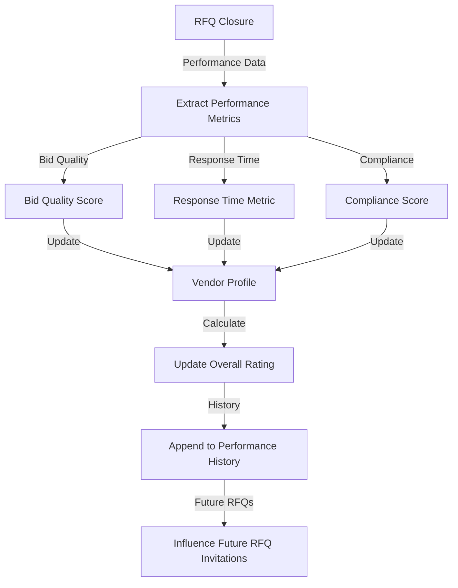

---

## 6. Notification Workflows

### 6.1 Email Notification Flow

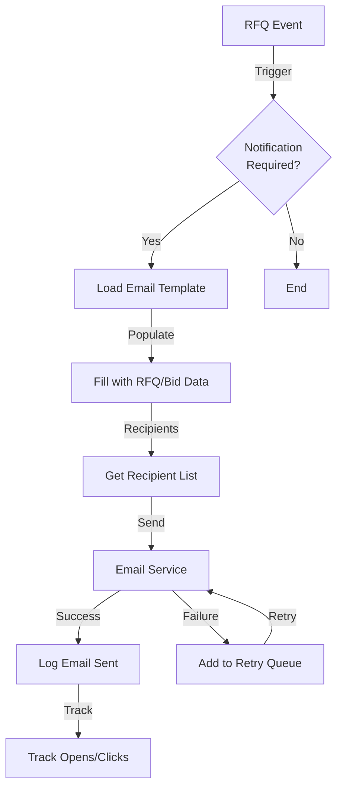

### 6.2 Automatic Reminder Flow

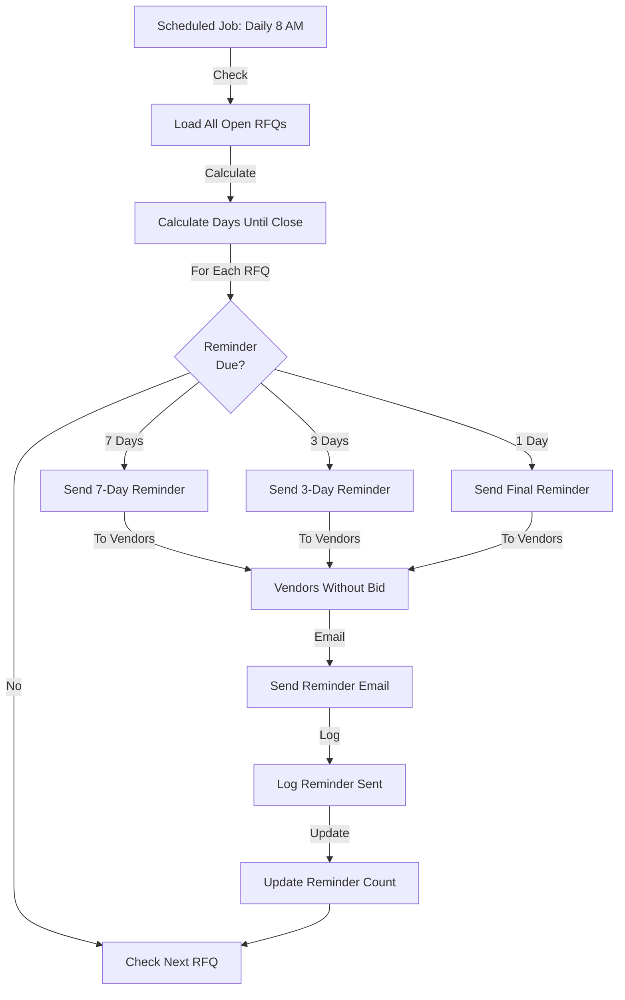

---

## Document History

| Version | Date | Author | Changes |
|---------|------|--------|---------|
| 1.0 | 2024-01-15 | System | Initial flow diagrams document |

---

**End of Flow Diagrams Document**
