# Vendor Directory - Flow Diagrams (FD)

## Document Information
- **Document Type**: Flow Diagrams Document
- **Module**: Vendor Management > Vendor Directory
- **Version**: 1.0
- **Last Updated**: 2024-01-15
- **Document Status**: Draft

---

## 1. Introduction

This document provides visual representations of all workflows and processes in the Vendor Directory module using Mermaid diagrams. These diagrams complement the use cases and technical specifications by illustrating the flow of operations, decision points, and system interactions.

---

## 2. System Architecture Diagram

### 2.1 High-Level Architecture

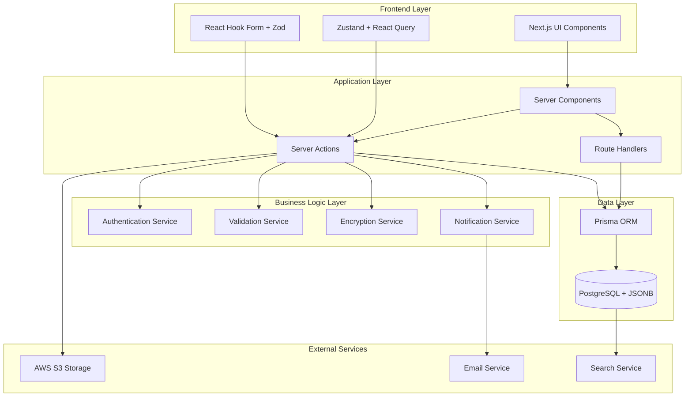

---

## 3. Data Flow Diagrams

### 3.1 Vendor Data Flow

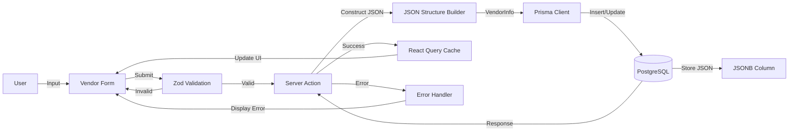

### 3.2 Document Upload Flow

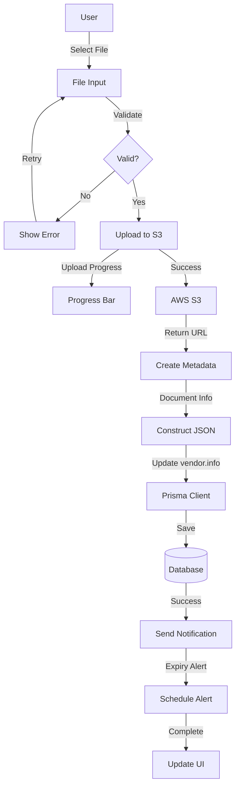

---

## 4. Core Workflows

### 4.1 Vendor Creation Workflow

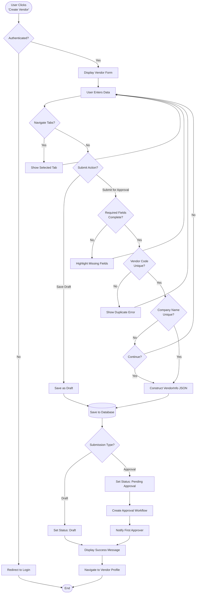

### 4.2 Vendor Approval Workflow

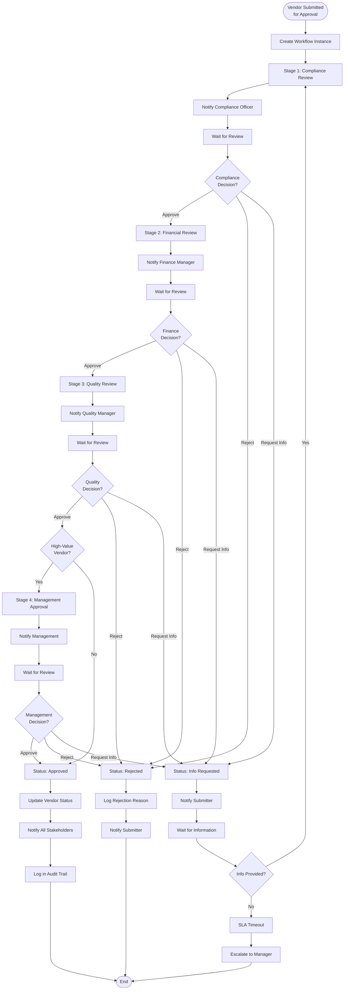

### 4.3 Vendor Edit Workflow

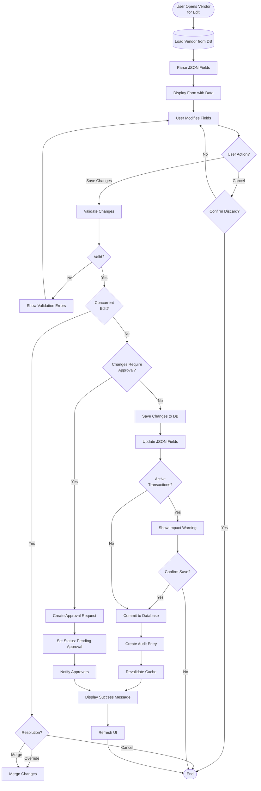

### 4.4 Document Upload Workflow

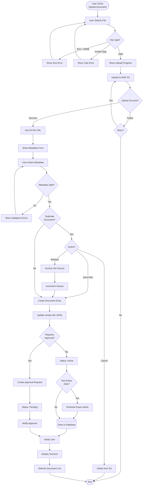

---

## 5. Search and Filter Workflows

### 5.1 Vendor Search Workflow

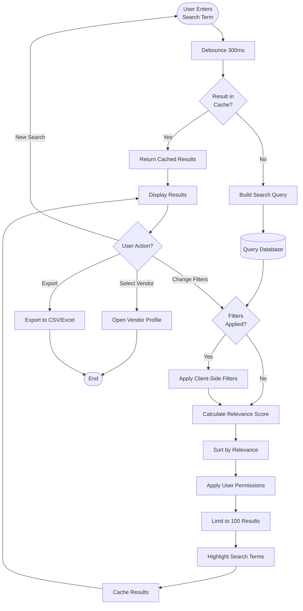

### 5.2 Advanced Filter Workflow

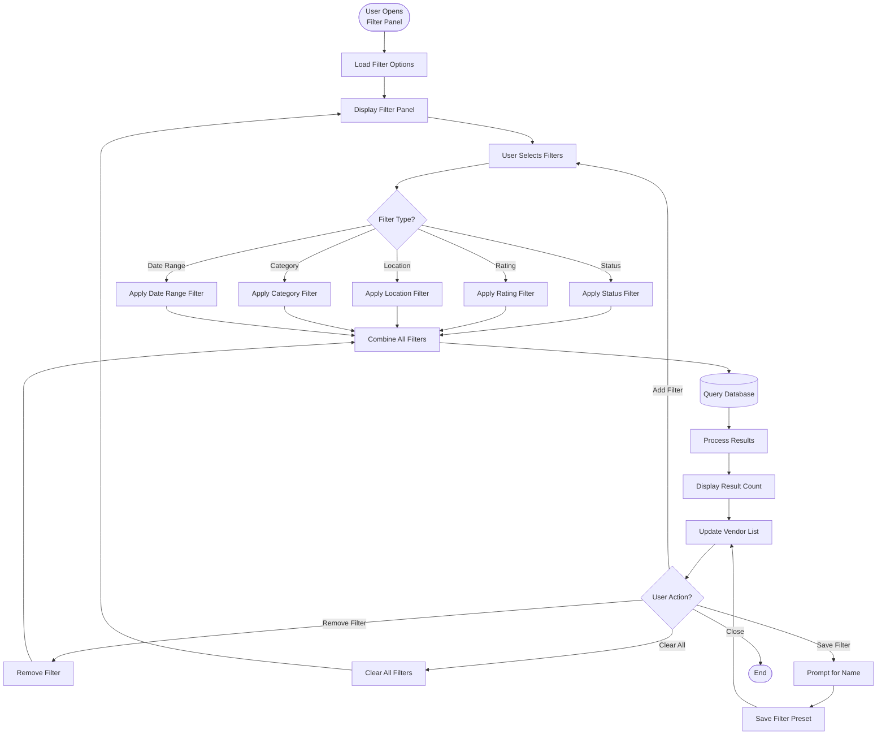

---

## 6. Performance Tracking Workflows

### 6.1 Automated Performance Calculation

```mermaid
flowchart TD
    Start([Monthly Cron Job<br/>Triggers]) --> SelectVendors[Select Eligible Vendors]
    SelectVendors --> CheckEligibility{Min 5<br/>Transactions?}

    CheckEligibility -->|No| Skip[Skip Vendor]
    CheckEligibility -->|Yes| FetchData[Fetch Transaction Data]

    FetchData --> GatherPOs[Gather Purchase Orders]
    GatherPOs --> GatherGRNs[Gather GRN Data]
    GatherGRNs --> GatherInvoices[Gather Invoice Data]
    GatherInvoices --> GatherIssues[Gather Issue Tickets]

    GatherIssues --> CalcQuality[Calculate Quality Score]
    CalcQuality --> QualityFormula["Quality = 100 -<br/>(defect_rate × 40) -<br/>(reject_rate × 30) -<br/>(complaint_impact × 30)"]

    QualityFormula --> CalcDelivery[Calculate Delivery Score]
    CalcDelivery --> DeliveryFormula["Delivery =<br/>(on_time / total) × 100"]

    DeliveryFormula --> CalcService[Calculate Service Score]
    CalcService --> ServiceFormula["Service = 100 -<br/>(response_delay × 2) -<br/>(unresolved × 10)"]

    ServiceFormula --> CalcPricing[Calculate Pricing Score]
    CalcPricing --> PricingFormula["Pricing = 100 -<br/>(price_variance × 2)"]

    PricingFormula --> ApplyWeights[Apply Weights]
    ApplyWeights --> OverallFormula["Overall =<br/>Quality × 0.35 +<br/>Delivery × 0.30 +<br/>Service × 0.20 +<br/>Pricing × 0.15"]

    OverallFormula --> Compare{Rating Change<br/>>10 points?}
    Compare -->|Yes| FlagChange[Flag Significant Change]
    Compare -->|No| SaveRating

    FlagChange --> SendAlert[Send Alert to Manager]
    SendAlert --> SaveRating[Save Rating to JSON]

    SaveRating --> UpdateHistory[Update Performance History]
    UpdateHistory --> CheckThreshold{Rating < 60?}

    CheckThreshold -->|Yes| TriggerPIP[Trigger Performance<br/>Improvement Plan]
    CheckThreshold -->|No| CheckHigh{Rating ≥ 90<br/>for 6 months?}

    TriggerPIP --> NotifyManager[Notify Vendor Manager]
    CheckHigh -->|Yes| SuggestPreferred[Suggest Preferred Status]
    CheckHigh -->|No| Complete

    SuggestPreferred --> NotifyManager
    NotifyManager --> Complete[Mark Complete]
    Complete --> NextVendor{More Vendors?}

    NextVendor -->|Yes| SelectVendors
    NextVendor -->|No| GenerateReport[Generate Monthly Report]
    GenerateReport --> End([End])

    Skip --> NextVendor
```

### 6.2 Manual Performance Review

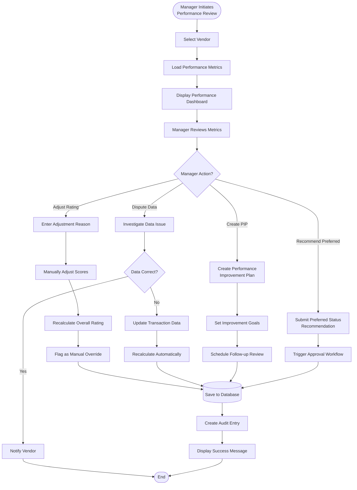

---

## 7. Status Change Workflows

### 7.1 Block Vendor Workflow

```mermaid
flowchart TD
    Start([Manager Initiates<br/>Block Vendor]) --> CheckAuth{Has Permission?}
    CheckAuth -->|No| PermissionError[Show Permission Error]
    PermissionError --> End([End])

    CheckAuth -->|Yes| CheckImpact[Check Impact]
    CheckImpact --> CountPOs[Count Active POs]
    CountPOs --> CountInvoices[Count Pending Invoices]
    CountInvoices --> CountBalance[Check Outstanding Balance]

    CountBalance --> DisplaySummary[Display Impact Summary]
    DisplaySummary --> CheckType{Vendor Type?}

    CheckType -->|Strategic| StrategicWarning[Show Strategic Vendor Warning]
    StrategicWarning --> RequireExecutive[Require Executive Approval]
    CheckType -->|Sole Source| SoleSourceWarning[Show Sole Source Warning]
    SoleSourceWarning --> RequireExecutive
    CheckType -->|Regular| EnterReason

    RequireExecutive --> EnterReason[Enter Block Reason]
    EnterReason --> ReasonType{Reason Type?}

    ReasonType -->|Quality| QualityDetails[Enter Quality Issue Details]
    ReasonType -->|Delivery| DeliveryDetails[Enter Delivery Failure Details]
    ReasonType -->|Compliance| ComplianceDetails[Enter Compliance Issue Details]
    ReasonType -->|Financial| FinancialDetails[Enter Financial Concern Details]
    ReasonType -->|Other| OtherDetails[Enter Other Reason]

    QualityDetails --> EnterNotes
    DeliveryDetails --> EnterNotes
    ComplianceDetails --> EnterNotes
    FinancialDetails --> EnterNotes
    OtherDetails --> EnterNotes[Enter Detailed Notes]

    EnterNotes --> SetDuration{Block Type?}
    SetDuration -->|Temporary| SetDays[Set Number of Days]
    SetDuration -->|Pending Review| SetReview[Set Review Date]
    SetDuration -->|Indefinite| RequireApproval

    SetDays --> NotifyVendor{Notify Vendor?}
    SetReview --> NotifyVendor

    NotifyVendor -->|Yes| ComposeNotification[Compose Notification]
    ComposeNotification --> RequireApproval
    NotifyVendor -->|No| RequireApproval{Requires<br/>Approval?}

    RequireApproval -->|Yes| SubmitApproval[Submit for Approval]
    SubmitApproval --> WaitApproval[Wait for Approval]
    WaitApproval --> ApprovalDecision{Approved?}
    ApprovalDecision -->|No| NotifyRejection[Notify Manager]
    NotifyRejection --> End
    ApprovalDecision -->|Yes| ApplyBlock

    RequireApproval -->|No| ApplyBlock[Apply Block Status]
    ApplyBlock --> UpdateJSON[Update vendor.info]
    UpdateJSON --> SetEffectiveDate[Set Effective Date]
    SetEffectiveDate --> PreventNewPOs[Prevent New PO Creation]
    PreventNewPOs --> AllowExisting[Allow Existing PO Processing]

    AllowExisting --> SendNotifications[Send Notifications]
    SendNotifications --> NotifyProcurement[Notify Procurement Team]
    NotifyProcurement --> NotifyFinance[Notify Finance Team]
    NotifyFinance --> NotifyVendorEmail{Vendor<br/>Notification?}

    NotifyVendorEmail -->|Yes| SendVendorEmail[Send Email to Vendor]
    SendVendorEmail --> LogAction
    NotifyVendorEmail -->|No| LogAction[Log in Audit Trail]

    LogAction --> CheckTemporary{Temporary<br/>Block?}
    CheckTemporary -->|Yes| ScheduleReview[Schedule Review Reminder]
    ScheduleReview --> DisplaySuccess
    CheckTemporary -->|No| DisplaySuccess[Display Success Message]

    DisplaySuccess --> UpdateBadge[Add BLOCKED Badge]
    UpdateBadge --> RefreshUI[Refresh Vendor Profile]
    RefreshUI --> End
```

### 7.2 Unblock/Reactivate Vendor

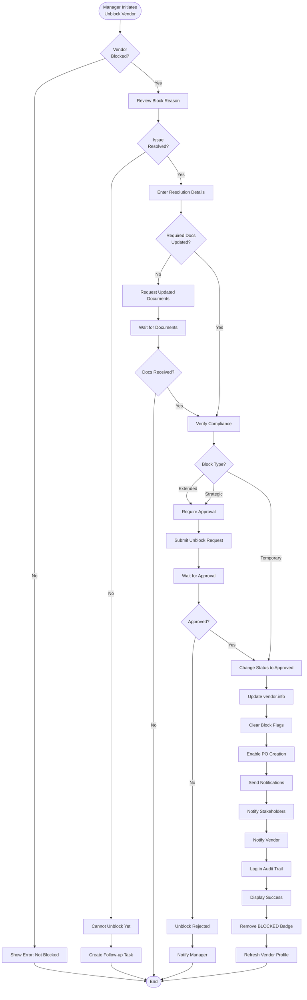

---

## 8. Contact Management Workflows

### 8.1 Add Contact Workflow

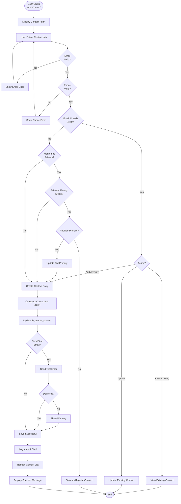

---

## 9. Integration Workflows

### 9.1 Vendor Selection in Purchase Order

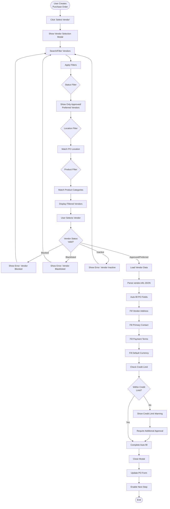

### 9.2 Performance Data Update from GRN

```mermaid
flowchart TD
    Start([GRN Created/<br/>Updated]) --> ExtractData[Extract GRN Data]
    ExtractData --> GetVendor[Get Vendor ID]
    GetVendor --> LoadVendor[Load Vendor Record]

    LoadVendor --> ParseJSON[Parse vendor.info]
    ParseJSON --> GetPerformance[Get Performance Object]

    GetPerformance --> UpdateQuality[Update Quality Metrics]
    UpdateQuality --> DefectRate[Calculate Defect Rate]
    DefectRate --> RejectRate[Calculate Reject Rate]
    RejectRate --> ComplaintImpact[Calculate Complaint Impact]

    ComplaintImpact --> UpdateDelivery[Update Delivery Metrics]
    UpdateDelivery --> OnTimeStatus{Delivered<br/>On Time?}
    OnTimeStatus -->|Yes| IncrementOnTime[Increment On-Time Count]
    OnTimeStatus -->|No| IncrementLate[Increment Late Count]

    IncrementOnTime --> CalcDeliveryRate
    IncrementLate --> CalcDeliveryRate[Calculate Delivery Rate]
    CalcDeliveryRate --> UpdateQuantity[Update Quantity Accuracy]

    UpdateQuantity --> CheckTransactions{Transaction<br/>Count ≥ 5?}
    CheckTransactions -->|No| SaveMetrics[Save Updated Metrics]
    CheckTransactions -->|Yes| RecalcRating[Recalculate Overall Rating]

    RecalcRating --> ApplyWeights[Apply Weighted Formula]
    ApplyWeights --> CompareOld{Significant<br/>Change?}
    CompareOld -->|Yes| TriggerAlert[Trigger Rating Alert]
    TriggerAlert --> SaveMetrics
    CompareOld -->|No| SaveMetrics

    SaveMetrics --> UpdateJSON[Update vendor.info JSON]
    UpdateJSON --> SaveDB[(Save to Database)]
    SaveDB --> CheckThreshold{Rating Below<br/>Threshold?}

    CheckThreshold -->|Yes| NotifyManager[Notify Vendor Manager]
    NotifyManager --> LogUpdate
    CheckThreshold -->|No| LogUpdate[Log Update in Audit]

    LogUpdate --> End([End])
```

---

## 10. Notification Workflows

### 10.1 Document Expiry Alert Workflow

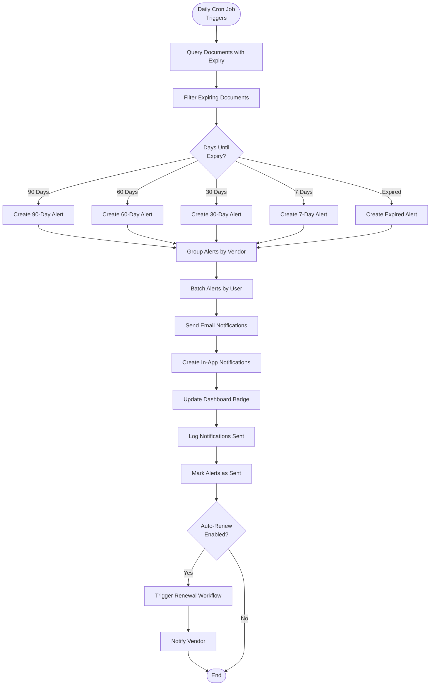

### 10.2 Approval Notification Workflow

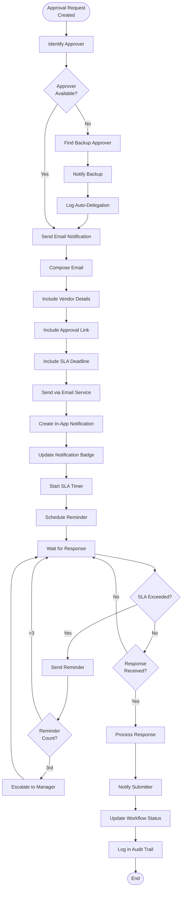

---

## Document History

| Version | Date | Author | Changes |
|---------|------|--------|---------|
| 1.0 | 2024-01-15 | System | Initial creation |

---

## Related Documents
- BR-vendor-directory.md - Business Requirements
- UC-vendor-directory.md - Use Cases
- TS-vendor-directory.md - Technical Specification
- data-structure-gaps.md - Data Structure Analysis
- VAL-vendor-directory.md - Validations

---

**End of Flow Diagrams Document**
