# Vendor Price Submission Portal - Flow Diagrams (FD)

## Document Information
- **Document Type**: Flow Diagrams Document
- **System**: Vendor Price Submission Portal
- **Module**: Vendor Management > Vendor Portal
- **Version**: 3.0.0
- **Status**: Updated
- **Created**: 2025-01-23
- **Last Updated**: 2025-11-26
- **Author**: Product Team
- **Related Documents**:
  - [Business Requirements](./BR-vendor-portal.md)
  - [Use Cases](./UC-vendor-portal.md)
  - [Technical Specification](./TS-vendor-portal.md)
  - [Data Dictionary](./DD-vendor-portal.md)
  - [Validations](./VAL-vendor-portal.md)

## Document History

| Version | Date | Author | Changes |
|---------|------|--------|---------|
| 1.0 | 2024-01-15 | System | Initial version |
| 2.0 | 2025-01-23 | Product Team | Complete rewrite - token-based price submission only |
| 2.1.0 | 2025-11-26 | System | Removed approval workflow; Updated status to draft - submitted |
| 3.0.0 | 2025-11-26 | System | Complete refactor - removed staff-side flows. This document now focuses ONLY on vendor-facing portal. Mermaid 8.8.2 compatible syntax. |

---

## Scope Clarification

### In Scope (This Document)
- Token-based portal access flow
- Online price submission flow
- Excel upload flow
- Excel template download flow
- Auto-save mechanism
- Submission and confirmation flow

### Out of Scope (See Related Modules)
- **Campaign Creation Flows** - See [requests-for-pricing](../requests-for-pricing/) module
- **Template Creation Flows** - See [pricelist-templates](../pricelist-templates/) module
- **Vendor Invitation Flows** - See [requests-for-pricing](../requests-for-pricing/) module
- **Pricelist Viewing Flows** - See [price-lists](../price-lists/) module

---

## Table of Contents
1. [Introduction](#1-introduction)
2. [Vendor Portal Architecture](#2-vendor-portal-architecture)
3. [Core Vendor Workflows](#3-core-vendor-workflows)
4. [Supporting Flows](#4-supporting-flows)
5. [System Automation](#5-system-automation)

---

## 1. Introduction

### 1.1 Purpose
This document provides visual representations of vendor-facing workflows in the Vendor Price Submission Portal using Mermaid diagrams compatible with version 8.8.2.

### 1.2 Scope
This document covers vendor-facing workflows ONLY:
- Token-based portal access
- Price submission via three methods
- Draft management with auto-save
- Submission confirmation

**Note**: There is no approval workflow - pricelists go from draft to submitted and become active immediately.

### 1.3 Diagram Conventions
- **Rectangles**: Process steps
- **Diamonds**: Decision points
- **Rounded rectangles**: Start/End points
- **Green nodes**: Success paths
- **Red nodes**: Error paths
- **Yellow nodes**: Warning states

---

## 2. Vendor Portal Architecture

### 2.1 Portal Component Overview

---

## 3. Core Vendor Workflows

### 3.1 Token-Based Portal Access

**UC-VPP-006: Access Vendor Portal via Token**

### 3.2 Online Price Submission

**UC-VPP-007: Submit Prices Online**

### 3.3 Excel Upload Submission

**UC-VPP-008: Upload Excel Pricelist**

### 3.4 Excel Template Download

**UC-VPP-009: Download Excel Template**

---

## 4. Supporting Flows

### 4.1 Auto-Save Mechanism

### 4.2 Validation Flow

### 4.3 Quality Score Calculation

```mermaid
flowchart TD
    Start([Calculate Quality Score])
    LoadPricelist[Load Pricelist Data]
    CountFields[Count Total Fields]
    CountFilled[Count Filled Fields]
    CalcCompleteness[Completeness = Filled / Total]
    WeightCompleteness[Apply 40 percent Weight]
    CheckValidation[Check for Validation Errors]
    CheckPriceReasonable[Check Price Reasonableness]
    CalcAccuracy[Accuracy Score]
    WeightAccuracy[Apply 30 percent Weight]
    CountMOQTiers[Count MOQ Tiers Present]
    CountFOC[Count FOC Quantities]
    CountNotes[Count Notes Added]
    CalcDetail[Detail Score]
    WeightDetail[Apply 20 percent Weight]
    GetDeadline[Get Campaign Deadline]
    GetSubmitDate[Get Submission Date]
    CalcDaysEarly[Calculate Days Early]
    CalcTimeliness[Timeliness Score]
    WeightTimeliness[Apply 10 percent Weight]
    SumScores[Sum Weighted Scores]
    NormalizeScore[Normalize to 0-100]
    SaveScore[Save Quality Score]
    ReturnScore([Return Quality Score])

    Start --> LoadPricelist
    LoadPricelist --> CountFields
    CountFields --> CountFilled
    CountFilled --> CalcCompleteness
    CalcCompleteness --> WeightCompleteness
    WeightCompleteness --> CheckValidation
    CheckValidation --> CheckPriceReasonable
    CheckPriceReasonable --> CalcAccuracy
    CalcAccuracy --> WeightAccuracy
    WeightAccuracy --> CountMOQTiers
    CountMOQTiers --> CountFOC
    CountFOC --> CountNotes
    CountNotes --> CalcDetail
    CalcDetail --> WeightDetail
    WeightDetail --> GetDeadline
    GetDeadline --> GetSubmitDate
    GetSubmitDate --> CalcDaysEarly
    CalcDaysEarly --> CalcTimeliness
    CalcTimeliness --> WeightTimeliness
    WeightTimeliness --> SumScores
    SumScores --> NormalizeScore
    NormalizeScore --> SaveScore
    SaveScore --> ReturnScore

    style Start fill:#e3f2fd
    style ReturnScore fill:#c8e6c9
```

---

## 5. System Automation

### 5.1 Token Expiration Checker

### 5.2 Submission Confirmation Email Flow

---

## Appendices

### Appendix A: Related Module Documentation

| Module | Documentation Path | Related Flows |
|--------|-------------------|---------------|
| Requests for Pricing | `../requests-for-pricing/` | Campaign creation, vendor invitation flows |
| Pricelist Templates | `../pricelist-templates/` | Template creation flows |
| Price Lists | `../price-lists/` | Pricelist viewing flows |
| Vendor Directory | `../vendor-directory/` | Vendor profile flows |

### Appendix B: Diagram Legend

**Colors**:
- Green: Success paths, completed states
- Red: Error paths, failure states
- Blue: Normal processes, start points
- Yellow: Warnings, pending actions, drafts

**Shapes**:
- Rectangle: Process step
- Diamond: Decision point
- Rounded Rectangle: Start/End point
- Cylinder: Database operation

### Appendix C: Workflow Summary

| ID | Workflow Name | Primary Actor | Section |
|----|---------------|---------------|---------|
| FD-006 | Access Portal via Token | Vendor | 3.1 |
| FD-007 | Submit Prices Online | Vendor | 3.2 |
| FD-008 | Upload Excel Pricelist | Vendor | 3.3 |
| FD-009 | Download Excel Template | Vendor | 3.4 |
| FD-INT-01 | Auto-Save Mechanism | System | 4.1 |
| FD-INT-02 | Validation Flow | System | 4.2 |
| FD-INT-03 | Quality Score Calculation | System | 4.3 |
| FD-JOB-01 | Token Expiration Checker | System | 5.1 |
| FD-JOB-02 | Submission Confirmation Email | System | 5.2 |

**Note**: Staff-side flows (campaign creation, template creation, vendor invitation, pricelist viewing) are documented in their respective module documentation.

---

**Document End**

**Implementation Notes**:
- This document covers ONLY vendor-facing portal flows
- Staff-side flows are in separate modules
- No approval workflow - pricelists become active immediately upon submission
- All diagrams use Mermaid 8.8.2 compatible syntax
