# Vendor Entry Portal - Flow Diagrams (FD)

## Document Information
- **Document Type**: Flow Diagrams Document
- **Module**: Vendor Management > Vendor Entry Portal
- **Version**: 1.0
- **Last Updated**: 2024-01-15
- **Document Status**: Draft

---

## 1. Introduction

This document provides visual representations of all workflows and processes in the Vendor Entry Portal module using Mermaid diagrams. These diagrams complement the use cases and technical specifications by illustrating the flow of operations, decision points, and system interactions.

The Vendor Entry Portal enables vendors to self-register, manage their profiles, respond to pricing requests and RFQs, track purchase orders, submit invoices, and monitor their performance through a secure, self-service web application.

---

## 2. System Architecture Diagram

### 2.1 High-Level Architecture


### 2.2 Security Architecture


---

## 3. Data Flow Diagrams

### 3.1 Vendor Registration Data Flow


### 3.2 Authentication & Login Data Flow


### 3.3 Document Upload Data Flow


### 3.4 Performance Metrics Data Flow


---

## 4. Core Workflows

### 4.1 Vendor Registration Workflow (UC-VP-001)

```mermaid
flowchart TD
    Start([Vendor Navigates to Portal]) --> LandingPage[Landing Page]
    LandingPage -->|Click Register| RegistrationStart[Start Registration]

    RegistrationStart --> Step1[Step 1: Company Information]
    Step1 -->|Enter| CompanyName[Legal Company Name]
    CompanyName -->|Enter| TaxID[Tax ID - EIN]
    TaxID -->|Validate Format| TaxIDValid{Valid EIN Format?}

    TaxIDValid -->|No| TaxIDError[Show: Invalid EIN Format XX-XXXXXXX]
    TaxIDError --> TaxID

    TaxIDValid -->|Yes| BusinessType[Select Business Type]
    BusinessType -->|Enter| Addresses[Enter Addresses]
    Addresses -->|Physical| PhysicalAddr
    Addresses -->|Mailing| MailingAddr[Mailing Address]
    Addresses -->|Billing| BillingAddr[Billing Address]
    PhysicalAddr -->|Same As?| SameAsPhysical{Use Same Address?}
    SameAsPhysical -->|Yes| CopyAddress[Copy Physical to Mailing/Billing]
    SameAsPhysical -->|No| EnterSeparate[Enter Separate Addresses]

    CopyAddress --> ValidateStep1
    EnterSeparate --> ValidateStep1[Validate Step 1]
    MailingAddr --> ValidateStep1
    BillingAddr --> ValidateStep1

    ValidateStep1 -->|Valid| SaveProgress1[Auto-save Progress]
    ValidateStep1 -->|Invalid| ShowErrors1[Show Validation Errors]
    ShowErrors1 --> Step1

    SaveProgress1 -->|Navigate| Step2[Step 2: Contact Information]

    Step2 -->|Enter| PrimaryContact[Primary Contact Details]
    PrimaryContact -->|Name, Email, Phone, Title| ValidateContact1{Valid?}
    ValidateContact1 -->|No| ContactError1[Show Contact Errors]
    ContactError1 --> PrimaryContact

    ValidateContact1 -->|Yes| SecondaryContact[Secondary Contact - Optional]
    SecondaryContact -->|Enter or Skip| APContact[Accounts Payable Contact]
    APContact -->|Required| ValidateContact2{Valid?}
    ValidateContact2 -->|No| ContactError2[Show Contact Errors]
    ContactError2 --> APContact

    ValidateContact2 -->|Yes| ValidateStep2[Validate Step 2]
    ValidateStep2 -->|Valid| SaveProgress2[Auto-save Progress]
    ValidateStep2 -->|Invalid| ShowErrors2[Show Validation Errors]
    ShowErrors2 --> Step2

    SaveProgress2 -->|Navigate| Step3[Step 3: Business Details]

    Step3 -->|Select| BusinessCategories[Business Categories]
    BusinessCategories -->|Multi-select| DescribeServices[Describe Products/Services]
    DescribeServices -->|Min 100 chars| ValidateDesc{Valid?}
    ValidateDesc -->|No| DescError[Show: Minimum 100 characters required]
    DescError --> DescribeServices

    ValidateDesc -->|Yes| RevenueRange[Select Annual Revenue Range]
    RevenueRange -->|Select| EmployeeCount[Select Employee Count]
    EmployeeCount -->|Select| Certifications[Select Certifications - Optional]

    Certifications --> BankInfo[Bank Account Information]
    BankInfo -->|Enter| BankName[Bank Name]
    BankName -->|Enter| AccountNumber[Account Number]
    AccountNumber -->|Enter| RoutingNumber[Routing Number - 9 digits]
    RoutingNumber -->|Validate| BankValid{Valid Format?}

    BankValid -->|No| BankError[Show: Invalid Bank Information]
    BankError --> BankInfo

    BankValid -->|Yes| Website[Website URL - Optional]
    Website --> ValidateStep3[Validate Step 3]
    ValidateStep3 -->|Valid| EncryptBankData[Encrypt Bank Account Data]
    ValidateStep3 -->|Invalid| ShowErrors3[Show Validation Errors]
    ShowErrors3 --> Step3

    EncryptBankData -->|AES-256| SaveProgress3[Auto-save Progress]
    SaveProgress3 -->|Navigate| Step4[Step 4: Documents & Terms]

    Step4 -->|Display| RequiredDocsList[Required Documents List]
    RequiredDocsList -->|Business License| UploadDoc1
    RequiredDocsList -->|Tax Certificate| UploadDoc2
    RequiredDocsList -->|Insurance - General| UploadDoc3
    RequiredDocsList -->|Insurance - Workers Comp| UploadDoc4[Upload Documents]

    UploadDoc1 -->|File Select| FileUpload
    UploadDoc2 -->|File Select| FileUpload
    UploadDoc3 -->|File Select| FileUpload
    UploadDoc4 -->|File Select| FileUpload[File Upload Process]

    FileUpload -->|Validate| FileValid{Valid File?}
    FileValid -->|Type Invalid| FileTypeError[Show: Invalid File Type]
    FileTypeError --> FileUpload
    FileValid -->|Too Large| FileSizeError[Show: File > 50MB]
    FileSizeError --> FileUpload

    FileValid -->|OK| VirusScan[Virus Scanning]
    VirusScan -->|Infected| VirusError[Show: File Failed Security Scan]
    VirusError --> FileUpload

    VirusScan -->|Clean| UploadToS3[Upload to S3]
    UploadToS3 -->|Success| FileUploaded[Mark Document Uploaded]
    FileUploaded -->|Check| AllRequiredUploaded{All Required Uploaded?}

    AllRequiredUploaded -->|No| RequiredDocsList
    AllRequiredUploaded -->|Yes| DisplayTerms[Display Terms & Conditions]

    DisplayTerms -->|Scrollable Text| TermsText[Terms, Privacy Policy, Code of Conduct]
    TermsText -->|User Scrolls| EnableAgree[Enable "I Agree" Checkbox]
    EnableAgree -->|User Checks| AgreeChecked{Agreed?}

    AgreeChecked -->|No| CannotSubmit[Cannot Submit]
    CannotSubmit --> DisplayTerms

    AgreeChecked -->|Yes| ConfirmationCheck[Confirm Information Accurate]
    ConfirmationCheck -->|Check| ElectronicSig[Electronic Signature]
    ElectronicSig -->|Enter Name & Title| ValidateSig{Valid Signature?}

    ValidateSig -->|No| SigError[Show: Signature Required]
    SigError --> ElectronicSig

    ValidateSig -->|Yes| FinalValidation[Final Validation All Steps]
    FinalValidation -->|Valid| DuplicateCheck{Duplicate Check}

    DuplicateCheck -->|Duplicate Found| DuplicateWarning[Show Duplicate Warning]
    DuplicateWarning -->|User Action| DuplicateDecision{User Decision?}
    DuplicateDecision -->|Cancel| End([End])
    DuplicateDecision -->|Contact Support| SupportPage[Contact Support]
    SupportPage --> End
    DuplicateDecision -->|Continue Anyway| FlagDuplicate[Flag for Manual Review]
    FlagDuplicate --> SubmitRegistration

    DuplicateCheck -->|Unique| SubmitRegistration[Submit Registration]
    SubmitRegistration -->|Generate ID| RegNumber[Generate REG-YYYY-XXXX]
    RegNumber -->|Create Record| DatabaseInsert[Insert into tb_vendor_registration]

    DatabaseInsert -->|Status| PendingReview[Status: PENDING_REVIEW]
    PendingReview -->|Send Email| VendorConfirmation[Vendor Confirmation Email]
    VendorConfirmation -->|With Reg ID| EmailSent1

    PendingReview -->|Send Email| ProcurementNotification[Procurement Notification]
    ProcurementNotification -->|New Registration Alert| EmailSent2[Emails Sent]

    EmailSent1 -->|Display| SuccessPage[Registration Success Page]
    EmailSent2 -->|Display| SuccessPage
    SuccessPage -->|Show| RegID[Display Registration ID]
    RegID -->|Show| NextSteps[Show Next Steps]
    NextSteps -->|Provide| TrackingLink[Application Status Tracking Link]
    TrackingLink --> End

    FinalValidation -->|Invalid| ValidationFailed[Show All Validation Errors]
    ValidationFailed -->|Navigate to| ErrorStep[Navigate to Step with Errors]
    ErrorStep --> Step1
    ErrorStep --> Step2
    ErrorStep --> Step3
    ErrorStep --> Step4
```

### 4.2 Login and Authentication Workflow (UC-VP-002)


### 4.3 Update Vendor Profile Workflow (UC-VP-003)


### 4.4 Upload Document Workflow (UC-VP-004)

*(Refer to Data Flow Diagram 3.3 for detailed document upload flow)*

### 4.5 View and Submit Pricing Template Workflow (UC-VP-005, UC-VP-006)


### 4.6 Respond to RFQ Workflow (UC-VP-007)

```mermaid
flowchart TD
    Start([User Navigates to RFQs]) --> LoadRFQs[Load Assigned RFQs]
    LoadRFQs -->|Query| RFQDB[(tb_rfq)]
    RFQDB -->|Filter| InvitedRFQs[Filter: Vendor Invited]
    InvitedRFQs -->|Status| FilterOpen[Filter: Status = OPEN]

    FilterOpen -->|Display| RFQList[RFQ List View]
    RFQList -->|Show| OpenRFQs[Open RFQs]
    RFQList -->|Show| SubmittedBids[Submitted Bids]
    RFQList -->|Show| AwardedRFQs[Awarded RFQs]
    RFQList -->|Show| ClosedRFQs[Closed RFQs]

    RFQList -->|Highlight| DeadlineWarning{Bid Close < 7 Days?}
    DeadlineWarning -->|Yes| UrgentBadge[Show Urgent Badge]
    DeadlineWarning -->|No| NormalDisplay

    UrgentBadge --> RFQDisplay
    NormalDisplay --> RFQDisplay[Display RFQ Cards]

    RFQDisplay -->|User Clicks| SelectRFQ[Select RFQ]
    SelectRFQ -->|Load| RFQDetails[Load RFQ Details]
    RFQDetails -->|Display| RFQInfo[RFQ Information]

    RFQInfo -->|Show| RFQNumber[RFQ Number]
    RFQInfo -->|Show| Title[Title & Description]
    RFQInfo -->|Show| Category[Category]
    RFQInfo -->|Show| Timeline[Timeline & Deadlines]
    RFQInfo -->|Show| Requirements[Requirements]
    RFQInfo -->|Show| Items[Line Items with Specifications]
    RFQInfo -->|Show| Terms[Terms & Conditions]
    RFQInfo -->|Show| EvalCriteria[Evaluation Criteria]
    RFQInfo -->|Show| BuyerContact[Buyer Contact]

    RFQInfo -->|Tabs| ClarificationsTab[Clarifications Tab]
    ClarificationsTab -->|Display| QandA[Q&A Thread]
    QandA -->|View| PreviousQuestions[Previous Questions & Answers]
    PreviousQuestions -->|Action| AskQuestion[Ask Question Button]

    AskQuestion -->|Display| QuestionForm[Question Submission Form]
    QuestionForm -->|Enter| QuestionText[Question Text]
    QuestionText -->|Optional| AttachFile[Attach File]
    AttachFile -->|Select| QuestionCategory[Question Category]
    QuestionCategory -->|Submit| PostQuestion[Post Question]

    PostQuestion -->|Insert| ClarificationDB[(tb_rfq_clarification)]
    ClarificationDB -->|Anonymize| HideVendorName[Vendor Identity Hidden]
    HideVendorName -->|Notify| BuyerNotification[Notify Buyer]
    BuyerNotification -->|Email| BuyerEmail
    BuyerEmail -->|Display| QuestionPosted[Show: Question Posted]
    QuestionPosted --> RFQInfo

    RFQInfo -->|Action| SubmitBid[Submit Bid Button]
    SubmitBid -->|Check| BidWindow{Within Bid Window?}

    BidWindow -->|No| BidClosed[Show: Bidding Closed]
    BidClosed --> End([End])

    BidWindow -->|Yes| CheckClarificationDeadline{Clarification Cutoff Passed?}
    CheckClarificationDeadline -->|No| CanAskQuestions[Can Still Ask Questions]
    CheckClarificationDeadline -->|Yes| NoMoreQuestions[No More Questions Allowed]

    CanAskQuestions --> LoadBidForm
    NoMoreQuestions --> LoadBidForm[Load Bid Submission Form]

    LoadBidForm -->|Display| BidForm[Bid Form]
    BidForm -->|Section| ItemPricing[Line Item Pricing]
    ItemPricing -->|For Each Item| EnterBid[Enter Bid Information]

    EnterBid -->|Enter| ItemPrice[Item Price]
    EnterBid -->|Enter| ItemQty[Quantity Offered]
    EnterBid -->|Enter| ItemUOM[Unit of Measure]
    EnterBid -->|Enter| ItemLeadTime[Lead Time]
    EnterBid -->|Enter| ItemNotes[Item Notes]
    EnterBid -->|Option| MarkNoBid[Mark as "No Bid"]

    ItemPrice -->|Validate| PriceValid{Price Valid?}
    PriceValid -->|No| PriceError[Show Price Error]
    PriceError --> ItemPrice
    PriceValid -->|Yes| AutoCalc[Auto-calculate Line Total]
    AutoCalc --> AutoSaveBid[Auto-save Draft]

    BidForm -->|Section| BidDetails[Bid Details]
    BidDetails -->|Enter| BidValidityPeriod[Bid Validity Period - Days]
    BidDetails -->|Enter| PaymentTerms[Payment Terms Offered]
    BidDetails -->|Enter| DeliveryTimeline[Delivery Timeline]
    BidDetails -->|Enter| WarrantyTerms[Warranty Terms]
    BidDetails -->|Enter| SpecialConditions[Special Conditions/Assumptions]

    BidForm -->|Section| Attachments[Supporting Documents]
    Attachments -->|Upload| TechnicalSpecs[Technical Specifications]
    Attachments -->|Upload| ProductBrochures[Product Brochures]
    Attachments -->|Upload| Certifications[Certifications]
    Attachments -->|Upload| Samples[Sample Information]

    TechnicalSpecs -->|Validate| FileCheck{Valid File?}
    FileCheck -->|No| FileError[Show File Error]
    FileError --> Attachments
    FileCheck -->|Yes| UploadToS3[Upload to S3]
    UploadToS3 --> AutoSaveBid

    AutoSaveBid -->|Every 2 Min| DraftDB[(Draft Storage)]
    DraftDB -->|Update| BidProgress[Update Progress Indicator]

    BidForm -->|Calculate| TotalBidValue[Calculate Total Bid Value]
    TotalBidValue -->|Sum| AllLineItems[Sum All Line Item Totals]
    AllLineItems -->|Display| BidSummary[Bid Summary Panel]

    BidSummary -->|Show| LineItemCount[Number of Line Items]
    BidSummary -->|Show| TotalValue[Total Bid Value]
    BidSummary -->|Show| Currency[Currency]
    BidSummary -->|Show| AvgLeadTime[Average Lead Time]

    BidForm -->|User Action| BidDecision{User Decision?}
    BidDecision -->|Save Draft| SaveDraft[Save Draft Bid]
    SaveDraft -->|Update| DraftDB
    SaveDraft -->|Display| DraftSaved[Show: Draft Saved]
    DraftSaved --> End

    BidDecision -->|Submit| ValidateBid[Validate Bid Completeness]
    ValidateBid -->|Check| AllRequired{All Required Fields?}

    AllRequired -->|No| HighlightMissing[Highlight Missing Fields]
    HighlightMissing --> BidForm

    AllRequired -->|Yes| PreviewBid[Preview Bid Submission]
    PreviewBid -->|Display| BidReview[Bid Review Page]

    BidReview -->|Show| CompleteItemList[Complete Line Item List]
    BidReview -->|Show| CompleteBidDetails[Complete Bid Details]
    BidReview -->|Show| AttachmentList[List of Attachments]
    BidReview -->|Show| SubmissionTime[Submission Timestamp]

    BidReview -->|Action| FinalBidDecision{Final Decision?}
    FinalBidDecision -->|Edit| BackToBidForm[Back to Bid Form]
    BackToBidForm --> BidForm

    FinalBidDecision -->|Cancel| CancelBid[Cancel Bid]
    CancelBid --> RFQList

    FinalBidDecision -->|Confirm| SubmitBidDB[Submit Bid to Database]
    SubmitBidDB -->|Generate| BidID[Generate Bid ID]
    BidID -->|Insert| BidDB[(tb_rfq_bid)]

    BidDB -->|Status| BidSubmitted[Status: SUBMITTED]
    BidDB -->|Timestamp| SubmissionTimestamp[Record Submission Time]
    BidDB -->|Vendor| VendorID[Record Vendor ID]

    SubmissionTimestamp -->|Update RFQ| UpdateRFQStatus[Update Vendor Bid Status]
    UpdateRFQStatus -->|tb_rfq.invitedVendors| MarkBidSubmitted[bidSubmittedAt: NOW]

    MarkBidSubmitted -->|Notify| BuyerNotification2[Notify Buyer]
    BuyerNotification2 -->|Email| BuyerBidEmail[Email: Bid Submitted]
    BuyerBidEmail -->|Include| BidLink[Link to View Bid]

    BuyerNotification2 -->|Send| VendorConfirmation[Vendor Confirmation Email]
    VendorConfirmation -->|Template| BidConfirmation[Bid Submission Confirmation]
    BidConfirmation -->|Include| BidNumber[Bid Number]
    BidNumber -->|Include| NextSteps[Next Steps Information]

    VendorConfirmation -->|Create| AuditLog[Audit Log Entry]
    AuditLog -->|Action| RFQ_BID_SUBMISSION
    AuditLog -->|tb_vendor_audit_log| AuditDB

    AuditDB -->|Display| SuccessPage[Submission Success Page]
    SuccessPage -->|Show| SuccessMessage[Show Success Message]
    SuccessMessage -->|Show| BidIDDisplay[Bid ID]
    BidIDDisplay -->|Show| EvaluationInfo[Evaluation Timeline Info]
    EvaluationInfo -->|Link| TrackBid[Track Bid Status]
    TrackBid --> End
```

### 4.7 View Purchase Orders Workflow (UC-VP-008)


### 4.8 Submit Invoice Workflow (UC-VP-009)


### 4.9 View Performance Metrics Workflow (UC-VP-010)

*(Refer to Data Flow Diagram 3.4 for detailed performance metrics flow)*

### 4.10 Message Center Workflow (UC-VP-011)


---

## 5. Integration Workflows

### 5.1 Registration to Vendor Creation Workflow

```mermaid
graph TB
    Registration[Vendor Registration Submitted] -->|Status| PendingReview[Status: PENDING_REVIEW]
    PendingReview -->|Notify| ProcurementTeam[Procurement Team Notified]

    ProcurementTeam -->|Access| ERPReviewPage[ERP Review Page]
    ERPReviewPage -->|Display| RegistrationDetails[Full Registration Details]
    RegistrationDetails -->|Display| CompanyInfo[Company Information]
    RegistrationDetails -->|Display| Contacts[Contact Information]
    RegistrationDetails -->|Display| BusinessDetails[Business Details]
    RegistrationDetails -->|Display| Documents[Uploaded Documents]

    Documents -->|Reviewer Opens| ViewDocs[View Each Document]
    ViewDocs -->|Validate| DocValidation{Documents Valid?}
    DocValidation -->|Missing/Invalid| RequestMoreDocs[Request Additional Documents]
    RequestMoreDocs -->|Email Vendor| DocRequest[Document Request Email]
    DocRequest --> VendorUploads[Vendor Uploads More Docs]
    VendorUploads --> Documents

    DocValidation -->|Valid| BackgroundCheck[Conduct Background Checks]
    BackgroundCheck -->|Verify| CreditCheck[Credit Check]
    BackgroundCheck -->|Verify| ReferenceCheck[Reference Verification]
    BackgroundCheck -->|Verify| LicenseVerification[License Verification]

    CreditCheck -->|Results| CheckResults
    ReferenceCheck -->|Results| CheckResults
    LicenseVerification -->|Results| CheckResults[Compile Check Results]

    CheckResults -->|Procurement Decision| ApprovalDecision{Approve?}
    ApprovalDecision -->|Reject| RejectRegistration[Reject Registration]
    RejectRegistration -->|Update Status| StatusRejected[Status: REJECTED]
    StatusRejected -->|Enter Reason| RejectionReason[Enter Rejection Reason]
    RejectionReason -->|Email Vendor| RejectionEmail[Rejection Notification Email]
    RejectionEmail -->|Allow Reapply| ReapplyAfter30Days[Can Reapply After 30 Days]
    ReapplyAfter30Days --> End1([End])

    ApprovalDecision -->|Approve| CreateVendorRecord[Create Vendor Record in tb_vendor]
    CreateVendorRecord -->|Generate| VendorCode[Generate Vendor Code]
    VendorCode -->|Insert| VendorDB[(tb_vendor)]

    VendorDB -->|Decrypt| BankAccountData[Decrypt Bank Account Data]
    BankAccountData -->|Store| EncryptedInVendor[Store Encrypted in Vendor Record]

    EncryptedInVendor -->|Copy Documents| LinkDocuments[Link Registration Documents to Vendor]
    LinkDocuments -->|tb_vendor_document| DocumentsLinked[Documents Linked]

    DocumentsLinked -->|Create| PortalUser[Create Vendor Portal User]
    PortalUser -->|Generate| Credentials[Generate Login Credentials]
    Credentials -->|Temp Password| TempPassword[Generate Temporary Password]
    TempPassword -->|Insert| UserDB[(tb_vendor_portal_user)]

    UserDB -->|Set Flags| PortalUserFlags[Set User Flags]
    PortalUserFlags -->|Flag| MustChangePassword[mustChangePassword = true]
    PortalUserFlags -->|Flag| EmailVerificationRequired[emailVerified = false]

    EmailVerificationRequired -->|Update Registration| RegistrationApproved[Status: APPROVED]
    RegistrationApproved -->|Link Vendor| LinkVendorID[Link vendorId to Registration]

    LinkVendorID -->|Send Emails| ApprovalNotifications[Send Approval Notifications]
    ApprovalNotifications -->|Vendor Email| WelcomeEmail[Welcome Email with Credentials]
    WelcomeEmail -->|Include| PortalURL[Portal Login URL]
    WelcomeEmail -->|Include| TempPasswordEmail[Temporary Password]
    WelcomeEmail -->|Include| OnboardingInstructions[Onboarding Instructions]

    ApprovalNotifications -->|Internal Email| ProcurementNotif[Procurement Notification]
    ProcurementNotif -->|Confirm| VendorCodeEmail[Vendor Code Assigned]

    OnboardingInstructions -->|Create| AuditLog[Audit Log Entry]
    AuditLog -->|Action| VENDOR_REGISTRATION_APPROVED
    AuditLog -->|tb_vendor_audit_log| AuditDB

    AuditDB -->|Vendor First Login| OnboardingFlow[Vendor Starts Onboarding Flow]
    OnboardingFlow -->|Complete Checklist| OnboardingTasks[Complete Onboarding Tasks]
    OnboardingTasks -->|Full Portal Access| PortalActive[Portal Fully Active]
    PortalActive --> End2([End])
```



### 5.2 Price Template Submission to Price List Creation Workflow


### 5.3 RFQ Award to Contract Price List Workflow


---

## 6. Scheduled Jobs & Automation

### 6.1 Document Expiry Reminder Job


### 6.2 Session Cleanup Job

```mermaid
graph TB
    CronJob[Hourly Cron Job] -->|Execute| QuerySessions[Query Expired Sessions]
    QuerySessions -->|tb_vendor_portal_session| FilterExpired[Filter: expiresAt < NOW()]

    FilterExpired -->|For Each| CheckActivity{Last Activity > 30 min?}
    CheckActivity -->|Yes| DeleteSession[Delete Session Record]
    CheckActivity -->|No| ExtendSession[Extend Session if Active]

    DeleteSession -->|Remove| SessionDB[(Session Database)]
    SessionDB -->|Log| AuditLog[Audit Log: SESSION_EXPIRED]
    AuditLog --> End1([Continue Loop])

    ExtendSession -->|Update| NewExpiry[expiresAt: NOW() + 30 minutes]
    NewExpiry --> End1
```

---

## Document History

| Version | Date       | Author | Changes                          |
|---------|------------|--------|----------------------------------|
| 1.0     | 2024-01-15 | System | Initial flow diagrams document   |

---

## Related Documents

- Vendor Entry Portal - Business Requirements (BR-vendor-portal.md)
- Vendor Entry Portal - Use Cases (UC-vendor-portal.md)
- Vendor Entry Portal - Technical Specification (TS-vendor-portal.md)
- Vendor Entry Portal - Validations (VAL-vendor-portal.md)
- Vendor Management - Module Overview (VENDOR-MANAGEMENT-OVERVIEW.md)

---

**End of Flow Diagrams Document**
