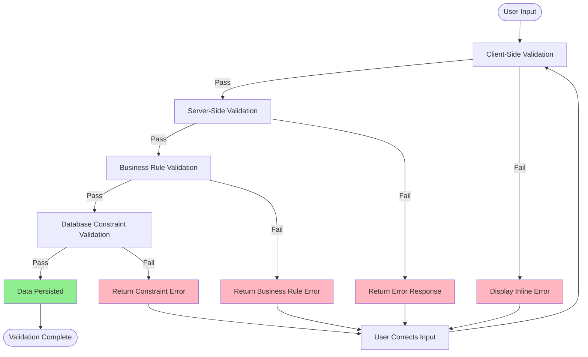

# Vendor Price Submission Portal - Validation Specification (VAL)

## Document Information
- **Document Type**: Validation Specification
- **System**: Vendor Price Submission Portal
- **Module**: Vendor Management
- **Version**: 2.1.0
- **Status**: Updated
- **Created**: 2025-01-23
- **Last Updated**: 2025-11-26
- **Author**: Product Team
- **Related Documents**:
  - [Business Requirements](./BR-vendor-portal.md)
  - [Use Cases](./UC-vendor-portal.md)
  - [Technical Specification](./TS-vendor-portal.md)
  - [Data Dictionary](./DD-vendor-portal.md)
  - [Flow Diagrams](./FD-vendor-portal.md)

## Document History

| Version | Date | Author | Changes |
|---------|------|--------|---------|
| 1.0 | 2024-01-15 | System | Initial version (INCORRECT - full vendor portal) |
| 2.0 | 2025-01-23 | Product Team | Complete rewrite based on actual implementation - token-based price submission only |
| 2.1.0 | 2025-11-26 | System | Removed approval workflow references; Updated status to draft → submitted; Aligned with BR v2.1.0 |

---

## Table of Contents

1. [Introduction](#1-introduction)
2. [Token Authentication Validation](#2-token-authentication-validation)
3. [Field-Level Validations](#3-field-level-validations)
4. [Business Rule Validations](#4-business-rule-validations)
5. [Quality Score Calculation](#5-quality-score-calculation)
6. [Excel Template Validation](#6-excel-template-validation)
7. [Excel Upload Validation](#7-excel-upload-validation)
8. [Draft Validation](#8-draft-validation)
9. [Final Submission Validation](#9-final-submission-validation)
10. [Security Validations](#10-security-validations)
11. [Complete Zod Schemas](#11-complete-zod-schemas)
12. [Error Messages Reference](#12-error-messages-reference)
13. [Validation Testing Matrix](#13-validation-testing-matrix)
14. [Performance Validation](#14-performance-validation)
15. [Validation Best Practices](#15-validation-best-practices)

---

## 1. Introduction

### 1.1 Purpose

This document defines all validation rules, error messages, and data integrity constraints for the **Vendor Price Submission Portal** module. It includes token authentication validation, field-level validations, business rule validations, quality scoring algorithms, Excel template/upload validations, and security validation specifications.

### 1.2 Scope

This document covers validations for:

**Staff-side**:
- Campaign creation and configuration validation
- Vendor invitation validation
- Pricelist viewing validation

**Note**: There is no approval workflow - pricelists go from draft → submitted (active) directly.

**Vendor-side**:
- Token-based authentication validation
- Price submission validation (online entry, Excel upload, Excel template download)
- Draft pricelist validation
- Final submission validation
- Quality score calculation validation

This document does **NOT** cover:
- Vendor registration or onboarding validation
- Vendor profile management validation
- RFQ bidding or competitive quoting validation
- Purchase order or invoice management validation
- General vendor relationship management validation

### 1.3 Validation Principles

1. **Defense in Depth**: Multiple validation layers (client, server, database)
2. **Fail Fast**: Detect and report errors immediately
3. **User-Friendly Errors**: Clear, actionable error messages for vendors
4. **Security First**: All user input is untrusted and validated
5. **Data Integrity**: Ensure consistency and accuracy across all operations
6. **Performance**: Validations must be fast (<100ms for field-level validations)

### 1.4 Validation Strategy



---

## 2. Token Authentication Validation

### 2.1 Token Format Validation

#### Token UUID Format
**Field**: `token` (URL parameter)

| Rule | Validation | Error Message |
|------|------------|---------------|
| Required | Must be present in URL | "Invalid or missing access token" |
| Format | Must be valid UUID v4 | "Invalid token format" |
| Length | Exactly 36 characters (with hyphens) | "Invalid token length" |
| Pattern | `^[0-9a-f]{8}-[0-9a-f]{4}-4[0-9a-f]{3}-[89ab][0-9a-f]{3}-[0-9a-f]{12}$` | "Malformed token format" |

**Zod Schema**:
```typescript
token: z.string()
  .uuid('Invalid token format')
  .regex(
    /^[0-9a-f]{8}-[0-9a-f]{4}-4[0-9a-f]{3}-[89ab][0-9a-f]{3}-[0-9a-f]{12}$/i,
    'Malformed UUID v4 token'
  )
```

**Validation Logic**:
```typescript
async function validateTokenFormat(token: string): Promise<ValidationResult> {
  // Check if token is present
  if (!token || token.trim() === '') {
    return {
      valid: false,
      code: 'TOKEN_001',
      message: 'Invalid or missing access token',
      severity: 'error',
    };
  }

  // Check UUID v4 format
  const uuidV4Regex = /^[0-9a-f]{8}-[0-9a-f]{4}-4[0-9a-f]{3}-[89ab][0-9a-f]{3}-[0-9a-f]{12}$/i;
  if (!uuidV4Regex.test(token)) {
    return {
      valid: false,
      code: 'TOKEN_002',
      message: 'Invalid token format',
      severity: 'error',
    };
  }

  return { valid: true };
}
```

### 2.2 Token Existence Validation

**Database Check**:
```typescript
async function validateTokenExists(token: string): Promise<ValidationResult> {
  const invitation = await prisma.vendorInvitation.findUnique({
    where: { token },
    include: {
      campaign: true,
      vendor: true,
    },
  });

  if (!invitation) {
    // Log security event - potential token guessing attack
    await createAuditLog({
      action: 'TOKEN_NOT_FOUND',
      actionCategory: 'SECURITY',
      status: 'FAILURE',
      severity: 'WARNING',
      details: { token, ipAddress: req.ip },
    });

    return {
      valid: false,
      code: 'TOKEN_003',
      message: 'Invalid or expired invitation link',
      severity: 'error',
    };
  }

  return { valid: true, data: invitation };
}
```

### 2.3 Token Expiration Validation

**Expiry Check**:
```typescript
async function validateTokenNotExpired(invitation: VendorInvitation): Promise<ValidationResult> {
  const now = new Date();

  if (invitation.expiresAt < now) {
    return {
      valid: false,
      code: 'TOKEN_004',
      message: 'This invitation has expired. Please contact procurement to request a new invitation.',
      severity: 'error',
      details: {
        expiryDate: invitation.expiresAt,
        daysExpired: Math.floor((now.getTime() - invitation.expiresAt.getTime()) / (24 * 60 * 60 * 1000)),
      },
    };
  }

  // Warning if expires within 24 hours
  const twentyFourHoursFromNow = new Date(now.getTime() + 24 * 60 * 60 * 1000);
  if (invitation.expiresAt < twentyFourHoursFromNow) {
    return {
      valid: true,
      code: 'TOKEN_005',
      message: `This invitation expires in ${Math.ceil((invitation.expiresAt.getTime() - now.getTime()) / (60 * 60 * 1000))} hours. Please submit your pricelist soon.`,
      severity: 'warning',
    };
  }

  return { valid: true };
}
```

### 2.4 Token Status Validation

**Status Check**:
```typescript
async function validateTokenStatus(invitation: VendorInvitation): Promise<ValidationResult> {
  // Valid statuses for portal access: 'sent', 'delivered', 'accessed'
  const validStatuses = ['sent', 'delivered', 'accessed'];

  if (!validStatuses.includes(invitation.status)) {
    let message = 'This invitation is no longer valid.';

    if (invitation.status === 'submitted') {
      message = 'You have already submitted your pricelist for this campaign. Thank you!';
    } else if (invitation.status === 'expired') {
      message = 'This invitation has expired. Please contact procurement for assistance.';
    } else if (invitation.status === 'cancelled') {
      message = 'This invitation has been cancelled by the procurement team.';
    }

    return {
      valid: false,
      code: 'TOKEN_006',
      message,
      severity: 'error',
      details: { status: invitation.status },
    };
  }

  return { valid: true };
}
```

### 2.5 Campaign Active Validation

**Campaign Status Check**:
```typescript
async function validateCampaignActive(campaign: PriceCollectionCampaign): Promise<ValidationResult> {
  if (campaign.status !== 'active') {
    let message = 'This price collection campaign is not currently active.';

    if (campaign.status === 'draft') {
      message = 'This campaign has not been launched yet.';
    } else if (campaign.status === 'completed') {
      message = 'This campaign has been completed and is no longer accepting submissions.';
    } else if (campaign.status === 'cancelled') {
      message = 'This campaign has been cancelled.';
    }

    return {
      valid: false,
      code: 'CAMPAIGN_001',
      message,
      severity: 'error',
      details: { campaignStatus: campaign.status },
    };
  }

  // Check campaign dates
  const now = new Date();

  if (campaign.scheduledStart > now) {
    return {
      valid: false,
      code: 'CAMPAIGN_002',
      message: `This campaign has not started yet. It will begin on ${campaign.scheduledStart.toLocaleDateString()}.`,
      severity: 'error',
      details: { scheduledStart: campaign.scheduledStart },
    };
  }

  if (campaign.scheduledEnd < now) {
    return {
      valid: false,
      code: 'CAMPAIGN_003',
      message: `This campaign ended on ${campaign.scheduledEnd.toLocaleDateString()} and is no longer accepting submissions.`,
      severity: 'error',
      details: { scheduledEnd: campaign.scheduledEnd },
    };
  }

  return { valid: true };
}
```

### 2.6 Complete Token Validation

**Complete Validation Flow**:
```typescript
async function validateTokenAccess(token: string, req: Request): Promise<ValidationResult> {
  // Step 1: Format validation
  const formatCheck = await validateTokenFormat(token);
  if (!formatCheck.valid) return formatCheck;

  // Step 2: Existence validation
  const existsCheck = await validateTokenExists(token);
  if (!existsCheck.valid) return existsCheck;

  const invitation = existsCheck.data!;

  // Step 3: Expiration validation
  const expiryCheck = await validateTokenNotExpired(invitation);
  if (!expiryCheck.valid) return expiryCheck;

  // Step 4: Status validation
  const statusCheck = await validateTokenStatus(invitation);
  if (!statusCheck.valid) return statusCheck;

  // Step 5: Campaign active validation
  const campaignCheck = await validateCampaignActive(invitation.campaign);
  if (!campaignCheck.valid) return campaignCheck;

  // Step 6: Update invitation status on first access
  if (invitation.status === 'sent' || invitation.status === 'delivered') {
    await prisma.vendorInvitation.update({
      where: { id: invitation.id },
      data: {
        status: 'accessed',
        accessedAt: new Date(),
        ipAddress: req.ip,
        userAgent: req.headers['user-agent'],
      },
    });
  }

  // Step 7: Create portal session
  const session = await createPortalSession(invitation, req);

  return {
    valid: true,
    data: {
      invitation,
      campaign: invitation.campaign,
      vendor: invitation.vendor,
      pricelist: invitation.pricelist,
      session,
    },
  };
}
```

---

## 3. Field-Level Validations

### 3.1 Pricelist Header Validations

#### Currency
**Field**: `currency` (pricelist header)

| Rule | Validation | Error Message |
|------|------------|---------------|
| Required | Must not be empty | "Currency is required" |
| Valid | Must be valid ISO 4217 currency code | "Invalid currency code" |
| Allowed | Must be in supported currencies list | "Currency not supported for this campaign" |

**Zod Schema**:
```typescript
currency: z.enum(['USD', 'EUR', 'GBP', 'CAD', 'AUD', 'JPY', 'CNY', 'MXN', 'THB'], {
  errorMap: () => ({ message: 'Invalid currency code' }),
})
```

**Validation Logic**:
```typescript
async function validateCurrency(currency: string, campaignId: string): Promise<ValidationResult> {
  const campaign = await prisma.priceCollectionCampaign.findUnique({
    where: { id: campaignId },
    include: { template: true },
  });

  const supportedCurrencies = campaign.template.supportedCurrencies || ['USD'];

  if (!supportedCurrencies.includes(currency)) {
    return {
      valid: false,
      code: 'CURRENCY_001',
      message: `Currency ${currency} is not supported for this campaign. Supported currencies: ${supportedCurrencies.join(', ')}`,
      severity: 'error',
      details: { supportedCurrencies },
    };
  }

  return { valid: true };
}
```

#### Effective Start Date
**Field**: `effectiveStartDate` (pricelist header)

| Rule | Validation | Error Message |
|------|------------|---------------|
| Required | Must not be empty | "Effective start date is required" |
| Format | Must be valid ISO 8601 date | "Invalid date format" |
| Range | Can be past or future date | None |

**Zod Schema**:
```typescript
effectiveStartDate: z.coerce.date({
  required_error: 'Effective start date is required',
  invalid_type_error: 'Invalid date format',
})
```

#### Effective End Date
**Field**: `effectiveEndDate` (pricelist header)

| Rule | Validation | Error Message |
|------|------------|---------------|
| Optional | Can be null (open-ended pricelist) | None |
| Format | Must be valid ISO 8601 date if provided | "Invalid date format" |
| Range | Must be after or equal to start date | "End date must be on or after start date" |

**Zod Schema**:
```typescript
effectiveEndDate: z.coerce.date({
  invalid_type_error: 'Invalid date format',
})
  .nullable()
  .refine((date, ctx) => {
    if (date === null) return true; // Open-ended pricelist
    const startDate = ctx.parent.effectiveStartDate;
    return date >= startDate;
  }, 'End date must be on or after start date')
```

**Validation Logic**:
```typescript
async function validateEffectiveDates(
  startDate: Date,
  endDate: Date | null
): Promise<ValidationResult> {
  // Null end date = open-ended pricelist (valid)
  if (endDate === null) {
    return { valid: true };
  }

  // End date must be >= start date
  if (endDate < startDate) {
    return {
      valid: false,
      code: 'DATE_001',
      message: 'Effective end date must be on or after the effective start date',
      severity: 'error',
      details: {
        startDate: startDate.toISOString(),
        endDate: endDate.toISOString(),
      },
    };
  }

  return { valid: true };
}
```

#### General Notes
**Field**: `notes` (pricelist header)

| Rule | Validation | Error Message |
|------|------------|---------------|
| Optional | Can be empty | None |
| Length | Max 2000 characters | "Notes must not exceed 2000 characters" |
| XSS Protection | No script tags | "Notes contain invalid content" |

**Zod Schema**:
```typescript
notes: z.string()
  .max(2000, 'Notes must not exceed 2000 characters')
  .refine(
    (text) => !/<script[^>]*>.*?<\/script>/i.test(text),
    'Notes contain invalid content'
  )
  .optional()
```

### 3.2 Product Pricing Validations

#### Product ID
**Field**: `productId` (pricelist item)

| Rule | Validation | Error Message |
|------|------------|---------------|
| Required | Must be present | "Product ID is required" |
| Valid | Must be valid UUID | "Invalid product ID format" |
| Exists | Must exist in template | "Product not found in campaign template" |
| Unique | No duplicate products in pricelist | "Duplicate product in pricelist" |

**Zod Schema**:
```typescript
productId: z.string()
  .uuid('Invalid product ID format')
  .refine(async (productId, ctx) => {
    const templateItem = await prisma.priceListTemplateItem.findFirst({
      where: {
        templateId: ctx.parent.templateId,
        productId: productId,
      },
    });
    return templateItem !== null;
  }, 'Product not found in campaign template')
```

#### Base Unit Price (Simple Pricing)
**Field**: `basePrice` (pricelist item)

| Rule | Validation | Error Message |
|------|------------|---------------|
| Required | Must provide price if no MOQ tiers | "Base unit price is required" |
| Type | Must be positive number | "Unit price must be a positive number" |
| Range | 0.0001 to 999,999,999.9999 | "Unit price must be between 0.0001 and 999,999,999.9999" |
| Precision | Max 4 decimal places | "Unit price must have at most 4 decimal places" |

**Zod Schema**:
```typescript
basePrice: z.number()
  .positive('Unit price must be a positive number')
  .min(0.0001, 'Unit price must be at least 0.0001')
  .max(999999999.9999, 'Unit price must not exceed 999,999,999.9999')
  .refine((val) => {
    const decimalStr = val.toFixed(10);
    const decimalPart = decimalStr.split('.')[1].replace(/0+$/, '');
    return decimalPart.length <= 4;
  }, 'Unit price must have at most 4 decimal places')
  .optional() // Optional if MOQ tiers provided
```

#### Lead Time
**Field**: `leadTime` (pricelist item)

| Rule | Validation | Error Message |
|------|------------|---------------|
| Required | Must provide lead time | "Lead time is required" |
| Type | Must be positive integer | "Lead time must be a positive whole number" |
| Range | 1 to 365 days | "Lead time must be between 1 and 365 days" |

**Zod Schema**:
```typescript
leadTime: z.number()
  .int('Lead time must be a whole number')
  .positive('Lead time must be a positive number')
  .min(1, 'Lead time must be at least 1 day')
  .max(365, 'Lead time must not exceed 365 days')
```

### 3.3 MOQ Tier Pricing Validations

#### MOQ Tier Structure
**Field**: `pricing` (array of MOQ tiers)

| Rule | Validation | Error Message |
|------|------------|---------------|
| Required | Must have at least 1 tier | "At least one pricing tier is required" |
| Max Tiers | Maximum 5 tiers | "Maximum 5 MOQ pricing tiers allowed" |
| Ascending MOQ | MOQ quantities must be in ascending order | "MOQ quantities must be in ascending order" |
| Unique MOQ | No duplicate MOQ quantities | "Duplicate MOQ quantity detected" |

**Zod Schema**:
```typescript
pricing: z.array(
  z.object({
    moq: z.number().int().positive().min(1),
    unit: z.string().min(1).max(50),
    unitPrice: z.number().positive().min(0.0001).max(999999999.9999),
    leadTime: z.number().int().positive().min(1).max(365).optional(),
    focQuantity: z.number().int().min(0).optional(),
    focUnit: z.string().max(50).optional(),
    notes: z.string().max(500).optional(),
  })
)
  .min(1, 'At least one pricing tier is required')
  .max(5, 'Maximum 5 MOQ pricing tiers allowed')
  .refine((tiers) => {
    // Check ascending MOQ order
    for (let i = 1; i < tiers.length; i++) {
      if (tiers[i].moq <= tiers[i - 1].moq) {
        return false;
      }
    }
    return true;
  }, 'MOQ quantities must be in ascending order')
  .refine((tiers) => {
    // Check for duplicate MOQ quantities
    const moqSet = new Set(tiers.map(t => t.moq));
    return moqSet.size === tiers.length;
  }, 'Duplicate MOQ quantity detected')
```

**Validation Logic**:
```typescript
async function validateMOQTiers(tiers: MOQPricing[]): Promise<ValidationResult> {
  // Check minimum 1 tier
  if (tiers.length === 0) {
    return {
      valid: false,
      code: 'MOQ_001',
      message: 'At least one pricing tier is required',
      severity: 'error',
    };
  }

  // Check maximum 5 tiers
  if (tiers.length > 5) {
    return {
      valid: false,
      code: 'MOQ_002',
      message: 'Maximum 5 MOQ pricing tiers allowed',
      severity: 'error',
    };
  }

  // Check ascending MOQ order
  for (let i = 1; i < tiers.length; i++) {
    if (tiers[i].moq <= tiers[i - 1].moq) {
      return {
        valid: false,
        code: 'MOQ_003',
        message: `MOQ quantities must be in ascending order. Tier ${i + 1} (MOQ: ${tiers[i].moq}) must be greater than Tier ${i} (MOQ: ${tiers[i - 1].moq})`,
        severity: 'error',
        details: {
          tier: i + 1,
          currentMOQ: tiers[i].moq,
          previousMOQ: tiers[i - 1].moq,
        },
      };
    }
  }

  // Check for duplicate MOQ quantities
  const moqSet = new Set(tiers.map(t => t.moq));
  if (moqSet.size !== tiers.length) {
    return {
      valid: false,
      code: 'MOQ_004',
      message: 'Duplicate MOQ quantity detected',
      severity: 'error',
    };
  }

  // Validate each tier
  for (let i = 0; i < tiers.length; i++) {
    const tier = tiers[i];

    // MOQ validation
    if (tier.moq < 1) {
      return {
        valid: false,
        code: 'MOQ_005',
        message: `Tier ${i + 1}: MOQ must be at least 1`,
        severity: 'error',
      };
    }

    // Unit price validation
    if (tier.unitPrice <= 0) {
      return {
        valid: false,
        code: 'MOQ_006',
        message: `Tier ${i + 1}: Unit price must be a positive number`,
        severity: 'error',
      };
    }

    if (tier.unitPrice > 999999999.9999) {
      return {
        valid: false,
        code: 'MOQ_007',
        message: `Tier ${i + 1}: Unit price exceeds maximum value`,
        severity: 'error',
      };
    }

    // Check decimal precision (max 4 decimal places)
    const decimalStr = tier.unitPrice.toFixed(10);
    const decimalPart = decimalStr.split('.')[1].replace(/0+$/, '');
    if (decimalPart.length > 4) {
      return {
        valid: false,
        code: 'MOQ_008',
        message: `Tier ${i + 1}: Unit price must have at most 4 decimal places`,
        severity: 'error',
      };
    }

    // Lead time validation (optional)
    if (tier.leadTime !== undefined) {
      if (tier.leadTime < 1 || tier.leadTime > 365) {
        return {
          valid: false,
          code: 'MOQ_009',
          message: `Tier ${i + 1}: Lead time must be between 1 and 365 days`,
          severity: 'error',
        };
      }
    }

    // FOC validation (optional)
    if (tier.focQuantity !== undefined && tier.focQuantity < 0) {
      return {
        valid: false,
        code: 'MOQ_010',
        message: `Tier ${i + 1}: FOC quantity cannot be negative`,
        severity: 'error',
      };
    }
  }

  return { valid: true };
}
```

### 3.4 FOC (Free of Charge) Validations

#### FOC Quantity
**Field**: `focQuantity` (MOQ tier)

| Rule | Validation | Error Message |
|------|------------|---------------|
| Optional | Can be omitted | None |
| Type | Must be non-negative integer | "FOC quantity must be a non-negative whole number" |
| Range | 0 to 999,999 | "FOC quantity must be between 0 and 999,999" |
| Unit Required | FOC unit required if FOC quantity > 0 | "FOC unit is required when FOC quantity is specified" |

**Zod Schema**:
```typescript
focQuantity: z.number()
  .int('FOC quantity must be a whole number')
  .min(0, 'FOC quantity must be non-negative')
  .max(999999, 'FOC quantity must not exceed 999,999')
  .optional()
```

#### FOC Unit
**Field**: `focUnit` (MOQ tier)

| Rule | Validation | Error Message |
|------|------------|---------------|
| Required if FOC > 0 | Required when FOC quantity > 0 | "FOC unit is required when FOC quantity is specified" |
| Length | Max 50 characters | "FOC unit must not exceed 50 characters" |
| Format | Alphanumeric with spaces | "FOC unit contains invalid characters" |

**Zod Schema**:
```typescript
focUnit: z.string()
  .min(1, 'FOC unit is required when FOC quantity is specified')
  .max(50, 'FOC unit must not exceed 50 characters')
  .regex(/^[a-zA-Z0-9\s\-\/]+$/, 'FOC unit contains invalid characters')
  .optional()
  .refine((unit, ctx) => {
    const focQty = ctx.parent.focQuantity;
    if (focQty && focQty > 0) {
      return unit !== undefined && unit.length > 0;
    }
    return true;
  }, 'FOC unit is required when FOC quantity is specified')
```

**Validation Logic**:
```typescript
async function validateFOC(focQuantity?: number, focUnit?: string): Promise<ValidationResult> {
  // If no FOC specified, validation passes
  if (focQuantity === undefined || focQuantity === 0) {
    return { valid: true };
  }

  // FOC quantity specified but no unit
  if (!focUnit || focUnit.trim() === '') {
    return {
      valid: false,
      code: 'FOC_001',
      message: 'FOC unit is required when FOC quantity is specified',
      severity: 'error',
    };
  }

  // FOC quantity validation
  if (focQuantity < 0) {
    return {
      valid: false,
      code: 'FOC_002',
      message: 'FOC quantity cannot be negative',
      severity: 'error',
    };
  }

  if (focQuantity > 999999) {
    return {
      valid: false,
      code: 'FOC_003',
      message: 'FOC quantity must not exceed 999,999',
      severity: 'error',
    };
  }

  // FOC unit validation
  if (focUnit.length > 50) {
    return {
      valid: false,
      code: 'FOC_004',
      message: 'FOC unit must not exceed 50 characters',
      severity: 'error',
    };
  }

  return { valid: true };
}
```

---

## 4. Business Rule Validations

### BR-VPP-001: One Pricelist Per Campaign Per Vendor

**Rule**: Each vendor can submit only one pricelist per campaign.

**Enforcement**: Application-level validation

**Implementation**:
```typescript
async function validateOnepricelistPerCampaign(
  vendorId: string,
  campaignId: string
): Promise<ValidationResult> {
  const existingPricelist = await prisma.vendorPricelist.findFirst({
    where: {
      vendorId,
      campaignId,
      status: 'submitted',  // No approval workflow - submitted pricelists are immediately active
    },
  });

  if (existingPricelist) {
    return {
      valid: false,
      code: 'BR_VPP_001',
      message: 'You have already submitted a pricelist for this campaign',
      severity: 'error',
      details: {
        pricelistId: existingPricelist.id,
        submittedAt: existingPricelist.submittedAt,
        status: existingPricelist.status,
      },
    };
  }

  return { valid: true };
}
```

### BR-VPP-002: All Template Products Required

**Rule**: Vendor must provide pricing for ALL products in the template (no partial submissions).

**Enforcement**: Application-level validation (final submission)

**Implementation**:
```typescript
async function validateAllProductsPriced(
  templateId: string,
  pricelistItems: PricelistItem[]
): Promise<ValidationResult> {
  // Get all required products from template
  const templateItems = await prisma.priceListTemplateItem.findMany({
    where: { templateId },
    select: { productId: true },
  });

  const requiredProductIds = new Set(templateItems.map(item => item.productId));
  const providedProductIds = new Set(pricelistItems.map(item => item.productId));

  // Find missing products
  const missingProductIds = Array.from(requiredProductIds).filter(
    id => !providedProductIds.has(id)
  );

  if (missingProductIds.length > 0) {
    // Get product names for user-friendly error
    const missingProducts = await prisma.product.findMany({
      where: { id: { in: missingProductIds } },
      select: { id: true, name: true },
    });

    return {
      valid: false,
      code: 'BR_VPP_002',
      message: `Pricing is missing for ${missingProductIds.length} product(s). All products in the template must have pricing before submission.`,
      severity: 'error',
      details: {
        missingCount: missingProductIds.length,
        totalRequired: requiredProductIds.size,
        missingProducts: missingProducts.map(p => ({ id: p.id, name: p.name })),
      },
    };
  }

  return { valid: true };
}
```

### BR-VPP-003: Submission Before Campaign Deadline

**Rule**: Pricelist must be submitted before campaign end date.

**Enforcement**: Application-level validation (submission check)

**Implementation**:
```typescript
async function validateSubmissionDeadline(campaign: PriceCollectionCampaign): Promise<ValidationResult> {
  const now = new Date();

  if (campaign.scheduledEnd < now) {
    return {
      valid: false,
      code: 'BR_VPP_003',
      message: `The submission deadline for this campaign was ${campaign.scheduledEnd.toLocaleDateString()}. Submissions are no longer accepted.`,
      severity: 'error',
      details: {
        deadline: campaign.scheduledEnd,
        daysLate: Math.floor((now.getTime() - campaign.scheduledEnd.getTime()) / (24 * 60 * 60 * 1000)),
      },
    };
  }

  // Warning if deadline is within 24 hours
  const twentyFourHoursFromNow = new Date(now.getTime() + 24 * 60 * 60 * 1000);
  if (campaign.scheduledEnd < twentyFourHoursFromNow) {
    const hoursRemaining = Math.ceil((campaign.scheduledEnd.getTime() - now.getTime()) / (60 * 60 * 1000));
    return {
      valid: true,
      code: 'BR_VPP_003_WARNING',
      message: `Submission deadline is in ${hoursRemaining} hours (${campaign.scheduledEnd.toLocaleString()}). Please submit soon to avoid missing the deadline.`,
      severity: 'warning',
    };
  }

  return { valid: true };
}
```

### BR-VPP-004: Quality Score Minimum Threshold

**Rule**: Submitted pricelist must meet minimum quality score of 60/100 to be accepted.

**Enforcement**: Application-level validation (calculated after submission)

**Implementation**:
```typescript
async function validateQualityScore(qualityScore: number): Promise<ValidationResult> {
  const minimumScore = 60;

  if (qualityScore < minimumScore) {
    return {
      valid: false,
      code: 'BR_VPP_004',
      message: `Pricelist quality score (${qualityScore}/100) is below the minimum threshold (${minimumScore}/100). Please improve completeness, accuracy, and detail before resubmitting.`,
      severity: 'error',
      details: {
        qualityScore,
        minimumScore,
        shortfall: minimumScore - qualityScore,
      },
    };
  }

  return { valid: true };
}
```

### BR-VPP-005: Auto-Save Conflict Detection

**Rule**: Only one auto-save operation can occur at a time per pricelist (prevent conflicts).

**Enforcement**: Application-level validation with Redis locking

**Implementation**:
```typescript
import Redis from 'ioredis';

const redis = new Redis(process.env.REDIS_URL);

async function acquireAutoSaveLock(pricelistId: string): Promise<boolean> {
  const lockKey = `autosave:lock:${pricelistId}`;
  const lockValue = Date.now().toString();
  const lockTTL = 30; // 30 seconds

  // Try to acquire lock (NX = set if not exists, EX = expiry in seconds)
  const acquired = await redis.set(lockKey, lockValue, 'NX', 'EX', lockTTL);

  return acquired === 'OK';
}

async function releaseAutoSaveLock(pricelistId: string): Promise<void> {
  const lockKey = `autosave:lock:${pricelistId}`;
  await redis.del(lockKey);
}

async function performAutoSave(pricelistId: string, data: any): Promise<ValidationResult> {
  // Attempt to acquire lock
  const lockAcquired = await acquireAutoSaveLock(pricelistId);

  if (!lockAcquired) {
    return {
      valid: false,
      code: 'BR_VPP_005',
      message: 'Another auto-save operation is in progress. Please try again in a moment.',
      severity: 'warning',
    };
  }

  try {
    // Perform auto-save
    await prisma.vendorPricelist.update({
      where: { id: pricelistId },
      data: {
        items: data.items,
        currency: data.currency,
        effectiveStartDate: data.effectiveStartDate,
        effectiveEndDate: data.effectiveEndDate,
        notes: data.notes,
        lastAutoSave: new Date(),
        updatedAt: new Date(),
      },
    });

    return { valid: true };
  } finally {
    // Always release lock
    await releaseAutoSaveLock(pricelistId);
  }
}
```

### BR-VPP-006: Token Single-Use for Submission

**Rule**: Once pricelist is submitted, token cannot be used to submit again (read-only access).

**Enforcement**: Application-level validation

**Implementation**:
```typescript
async function validateTokenNotSubmitted(invitation: VendorInvitation): Promise<ValidationResult> {
  if (invitation.status === 'submitted') {
    return {
      valid: false,
      code: 'BR_VPP_006',
      message: 'You have already submitted your pricelist. You can view your submission, but you cannot submit again.',
      severity: 'error',
      details: {
        submittedAt: invitation.submittedAt,
        allowReadOnly: true,
      },
    };
  }

  return { valid: true };
}
```

---

## 5. Quality Score Calculation

### 5.1 Quality Score Algorithm

**Formula**: Quality Score = (Completeness × 0.4) + (Accuracy × 0.3) + (Detail × 0.2) + (Timeliness × 0.1)

**Score Range**: 0-100

**Components**:
1. **Completeness (40%)**: Percentage of products with complete pricing data
2. **Accuracy (30%)**: Pricing data validation (realistic prices, proper formats)
3. **Detail (20%)**: Richness of information (MOQ tiers, FOC, notes)
4. **Timeliness (10%)**: Submission timing relative to campaign duration

### 5.2 Completeness Score (40%)

**Calculation**:
```typescript
function calculateCompletenessScore(
  templateItemCount: number,
  pricelistItemCount: number
): number {
  if (templateItemCount === 0) return 100;

  const completeness = (pricelistItemCount / templateItemCount) * 100;
  return Math.min(completeness, 100);
}
```

**Validation**:
- All template products priced = 100 points
- 90% of template products priced = 90 points
- 50% of template products priced = 50 points
- 0% of template products priced = 0 points

### 5.3 Accuracy Score (30%)

**Calculation**:
```typescript
function calculateAccuracyScore(pricelistItems: PricelistItem[]): number {
  if (pricelistItems.length === 0) return 0;

  let totalScore = 0;
  const maxPointsPerItem = 100;

  for (const item of pricelistItems) {
    let itemScore = maxPointsPerItem;

    // Check for valid unit price (deduct 30 points if invalid)
    if (!item.pricing || item.pricing.length === 0) {
      itemScore -= 30;
    } else {
      for (const tier of item.pricing) {
        // Price too low (deduct 10 points)
        if (tier.unitPrice < 0.01) {
          itemScore -= 10;
        }

        // Price unrealistically high (deduct 10 points)
        if (tier.unitPrice > 100000) {
          itemScore -= 10;
        }

        // Invalid decimal precision (deduct 5 points)
        const decimalStr = tier.unitPrice.toFixed(10);
        const decimalPart = decimalStr.split('.')[1].replace(/0+$/, '');
        if (decimalPart.length > 4) {
          itemScore -= 5;
        }
      }
    }

    // Check for valid lead time (deduct 10 points if missing or invalid)
    if (!item.leadTime || item.leadTime < 1 || item.leadTime > 365) {
      itemScore -= 10;
    }

    // Check MOQ tier order (deduct 20 points if not ascending)
    if (item.pricing && item.pricing.length > 1) {
      for (let i = 1; i < item.pricing.length; i++) {
        if (item.pricing[i].moq <= item.pricing[i - 1].moq) {
          itemScore -= 20;
          break;
        }
      }
    }

    totalScore += Math.max(itemScore, 0);
  }

  const averageScore = totalScore / (pricelistItems.length * maxPointsPerItem);
  return averageScore * 100;
}
```

**Deductions**:
- Missing unit price: -30 points
- Price < $0.01: -10 points
- Price > $100,000: -10 points (warning, may be valid)
- Invalid decimal precision: -5 points
- Missing/invalid lead time: -10 points
- MOQ tiers not in ascending order: -20 points

### 5.4 Detail Score (20%)

**Calculation**:
```typescript
function calculateDetailScore(pricelistItems: PricelistItem[]): number {
  if (pricelistItems.length === 0) return 0;

  let totalScore = 0;
  const maxPointsPerItem = 100;

  for (const item of pricelistItems) {
    let itemScore = 0;

    // MOQ tiers provided (up to 50 points)
    if (item.pricing) {
      const tierCount = item.pricing.length;
      if (tierCount === 1) {
        itemScore += 10; // Basic single-tier pricing
      } else if (tierCount === 2) {
        itemScore += 25; // Two tiers
      } else if (tierCount === 3) {
        itemScore += 35; // Three tiers
      } else if (tierCount >= 4) {
        itemScore += 50; // Four or more tiers (max)
      }
    }

    // FOC information provided (15 points)
    const hasFOC = item.pricing?.some(tier => tier.focQuantity && tier.focQuantity > 0);
    if (hasFOC) {
      itemScore += 15;
    }

    // Tier-level notes provided (15 points)
    const hasNotes = item.pricing?.some(tier => tier.notes && tier.notes.length > 0);
    if (hasNotes) {
      itemScore += 15;
    }

    // Item-level notes provided (10 points)
    if (item.notes && item.notes.length > 0) {
      itemScore += 10;
    }

    // Certifications provided (10 points)
    if (item.certifications && item.certifications.length > 0) {
      itemScore += 10;
    }

    totalScore += itemScore;
  }

  const averageScore = totalScore / (pricelistItems.length * maxPointsPerItem);
  return averageScore * 100;
}
```

**Points**:
- 1 MOQ tier: +10 points
- 2 MOQ tiers: +25 points
- 3 MOQ tiers: +35 points
- 4+ MOQ tiers: +50 points (max)
- FOC information: +15 points
- Tier-level notes: +15 points
- Item-level notes: +10 points
- Certifications: +10 points

### 5.5 Timeliness Score (10%)

**Calculation**:
```typescript
function calculateTimelinessScore(
  submittedAt: Date,
  campaignStart: Date,
  campaignEnd: Date
): number {
  const totalDuration = campaignEnd.getTime() - campaignStart.getTime();
  const timeElapsed = submittedAt.getTime() - campaignStart.getTime();

  const percentageElapsed = (timeElapsed / totalDuration) * 100;

  // Scoring:
  // 0-25% of campaign: 100 points (very early)
  // 25-50% of campaign: 80 points (early)
  // 50-75% of campaign: 60 points (on time)
  // 75-90% of campaign: 40 points (late)
  // 90-100% of campaign: 20 points (very late)
  // After 100%: 0 points (overdue)

  if (percentageElapsed <= 25) return 100;
  if (percentageElapsed <= 50) return 80;
  if (percentageElapsed <= 75) return 60;
  if (percentageElapsed <= 90) return 40;
  if (percentageElapsed <= 100) return 20;
  return 0; // Submitted after deadline
}
```

**Scoring**:
- Submitted in first 25% of campaign: 100 points
- Submitted in 25-50% of campaign: 80 points
- Submitted in 50-75% of campaign: 60 points
- Submitted in 75-90% of campaign: 40 points
- Submitted in 90-100% of campaign: 20 points
- Submitted after deadline: 0 points

### 5.6 Complete Quality Score Calculation

**Implementation**:
```typescript
async function calculateQualityScore(
  pricelist: VendorPricelist,
  campaign: PriceCollectionCampaign,
  templateItemCount: number
): Promise<number> {
  // 1. Completeness (40%)
  const completenessScore = calculateCompletenessScore(
    templateItemCount,
    pricelist.items.length
  );

  // 2. Accuracy (30%)
  const accuracyScore = calculateAccuracyScore(pricelist.items);

  // 3. Detail (20%)
  const detailScore = calculateDetailScore(pricelist.items);

  // 4. Timeliness (10%)
  const timelinessScore = calculateTimelinessScore(
    pricelist.submittedAt || new Date(),
    campaign.scheduledStart,
    campaign.scheduledEnd
  );

  // Weighted average
  const qualityScore =
    completenessScore * 0.4 +
    accuracyScore * 0.3 +
    detailScore * 0.2 +
    timelinessScore * 0.1;

  return Math.round(qualityScore);
}
```

**Validation**:
```typescript
async function validateAndCalculateQualityScore(
  pricelist: VendorPricelist,
  campaign: PriceCollectionCampaign
): Promise<ValidationResult> {
  const template = await prisma.priceListTemplate.findUnique({
    where: { id: campaign.templateId },
    include: { items: true },
  });

  if (!template) {
    return {
      valid: false,
      code: 'QUALITY_001',
      message: 'Template not found',
      severity: 'error',
    };
  }

  const qualityScore = await calculateQualityScore(
    pricelist,
    campaign,
    template.items.length
  );

  // Store quality score
  await prisma.vendorPricelist.update({
    where: { id: pricelist.id },
    data: { qualityScore },
  });

  // Validate against minimum threshold
  const minimumScore = 60;
  if (qualityScore < minimumScore) {
    return {
      valid: false,
      code: 'QUALITY_002',
      message: `Quality score (${qualityScore}/100) is below minimum threshold (${minimumScore}/100)`,
      severity: 'error',
      details: { qualityScore, minimumScore },
    };
  }

  return {
    valid: true,
    data: { qualityScore },
  };
}
```

---

## 6. Excel Template Validation

### 6.1 Template Generation Validation

**Excel Structure Requirements**:
```typescript
interface ExcelTemplateStructure {
  worksheets: {
    'Product Pricing': {
      headers: [
        'Product ID',
        'Product Code',
        'Product Name',
        'Category',
        'Order Unit',
        'Base Price',
        'Lead Time (Days)',
        'MOQ Tier 1',
        'MOQ Tier 1 Price',
        'MOQ Tier 2',
        'MOQ Tier 2 Price',
        'MOQ Tier 3',
        'MOQ Tier 3 Price',
        'MOQ Tier 4',
        'MOQ Tier 4 Price',
        'MOQ Tier 5',
        'MOQ Tier 5 Price',
        'FOC Quantity',
        'FOC Unit',
        'Notes'
      ];
      protectedColumns: ['Product ID', 'Product Code', 'Product Name', 'Category', 'Order Unit'];
      editableColumns: ['Base Price', 'Lead Time (Days)', 'MOQ Tier *', 'FOC *', 'Notes'];
    };
    'Instructions': {
      content: string; // Markdown instructions
      readOnly: true;
    };
  };
  fileFormat: 'xlsx';
  fileNaming: `{Campaign Name}_Pricelist_Template_{YYYYMMDD}.xlsx`;
}
```

**Generation Validation**:
```typescript
async function validateExcelTemplateGeneration(
  template: PriceListTemplate,
  campaign: PriceCollectionCampaign
): Promise<ValidationResult> {
  // Validate template has products
  if (!template.items || template.items.length === 0) {
    return {
      valid: false,
      code: 'EXCEL_GEN_001',
      message: 'Template has no products. Cannot generate Excel template.',
      severity: 'error',
    };
  }

  // Validate product data completeness
  for (const item of template.items) {
    if (!item.product) {
      return {
        valid: false,
        code: 'EXCEL_GEN_002',
        message: `Product data missing for template item ${item.id}`,
        severity: 'error',
      };
    }

    if (!item.product.code || !item.product.name) {
      return {
        valid: false,
        code: 'EXCEL_GEN_003',
        message: `Incomplete product data for ${item.productId}`,
        severity: 'error',
      };
    }
  }

  return { valid: true };
}
```

### 6.2 Template File Validation

**File Properties Validation**:
```typescript
async function validateExcelTemplateFile(file: File): Promise<ValidationResult> {
  // File size check (max 10MB for template download)
  if (file.size > 10 * 1024 * 1024) {
    return {
      valid: false,
      code: 'EXCEL_FILE_001',
      message: 'Excel template file size exceeds 10MB limit',
      severity: 'error',
    };
  }

  // File format check
  const allowedMimeTypes = [
    'application/vnd.openxmlformats-officedocument.spreadsheetml.sheet', // .xlsx
    'application/vnd.ms-excel', // .xls (legacy)
  ];

  if (!allowedMimeTypes.includes(file.type)) {
    return {
      valid: false,
      code: 'EXCEL_FILE_002',
      message: 'Invalid file format. Only .xlsx and .xls files are supported.',
      severity: 'error',
    };
  }

  return { valid: true };
}
```

---

## 7. Excel Upload Validation

### 7.1 Upload File Validation

**File Upload Validation**:
```typescript
async function validateExcelUpload(file: File): Promise<ValidationResult> {
  // File size check (max 50MB)
  if (file.size > 50 * 1024 * 1024) {
    return {
      valid: false,
      code: 'EXCEL_UPLOAD_001',
      message: 'File size exceeds 50MB limit',
      severity: 'error',
    };
  }

  // File format check
  const allowedMimeTypes = [
    'application/vnd.openxmlformats-officedocument.spreadsheetml.sheet', // .xlsx
    'application/vnd.ms-excel', // .xls
  ];

  if (!allowedMimeTypes.includes(file.type)) {
    return {
      valid: false,
      code: 'EXCEL_UPLOAD_002',
      message: 'Invalid file format. Please upload a .xlsx or .xls file.',
      severity: 'error',
    };
  }

  // File name length check
  if (file.name.length > 255) {
    return {
      valid: false,
      code: 'EXCEL_UPLOAD_003',
      message: 'File name exceeds 255 characters',
      severity: 'error',
    };
  }

  return { valid: true };
}
```

### 7.2 Excel Structure Validation

**Worksheet Validation**:
```typescript
import * as XLSX from 'xlsx';

async function validateExcelStructure(workbook: XLSX.WorkBook): Promise<ValidationResult> {
  // Check for required worksheet
  const requiredSheetName = 'Product Pricing';

  if (!workbook.Sheets[requiredSheetName]) {
    return {
      valid: false,
      code: 'EXCEL_STRUCT_001',
      message: `Required worksheet "${requiredSheetName}" not found`,
      severity: 'error',
    };
  }

  const worksheet = workbook.Sheets[requiredSheetName];
  const data = XLSX.utils.sheet_to_json(worksheet, { header: 1 }) as any[][];

  // Check for header row
  if (data.length === 0) {
    return {
      valid: false,
      code: 'EXCEL_STRUCT_002',
      message: 'Worksheet is empty',
      severity: 'error',
    };
  }

  // Validate headers
  const expectedHeaders = [
    'Product ID',
    'Product Code',
    'Product Name',
    'Category',
    'Order Unit',
    'Base Price',
    'Lead Time (Days)',
  ];

  const actualHeaders = data[0];

  for (const expectedHeader of expectedHeaders) {
    if (!actualHeaders.includes(expectedHeader)) {
      return {
        valid: false,
        code: 'EXCEL_STRUCT_003',
        message: `Missing required column: "${expectedHeader}"`,
        severity: 'error',
      };
    }
  }

  // Check for data rows
  if (data.length < 2) {
    return {
      valid: false,
      code: 'EXCEL_STRUCT_004',
      message: 'No product data found in worksheet',
      severity: 'error',
    };
  }

  return { valid: true };
}
```

### 7.3 Excel Data Validation

**Row-Level Validation**:
```typescript
async function validateExcelData(
  data: any[][],
  template: PriceListTemplate
): Promise<ValidationResult> {
  const headers = data[0];
  const rows = data.slice(1);

  const errors: string[] = [];
  const warnings: string[] = [];

  // Get column indices
  const productIdIdx = headers.indexOf('Product ID');
  const productCodeIdx = headers.indexOf('Product Code');
  const basePriceIdx = headers.indexOf('Base Price');
  const leadTimeIdx = headers.indexOf('Lead Time (Days)');

  for (let i = 0; i < rows.length; i++) {
    const row = rows[i];
    const rowNum = i + 2; // Excel row number (1-indexed + header)

    // Skip empty rows
    if (!row || row.every((cell: any) => !cell)) continue;

    // Validate Product ID
    const productId = row[productIdIdx];
    if (!productId) {
      errors.push(`Row ${rowNum}: Product ID is missing`);
      continue;
    }

    // Validate Product ID exists in template
    const templateItem = template.items.find(item => item.productId === productId);
    if (!templateItem) {
      errors.push(`Row ${rowNum}: Product ID "${productId}" not found in template`);
      continue;
    }

    // Validate Base Price
    const basePrice = row[basePriceIdx];
    if (basePrice === undefined || basePrice === null || basePrice === '') {
      errors.push(`Row ${rowNum}: Base Price is required`);
    } else {
      const price = parseFloat(basePrice);
      if (isNaN(price)) {
        errors.push(`Row ${rowNum}: Base Price must be a number`);
      } else if (price <= 0) {
        errors.push(`Row ${rowNum}: Base Price must be positive`);
      } else if (price > 999999999.9999) {
        errors.push(`Row ${rowNum}: Base Price exceeds maximum value`);
      }
    }

    // Validate Lead Time
    const leadTime = row[leadTimeIdx];
    if (leadTime === undefined || leadTime === null || leadTime === '') {
      errors.push(`Row ${rowNum}: Lead Time is required`);
    } else {
      const days = parseInt(leadTime);
      if (isNaN(days)) {
        errors.push(`Row ${rowNum}: Lead Time must be a number`);
      } else if (days < 1 || days > 365) {
        errors.push(`Row ${rowNum}: Lead Time must be between 1 and 365 days`);
      }
    }

    // Validate MOQ tiers (if provided)
    const moqTiers: any[] = [];
    for (let tier = 1; tier <= 5; tier++) {
      const moqIdx = headers.indexOf(`MOQ Tier ${tier}`);
      const priceIdx = headers.indexOf(`MOQ Tier ${tier} Price`);

      if (moqIdx === -1 || priceIdx === -1) continue;

      const moq = row[moqIdx];
      const tierPrice = row[priceIdx];

      if (moq || tierPrice) {
        if (!moq) {
          errors.push(`Row ${rowNum}: MOQ Tier ${tier} quantity is required when price is provided`);
        }
        if (!tierPrice) {
          errors.push(`Row ${rowNum}: MOQ Tier ${tier} price is required when quantity is provided`);
        }

        if (moq && tierPrice) {
          const moqQty = parseInt(moq);
          const tierPriceNum = parseFloat(tierPrice);

          if (isNaN(moqQty) || moqQty < 1) {
            errors.push(`Row ${rowNum}: MOQ Tier ${tier} quantity must be a positive integer`);
          }
          if (isNaN(tierPriceNum) || tierPriceNum <= 0) {
            errors.push(`Row ${rowNum}: MOQ Tier ${tier} price must be a positive number`);
          }

          moqTiers.push({ tier, moq: moqQty, price: tierPriceNum });
        }
      }
    }

    // Validate MOQ tier ascending order
    if (moqTiers.length > 1) {
      for (let j = 1; j < moqTiers.length; j++) {
        if (moqTiers[j].moq <= moqTiers[j - 1].moq) {
          errors.push(`Row ${rowNum}: MOQ Tier ${moqTiers[j].tier} quantity must be greater than Tier ${moqTiers[j - 1].tier}`);
        }
      }
    }
  }

  if (errors.length > 0) {
    return {
      valid: false,
      code: 'EXCEL_DATA_001',
      message: `Found ${errors.length} error(s) in uploaded Excel file`,
      severity: 'error',
      details: { errors, warnings },
    };
  }

  if (warnings.length > 0) {
    return {
      valid: true,
      code: 'EXCEL_DATA_002',
      message: `Uploaded successfully with ${warnings.length} warning(s)`,
      severity: 'warning',
      details: { warnings },
    };
  }

  return { valid: true };
}
```

### 7.4 Complete Excel Upload Validation

**End-to-End Validation**:
```typescript
async function validateCompleteExcelUpload(
  file: File,
  template: PriceListTemplate
): Promise<ValidationResult> {
  // Step 1: File validation
  const fileCheck = await validateExcelUpload(file);
  if (!fileCheck.valid) return fileCheck;

  // Step 2: Parse Excel file
  let workbook: XLSX.WorkBook;
  try {
    const arrayBuffer = await file.arrayBuffer();
    workbook = XLSX.read(arrayBuffer, { type: 'array' });
  } catch (error) {
    return {
      valid: false,
      code: 'EXCEL_PARSE_001',
      message: 'Failed to parse Excel file. Please ensure the file is not corrupted.',
      severity: 'error',
    };
  }

  // Step 3: Structure validation
  const structCheck = await validateExcelStructure(workbook);
  if (!structCheck.valid) return structCheck;

  // Step 4: Data validation
  const worksheet = workbook.Sheets['Product Pricing'];
  const data = XLSX.utils.sheet_to_json(worksheet, { header: 1 }) as any[][];

  const dataCheck = await validateExcelData(data, template);
  if (!dataCheck.valid) return dataCheck;

  return {
    valid: true,
    data: { workbook, data },
  };
}
```

---

## 8. Draft Validation

### 8.1 Draft Save Validation

**Draft State Validation**:
```typescript
async function validateDraftSave(pricelist: Partial<VendorPricelist>): Promise<ValidationResult> {
  // Drafts have minimal validation - allow incomplete data

  // Check pricelist ID exists
  if (!pricelist.id) {
    return {
      valid: false,
      code: 'DRAFT_001',
      message: 'Pricelist ID is required',
      severity: 'error',
    };
  }

  // Check pricelist status is draft
  if (pricelist.status && pricelist.status !== 'draft') {
    return {
      valid: false,
      code: 'DRAFT_002',
      message: `Cannot save draft for pricelist with status "${pricelist.status}"`,
      severity: 'error',
    };
  }

  // Currency validation (if provided)
  if (pricelist.currency) {
    const validCurrencies = ['USD', 'EUR', 'GBP', 'CAD', 'AUD', 'JPY', 'CNY', 'MXN', 'THB'];
    if (!validCurrencies.includes(pricelist.currency)) {
      return {
        valid: false,
        code: 'DRAFT_003',
        message: 'Invalid currency code',
        severity: 'error',
      };
    }
  }

  // Date validation (if provided)
  if (pricelist.effectiveStartDate && pricelist.effectiveEndDate) {
    if (pricelist.effectiveEndDate < pricelist.effectiveStartDate) {
      return {
        valid: false,
        code: 'DRAFT_004',
        message: 'Effective end date must be on or after start date',
        severity: 'error',
      };
    }
  }

  // Items validation (basic)
  if (pricelist.items && pricelist.items.length > 0) {
    for (const item of pricelist.items) {
      // Check product ID format
      if (item.productId && !isValidUUID(item.productId)) {
        return {
          valid: false,
          code: 'DRAFT_005',
          message: `Invalid product ID format: ${item.productId}`,
          severity: 'error',
        };
      }

      // Check pricing data (if provided)
      if (item.pricing) {
        for (const tier of item.pricing) {
          // Basic price validation
          if (tier.unitPrice !== undefined && tier.unitPrice <= 0) {
            return {
              valid: false,
              code: 'DRAFT_006',
              message: `Invalid unit price for product ${item.productId}`,
              severity: 'error',
            };
          }

          // Basic MOQ validation
          if (tier.moq !== undefined && tier.moq < 1) {
            return {
              valid: false,
              code: 'DRAFT_007',
              message: `Invalid MOQ for product ${item.productId}`,
              severity: 'error',
            };
          }
        }
      }
    }
  }

  return { valid: true };
}

function isValidUUID(uuid: string): boolean {
  const uuidRegex = /^[0-9a-f]{8}-[0-9a-f]{4}-[0-9a-f]{4}-[0-9a-f]{4}-[0-9a-f]{12}$/i;
  return uuidRegex.test(uuid);
}
```

### 8.2 Draft Completion Percentage

**Calculation**:
```typescript
function calculateDraftCompletion(
  pricelist: VendorPricelist,
  templateItemCount: number
): number {
  let completionScore = 0;
  const maxScore = 100;

  // Currency selected (10 points)
  if (pricelist.currency) {
    completionScore += 10;
  }

  // Effective start date (5 points)
  if (pricelist.effectiveStartDate) {
    completionScore += 5;
  }

  // Effective end date or open-ended (5 points)
  if (pricelist.effectiveEndDate !== undefined) {
    completionScore += 5;
  }

  // Products with pricing (70 points)
  const itemsWithPricing = pricelist.items.filter(item =>
    item.pricing && item.pricing.length > 0 && item.pricing[0].unitPrice > 0
  );

  const productCompletionPercentage = (itemsWithPricing.length / templateItemCount) * 70;
  completionScore += productCompletionPercentage;

  // Lead times provided (10 points)
  const itemsWithLeadTime = pricelist.items.filter(item => item.leadTime && item.leadTime > 0);
  const leadTimePercentage = (itemsWithLeadTime.length / templateItemCount) * 10;
  completionScore += leadTimePercentage;

  return Math.round(completionScore);
}
```

**Validation**:
```typescript
async function validateDraftCompletion(
  pricelist: VendorPricelist,
  template: PriceListTemplate
): Promise<ValidationResult> {
  const completionPercentage = calculateDraftCompletion(pricelist, template.items.length);

  // Store completion percentage
  await prisma.vendorPricelist.update({
    where: { id: pricelist.id },
    data: { completionPercentage },
  });

  return {
    valid: true,
    data: { completionPercentage },
  };
}
```

---

## 9. Final Submission Validation

### 9.1 Pre-Submission Validation

**Complete Submission Validation**:
```typescript
async function validateFinalSubmission(
  pricelist: VendorPricelist,
  campaign: PriceCollectionCampaign,
  template: PriceListTemplate,
  invitation: VendorInvitation
): Promise<ValidationResult> {
  const validationErrors: string[] = [];

  // 1. Token validation
  const tokenCheck = await validateTokenNotSubmitted(invitation);
  if (!tokenCheck.valid) return tokenCheck;

  // 2. Campaign deadline validation
  const deadlineCheck = await validateSubmissionDeadline(campaign);
  if (!deadlineCheck.valid) return deadlineCheck;

  // 3. Header validation
  if (!pricelist.currency) {
    validationErrors.push('Currency is required');
  }

  if (!pricelist.effectiveStartDate) {
    validationErrors.push('Effective start date is required');
  }

  if (pricelist.effectiveEndDate && pricelist.effectiveEndDate < pricelist.effectiveStartDate) {
    validationErrors.push('Effective end date must be on or after start date');
  }

  // 4. All products validation
  const allProductsCheck = await validateAllProductsPriced(template.id, pricelist.items);
  if (!allProductsCheck.valid) {
    validationErrors.push(allProductsCheck.message);
  }

  // 5. Item-level validation
  for (const item of pricelist.items) {
    // Product ID validation
    if (!item.productId || !isValidUUID(item.productId)) {
      validationErrors.push(`Invalid product ID: ${item.productId}`);
      continue;
    }

    // Pricing validation
    if (!item.pricing || item.pricing.length === 0) {
      validationErrors.push(`Missing pricing for product ${item.productCode}`);
      continue;
    }

    // MOQ tier validation
    const moqCheck = await validateMOQTiers(item.pricing);
    if (!moqCheck.valid) {
      validationErrors.push(`${item.productCode}: ${moqCheck.message}`);
    }

    // Lead time validation
    if (!item.leadTime || item.leadTime < 1 || item.leadTime > 365) {
      validationErrors.push(`Invalid lead time for product ${item.productCode}`);
    }

    // FOC validation (if provided)
    for (const tier of item.pricing) {
      if (tier.focQuantity !== undefined && tier.focQuantity > 0) {
        const focCheck = await validateFOC(tier.focQuantity, tier.focUnit);
        if (!focCheck.valid) {
          validationErrors.push(`${item.productCode}: ${focCheck.message}`);
        }
      }
    }
  }

  // 6. Quality score calculation and validation
  const qualityCheck = await validateAndCalculateQualityScore(pricelist, campaign);
  if (!qualityCheck.valid) {
    validationErrors.push(qualityCheck.message);
  }

  if (validationErrors.length > 0) {
    return {
      valid: false,
      code: 'SUBMIT_001',
      message: `Cannot submit pricelist: ${validationErrors.length} validation error(s)`,
      severity: 'error',
      details: { errors: validationErrors },
    };
  }

  return {
    valid: true,
    data: { qualityScore: qualityCheck.data?.qualityScore },
  };
}
```

### 9.2 Submission State Transition

**State Change Validation**:
```typescript
async function submitPricelist(
  pricelistId: string,
  invitationId: string
): Promise<ValidationResult> {
  const pricelist = await prisma.vendorPricelist.findUnique({
    where: { id: pricelistId },
    include: {
      campaign: true,
      invitation: true,
    },
  });

  if (!pricelist) {
    return {
      valid: false,
      code: 'SUBMIT_002',
      message: 'Pricelist not found',
      severity: 'error',
    };
  }

  // Check current status
  if (pricelist.status !== 'draft') {
    return {
      valid: false,
      code: 'SUBMIT_003',
      message: `Cannot submit pricelist with status "${pricelist.status}"`,
      severity: 'error',
    };
  }

  // Get template
  const template = await prisma.priceListTemplate.findUnique({
    where: { id: pricelist.templateId },
    include: { items: true },
  });

  if (!template) {
    return {
      valid: false,
      code: 'SUBMIT_004',
      message: 'Template not found',
      severity: 'error',
    };
  }

  // Final validation
  const validationCheck = await validateFinalSubmission(
    pricelist,
    pricelist.campaign,
    template,
    pricelist.invitation
  );

  if (!validationCheck.valid) {
    return validationCheck;
  }

  // Update pricelist status
  const now = new Date();

  await prisma.$transaction([
    // Update pricelist
    prisma.vendorPricelist.update({
      where: { id: pricelistId },
      data: {
        status: 'submitted',
        submittedAt: now,
        qualityScore: validationCheck.data.qualityScore,
        updatedAt: now,
      },
    }),

    // Update invitation
    prisma.vendorInvitation.update({
      where: { id: invitationId },
      data: {
        status: 'submitted',
        submittedAt: now,
      },
    }),

    // Create audit log
    prisma.auditLog.create({
      data: {
        action: 'PRICELIST_SUBMITTED',
        entityType: 'PRICELIST',
        entityId: pricelistId,
        userId: pricelist.vendorId,
        details: {
          pricelistId,
          campaignId: pricelist.campaignId,
          qualityScore: validationCheck.data.qualityScore,
        },
        timestamp: now,
      },
    }),
  ]);

  // Send confirmation email to vendor
  await sendSubmissionConfirmationEmail(pricelist);

  // Notify procurement staff
  await notifyProcurementStaff(pricelist);

  return {
    valid: true,
    data: {
      pricelistId,
      status: 'submitted',
      submittedAt: now,
      qualityScore: validationCheck.data.qualityScore,
    },
  };
}
```

---

## 10. Security Validations

### 10.1 Rate Limiting

**Implementation**:
```typescript
import { Ratelimit } from '@upstash/ratelimit';
import { Redis } from '@upstash/redis';

const redis = Redis.fromEnv();

// Portal access rate limit: 100 requests per minute per IP
const portalAccessLimit = new Ratelimit({
  redis,
  limiter: Ratelimit.slidingWindow(100, '1 m'),
  analytics: true,
});

// Auto-save rate limit: 30 saves per minute per pricelist
const autoSaveLimit = new Ratelimit({
  redis,
  limiter: Ratelimit.slidingWindow(30, '1 m'),
  analytics: true,
});

// Submission rate limit: 5 attempts per hour per vendor
const submissionLimit = new Ratelimit({
  redis,
  limiter: Ratelimit.slidingWindow(5, '1 h'),
  analytics: true,
});

export async function checkRateLimit(
  identifier: string,
  type: 'portal_access' | 'auto_save' | 'submission'
): Promise<ValidationResult> {
  let ratelimit: Ratelimit;
  let action: string;

  switch (type) {
    case 'portal_access':
      ratelimit = portalAccessLimit;
      action = 'portal access';
      break;
    case 'auto_save':
      ratelimit = autoSaveLimit;
      action = 'auto-save';
      break;
    case 'submission':
      ratelimit = submissionLimit;
      action = 'submission';
      break;
  }

  const { success, limit, reset, remaining } = await ratelimit.limit(identifier);

  if (!success) {
    return {
      valid: false,
      code: 'RATE_LIMIT_001',
      message: `Too many ${action} attempts. Please try again in ${Math.ceil((reset - Date.now()) / 1000)} seconds.`,
      severity: 'error',
      details: {
        limit,
        remaining,
        reset: new Date(reset),
      },
    };
  }

  return { valid: true };
}
```

### 10.2 XSS Protection

**Input Sanitization**:
```typescript
import DOMPurify from 'isomorphic-dompurify';

function sanitizeInput(input: string): string {
  return DOMPurify.sanitize(input, {
    ALLOWED_TAGS: [], // No HTML tags allowed
    ALLOWED_ATTR: [],
  });
}

function sanitizeNotes(notes: string): string {
  return DOMPurify.sanitize(notes, {
    ALLOWED_TAGS: ['b', 'i', 'u', 'strong', 'em', 'p', 'br'],
    ALLOWED_ATTR: [],
  });
}

async function validateInputSecurity(data: any): Promise<ValidationResult> {
  // Check for script tags
  const scriptPattern = /<script[^>]*>.*?<\/script>/gi;
  const iframePattern = /<iframe[^>]*>.*?<\/iframe>/gi;

  const jsonStr = JSON.stringify(data);

  if (scriptPattern.test(jsonStr) || iframePattern.test(jsonStr)) {
    return {
      valid: false,
      code: 'XSS_001',
      message: 'Invalid content detected. Please remove any HTML or script tags.',
      severity: 'error',
    };
  }

  return { valid: true };
}
```

### 10.3 CSRF Protection

**Implementation**:
```typescript
import { getCsrfToken } from 'next-auth/react';

// Generate CSRF token
export async function generateCsrfToken(): Promise<string> {
  return await getCsrfToken();
}

// Validate CSRF token
export async function validateCsrfToken(token: string): Promise<ValidationResult> {
  const expectedToken = await getCsrfToken();

  if (token !== expectedToken) {
    return {
      valid: false,
      code: 'CSRF_001',
      message: 'Invalid security token. Please refresh the page and try again.',
      severity: 'error',
    };
  }

  return { valid: true };
}
```

### 10.4 SQL Injection Protection

**Implementation**: Prisma ORM provides built-in SQL injection protection through parameterized queries. All database queries use Prisma's type-safe query builder.

**Example**:
```typescript
// Safe: Prisma parameterized query
const pricelist = await prisma.vendorPricelist.findUnique({
  where: { id: pricelistId },
});

// NEVER do this (raw SQL with interpolation)
// UNSAFE: await prisma.$queryRaw(`SELECT * FROM pricelist WHERE id = '${pricelistId}'`);
```

---

## 11. Complete Zod Schemas

### 11.1 Pricelist Header Schema

```typescript
import { z } from 'zod';

export const pricelistHeaderSchema = z.object({
  currency: z.enum(['USD', 'EUR', 'GBP', 'CAD', 'AUD', 'JPY', 'CNY', 'MXN', 'THB'], {
    required_error: 'Currency is required',
    invalid_type_error: 'Invalid currency code',
  }),

  effectiveStartDate: z.coerce.date({
    required_error: 'Effective start date is required',
    invalid_type_error: 'Invalid date format',
  }),

  effectiveEndDate: z.coerce.date({
    invalid_type_error: 'Invalid date format',
  })
    .nullable()
    .refine((date, ctx) => {
      if (date === null) return true; // Open-ended pricelist
      const startDate = ctx.parent.effectiveStartDate;
      return date >= startDate;
    }, 'End date must be on or after start date'),

  notes: z.string()
    .max(2000, 'Notes must not exceed 2000 characters')
    .refine(
      (text) => !/<script[^>]*>.*?<\/script>/i.test(text),
      'Notes contain invalid content'
    )
    .optional(),
});

export type PricelistHeaderData = z.infer<typeof pricelistHeaderSchema>;
```

### 11.2 MOQ Tier Schema

```typescript
export const moqTierSchema = z.object({
  moq: z.number()
    .int('MOQ must be a whole number')
    .positive('MOQ must be a positive number')
    .min(1, 'MOQ must be at least 1'),

  unit: z.string()
    .min(1, 'Unit is required')
    .max(50, 'Unit must not exceed 50 characters')
    .regex(/^[a-zA-Z0-9\s\-\/]+$/, 'Unit contains invalid characters'),

  unitPrice: z.number()
    .positive('Unit price must be a positive number')
    .min(0.0001, 'Unit price must be at least 0.0001')
    .max(999999999.9999, 'Unit price must not exceed 999,999,999.9999')
    .refine((val) => {
      const decimalStr = val.toFixed(10);
      const decimalPart = decimalStr.split('.')[1].replace(/0+$/, '');
      return decimalPart.length <= 4;
    }, 'Unit price must have at most 4 decimal places'),

  leadTime: z.number()
    .int('Lead time must be a whole number')
    .positive('Lead time must be a positive number')
    .min(1, 'Lead time must be at least 1 day')
    .max(365, 'Lead time must not exceed 365 days')
    .optional(),

  focQuantity: z.number()
    .int('FOC quantity must be a whole number')
    .min(0, 'FOC quantity must be non-negative')
    .max(999999, 'FOC quantity must not exceed 999,999')
    .optional(),

  focUnit: z.string()
    .max(50, 'FOC unit must not exceed 50 characters')
    .regex(/^[a-zA-Z0-9\s\-\/]+$/, 'FOC unit contains invalid characters')
    .optional()
    .refine((unit, ctx) => {
      const focQty = ctx.parent.focQuantity;
      if (focQty && focQty > 0) {
        return unit !== undefined && unit.length > 0;
      }
      return true;
    }, 'FOC unit is required when FOC quantity is specified'),

  notes: z.string()
    .max(500, 'Notes must not exceed 500 characters')
    .optional(),
});

export type MOQTierData = z.infer<typeof moqTierSchema>;
```

### 11.3 Pricelist Item Schema

```typescript
export const pricelistItemSchema = z.object({
  productId: z.string()
    .uuid('Invalid product ID format'),

  productCode: z.string()
    .min(1, 'Product code is required')
    .max(50, 'Product code must not exceed 50 characters'),

  productName: z.string()
    .min(1, 'Product name is required')
    .max(200, 'Product name must not exceed 200 characters'),

  category: z.string()
    .min(1, 'Category is required')
    .max(100, 'Category must not exceed 100 characters'),

  pricing: z.array(moqTierSchema)
    .min(1, 'At least one pricing tier is required')
    .max(5, 'Maximum 5 MOQ pricing tiers allowed')
    .refine((tiers) => {
      // Check ascending MOQ order
      for (let i = 1; i < tiers.length; i++) {
        if (tiers[i].moq <= tiers[i - 1].moq) {
          return false;
        }
      }
      return true;
    }, 'MOQ quantities must be in ascending order')
    .refine((tiers) => {
      // Check for duplicate MOQ quantities
      const moqSet = new Set(tiers.map(t => t.moq));
      return moqSet.size === tiers.length;
    }, 'Duplicate MOQ quantity detected'),

  leadTime: z.number()
    .int('Lead time must be a whole number')
    .positive('Lead time must be a positive number')
    .min(1, 'Lead time must be at least 1 day')
    .max(365, 'Lead time must not exceed 365 days')
    .optional(),

  taxRate: z.number()
    .min(0, 'Tax rate must be non-negative')
    .max(100, 'Tax rate must not exceed 100%')
    .optional(),

  notes: z.string()
    .max(1000, 'Notes must not exceed 1000 characters')
    .optional(),

  certifications: z.array(z.string())
    .max(20, 'Maximum 20 certifications allowed')
    .optional(),
});

export type PricelistItemData = z.infer<typeof pricelistItemSchema>;
```

### 11.4 Complete Pricelist Schema

```typescript
export const vendorPricelistSchema = z.object({
  // Header
  currency: pricelistHeaderSchema.shape.currency,
  effectiveStartDate: pricelistHeaderSchema.shape.effectiveStartDate,
  effectiveEndDate: pricelistHeaderSchema.shape.effectiveEndDate,
  notes: pricelistHeaderSchema.shape.notes,

  // Items
  items: z.array(pricelistItemSchema)
    .min(1, 'At least one product is required'),
});

export type VendorPricelistData = z.infer<typeof vendorPricelistSchema>;
```

### 11.5 Draft Pricelist Schema

```typescript
export const draftPricelistSchema = z.object({
  // Header (all optional for drafts)
  currency: z.enum(['USD', 'EUR', 'GBP', 'CAD', 'AUD', 'JPY', 'CNY', 'MXN', 'THB']).optional(),
  effectiveStartDate: z.coerce.date().optional(),
  effectiveEndDate: z.coerce.date().nullable().optional(),
  notes: z.string().max(2000).optional(),

  // Items (minimal validation for drafts)
  items: z.array(
    z.object({
      productId: z.string().uuid(),
      pricing: z.array(
        z.object({
          moq: z.number().int().positive().optional(),
          unit: z.string().max(50).optional(),
          unitPrice: z.number().positive().optional(),
          leadTime: z.number().int().positive().max(365).optional(),
          focQuantity: z.number().int().min(0).optional(),
          focUnit: z.string().max(50).optional(),
          notes: z.string().max(500).optional(),
        })
      ).optional(),
      leadTime: z.number().int().positive().max(365).optional(),
      notes: z.string().max(1000).optional(),
    })
  ).optional(),
});

export type DraftPricelistData = z.infer<typeof draftPricelistSchema>;
```

---

## 12. Error Messages Reference

### 12.1 Token Authentication Errors

| Code | User Message | Technical Message | Severity |
|------|--------------|-------------------|----------|
| TOKEN_001 | Invalid or missing access token | Token parameter missing from URL | error |
| TOKEN_002 | Invalid token format | Token does not match UUID v4 format | error |
| TOKEN_003 | Invalid or expired invitation link | Token not found in database | error |
| TOKEN_004 | This invitation has expired. Please contact procurement to request a new invitation. | Token expiration date in past | error |
| TOKEN_005 | This invitation expires in {hours} hours. Please submit your pricelist soon. | Token expiring within 24 hours | warning |
| TOKEN_006 | This invitation is no longer valid. | Token status is not valid for access | error |
| CAMPAIGN_001 | This price collection campaign is not currently active. | Campaign status is not 'active' | error |
| CAMPAIGN_002 | This campaign has not started yet. It will begin on {date}. | Current date before campaign start | error |
| CAMPAIGN_003 | This campaign ended on {date} and is no longer accepting submissions. | Current date after campaign end | error |

### 12.2 Field Validation Errors

| Code | User Message | Technical Message | Severity |
|------|--------------|-------------------|----------|
| CURRENCY_001 | Currency {code} is not supported for this campaign. Supported currencies: {list} | Currency not in template's supported list | error |
| DATE_001 | Effective end date must be on or after the effective start date | End date < start date | error |
| MOQ_001 | At least one pricing tier is required | Pricing array is empty | error |
| MOQ_002 | Maximum 5 MOQ pricing tiers allowed | Pricing array has > 5 tiers | error |
| MOQ_003 | MOQ quantities must be in ascending order | MOQ tier {n} <= tier {n-1} | error |
| MOQ_004 | Duplicate MOQ quantity detected | Same MOQ appears multiple times | error |
| MOQ_005 | Tier {n}: MOQ must be at least 1 | MOQ < 1 | error |
| MOQ_006 | Tier {n}: Unit price must be a positive number | Unit price <= 0 | error |
| MOQ_007 | Tier {n}: Unit price exceeds maximum value | Unit price > 999,999,999.9999 | error |
| MOQ_008 | Tier {n}: Unit price must have at most 4 decimal places | Decimal precision > 4 | error |
| MOQ_009 | Tier {n}: Lead time must be between 1 and 365 days | Lead time out of range | error |
| MOQ_010 | Tier {n}: FOC quantity cannot be negative | FOC quantity < 0 | error |
| FOC_001 | FOC unit is required when FOC quantity is specified | FOC quantity > 0 but no unit | error |
| FOC_002 | FOC quantity cannot be negative | FOC quantity < 0 | error |
| FOC_003 | FOC quantity must not exceed 999,999 | FOC quantity > 999,999 | error |
| FOC_004 | FOC unit must not exceed 50 characters | FOC unit length > 50 | error |

### 12.3 Business Rule Errors

| Code | User Message | Technical Message | Severity |
|------|--------------|-------------------|----------|
| BR_VPP_001 | You have already submitted a pricelist for this campaign | Duplicate pricelist submission | error |
| BR_VPP_002 | Pricing is missing for {count} product(s). All products in the template must have pricing before submission. | Incomplete product coverage | error |
| BR_VPP_003 | The submission deadline for this campaign was {date}. Submissions are no longer accepted. | Submission after deadline | error |
| BR_VPP_003_WARNING | Submission deadline is in {hours} hours. Please submit soon to avoid missing the deadline. | Deadline within 24 hours | warning |
| BR_VPP_004 | Pricelist quality score ({score}/100) is below the minimum threshold ({min}/100). | Quality score < 60 | error |
| BR_VPP_005 | Another auto-save operation is in progress. Please try again in a moment. | Redis lock conflict | warning |
| BR_VPP_006 | You have already submitted your pricelist. You can view your submission, but you cannot submit again. | Token already used for submission | error |

### 12.4 Excel Validation Errors

| Code | User Message | Technical Message | Severity |
|------|--------------|-------------------|----------|
| EXCEL_GEN_001 | Template has no products. Cannot generate Excel template. | Template items array empty | error |
| EXCEL_GEN_002 | Product data missing for template item {id} | Template item has no product data | error |
| EXCEL_GEN_003 | Incomplete product data for {productId} | Product missing code or name | error |
| EXCEL_FILE_001 | Excel template file size exceeds 10MB limit | Template file > 10MB | error |
| EXCEL_FILE_002 | Invalid file format. Only .xlsx and .xls files are supported. | File MIME type not Excel | error |
| EXCEL_UPLOAD_001 | File size exceeds 50MB limit | Upload file > 50MB | error |
| EXCEL_UPLOAD_002 | Invalid file format. Please upload a .xlsx or .xls file. | File MIME type not Excel | error |
| EXCEL_UPLOAD_003 | File name exceeds 255 characters | Filename length > 255 | error |
| EXCEL_STRUCT_001 | Required worksheet "Product Pricing" not found | Missing worksheet | error |
| EXCEL_STRUCT_002 | Worksheet is empty | No rows in worksheet | error |
| EXCEL_STRUCT_003 | Missing required column: "{columnName}" | Expected header not found | error |
| EXCEL_STRUCT_004 | No product data found in worksheet | No data rows after header | error |
| EXCEL_DATA_001 | Found {count} error(s) in uploaded Excel file | Row-level validation failures | error |
| EXCEL_DATA_002 | Uploaded successfully with {count} warning(s) | Non-blocking validation warnings | warning |
| EXCEL_PARSE_001 | Failed to parse Excel file. Please ensure the file is not corrupted. | ExcelJS parsing error | error |

### 12.5 Draft Errors

| Code | User Message | Technical Message | Severity |
|------|--------------|-------------------|----------|
| DRAFT_001 | Pricelist ID is required | Pricelist ID missing | error |
| DRAFT_002 | Cannot save draft for pricelist with status "{status}" | Pricelist status not 'draft' | error |
| DRAFT_003 | Invalid currency code | Currency not in valid list | error |
| DRAFT_004 | Effective end date must be on or after start date | End date < start date | error |
| DRAFT_005 | Invalid product ID format: {productId} | Product ID not UUID | error |
| DRAFT_006 | Invalid unit price for product {productId} | Unit price <= 0 | error |
| DRAFT_007 | Invalid MOQ for product {productId} | MOQ < 1 | error |

### 12.6 Submission Errors

| Code | User Message | Technical Message | Severity |
|------|--------------|-------------------|----------|
| SUBMIT_001 | Cannot submit pricelist: {count} validation error(s) | Pre-submission validation failed | error |
| SUBMIT_002 | Pricelist not found | Pricelist ID invalid | error |
| SUBMIT_003 | Cannot submit pricelist with status "{status}" | Pricelist status not 'draft' | error |
| SUBMIT_004 | Template not found | Template ID invalid | error |

### 12.7 Quality Score Errors

| Code | User Message | Technical Message | Severity |
|------|--------------|-------------------|----------|
| QUALITY_001 | Template not found | Template ID invalid | error |
| QUALITY_002 | Quality score ({score}/100) is below minimum threshold ({min}/100) | Quality score < 60 | error |

### 12.8 Security Errors

| Code | User Message | Technical Message | Severity |
|------|--------------|-------------------|----------|
| RATE_LIMIT_001 | Too many {action} attempts. Please try again in {seconds} seconds. | Rate limit exceeded | error |
| XSS_001 | Invalid content detected. Please remove any HTML or script tags. | XSS pattern detected | error |
| CSRF_001 | Invalid security token. Please refresh the page and try again. | CSRF token mismatch | error |

---

## 13. Validation Testing Matrix

### 13.1 Token Authentication Tests

| Test Case | Input | Expected Outcome | Validation Rule |
|-----------|-------|------------------|-----------------|
| Valid token | Valid UUID token | Portal access granted | All token validations pass |
| Invalid format | "invalid-token" | Error: "Invalid token format" | UUID format validation |
| Expired token | Token with expiresAt < now | Error: "This invitation has expired" | Token expiration check |
| Non-existent token | Random UUID | Error: "Invalid or expired invitation link" | Token existence check |
| Already submitted | Token with status 'submitted' | Read-only access, no submit button | Token status check |
| Campaign not started | Token for future campaign | Error: "This campaign has not started yet" | Campaign date validation |
| Campaign ended | Token for past campaign | Error: "This campaign ended on {date}" | Campaign date validation |

### 13.2 Pricing Data Tests

| Test Case | Input | Expected Outcome | Validation Rule |
|-----------|-------|------------------|-----------------|
| Valid simple pricing | Base price: $10.50, Lead time: 7 days | Validation passes | Price and lead time validations |
| Invalid unit price | Unit price: -5.00 | Error: "Unit price must be positive" | Price range validation |
| Excessive decimal places | Unit price: 10.123456 | Error: "Unit price must have at most 4 decimal places" | Precision validation |
| Valid MOQ tiers | 3 tiers with ascending MOQ (10, 50, 100) | Validation passes | MOQ tier order validation |
| Non-ascending MOQ | Tier 1: MOQ 50, Tier 2: MOQ 10 | Error: "MOQ quantities must be in ascending order" | MOQ tier order validation |
| Too many tiers | 6 MOQ tiers | Error: "Maximum 5 MOQ pricing tiers allowed" | MOQ tier count validation |
| Duplicate MOQ | Tier 1: MOQ 10, Tier 2: MOQ 10 | Error: "Duplicate MOQ quantity detected" | MOQ uniqueness validation |

### 13.3 FOC Tests

| Test Case | Input | Expected Outcome | Validation Rule |
|-----------|-------|------------------|-----------------|
| Valid FOC | FOC Qty: 5, FOC Unit: "bottles" | Validation passes | FOC validation |
| FOC without unit | FOC Qty: 5, FOC Unit: empty | Error: "FOC unit is required when FOC quantity is specified" | FOC unit requirement |
| Negative FOC | FOC Qty: -10 | Error: "FOC quantity cannot be negative" | FOC range validation |
| No FOC | FOC Qty: null | Validation passes | FOC is optional |

### 13.4 Draft Tests

| Test Case | Input | Expected Outcome | Validation Rule |
|-----------|-------|------------------|-----------------|
| Save draft with partial data | Only 50% of products priced | Save successful, completion: 50% | Draft allows incomplete data |
| Save draft with invalid price | One product has negative price | Error: "Invalid unit price for product {id}" | Basic price validation |
| Save draft with no data | Empty pricelist | Save successful, completion: 0% | Draft allows empty state |
| Auto-save conflict | Two simultaneous auto-save requests | One succeeds, one gets warning | Redis lock conflict detection |

### 13.5 Submission Tests

| Test Case | Input | Expected Outcome | Validation Rule |
|-----------|-------|------------------|-----------------|
| Submit complete pricelist | All products priced, quality score 85 | Submission successful | All validations pass |
| Submit incomplete pricelist | Missing 20% of products | Error: "Pricing is missing for {count} products" | All products required |
| Submit after deadline | Submission date > campaign end | Error: "The submission deadline was {date}" | Deadline validation |
| Submit with low quality score | Quality score 45 | Error: "Quality score below minimum threshold" | Quality score >= 60 required |
| Double submission | Submit twice with same token | Second attempt blocked | Token single-use validation |

### 13.6 Excel Upload Tests

| Test Case | Input | Expected Outcome | Validation Rule |
|-----------|-------|------------------|-----------------|
| Valid Excel upload | Properly formatted .xlsx file | Upload successful, data parsed | All Excel validations pass |
| File too large | 60MB Excel file | Error: "File size exceeds 50MB limit" | File size validation |
| Invalid file format | .pdf file | Error: "Invalid file format" | File type validation |
| Missing worksheet | Excel without "Product Pricing" sheet | Error: "Required worksheet not found" | Worksheet validation |
| Missing columns | Excel without "Base Price" column | Error: "Missing required column" | Column validation |
| Invalid data | Row with negative price | Error: "Row {n}: Base Price must be positive" | Row-level validation |
| Non-ascending MOQ tiers | Tier 2 MOQ < Tier 1 MOQ | Error: "Row {n}: MOQ Tier {n} must be greater than Tier {n-1}" | MOQ tier order validation |

### 13.7 Quality Score Tests

| Test Case | Input | Expected Outcome | Quality Score |
|-----------|-------|------------------|---------------|
| Perfect submission | All products, all details, submitted early | Quality score: 95-100 | High quality |
| Good submission | All products, some details, submitted on time | Quality score: 75-85 | Good quality |
| Acceptable submission | All products, minimal details, submitted late | Quality score: 60-70 | Acceptable |
| Poor submission | 80% products, no details, submitted very late | Quality score: 40-55 | Below threshold |

---

## 14. Performance Validation

### 14.1 Response Time Requirements

| Operation | Target | Maximum | Notes |
|-----------|--------|---------|-------|
| Token validation | < 100ms | 200ms | Cached after first access |
| Draft auto-save | < 500ms | 1 second | Redis locking overhead |
| Field validation | < 50ms | 100ms | Client-side only |
| Pricelist submission | < 2 seconds | 5 seconds | Includes quality score calculation |
| Excel upload (10MB) | < 5 seconds | 10 seconds | Parsing + validation |
| Excel template download | < 2 seconds | 5 seconds | Generation + download |
| Quality score calculation | < 1 second | 3 seconds | For 100 products |

### 14.2 Concurrent Operations

| Scenario | Target Concurrent Operations |
|----------|----------------------------|
| Portal access | 1,000 simultaneous vendors |
| Auto-save operations | 500 simultaneous saves |
| Submissions | 100 simultaneous submissions |
| Excel uploads | 50 simultaneous uploads |

### 14.3 Data Volume Limits

| Resource | Limit | Notes |
|----------|-------|-------|
| Products per pricelist | 1,000 | Performance tested up to 500 |
| MOQ tiers per product | 5 | Hard limit |
| Pricelist notes | 2,000 characters | Header notes |
| Item notes | 1,000 characters | Per product |
| Tier notes | 500 characters | Per MOQ tier |
| Excel file size | 50MB | Upload limit |
| Excel template size | 10MB | Download limit |

---

## 15. Validation Best Practices

### 15.1 Client-Side Validation

**Purpose**: Improve UX with immediate feedback

**Implementation Guidelines**:
1. Use Zod schemas with React Hook Form
2. Display inline error messages immediately
3. Provide real-time validation feedback on blur
4. Disable submit button until form is valid
5. Show field-level validation status (checkmark, error icon)
6. Use debouncing for expensive validations (e.g., uniqueness checks)

**Example**:
```typescript
const form = useForm<VendorPricelistData>({
  resolver: zodResolver(vendorPricelistSchema),
  mode: 'onBlur', // Validate on blur
});

// Field-level validation feedback
<Input
  {...form.register('currency')}
  error={form.formState.errors.currency?.message}
  status={form.formState.errors.currency ? 'error' : 'valid'}
/>
```

### 15.2 Server-Side Validation

**Purpose**: Ensure data integrity and security

**Implementation Guidelines**:
1. **Always validate on server**, even if client validates
2. Use same Zod schemas on server as client
3. Return detailed error messages with field-level context
4. Log validation failures for security monitoring
5. Never trust client-side validation alone
6. Validate all input, including hidden fields and IDs

**Example**:
```typescript
export async function submitPricelistAction(data: unknown) {
  // Parse and validate with Zod
  const parsed = vendorPricelistSchema.safeParse(data);

  if (!parsed.success) {
    // Return field-level errors
    return {
      success: false,
      errors: parsed.error.flatten().fieldErrors,
    };
  }

  // Business rule validation
  const businessRulesCheck = await validateBusinessRules(parsed.data);

  if (!businessRulesCheck.valid) {
    return {
      success: false,
      error: businessRulesCheck.message,
    };
  }

  // Proceed with data persistence
  // ...
}
```

### 15.3 Database-Level Validation

**Purpose**: Enforce data integrity constraints

**Implementation Guidelines**:
1. Use constraints (UNIQUE, CHECK, NOT NULL)
2. Define foreign key relationships with ON DELETE/UPDATE actions
3. Implement triggers for complex validations
4. Maintain referential integrity
5. Use database-level validations as last line of defense

**Example Prisma Schema Constraints**:
```prisma
model VendorPricelist {
  id                   String    @id @default(uuid())
  pricelistNumber      String    @unique // Unique constraint
  vendorId             String
  campaignId           String
  currency             String    @db.VarChar(3) // Length constraint
  effectiveStartDate   DateTime
  effectiveEndDate     DateTime? // Nullable
  qualityScore         Int       @default(0) // Default value
  completionPercentage Int       @default(0) @db.SmallInt // Range: 0-100

  // Foreign keys with cascading
  vendor               Vendor    @relation(fields: [vendorId], references: [id], onDelete: Cascade)
  campaign             PriceCollectionCampaign @relation(fields: [campaignId], references: [id], onDelete: Cascade)

  // Constraints
  @@unique([vendorId, campaignId]) // One pricelist per vendor per campaign
  @@index([campaignId, status]) // Performance index
}
```

### 15.4 Progressive Validation

**Strategy**: Validate in stages from least to most expensive

**Validation Stages**:
1. **Stage 1: Format Validation** (Client + Server)
   - Data types, formats, lengths
   - Fastest validation (<10ms)

2. **Stage 2: Business Rule Validation** (Server)
   - Required fields, ranges, patterns
   - Fast validation (<100ms)

3. **Stage 3: Relational Validation** (Server)
   - Foreign key existence, uniqueness
   - Moderate validation (<500ms)

4. **Stage 4: Complex Validation** (Server)
   - Quality score calculation, cross-field validation
   - Expensive validation (<3 seconds)

**Example**:
```typescript
async function validatePricelistProgressive(data: any): Promise<ValidationResult> {
  // Stage 1: Format validation
  const formatCheck = vendorPricelistSchema.safeParse(data);
  if (!formatCheck.success) {
    return { valid: false, errors: formatCheck.error.errors };
  }

  // Stage 2: Business rule validation
  const businessCheck = await validateBusinessRules(formatCheck.data);
  if (!businessCheck.valid) {
    return businessCheck;
  }

  // Stage 3: Relational validation
  const relationalCheck = await validateRelations(formatCheck.data);
  if (!relationalCheck.valid) {
    return relationalCheck;
  }

  // Stage 4: Complex validation (quality score)
  const qualityCheck = await calculateQualityScore(formatCheck.data);

  return qualityCheck;
}
```

### 15.5 Error Message Best Practices

**Guidelines**:
1. **Be Specific**: "Unit price must be between 0.0001 and 999,999,999.9999" (not "Invalid price")
2. **Be Actionable**: Tell users how to fix the error
3. **Be Contextual**: Include field name and row number for multi-row data
4. **Be User-Friendly**: Avoid technical jargon
5. **Be Consistent**: Use same message format across all validations

**Good Example**:
```
❌ Row 5: MOQ Tier 2 quantity (25) must be greater than Tier 1 quantity (50).
   Please ensure MOQ quantities are in ascending order.
```

**Bad Example**:
```
❌ Invalid MOQ tier order
```

---

## Appendix A: Validation Test Data

### A.1 Valid Pricelist Data

```typescript
const validPricelistData: VendorPricelistData = {
  currency: 'USD',
  effectiveStartDate: new Date('2025-02-01'),
  effectiveEndDate: new Date('2025-05-31'),
  notes: 'Q1 2025 pricing with volume discounts',
  items: [
    {
      productId: '123e4567-e89b-12d3-a456-426614174000',
      productCode: 'BEEF-001',
      productName: 'Beef Ribeye Steak',
      category: 'Meat & Poultry',
      pricing: [
        {
          moq: 10,
          unit: 'kg',
          unitPrice: 25.50,
          leadTime: 3,
          focQuantity: 2,
          focUnit: 'kg',
          notes: 'Premium quality',
        },
        {
          moq: 50,
          unit: 'kg',
          unitPrice: 22.00,
          leadTime: 3,
        },
        {
          moq: 100,
          unit: 'kg',
          unitPrice: 19.50,
          leadTime: 5,
        },
      ],
      leadTime: 3,
      notes: 'USDA Prime grade',
      certifications: ['USDA Prime', 'Organic'],
    },
  ],
};
```

### A.2 Invalid Pricelist Data Examples

**Example 1: Invalid MOQ Order**
```typescript
const invalidMOQOrder = {
  pricing: [
    { moq: 50, unit: 'kg', unitPrice: 25.00 },
    { moq: 10, unit: 'kg', unitPrice: 22.00 }, // ERROR: MOQ not ascending
  ],
};
// Error: "MOQ quantities must be in ascending order"
```

**Example 2: Missing FOC Unit**
```typescript
const missingFOCUnit = {
  pricing: [
    {
      moq: 10,
      unit: 'kg',
      unitPrice: 25.00,
      focQuantity: 5, // FOC quantity specified
      // ERROR: focUnit missing
    },
  ],
};
// Error: "FOC unit is required when FOC quantity is specified"
```

**Example 3: Invalid Price Precision**
```typescript
const invalidPrecision = {
  pricing: [
    {
      moq: 10,
      unit: 'kg',
      unitPrice: 25.123456, // ERROR: > 4 decimal places
    },
  ],
};
// Error: "Unit price must have at most 4 decimal places"
```

---

**Document End**

**Summary**: This Validation Specification (VAL) v2.0 document provides comprehensive validation rules for the **token-based Vendor Price Submission Portal** only, covering:

1. **Token authentication validation** - UUID format, expiration, status, campaign active
2. **Field-level validations** - Currency, dates, pricing, MOQ tiers, FOC
3. **Business rule validations** - One pricelist per campaign, all products required, deadline, quality score
4. **Quality score calculation** - Completeness (40%), Accuracy (30%), Detail (20%), Timeliness (10%)
5. **Excel template/upload validation** - File format, structure, data validation
6. **Draft validation** - Minimal validation, completion percentage tracking
7. **Final submission validation** - Complete validation before status change
8. **Security validations** - Rate limiting, XSS, CSRF, SQL injection protection
9. **Complete Zod schemas** - Type-safe validation schemas for all data
10. **Error messages reference** - User-friendly error messages for all validation failures
11. **Validation testing matrix** - Comprehensive test cases for all validation rules
12. **Performance validation** - Response time targets and data volume limits
13. **Validation best practices** - Client/server/database validation strategies

All validations align with the corrected scope: **token-based price submission portal only** (no vendor registration, RFQ, invoicing, or profile management).
