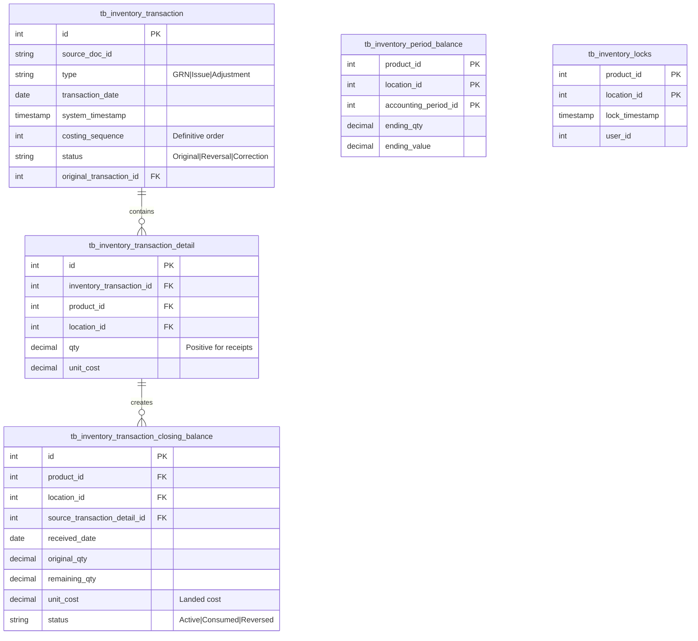
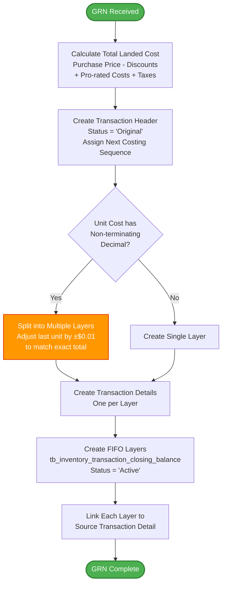
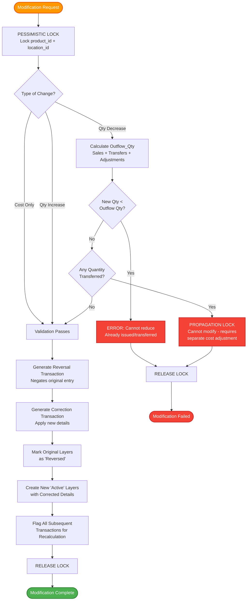
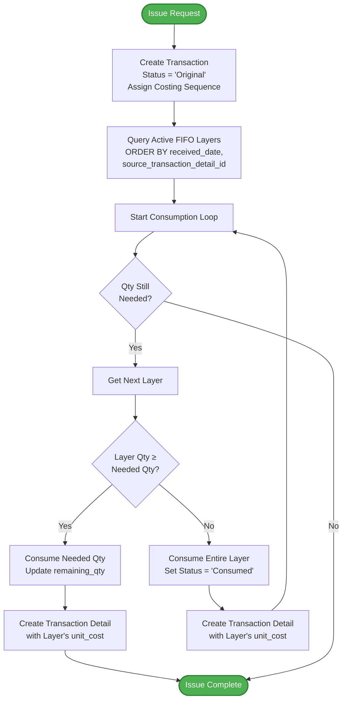
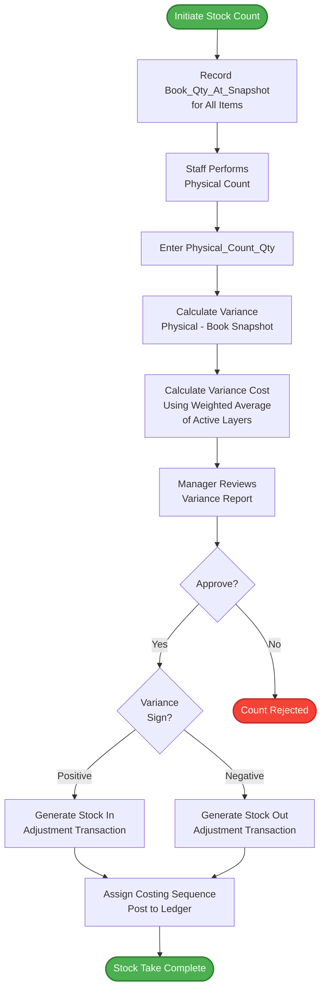
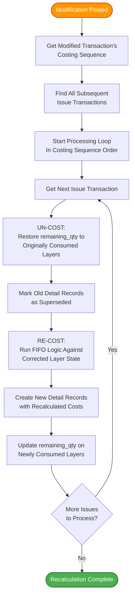
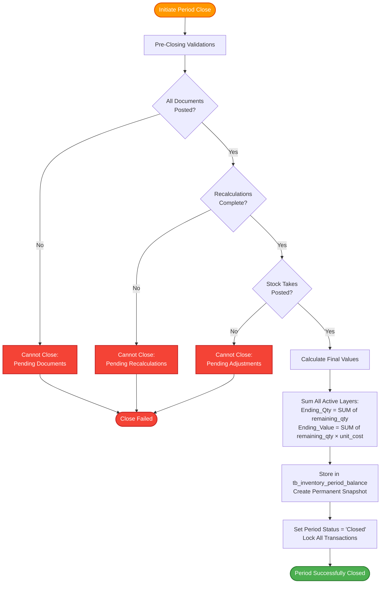
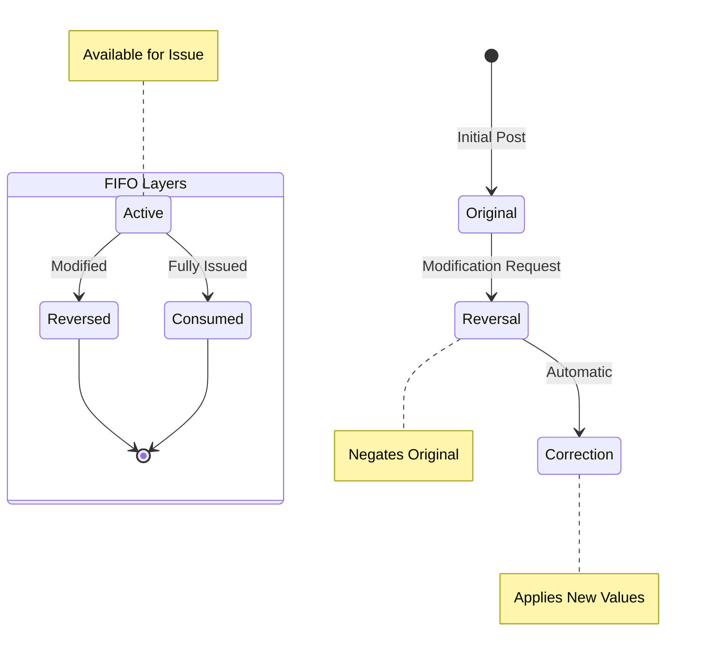

# FIFO Inventory Calculation Business Logic

## Document History

| Version | Date | Author | Changes |
|---------|------|--------|---------|
| 1.0.0 | 2025-11-19 | Documentation Team | Initial version |
## Overview

This document visualizes the comprehensive business logic for inventory management using the First-In, First-Out (FIFO) costing method. The system is built on three core pillars:
- **Immutable transaction logging**
- **Definitive costing sequence**
- **Systematic Reversal & Correction mechanism**

## Core Data Architecture

## Process A: Receiving Stock (GRN)

### Initial Receipt Process

### GRN Modification Process (Open Period Only)

## Process B: Issuing Stock (FIFO Consumption)

## Process C: Physical Inventory Count (Stock Take)

## Process D: FIFO Recalculation Engine

## Process E: End of Period Closing

## Key System Rules

### 1. Costing Sequence Supremacy
- **Costing sequence** (not transaction date) determines processing order
- Each item/location combination has its own sequence
- Sequence is unbreakable and chronological

### 2. Modification Safeguards
- **Pessimistic Locking**: Prevents concurrent modifications
- **Propagation Lock**: Blocks modifications if items were transferred
- **Quantity Validation**: Cannot reduce below already-consumed quantity

### 3. Audit Trail Preservation
- Original transactions are **never deleted**
- Modifications create Reversal + Correction pairs
- Complete traceability maintained

### 4. Period Management
- **Open Periods**: Allow modifications with full recalculation
- **Closed Periods**: Completely immutable, no backdating allowed
- Closing is **irreversible**

## Transaction Status Flow

This comprehensive system ensures:
- **Data Integrity**: Through immutable logging and controlled modifications
- **Accuracy**: Via automatic recalculation of all affected transactions
- **Auditability**: Complete transaction history with reversal/correction pairs
- **Performance**: Through pessimistic locking and sequential processing